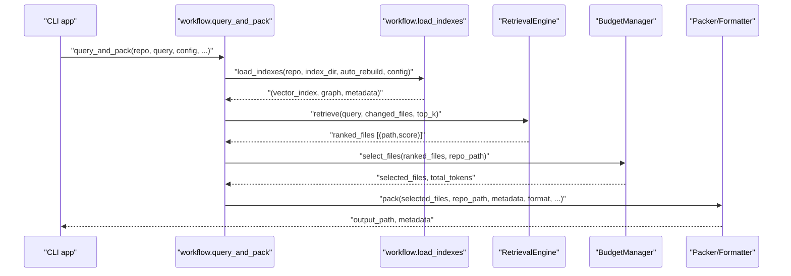
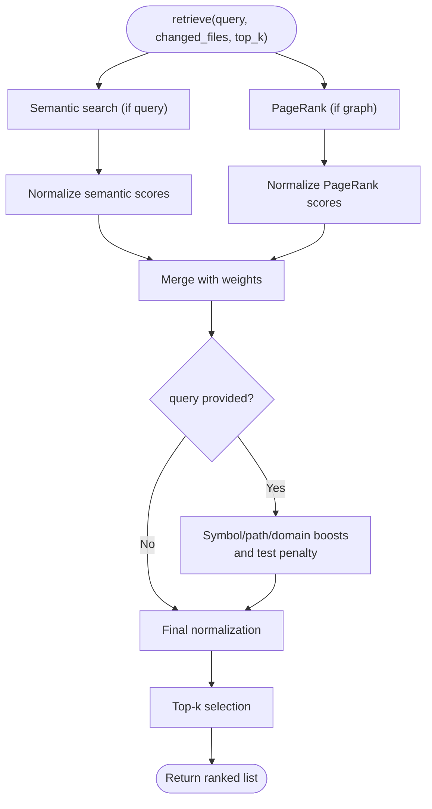
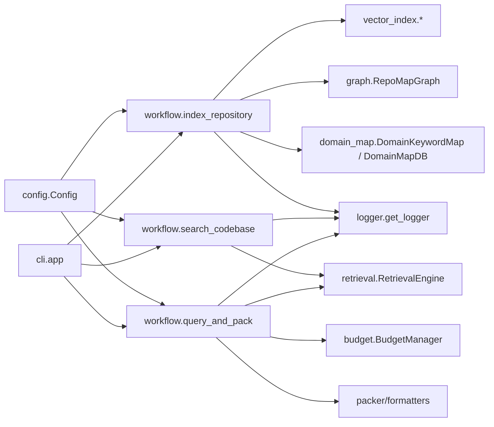

# API Reference

<cite>
**Referenced Files in This Document**
- [__init__.py](file://src/ws_ctx_engine/__init__.py)
- [models.py](file://src/ws_ctx_engine/models/models.py)
- [config.py](file://src/ws_ctx_engine/config/config.py)
- [logger.py](file://src/ws_ctx_engine/logger/logger.py)
- [base.py](file://src/ws_ctx_engine/chunker/base.py)
- [__init__.py](file://src/ws_ctx_engine/chunker/__init__.py)
- [retrieval.py](file://src/ws_ctx_engine/retrieval/retrieval.py)
- [budget.py](file://src/ws_ctx_engine/budget/budget.py)
- [cli.py](file://src/ws_ctx_engine/cli/cli.py)
- [indexer.py](file://src/ws_ctx_engine/workflow/indexer.py)
- [query.py](file://src/ws_ctx_engine/workflow/query.py)
- [base.py](file://src/ws_ctx_engine/chunker/resolvers/base.py)
</cite>

## Table of Contents
1. [Introduction](#introduction)
2. [Project Structure](#project-structure)
3. [Core Components](#core-components)
4. [Architecture Overview](#architecture-overview)
5. [Detailed Component Analysis](#detailed-component-analysis)
6. [Dependency Analysis](#dependency-analysis)
7. [Performance Considerations](#performance-considerations)
8. [Troubleshooting Guide](#troubleshooting-guide)
9. [Conclusion](#conclusion)
10. [Appendices](#appendices)

## Introduction
This document provides a comprehensive API reference for the ws-ctx-engine Python package. It covers public classes, functions, and modules exposed by the package, including their signatures, parameters, return values, error conditions, and usage patterns. It also documents core data models (CodeChunk, Config, WsCtxEngineLogger), retrieval and budgeting APIs, and the CLI entry points. Guidance on thread safety, resource management, performance characteristics, and integration patterns is included.

## Project Structure
The package exposes a focused public API surface via the main module’s __all__ exports. The core functionality is organized into subsystems:
- Data models: CodeChunk, IndexMetadata
- Configuration: Config
- Logging: WsCtxEngineLogger, get_logger
- Chunking: ASTChunker, parse_with_fallback, resolvers
- Retrieval: RetrievalEngine
- Budgeting: BudgetManager
- Workflow: index_repository, load_indexes, search_codebase, query_and_pack
- CLI: Typer app with commands for index, search, query, pack, status, vacuum, reindex_domain, init-config

```mermaid
graph TB
subgraph "Public API Surface"
A["ws_ctx_engine.__init__<br/>Exports"]
end
subgraph "Core Models"
M1["models.CodeChunk"]
M2["models.IndexMetadata"]
end
subgraph "Configuration"
C1["config.Config"]
end
subgraph "Logging"
L1["logger.WsCtxEngineLogger"]
L2["logger.get_logger"]
end
subgraph "Chunking"
CH1["chunker.ASTChunker"]
CH2["chunker.parse_with_fallback"]
CH3["chunker.resolvers.LanguageResolver"]
end
subgraph "Retrieval"
R1["retrieval.RetrievalEngine"]
end
subgraph "Budgeting"
B1["budget.BudgetManager"]
end
subgraph "Workflow"
W1["workflow.index_repository"]
W2["workflow.load_indexes"]
W3["workflow.search_codebase"]
W4["workflow.query_and_pack"]
end
subgraph "CLI"
CLI1["cli.app<br/>commands: index, search, query, pack, status, vacuum, reindex_domain, init-config"]
end
A --> M1
A --> M2
A --> C1
A --> L1
A --> L2
A --> CH1
A --> CH2
A --> CH3
A --> R1
A --> B1
A --> W1
A --> W2
A --> W3
A --> W4
A --> CLI1
```

**Diagram sources**
- [__init__.py:22-32](file://src/ws_ctx_engine/__init__.py#L22-L32)
- [models.py:10-84](file://src/ws_ctx_engine/models/models.py#L10-L84)
- [config.py:16-215](file://src/ws_ctx_engine/config/config.py#L16-L215)
- [logger.py:13-145](file://src/ws_ctx_engine/logger/logger.py#L13-L145)
- [base.py:41-44](file://src/ws_ctx_engine/chunker/base.py#L41-L44)
- [__init__.py:17-38](file://src/ws_ctx_engine/chunker/__init__.py#L17-L38)
- [base.py:7-70](file://src/ws_ctx_engine/chunker/resolvers/base.py#L7-L70)
- [retrieval.py:140-244](file://src/ws_ctx_engine/retrieval/retrieval.py#L140-L244)
- [budget.py:8-105](file://src/ws_ctx_engine/budget/budget.py#L8-L105)
- [indexer.py:72-371](file://src/ws_ctx_engine/workflow/indexer.py#L72-L371)
- [query.py:158-227](file://src/ws_ctx_engine/workflow/query.py#L158-L227)
- [query.py:230-617](file://src/ws_ctx_engine/workflow/query.py#L230-L617)
- [cli.py:27-36](file://src/ws_ctx_engine/cli/cli.py#L27-L36)

**Section sources**
- [__init__.py:22-32](file://src/ws_ctx_engine/__init__.py#L22-L32)

## Core Components
This section documents the primary public classes and functions, focusing on their roles, parameters, and behaviors.

- CodeChunk
  - Purpose: Encapsulates a parsed code segment with metadata (path, line range, content, symbols defined/referenced, language).
  - Key methods: to_dict, from_dict, token_count.
  - Typical usage: Produced by chunkers; consumed by retrieval, vector index, and packers.

- IndexMetadata
  - Purpose: Stores index creation metadata and detects staleness by comparing file hashes.
  - Key method: is_stale(repo_path) returns True if any indexed file is missing or modified.

- Config
  - Purpose: Central configuration loaded from .ws-ctx-engine.yaml with validation and defaults.
  - Key fields: format, token_budget, output_path, semantic_weight, pagerank_weight, include_tests, respect_gitignore, include_patterns, exclude_patterns, backends, embeddings, performance, ai_rules.
  - Key method: Config.load(path) validates and constructs a Config instance.

- WsCtxEngineLogger
  - Purpose: Structured logging with dual handlers (console and file), formatted messages, and convenience methods for fallbacks, phases, and errors.
  - Key methods: log_fallback, log_phase, log_error, debug, info, warning, error.
  - Global accessor: get_logger(log_dir) returns a singleton logger instance.

- ASTChunker
  - Purpose: Abstract interface for AST-based chunking; concrete implementations are provided by chunker modules.
  - Method signature: parse(repo_path: str, config: Any = None) -> list[CodeChunk].

- parse_with_fallback
  - Purpose: Attempts TreeSitterChunker; falls back to RegexChunker if unavailable or failing.
  - Signature: parse_with_fallback(repo_path: str, config: Any = None) -> list.

- RetrievalEngine
  - Purpose: Hybrid retrieval combining semantic search and structural ranking (PageRank), with symbol/path/domain boosts and test-file penalties.
  - Constructor parameters: vector_index, graph, semantic_weight, pagerank_weight, symbol_boost, path_boost, domain_boost, test_penalty, domain_map, config.
  - Method: retrieve(query: str | None = None, changed_files: list[str] | None = None, top_k: int = 100) -> list[tuple[str, float]].

- BudgetManager
  - Purpose: Greedy knapsack selection of files within a token budget (reserving ~20% for metadata).
  - Constructor parameters: token_budget: int, encoding: str = "cl100k_base".
  - Method: select_files(ranked_files: list[tuple[str, float]], repo_path: str) -> tuple[list[str], int].

- Workflow functions
  - index_repository(repo_path: str, config: Config | None = None, index_dir: str = ".ws-ctx-engine", domain_only: bool = False, incremental: bool = False) -> PerformanceTracker
  - load_indexes(repo_path: str, index_dir: str = ".ws-ctx-engine", auto_rebuild: bool = True, config: Config | None = None) -> tuple[VectorIndex, RepoMapGraph, IndexMetadata]
  - search_codebase(repo_path: str, query: str, config: Config | None = None, limit: int = 10, domain_filter: str | None = None, index_dir: str = ".ws-ctx-engine") -> tuple[list[dict], dict]
  - query_and_pack(repo_path: str, query: str | None = None, changed_files: list[str] | None = None, config: Config | None = None, index_dir: str = ".ws-ctx-engine", secrets_scan: bool = False, compress: bool = False, shuffle: bool = True, agent_phase: str | None = None, session_id: str | None = None) -> tuple[str, dict]

- CLI app
  - Commands: index, search, query, pack, status, vacuum, reindex_domain, init-config.
  - Global options: --version/-V, --agent-mode, --quiet/--no-quiet.
  - Rich output and NDJSON emission in agent mode.

**Section sources**
- [models.py:10-152](file://src/ws_ctx_engine/models/models.py#L10-L152)
- [config.py:16-399](file://src/ws_ctx_engine/config/config.py#L16-L399)
- [logger.py:13-145](file://src/ws_ctx_engine/logger/logger.py#L13-L145)
- [base.py:41-44](file://src/ws_ctx_engine/chunker/base.py#L41-L44)
- [__init__.py:17-38](file://src/ws_ctx_engine/chunker/__init__.py#L17-L38)
- [retrieval.py:140-369](file://src/ws_ctx_engine/retrieval/retrieval.py#L140-L369)
- [budget.py:8-105](file://src/ws_ctx_engine/budget/budget.py#L8-L105)
- [indexer.py:72-371](file://src/ws_ctx_engine/workflow/indexer.py#L72-L371)
- [query.py:158-227](file://src/ws_ctx_engine/workflow/query.py#L158-L227)
- [query.py:230-617](file://src/ws_ctx_engine/workflow/query.py#L230-L617)
- [cli.py:27-36](file://src/ws_ctx_engine/cli/cli.py#L27-L36)

## Architecture Overview
The system orchestrates indexing, retrieval, and packaging into a context suitable for LLM consumption. The CLI coordinates workflow steps, while internal modules handle parsing, indexing, ranking, budgeting, and output generation.

**Diagram sources**
- [cli.py:697-932](file://src/ws_ctx_engine/cli/cli.py#L697-L932)
- [query.py:230-617](file://src/ws_ctx_engine/workflow/query.py#L230-L617)
- [indexer.py:404-493](file://src/ws_ctx_engine/workflow/indexer.py#L404-L493)
- [retrieval.py:250-369](file://src/ws_ctx_engine/retrieval/retrieval.py#L250-L369)
- [budget.py:50-105](file://src/ws_ctx_engine/budget/budget.py#L50-L105)

## Detailed Component Analysis

### Data Models

#### CodeChunk
- Properties
  - path: str
  - start_line: int
  - end_line: int
  - content: str
  - symbols_defined: list[str]
  - symbols_referenced: list[str]
  - language: str
- Methods
  - to_dict() -> dict
  - from_dict(data: dict) -> CodeChunk
  - token_count(encoding: Any) -> int
- Notes
  - token_count depends on tiktoken encoding; ensure a compatible encoding instance is passed.

**Section sources**
- [models.py:10-84](file://src/ws_ctx_engine/models/models.py#L10-L84)

#### IndexMetadata
- Properties
  - created_at: datetime
  - repo_path: str
  - file_count: int
  - backend: str
  - file_hashes: dict[str, str]
- Methods
  - is_stale(repo_path: str) -> bool
- Notes
  - is_stale compares stored hashes with current file content and returns True if any file is missing or changed.

**Section sources**
- [models.py:87-152](file://src/ws_ctx_engine/models/models.py#L87-L152)

#### Config
- Validation and defaults
  - format: one of "xml","zip","json","yaml","md","toon"; default "zip"
  - token_budget: positive int; default 100000
  - output_path: str; default "./output"
  - semantic_weight, pagerank_weight: floats in [0,1], must sum to 1.0 (warns if not)
  - include_tests: bool; respect_gitignore: bool
  - include_patterns, exclude_patterns: lists of glob patterns
  - backends: dict with keys "vector_index","graph","embeddings"
  - embeddings: model, device, batch_size, api_provider, api_key_env
  - performance: max_workers, cache_embeddings, incremental_index
  - ai_rules: auto_detect, extra_files, boost
- Methods
  - Config.load(path: str = ".ws-ctx-engine.yaml") -> Config

**Section sources**
- [config.py:16-399](file://src/ws_ctx_engine/config/config.py#L16-L399)

#### WsCtxEngineLogger
- Initialization
  - WsCtxEngineLogger(log_dir: str = ".ws-ctx-engine/logs", name: str = "ws_ctx_engine")
- Methods
  - log_fallback(component: str, primary: str, fallback: str, reason: str) -> None
  - log_phase(phase: str, duration: float, **metrics) -> None
  - log_error(error: Exception, context: dict[str, Any] | None = None) -> None
  - debug/info/warning/error(message: str) -> None
- Global accessor
  - get_logger(log_dir: str = ".ws-ctx-engine/logs") -> WsCtxEngineLogger

**Section sources**
- [logger.py:13-145](file://src/ws_ctx_engine/logger/logger.py#L13-L145)

### Chunking and Resolvers

#### ASTChunker
- Abstract interface for AST-based parsing.
- parse(repo_path: str, config: Any = None) -> list[CodeChunk]

**Section sources**
- [base.py:41-44](file://src/ws_ctx_engine/chunker/base.py#L41-L44)

#### parse_with_fallback
- Attempts TreeSitterChunker; falls back to RegexChunker on ImportError or generic exceptions.
- Signature: parse_with_fallback(repo_path: str, config: Any = None) -> list

**Section sources**
- [__init__.py:17-38](file://src/ws_ctx_engine/chunker/__init__.py#L17-L38)

#### LanguageResolver
- Abstract base for language-specific resolvers.
- Properties and methods:
  - language: str
  - target_types: set[str]
  - file_extensions: list[str]
  - extract_symbol_name(node: Any) -> str | None
  - extract_references(node: Any) -> list[str]
  - should_extract(node_type: str) -> bool
  - node_to_chunk(node: Any, content: str, file_path: str) -> CodeChunk | None

**Section sources**
- [base.py:7-70](file://src/ws_ctx_engine/chunker/resolvers/base.py#L7-L70)

### Retrieval Engine

#### RetrievalEngine
- Constructor parameters:
  - vector_index: VectorIndex
  - graph: RepoMapGraph
  - semantic_weight: float in [0,1]
  - pagerank_weight: float in [0,1]
  - symbol_boost: float
  - path_boost: float
  - domain_boost: float
  - test_penalty: float in [0,1]
  - domain_map: Any (optional)
  - config: Any (optional)
- Validation
  - Raises ValueError if weights are out of range or do not sum to 1.0.
- Method: retrieve(query: str | None = None, changed_files: list[str] | None = None, top_k: int = 100) -> list[tuple[str, float]]
- Behavior highlights
  - Merges semantic and PageRank scores, applies symbol/path/domain boosts, test penalty, and normalizes to [0,1].
  - Applies AI rule boost to prioritized files.
  - Logs query type classification and effective weights.

**Diagram sources**
- [retrieval.py:250-369](file://src/ws_ctx_engine/retrieval/retrieval.py#L250-L369)

**Section sources**
- [retrieval.py:140-369](file://src/ws_ctx_engine/retrieval/retrieval.py#L140-L369)

### Budget Management

#### BudgetManager
- Constructor parameters:
  - token_budget: int (>0)
  - encoding: str (tiktoken encoding name)
- Method: select_files(ranked_files: list[tuple[str, float]], repo_path: str) -> tuple[list[str], int]
- Behavior
  - Uses greedy knapsack to select files up to 80% of content budget.
  - Reads file content and counts tokens via tiktoken.
  - Skips unreadable files and stops when budget is exceeded.

**Section sources**
- [budget.py:8-105](file://src/ws_ctx_engine/budget/budget.py#L8-L105)

### Workflow APIs

#### index_repository
- Builds and persists indexes: parsing, vector index, graph, metadata, domain map.
- Supports incremental mode and embedding cache reuse.
- Returns PerformanceTracker with metrics.

**Section sources**
- [indexer.py:72-371](file://src/ws_ctx_engine/workflow/indexer.py#L72-L371)

#### load_indexes
- Loads persisted indexes and metadata, with staleness detection and optional auto-rebuild.
- Returns (VectorIndex, RepoMapGraph, IndexMetadata).

**Section sources**
- [indexer.py:404-493](file://src/ws_ctx_engine/workflow/indexer.py#L404-L493)

#### search_codebase
- Loads indexes, constructs RetrievalEngine, retrieves ranked files, filters by domain if requested.
- Returns results list and index health metadata.

**Section sources**
- [query.py:158-227](file://src/ws_ctx_engine/workflow/query.py#L158-L227)

#### query_and_pack
- Full pipeline: load indexes, retrieve, select within budget, pack output in configured format.
- Supports secrets scanning, compression, deduplication, shuffling, and agent-phase weighting.
- Returns (output_path, metadata dict with total_tokens, file_count, tracker).

**Section sources**
- [query.py:230-617](file://src/ws_ctx_engine/workflow/query.py#L230-L617)

### CLI

#### Commands and Options
- index: Build indexes for a repository; supports verbose, incremental, and config overrides.
- search: Rank files by hybrid retrieval; supports limit, domain filter, and agent mode.
- query: Search and pack output; supports format, budget, secrets scan, compress, shuffle, mode, session dedup.
- pack: Full workflow (index if needed, then search/pack); supports changed-files, mode, dedup.
- status: Show index statistics and health.
- vacuum: Optimize domain map database.
- reindex_domain: Rebuild domain map only.
- init-config: Generate smart configuration with backend choices and gitignore integration.

**Section sources**
- [cli.py:405-1558](file://src/ws_ctx_engine/cli/cli.py#L405-L1558)

## Dependency Analysis
The following diagram shows key internal dependencies among major components.

**Diagram sources**
- [config.py:16-399](file://src/ws_ctx_engine/config/config.py#L16-L399)
- [indexer.py:72-371](file://src/ws_ctx_engine/workflow/indexer.py#L72-L371)
- [query.py:158-227](file://src/ws_ctx_engine/workflow/query.py#L158-L227)
- [query.py:230-617](file://src/ws_ctx_engine/workflow/query.py#L230-L617)
- [cli.py:27-36](file://src/ws_ctx_engine/cli/cli.py#L27-L36)

**Section sources**
- [indexer.py:72-371](file://src/ws_ctx_engine/workflow/indexer.py#L72-L371)
- [query.py:158-227](file://src/ws_ctx_engine/workflow/query.py#L158-L227)
- [query.py:230-617](file://src/ws_ctx_engine/workflow/query.py#L230-L617)
- [cli.py:27-36](file://src/ws_ctx_engine/cli/cli.py#L27-L36)

## Performance Considerations
- Token accounting: CodeChunk.token_count and BudgetManager use tiktoken encodings; choose an appropriate encoding for your target model.
- Incremental indexing: Enabled via config.performance.incremental_index and function parameter; leverages embedding cache and partial updates when available.
- Memory tracking: PerformanceTracker records metrics across phases; use tracker.format_metrics for diagnostics.
- Output formats: Binary formats (zip) avoid content serialization overhead; text formats (xml/json/yaml/md/toon) incur IO and serialization costs.
- Shuffling: XML shuffling improves recall for certain models; consider enabling for XML output.

[No sources needed since this section provides general guidance]

## Troubleshooting Guide
- Configuration validation
  - Invalid types/values are coerced to defaults with logged warnings; verify effective settings.
  - Weights must sum to 1.0; a warning is emitted if not met.
- Index staleness
  - load_indexes detects missing or modified files and can auto-rebuild; disable auto-rebuild to inspect stale indexes.
- CLI error handling
  - Repository path existence and directory checks raise typer.Exit with error payloads.
  - Dependency preflight validates backend availability; install recommended extras if missing.
- Logging
  - Use get_logger to obtain a logger; WsCtxEngineLogger provides structured logs with dual handlers.

**Section sources**
- [config.py:112-215](file://src/ws_ctx_engine/config/config.py#L112-L215)
- [indexer.py:404-493](file://src/ws_ctx_engine/workflow/indexer.py#L404-L493)
- [cli.py:437-501](file://src/ws_ctx_engine/cli/cli.py#L437-L501)
- [cli.py:547-644](file://src/ws_ctx_engine/cli/cli.py#L547-L644)
- [cli.py:828-932](file://src/ws_ctx_engine/cli/cli.py#L828-L932)
- [cli.py:1070-1196](file://src/ws_ctx_engine/cli/cli.py#L1070-L1196)
- [logger.py:131-145](file://src/ws_ctx_engine/logger/logger.py#L131-L145)

## Conclusion
The ws-ctx-engine API provides a cohesive pipeline for intelligent codebase context packaging. Its public surface centers on data models, configuration, logging, chunking, retrieval, budgeting, workflow orchestration, and a robust CLI. By leveraging validation, incremental indexing, and structured logging, users can integrate ws-ctx-engine into automated workflows and agent systems reliably.

[No sources needed since this section summarizes without analyzing specific files]

## Appendices

### Backward Compatibility and Deprecations
- Experimental fields
  - Some fields in Config are labeled experimental and parsed but not yet acted upon; they are retained for forward compatibility.
- Versioning
  - __version__ is derived from package metadata; ensure consistent installation environments.

**Section sources**
- [config.py:18-26](file://src/ws_ctx_engine/config/config.py#L18-L26)
- [__init__.py:15-21](file://src/ws_ctx_engine/__init__.py#L15-L21)

### Thread Safety and Resource Management
- Thread safety
  - Core data models (CodeChunk, IndexMetadata) are immutable-like dataclasses; they are safe to share across threads.
  - RetrievalEngine, BudgetManager, and workflow functions operate on local state; they are not inherently thread-safe for concurrent writes.
- Resource management
  - CLI commands manage temporary resources and logging handlers; long-running processes should initialize and close resources explicitly (e.g., DomainMapDB connections).
  - Embedding caches and vector/graph index persistence are handled internally; ensure adequate disk space and permissions.

[No sources needed since this section provides general guidance]

### Usage Examples

- Basic retrieval and packing
  - Steps: index_repository -> query_and_pack -> inspect output metadata.
  - See [query_and_pack:230-617](file://src/ws_ctx_engine/workflow/query.py#L230-L617) and [index_repository:72-371](file://src/ws_ctx_engine/workflow/indexer.py#L72-L371).

- Using RetrievalEngine directly
  - Construct vector_index and graph, then call retrieve(query, changed_files, top_k).
  - See [RetrievalEngine.retrieve:250-369](file://src/ws_ctx_engine/retrieval/retrieval.py#L250-L369).

- Budget-aware selection
  - Use BudgetManager to select files within token budget after ranking.
  - See [BudgetManager.select_files:50-105](file://src/ws_ctx_engine/budget/budget.py#L50-L105).

- CLI integration
  - Use commands index/search/query/pack/status/vacuum/reindex_domain/init-config.
  - See [cli commands:405-1558](file://src/ws_ctx_engine/cli/cli.py#L405-L1558).

[No sources needed since this section aggregates references already cited above]