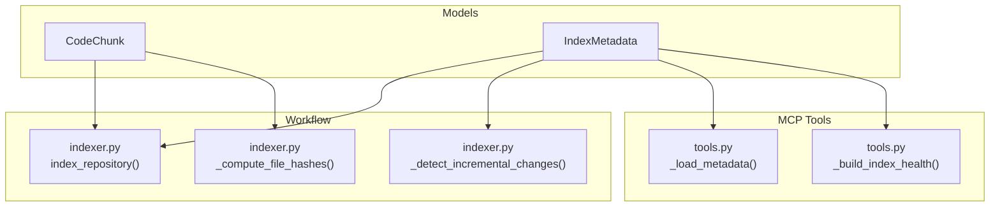
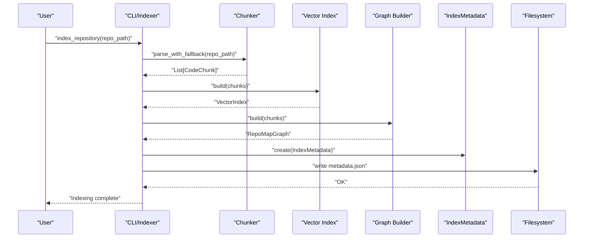
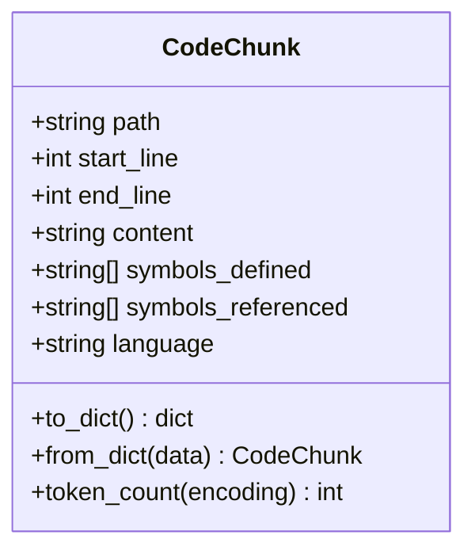
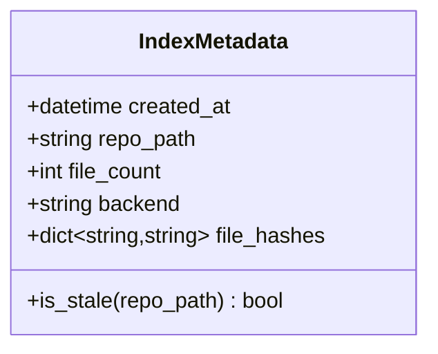
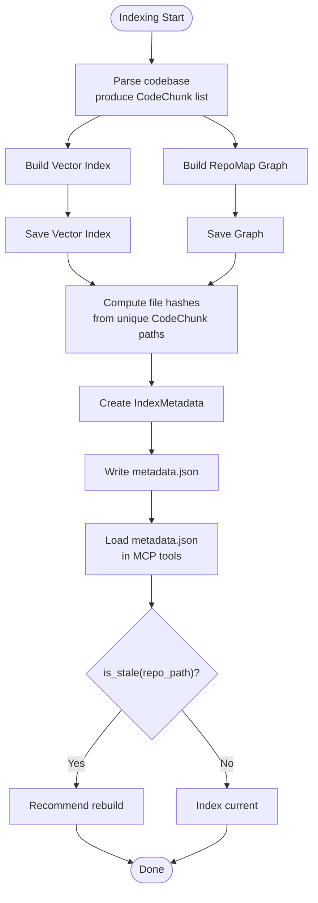
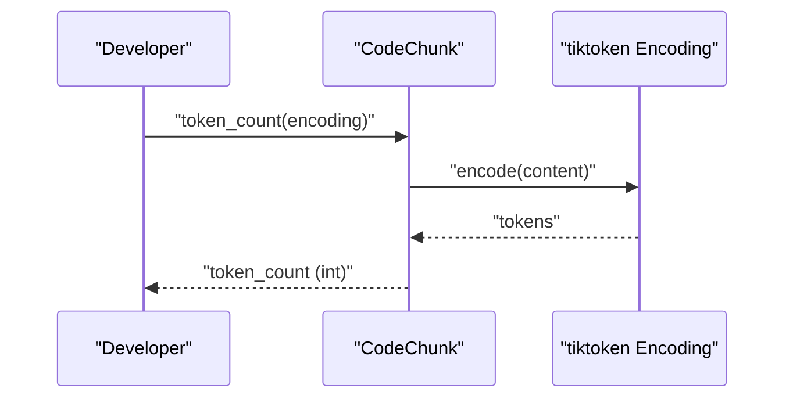
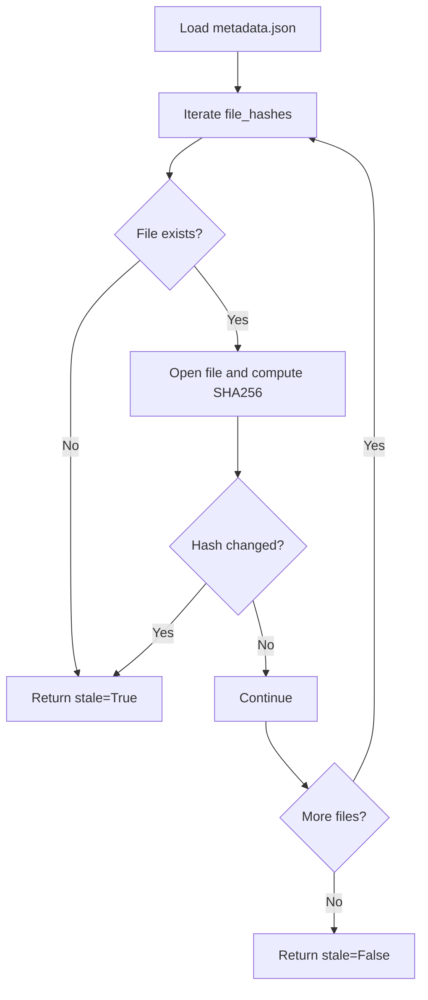
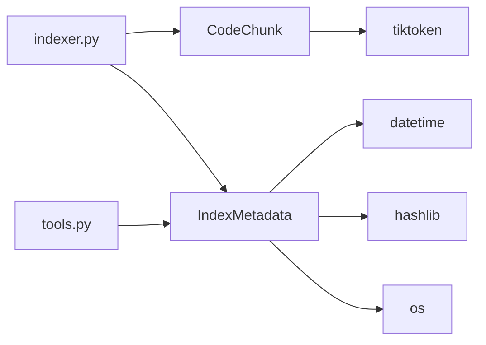

# Core Data Models

<cite>
**Referenced Files in This Document**
- [models.py](file://src/ws_ctx_engine/models/models.py)
- [indexer.py](file://src/ws_ctx_engine/workflow/indexer.py)
- [tools.py](file://src/ws_ctx_engine/mcp/tools.py)
- [codechunk_demo.py](file://examples/codechunk_demo.py)
- [test_models.py](file://tests/unit/test_models.py)
</cite>

## Table of Contents
1. [Introduction](#introduction)
2. [Project Structure](#project-structure)
3. [Core Components](#core-components)
4. [Architecture Overview](#architecture-overview)
5. [Detailed Component Analysis](#detailed-component-analysis)
6. [Dependency Analysis](#dependency-analysis)
7. [Performance Considerations](#performance-considerations)
8. [Troubleshooting Guide](#troubleshooting-guide)
9. [Conclusion](#conclusion)

## Introduction
This document provides comprehensive documentation for the core data models used by ws-ctx-engine: CodeChunk and IndexMetadata. It explains their attributes, methods, serialization patterns, token counting mechanisms, and staleness detection algorithms. Practical usage examples demonstrate how these models are used throughout the codebase for data interchange and persistence.

## Project Structure
The core data models live under the models package and are consumed by multiple subsystems:
- Workflow pipeline for indexing repositories
- Vector index and graph builders
- MCP tooling for health checks and metadata loading
- Unit tests validating behavior
- Example scripts demonstrating usage

**Diagram sources**
- [models.py:10-151](file://src/ws_ctx_engine/models/models.py#L10-L151)
- [indexer.py:27-69](file://src/ws_ctx_engine/workflow/indexer.py#L27-L69)
- [indexer.py:283-328](file://src/ws_ctx_engine/workflow/indexer.py#L283-L328)
- [indexer.py:374-399](file://src/ws_ctx_engine/workflow/indexer.py#L374-L399)
- [tools.py:401-439](file://src/ws_ctx_engine/mcp/tools.py#L401-L439)

**Section sources**
- [models.py:10-151](file://src/ws_ctx_engine/models/models.py#L10-L151)
- [indexer.py:27-69](file://src/ws_ctx_engine/workflow/indexer.py#L27-L69)
- [indexer.py:283-328](file://src/ws_ctx_engine/workflow/indexer.py#L283-L328)
- [indexer.py:374-399](file://src/ws_ctx_engine/workflow/indexer.py#L374-L399)
- [tools.py:401-439](file://src/ws_ctx_engine/mcp/tools.py#L401-L439)

## Core Components
This section documents the two primary data models and their roles in the system.

- CodeChunk: Represents a parsed code segment with metadata such as path, line range, content, defined and referenced symbols, and language. Provides serialization to/from dict and token counting using tiktoken.
- IndexMetadata: Stores index creation metadata including timestamps, repository path, file count, backend identifier, and file hash map. Provides staleness detection by comparing stored hashes with current file content.

**Section sources**
- [models.py:10-84](file://src/ws_ctx_engine/models/models.py#L10-L84)
- [models.py:87-151](file://src/ws_ctx_engine/models/models.py#L87-L151)

## Architecture Overview
The models integrate with the indexing workflow and MCP tools as follows:
- CodeChunk instances are produced by chunkers and passed to vector index and graph builders.
- IndexMetadata is computed during indexing and persisted to metadata.json for staleness detection.
- MCP tools load metadata.json and compute index health, invoking staleness checks.

**Diagram sources**
- [indexer.py:72-371](file://src/ws_ctx_engine/workflow/indexer.py#L72-L371)
- [models.py:87-151](file://src/ws_ctx_engine/models/models.py#L87-L151)

## Detailed Component Analysis

### CodeChunk Model
CodeChunk encapsulates a code segment and its metadata. It supports:
- Serialization to a JSON-compatible dict via to_dict
- Deserialization from dict via from_dict
- Token counting using tiktoken encodings via token_count

Key attributes:
- path: Relative path from repository root
- start_line: Starting line number (1-indexed)
- end_line: Ending line number (inclusive)
- content: Raw source code content
- symbols_defined: Functions/classes defined in this chunk
- symbols_referenced: Imports and function calls
- language: Programming language (e.g., python, javascript)

Methods:
- to_dict(): Returns a dict suitable for JSON serialization and caching.
- from_dict(data): Creates a CodeChunk from a dict produced by to_dict.
- token_count(encoding): Counts tokens using a tiktoken encoding instance.

Usage examples:
- Creating a CodeChunk and printing attributes
- Computing token counts with different encodings
- Using from_dict to reconstruct a CodeChunk from persisted data

Practical references:
- [models.py:35-84](file://src/ws_ctx_engine/models/models.py#L35-L84)
- [codechunk_demo.py:9-62](file://examples/codechunk_demo.py#L9-L62)
- [test_models.py:13-201](file://tests/unit/test_models.py#L13-L201)

**Diagram sources**
- [models.py:10-84](file://src/ws_ctx_engine/models/models.py#L10-L84)

**Section sources**
- [models.py:10-84](file://src/ws_ctx_engine/models/models.py#L10-L84)
- [codechunk_demo.py:9-62](file://examples/codechunk_demo.py#L9-L62)
- [test_models.py:13-201](file://tests/unit/test_models.py#L13-L201)

### IndexMetadata Model
IndexMetadata stores index metadata for staleness detection and persistence. It includes:
- created_at: Timestamp when the index was created
- repo_path: Absolute path to the repository root
- file_count: Number of unique files indexed
- backend: String identifying the backend combination used
- file_hashes: Dict mapping file paths to SHA256 hashes

Method:
- is_stale(repo_path): Checks if any indexed file has been modified or deleted by comparing stored hashes with current file content.

Persistence:
- During indexing, metadata is serialized to metadata.json with ISO format for created_at and written alongside vector index and graph artifacts.
- MCP tools load metadata.json and compute index health, invoking is_stale to detect staleness.

Practical references:
- [models.py:87-151](file://src/ws_ctx_engine/models/models.py#L87-L151)
- [indexer.py:283-328](file://src/ws_ctx_engine/workflow/indexer.py#L283-L328)
- [indexer.py:374-399](file://src/ws_ctx_engine/workflow/indexer.py#L374-L399)
- [tools.py:401-439](file://src/ws_ctx_engine/mcp/tools.py#L401-L439)
- [test_models.py:203-390](file://tests/unit/test_models.py#L203-L390)

**Diagram sources**
- [models.py:87-151](file://src/ws_ctx_engine/models/models.py#L87-L151)

**Section sources**
- [models.py:87-151](file://src/ws_ctx_engine/models/models.py#L87-L151)
- [indexer.py:283-328](file://src/ws_ctx_engine/workflow/indexer.py#L283-L328)
- [indexer.py:374-399](file://src/ws_ctx_engine/workflow/indexer.py#L374-L399)
- [tools.py:401-439](file://src/ws_ctx_engine/mcp/tools.py#L401-L439)
- [test_models.py:203-390](file://tests/unit/test_models.py#L203-L390)

## Architecture Overview
The following diagram shows how CodeChunk and IndexMetadata participate in the indexing workflow and staleness detection:

**Diagram sources**
- [indexer.py:72-371](file://src/ws_ctx_engine/workflow/indexer.py#L72-L371)
- [indexer.py:283-328](file://src/ws_ctx_engine/workflow/indexer.py#L283-L328)
- [indexer.py:374-399](file://src/ws_ctx_engine/workflow/indexer.py#L374-L399)
- [tools.py:401-439](file://src/ws_ctx_engine/mcp/tools.py#L401-L439)
- [models.py:87-151](file://src/ws_ctx_engine/models/models.py#L87-L151)

## Detailed Component Analysis

### CodeChunk: Attributes, Methods, and Usage
- Attributes:
  - path: Relative path from repository root
  - start_line: Starting line number (1-indexed)
  - end_line: Ending line number (inclusive)
  - content: Raw source code content
  - symbols_defined: Functions/classes defined in this chunk
  - symbols_referenced: Imports and function calls
  - language: Programming language (e.g., python, javascript, typescript)
- Methods:
  - to_dict(): Returns a dict with all attributes for JSON serialization and caching.
  - from_dict(data): Reconstructs a CodeChunk from a dict produced by to_dict.
  - token_count(encoding): Counts tokens using a tiktoken encoding instance (e.g., cl100k_base). Returns an integer number of tokens.
- Usage examples:
  - Creating a CodeChunk with path, line range, content, symbols, and language
  - Computing token counts with different encodings
  - Demonstrating serialization/deserialization via to_dict/from_dict

References:
- [models.py:10-84](file://src/ws_ctx_engine/models/models.py#L10-L84)
- [codechunk_demo.py:9-62](file://examples/codechunk_demo.py#L9-L62)
- [test_models.py:13-201](file://tests/unit/test_models.py#L13-L201)

**Diagram sources**
- [models.py:60-84](file://src/ws_ctx_engine/models/models.py#L60-L84)

**Section sources**
- [models.py:10-84](file://src/ws_ctx_engine/models/models.py#L10-L84)
- [codechunk_demo.py:9-62](file://examples/codechunk_demo.py#L9-L62)
- [test_models.py:13-201](file://tests/unit/test_models.py#L13-L201)

### IndexMetadata: Staleness Detection and Persistence
- Attributes:
  - created_at: Timestamp when the index was created
  - repo_path: Absolute path to the repository root
  - file_count: Number of unique files indexed
  - backend: String identifying the backend combination used
  - file_hashes: Dict mapping file paths to SHA256 hashes
- Method:
  - is_stale(repo_path): Iterates over stored file_hashes, computes current hash for each file, and returns True if any file is missing or changed. Returns False otherwise.
- Persistence:
  - During indexing, metadata is serialized to metadata.json with ISO format for created_at and written alongside vector index and graph artifacts.
  - MCP tools load metadata.json and compute index health, invoking is_stale to detect staleness.

References:
- [models.py:87-151](file://src/ws_ctx_engine/models/models.py#L87-L151)
- [indexer.py:283-328](file://src/ws_ctx_engine/workflow/indexer.py#L283-L328)
- [indexer.py:374-399](file://src/ws_ctx_engine/workflow/indexer.py#L374-L399)
- [tools.py:401-439](file://src/ws_ctx_engine/mcp/tools.py#L401-L439)
- [test_models.py:203-390](file://tests/unit/test_models.py#L203-L390)

**Diagram sources**
- [models.py:108-151](file://src/ws_ctx_engine/models/models.py#L108-L151)
- [indexer.py:283-328](file://src/ws_ctx_engine/workflow/indexer.py#L283-L328)
- [indexer.py:374-399](file://src/ws_ctx_engine/workflow/indexer.py#L374-L399)
- [tools.py:401-439](file://src/ws_ctx_engine/mcp/tools.py#L401-L439)

**Section sources**
- [models.py:87-151](file://src/ws_ctx_engine/models/models.py#L87-L151)
- [indexer.py:283-328](file://src/ws_ctx_engine/workflow/indexer.py#L283-L328)
- [indexer.py:374-399](file://src/ws_ctx_engine/workflow/indexer.py#L374-L399)
- [tools.py:401-439](file://src/ws_ctx_engine/mcp/tools.py#L401-L439)
- [test_models.py:203-390](file://tests/unit/test_models.py#L203-L390)

## Dependency Analysis
- CodeChunk depends on:
  - tiktoken for token counting
  - dataclasses for serialization support
- IndexMetadata depends on:
  - datetime for timestamp handling
  - hashlib for SHA256 hashing
  - os for path joining and file existence checks
- Both models are consumed by:
  - Indexing workflow (parsing, vector index, graph, metadata saving)
  - MCP tools (loading metadata.json and computing health)

**Diagram sources**
- [models.py:3-7](file://src/ws_ctx_engine/models/models.py#L3-L7)
- [models.py:10-151](file://src/ws_ctx_engine/models/models.py#L10-L151)
- [indexer.py:72-371](file://src/ws_ctx_engine/workflow/indexer.py#L72-L371)
- [tools.py:401-439](file://src/ws_ctx_engine/mcp/tools.py#L401-L439)

**Section sources**
- [models.py:3-7](file://src/ws_ctx_engine/models/models.py#L3-L7)
- [models.py:10-151](file://src/ws_ctx_engine/models/models.py#L10-L151)
- [indexer.py:72-371](file://src/ws_ctx_engine/workflow/indexer.py#L72-L371)
- [tools.py:401-439](file://src/ws_ctx_engine/mcp/tools.py#L401-L439)

## Performance Considerations
- Token counting:
  - token_count uses tiktoken encoding.encode on content. For large repositories, consider batching or caching encodings to reduce overhead.
- Staleness detection:
  - is_stale iterates over all stored file_hashes and computes SHA256 for each file. For very large repos, this can be I/O bound. Consider limiting the number of files checked or using incremental detection strategies.
- Serialization:
  - to_dict produces a compact dict suitable for JSON. Ensure metadata.json remains small and readable by avoiding unnecessary fields.

[No sources needed since this section provides general guidance]

## Troubleshooting Guide
Common issues and resolutions:
- Token count returns zero:
  - Occurs when content is empty. Verify content is populated before calling token_count.
- Staleness detection returns True unexpectedly:
  - Check file permissions and read access. is_stale returns True if a file cannot be read.
  - Ensure metadata.json is not corrupted. Confirm created_at is a valid ISO string and file_hashes is a dict.
- Metadata loading failures in MCP tools:
  - _load_metadata catches exceptions and returns None. Verify metadata.json exists and is valid JSON.

References:
- [test_models.py:53-109](file://tests/unit/test_models.py#L53-L109)
- [test_models.py:248-290](file://tests/unit/test_models.py#L248-L290)
- [tools.py:401-420](file://src/ws_ctx_engine/mcp/tools.py#L401-L420)

**Section sources**
- [test_models.py:53-109](file://tests/unit/test_models.py#L53-L109)
- [test_models.py:248-290](file://tests/unit/test_models.py#L248-L290)
- [tools.py:401-420](file://src/ws_ctx_engine/mcp/tools.py#L401-L420)

## Conclusion
CodeChunk and IndexMetadata are central to ws-ctx-engine’s indexing and retrieval pipeline. CodeChunk carries parsed code segments and metadata, enabling token-aware processing and vector indexing. IndexMetadata enables persistent staleness detection by storing hashes of indexed files and creation metadata. Together, they support efficient, incremental indexing and reliable index health monitoring.