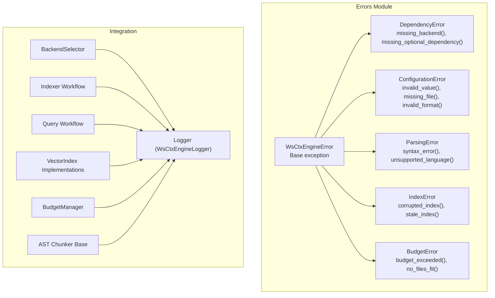
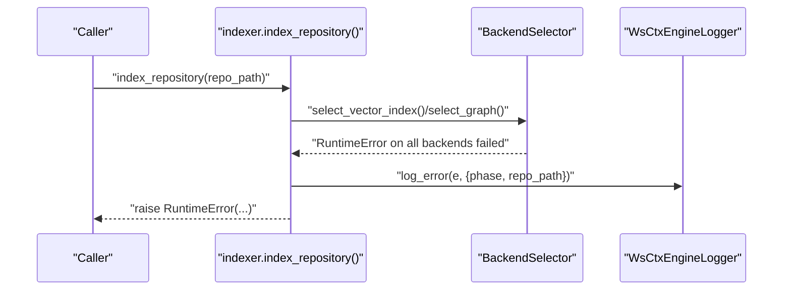
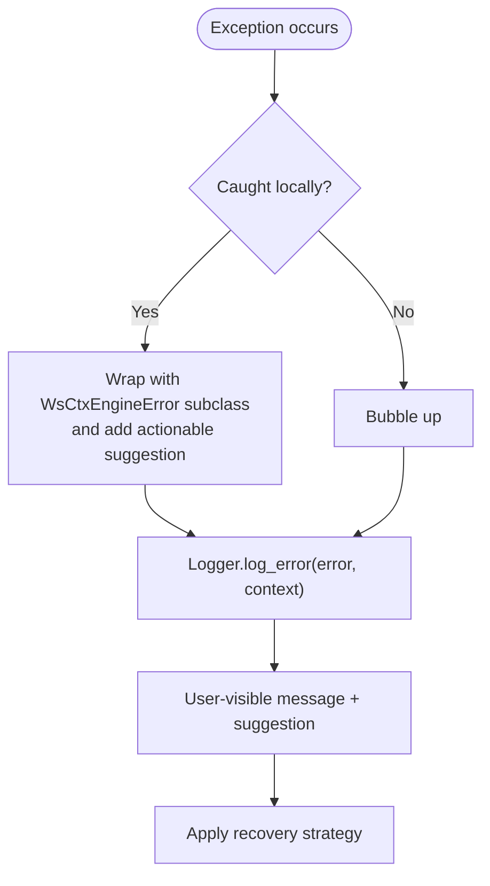
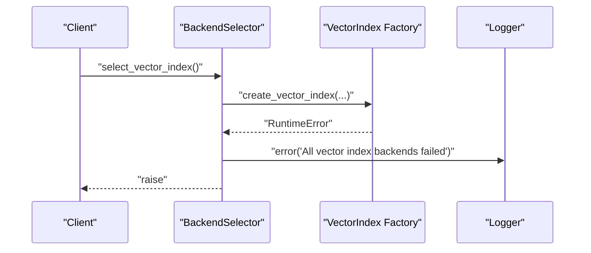
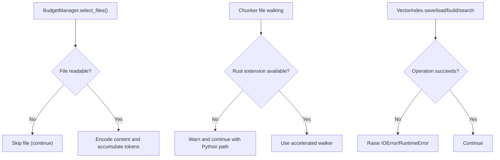
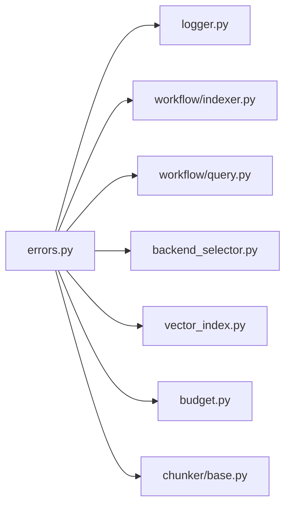

# Error Handling System

<cite>
**Referenced Files in This Document**
- [errors.py](file://src/ws_ctx_engine/errors/errors.py)
- [__init__.py](file://src/ws_ctx_engine/errors/__init__.py)
- [architecture.md](file://docs/reference/architecture.md)
- [logger.py](file://src/ws_ctx_engine/logger/logger.py)
- [backend_selector.py](file://src/ws_ctx_engine/backend_selector/backend_selector.py)
- [budget.py](file://src/ws_ctx_engine/budget/budget.py)
- [indexer.py](file://src/ws_ctx_engine/workflow/indexer.py)
- [query.py](file://src/ws_ctx_engine/workflow/query.py)
- [vector_index.py](file://src/ws_ctx_engine/vector_index/vector_index.py)
- [base.py](file://src/ws_ctx_engine/chunker/base.py)
</cite>

## Table of Contents
1. [Introduction](#introduction)
2. [Project Structure](#project-structure)
3. [Core Components](#core-components)
4. [Architecture Overview](#architecture-overview)
5. [Detailed Component Analysis](#detailed-component-analysis)
6. [Dependency Analysis](#dependency-analysis)
7. [Performance Considerations](#performance-considerations)
8. [Troubleshooting Guide](#troubleshooting-guide)
9. [Conclusion](#conclusion)

## Introduction
This document describes the ws-ctx-engine error handling system. It documents the custom exception hierarchy, error categories, typical use cases, suggested recovery strategies, and how errors propagate through the system. It also covers logging integration, debugging techniques, and practical patterns for graceful degradation.

## Project Structure
The error handling system centers around a small set of custom exception classes defined in the errors module, with broad integration across workflows, logging, and backend selection.

**Diagram sources**
- [errors.py:10-320](file://src/ws_ctx_engine/errors/errors.py#L10-L320)
- [logger.py:13-145](file://src/ws_ctx_engine/logger/logger.py#L13-L145)
- [backend_selector.py:13-191](file://src/ws_ctx_engine/backend_selector/backend_selector.py#L13-L191)
- [indexer.py:72-493](file://src/ws_ctx_engine/workflow/indexer.py#L72-L493)
- [query.py:230-617](file://src/ws_ctx_engine/workflow/query.py#L230-L617)
- [vector_index.py:21-800](file://src/ws_ctx_engine/vector_index/vector_index.py#L21-L800)
- [budget.py:8-105](file://src/ws_ctx_engine/budget/budget.py#L8-L105)
- [base.py:41-176](file://src/ws_ctx_engine/chunker/base.py#L41-L176)

**Section sources**
- [errors.py:10-320](file://src/ws_ctx_engine/errors/errors.py#L10-L320)
- [__init__.py:1-24](file://src/ws_ctx_engine/errors/__init__.py#L1-L24)

## Core Components
- WsCtxEngineError: Base exception carrying both a message and a suggestion for recovery.
- DependencyError: Missing required or optional dependencies; factory helpers provide installation guidance.
- ConfigurationError: Invalid configuration values, missing files, or invalid output formats.
- ParsingError: Source parsing failures (syntax errors, unsupported languages).
- IndexError: Index corruption or staleness; provides rebuild guidance.
- BudgetError: Token budget exceeded or no files fit within budget; suggests configuration adjustments.

These classes are exported via the errors package’s public API and aliased for backward compatibility.

**Section sources**
- [errors.py:10-320](file://src/ws_ctx_engine/errors/errors.py#L10-L320)
- [__init__.py:1-24](file://src/ws_ctx_engine/errors/__init__.py#L1-L24)
- [architecture.md:689-737](file://docs/reference/architecture.md#L689-L737)

## Architecture Overview
The error handling philosophy is “Fail Gracefully, Log Actionably.” Exceptions bubble upward with actionable messages and suggestions. Logging captures structured context per phase and error occurrences, enabling quick diagnosis.

**Diagram sources**
- [indexer.py:174-177](file://src/ws_ctx_engine/workflow/indexer.py#L174-L177)
- [backend_selector.py:70-81](file://src/ws_ctx_engine/backend_selector/backend_selector.py#L70-L81)
- [logger.py:96-108](file://src/ws_ctx_engine/logger/logger.py#L96-L108)

## Detailed Component Analysis

### Exception Hierarchy and Categories

- WsCtxEngineError (base)
  - Purpose: Standardized container for message and suggestion.
  - Typical use: Wrap lower-level exceptions with user-friendly guidance.
  - Recovery: Provide actionable suggestion; do not swallow underlying causes.

- DependencyError
  - Use cases:
    - Backend not installed (e.g., graph or vector libraries).
    - Optional packages required for features (e.g., local embeddings).
  - Recovery strategies:
    - Install the indicated package/command.
    - Re-run with a compatible configuration.

- ConfigurationError
  - Use cases:
    - Invalid field values (type/format).
    - Missing configuration file.
    - Invalid output format.
  - Recovery strategies:
    - Fix the field in the configuration file.
    - Create the missing file or accept defaults.
    - Choose a supported output format.

- ParsingError
  - Use cases:
    - Syntax errors in source files.
    - Unsupported programming language.
  - Recovery strategies:
    - Fix syntax errors or exclude problematic files.
    - Limit to supported languages.

- IndexError
  - Use cases:
    - Corrupted index file.
    - Stale index due to repository changes.
  - Recovery strategies:
    - Delete and rebuild the index.
    - Allow automatic rebuild or trigger rebuild manually.

- BudgetError
  - Use cases:
    - Required tokens exceed available budget.
    - Even the smallest file exceeds the budget.
  - Recovery strategies:
    - Increase token budget.
    - Reduce file selection or adjust ranking.

**Section sources**
- [errors.py:10-320](file://src/ws_ctx_engine/errors/errors.py#L10-L320)
- [architecture.md:689-737](file://docs/reference/architecture.md#L689-L737)

### Error Propagation and Logging Integration

- Workflows wrap internal failures with user-facing RuntimeErrors and log structured context.
- Logger records phase, duration, and contextual details; errors include stack traces for diagnostics.
- BackendSelector logs when all backends fail and re-raises to allow higher-level handling.

**Diagram sources**
- [indexer.py:174-177](file://src/ws_ctx_engine/workflow/indexer.py#L174-L177)
- [query.py:316-322](file://src/ws_ctx_engine/workflow/query.py#L316-L322)
- [backend_selector.py:70-81](file://src/ws_ctx_engine/backend_selector/backend_selector.py#L70-L81)
- [logger.py:96-108](file://src/ws_ctx_engine/logger/logger.py#L96-L108)

**Section sources**
- [indexer.py:174-177](file://src/ws_ctx_engine/workflow/indexer.py#L174-L177)
- [query.py:316-322](file://src/ws_ctx_engine/workflow/query.py#L316-L322)
- [backend_selector.py:70-81](file://src/ws_ctx_engine/backend_selector/backend_selector.py#L70-L81)
- [logger.py:96-108](file://src/ws_ctx_engine/logger/logger.py#L96-L108)

### Backend Selection Failures (Graceful Degradation)
- BackendSelector attempts multiple backends in a defined order and logs when all fail.
- Consumers catch RuntimeError and either recover or escalate.

**Diagram sources**
- [backend_selector.py:70-81](file://src/ws_ctx_engine/backend_selector/backend_selector.py#L70-L81)
- [vector_index.py:584-587](file://src/ws_ctx_engine/vector_index/vector_index.py#L584-L587)

**Section sources**
- [backend_selector.py:70-81](file://src/ws_ctx_engine/backend_selector/backend_selector.py#L70-L81)
- [vector_index.py:584-587](file://src/ws_ctx_engine/vector_index/vector_index.py#L584-L587)

### I/O Exceptions and File Access
- BudgetManager reads files and tolerates OS-level failures by skipping unreadable files.
- Chunker base handles missing Rust extension and missing pathspec gracefully with warnings.
- VectorIndex implementations raise IOError on save/load failures and RuntimeError on build/search failures.

**Diagram sources**
- [budget.py:87-92](file://src/ws_ctx_engine/budget/budget.py#L87-L92)
- [base.py:14-24](file://src/ws_ctx_engine/chunker/base.py#L14-L24)
- [vector_index.py:429-461](file://src/ws_ctx_engine/vector_index/vector_index.py#L429-L461)

**Section sources**
- [budget.py:87-92](file://src/ws_ctx_engine/budget/budget.py#L87-L92)
- [base.py:14-24](file://src/ws_ctx_engine/chunker/base.py#L14-L24)
- [vector_index.py:429-461](file://src/ws_ctx_engine/vector_index/vector_index.py#L429-L461)

### Proper Error Handling Patterns and Recovery Strategies

- Pattern: Try operation; on failure, log with context; raise a WsCtxEngineError subclass with a suggestion.
  - Example locations:
    - Indexer parsing phase wraps failures with a RuntimeError and logs error context.
    - Query workflow index loading logs and raises on missing indexes.
    - BackendSelector logs and re-raises when all backends fail.

- Recovery strategies by category:
  - DependencyError: Install the indicated package/command; retry.
  - ConfigurationError: Edit configuration file or create missing file; choose supported format.
  - ParsingError: Fix syntax or exclude problematic files; restrict to supported languages.
  - IndexError: Delete corrupted/stale index and rebuild; allow auto-rebuild.
  - BudgetError: Increase token budget or reduce selection.

- Graceful degradation:
  - BackendSelector falls back through backends and logs reasons.
  - Chunker warns and continues if optional dependencies are missing.
  - Query workflow continues with reduced functionality (e.g., empty domain map) when DB load fails.

**Section sources**
- [indexer.py:174-177](file://src/ws_ctx_engine/workflow/indexer.py#L174-L177)
- [query.py:316-322](file://src/ws_ctx_engine/workflow/query.py#L316-L322)
- [backend_selector.py:70-81](file://src/ws_ctx_engine/backend_selector/backend_selector.py#L70-L81)
- [base.py:82-92](file://src/ws_ctx_engine/chunker/base.py#L82-L92)

## Dependency Analysis
- Cohesion: Errors module centralizes exception definitions and suggestions.
- Coupling: Workflows and components depend on logging and raise standardized exceptions.
- External dependencies:
  - VectorIndex relies on optional libraries (e.g., FAISS); missing libraries trigger explicit RuntimeError with installation guidance.
  - EmbeddingGenerator conditionally uses local models or API fallbacks; logs and raises on failures.

**Diagram sources**
- [errors.py:10-320](file://src/ws_ctx_engine/errors/errors.py#L10-L320)
- [logger.py:13-145](file://src/ws_ctx_engine/logger/logger.py#L13-L145)
- [indexer.py:72-493](file://src/ws_ctx_engine/workflow/indexer.py#L72-L493)
- [query.py:230-617](file://src/ws_ctx_engine/workflow/query.py#L230-L617)
- [backend_selector.py:13-191](file://src/ws_ctx_engine/backend_selector/backend_selector.py#L13-L191)
- [vector_index.py:21-800](file://src/ws_ctx_engine/vector_index/vector_index.py#L21-L800)
- [budget.py:8-105](file://src/ws_ctx_engine/budget/budget.py#L8-L105)
- [base.py:41-176](file://src/ws_ctx_engine/chunker/base.py#L41-L176)

**Section sources**
- [errors.py:10-320](file://src/ws_ctx_engine/errors/errors.py#L10-L320)
- [vector_index.py:584-587](file://src/ws_ctx_engine/vector_index/vector_index.py#L584-L587)

## Performance Considerations
- Logging overhead is minimal; structured logs include timestamps and metrics.
- BudgetManager skips unreadable files to avoid blocking; this reduces I/O bottlenecks.
- EmbeddingGenerator proactively checks memory and falls back to API to prevent out-of-memory conditions.

[No sources needed since this section provides general guidance]

## Troubleshooting Guide

- How to interpret error messages:
  - Every error includes a concise description of what failed, why it failed, and how to fix it.
  - Suggested actions are embedded in the exception instances.

- Where to look in logs:
  - Logger records phase completions and errors with structured context (phase, repo_path).
  - Use the recorded context to correlate failures with specific phases.

- Common scenarios and steps:
  - DependencyError: Install the suggested package/command; verify environment variables if API fallback is needed.
  - ConfigurationError: Validate configuration file presence and values; ensure output format is supported.
  - ParsingError: Inspect the reported file and line; fix syntax or exclude the file.
  - IndexError: Delete stale or corrupted index and rebuild; confirm auto-rebuild behavior.
  - BudgetError: Increase token budget or reduce selection; verify file sizes and ranking weights.

- Debugging techniques:
  - Reproduce with verbose logging; inspect the generated log file path.
  - Temporarily disable optional features (e.g., embedding cache) to isolate issues.
  - Verify backend availability and environment prerequisites (e.g., API keys).

**Section sources**
- [logger.py:96-108](file://src/ws_ctx_engine/logger/logger.py#L96-L108)
- [indexer.py:174-177](file://src/ws_ctx_engine/workflow/indexer.py#L174-L177)
- [query.py:316-322](file://src/ws_ctx_engine/workflow/query.py#L316-L322)

## Conclusion
The ws-ctx-engine error handling system provides a consistent, user-friendly approach to failures. By wrapping low-level exceptions with actionable suggestions, logging structured context, and enabling graceful degradation, the system improves reliability and developer experience. Following the documented patterns and recovery strategies ensures robust operation across diverse environments.