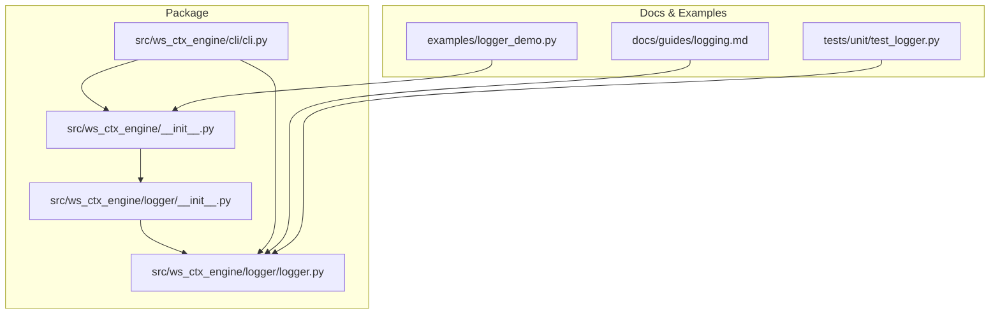
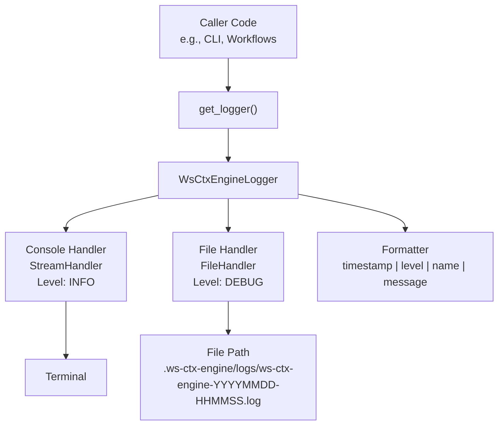
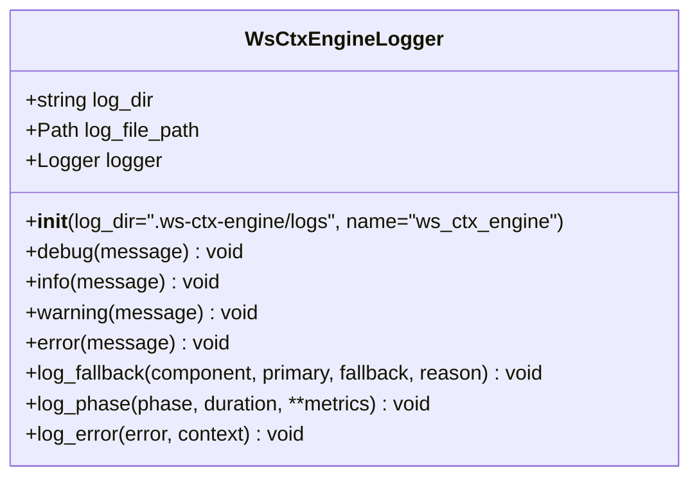
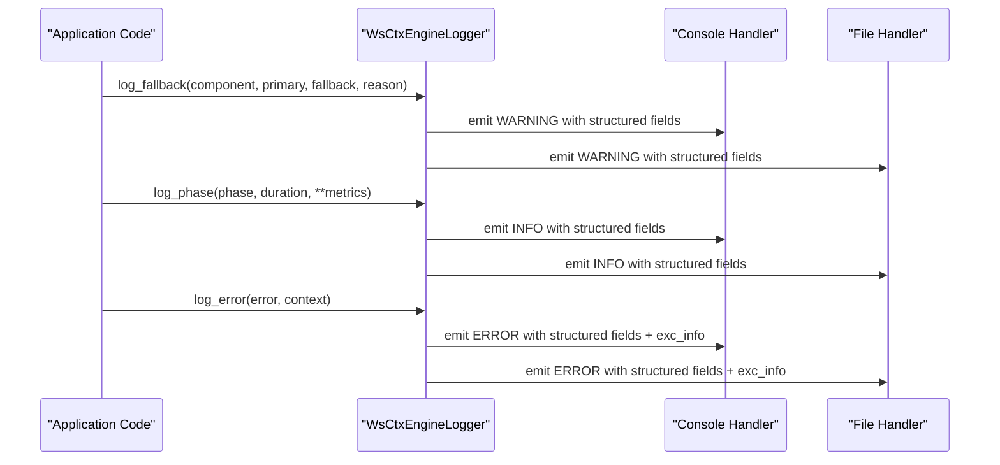
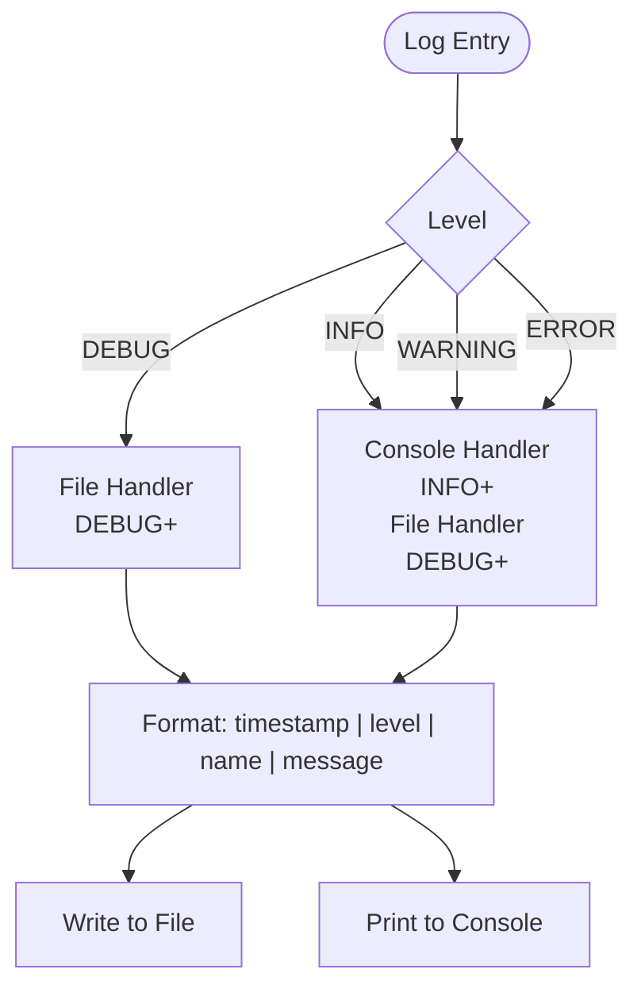
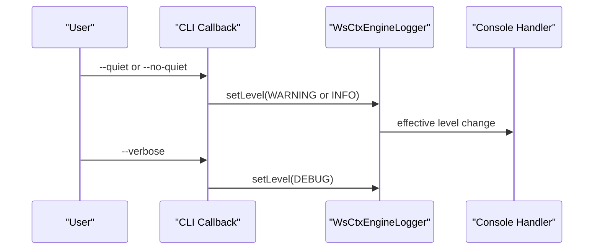
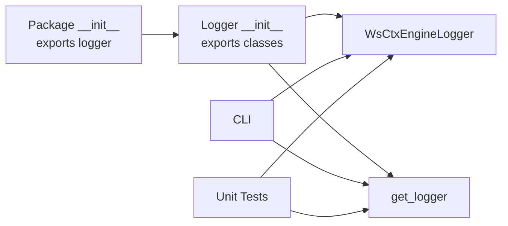

# Logging API

<cite>
**Referenced Files in This Document**
- [logger.py](file://src/ws_ctx_engine/logger/logger.py)
- [__init__.py](file://src/ws_ctx_engine/logger/__init__.py)
- [__init__.py](file://src/ws_ctx_engine/__init__.py)
- [logging.md](file://docs/guides/logging.md)
- [logger_demo.py](file://examples/logger_demo.py)
- [test_logger.py](file://tests/unit/test_logger.py)
- [.ws-ctx-engine.yaml.example](file://.ws-ctx-engine.yaml.example)
- [cli.py](file://src/ws_ctx_engine/cli/cli.py)
</cite>

## Table of Contents
1. [Introduction](#introduction)
2. [Project Structure](#project-structure)
3. [Core Components](#core-components)
4. [Architecture Overview](#architecture-overview)
5. [Detailed Component Analysis](#detailed-component-analysis)
6. [Dependency Analysis](#dependency-analysis)
7. [Performance Considerations](#performance-considerations)
8. [Troubleshooting Guide](#troubleshooting-guide)
9. [Conclusion](#conclusion)
10. [Appendices](#appendices)

## Introduction
This document describes the ws-ctx-engine logging API centered on the WsCtxEngineLogger class. It covers initialization parameters, log level configuration, formatting, specialized logging methods, and practical usage patterns. It also explains how the logger integrates with the CLI, how to interpret logs, and how to configure logging behavior in different environments.

## Project Structure
The logging API is implemented in a dedicated module and exposed via the package’s public API. The CLI retrieves a logger instance and adjusts its level based on user flags.

**Diagram sources**
- [__init__.py:11-11](file://src/ws_ctx_engine/__init__.py#L11-L11)
- [__init__.py:1-3](file://src/ws_ctx_engine/logger/__init__.py#L1-L3)
- [logger.py:13-145](file://src/ws_ctx_engine/logger/logger.py#L13-L145)
- [cli.py:23-42](file://src/ws_ctx_engine/cli/cli.py#L23-L42)
- [logging.md:1-100](file://docs/guides/logging.md#L1-L100)
- [logger_demo.py:1-36](file://examples/logger_demo.py#L1-L36)
- [test_logger.py:1-263](file://tests/unit/test_logger.py#L1-L263)

**Section sources**
- [__init__.py:11-11](file://src/ws_ctx_engine/__init__.py#L11-L11)
- [__init__.py:1-3](file://src/ws_ctx_engine/logger/__init__.py#L1-L3)
- [logger.py:13-145](file://src/ws_ctx_engine/logger/logger.py#L13-L145)
- [cli.py:23-42](file://src/ws_ctx_engine/cli/cli.py#L23-L42)
- [logging.md:1-100](file://docs/guides/logging.md#L1-L100)
- [logger_demo.py:1-36](file://examples/logger_demo.py#L1-L36)
- [test_logger.py:1-263](file://tests/unit/test_logger.py#L1-L263)

## Core Components
- WsCtxEngineLogger: Structured dual-output logger with console and file handlers.
- get_logger: Singleton accessor to obtain a logger instance.

Key characteristics:
- Dual output: Console handler at INFO and above; file handler at DEBUG and above.
- Structured format: timestamp | level | name | message.
- Specialized methods for common operational events: fallback, phase completion, and error logging with context.
- Global logger instance managed by get_logger.

**Section sources**
- [logger.py:13-145](file://src/ws_ctx_engine/logger/logger.py#L13-L145)
- [logging.md:7-23](file://docs/guides/logging.md#L7-L23)
- [test_logger.py:16-263](file://tests/unit/test_logger.py#L16-L263)

## Architecture Overview
The logger is initialized with a log directory and a logger name. It sets up two handlers:
- Console handler: StreamHandler at INFO level.
- File handler: FileHandler at DEBUG level, writing to a timestamped file under the configured directory.

The CLI obtains a logger instance and can adjust the effective level for console output via global flags.

**Diagram sources**
- [logger.py:22-62](file://src/ws_ctx_engine/logger/logger.py#L22-L62)
- [cli.py:36-42](file://src/ws_ctx_engine/cli/cli.py#L36-L42)

**Section sources**
- [logger.py:22-62](file://src/ws_ctx_engine/logger/logger.py#L22-L62)
- [cli.py:36-42](file://src/ws_ctx_engine/cli/cli.py#L36-L42)

## Detailed Component Analysis

### WsCtxEngineLogger Class
- Initialization parameters:
  - log_dir: Directory for log files (default: .ws-ctx-engine/logs).
  - name: Logger name (default: ws_ctx_engine).
- Behavior:
  - Ensures log directory exists.
  - Creates a logger with DEBUG level.
  - Disables propagation to prevent interference with test runners.
  - Clears existing handlers to avoid duplication.
  - Adds console handler (INFO+) and file handler (DEBUG+).
  - Applies a fixed structured formatter.
- Logging methods:
  - debug(message): Logs at DEBUG.
  - info(message): Logs at INFO.
  - warning(message): Logs at WARNING.
  - error(message): Logs at ERROR.
  - log_fallback(component, primary, fallback, reason): Logs backend fallback events with structured context.
  - log_phase(phase, duration, **metrics): Logs phase completion with duration and optional metrics.
  - log_error(error, context): Logs exceptions with context and stack trace.

**Diagram sources**
- [logger.py:13-145](file://src/ws_ctx_engine/logger/logger.py#L13-L145)

**Section sources**
- [logger.py:22-125](file://src/ws_ctx_engine/logger/logger.py#L22-L125)
- [test_logger.py:82-180](file://tests/unit/test_logger.py#L82-L180)

### Specialized Logging Methods
- log_fallback:
  - Purpose: Record backend fallback events with component, primary backend, fallback backend, and reason.
  - Severity: WARNING.
  - Output: Structured fields indicating the event and context.
- log_phase:
  - Purpose: Record phase completion with duration and optional metrics.
  - Severity: INFO.
  - Output: Structured fields for phase, duration, and metrics.
- log_error:
  - Purpose: Record exceptions with optional context and include stack trace.
  - Severity: ERROR.
  - Output: Structured context fields and stack trace.

**Diagram sources**
- [logger.py:64-125](file://src/ws_ctx_engine/logger/logger.py#L64-L125)

**Section sources**
- [logger.py:64-125](file://src/ws_ctx_engine/logger/logger.py#L64-L125)
- [test_logger.py:82-180](file://tests/unit/test_logger.py#L82-L180)

### Formatting and Output
- Format: timestamp | level | name | message.
- Date/time format: configured in the formatter.
- Console output: INFO and above.
- File output: DEBUG and above.
- File naming: ws-ctx-engine-YYYYMMDD-HHMMSS.log in the configured directory.

**Diagram sources**
- [logger.py:44-58](file://src/ws_ctx_engine/logger/logger.py#L44-L58)

**Section sources**
- [logger.py:44-58](file://src/ws_ctx_engine/logger/logger.py#L44-L58)
- [test_logger.py:60-81](file://tests/unit/test_logger.py#L60-L81)

### Integration with CLI
- The CLI obtains a logger instance and can:
  - Lower console verbosity globally via a callback option.
  - Temporarily lower the logger level to DEBUG per command when requested.
- This allows flexible control of console noise while preserving comprehensive file logs.

**Diagram sources**
- [cli.py:396-403](file://src/ws_ctx_engine/cli/cli.py#L396-L403)
- [cli.py:441-443](file://src/ws_ctx_engine/cli/cli.py#L441-L443)
- [cli.py:551-552](file://src/ws_ctx_engine/cli/cli.py#L551-L552)

**Section sources**
- [cli.py:396-403](file://src/ws_ctx_engine/cli/cli.py#L396-L403)
- [cli.py:441-443](file://src/ws_ctx_engine/cli/cli.py#L441-L443)
- [cli.py:551-552](file://src/ws_ctx_engine/cli/cli.py#L551-L552)

## Dependency Analysis
- Public exposure:
  - WsCtxEngineLogger and get_logger are exported from the logger module.
  - The logger module is re-exported via the package’s top-level __init__.
- Internal usage:
  - CLI imports get_logger and adjusts logger levels.
- Tests validate:
  - Directory creation and file creation.
  - Structured format and field presence.
  - Specialized methods’ outputs.
  - Singleton behavior and handler uniqueness.

**Diagram sources**
- [__init__.py:11-11](file://src/ws_ctx_engine/__init__.py#L11-L11)
- [__init__.py:1-3](file://src/ws_ctx_engine/logger/__init__.py#L1-L3)
- [logger.py:13-145](file://src/ws_ctx_engine/logger/logger.py#L13-L145)
- [cli.py:23-36](file://src/ws_ctx_engine/cli/cli.py#L23-L36)
- [test_logger.py:5-5](file://tests/unit/test_logger.py#L5-L5)

**Section sources**
- [__init__.py:11-11](file://src/ws_ctx_engine/__init__.py#L11-L11)
- [__init__.py:1-3](file://src/ws_ctx_engine/logger/__init__.py#L1-L3)
- [logger.py:13-145](file://src/ws_ctx_engine/logger/logger.py#L13-L145)
- [cli.py:23-36](file://src/ws_ctx_engine/cli/cli.py#L23-L36)
- [test_logger.py:5-5](file://tests/unit/test_logger.py#L5-L5)

## Performance Considerations
- Handler separation:
  - Console handler at INFO reduces terminal noise during normal operation.
  - File handler at DEBUG captures detailed traces for post-mortem analysis.
- File naming:
  - Timestamped filenames avoid conflicts and simplify rotation externally.
- Singleton logger:
  - get_logger ensures a single logger instance per process, minimizing overhead.

[No sources needed since this section provides general guidance]

## Troubleshooting Guide
- Verifying log output:
  - Confirm directory creation and file naming.
  - Ensure messages appear with expected levels and structured format.
- Validating specialized methods:
  - Check fallback, phase, and error entries for expected fields.
- Console vs file:
  - Use --quiet to suppress INFO on console; use --verbose to enable DEBUG for targeted runs.
- Error analysis:
  - Use log_error to capture stack traces and contextual fields for precise diagnosis.

**Section sources**
- [test_logger.py:16-263](file://tests/unit/test_logger.py#L16-L263)
- [cli.py:396-403](file://src/ws_ctx_engine/cli/cli.py#L396-L403)
- [cli.py:441-443](file://src/ws_ctx_engine/cli/cli.py#L441-L443)
- [cli.py:551-552](file://src/ws_ctx_engine/cli/cli.py#L551-L552)

## Conclusion
The WsCtxEngineLogger provides a pragmatic, structured logging solution tailored for ws-ctx-engine. Its dual-output design keeps user-facing logs concise while preserving comprehensive diagnostics in files. Specialized methods streamline common operational logging tasks, and CLI integration enables flexible verbosity control. Together, these features support efficient debugging, performance analysis, and reliable operations across environments.

[No sources needed since this section summarizes without analyzing specific files]

## Appendices

### API Reference: WsCtxEngineLogger
- Initialization
  - log_dir: Directory for log files (default: .ws-ctx-engine/logs).
  - name: Logger name (default: ws_ctx_engine).
- Methods
  - debug(message): Log at DEBUG.
  - info(message): Log at INFO.
  - warning(message): Log at WARNING.
  - error(message): Log at ERROR.
  - log_fallback(component, primary, fallback, reason): Log backend fallback with structured context.
  - log_phase(phase, duration, **metrics): Log phase completion with duration and metrics.
  - log_error(error, context): Log exception with context and stack trace.

**Section sources**
- [logger.py:22-125](file://src/ws_ctx_engine/logger/logger.py#L22-L125)

### Usage Examples
- Basic logging and specialized methods are demonstrated in the example script.
- See the guide for usage patterns and expected outputs.

**Section sources**
- [logger_demo.py:1-36](file://examples/logger_demo.py#L1-L36)
- [logging.md:24-72](file://docs/guides/logging.md#L24-L72)

### Configuration and Environment Guidance
- Log directory:
  - Default location is .ws-ctx-engine/logs.
- CLI verbosity controls:
  - --quiet lowers console level to WARNING.
  - --verbose sets logger level to DEBUG for targeted runs.
- Logging configuration file:
  - logging configuration fields are present in the example configuration but not currently applied; use CLI flags to control verbosity.

**Section sources**
- [logger.py:22-31](file://src/ws_ctx_engine/logger/logger.py#L22-L31)
- [cli.py:396-403](file://src/ws_ctx_engine/cli/cli.py#L396-L403)
- [cli.py:441-443](file://src/ws_ctx_engine/cli/cli.py#L441-L443)
- [.ws-ctx-engine.yaml.example:185-191](file://.ws-ctx-engine.yaml.example#L185-L191)