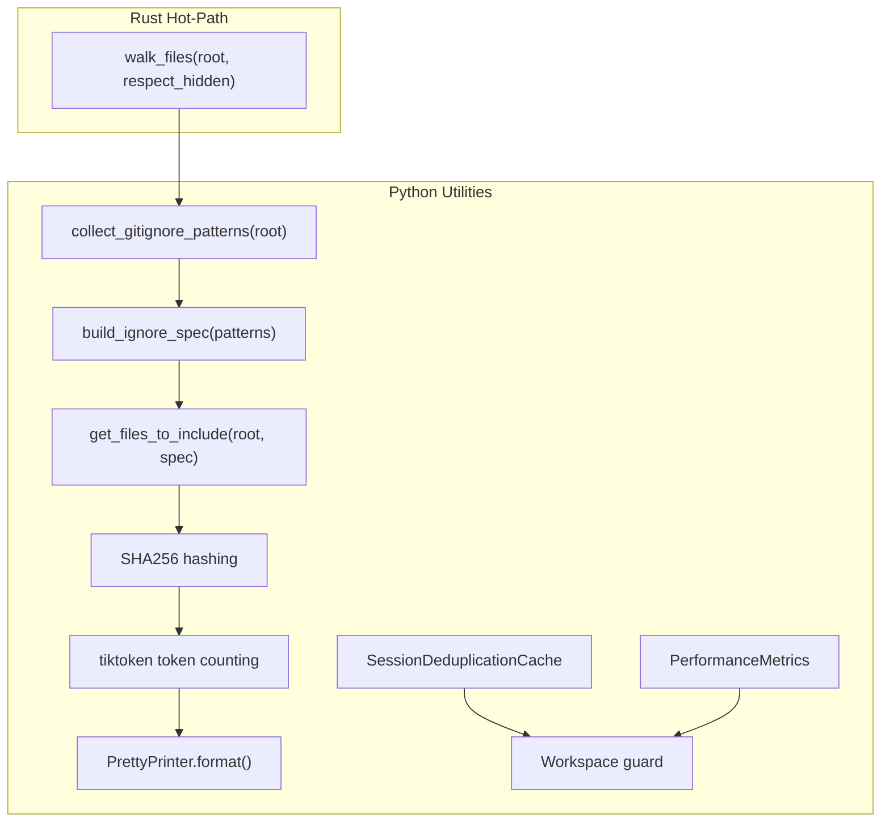
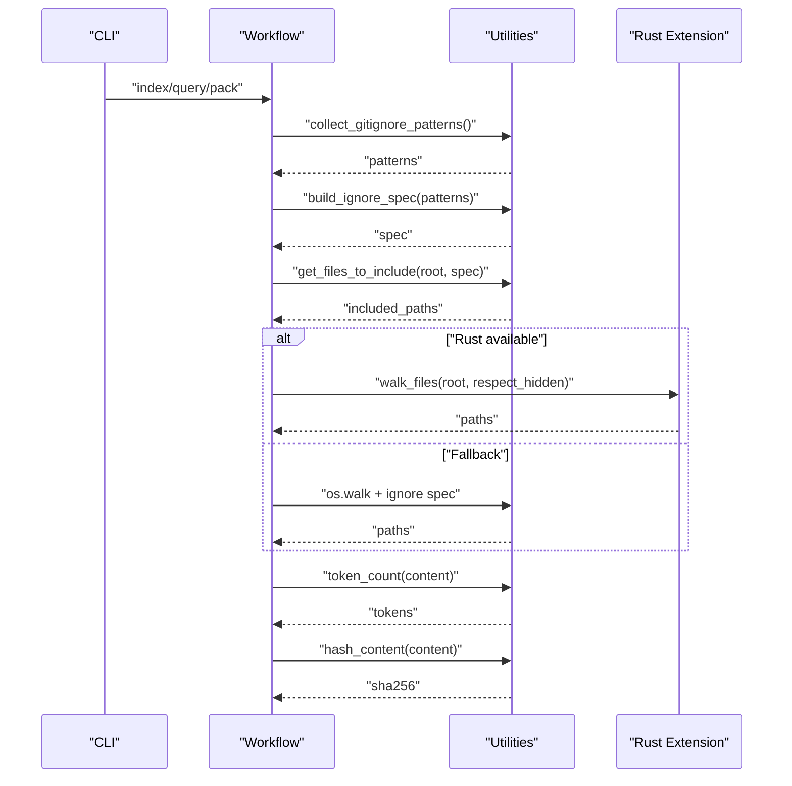
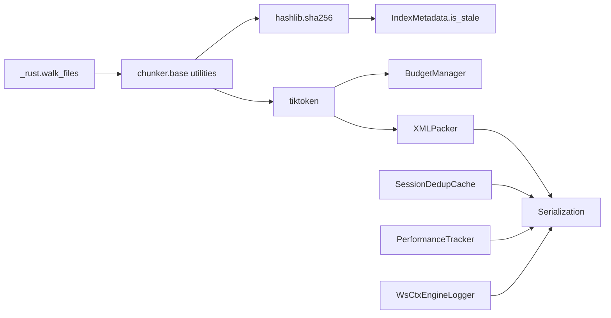

# Utility Functions

<cite>
**Referenced Files in This Document**
- [lib.rs](file://_rust/src/lib.rs)
- [walker.rs](file://_rust/src/walker.rs)
- [base.py](file://src/ws_ctx_engine/chunker/base.py)
- [budget.py](file://src/ws_ctx_engine/budget/budget.py)
- [xml_packer.py](file://src/ws_ctx_engine/packer/xml_packer.py)
- [models.py](file://src/ws_ctx_engine/models/models.py)
- [dedup_cache.py](file://src/ws_ctx_engine/session/dedup_cache.py)
- [logger.py](file://src/ws_ctx_engine/logger/logger.py)
- [performance.py](file://src/ws_ctx_engine/monitoring/performance.py)
- [indexer.py](file://src/ws_ctx_engine/workflow/indexer.py)
- [cli.py](file://src/ws_ctx_engine/cli/cli.py)
- [performance.md](file://docs/guides/performance.md)
- [toon_vs_alternatives.py](file://benchmarks/toon_vs_alternatives.py)
- [test_xml_packer.py](file://tests/unit/test_xml_packer.py)
</cite>

## Table of Contents
1. [Introduction](#introduction)
2. [Project Structure](#project-structure)
3. [Core Components](#core-components)
4. [Architecture Overview](#architecture-overview)
5. [Detailed Component Analysis](#detailed-component-analysis)
6. [Dependency Analysis](#dependency-analysis)
7. [Performance Considerations](#performance-considerations)
8. [Troubleshooting Guide](#troubleshooting-guide)
9. [Conclusion](#conclusion)

## Introduction
This document describes the utility functions and helper methods used across ws-ctx-engine for token counting, file hashing, path manipulation, and data serialization. It focuses on the hot-path accelerations provided by the Rust extension, Python fallbacks, and shared utilities used throughout the system. The goal is to explain function responsibilities, parameter validation, return value specifications, usage patterns, performance characteristics, edge cases, and integration points with core components.

## Project Structure
The utility functions span both Python and Rust layers:
- Rust hot-path acceleration for file walking
- Python fallbacks for hashing and token counting
- Shared utilities for path normalization, ignore spec handling, and content hashing
- Serialization utilities for XML packing and pretty-printing
- Deduplication cache for session-level reuse
- Logging and performance tracking helpers

**Diagram sources**
- [lib.rs:1-22](file://_rust/src/lib.rs#L1-L22)
- [walker.rs:1-53](file://_rust/src/walker.rs#L1-L53)
- [base.py:47-104](file://src/ws_ctx_engine/chunker/base.py#L47-L104)
- [models.py:132-151](file://src/ws_ctx_engine/models/models.py#L132-L151)
- [xml_packer.py:229-238](file://src/ws_ctx_engine/packer/xml_packer.py#L229-L238)
- [dedup_cache.py:65-89](file://src/ws_ctx_engine/session/dedup_cache.py#L65-L89)
- [performance.py:13-70](file://src/ws_ctx_engine/monitoring/performance.py#L13-L70)
- [cli.py:620-633](file://src/ws_ctx_engine/cli/cli.py#L620-L633)

**Section sources**
- [lib.rs:1-22](file://_rust/src/lib.rs#L1-L22)
- [walker.rs:1-53](file://_rust/src/walker.rs#L1-L53)
- [base.py:47-104](file://src/ws_ctx_engine/chunker/base.py#L47-L104)
- [models.py:132-151](file://src/ws_ctx_engine/models/models.py#L132-L151)
- [xml_packer.py:229-238](file://src/ws_ctx_engine/packer/xml_packer.py#L229-L238)
- [dedup_cache.py:65-89](file://src/ws_ctx_engine/session/dedup_cache.py#L65-L89)
- [performance.py:13-70](file://src/ws_ctx_engine/monitoring/performance.py#L13-L70)
- [cli.py:620-633](file://src/ws_ctx_engine/cli/cli.py#L620-L633)

## Core Components
- File walking hot-path: The Rust module exposes a fast parallel walker that respects .gitignore semantics and returns sorted relative POSIX paths.
- Token counting: Uses tiktoken for accurate tokenization; utilities exist at the model level and in packers.
- Content hashing: SHA256 hashing for staleness detection and deduplication.
- Path manipulation: Gitignore pattern extraction and normalization, ignore spec construction, and safe path resolution.
- Data serialization: XML packing with metadata and token counts, pretty-printing of code chunks, and metrics serialization.
- Session-level deduplication: Lightweight cache persisted to disk to avoid resending identical content within a session.
- Logging and metrics: Structured logging and performance tracking with phase timings and memory usage.

**Section sources**
- [lib.rs:1-22](file://_rust/src/lib.rs#L1-L22)
- [walker.rs:17-52](file://_rust/src/walker.rs#L17-L52)
- [budget.py:32-104](file://src/ws_ctx_engine/budget/budget.py#L32-L104)
- [models.py:60-84](file://src/ws_ctx_engine/models/models.py#L60-L84)
- [xml_packer.py:85-137](file://src/ws_ctx_engine/packer/xml_packer.py#L85-L137)
- [indexer.py:374-401](file://src/ws_ctx_engine/workflow/indexer.py#L374-L401)
- [dedup_cache.py:65-106](file://src/ws_ctx_engine/session/dedup_cache.py#L65-L106)
- [logger.py:64-125](file://src/ws_ctx_engine/logger/logger.py#L64-L125)
- [performance.py:54-70](file://src/ws_ctx_engine/monitoring/performance.py#L54-L70)

## Architecture Overview
The utility layer integrates with core components through clear boundaries:
- Rust extension is optional and falls back gracefully to Python implementations.
- Token counting and hashing are used in budget selection, staleness checks, and serialization.
- Path manipulation ensures correct inclusion/exclusion rules and safe workspace handling.
- Metrics and logging provide observability for performance-sensitive operations.

**Diagram sources**
- [cli.py:406-493](file://src/ws_ctx_engine/cli/cli.py#L406-L493)
- [indexer.py:129-177](file://src/ws_ctx_engine/workflow/indexer.py#L129-L177)
- [base.py:47-104](file://src/ws_ctx_engine/chunker/base.py#L47-L104)
- [lib.rs:16-21](file://_rust/src/lib.rs#L16-L21)
- [walker.rs:17-52](file://_rust/src/walker.rs#L17-L52)
- [xml_packer.py:229-238](file://src/ws_ctx_engine/packer/xml_packer.py#L229-L238)
- [models.py:132-151](file://src/ws_ctx_engine/models/models.py#L132-L151)

## Detailed Component Analysis

### File Walking Hot-Path (Rust)
- Function: walk_files(root, respect_hidden)
- Purpose: Fast parallel file discovery respecting .gitignore semantics and returning sorted relative POSIX paths.
- Parameters:
  - root: Repository root directory (string)
  - respect_hidden: If True, skip hidden files and directories (boolean, default True)
- Returns: List of relative POSIX paths (sorted)
- Behavior:
  - Uses ignore crate builders with git_ignore, git_global, and git_exclude enabled
  - Parallel traversal with Arc<Mutex<>> for thread-safe accumulation
  - Strips root prefix and normalizes separators to "/"
  - Sorts results for deterministic output
- Edge cases:
  - Empty directories yield empty list
  - Malformed paths handled by ignore crate; failures logged at higher layers
- Integration:
  - Loaded dynamically; if unavailable, Python fallbacks are used

**Section sources**
- [lib.rs:1-22](file://_rust/src/lib.rs#L1-L22)
- [walker.rs:17-52](file://_rust/src/walker.rs#L17-L52)

### Token Counting Utilities
- Model-level token counting:
  - Method: CodeChunk.token_count(encoding)
  - Purpose: Count tokens for a chunk’s content using tiktoken
  - Parameters: encoding (tiktoken.Encoding)
  - Returns: integer token count
- Budget manager token accounting:
  - Class: BudgetManager
  - Methods: select_files(ranked_files, repo_path)
  - Purpose: Greedy knapsack selection constrained by content budget (80% of total)
  - Validation: token_budget must be positive
  - Returns: (selected_files, total_tokens)
- XML packer token accounting:
  - Method: XMLPacker._create_file_element(...)
  - Purpose: Compute tokens per file for XML metadata and attributes
  - Encoding: configurable via constructor
- Benchmarks and accuracy:
  - Benchmarks use tiktoken encoding to compare output token counts across formats
- Usage examples:
  - Budget selection in ranking and retrieval workflows
  - XML packing with per-file token attributes

**Section sources**
- [models.py:60-84](file://src/ws_ctx_engine/models/models.py#L60-L84)
- [budget.py:32-104](file://src/ws_ctx_engine/budget/budget.py#L32-L104)
- [xml_packer.py:185-238](file://src/ws_ctx_engine/packer/xml_packer.py#L185-L238)
- [toon_vs_alternatives.py:122-160](file://benchmarks/toon_vs_alternatives.py#L122-L160)

### File Hashing Utilities
- Staleness detection:
  - Method: IndexMetadata.is_stale(repo_path)
  - Purpose: Compare stored SHA256 hashes with current file content
  - Returns: Boolean indicating staleness
- Index hashing:
  - Function: _compute_file_hashes(chunks, repo_path)
  - Purpose: Build file_hashes mapping for metadata persistence
  - Returns: dict[path -> sha256]
- Session-level deduplication:
  - Method: SessionDeduplicationCache.check_and_mark(file_path, content)
  - Purpose: Detect repeated content within a session and return a compact marker
  - Returns: (is_duplicate, content_or_marker)
- Integration:
  - Used in workflow indexing and session cache persistence

**Section sources**
- [models.py:108-151](file://src/ws_ctx_engine/models/models.py#L108-L151)
- [indexer.py:374-401](file://src/ws_ctx_engine/workflow/indexer.py#L374-L401)
- [dedup_cache.py:65-89](file://src/ws_ctx_engine/session/dedup_cache.py#L65-L89)

### Path Manipulation and Ignore Spec Utilities
- Gitignore discovery and normalization:
  - Function: collect_gitignore_patterns(root)
  - Purpose: Recursively discover .gitignore files and normalize patterns with directory scoping
  - Returns: list[str] of patterns
- Ignore spec construction:
  - Function: build_ignore_spec(patterns)
  - Purpose: Build GitIgnoreSpec for precise .gitignore semantics
  - Fallback: Basic fnmatch-based behavior if pathspec unavailable
  - Returns: GitIgnoreSpec or None
- Include path computation:
  - Function: get_files_to_include(root, spec)
  - Purpose: Return relative paths NOT matched by spec (i.e., included)
  - Returns: list[str]
- CLI integration:
  - Function: _extract_gitignore_patterns(repo_path)
  - Purpose: Extract and normalize .gitignore patterns for config generation
- Edge cases:
  - Malformed .gitignore lines are skipped
  - Missing pathspec falls back to fnmatch behavior with warning

**Section sources**
- [base.py:47-104](file://src/ws_ctx_engine/chunker/base.py#L47-L104)
- [cli.py:88-117](file://src/ws_ctx_engine/cli/cli.py#L88-L117)

### Data Serialization Utilities
- XML packing:
  - Class: XMLPacker
  - Methods: pack(selected_files, repo_path, metadata, secret_scanner, content_map)
  - Purpose: Generate XML output with metadata and token counts
  - Returns: XML string with pretty printing and UTF-8 declaration
  - Token accounting: Per-file token attributes
- Pretty printing:
  - Class: PrettyPrinter
  - Methods: format(chunks), format_file(chunks, file_path)
  - Purpose: Round-trip formatting of CodeChunks back to valid source code
  - Supported languages: Python, JavaScript, TypeScript
  - Validation: All chunks must be same language and supported
- Metrics serialization:
  - Class: PerformanceMetrics
  - Method: to_dict()
  - Purpose: Serialize metrics for reporting and persistence

**Section sources**
- [xml_packer.py:51-137](file://src/ws_ctx_engine/packer/xml_packer.py#L51-L137)
- [xml_packer.py:185-238](file://src/ws_ctx_engine/packer/xml_packer.py#L185-L238)
- [pretty_printer.py:13-87](file://src/ws_ctx_engine/formatters/pretty_printer.py#L13-L87)
- [performance.py:54-70](file://src/ws_ctx_engine/monitoring/performance.py#L54-L70)

### Session-Level Deduplication Cache
- Class: SessionDeduplicationCache
- Methods:
  - check_and_mark(file_path, content): Detect duplicates and return marker or content
  - clear(): Delete cache file and reset state
  - size: Property for number of unique content hashes
- Persistence:
  - Atomic JSON writes to avoid corruption
  - Path confinement to cache directory to prevent traversal
- CLI flags:
  - --session-id: Identifier for cache grouping
  - --no-dedup: Disable deduplication entirely
- Integration:
  - Used in MCP tools to avoid resending identical content

**Section sources**
- [dedup_cache.py:35-137](file://src/ws_ctx_engine/session/dedup_cache.py#L35-L137)
- [cli.py:768-777](file://src/ws_ctx_engine/cli/cli.py#L768-L777)
- [cli.py:620-633](file://src/ws_ctx_engine/cli/cli.py#L620-L633)

### Logging and Metrics Helpers
- Structured logging:
  - Class: WsCtxEngineLogger
  - Methods: log_phase(phase, duration, **metrics), log_error(error, context), log_fallback(component, primary, fallback, reason)
- Performance tracking:
  - Class: PerformanceTracker
  - Methods: start_phase(phase), end_phase(phase), set_total_tokens(tokens), format_metrics(phase)
  - Provides human-readable formatting and byte unit scaling

**Section sources**
- [logger.py:13-125](file://src/ws_ctx_engine/logger/logger.py#L13-L125)
- [performance.py:72-263](file://src/ws_ctx_engine/monitoring/performance.py#L72-L263)

## Dependency Analysis
Key dependency relationships among utilities:
- Rust extension is optional; Python fallbacks ensure compatibility
- Token counting depends on tiktoken; hashing on hashlib
- Path manipulation utilities feed into file inclusion decisions
- Serialization utilities depend on token counting and hashing
- Metrics and logging are used across workflows

**Diagram sources**
- [lib.rs:16-21](file://_rust/src/lib.rs#L16-L21)
- [walker.rs:17-52](file://_rust/src/walker.rs#L17-L52)
- [base.py:47-104](file://src/ws_ctx_engine/chunker/base.py#L47-L104)
- [models.py:132-151](file://src/ws_ctx_engine/models/models.py#L132-L151)
- [budget.py:32-104](file://src/ws_ctx_engine/budget/budget.py#L32-L104)
- [xml_packer.py:85-137](file://src/ws_ctx_engine/packer/xml_packer.py#L85-L137)
- [dedup_cache.py:65-89](file://src/ws_ctx_engine/session/dedup_cache.py#L65-L89)
- [performance.py:72-214](file://src/ws_ctx_engine/monitoring/performance.py#L72-L214)
- [logger.py:64-125](file://src/ws_ctx_engine/logger/logger.py#L64-L125)

**Section sources**
- [lib.rs:1-22](file://_rust/src/lib.rs#L1-L22)
- [walker.rs:1-53](file://_rust/src/walker.rs#L1-L53)
- [base.py:47-104](file://src/ws_ctx_engine/chunker/base.py#L47-L104)
- [models.py:108-151](file://src/ws_ctx_engine/models/models.py#L108-L151)
- [budget.py:32-104](file://src/ws_ctx_engine/budget/budget.py#L32-L104)
- [xml_packer.py:85-137](file://src/ws_ctx_engine/packer/xml_packer.py#L85-L137)
- [dedup_cache.py:65-106](file://src/ws_ctx_engine/session/dedup_cache.py#L65-L106)
- [performance.py:72-214](file://src/ws_ctx_engine/monitoring/performance.py#L72-L214)
- [logger.py:64-125](file://src/ws_ctx_engine/logger/logger.py#L64-L125)

## Performance Considerations
- Rust hot-path:
  - walk_files is significantly faster than os.walk due to parallel traversal and native ignore semantics
  - Boundary overhead for Python-Rust calls is considered; hashing and simple token heuristics are fast enough in Python
- Token counting:
  - tiktoken-based counting is accurate but CPU-intensive; cache results where possible (e.g., in packers)
- Serialization:
  - XML packing uses pretty printing and CDATA; consider streaming or chunked writes for very large outputs
- Deduplication:
  - SHA256 hashing is efficient; cache persistence uses atomic writes to minimize contention
- Metrics:
  - Track phase timings and memory usage to identify bottlenecks

**Section sources**
- [performance.md:58-81](file://docs/guides/performance.md#L58-L81)
- [xml_packer.py:129-136](file://src/ws_ctx_engine/packer/xml_packer.py#L129-L136)
- [dedup_cache.py:119-136](file://src/ws_ctx_engine/session/dedup_cache.py#L119-L136)
- [performance.py:185-206](file://src/ws_ctx_engine/monitoring/performance.py#L185-L206)

## Troubleshooting Guide
Common issues and resolutions:
- Rust extension not available:
  - Symptom: Warning about fallback; slower file walking
  - Resolution: Install Rust toolchain and rebuild the extension; Python fallback remains functional
- Token counting anomalies:
  - Symptom: Unexpected token counts
  - Resolution: Ensure consistent encoding; verify content encoding (UTF-8 preferred)
- Staleness detection false positives:
  - Symptom: Index rebuild triggered unexpectedly
  - Resolution: Check file permissions and read errors; verify paths and encoding
- Deduplication cache corruption:
  - Symptom: Errors on cache load
  - Resolution: Clear cache with clear_all_sessions or per-session clear; ensure atomic write succeeded
- Workspace guard violations:
  - Symptom: Permission errors for output paths
  - Resolution: Keep output_path within workspace root; the guard resolves absolute paths and validates containment

**Section sources**
- [performance.md:58-81](file://docs/guides/performance.md#L58-L81)
- [xml_packer.py:214-220](file://src/ws_ctx_engine/packer/xml_packer.py#L214-L220)
- [models.py:132-151](file://src/ws_ctx_engine/models/models.py#L132-L151)
- [dedup_cache.py:112-136](file://src/ws_ctx_engine/session/dedup_cache.py#L112-L136)
- [cli.py:620-633](file://src/ws_ctx_engine/cli/cli.py#L620-L633)

## Conclusion
The utility layer in ws-ctx-engine provides robust, high-performance helpers for file walking, token counting, hashing, path manipulation, and serialization. The Rust hot-path accelerates file discovery, while Python utilities ensure portability and correctness. Shared utilities integrate cleanly with core components, enabling efficient indexing, querying, and packaging workflows. By leveraging these utilities consistently and following the best practices outlined here, developers can extend functionality safely and efficiently.