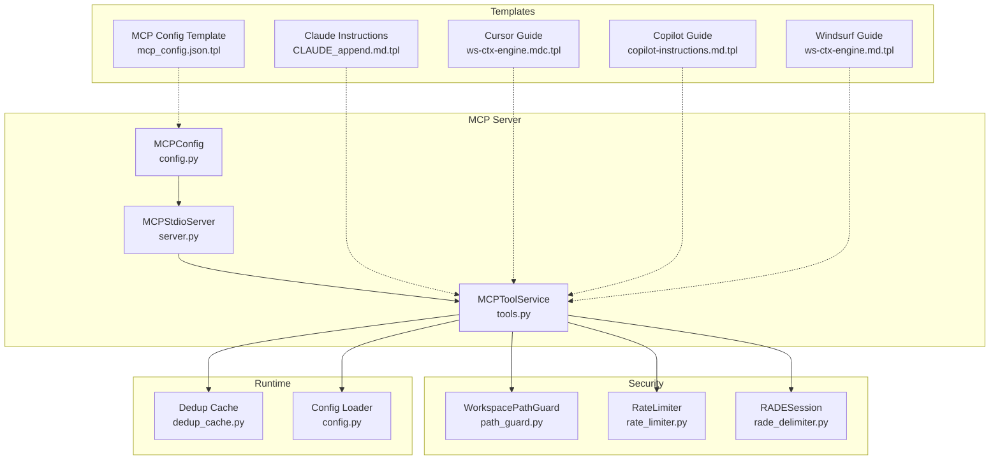
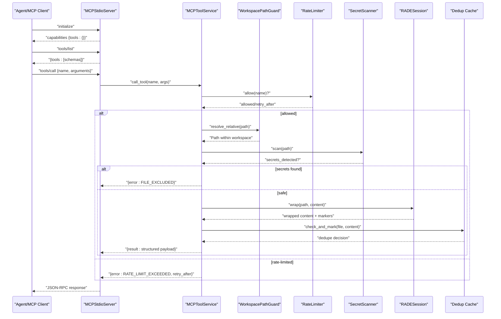
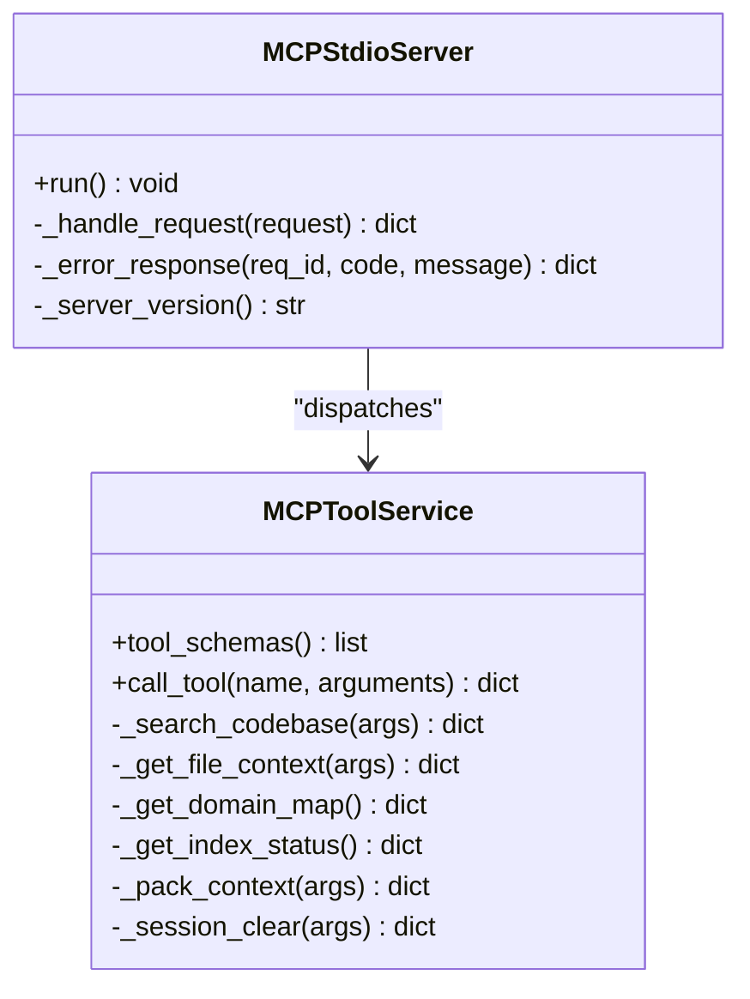
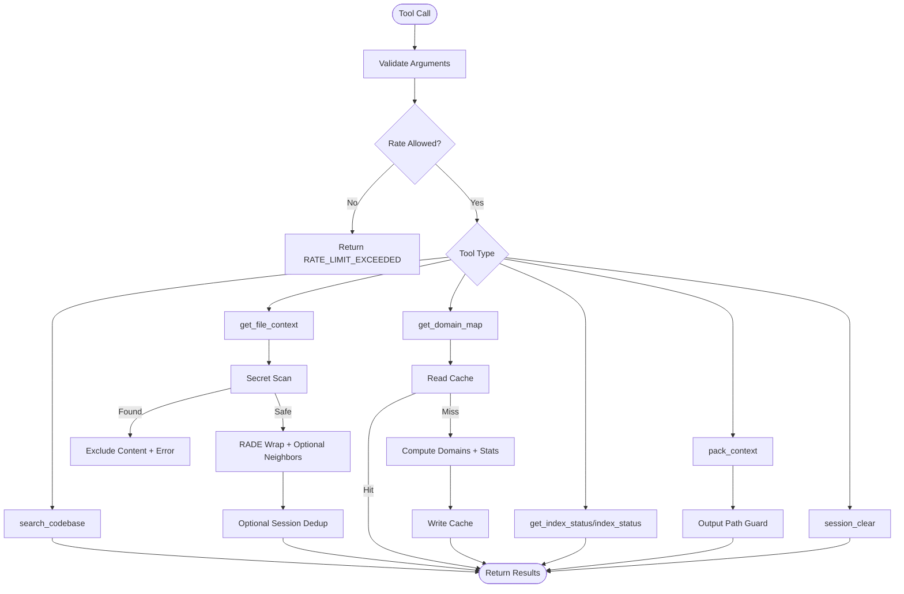
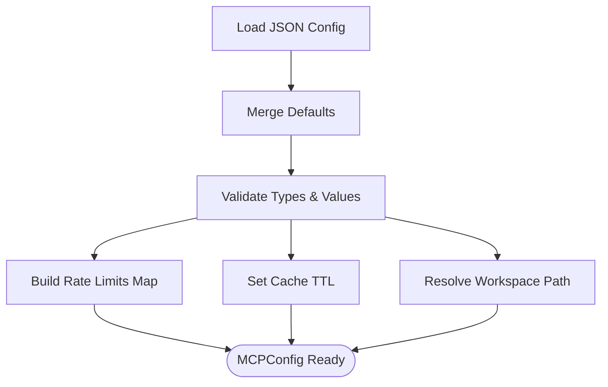
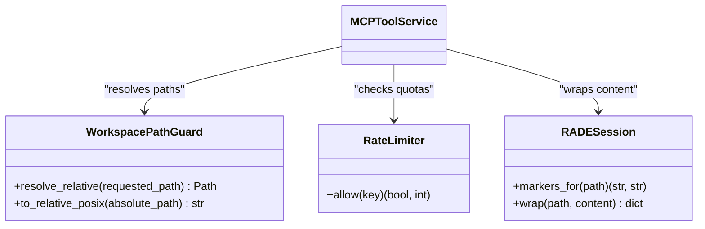
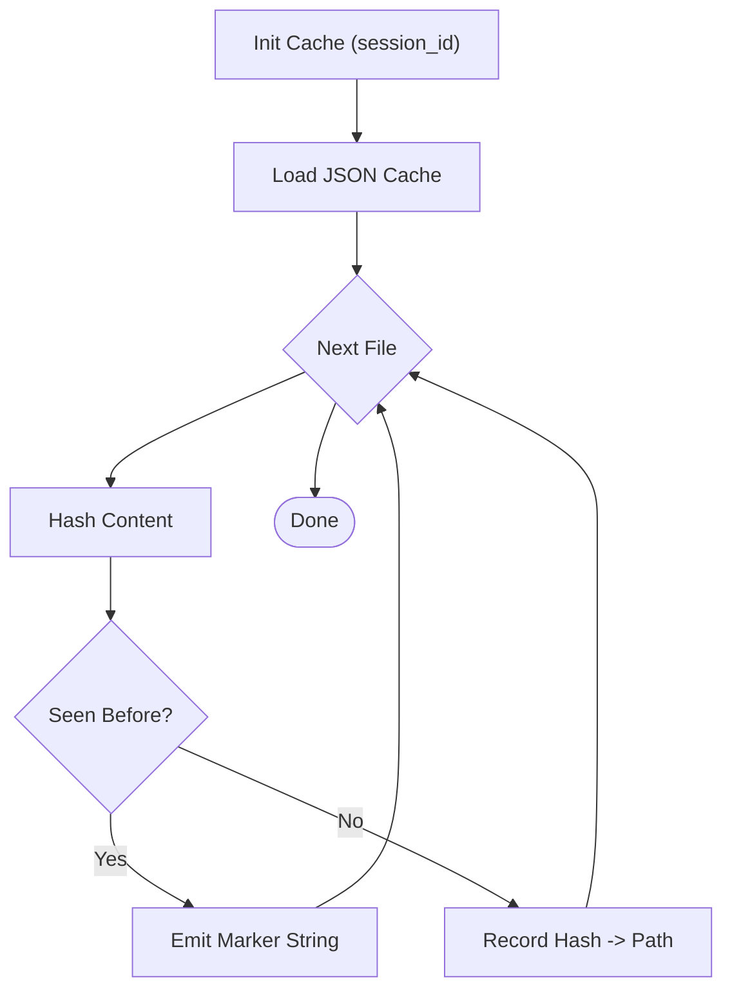
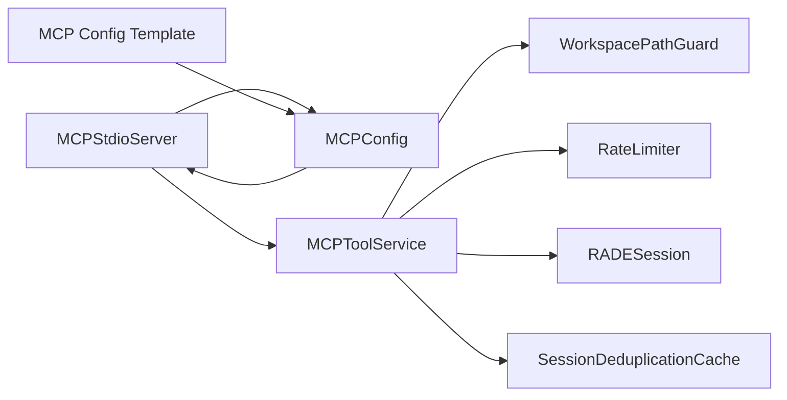
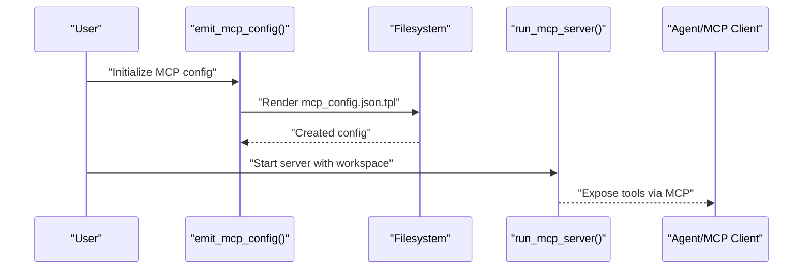

# Agent Integration

<cite>
**Referenced Files in This Document**
- [server.py](file://src/ws_ctx_engine/mcp/server.py)
- [tools.py](file://src/ws_ctx_engine/mcp/tools.py)
- [config.py](file://src/ws_ctx_engine/mcp/config.py)
- [path_guard.py](file://src/ws_ctx_engine/mcp/security/path_guard.py)
- [rate_limiter.py](file://src/ws_ctx_engine/mcp/security/rate_limiter.py)
- [dedup_cache.py](file://src/ws_ctx_engine/session/dedup_cache.py)
- [mcp_server.py](file://src/ws_ctx_engine/mcp_server.py)
- [mcp.sh](file://src/ws_ctx_engine/scripts/lib/mcp.sh)
- [mcp_config.json.tpl](file://src/ws_ctx_engine/templates/mcp/mcp_config.json.tpl)
- [mcp-server.md](file://docs/integrations/mcp-server.md)
- [agent-workflows.md](file://docs/integrations/agent-workflows.md)
- [CLAUDE_append.md.tpl](file://src/ws_ctx_engine/templates/claude/CLAUDE_append.md.tpl)
- [copilot-instructions.md.tpl](file://src/ws_ctx_engine/templates/copilot/copilot-instructions.md.tpl)
- [ws-ctx-engine.mdc.tpl](file://src/ws_ctx_engine/templates/cursor/ws-ctx-engine.mdc.tpl)
- [ws-ctx-engine.md.tpl](file://src/ws_ctx_engine/templates/windsurf/ws-ctx-engine.md.tpl)
</cite>

## Table of Contents
1. [Introduction](#introduction)
2. [Project Structure](#project-structure)
3. [Core Components](#core-components)
4. [Architecture Overview](#architecture-overview)
5. [Detailed Component Analysis](#detailed-component-analysis)
6. [Dependency Analysis](#dependency-analysis)
7. [Performance Considerations](#performance-considerations)
8. [Security Considerations](#security-considerations)
9. [Agent Template System](#agent-template-system)
10. [Integration Patterns](#integration-patterns)
11. [Troubleshooting Guide](#troubleshooting-guide)
12. [Conclusion](#conclusion)
13. [Appendices](#appendices)

## Introduction
This document explains how ws-ctx-engine integrates with AI agents via the Model Context Protocol (MCP) server. It covers the MCP server implementation, tool definitions, configuration, security controls, and agent templates for Claude, Cursor, Copilot, Windsurf, and others. It also documents performance optimization, session management, semantic deduplication, and extension guidelines for adding new agent integrations.

## Project Structure
The agent integration spans several modules:
- MCP server and tool service: request parsing, tool dispatch, and JSON-RPC responses
- Configuration loader: MCP-specific settings and defaults
- Security guards: path traversal protection, rate limiting, and content delimiters
- Session-level deduplication cache: reduce redundant token usage across agent calls
- Templates: agent-specific instruction and guidance files
- CLI entry points and scripts: launching the MCP server and generating configs

**Diagram sources**
- [server.py:13-136](file://src/ws_ctx_engine/mcp/server.py#L13-L136)
- [tools.py:29-672](file://src/ws_ctx_engine/mcp/tools.py#L29-L672)
- [config.py:22-129](file://src/ws_ctx_engine/mcp/config.py#L22-L129)
- [path_guard.py:6-31](file://src/ws_ctx_engine/mcp/security/path_guard.py#L6-L31)
- [rate_limiter.py:14-45](file://src/ws_ctx_engine/mcp/security/rate_limiter.py#L14-L45)
- [dedup_cache.py:35-154](file://src/ws_ctx_engine/session/dedup_cache.py#L35-L154)
- [CLAUDE_append.md.tpl:1-34](file://src/ws_ctx_engine/templates/claude/CLAUDE_append.md.tpl#L1-L34)
- [ws-ctx-engine.mdc.tpl:1-36](file://src/ws_ctx_engine/templates/cursor/ws-ctx-engine.mdc.tpl#L1-L36)
- [copilot-instructions.md.tpl:1-28](file://src/ws_ctx_engine/templates/copilot/copilot-instructions.md.tpl#L1-L28)
- [ws-ctx-engine.md.tpl:1-45](file://src/ws_ctx_engine/templates/windsurf/ws-ctx-engine.md.tpl#L1-L45)
- [mcp_config.json.tpl:1-11](file://src/ws_ctx_engine/templates/mcp/mcp_config.json.tpl#L1-L11)

**Section sources**
- [server.py:13-136](file://src/ws_ctx_engine/mcp/server.py#L13-L136)
- [tools.py:29-672](file://src/ws_ctx_engine/mcp/tools.py#L29-L672)
- [config.py:22-129](file://src/ws_ctx_engine/mcp/config.py#L22-L129)

## Core Components
- MCPStdioServer: JSON-RPC over stdin/stdout, initializes MCP capabilities, lists tools, and dispatches tool calls
- MCPToolService: Implements tool schemas and handlers for search, file context retrieval, domain map, index status, packing, and session clearing
- MCPConfig: Loads and validates MCP configuration including rate limits, cache TTL, and workspace resolution
- Security modules: WorkspacePathGuard prevents path traversal; RateLimiter enforces per-tool quotas; RADESession wraps file content with safe delimiters
- SessionDeduplicationCache: Persists per-session file-content hashes to replace repeated files with concise markers

**Section sources**
- [server.py:13-136](file://src/ws_ctx_engine/mcp/server.py#L13-L136)
- [tools.py:29-672](file://src/ws_ctx_engine/mcp/tools.py#L29-L672)
- [config.py:22-129](file://src/ws_ctx_engine/mcp/config.py#L22-L129)
- [path_guard.py:6-31](file://src/ws_ctx_engine/mcp/security/path_guard.py#L6-L31)
- [rate_limiter.py:14-45](file://src/ws_ctx_engine/mcp/security/rate_limiter.py#L14-L45)
- [dedup_cache.py:35-154](file://src/ws_ctx_engine/session/dedup_cache.py#L35-L154)

## Architecture Overview
The MCP server runs as a long-lived process that reads JSON-RPC requests from stdin, validates and routes them to the tool service, and writes structured responses to stdout. Tools operate within a bounded workspace, protected by path guards, rate limits, and content sanitization.

**Diagram sources**
- [server.py:57-111](file://src/ws_ctx_engine/mcp/server.py#L57-L111)
- [tools.py:133-184](file://src/ws_ctx_engine/mcp/tools.py#L133-L184)
- [path_guard.py:10-20](file://src/ws_ctx_engine/mcp/security/path_guard.py#L10-L20)
- [rate_limiter.py:19-44](file://src/ws_ctx_engine/mcp/security/rate_limiter.py#L19-L44)
- [dedup_cache.py:65-89](file://src/ws_ctx_engine/session/dedup_cache.py#L65-L89)

## Detailed Component Analysis

### MCP Server Implementation
- Initializes MCP configuration and binds to a workspace
- Validates requests and responds with JSON-RPC envelopes
- Supports initialize, tools/list, and tools/call methods
- Returns structured content alongside raw text for agent consumption

**Diagram sources**
- [server.py:13-136](file://src/ws_ctx_engine/mcp/server.py#L13-L136)
- [tools.py:29-184](file://src/ws_ctx_engine/mcp/tools.py#L29-L184)

**Section sources**
- [server.py:13-136](file://src/ws_ctx_engine/mcp/server.py#L13-L136)

### Tool Definitions and Processing Logic
- search_codebase: validates query and limits, delegates to search workflow, returns ranked results and index health
- get_file_context: resolves path within workspace, scans for secrets, wraps content with RADE markers, optionally includes dependencies/dependents
- get_domain_map: loads graph and domain map, computes top domains and graph stats
- get_index_status/index_status: reports index health and rebuild recommendation
- pack_context: executes query-and-pack with format/budget/phase options, guards output path
- session_clear: clears session cache files (specific or all)

**Diagram sources**
- [tools.py:133-672](file://src/ws_ctx_engine/mcp/tools.py#L133-L672)
- [rate_limiter.py:19-44](file://src/ws_ctx_engine/mcp/security/rate_limiter.py#L19-L44)
- [dedup_cache.py:65-89](file://src/ws_ctx_engine/session/dedup_cache.py#L65-L89)

**Section sources**
- [tools.py:43-131](file://src/ws_ctx_engine/mcp/tools.py#L43-L131)
- [tools.py:167-184](file://src/ws_ctx_engine/mcp/tools.py#L167-L184)
- [tools.py:224-312](file://src/ws_ctx_engine/mcp/tools.py#L224-L312)
- [tools.py:314-399](file://src/ws_ctx_engine/mcp/tools.py#L314-L399)
- [tools.py:449-460](file://src/ws_ctx_engine/mcp/tools.py#L449-L460)
- [tools.py:569-633](file://src/ws_ctx_engine/mcp/tools.py#L569-L633)
- [tools.py:637-665](file://src/ws_ctx_engine/mcp/tools.py#L637-L665)

### Configuration and Workspace Resolution
- MCPConfig loads JSON configuration, merges defaults, validates rate limits, and resolves workspace path
- Supports overriding rate limits at runtime and resolving workspace from config or CLI

**Diagram sources**
- [config.py:28-129](file://src/ws_ctx_engine/mcp/config.py#L28-L129)

**Section sources**
- [config.py:22-129](file://src/ws_ctx_engine/mcp/config.py#L22-L129)

### Security Controls
- WorkspacePathGuard ensures all file operations stay within the workspace root
- RateLimiter applies token-bucket rate limiting per tool
- RADESession wraps file content with unique session-bound delimiters
- SecretScanner detects sensitive content and excludes files from context

**Diagram sources**
- [path_guard.py:6-31](file://src/ws_ctx_engine/mcp/security/path_guard.py#L6-L31)
- [rate_limiter.py:14-45](file://src/ws_ctx_engine/mcp/security/rate_limiter.py#L14-L45)
- [tools.py:37-40](file://src/ws_ctx_engine/mcp/tools.py#L37-L40)

**Section sources**
- [path_guard.py:6-31](file://src/ws_ctx_engine/mcp/security/path_guard.py#L6-L31)
- [rate_limiter.py:14-45](file://src/ws_ctx_engine/mcp/security/rate_limiter.py#L14-L45)
- [tools.py:301-301](file://src/ws_ctx_engine/mcp/tools.py#L301-L301)

### Session Management and Semantic Deduplication
- SessionDeduplicationCache persists a hash-to-path map per session to mark duplicates with a compact marker
- Atomic writes protect against concurrent access; optional clearing APIs for maintenance

**Diagram sources**
- [dedup_cache.py:45-137](file://src/ws_ctx_engine/session/dedup_cache.py#L45-L137)

**Section sources**
- [dedup_cache.py:35-154](file://src/ws_ctx_engine/session/dedup_cache.py#L35-L154)

## Dependency Analysis
- MCPStdioServer depends on MCPConfig and MCPToolService
- MCPToolService depends on security modules, workflow utilities, and session cache
- Templates depend on configuration placeholders and are rendered during initialization

**Diagram sources**
- [server.py:9-37](file://src/ws_ctx_engine/mcp/server.py#L9-L37)
- [tools.py:19-41](file://src/ws_ctx_engine/mcp/tools.py#L19-L41)
- [mcp_config.json.tpl:1-11](file://src/ws_ctx_engine/templates/mcp/mcp_config.json.tpl#L1-L11)

**Section sources**
- [server.py:9-37](file://src/ws_ctx_engine/mcp/server.py#L9-L37)
- [tools.py:19-41](file://src/ws_ctx_engine/mcp/tools.py#L19-L41)

## Performance Considerations
- Rate limiting: per-tool quotas prevent overload; configure via MCPConfig
- Caching: domain map and index status are cached for a configurable TTL
- Semantic deduplication: reduces token usage by replacing repeated files with markers
- Output path guard: allows external outputs while warning callers
- Compression and shuffling: recommended in combined agent-optimized workflows

[No sources needed since this section provides general guidance]

## Security Considerations
- Path traversal protection: WorkspacePathGuard rejects requests outside the workspace
- Rate limiting: protects downstream systems from abuse
- Content sanitization: RADESession wraps content with unique markers; secret scanning excludes sensitive files
- Session isolation: session cache files are confined to the cache directory

**Section sources**
- [path_guard.py:10-20](file://src/ws_ctx_engine/mcp/security/path_guard.py#L10-L20)
- [rate_limiter.py:19-44](file://src/ws_ctx_engine/mcp/security/rate_limiter.py#L19-L44)
- [tools.py:274-287](file://src/ws_ctx_engine/mcp/tools.py#L274-L287)
- [dedup_cache.py:49-57](file://src/ws_ctx_engine/session/dedup_cache.py#L49-L57)

## Agent Template System
Agent templates provide agent-specific guidance and instructions:
- Claude: append instructions and quick commands
- Cursor: Markdown guide with options and use cases
- Copilot: concise instructions and output notes
- Windsurf: commands, use cases, and tips

These templates integrate with the agent workflows and are always included in packs to provide essential project context.

**Section sources**
- [CLAUDE_append.md.tpl:1-34](file://src/ws_ctx_engine/templates/claude/CLAUDE_append.md.tpl#L1-L34)
- [ws-ctx-engine.mdc.tpl:1-36](file://src/ws_ctx_engine/templates/cursor/ws-ctx-engine.mdc.tpl#L1-L36)
- [copilot-instructions.md.tpl:1-28](file://src/ws_ctx_engine/templates/copilot/copilot-instructions.md.tpl#L1-L28)
- [ws-ctx-engine.md.tpl:1-45](file://src/ws_ctx_engine/templates/windsurf/ws-ctx-engine.md.tpl#L1-L45)
- [agent-workflows.md:65-82](file://docs/integrations/agent-workflows.md#L65-L82)

## Integration Patterns
- Launching the MCP server: CLI entry point and module entry point
- Bootstrapping MCP config: script renders template into workspace
- Agent-specific instructions: templates guide users on commands and formats

**Diagram sources**
- [mcp.sh:4-15](file://src/ws_ctx_engine/scripts/lib/mcp.sh#L4-L15)
- [mcp_server.py:6-12](file://src/ws_ctx_engine/mcp_server.py#L6-L12)
- [mcp_config.json.tpl:1-11](file://src/ws_ctx_engine/templates/mcp/mcp_config.json.tpl#L1-L11)

**Section sources**
- [mcp_server.py:6-12](file://src/ws_ctx_engine/mcp_server.py#L6-L12)
- [mcp.sh:4-15](file://src/ws_ctx_engine/scripts/lib/mcp.sh#L4-L15)
- [mcp-server.md:3-19](file://docs/integrations/mcp-server.md#L3-L19)

## Troubleshooting Guide
Common errors and resolutions:
- TOOL_NOT_FOUND: Unknown tool name; verify tool schemas
- INVALID_ARGUMENT: Missing or invalid parameters; check tool input schemas
- INDEX_NOT_FOUND: Index missing; run indexing first
- FILE_NOT_FOUND: Requested file outside workspace or missing
- FILE_READ_FAILED: IO/read error; check permissions and file integrity
- RATE_LIMIT_EXCEEDED: Reduce frequency or adjust rate limits
- SEARCH_FAILED: Underlying search error; inspect logs and index health
- ACCESS_DENIED: Path traversal attempt blocked
- SESSION_ID_TRAVERSAL: Session ID contains path separators; use allowed pattern

Operational checks:
- Verify index health and rebuild if stale
- Confirm workspace path resolution and permissions
- Inspect rate limit configuration and adjust as needed
- Clear session caches when needed

**Section sources**
- [tools.py:145-146](file://src/ws_ctx_engine/mcp/tools.py#L145-L146)
- [tools.py:189-192](file://src/ws_ctx_engine/mcp/tools.py#L189-L192)
- [tools.py:251-259](file://src/ws_ctx_engine/mcp/tools.py#L251-L259)
- [tools.py:219-222](file://src/ws_ctx_engine/mcp/tools.py#L219-L222)
- [tools.py:159-165](file://src/ws_ctx_engine/mcp/tools.py#L159-L165)
- [tools.py:291-299](file://src/ws_ctx_engine/mcp/tools.py#L291-L299)
- [path_guard.py:17-18](file://src/ws_ctx_engine/mcp/security/path_guard.py#L17-L18)
- [dedup_cache.py:54-57](file://src/ws_ctx_engine/session/dedup_cache.py#L54-L57)
- [mcp-server.md:73-84](file://docs/integrations/mcp-server.md#L73-L84)

## Conclusion
The ws-ctx-engine MCP server provides a secure, rate-limited, and efficient interface for AI agents to search codebases, retrieve file context, and pack curated outputs. Built-in protections, caching, and semantic deduplication optimize both safety and performance. Agent templates streamline integration across Claude, Cursor, Copilot, Windsurf, and other MCP-capable tools.

[No sources needed since this section summarizes without analyzing specific files]

## Appendices

### MCP Protocol Specification and Capabilities
- Protocol version and server info are returned during initialization
- Tools list and schemas are exposed for client discovery
- Structured content alongside raw text enables flexible agent consumption

**Section sources**
- [server.py:72-84](file://src/ws_ctx_engine/mcp/server.py#L72-L84)
- [server.py:86-91](file://src/ws_ctx_engine/mcp/server.py#L86-L91)
- [server.py:101-109](file://src/ws_ctx_engine/mcp/server.py#L101-L109)

### Practical Examples
- Initialize MCP server with a workspace and optional config path
- Render MCP config template into the repository
- Use agent templates to guide users on commands and formats

**Section sources**
- [mcp-server.md:3-19](file://docs/integrations/mcp-server.md#L3-L19)
- [mcp.sh:4-15](file://src/ws_ctx_engine/scripts/lib/mcp.sh#L4-L15)
- [CLAUDE_append.md.tpl:9-20](file://src/ws_ctx_engine/templates/claude/CLAUDE_append.md.tpl#L9-L20)
- [ws-ctx-engine.mdc.tpl:10-17](file://src/ws_ctx_engine/templates/cursor/ws-ctx-engine.mdc.tpl#L10-L17)
- [copilot-instructions.md.tpl:9-13](file://src/ws_ctx_engine/templates/copilot/copilot-instructions.md.tpl#L9-L13)
- [ws-ctx-engine.md.tpl:8-28](file://src/ws_ctx_engine/templates/windsurf/ws-ctx-engine.md.tpl#L8-L28)

### Extending Agent Support
- Add new tools by extending tool schemas and handlers
- Introduce agent-specific templates and update bootstrap scripts
- Tune rate limits and cache TTL via MCPConfig
- Maintain security posture with path guards, rate limiting, and secret scanning

**Section sources**
- [tools.py:43-131](file://src/ws_ctx_engine/mcp/tools.py#L43-L131)
- [config.py:68-98](file://src/ws_ctx_engine/mcp/config.py#L68-L98)
- [mcp_config.json.tpl:1-11](file://src/ws_ctx_engine/templates/mcp/mcp_config.json.tpl#L1-L11)