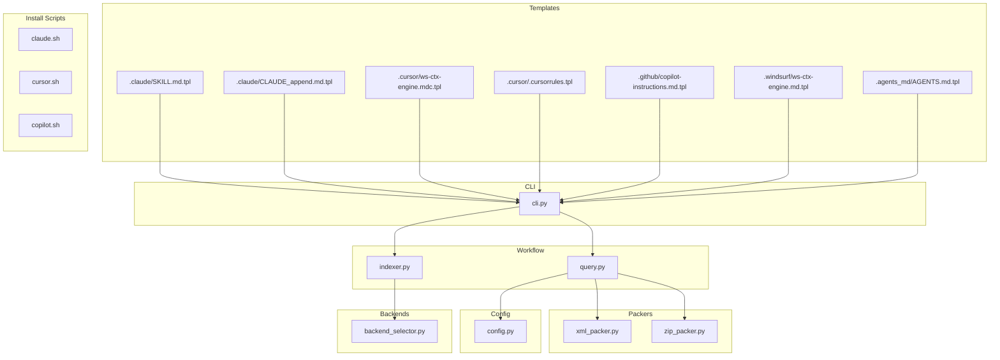
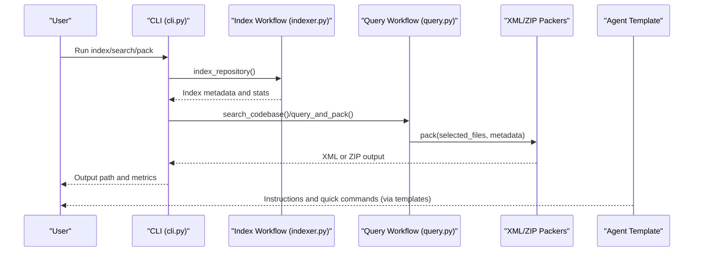
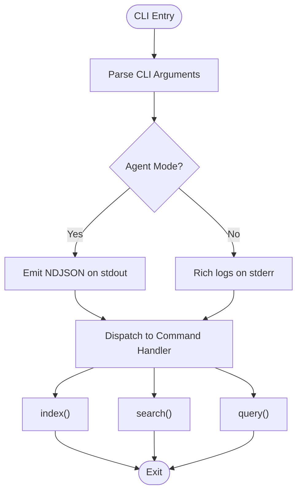
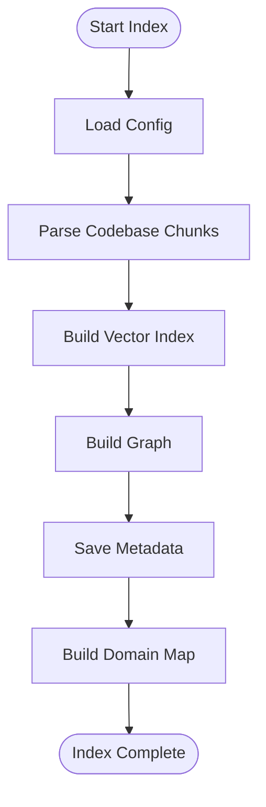
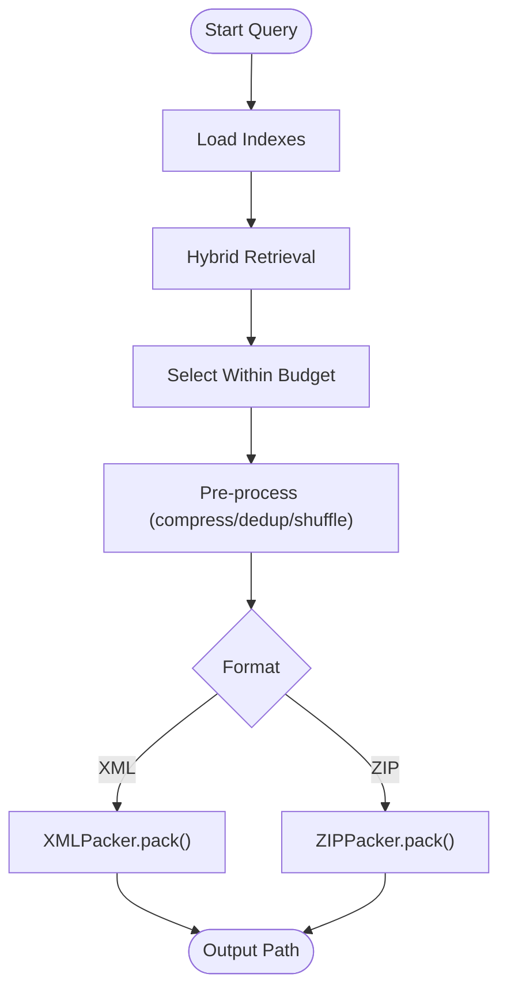
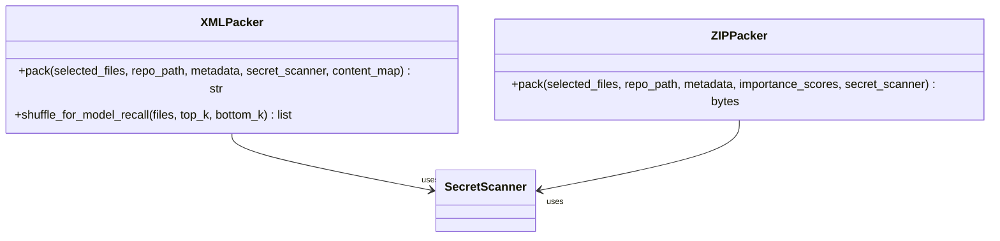
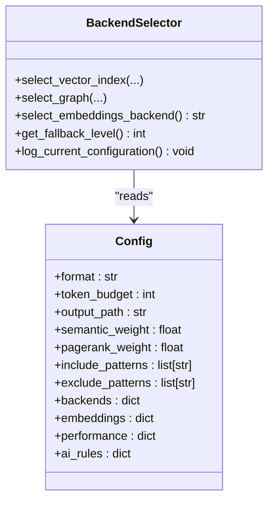
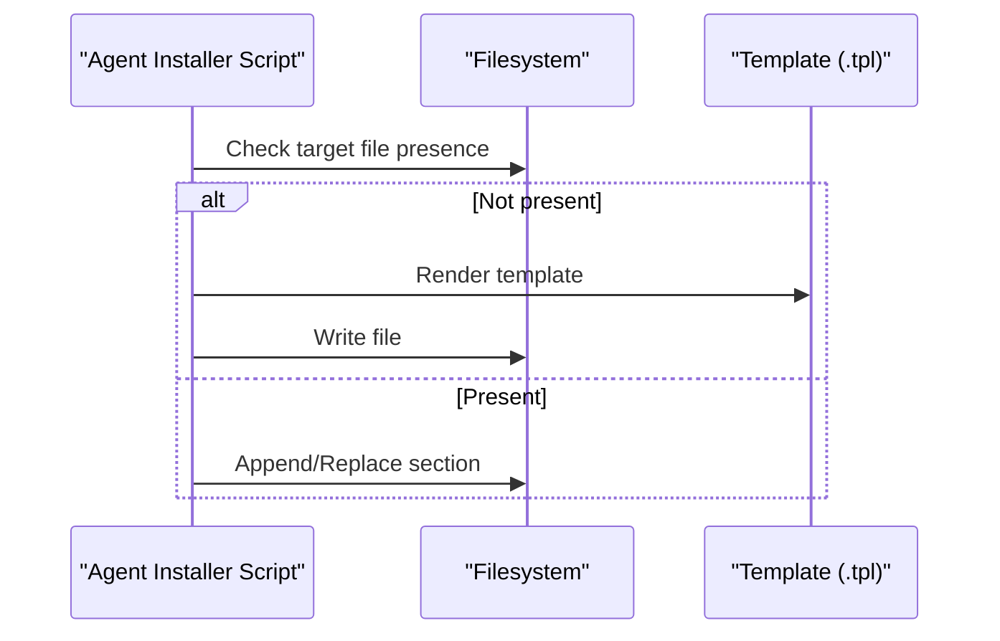
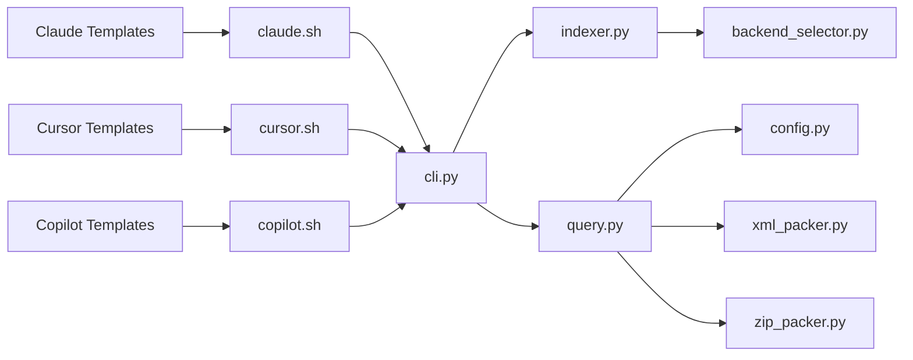

# Agent Templates & Integrations

<cite>
**Referenced Files in This Document**
- [CLAUDÉ_append.md.tpl](file://src/ws_ctx_engine/templates/claude/CLAUDE_append.md.tpl)
- [SKILL.md.tpl](file://src/ws_ctx_engine/templates/claude/SKILL.md.tpl)
- [ws-ctx-engine.mdc.tpl](file://src/ws_ctx_engine/templates/cursor/ws-ctx-engine.mdc.tpl)
- [.cursorrules.tpl](file://src/ws_ctx_engine/templates/cursor/.cursorrules.tpl)
- [copilot-instructions.md.tpl](file://src/ws_ctx_engine/templates/copilot/copilot-instructions.md.tpl)
- [ws-ctx-engine.md.tpl](file://src/ws_ctx_engine/templates/windsurf/ws-ctx-engine.md.tpl)
- [AGENTS.md.tpl](file://src/ws_ctx_engine/templates/agents_md/AGENTS.md.tpl)
- [cli.py](file://src/ws_ctx_engine/cli/cli.py)
- [indexer.py](file://src/ws_ctx_engine/workflow/indexer.py)
- [query.py](file://src/ws_ctx_engine/workflow/query.py)
- [xml_packer.py](file://src/ws_ctx_engine/packer/xml_packer.py)
- [zip_packer.py](file://src/ws_ctx_engine/packer/zip_packer.py)
- [config.py](file://src/ws_ctx_engine/config/config.py)
- [backend_selector.py](file://src/ws_ctx_engine/backend_selector/backend_selector.py)
- [claude.sh](file://src/ws_ctx_engine/scripts/agents/claude.sh)
- [cursor.sh](file://src/ws_ctx_engine/scripts/agents/cursor.sh)
- [copilot.sh](file://src/ws_ctx_engine/scripts/agents/copilot.sh)
</cite>

## Table of Contents
1. [Introduction](#introduction)
2. [Project Structure](#project-structure)
3. [Core Components](#core-components)
4. [Architecture Overview](#architecture-overview)
5. [Detailed Component Analysis](#detailed-component-analysis)
6. [Dependency Analysis](#dependency-analysis)
7. [Performance Considerations](#performance-considerations)
8. [Troubleshooting Guide](#troubleshooting-guide)
9. [Conclusion](#conclusion)
10. [Appendices](#appendices)

## Introduction
This document explains the agent template system that integrates ws-ctx-engine with multiple AI assistants. It covers how templates are structured for Claude, Cursor, Copilot, Windsurf, and generic agents, how they connect to the context packaging workflow, and how to customize them. It also documents the template variables, formatting options, and agent workflow patterns such as context injection, instruction formatting, and output processing. Step-by-step setup guides and troubleshooting advice are included, along with guidance for extending and creating custom agent templates.

## Project Structure
The agent templates live under the templates directory, organized per agent. The CLI orchestrates commands, the workflow modules implement indexing and querying, and packers produce XML or ZIP outputs. Scripts install or update agent-specific files.

**Diagram sources**
- [cli.py:1-1656](file://src/ws_ctx_engine/cli/cli.py#L1-L1656)
- [indexer.py:1-493](file://src/ws_ctx_engine/workflow/indexer.py#L1-L493)
- [query.py:1-617](file://src/ws_ctx_engine/workflow/query.py#L1-L617)
- [xml_packer.py:1-239](file://src/ws_ctx_engine/packer/xml_packer.py#L1-L239)
- [zip_packer.py:1-254](file://src/ws_ctx_engine/packer/zip_packer.py#L1-L254)
- [config.py:1-399](file://src/ws_ctx_engine/config/config.py#L1-L399)
- [backend_selector.py:1-191](file://src/ws_ctx_engine/backend_selector/backend_selector.py#L1-L191)
- [claude.sh:1-38](file://src/ws_ctx_engine/scripts/agents/claude.sh#L1-L38)
- [cursor.sh:1-24](file://src/ws_ctx_engine/scripts/agents/cursor.sh#L1-L24)
- [copilot.sh:1-28](file://src/ws_ctx_engine/scripts/agents/copilot.sh#L1-L28)

**Section sources**
- [cli.py:1-1656](file://src/ws_ctx_engine/cli/cli.py#L1-L1656)
- [indexer.py:1-493](file://src/ws_ctx_engine/workflow/indexer.py#L1-L493)
- [query.py:1-617](file://src/ws_ctx_engine/workflow/query.py#L1-L617)
- [xml_packer.py:1-239](file://src/ws_ctx_engine/packer/xml_packer.py#L1-L239)
- [zip_packer.py:1-254](file://src/ws_ctx_engine/packer/zip_packer.py#L1-L254)
- [config.py:1-399](file://src/ws_ctx_engine/config/config.py#L1-L399)
- [backend_selector.py:1-191](file://src/ws_ctx_engine/backend_selector/backend_selector.py#L1-L191)
- [claude.sh:1-38](file://src/ws_ctx_engine/scripts/agents/claude.sh#L1-L38)
- [cursor.sh:1-24](file://src/ws_ctx_engine/scripts/agents/cursor.sh#L1-L24)
- [copilot.sh:1-28](file://src/ws_ctx_engine/scripts/agents/copilot.sh#L1-L28)

## Core Components
- Template files define agent-specific instructions and quick-start guidance. They embed placeholder variables (for example, CTX_CMD_* placeholders) that are resolved by installation scripts or the CLI.
- The CLI exposes commands for indexing, searching, and packing context, and supports agent mode for machine-readable output.
- The workflow modules implement index building and query-and-pack logic, including budget-aware selection and output packing.
- The packers generate either XML (Repomix-style) or ZIP archives with a manifest.
- Configuration controls output format, token budget, scoring weights, backend selection, and performance tuning.

Key template variables and placeholders commonly used across templates:
- CTX_CMD_INDEX: Index repository command
- CTX_CMD_SEARCH: Search command
- CTX_CMD_PACK: Full workflow command
- CTX_CMD_STATUS: Status check command
- CTX_CMD_FULL_ZIP: Full ZIP output command
- CTX_CMD_FULL_XML: Full XML output command
- CTX_ENGINE_VERSION: Engine version
- CTX_DATE: Date/time of installation/update

These variables are rendered by the agent installation scripts and templates.

**Section sources**
- [CLAUDÉ_append.md.tpl:1-34](file://src/ws_ctx_engine/templates/claude/CLAUDE_append.md.tpl#L1-L34)
- [SKILL.md.tpl](file://src/ws_ctx_engine/templates/claude/SKILL.md.tpl)
- [ws-ctx-engine.mdc.tpl:1-36](file://src/ws_ctx_engine/templates/cursor/ws-ctx-engine.mdc.tpl#L1-L36)
- [.cursorrules.tpl](file://src/ws_ctx_engine/templates/cursor/.cursorrules.tpl)
- [copilot-instructions.md.tpl:1-28](file://src/ws_ctx_engine/templates/copilot/copilot-instructions.md.tpl#L1-L28)
- [ws-ctx-engine.md.tpl:1-45](file://src/ws_ctx_engine/templates/windsurf/ws-ctx-engine.md.tpl#L1-L45)
- [AGENTS.md.tpl:1-103](file://src/ws_ctx_engine/templates/agents_md/AGENTS.md.tpl#L1-L103)
- [cli.py:1-1656](file://src/ws_ctx_engine/cli/cli.py#L1-L1656)
- [config.py:1-399](file://src/ws_ctx_engine/config/config.py#L1-L399)

## Architecture Overview
The agent template system integrates with ws-ctx-engine’s CLI and workflow to deliver context to AI assistants. The CLI orchestrates commands, the workflow handles index creation and retrieval, and the packers produce outputs tailored for each agent.

**Diagram sources**
- [cli.py:1-1656](file://src/ws_ctx_engine/cli/cli.py#L1-L1656)
- [indexer.py:1-493](file://src/ws_ctx_engine/workflow/indexer.py#L1-L493)
- [query.py:1-617](file://src/ws_ctx_engine/workflow/query.py#L1-L617)
- [xml_packer.py:1-239](file://src/ws_ctx_engine/packer/xml_packer.py#L1-L239)
- [zip_packer.py:1-254](file://src/ws_ctx_engine/packer/zip_packer.py#L1-L254)

## Detailed Component Analysis

### Template Structure and Variables
- Claude templates:
  - Skill definition and append sections guide Claude to use ws-ctx-engine for code packaging.
  - Variables include CTX_CMD_* placeholders and engine metadata.
- Cursor templates:
  - MDC rules and legacy cursorrules provide navigation and context instructions.
- Copilot template:
  - Markdown instructions for integrating with Copilot, including output formats.
- Windsurf template:
  - Agent-specific guidance for Windsurf with command examples and tips.
- Generic agents index:
  - Comprehensive commands reference and use cases for multiple agents.

Template variables commonly used:
- CTX_CMD_INDEX, CTX_CMD_SEARCH, CTX_CMD_PACK, CTX_CMD_STATUS, CTX_CMD_FULL_ZIP, CTX_CMD_FULL_XML
- CTX_ENGINE_VERSION, CTX_DATE

These variables are resolved by installation scripts and rendered into agent-specific files.

**Section sources**
- [CLAUDÉ_append.md.tpl:1-34](file://src/ws_ctx_engine/templates/claude/CLAUDE_append.md.tpl#L1-L34)
- [SKILL.md.tpl](file://src/ws_ctx_engine/templates/claude/SKILL.md.tpl)
- [ws-ctx-engine.mdc.tpl:1-36](file://src/ws_ctx_engine/templates/cursor/ws-ctx-engine.mdc.tpl#L1-L36)
- [.cursorrules.tpl](file://src/ws_ctx_engine/templates/cursor/.cursorrules.tpl)
- [copilot-instructions.md.tpl:1-28](file://src/ws_ctx_engine/templates/copilot/copilot-instructions.md.tpl#L1-L28)
- [ws-ctx-engine.md.tpl:1-45](file://src/ws_ctx_engine/templates/windsurf/ws-ctx-engine.md.tpl#L1-L45)
- [AGENTS.md.tpl:1-103](file://src/ws_ctx_engine/templates/agents_md/AGENTS.md.tpl#L1-L103)

### CLI and Agent Mode
- The CLI supports agent mode to emit parseable NDJSON on stdout while sending human-readable logs to stderr.
- Commands include index, search, query, and mcp, with extensive options for output format, token budget, and agent phases.
- The CLI validates configuration, manages runtime dependencies, and coordinates with the workflow modules.

**Diagram sources**
- [cli.py:1-1656](file://src/ws_ctx_engine/cli/cli.py#L1-L1656)

**Section sources**
- [cli.py:1-1656](file://src/ws_ctx_engine/cli/cli.py#L1-L1656)

### Indexing Workflow
- Builds vector index, graph, and domain map; supports incremental updates and metadata staleness detection.
- Uses backend selector to choose optimal backends with graceful fallback.

**Diagram sources**
- [indexer.py:1-493](file://src/ws_ctx_engine/workflow/indexer.py#L1-L493)
- [backend_selector.py:1-191](file://src/ws_ctx_engine/backend_selector/backend_selector.py#L1-L191)

**Section sources**
- [indexer.py:1-493](file://src/ws_ctx_engine/workflow/indexer.py#L1-L493)
- [backend_selector.py:1-191](file://src/ws_ctx_engine/backend_selector/backend_selector.py#L1-L191)

### Query and Pack Workflow
- Loads indexes, retrieves candidates with hybrid ranking, selects files within token budget, and packs output in XML or ZIP.
- Supports optional compression, secret scanning, and session-level deduplication.

**Diagram sources**
- [query.py:1-617](file://src/ws_ctx_engine/workflow/query.py#L1-L617)
- [xml_packer.py:1-239](file://src/ws_ctx_engine/packer/xml_packer.py#L1-L239)
- [zip_packer.py:1-254](file://src/ws_ctx_engine/packer/zip_packer.py#L1-L254)

**Section sources**
- [query.py:1-617](file://src/ws_ctx_engine/workflow/query.py#L1-L617)
- [xml_packer.py:1-239](file://src/ws_ctx_engine/packer/xml_packer.py#L1-L239)
- [zip_packer.py:1-254](file://src/ws_ctx_engine/packer/zip_packer.py#L1-L254)

### Output Formatting and Content Generation
- XMLPacker produces Repomix-style XML with metadata and file contents, optionally shuffled to improve recall.
- ZIPPacker creates ZIP archives with a manifest and preserved directory structure.
- Both support secret scanning and content redaction.

**Diagram sources**
- [xml_packer.py:1-239](file://src/ws_ctx_engine/packer/xml_packer.py#L1-L239)
- [zip_packer.py:1-254](file://src/ws_ctx_engine/packer/zip_packer.py#L1-L254)

**Section sources**
- [xml_packer.py:1-239](file://src/ws_ctx_engine/packer/xml_packer.py#L1-L239)
- [zip_packer.py:1-254](file://src/ws_ctx_engine/packer/zip_packer.py#L1-L254)

### Configuration and Backend Selection
- Config defines output format, token budget, scoring weights, include/exclude patterns, backend selection, embeddings, and performance tuning.
- BackendSelector chooses vector index, graph, and embeddings backends with fallback levels.

**Diagram sources**
- [config.py:1-399](file://src/ws_ctx_engine/config/config.py#L1-L399)
- [backend_selector.py:1-191](file://src/ws_ctx_engine/backend_selector/backend_selector.py#L1-L191)

**Section sources**
- [config.py:1-399](file://src/ws_ctx_engine/config/config.py#L1-L399)
- [backend_selector.py:1-191](file://src/ws_ctx_engine/backend_selector/backend_selector.py#L1-L191)

### Agent Setup and Integration Scripts
- Claude installer writes a skill and appends a section to the agent’s documentation.
- Cursor installer writes MDC rules and legacy cursorrules.
- Copilot installer appends instructions to the agent’s documentation.

**Diagram sources**
- [claude.sh:1-38](file://src/ws_ctx_engine/scripts/agents/claude.sh#L1-L38)
- [cursor.sh:1-24](file://src/ws_ctx_engine/scripts/agents/cursor.sh#L1-L24)
- [copilot.sh:1-28](file://src/ws_ctx_engine/scripts/agents/copilot.sh#L1-L28)

**Section sources**
- [claude.sh:1-38](file://src/ws_ctx_engine/scripts/agents/claude.sh#L1-L38)
- [cursor.sh:1-24](file://src/ws_ctx_engine/scripts/agents/cursor.sh#L1-L24)
- [copilot.sh:1-28](file://src/ws_ctx_engine/scripts/agents/copilot.sh#L1-L28)

## Dependency Analysis
The agent templates are consumed by installation scripts and the CLI. The CLI depends on workflow modules and packers. The workflow modules depend on configuration and backend selection.

**Diagram sources**
- [cli.py:1-1656](file://src/ws_ctx_engine/cli/cli.py#L1-L1656)
- [indexer.py:1-493](file://src/ws_ctx_engine/workflow/indexer.py#L1-L493)
- [query.py:1-617](file://src/ws_ctx_engine/workflow/query.py#L1-L617)
- [xml_packer.py:1-239](file://src/ws_ctx_engine/packer/xml_packer.py#L1-L239)
- [zip_packer.py:1-254](file://src/ws_ctx_engine/packer/zip_packer.py#L1-L254)
- [config.py:1-399](file://src/ws_ctx_engine/config/config.py#L1-L399)
- [backend_selector.py:1-191](file://src/ws_ctx_engine/backend_selector/backend_selector.py#L1-L191)
- [claude.sh:1-38](file://src/ws_ctx_engine/scripts/agents/claude.sh#L1-L38)
- [cursor.sh:1-24](file://src/ws_ctx_engine/scripts/agents/cursor.sh#L1-L24)
- [copilot.sh:1-28](file://src/ws_ctx_engine/scripts/agents/copilot.sh#L1-L28)

**Section sources**
- [cli.py:1-1656](file://src/ws_ctx_engine/cli/cli.py#L1-L1656)
- [indexer.py:1-493](file://src/ws_ctx_engine/workflow/indexer.py#L1-L493)
- [query.py:1-617](file://src/ws_ctx_engine/workflow/query.py#L1-L617)
- [xml_packer.py:1-239](file://src/ws_ctx_engine/packer/xml_packer.py#L1-L239)
- [zip_packer.py:1-254](file://src/ws_ctx_engine/packer/zip_packer.py#L1-L254)
- [config.py:1-399](file://src/ws_ctx_engine/config/config.py#L1-L399)
- [backend_selector.py:1-191](file://src/ws_ctx_engine/backend_selector/backend_selector.py#L1-L191)
- [claude.sh:1-38](file://src/ws_ctx_engine/scripts/agents/claude.sh#L1-L38)
- [cursor.sh:1-24](file://src/ws_ctx_engine/scripts/agents/cursor.sh#L1-L24)
- [copilot.sh:1-28](file://src/ws_ctx_engine/scripts/agents/copilot.sh#L1-L28)

## Performance Considerations
- Token budget controls output size; adjust per agent constraints.
- Shuffle improves model recall for XML output.
- Incremental indexing reduces rebuild overhead when files change.
- Compression and deduplication reduce token usage and improve throughput.
- Backend selection affects speed and resource usage; prefer optimal backends when available.

[No sources needed since this section provides general guidance]

## Troubleshooting Guide
Common issues and resolutions:
- Index not found: Run the index command first to build indexes.
- Stale indexes: The system can auto-rebuild; check status and rebuild if needed.
- Missing dependencies: Use the doctor command to diagnose optional dependencies and install recommended extras.
- Clipboard copy failures: Some systems lack clipboard tools; the CLI warns and continues.
- Unsupported format: Ensure format is one of xml, zip, json, yaml, md, or toon.

**Section sources**
- [cli.py:1-1656](file://src/ws_ctx_engine/cli/cli.py#L1-L1656)
- [query.py:1-617](file://src/ws_ctx_engine/workflow/query.py#L1-L617)

## Conclusion
The agent template system provides a flexible, extensible way to integrate ws-ctx-engine with multiple AI assistants. Templates define agent-specific instructions, while the CLI and workflow modules implement robust indexing, querying, and output generation. By leveraging configuration, backend selection, and packers, teams can tailor context delivery to each agent’s needs and constraints.

[No sources needed since this section summarizes without analyzing specific files]

## Appendices

### Step-by-Step Setup Guides

- Claude
  - Install the Claude skill and append the documentation section to the agent’s documentation.
  - Use the installer script to render and write the appropriate files.
  - Reference the rendered commands and quick-start guidance in the agent documentation.

  **Section sources**
  - [claude.sh:1-38](file://src/ws_ctx_engine/scripts/agents/claude.sh#L1-L38)
  - [CLAUDÉ_append.md.tpl:1-34](file://src/ws_ctx_engine/templates/claude/CLAUDE_append.md.tpl#L1-L34)
  - [SKILL.md.tpl](file://src/ws_ctx_engine/templates/claude/SKILL.md.tpl)

- Cursor
  - Install MDC rules and legacy cursorrules into the Cursor configuration directory.
  - The installer script renders templates and writes files if they do not exist or are overwritten when forced.

  **Section sources**
  - [cursor.sh:1-24](file://src/ws_ctx_engine/scripts/agents/cursor.sh#L1-L24)
  - [ws-ctx-engine.mdc.tpl:1-36](file://src/ws_ctx_engine/templates/cursor/ws-ctx-engine.mdc.tpl#L1-L36)
  - [.cursorrules.tpl](file://src/ws_ctx_engine/templates/cursor/.cursorrules.tpl)

- Copilot
  - Append instructions to the agent’s documentation file.
  - The installer checks for existing content and replaces or appends as needed.

  **Section sources**
  - [copilot.sh:1-28](file://src/ws_ctx_engine/scripts/agents/copilot.sh#L1-L28)
  - [copilot-instructions.md.tpl:1-28](file://src/ws_ctx_engine/templates/copilot/copilot-instructions.md.tpl#L1-L28)

- Windsurf
  - Use the agent-specific template to guide indexing, querying, and packing workflows.
  - Follow the commands and tips for optimal context delivery.

  **Section sources**
  - [ws-ctx-engine.md.tpl:1-45](file://src/ws_ctx_engine/templates/windsurf/ws-ctx-engine.md.tpl#L1-L45)

- Generic Agents
  - Use the agents index template for a unified commands reference and use cases.
  - Customize as needed for team-specific workflows.

  **Section sources**
  - [AGENTS.md.tpl:1-103](file://src/ws_ctx_engine/templates/agents_md/AGENTS.md.tpl#L1-L103)

### Template Variables Reference
- CTX_CMD_INDEX: Index repository command
- CTX_CMD_SEARCH: Search command
- CTX_CMD_PACK: Full workflow command
- CTX_CMD_STATUS: Status check command
- CTX_CMD_FULL_ZIP: Full ZIP output command
- CTX_CMD_FULL_XML: Full XML output command
- CTX_ENGINE_VERSION: Engine version
- CTX_DATE: Date/time of installation/update

These variables are rendered by installation scripts and templates.

**Section sources**
- [AGENTS.md.tpl:1-103](file://src/ws_ctx_engine/templates/agents_md/AGENTS.md.tpl#L1-L103)
- [CLAUDÉ_append.md.tpl:1-34](file://src/ws_ctx_engine/templates/claude/CLAUDE_append.md.tpl#L1-L34)
- [ws-ctx-engine.mdc.tpl:1-36](file://src/ws_ctx_engine/templates/cursor/ws-ctx-engine.mdc.tpl#L1-L36)
- [copilot-instructions.md.tpl:1-28](file://src/ws_ctx_engine/templates/copilot/copilot-instructions.md.tpl#L1-L28)
- [ws-ctx-engine.md.tpl:1-45](file://src/ws_ctx_engine/templates/windsurf/ws-ctx-engine.md.tpl#L1-L45)

### Creating Custom Agent Templates
- Place a new template under the templates directory in a suitable subfolder (for example, .agents/<agent>/).
- Use the established variable naming scheme (CTX_CMD_*, CTX_ENGINE_VERSION, CTX_DATE).
- Keep instructions concise and include quick commands and use cases.
- Provide a setup script similar to existing agents to render and install the template into the agent’s configuration.

**Section sources**
- [cli.py:1-1656](file://src/ws_ctx_engine/cli/cli.py#L1-L1656)
- [config.py:1-399](file://src/ws_ctx_engine/config/config.py#L1-L399)