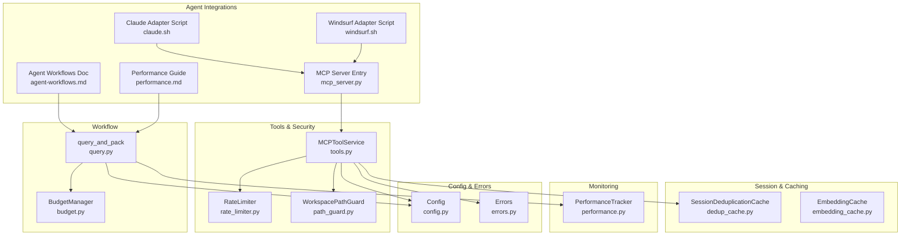
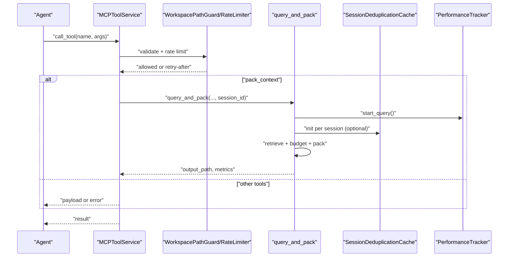
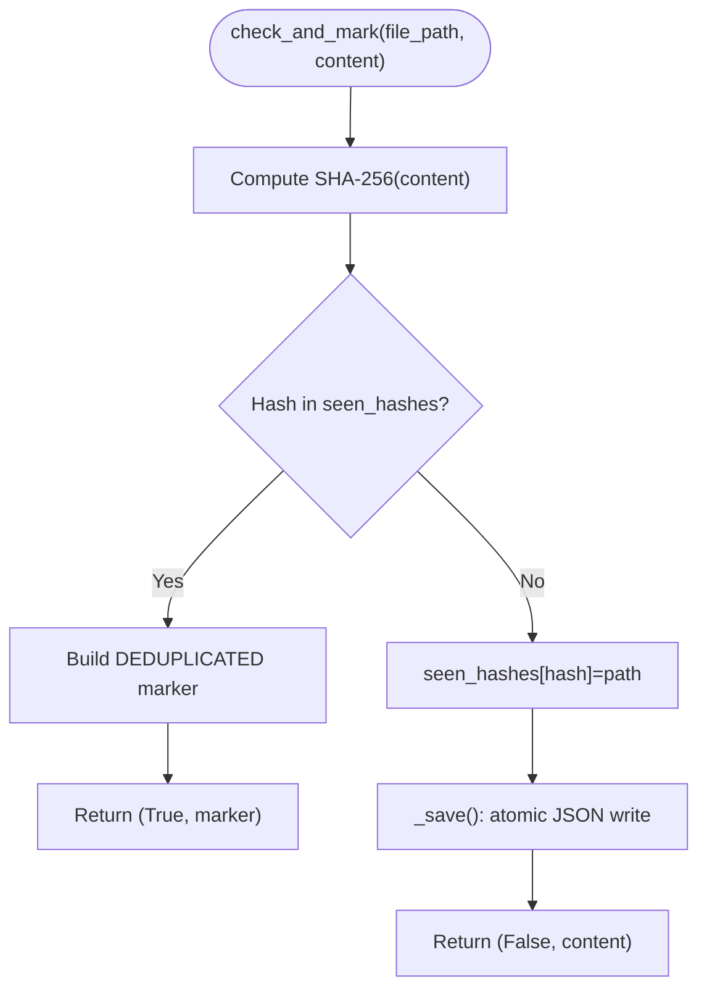
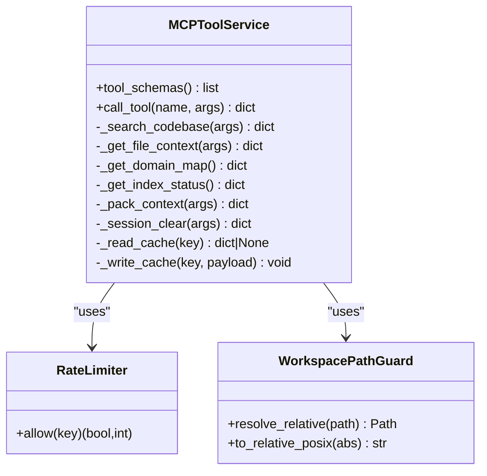
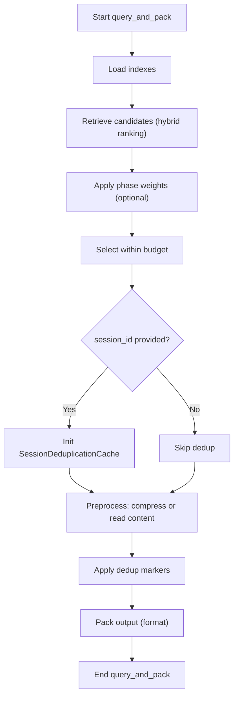
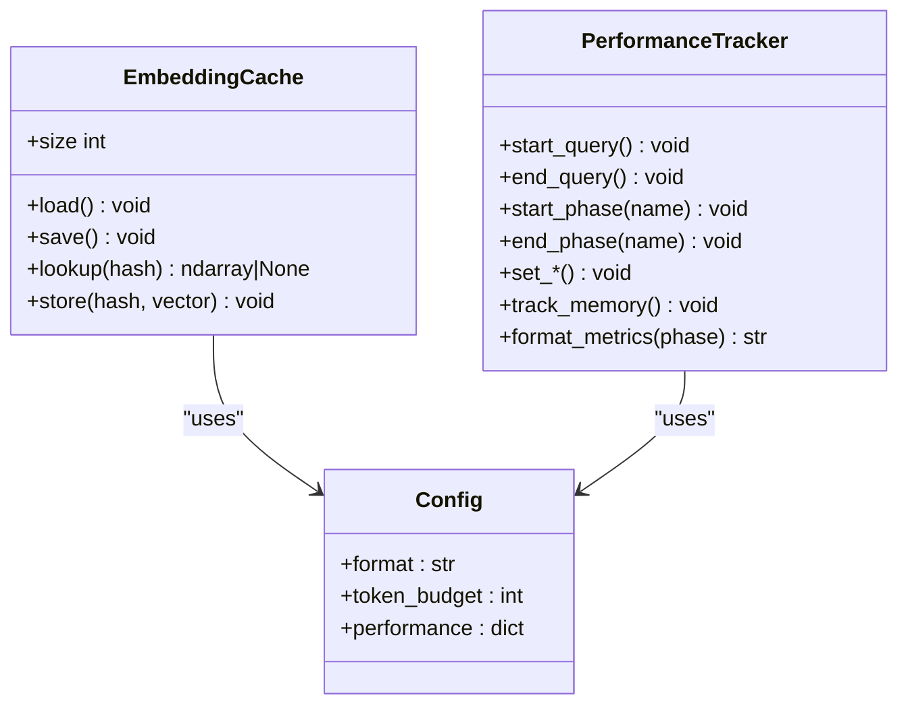
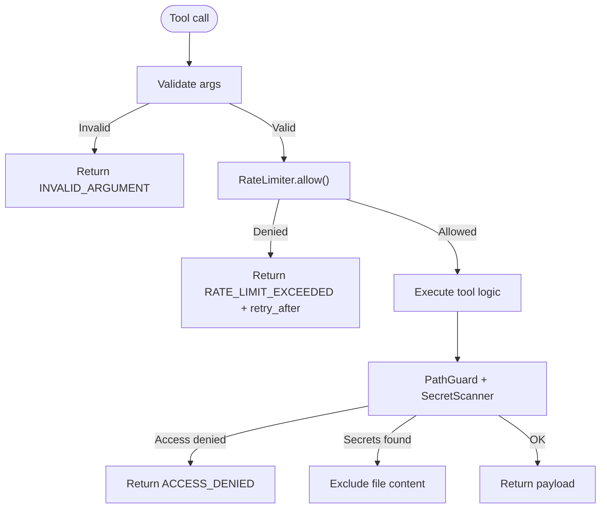
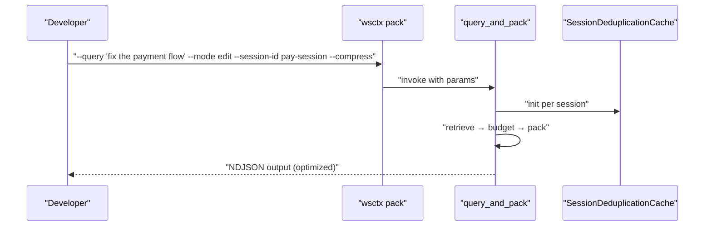
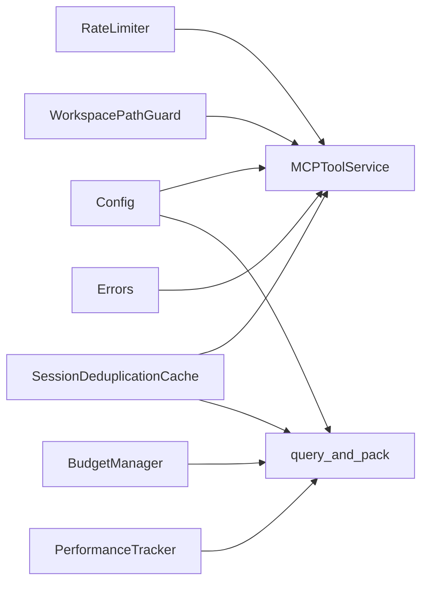

# Integration Patterns & Best Practices

<cite>
**Referenced Files in This Document**
- [dedup_cache.py](file://src/ws_ctx_engine/session/dedup_cache.py)
- [tools.py](file://src/ws_ctx_engine/mcp/tools.py)
- [query.py](file://src/ws_ctx_engine/workflow/query.py)
- [performance.py](file://src/ws_ctx_engine/monitoring/performance.py)
- [errors.py](file://src/ws_ctx_engine/errors/errors.py)
- [config.py](file://src/ws_ctx_engine/config/config.py)
- [budget.py](file://src/ws_ctx_engine/budget/budget.py)
- [rate_limiter.py](file://src/ws_ctx_engine/mcp/security/rate_limiter.py)
- [path_guard.py](file://src/ws_ctx_engine/mcp/security/path_guard.py)
- [mcp_server.py](file://src/ws_ctx_engine/mcp_server.py)
- [agent-workflows.md](file://docs/integrations/agent-workflows.md)
- [performance.md](file://docs/guides/performance.md)
- [claude.sh](file://src/ws_ctx_engine/scripts/agents/claude.sh)
- [windsurf.sh](file://src/ws_ctx_engine/scripts/agents/windsurf.sh)
</cite>

## Table of Contents
1. [Introduction](#introduction)
2. [Project Structure](#project-structure)
3. [Core Components](#core-components)
4. [Architecture Overview](#architecture-overview)
5. [Detailed Component Analysis](#detailed-component-analysis)
6. [Dependency Analysis](#dependency-analysis)
7. [Performance Considerations](#performance-considerations)
8. [Troubleshooting Guide](#troubleshooting-guide)
9. [Conclusion](#conclusion)
10. [Appendices](#appendices)

## Introduction
This document provides advanced integration patterns and best practices for building robust agent workflows with ws-ctx-engine. It focuses on:
- Session management and semantic deduplication to reduce token waste
- Tool implementation patterns for agent interactions, including method signatures and parameter validation
- Performance optimization techniques (caching, batching, resource management)
- Error handling, retry mechanisms, and graceful degradation
- Practical examples of complex integrations, workflow orchestration, and monitoring
- Scalability, load balancing, and distributed deployment considerations
- Debugging, profiling, and troubleshooting guidance

## Project Structure
The repository organizes functionality around a modular pipeline:
- Session management and caching: session deduplication and embedding cache
- Tooling and MCP integration: tool service, rate limiting, and security guards
- Workflow orchestration: query, budgeting, packing, and output generation
- Monitoring and performance tracking
- Configuration and error modeling
- Agent adapters and documentation

**Diagram sources**
- [dedup_cache.py:35-154](file://src/ws_ctx_engine/session/dedup_cache.py#L35-L154)
- [tools.py:29-672](file://src/ws_ctx_engine/mcp/tools.py#L29-L672)
- [query.py:230-617](file://src/ws_ctx_engine/workflow/query.py#L230-L617)
- [performance.py:72-263](file://src/ws_ctx_engine/monitoring/performance.py#L72-L263)
- [errors.py:10-320](file://src/ws_ctx_engine/errors/errors.py#L10-L320)
- [config.py:16-399](file://src/ws_ctx_engine/config/config.py#L16-L399)
- [budget.py:8-105](file://src/ws_ctx_engine/budget/budget.py#L8-L105)
- [rate_limiter.py:14-45](file://src/ws_ctx_engine/mcp/security/rate_limiter.py#L14-L45)
- [path_guard.py:6-31](file://src/ws_ctx_engine/mcp/security/path_guard.py#L6-L31)
- [mcp_server.py:6-12](file://src/ws_ctx_engine/mcp_server.py#L6-L12)
- [agent-workflows.md:1-103](file://docs/integrations/agent-workflows.md#L1-L103)
- [performance.md:1-81](file://docs/guides/performance.md#L1-L81)
- [claude.sh:1-38](file://src/ws_ctx_engine/scripts/agents/claude.sh#L1-L38)
- [windsurf.sh:1-16](file://src/ws_ctx_engine/scripts/agents/windsurf.sh#L1-L16)

**Section sources**
- [agent-workflows.md:1-103](file://docs/integrations/agent-workflows.md#L1-L103)
- [performance.md:1-81](file://docs/guides/performance.md#L1-L81)

## Core Components
- SessionDeduplicationCache: Lightweight, disk-persisted cache keyed by content hash to replace repeated file content with a compact marker during an agent session.
- MCPToolService: Centralized tool registry and executor implementing validation, rate limiting, caching, and security checks for agent interactions.
- query_and_pack: End-to-end workflow orchestrating index loading, retrieval, budget selection, pre-processing (compression/dedup), and output packing.
- PerformanceTracker: Structured metrics collection for indexing and query phases, including memory tracking and formatted reporting.
- Config: Robust configuration loader with validation and defaults for output format, token budget, weights, filters, backends, and performance toggles.
- BudgetManager: Greedy knapsack selection respecting a token budget with 80% content allocation and 20% for metadata.
- RateLimiter: Fixed-window token bucket limiter per tool with retry-after calculation.
- WorkspacePathGuard: Enforces safe path resolution within the workspace boundary.
- Error classes: Structured exceptions with actionable suggestions for configuration, parsing, indexing, and budget issues.

**Section sources**
- [dedup_cache.py:35-154](file://src/ws_ctx_engine/session/dedup_cache.py#L35-L154)
- [tools.py:29-672](file://src/ws_ctx_engine/mcp/tools.py#L29-L672)
- [query.py:230-617](file://src/ws_ctx_engine/workflow/query.py#L230-L617)
- [performance.py:72-263](file://src/ws_ctx_engine/monitoring/performance.py#L72-L263)
- [config.py:16-399](file://src/ws_ctx_engine/config/config.py#L16-L399)
- [budget.py:8-105](file://src/ws_ctx_engine/budget/budget.py#L8-L105)
- [rate_limiter.py:14-45](file://src/ws_ctx_engine/mcp/security/rate_limiter.py#L14-L45)
- [path_guard.py:6-31](file://src/ws_ctx_engine/mcp/security/path_guard.py#L6-L31)
- [errors.py:10-320](file://src/ws_ctx_engine/errors/errors.py#L10-L320)

## Architecture Overview
The agent workflow integrates CLI-driven or MCP-driven tool calls into a cohesive pipeline:
- Tools receive validated inputs, enforce rate limits, and leverage caches for index status.
- The query pipeline loads indexes, retrieves candidates, applies phase-aware ranking, selects within budget, optionally deduplicates and compresses content, and packs output.
- Performance metrics are tracked across phases and can be logged or formatted for observability.
- Security and safety controls guard workspace boundaries and sanitize sensitive content.

**Diagram sources**
- [tools.py:133-184](file://src/ws_ctx_engine/mcp/tools.py#L133-L184)
- [query.py:230-617](file://src/ws_ctx_engine/workflow/query.py#L230-L617)
- [dedup_cache.py:65-89](file://src/ws_ctx_engine/session/dedup_cache.py#L65-L89)
- [performance.py:88-133](file://src/ws_ctx_engine/monitoring/performance.py#L88-L133)

## Detailed Component Analysis

### Session Management with SessionDeduplicationCache
- Purpose: Replace repeated file content with a compact marker during an agent session to reduce tokens and cost.
- Strategy:
  - Persist cache per session_id to disk under the index directory.
  - Compute SHA-256 over file content; deduplicate if hash seen in session.
  - Atomic writes to avoid corruption under concurrent access.
  - Path traversal protection by resolving cache location within permitted directory.
- Memory optimization:
  - Only tracks content hashes; memory footprint grows linearly with unique content seen in a session.
  - On-disk persistence enables reuse across separate CLI invocations sharing the same session_id.
- Usage in workflows:
  - query_and_pack conditionally initializes the cache when session_id is provided and applies dedup across preprocessed content.

**Diagram sources**
- [dedup_cache.py:65-137](file://src/ws_ctx_engine/session/dedup_cache.py#L65-L137)

**Section sources**
- [dedup_cache.py:35-154](file://src/ws_ctx_engine/session/dedup_cache.py#L35-L154)
- [query.py:427-490](file://src/ws_ctx_engine/workflow/query.py#L427-L490)

### Tool Implementation Patterns for Agent Interactions
- Tool schemas define input schemas with required fields, enums, and defaults.
- Validation:
  - Strict argument validation with explicit error payloads for malformed inputs.
  - Canonical tool names normalize aliases for consistent caching and rate-limiting keys.
- Caching:
  - Short-lived in-memory cache for index status and domain map results keyed by canonical tool name.
  - TTL controlled by MCP configuration.
- Security:
  - WorkspacePathGuard ensures all requested paths resolve within the workspace.
  - Secret scanning excludes files containing detected secrets from content delivery.
- Rate limiting:
  - Per-tool token buckets with refill and retry-after computation.
- Error handling:
  - Structured error responses with machine-readable codes and human-friendly messages.

**Diagram sources**
- [tools.py:29-672](file://src/ws_ctx_engine/mcp/tools.py#L29-L672)
- [rate_limiter.py:14-45](file://src/ws_ctx_engine/mcp/security/rate_limiter.py#L14-L45)
- [path_guard.py:6-31](file://src/ws_ctx_engine/mcp/security/path_guard.py#L6-L31)

**Section sources**
- [tools.py:43-184](file://src/ws_ctx_engine/mcp/tools.py#L43-L184)
- [rate_limiter.py:14-45](file://src/ws_ctx_engine/mcp/security/rate_limiter.py#L14-L45)
- [path_guard.py:6-31](file://src/ws_ctx_engine/mcp/security/path_guard.py#L6-L31)

### Workflow Orchestration and Parameter Handling
- query_and_pack coordinates four phases:
  1) Index loading with auto-rebuild and health reporting
  2) Hybrid retrieval with optional phase-aware re-weighting
  3) Budget selection using greedy knapsack with 80% content budget
  4) Packing into XML/ZIP/JSON/YAML/TOON/Markdown with optional compression and dedup
- Parameter handling:
  - Validates format, token budget, agent phase, and optional session_id.
  - Supports secrets_scan and compress toggles.
- Session deduplication:
  - Initializes per-session cache and replaces repeated content with markers.
- Output metadata:
  - Includes repo name, file count, total tokens, query, changed_files, timestamp, index health, session_id, and deduplicated_files count.

**Diagram sources**
- [query.py:230-617](file://src/ws_ctx_engine/workflow/query.py#L230-L617)

**Section sources**
- [query.py:230-617](file://src/ws_ctx_engine/workflow/query.py#L230-L617)
- [budget.py:50-105](file://src/ws_ctx_engine/budget/budget.py#L50-L105)

### Performance Optimization Techniques
- Caching:
  - EmbeddingCache persists vectors and indices to disk for incremental rebuilds.
  - MCPToolService caches index status and domain map results with TTL.
  - SessionDeduplicationCache persists per-session seen hashes to disk.
- Batching and resource management:
  - BudgetManager reserves 20% of token budget for metadata and uses 80% for content.
  - Optional compression reduces token counts for supporting files.
  - Shuffle for XML improves model recall by prioritizing top-ranked files.
- Observability:
  - PerformanceTracker measures phase timings, file counts, token totals, and memory usage.
- Rust acceleration:
  - Optional Rust extension accelerates hot-path operations (file walking, hashing, token counting).

**Diagram sources**
- [embedding_cache.py:28-127](file://src/ws_ctx_engine/vector_index/embedding_cache.py#L28-L127)
- [performance.py:72-263](file://src/ws_ctx_engine/monitoring/performance.py#L72-L263)
- [config.py:16-399](file://src/ws_ctx_engine/config/config.py#L16-L399)

**Section sources**
- [embedding_cache.py:28-127](file://src/ws_ctx_engine/vector_index/embedding_cache.py#L28-L127)
- [performance.py:72-263](file://src/ws_ctx_engine/monitoring/performance.py#L72-L263)
- [config.py:94-101](file://src/ws_ctx_engine/config/config.py#L94-L101)
- [performance.md:1-81](file://docs/guides/performance.md#L1-L81)

### Error Handling Strategies, Retry Mechanisms, and Graceful Degradation
- Structured errors:
  - WsCtxEngineError and subclasses provide actionable suggestions for configuration, parsing, indexing, and budget issues.
- Tool-level resilience:
  - RateLimiter returns retry-after seconds; MCPToolService surfaces RATE_LIMIT_EXCEEDED with backoff guidance.
  - PathGuard raises ACCESS_DENIED for out-of-bounds requests.
  - Secret scanning excludes sensitive files and returns sanitized metadata.
- Graceful degradation:
  - Optional components (e.g., session dedup, compression, shuffle) are wrapped in try/except blocks and ignored if initialization or execution fails.
  - Domain map fallback to empty map if DB cannot be loaded.
  - Memory tracking disabled if psutil is unavailable.

**Diagram sources**
- [tools.py:156-184](file://src/ws_ctx_engine/mcp/tools.py#L156-L184)
- [rate_limiter.py:19-44](file://src/ws_ctx_engine/mcp/security/rate_limiter.py#L19-L44)
- [path_guard.py:10-18](file://src/ws_ctx_engine/mcp/security/path_guard.py#L10-L18)
- [errors.py:10-320](file://src/ws_ctx_engine/errors/errors.py#L10-L320)

**Section sources**
- [tools.py:156-184](file://src/ws_ctx_engine/mcp/tools.py#L156-L184)
- [errors.py:10-320](file://src/ws_ctx_engine/errors/errors.py#L10-L320)

### Practical Examples of Complex Agent Integrations
- Phase-aware context selection:
  - Use agent modes (discovery/edit/test) to tailor ranking and output density.
- Semantic deduplication:
  - Enable session-based deduplication to avoid repeating the same file content across agent calls.
- AI rule persistence:
  - Automatic inclusion of AI rule files (e.g., .cursorrules, AGENTS.md) to provide essential project context.
- Combined optimized workflow:
  - Single command combining query, mode tuning, session dedup, compression, and shuffled output for agent consumption.

**Diagram sources**
- [agent-workflows.md:85-103](file://docs/integrations/agent-workflows.md#L85-L103)
- [query.py:230-617](file://src/ws_ctx_engine/workflow/query.py#L230-L617)

**Section sources**
- [agent-workflows.md:1-103](file://docs/integrations/agent-workflows.md#L1-L103)

### Monitoring Approaches
- PerformanceTracker records:
  - Indexing and query phase durations
  - Files processed, files selected, total tokens
  - Index size and peak memory usage
- Formatting and logging:
  - Human-readable summaries and structured metrics for dashboards.

**Section sources**
- [performance.py:13-263](file://src/ws_ctx_engine/monitoring/performance.py#L13-L263)

## Dependency Analysis
Key dependencies and coupling:
- MCPToolService depends on Config, DomainMapDB, SecretScanner, RateLimiter, and SessionDeduplicationCache.
- query_and_pack depends on BudgetManager, RetrievalEngine, Packer/Formatters, and PerformanceTracker.
- Security components (WorkspacePathGuard, RateLimiter) are cross-cutting concerns enforced at tool boundaries.
- Config centralizes validation and defaults, minimizing coupling to downstream components.

**Diagram sources**
- [tools.py:29-672](file://src/ws_ctx_engine/mcp/tools.py#L29-L672)
- [query.py:230-617](file://src/ws_ctx_engine/workflow/query.py#L230-L617)
- [config.py:16-399](file://src/ws_ctx_engine/config/config.py#L16-L399)
- [budget.py:8-105](file://src/ws_ctx_engine/budget/budget.py#L8-L105)
- [performance.py:72-263](file://src/ws_ctx_engine/monitoring/performance.py#L72-L263)
- [errors.py:10-320](file://src/ws_ctx_engine/errors/errors.py#L10-L320)

**Section sources**
- [tools.py:29-672](file://src/ws_ctx_engine/mcp/tools.py#L29-L672)
- [query.py:230-617](file://src/ws_ctx_engine/workflow/query.py#L230-L617)

## Performance Considerations
- Prefer session-based deduplication to minimize repeated content transmission.
- Tune token_budget conservatively; reserve ~20% for metadata.
- Use compression for supporting files to reduce token counts.
- Enable Rust extension for significant speedups in file walking, hashing, and token counting.
- Monitor memory usage with PerformanceTracker and cap workers where applicable.

[No sources needed since this section provides general guidance]

## Troubleshooting Guide
Common issues and remedies:
- Rate limit exceeded:
  - Observe retry-after seconds and back off before retrying.
- Access denied:
  - Ensure requested paths resolve within the workspace root.
- Index not found or stale:
  - Rebuild indexes with the index command; verify VCS status and metadata.
- Budget exceeded:
  - Increase token_budget or reduce file selection.
- Secrets detected:
  - Remove or redact sensitive content; re-index after remediation.
- Missing dependencies:
  - Install required backends or optional packages as suggested by structured errors.

**Section sources**
- [tools.py:156-184](file://src/ws_ctx_engine/mcp/tools.py#L156-L184)
- [errors.py:31-320](file://src/ws_ctx_engine/errors/errors.py#L31-L320)
- [performance.md:1-81](file://docs/guides/performance.md#L1-L81)

## Conclusion
By combining session-level deduplication, structured tooling with validation and rate limiting, robust budgeting, and comprehensive monitoring, ws-ctx-engine delivers a scalable and efficient foundation for agent workflows. Adhering to the patterns and best practices outlined here ensures reliable, observable, and high-performance integrations across diverse agent ecosystems.

[No sources needed since this section summarizes without analyzing specific files]

## Appendices

### Agent Adapter Scripts
- Claude adapter script generates skill and instruction templates for integration.
- Windsurf adapter script creates rules for agent consumption.

**Section sources**
- [claude.sh:1-38](file://src/ws_ctx_engine/scripts/agents/claude.sh#L1-L38)
- [windsurf.sh:1-16](file://src/ws_ctx_engine/scripts/agents/windsurf.sh#L1-L16)

### MCP Server Entry Point
- Exposes a programmatic entry to run the MCP server with workspace, config, and rate limit options.

**Section sources**
- [mcp_server.py:6-12](file://src/ws_ctx_engine/mcp_server.py#L6-L12)