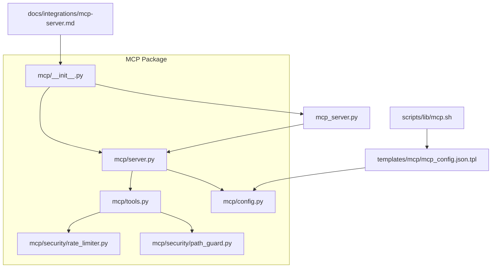
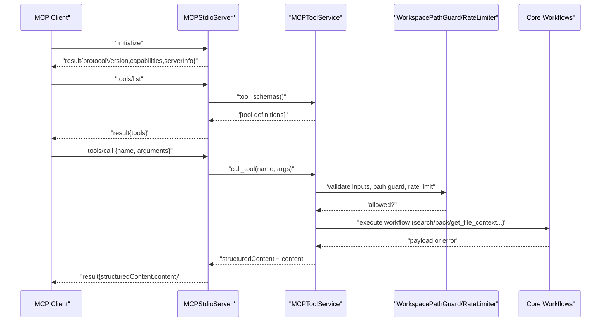
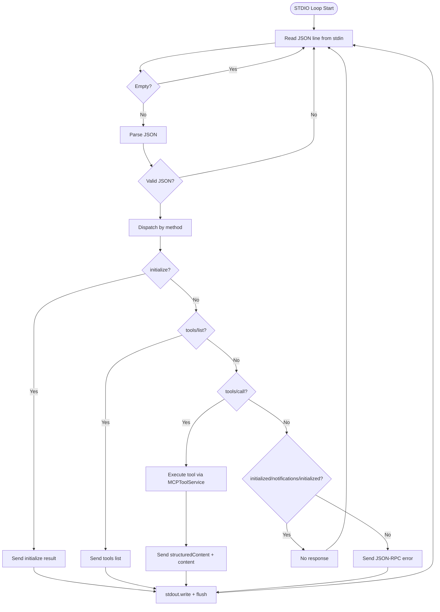
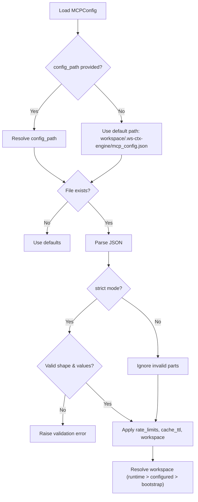
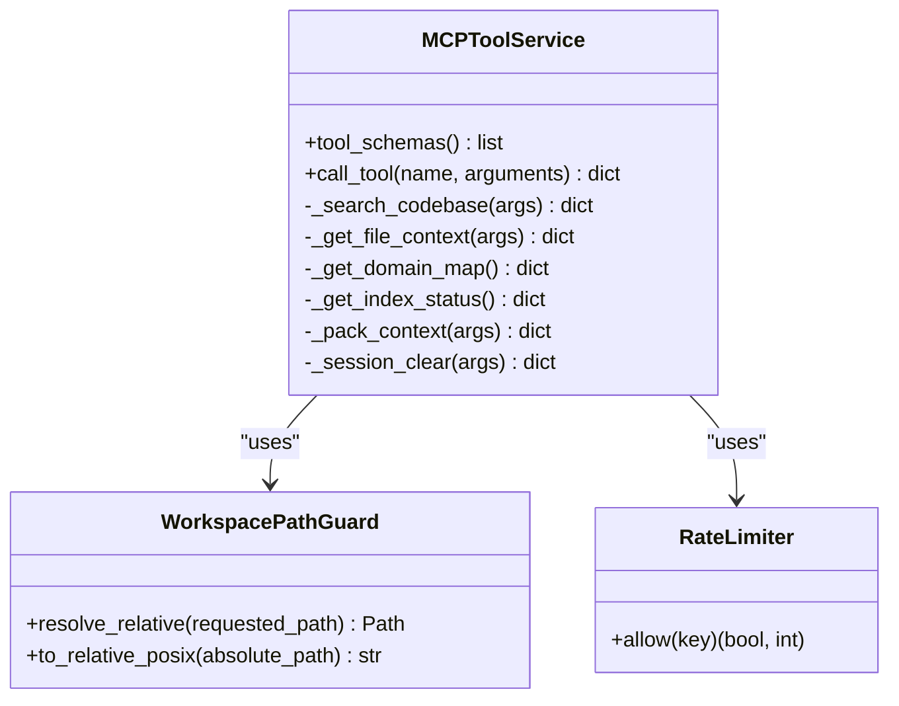
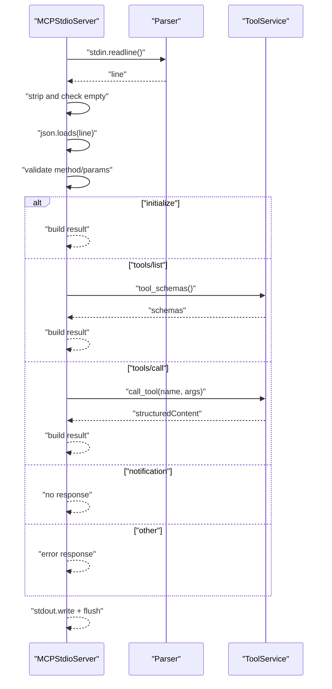
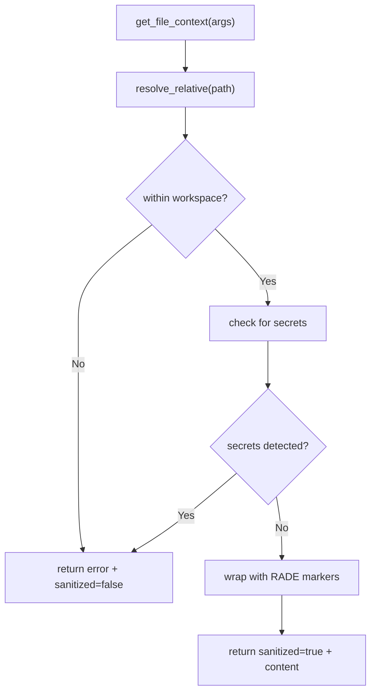
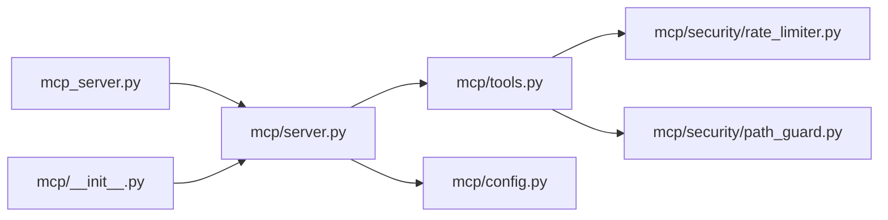

# MCP Protocol Implementation

<cite>
**Referenced Files in This Document**
- [mcp/__init__.py](file://src/ws_ctx_engine/mcp/__init__.py)
- [mcp/server.py](file://src/ws_ctx_engine/mcp/server.py)
- [mcp/tools.py](file://src/ws_ctx_engine/mcp/tools.py)
- [mcp/config.py](file://src/ws_ctx_engine/mcp/config.py)
- [mcp/security/rate_limiter.py](file://src/ws_ctx_engine/mcp/security/rate_limiter.py)
- [mcp/security/path_guard.py](file://src/ws_ctx_engine/mcp/security/path_guard.py)
- [mcp_server.py](file://src/ws_ctx_engine/mcp_server.py)
- [mcp-server.md](file://docs/integrations/mcp-server.md)
- [mcp_config.json.tpl](file://src/ws_ctx_engine/templates/mcp/mcp_config.json.tpl)
- [mcp.sh](file://src/ws_ctx_engine/scripts/lib/mcp.sh)
- [test_mcp_server.py](file://tests/unit/test_mcp_server.py)
- [test_mcp_tools.py](file://tests/unit/test_mcp_tools.py)
- [test_mcp_config.py](file://tests/unit/test_mcp_config.py)
- [test_mcp_rate_limiter.py](file://tests/unit/test_mcp_rate_limiter.py)
- [test_mcp_integration.py](file://tests/integration/test_mcp_integration.py)
</cite>

## Table of Contents
1. [Introduction](#introduction)
2. [Project Structure](#project-structure)
3. [Core Components](#core-components)
4. [Architecture Overview](#architecture-overview)
5. [Detailed Component Analysis](#detailed-component-analysis)
6. [Dependency Analysis](#dependency-analysis)
7. [Performance Considerations](#performance-considerations)
8. [Troubleshooting Guide](#troubleshooting-guide)
9. [Conclusion](#conclusion)
10. [Appendices](#appendices)

## Introduction
This document explains the Model Context Protocol (MCP) implementation in ws-ctx-engine. It covers the protocol specification, server lifecycle, configuration, security, tool definitions, and integration points. The MCP server exposes read-only tools for searching codebases, retrieving file context with secret redaction, inspecting index health, packing context into outputs, and managing session caches. The implementation emphasizes safety, rate limiting, and robust error handling.

## Project Structure
The MCP implementation resides under the ws-ctx-engine package in the mcp/ directory. Key modules include:
- Server entrypoints and STDIO loop
- Tool service and tool registry
- Configuration loader and defaults
- Security guards (path guard, rate limiter)
- Public module wrapper for CLI/module invocation

**Diagram sources**
- [mcp/__init__.py:1-4](file://src/ws_ctx_engine/mcp/__init__.py#L1-L4)
- [mcp/server.py:1-136](file://src/ws_ctx_engine/mcp/server.py#L1-L136)
- [mcp/tools.py:1-672](file://src/ws_ctx_engine/mcp/tools.py#L1-L672)
- [mcp/config.py:1-129](file://src/ws_ctx_engine/mcp/config.py#L1-L129)
- [mcp/security/rate_limiter.py:1-45](file://src/ws_ctx_engine/mcp/security/rate_limiter.py#L1-L45)
- [mcp/security/path_guard.py:1-31](file://src/ws_ctx_engine/mcp/security/path_guard.py#L1-L31)
- [mcp_server.py:1-12](file://src/ws_ctx_engine/mcp_server.py#L1-L12)
- [mcp-server.md:1-94](file://docs/integrations/mcp-server.md#L1-L94)
- [mcp_config.json.tpl:1-11](file://src/ws_ctx_engine/templates/mcp/mcp_config.json.tpl#L1-L11)
- [mcp.sh:1-16](file://src/ws_ctx_engine/scripts/lib/mcp.sh#L1-L16)

**Section sources**
- [mcp/__init__.py:1-4](file://src/ws_ctx_engine/mcp/__init__.py#L1-L4)
- [mcp/server.py:1-136](file://src/ws_ctx_engine/mcp/server.py#L1-L136)
- [mcp/tools.py:1-672](file://src/ws_ctx_engine/mcp/tools.py#L1-L672)
- [mcp/config.py:1-129](file://src/ws_ctx_engine/mcp/config.py#L1-L129)
- [mcp/security/rate_limiter.py:1-45](file://src/ws_ctx_engine/mcp/security/rate_limiter.py#L1-L45)
- [mcp/security/path_guard.py:1-31](file://src/ws_ctx_engine/mcp/security/path_guard.py#L1-L31)
- [mcp_server.py:1-12](file://src/ws_ctx_engine/mcp_server.py#L1-L12)
- [mcp-server.md:1-94](file://docs/integrations/mcp-server.md#L1-L94)
- [mcp_config.json.tpl:1-11](file://src/ws_ctx_engine/templates/mcp/mcp_config.json.tpl#L1-L11)
- [mcp.sh:1-16](file://src/ws_ctx_engine/scripts/lib/mcp.sh#L1-L16)

## Core Components
- MCPStdioServer: STDIO-based JSON-RPC 2.0 server implementing MCP protocol. Handles initialization, tool discovery, and tool execution.
- MCPToolService: Implements the tool registry and executes tools with validation, caching, rate limiting, and security checks.
- MCPConfig: Loads and validates MCP configuration from a JSON file, supports overrides, and resolves workspace.
- RateLimiter: Token-bucket rate limiter per tool name.
- WorkspacePathGuard: Enforces workspace boundary and prevents path traversal.

Key entrypoint:
- run_mcp_server: Public function to start the server with workspace, config path, and rate limit overrides.

**Section sources**
- [mcp/server.py:13-136](file://src/ws_ctx_engine/mcp/server.py#L13-L136)
- [mcp/tools.py:29-672](file://src/ws_ctx_engine/mcp/tools.py#L29-L672)
- [mcp/config.py:22-129](file://src/ws_ctx_engine/mcp/config.py#L22-L129)
- [mcp/security/rate_limiter.py:14-45](file://src/ws_ctx_engine/mcp/security/rate_limiter.py#L14-L45)
- [mcp/security/path_guard.py:6-31](file://src/ws_ctx_engine/mcp/security/path_guard.py#L6-L31)
- [mcp_server.py:6-12](file://src/ws_ctx_engine/mcp_server.py#L6-L12)

## Architecture Overview
The MCP server runs as a long-lived STDIO process. It reads JSON lines from stdin, parses them, dispatches to the tool service, and writes JSON responses to stdout. Configuration is loaded early to determine workspace, rate limits, and cache TTL. Tools operate within a sandboxed workspace with path guards, secret scanning, and RADE content markers.

**Diagram sources**
- [mcp/server.py:39-111](file://src/ws_ctx_engine/mcp/server.py#L39-L111)
- [mcp/tools.py:133-184](file://src/ws_ctx_engine/mcp/tools.py#L133-L184)
- [mcp/security/path_guard.py:10-20](file://src/ws_ctx_engine/mcp/security/path_guard.py#L10-L20)
- [mcp/security/rate_limiter.py:19-44](file://src/ws_ctx_engine/mcp/security/rate_limiter.py#L19-L44)

**Section sources**
- [mcp/server.py:39-111](file://src/ws_ctx_engine/mcp/server.py#L39-L111)
- [mcp/tools.py:133-184](file://src/ws_ctx_engine/mcp/tools.py#L133-L184)

## Detailed Component Analysis

### MCP Protocol Specification and Server Lifecycle
- Protocol: JSON-RPC 2.0 over STDIO. Methods include initialize, tools/list, tools/call, and notification variants.
- Lifecycle:
  - Construction: Load configuration, resolve workspace, construct tool service.
  - Initialization: Respond to initialize with protocol version, capabilities, and server info.
  - Discovery: tools/list returns tool schemas.
  - Execution: tools/call invokes tool handlers with validated arguments.
  - Notifications: initialized and notifications/initialized are ignored and produce no response.
- Error handling: Invalid method/params yield JSON-RPC error codes; tool-specific errors are returned in structuredContent.

**Diagram sources**
- [mcp/server.py:39-111](file://src/ws_ctx_engine/mcp/server.py#L39-L111)

**Section sources**
- [mcp/server.py:39-111](file://src/ws_ctx_engine/mcp/server.py#L39-L111)
- [test_mcp_server.py:11-91](file://tests/unit/test_mcp_server.py#L11-L91)

### Server Configuration Options
- workspace: Runtime workspace root. If omitted and config_path provided, falls back to config’s workspace resolved against the config’s directory.
- config_path: Optional explicit path to MCP configuration JSON. If strict, missing file raises an error.
- rate_limit: Optional dict of tool name to overrides for rate limits.

Configuration loading behavior:
- Defaults: Uses built-in rate limits and cache TTL.
- File: Loads .ws-ctx-engine/mcp_config.json by default or explicit config_path.
- Overrides: Applies runtime rate_limit overrides.
- Workspace resolution: Prefers runtime workspace; otherwise uses configured workspace (relative to bootstrap or absolute); otherwise falls back to bootstrap workspace.

**Diagram sources**
- [mcp/config.py:28-129](file://src/ws_ctx_engine/mcp/config.py#L28-L129)
- [mcp/server.py:14-37](file://src/ws_ctx_engine/mcp/server.py#L14-L37)

**Section sources**
- [mcp/config.py:28-129](file://src/ws_ctx_engine/mcp/config.py#L28-L129)
- [mcp/server.py:14-37](file://src/ws_ctx_engine/mcp/server.py#L14-L37)
- [mcp_config.json.tpl:1-11](file://src/ws_ctx_engine/templates/mcp/mcp_config.json.tpl#L1-L11)
- [mcp.sh:4-15](file://src/ws_ctx_engine/scripts/lib/mcp.sh#L4-L15)
- [test_mcp_config.py:10-151](file://tests/unit/test_mcp_config.py#L10-L151)

### Tool Definitions, Method Signatures, and Response Formats
Available tools:
- search_codebase
  - Input: query (string, required), limit (int, 1..50), domain_filter (string)
  - Output: results (ranked files), index_health
- get_file_context
  - Input: path (string, required), include_dependencies (bool), include_dependents (bool)
  - Output: file metadata, wrapped content (when safe), dependencies/dependents, secrets_detected, sanitized, index_health
  - Security: Path guard, symlink checks, secret scanner, RADE markers
- get_domain_map
  - Input: none
  - Output: domains (top domains), graph_stats, index_health
  - Caching: TTL-controlled cache
- get_index_status / index_status (alias)
  - Input: none
  - Output: index_health, recommendation, workspace
  - Caching: TTL-controlled cache; alias shares rate limit bucket
- pack_context
  - Input: query (string), format (xml|zip|json|yaml|md), token_budget (≥1000), agent_phase (discovery|edit|test)
  - Output: output_path, total_tokens, file_count
- session_clear
  - Input: session_id (optional)
  - Output: cleared, session_id, files_deleted

Response format:
- JSON-RPC 2.0 result with:
  - structuredContent: tool payload (JSON)
  - content: array of text items containing serialized structuredContent

**Diagram sources**
- [mcp/tools.py:29-672](file://src/ws_ctx_engine/mcp/tools.py#L29-L672)
- [mcp/security/path_guard.py:6-31](file://src/ws_ctx_engine/mcp/security/path_guard.py#L6-L31)
- [mcp/security/rate_limiter.py:14-45](file://src/ws_ctx_engine/mcp/security/rate_limiter.py#L14-L45)

**Section sources**
- [mcp/tools.py:43-131](file://src/ws_ctx_engine/mcp/tools.py#L43-L131)
- [mcp/tools.py:167-183](file://src/ws_ctx_engine/mcp/tools.py#L167-L183)
- [mcp-server.md:20-94](file://docs/integrations/mcp-server.md#L20-L94)
- [test_mcp_tools.py:198-211](file://tests/unit/test_mcp_tools.py#L198-L211)

### Connection Handling and Message Processing
- STDIO loop reads lines, ignores blank lines, parses JSON, validates method/params, and dispatches.
- Notifications (initialized, notifications/initialized) are ignored and produce no response.
- tools/call handles missing name and invalid arguments gracefully with JSON-RPC errors.
- Default empty arguments are accepted when not provided.

**Diagram sources**
- [mcp/server.py:39-111](file://src/ws_ctx_engine/mcp/server.py#L39-L111)

**Section sources**
- [mcp/server.py:39-111](file://src/ws_ctx_engine/mcp/server.py#L39-L111)
- [test_mcp_server.py:160-176](file://tests/unit/test_mcp_server.py#L160-L176)
- [test_mcp_server.py:220-233](file://tests/unit/test_mcp_server.py#L220-L233)

### Security Model and Controls
- Path traversal guard: Resolves all paths within the workspace; rejects absolute paths outside the root.
- Secret scanning: Detects sensitive content; omits content and returns sanitized=false when secrets are found.
- RADE content delimiters: Wraps safe content with markers for safe transport.
- Rate limiting: Token-bucket limiter per tool; configurable via MCPConfig.
- Session clearing: Validates session_id against an allowlist regex; clears session cache files safely.

**Diagram sources**
- [mcp/tools.py:224-312](file://src/ws_ctx_engine/mcp/tools.py#L224-L312)
- [mcp/security/path_guard.py:10-20](file://src/ws_ctx_engine/mcp/security/path_guard.py#L10-L20)

**Section sources**
- [mcp/security/path_guard.py:6-31](file://src/ws_ctx_engine/mcp/security/path_guard.py#L6-L31)
- [mcp/tools.py:224-312](file://src/ws_ctx_engine/mcp/tools.py#L224-L312)
- [test_mcp_tools.py:35-53](file://tests/unit/test_mcp_tools.py#L35-L53)
- [test_mcp_tools.py:77-95](file://tests/unit/test_mcp_tools.py#L77-L95)

### Practical Examples
- Starting the server:
  - CLI: ws-ctx-engine mcp --workspace <path>
  - Module: python -m ws_ctx_engine.mcp_server
- Configuration:
  - Default location: .ws-ctx-engine/mcp_config.json
  - Template: see template file; emitted by init script
- Client connection:
  - Send initialize, tools/list, and tools/call messages over STDIO.

**Section sources**
- [mcp-server.md:3-7](file://docs/integrations/mcp-server.md#L3-L7)
- [mcp_server.py:6-12](file://src/ws_ctx_engine/mcp_server.py#L6-L12)
- [mcp_config.json.tpl:1-11](file://src/ws_ctx_engine/templates/mcp/mcp_config.json.tpl#L1-L11)
- [mcp.sh:4-15](file://src/ws_ctx_engine/scripts/lib/mcp.sh#L4-L15)
- [test_mcp_integration.py:129-171](file://tests/integration/test_mcp_integration.py#L129-L171)

### Error Handling, Timeout Management, and Graceful Shutdown
- JSON parsing errors: Lines are skipped; server continues running.
- JSON-RPC errors: Invalid method (-32601), invalid request (-32600), invalid params (-32602).
- Tool errors: Returned in structuredContent with standardized codes (e.g., INVALID_ARGUMENT, INDEX_NOT_FOUND, RATE_LIMIT_EXCEEDED).
- Version fallback: If package metadata is unavailable, server version is reported as unknown.
- Graceful shutdown: No explicit signal handlers; server exits when stdin closes or stdout flush fails.

**Section sources**
- [mcp/server.py:45-48](file://src/ws_ctx_engine/mcp/server.py#L45-L48)
- [mcp/server.py:113-119](file://src/ws_ctx_engine/mcp/server.py#L113-L119)
- [mcp/server.py:178-186](file://src/ws_ctx_engine/mcp/server.py#L178-L186)
- [test_mcp_server.py:70-91](file://tests/unit/test_mcp_server.py#L70-L91)

### Relationship to Core ws-ctx-engine Workflow Components
- search_codebase: Delegates to search_codebase workflow with configured limits and domain filters.
- pack_context: Delegates to query_and_pack workflow; enforces output path within workspace; returns metrics.
- get_domain_map and get_index_status: Load indexes and metadata; compute health and graph stats; cache results.
- session_clear: Manages session cache files via dedicated cache utilities.

**Section sources**
- [mcp/tools.py:209-222](file://src/ws_ctx_engine/mcp/tools.py#L209-L222)
- [mcp/tools.py:608-633](file://src/ws_ctx_engine/mcp/tools.py#L608-L633)
- [mcp/tools.py:314-378](file://src/ws_ctx_engine/mcp/tools.py#L314-L378)
- [mcp/tools.py:380-399](file://src/ws_ctx_engine/mcp/tools.py#L380-L399)
- [mcp/tools.py:637-665](file://src/ws_ctx_engine/mcp/tools.py#L637-L665)

## Dependency Analysis

**Diagram sources**
- [mcp/server.py:9-10](file://src/ws_ctx_engine/mcp/server.py#L9-L10)
- [mcp/tools.py:19-20](file://src/ws_ctx_engine/mcp/tools.py#L19-L20)
- [mcp_server.py:3-11](file://src/ws_ctx_engine/mcp_server.py#L3-L11)
- [mcp/__init__.py:1-3](file://src/ws_ctx_engine/mcp/__init__.py#L1-L3)

**Section sources**
- [mcp/server.py:9-10](file://src/ws_ctx_engine/mcp/server.py#L9-L10)
- [mcp/tools.py:19-20](file://src/ws_ctx_engine/mcp/tools.py#L19-L20)
- [mcp_server.py:3-11](file://src/ws_ctx_engine/mcp_server.py#L3-L11)
- [mcp/__init__.py:1-3](file://src/ws_ctx_engine/mcp/__init__.py#L1-L3)

## Performance Considerations
- Rate limiting: Token bucket per tool prevents bursts; tune rate_limits in MCPConfig to balance throughput and stability.
- Caching: Domain map and index status are cached for cache_ttl_seconds to reduce repeated computation.
- Workspace scanning: File operations and secret scans are bounded by tool arguments; keep limit reasonable for search_codebase.
- Output packing: token_budget affects downstream costs; choose format and budget appropriate for the client.

[No sources needed since this section provides general guidance]

## Troubleshooting Guide
Common issues and resolutions:
- Invalid workspace path: Ensure workspace exists and is a directory; server validates before construction.
- Missing MCP config file: Provide config_path or create .ws-ctx-engine/mcp_config.json; strict mode requires valid file.
- Unknown tool or invalid arguments: Verify tool name and argument shapes; refer to tool reference.
- Rate limit exceeded: Reduce frequency or adjust rate_limits; observe retry_after_seconds in structuredContent.
- File not found or read failures: Confirm path is within workspace and readable; check permissions.
- Secrets detected: Remove sensitive content or use environment variables; re-index after changes.

**Section sources**
- [mcp/server.py:35-36](file://src/ws_ctx_engine/mcp/server.py#L35-L36)
- [mcp/config.py:43-44](file://src/ws_ctx_engine/mcp/config.py#L43-L44)
- [mcp/tools.py:167-183](file://src/ws_ctx_engine/mcp/tools.py#L167-L183)
- [mcp/tools.py:158-165](file://src/ws_ctx_engine/mcp/tools.py#L158-L165)
- [mcp/tools.py:250-269](file://src/ws_ctx_engine/mcp/tools.py#L250-L269)
- [mcp/tools.py:289-299](file://src/ws_ctx_engine/mcp/tools.py#L289-L299)
- [mcp-server.md:73-84](file://docs/integrations/mcp-server.md#L73-L84)

## Conclusion
The ws-ctx-engine MCP implementation provides a secure, configurable, and efficient way to expose codebase search, file context retrieval, index inspection, context packing, and session management to MCP clients. Its design emphasizes safety (path guard, secret scanning, RADE markers), observability (index health, metrics), and operability (rate limiting, caching, flexible configuration).

[No sources needed since this section summarizes without analyzing specific files]

## Appendices

### Appendix A: Configuration Reference
- Default config path: .ws-ctx-engine/mcp_config.json
- Supported fields:
  - workspace (optional)
  - cache_ttl_seconds (positive integer)
  - rate_limits (object with positive integers per tool)

**Section sources**
- [mcp-server.md:85-94](file://docs/integrations/mcp-server.md#L85-L94)
- [mcp_config.json.tpl:1-11](file://src/ws_ctx_engine/templates/mcp/mcp_config.json.tpl#L1-L11)
- [mcp/config.py:28-129](file://src/ws_ctx_engine/mcp/config.py#L28-L129)

### Appendix B: Tool Argument Validation and Error Codes
- INVALID_ARGUMENT: Raised when required arguments are missing or out of range.
- INDEX_NOT_FOUND: Raised when index metadata is missing.
- FILE_NOT_FOUND: Raised when requested file does not exist.
- FILE_READ_FAILED: Raised when file read fails.
- RATE_LIMIT_EXCEEDED: Returned when rate limit is hit; includes retry_after_seconds.
- SEARCH_FAILED: Returned when backend search raises an exception.
- TOOL_NOT_FOUND: Returned for unknown tool names.

**Section sources**
- [mcp/tools.py:186-222](file://src/ws_ctx_engine/mcp/tools.py#L186-L222)
- [mcp/tools.py:224-312](file://src/ws_ctx_engine/mcp/tools.py#L224-L312)
- [mcp/tools.py:569-633](file://src/ws_ctx_engine/mcp/tools.py#L569-L633)
- [mcp/tools.py:637-665](file://src/ws_ctx_engine/mcp/tools.py#L637-L665)
- [mcp-server.md:73-84](file://docs/integrations/mcp-server.md#L73-L84)