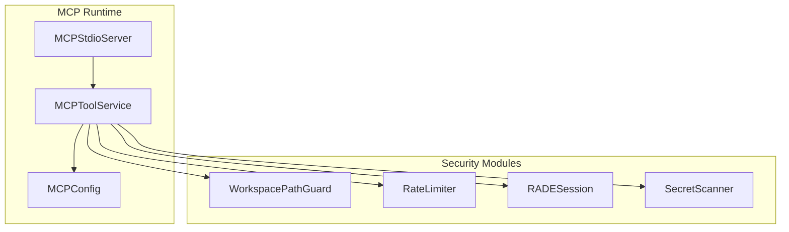
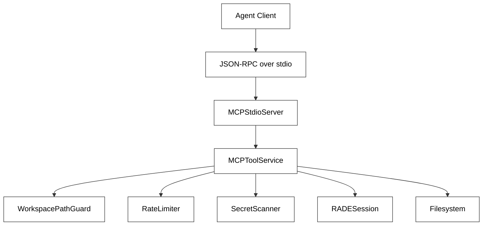
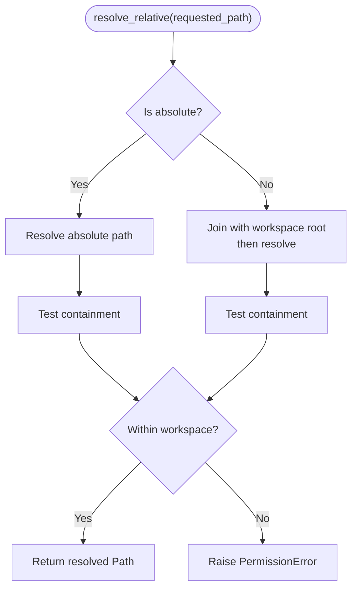
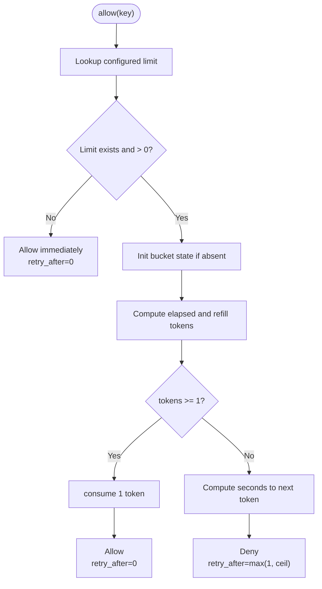
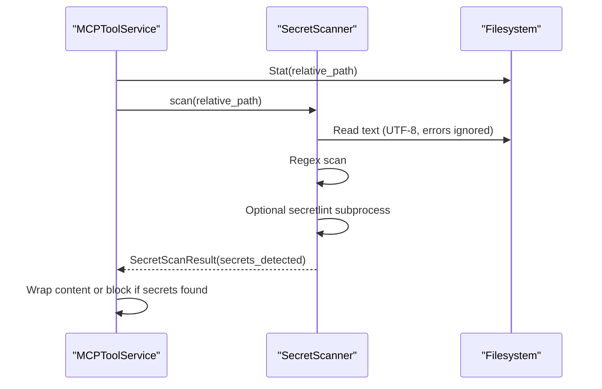
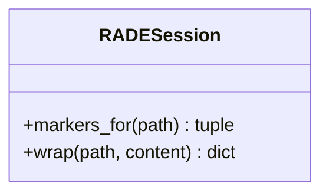
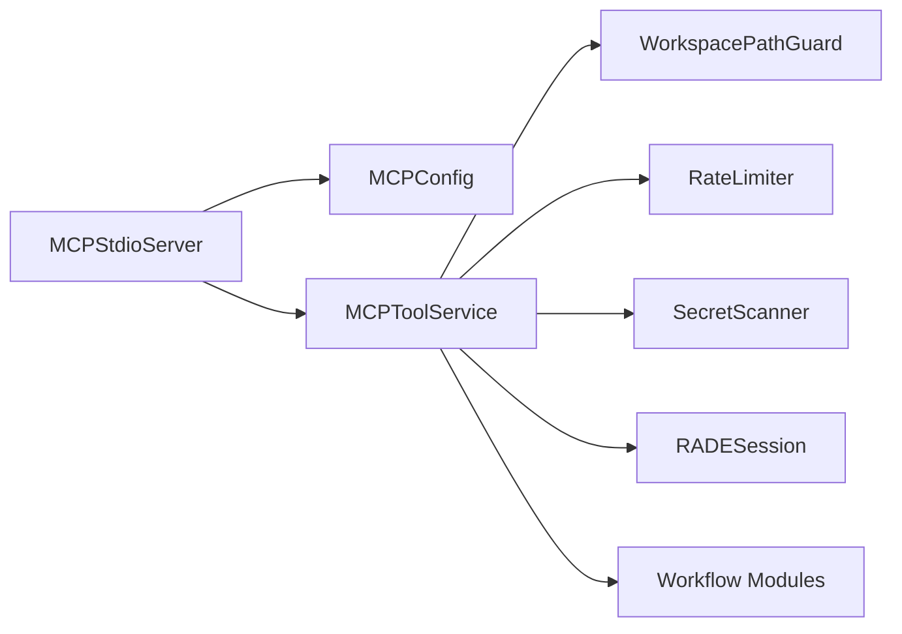

# Security & Access Control

<cite>
**Referenced Files in This Document**
- [path_guard.py](file://src/ws_ctx_engine/mcp/security/path_guard.py)
- [rate_limiter.py](file://src/ws_ctx_engine/mcp/security/rate_limiter.py)
- [rade_delimiter.py](file://src/ws_ctx_engine/mcp/security/rade_delimiter.py)
- [secret_scanner.py](file://src/ws_ctx_engine/secret_scanner.py)
- [server.py](file://src/ws_ctx_engine/mcp/server.py)
- [tools.py](file://src/ws_ctx_engine/mcp/tools.py)
- [config.py](file://src/ws_ctx_engine/mcp/config.py)
- [SECURITY.md](file://SECURITY.md)
- [supporting-modules.md](file://docs/reference/supporting-modules.md)
- [agent-plan-v4.md](file://docs/development/plans/agent-plan-v4.md)
- [test_mcp_security_units.py](file://tests/unit/test_mcp_security_units.py)
- [test_mcp_rate_limiter.py](file://tests/unit/test_mcp_rate_limiter.py)
- [test_mcp_security_properties.py](file://tests/property/test_mcp_security_properties.py)
- [test_mcp_benchmarks.py](file://tests/integration/test_mcp_benchmarks.py)
</cite>

## Table of Contents
1. [Introduction](#introduction)
2. [Project Structure](#project-structure)
3. [Core Components](#core-components)
4. [Architecture Overview](#architecture-overview)
5. [Detailed Component Analysis](#detailed-component-analysis)
6. [Dependency Analysis](#dependency-analysis)
7. [Performance Considerations](#performance-considerations)
8. [Troubleshooting Guide](#troubleshooting-guide)
9. [Conclusion](#conclusion)
10. [Appendices](#appendices)

## Introduction
This document provides comprehensive security documentation for the agent integration components, focusing on path traversal protection, rate limiting, secret scanning, and secure content delivery. It explains how the system enforces read-only operations, isolates workspaces, prevents path traversal, scans for sensitive data, and wraps content to mitigate prompt injection. It also covers configuration, threat mitigations, compliance considerations, and practical deployment guidance.

## Project Structure
The security-critical components are organized under the MCP module and integrated into the tool service and server runtime. The key modules are:
- Path traversal guard: WorkspacePathGuard
- Rate limiting: RateLimiter
- Content wrapping: RADESession
- Secret scanning: SecretScanner
- Server and tool orchestration: MCPToolService and MCPStdioServer
- Configuration: MCPConfig

**Diagram sources**
- [server.py:13-136](file://src/ws_ctx_engine/mcp/server.py#L13-L136)
- [tools.py:29-42](file://src/ws_ctx_engine/mcp/tools.py#L29-L42)
- [config.py:22-129](file://src/ws_ctx_engine/mcp/config.py#L22-L129)
- [path_guard.py:6-31](file://src/ws_ctx_engine/mcp/security/path_guard.py#L6-L31)
- [rate_limiter.py:14-45](file://src/ws_ctx_engine/mcp/security/rate_limiter.py#L14-L45)
- [rade_delimiter.py:6-23](file://src/ws_ctx_engine/mcp/security/rade_delimiter.py#L6-L23)
- [secret_scanner.py:35-205](file://src/ws_ctx_engine/secret_scanner.py#L35-L205)

**Section sources**
- [server.py:13-136](file://src/ws_ctx_engine/mcp/server.py#L13-L136)
- [tools.py:29-42](file://src/ws_ctx_engine/mcp/tools.py#L29-L42)
- [config.py:22-129](file://src/ws_ctx_engine/mcp/config.py#L22-L129)

## Core Components
- WorkspacePathGuard: Enforces path traversal protection by resolving requested paths against a canonical workspace root and rejecting escapes.
- RateLimiter: Implements a token bucket algorithm per tool to enforce configurable throughput limits.
- RADESession: Wraps file content with randomized per-session delimiters to prevent prompt injection.
- SecretScanner: Scans files for secrets using both a regex-based detector and optional secretlint integration, with a persistent cache keyed by mtime/inode.
- MCPToolService: Orchestrates tool execution, applies rate limits, validates paths, scans for secrets, and wraps content.
- MCPStdioServer: JSON-RPC over stdio server that initializes configuration, validates requests, and dispatches to tools.
- MCPConfig: Loads and validates configuration including rate limits, cache TTL, and workspace resolution.

**Section sources**
- [path_guard.py:6-31](file://src/ws_ctx_engine/mcp/security/path_guard.py#L6-L31)
- [rate_limiter.py:14-45](file://src/ws_ctx_engine/mcp/security/rate_limiter.py#L14-L45)
- [rade_delimiter.py:6-23](file://src/ws_ctx_engine/mcp/security/rade_delimiter.py#L6-L23)
- [secret_scanner.py:35-205](file://src/ws_ctx_engine/secret_scanner.py#L35-L205)
- [tools.py:29-42](file://src/ws_ctx_engine/mcp/tools.py#L29-L42)
- [server.py:13-136](file://src/ws_ctx_engine/mcp/server.py#L13-L136)
- [config.py:22-129](file://src/ws_ctx_engine/mcp/config.py#L22-L129)

## Architecture Overview
The MCP server follows a layered defense-in-depth model:
- Layer 1: Read-only enforcement (no write tools)
- Layer 2: Scope isolation (workspace-bound at startup)
- Layer 3: Path traversal protection (symlink resolution + boundary check)
- Layer 4: Secret leakage prevention (cached secret scan on all file reads)
- Layer 5: Prompt injection mitigation (randomized per-session delimiters)

**Diagram sources**
- [agent-plan-v4.md:474-518](file://docs/development/plans/agent-plan-v4.md#L474-L518)
- [server.py:13-136](file://src/ws_ctx_engine/mcp/server.py#L13-L136)
- [tools.py:29-42](file://src/ws_ctx_engine/mcp/tools.py#L29-L42)
- [path_guard.py:6-31](file://src/ws_ctx_engine/mcp/security/path_guard.py#L6-L31)
- [rate_limiter.py:14-45](file://src/ws_ctx_engine/mcp/security/rate_limiter.py#L14-L45)
- [secret_scanner.py:35-205](file://src/ws_ctx_engine/secret_scanner.py#L35-L205)
- [rade_delimiter.py:6-23](file://src/ws_ctx_engine/mcp/security/rade_delimiter.py#L6-L23)

## Detailed Component Analysis

### Path Traversal Protection (WorkspacePathGuard)
WorkspacePathGuard ensures that all requested paths resolve within the configured workspace root:
- Resolves absolute paths directly; relative paths are joined under the workspace root.
- Uses canonical resolution to detect symlink escapes.
- Raises an access error if the resolved path is outside the workspace.

**Diagram sources**
- [path_guard.py:10-20](file://src/ws_ctx_engine/mcp/security/path_guard.py#L10-L20)

**Section sources**
- [path_guard.py:6-31](file://src/ws_ctx_engine/mcp/security/path_guard.py#L6-L31)
- [test_mcp_security_units.py:12-24](file://tests/unit/test_mcp_security_units.py#L12-L24)
- [test_mcp_security_properties.py:67-85](file://tests/property/test_mcp_security_properties.py#L67-L85)

### Rate Limiting (RateLimiter)
RateLimiter implements a token bucket per tool:
- Initializes per-tool limits; unknown or non-positive limits are treated as unlimited.
- Tracks tokens and last refill time using monotonic time.
- Returns allow/deny and retry-after seconds when buckets are exhausted.
- Burst capacity equals the configured limit; refills at tokens-per-second derived from the per-minute limit.

**Diagram sources**
- [rate_limiter.py:19-44](file://src/ws_ctx_engine/mcp/security/rate_limiter.py#L19-L44)

**Section sources**
- [rate_limiter.py:14-45](file://src/ws_ctx_engine/mcp/security/rate_limiter.py#L14-L45)
- [config.py:8-15](file://src/ws_ctx_engine/mcp/config.py#L8-L15)
- [tools.py:157-165](file://src/ws_ctx_engine/mcp/tools.py#L157-L165)
- [test_mcp_rate_limiter.py:1-70](file://tests/unit/test_mcp_rate_limiter.py#L1-L70)

### Secret Scanner Integration
SecretScanner performs content sanitization:
- Validates file stats; caches results keyed by mtime and inode.
- Reads text content safely; scans with secretlint (if available) and regex patterns.
- Aggregates findings and persists cache with timestamps.
- MCP tool integrates scanning during file context retrieval; returns sanitized content or blocks with detected secrets.

**Diagram sources**
- [secret_scanner.py:49-89](file://src/ws_ctx_engine/secret_scanner.py#L49-L89)
- [tools.py:274-287](file://src/ws_ctx_engine/mcp/tools.py#L274-L287)

**Section sources**
- [secret_scanner.py:35-205](file://src/ws_ctx_engine/secret_scanner.py#L35-L205)
- [tools.py:274-312](file://src/ws_ctx_engine/mcp/tools.py#L274-L312)
- [test_mcp_benchmarks.py:107-191](file://tests/integration/test_mcp_benchmarks.py#L107-L191)

### Secure Content Delivery (RADE Delimiter)
RADESession wraps file content with randomized per-session delimiters:
- Generates a fresh session token at startup.
- Produces unique start/end markers for each file path.
- Ensures wrapped content ends with the session-specific end marker, preventing prompt injection.

**Diagram sources**
- [rade_delimiter.py:6-23](file://src/ws_ctx_engine/mcp/security/rade_delimiter.py#L6-L23)
- [tools.py:301-312](file://src/ws_ctx_engine/mcp/tools.py#L301-L312)

**Section sources**
- [rade_delimiter.py:6-23](file://src/ws_ctx_engine/mcp/security/rade_delimiter.py#L6-L23)
- [tools.py:301-312](file://src/ws_ctx_engine/mcp/tools.py#L301-L312)
- [test_mcp_security_units.py:36-47](file://tests/unit/test_mcp_security_units.py#L36-L47)
- [test_mcp_security_properties.py:55-65](file://tests/property/test_mcp_security_properties.py#L55-L65)

### Authentication, Authorization, and Communication
- Authentication: The MCP server does not implement identity verification; clients are trusted within the workspace boundary.
- Authorization: Read-only toolset; no write-capable tools are exposed.
- Communication: JSON-RPC over stdio; no network transport is involved.

**Section sources**
- [agent-plan-v4.md:486-491](file://docs/development/plans/agent-plan-v4.md#L486-L491)
- [server.py:13-136](file://src/ws_ctx_engine/mcp/server.py#L13-L136)

### Security Configuration and Defaults
- Default rate limits are defined centrally and can be overridden via configuration and runtime overrides.
- Cache TTL controls short-lived caching of index metadata responses.
- Workspace resolution supports absolute or relative paths resolved against the bootstrap workspace.

**Section sources**
- [config.py:8-15](file://src/ws_ctx_engine/mcp/config.py#L8-L15)
- [config.py:22-129](file://src/ws_ctx_engine/mcp/config.py#L22-L129)
- [tools.py:667-672](file://src/ws_ctx_engine/mcp/tools.py#L667-L672)

## Dependency Analysis
The tool service composes security components and delegates to workflow modules for indexing and retrieval. The server orchestrates configuration loading and request routing.

**Diagram sources**
- [server.py:13-136](file://src/ws_ctx_engine/mcp/server.py#L13-L136)
- [tools.py:29-42](file://src/ws_ctx_engine/mcp/tools.py#L29-L42)
- [config.py:22-129](file://src/ws_ctx_engine/mcp/config.py#L22-L129)

**Section sources**
- [server.py:13-136](file://src/ws_ctx_engine/mcp/server.py#L13-L136)
- [tools.py:29-42](file://src/ws_ctx_engine/mcp/tools.py#L29-L42)

## Performance Considerations
- Secret scanning overhead is mitigated by an mtime/inode cache; repeated reads of unchanged files incur minimal cost.
- Rate limiting uses a lightweight token bucket with monotonic time; negligible CPU overhead.
- Path traversal checks are O(1) relative to filesystem operations.

**Section sources**
- [test_mcp_benchmarks.py:107-191](file://tests/integration/test_mcp_benchmarks.py#L107-L191)
- [rate_limiter.py:14-45](file://src/ws_ctx_engine/mcp/security/rate_limiter.py#L14-L45)
- [path_guard.py:25-31](file://src/ws_ctx_engine/mcp/security/path_guard.py#L25-L31)

## Troubleshooting Guide
Common issues and resolutions:
- Path traversal attempts: PermissionError with access denial; verify workspace configuration and avoid relative path escapes.
- Rate limit exceeded: Tool returns a structured error with retry_after_seconds; reduce client concurrency or adjust limits.
- Secret-detected files: File content is excluded; remediate by removing secrets or using environment variables; re-index after fixes.
- Workspace invalid: Server rejects invalid paths at startup; ensure the workspace exists and is a directory.
- Configuration validation: Strict mode raises explicit errors for malformed JSON or invalid values; use non-strict mode to ignore invalid entries.

**Section sources**
- [tools.py:251-259](file://src/ws_ctx_engine/mcp/tools.py#L251-L259)
- [tools.py:159-165](file://src/ws_ctx_engine/mcp/tools.py#L159-L165)
- [tools.py:275-287](file://src/ws_ctx_engine/mcp/tools.py#L275-L287)
- [server.py:35-37](file://src/ws_ctx_engine/mcp/server.py#L35-L37)
- [config.py:46-67](file://src/ws_ctx_engine/mcp/config.py#L46-L67)
- [config.py:74-85](file://src/ws_ctx_engine/mcp/config.py#L74-L85)
- [config.py:94-98](file://src/ws_ctx_engine/mcp/config.py#L94-L98)

## Conclusion
The agent integration components implement a robust, layered security posture:
- Read-only operation prevents accidental or malicious modifications.
- Workspace scoping and path traversal guards protect filesystem boundaries.
- Cached secret scanning and RADE delimiters mitigate data leakage and prompt injection.
- Configurable rate limiting protects system resources and responsiveness.
These controls, combined with operational best practices, provide a strong foundation for secure agent deployments.

## Appendices

### Practical Secure Deployment Examples
- Deploy the MCP server with a bounded workspace and tuned rate limits.
- Ensure secret scanning is enabled (always on for MCP server).
- Use environment variables for secrets; exclude sensitive files from indexing.
- Monitor logs and apply least-privilege access to the workspace directory.

**Section sources**
- [SECURITY.md:40-80](file://SECURITY.md#L40-L80)
- [agent-plan-v4.md:594-601](file://docs/development/plans/agent-plan-v4.md#L594-L601)

### Compliance and Risk Mitigation
- Data privacy: Indexed artifacts are stored locally; avoid sending sensitive code to external APIs.
- Least privilege: Run the MCP server with minimal permissions; restrict workspace access.
- Auditability: Maintain logs and cache directories with appropriate permissions.

**Section sources**
- [SECURITY.md:89-94](file://SECURITY.md#L89-L94)
- [SECURITY.md:75-80](file://SECURITY.md#L75-L80)

### Incident Response Procedures
- Upon detecting unauthorized access attempts (path traversal), revoke session tokens and audit logs.
- If secrets are discovered in outputs, instruct users to remove secrets and rebuild indexes.
- For rate-limit abuse, temporarily lower limits or block offending clients.

**Section sources**
- [tools.py:275-287](file://src/ws_ctx_engine/mcp/tools.py#L275-L287)
- [SECURITY.md:12-39](file://SECURITY.md#L12-L39)