# Architecture & Design

<cite>
**Referenced Files in This Document**
- [__init__.py](file://src/ws_ctx_engine/__init__.py)
- [backend_selector.py](file://src/ws_ctx_engine/backend_selector/backend_selector.py)
- [indexer.py](file://src/ws_ctx_engine/workflow/indexer.py)
- [query.py](file://src/ws_ctx_engine/workflow/query.py)
- [retrieval.py](file://src/ws_ctx_engine/retrieval/retrieval.py)
- [cli.py](file://src/ws_ctx_engine/cli/cli.py)
- [base.py](file://src/ws_ctx_engine/chunker/base.py)
- [vector_index.py](file://src/ws_ctx_engine/vector_index/vector_index.py)
- [graph.py](file://src/ws_ctx_engine/graph/graph.py)
- [xml_packer.py](file://src/ws_ctx_engine/packer/xml_packer.py)
- [config.py](file://src/ws_ctx_engine/config/config.py)
- [models.py](file://src/ws_ctx_engine/models/models.py)
- [budget.py](file://src/ws_ctx_engine/budget/budget.py)
- [ranker.py](file://src/ws_ctx_engine/ranking/ranker.py)
- [logger.py](file://src/ws_ctx_engine/logger/logger.py)
</cite>

## Table of Contents
1. [Introduction](#introduction)
2. [Project Structure](#project-structure)
3. [Core Components](#core-components)
4. [Architecture Overview](#architecture-overview)
5. [Detailed Component Analysis](#detailed-component-analysis)
6. [Dependency Analysis](#dependency-analysis)
7. [Performance Considerations](#performance-considerations)
8. [Troubleshooting Guide](#troubleshooting-guide)
9. [Conclusion](#conclusion)
10. [Appendices](#appendices)

## Introduction
This document describes the ws-ctx-engine system architecture and design. The system transforms codebases into optimized, LLM-ready context packages through a multi-stage pipeline: indexing, retrieval, and packaging. It emphasizes robustness via automatic backend fallbacks, modularity across CLI, workflow engine, retrieval system, vector index, graph engine, chunker system, and packer modules, and clear separation of concerns. The design leverages strategy-like backend selection, factory-style component creation, and observer-style logging to maintain flexibility and observability.

## Project Structure
The codebase is organized into cohesive subsystems:
- CLI: Command-line entry points and orchestration
- Workflow: Indexing and query phases
- Retrieval: Hybrid ranking combining semantic and structural signals
- Vector Index: Embedding-based semantic search with multiple backends
- Graph: Dependency graph and PageRank computation with fallbacks
- Chunker: AST and regex-based parsing with fallbacks
- Packer: Output packaging in XML, ZIP, or structured text formats
- Config: Centralized configuration with validation
- Models: Data structures for chunks and index metadata
- Budget: Token-aware file selection
- Ranking: AI rule boosting and phase-aware weighting
- Logger: Structured logging with dual console/file output

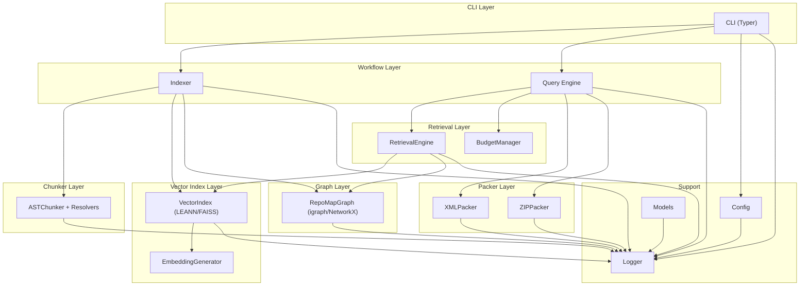

**Diagram sources**
- [cli.py:27-800](file://src/ws_ctx_engine/cli/cli.py#L27-L800)
- [indexer.py:72-493](file://src/ws_ctx_engine/workflow/indexer.py#L72-L493)
- [query.py:158-617](file://src/ws_ctx_engine/workflow/query.py#L158-L617)
- [retrieval.py:140-627](file://src/ws_ctx_engine/retrieval/retrieval.py#L140-L627)
- [vector_index.py:21-800](file://src/ws_ctx_engine/vector_index/vector_index.py#L21-L800)
- [graph.py:19-667](file://src/ws_ctx_engine/graph/graph.py#L19-L667)
- [base.py:41-176](file://src/ws_ctx_engine/chunker/base.py#L41-L176)
- [xml_packer.py:51-239](file://src/ws_ctx_engine/packer/xml_packer.py#L51-L239)
- [config.py:16-399](file://src/ws_ctx_engine/config/config.py#L16-L399)
- [models.py:10-152](file://src/ws_ctx_engine/models/models.py#L10-L152)
- [budget.py:8-105](file://src/ws_ctx_engine/budget/budget.py#L8-L105)
- [ranker.py:28-86](file://src/ws_ctx_engine/ranking/ranker.py#L28-L86)
- [logger.py:13-145](file://src/ws_ctx_engine/logger/logger.py#L13-L145)

**Section sources**
- [__init__.py:1-33](file://src/ws_ctx_engine/__init__.py#L1-L33)
- [cli.py:27-800](file://src/ws_ctx_engine/cli/cli.py#L27-L800)
- [indexer.py:72-493](file://src/ws_ctx_engine/workflow/indexer.py#L72-L493)
- [query.py:158-617](file://src/ws_ctx_engine/workflow/query.py#L158-L617)

## Core Components
- CLI: Provides commands for indexing, searching, querying, and running as an MCP server. Handles configuration loading, runtime dependency preflight, and structured output (NDJSON for agent mode).
- Workflow Indexer: Orchestrates parsing, vector index building, graph building, metadata hashing, and domain keyword map persistence with incremental mode and embedding cache support.
- Workflow Query: Loads indexes, retrieves candidates with hybrid ranking, enforces token budget, and packs outputs in configured formats.
- RetrievalEngine: Combines semantic similarity and PageRank with adaptive boosting for symbols, paths, domains, and test penalties; supports AI rule boosting and phase-aware weighting.
- VectorIndex: Abstract base with LEANNIndex (storage-efficient) and FAISSIndex (exact search) implementations; includes EmbeddingGenerator with local and API fallbacks.
- Graph: Abstract base with IGraphRepoMap (fast C++ backend) and NetworkXRepoMap (portable) implementations; supports PageRank with changed-file boosting and persistence.
- Chunker: ASTChunker base with resolver-based language-specific chunkers and fallbacks; includes .gitignore-aware inclusion/exclusion logic.
- Packer: XMLPacker for Repomix-style XML and ZIPPacker for ZIP archives; supports content preprocessing, compression, and secret scanning.
- Config: Strongly typed configuration with validation for output format, weights, backends, embeddings, performance, and AI rules.
- Models: CodeChunk and IndexMetadata dataclasses for chunk representation and index metadata.
- Budget: Greedy knapsack selection respecting token budgets and content metadata split.
- Ranking: AI rule boosting and phase-aware re-weighting utilities.
- Logger: Structured logging with console and file handlers, phase metrics, and fallback notifications.

**Section sources**
- [cli.py:27-800](file://src/ws_ctx_engine/cli/cli.py#L27-L800)
- [indexer.py:72-493](file://src/ws_ctx_engine/workflow/indexer.py#L72-L493)
- [query.py:158-617](file://src/ws_ctx_engine/workflow/query.py#L158-L617)
- [retrieval.py:140-627](file://src/ws_ctx_engine/retrieval/retrieval.py#L140-L627)
- [vector_index.py:21-800](file://src/ws_ctx_engine/vector_index/vector_index.py#L21-L800)
- [graph.py:19-667](file://src/ws_ctx_engine/graph/graph.py#L19-L667)
- [base.py:41-176](file://src/ws_ctx_engine/chunker/base.py#L41-L176)
- [xml_packer.py:51-239](file://src/ws_ctx_engine/packer/xml_packer.py#L51-L239)
- [config.py:16-399](file://src/ws_ctx_engine/config/config.py#L16-L399)
- [models.py:10-152](file://src/ws_ctx_engine/models/models.py#L10-L152)
- [budget.py:8-105](file://src/ws_ctx_engine/budget/budget.py#L8-L105)
- [ranker.py:28-86](file://src/ws_ctx_engine/ranking/ranker.py#L28-L86)
- [logger.py:13-145](file://src/ws_ctx_engine/logger/logger.py#L13-L145)

## Architecture Overview
The system follows a layered, modular design:
- CLI orchestrates high-level commands and delegates to workflow modules.
- Workflow modules coordinate subsystems: chunker, vector index, graph, retrieval, budget, and packer.
- Backend selection strategy ensures graceful degradation across vector index, graph, and embeddings.
- Factory-style creation functions instantiate backends and components.
- Observer-style logging records phases, errors, and fallbacks.

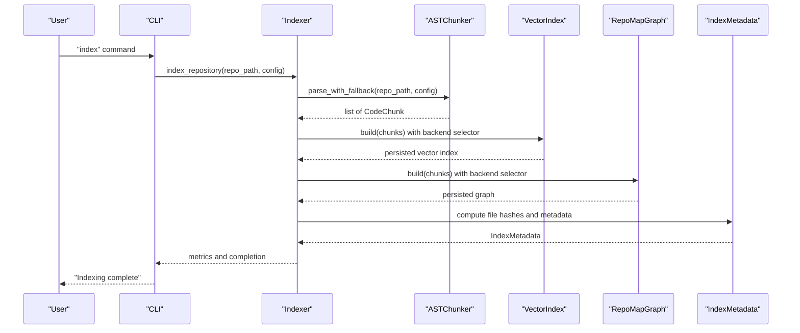

**Diagram sources**
- [cli.py:406-501](file://src/ws_ctx_engine/cli/cli.py#L406-L501)
- [indexer.py:72-371](file://src/ws_ctx_engine/workflow/indexer.py#L72-L371)
- [base.py:41-176](file://src/ws_ctx_engine/chunker/base.py#L41-L176)
- [vector_index.py:280-501](file://src/ws_ctx_engine/vector_index/vector_index.py#L280-L501)
- [graph.py:572-621](file://src/ws_ctx_engine/graph/graph.py#L572-L621)
- [models.py:87-152](file://src/ws_ctx_engine/models/models.py#L87-L152)

**Section sources**
- [backend_selector.py:13-191](file://src/ws_ctx_engine/backend_selector/backend_selector.py#L13-L191)
- [indexer.py:72-371](file://src/ws_ctx_engine/workflow/indexer.py#L72-L371)

## Detailed Component Analysis

### Backend Selection Strategy (Strategy Pattern)
The backend selector centralizes fallback logic across vector index, graph, and embeddings. It determines a fallback level and logs the current configuration, enabling graceful degradation when preferred backends are unavailable.

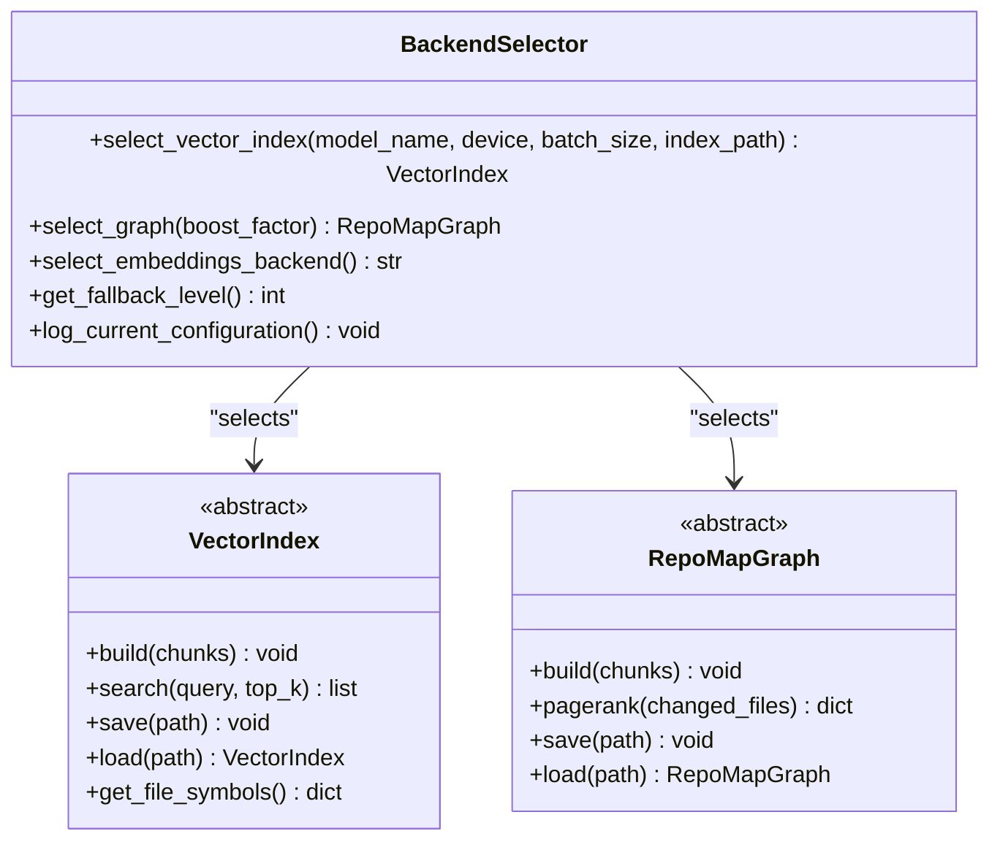

**Diagram sources**
- [backend_selector.py:13-191](file://src/ws_ctx_engine/backend_selector/backend_selector.py#L13-L191)
- [vector_index.py:21-92](file://src/ws_ctx_engine/vector_index/vector_index.py#L21-L92)
- [graph.py:19-95](file://src/ws_ctx_engine/graph/graph.py#L19-L95)

**Section sources**
- [backend_selector.py:13-191](file://src/ws_ctx_engine/backend_selector/backend_selector.py#L13-L191)

### Factory Pattern for Component Creation
Creation functions encapsulate backend instantiation and fallback resolution:
- create_graph: Chooses igraph or NetworkX with fallback logging.
- create_vector_index: Delegated by BackendSelector to instantiate LEANN or FAISS backends.
- load_graph/load_vector_index: Load persisted artifacts with backend detection.

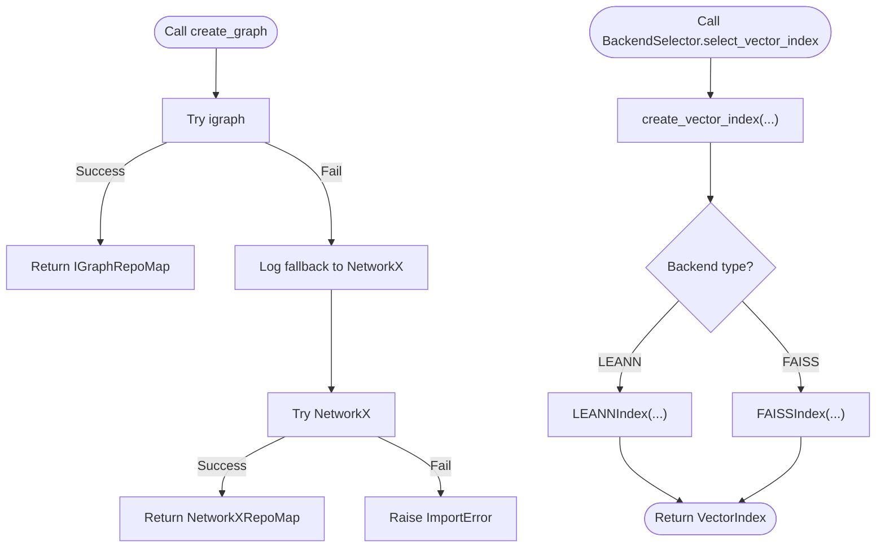

**Diagram sources**
- [graph.py:572-621](file://src/ws_ctx_engine/graph/graph.py#L572-L621)
- [backend_selector.py:36-81](file://src/ws_ctx_engine/backend_selector/backend_selector.py#L36-L81)
- [vector_index.py:503-800](file://src/ws_ctx_engine/vector_index/vector_index.py#L503-L800)

**Section sources**
- [graph.py:572-621](file://src/ws_ctx_engine/graph/graph.py#L572-L621)
- [backend_selector.py:36-81](file://src/ws_ctx_engine/backend_selector/backend_selector.py#L36-L81)
- [vector_index.py:503-800](file://src/ws_ctx_engine/vector_index/vector_index.py#L503-L800)

### Observer Pattern for Logging
The logger provides structured logging with dual handlers and specialized helpers:
- log_fallback: Records backend fallback events.
- log_phase: Logs phase durations and metrics.
- log_error: Emits contextual error traces.

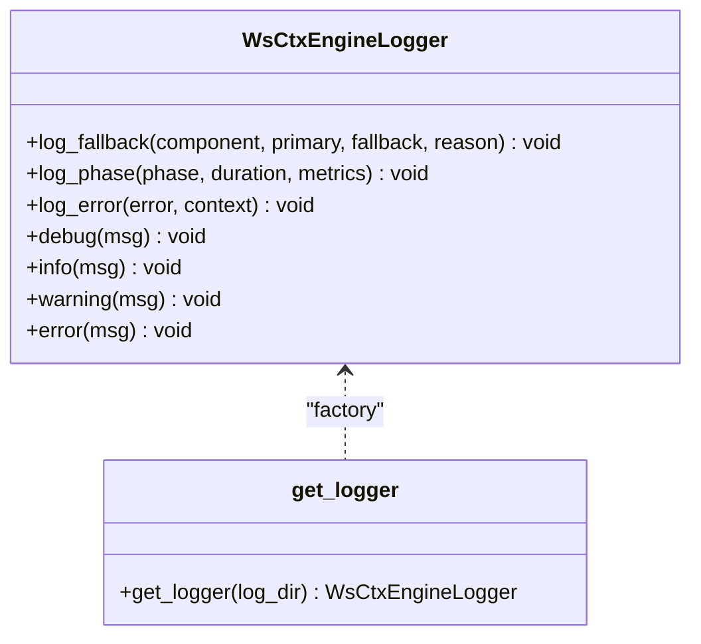

**Diagram sources**
- [logger.py:13-145](file://src/ws_ctx_engine/logger/logger.py#L13-L145)

**Section sources**
- [logger.py:13-145](file://src/ws_ctx_engine/logger/logger.py#L13-L145)

### Indexing Pipeline (Multi-Stage Workflow)
The indexer coordinates parsing, vector index building, graph construction, metadata hashing, and domain map persistence. It supports incremental mode and embedding cache reuse.

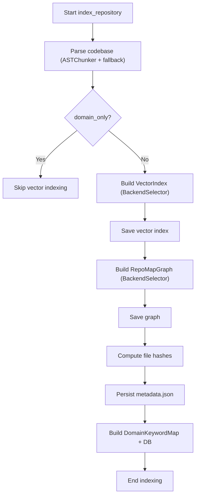

**Diagram sources**
- [indexer.py:72-371](file://src/ws_ctx_engine/workflow/indexer.py#L72-L371)
- [base.py:41-176](file://src/ws_ctx_engine/chunker/base.py#L41-L176)
- [vector_index.py:280-501](file://src/ws_ctx_engine/vector_index/vector_index.py#L280-L501)
- [graph.py:572-621](file://src/ws_ctx_engine/graph/graph.py#L572-L621)
- [models.py:87-152](file://src/ws_ctx_engine/models/models.py#L87-L152)

**Section sources**
- [indexer.py:72-371](file://src/ws_ctx_engine/workflow/indexer.py#L72-L371)

### Retrieval Pipeline (Hybrid Ranking)
The retrieval engine merges semantic and structural signals with adaptive boosting and normalization.

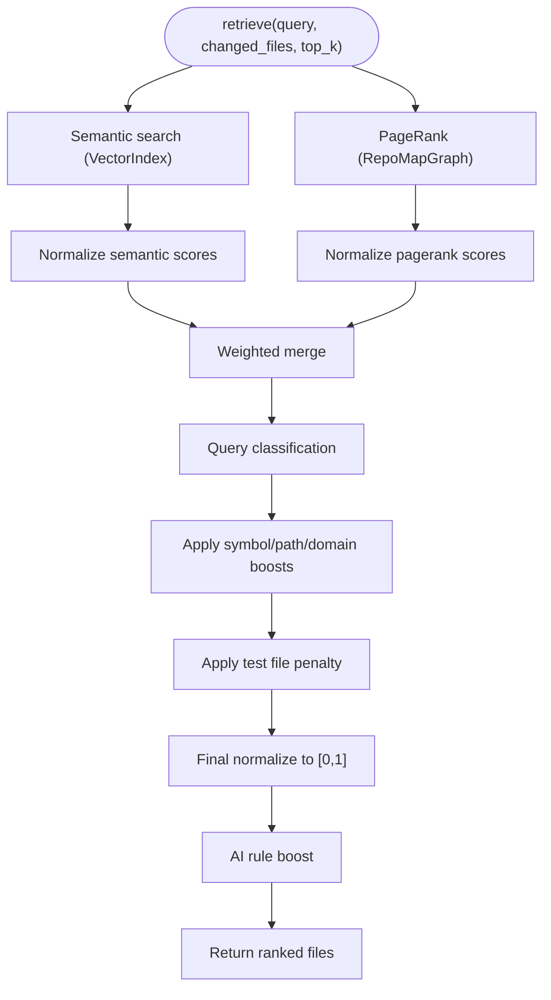

**Diagram sources**
- [retrieval.py:250-368](file://src/ws_ctx_engine/retrieval/retrieval.py#L250-L368)
- [vector_index.py:361-398](file://src/ws_ctx_engine/vector_index/vector_index.py#L361-L398)
- [graph.py:188-231](file://src/ws_ctx_engine/graph/graph.py#L188-L231)
- [ranker.py:64-86](file://src/ws_ctx_engine/ranking/ranker.py#L64-L86)

**Section sources**
- [retrieval.py:250-368](file://src/ws_ctx_engine/retrieval/retrieval.py#L250-L368)

### Query and Packaging Pipeline
The query engine loads indexes, retrieves candidates, selects within budget, and packs outputs.

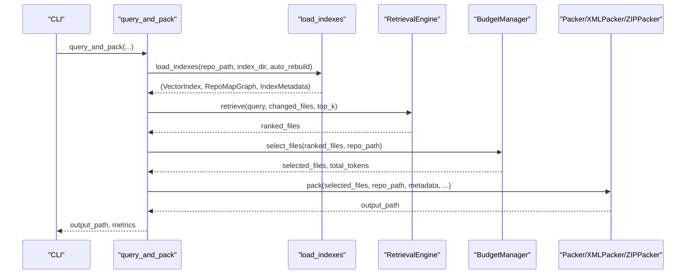

**Diagram sources**
- [query.py:230-617](file://src/ws_ctx_engine/workflow/query.py#L230-L617)
- [indexer.py:404-493](file://src/ws_ctx_engine/workflow/indexer.py#L404-L493)
- [retrieval.py:250-368](file://src/ws_ctx_engine/retrieval/retrieval.py#L250-L368)
- [budget.py:50-105](file://src/ws_ctx_engine/budget/budget.py#L50-L105)
- [xml_packer.py:85-138](file://src/ws_ctx_engine/packer/xml_packer.py#L85-L138)

**Section sources**
- [query.py:230-617](file://src/ws_ctx_engine/workflow/query.py#L230-L617)

### Data Models and Persistence
- CodeChunk: Encapsulates parsed segments with metadata and token counting.
- IndexMetadata: Stores index creation time, backend, and file hashes for staleness detection.

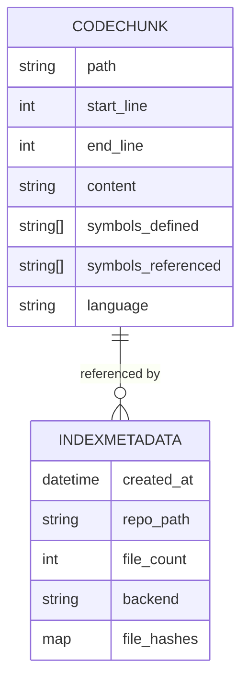

**Diagram sources**
- [models.py:10-152](file://src/ws_ctx_engine/models/models.py#L10-L152)

**Section sources**
- [models.py:10-152](file://src/ws_ctx_engine/models/models.py#L10-L152)

### Technology Stack and Extensibility
- CLI: Typer for commands; Rich for formatted output; NDJSON emission for agent mode.
- Parsing: Tree-sitter-based AST chunkers with regex fallbacks; .gitignore-aware inclusion.
- Embeddings: sentence-transformers (local) with OpenAI API fallback; memory-aware generation.
- Vector Index: LEANNIndex (storage-efficient) and FAISSIndex (exact search) with incremental updates.
- Graph: igraph (fast C++ backend) and NetworkX (pure Python) with PageRank and changed-file boosting.
- Output: XML (Repomix-style), ZIP, JSON/YAML/Markdown/TOON via formatters; optional compression and deduplication.
- Configuration: YAML-based with validation and defaults; supports experimental fields for forward compatibility.
- Observability: Structured logging with console and file handlers; phase metrics and fallback notices.

Extensibility points:
- Add new chunker resolvers by extending the resolver registry.
- Implement new VectorIndex backends by subclassing VectorIndex.
- Add new RepoMapGraph backends by subclassing RepoMapGraph.
- Extend packers by implementing a packer interface and registering in query workflow.
- Customize ranking by adding phase-aware weights or AI rule files.

**Section sources**
- [cli.py:27-800](file://src/ws_ctx_engine/cli/cli.py#L27-L800)
- [base.py:41-176](file://src/ws_ctx_engine/chunker/base.py#L41-L176)
- [vector_index.py:21-800](file://src/ws_ctx_engine/vector_index/vector_index.py#L21-L800)
- [graph.py:19-667](file://src/ws_ctx_engine/graph/graph.py#L19-L667)
- [xml_packer.py:51-239](file://src/ws_ctx_engine/packer/xml_packer.py#L51-L239)
- [config.py:16-399](file://src/ws_ctx_engine/config/config.py#L16-L399)
- [logger.py:13-145](file://src/ws_ctx_engine/logger/logger.py#L13-L145)

## Dependency Analysis
Key dependencies and coupling:
- CLI depends on workflow modules and configuration; delegates to BackendSelector for runtime backend resolution.
- Indexer depends on Chunker, VectorIndex, Graph, and Models; uses Logger for metrics and errors.
- Query depends on RetrievalEngine, BudgetManager, Packer, and DomainMap; uses Logger for metrics and errors.
- VectorIndex depends on EmbeddingGenerator and optional FAISS; supports persistence and incremental updates.
- Graph depends on igraph or NetworkX; supports persistence and PageRank computation.
- RetrievalEngine composes VectorIndex and Graph; integrates DomainKeywordMap and Ranking utilities.
- Config validates and normalizes settings; used across CLI and workflows.

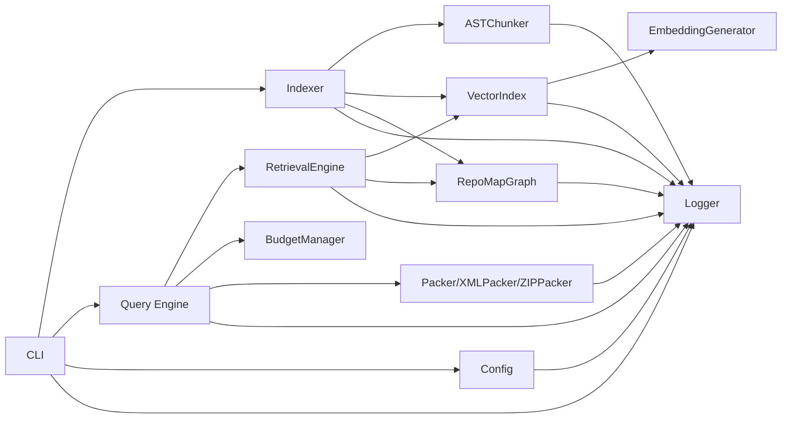

**Diagram sources**
- [cli.py:27-800](file://src/ws_ctx_engine/cli/cli.py#L27-L800)
- [indexer.py:72-493](file://src/ws_ctx_engine/workflow/indexer.py#L72-L493)
- [query.py:158-617](file://src/ws_ctx_engine/workflow/query.py#L158-L617)
- [retrieval.py:140-627](file://src/ws_ctx_engine/retrieval/retrieval.py#L140-L627)
- [vector_index.py:21-800](file://src/ws_ctx_engine/vector_index/vector_index.py#L21-L800)
- [graph.py:19-667](file://src/ws_ctx_engine/graph/graph.py#L19-L667)
- [xml_packer.py:51-239](file://src/ws_ctx_engine/packer/xml_packer.py#L51-L239)
- [config.py:16-399](file://src/ws_ctx_engine/config/config.py#L16-L399)
- [logger.py:13-145](file://src/ws_ctx_engine/logger/logger.py#L13-L145)

**Section sources**
- [cli.py:27-800](file://src/ws_ctx_engine/cli/cli.py#L27-L800)
- [indexer.py:72-493](file://src/ws_ctx_engine/workflow/indexer.py#L72-L493)
- [query.py:158-617](file://src/ws_ctx_engine/workflow/query.py#L158-L617)

## Performance Considerations
- Incremental indexing: Detects changed/deleted files and updates only affected parts; uses embedding cache to avoid re-embedding unchanged files.
- Storage efficiency: LEANNIndex reduces index size by storing only a subset of vectors and recomputing on-the-fly.
- Memory-aware embeddings: EmbeddingGenerator switches to API fallback when low memory is detected.
- Token budgeting: BudgetManager reserves ~20% of the budget for metadata and uses a greedy knapsack to maximize relevance within content budget.
- Parallelism: Config includes a reserved field for future worker concurrency; current implementation focuses on I/O-bound tasks.
- Output optimization: XMLPacker supports shuffling to combat “Lost in the Middle” and optional compression/deduplication.

[No sources needed since this section provides general guidance]

## Troubleshooting Guide
Common issues and resolutions:
- Missing optional dependencies: Use the doctor command to diagnose missing packages and recommended installs.
- Backend unavailability: BackendSelector logs fallbacks; adjust configuration backends to “auto” or specify compatible backends.
- Index staleness: load_indexes detects changes and can rebuild automatically; disable auto-rebuild if needed.
- Runtime dependency preflight: CLI validates embeddings and graph/vector backends; resolves “auto” backends based on availability.
- Logging: Enable verbose mode for detailed timing; consult structured logs for phase metrics and error traces.

**Section sources**
- [cli.py:330-364](file://src/ws_ctx_engine/cli/cli.py#L330-L364)
- [cli.py:466-500](file://src/ws_ctx_engine/cli/cli.py#L466-L500)
- [indexer.py:404-493](file://src/ws_ctx_engine/workflow/indexer.py#L404-L493)
- [logger.py:64-109](file://src/ws_ctx_engine/logger/logger.py#L64-L109)

## Conclusion
ws-ctx-engine delivers a robust, modular architecture for transforming codebases into LLM-ready context. Its strategy-based backend selection, factory-style component creation, and observer-style logging enable graceful fallbacks, maintainability, and observability. The multi-stage pipeline from indexing through retrieval to packaging is designed for scalability, performance, and extensibility, allowing custom implementations and integrations across chunkers, vector indexes, graph engines, and packers.

[No sources needed since this section summarizes without analyzing specific files]

## Appendices

### System Context Diagram
High-level component relationships and data pathways across CLI, workflow, retrieval, vector index, graph, chunker, and packer.

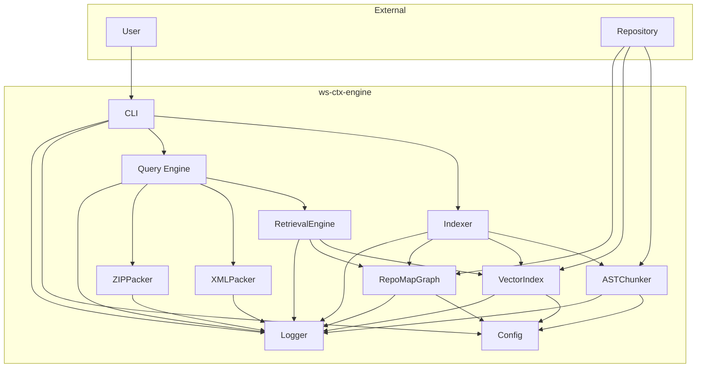

**Diagram sources**
- [cli.py:27-800](file://src/ws_ctx_engine/cli/cli.py#L27-L800)
- [indexer.py:72-493](file://src/ws_ctx_engine/workflow/indexer.py#L72-L493)
- [query.py:158-617](file://src/ws_ctx_engine/workflow/query.py#L158-L617)
- [retrieval.py:140-627](file://src/ws_ctx_engine/retrieval/retrieval.py#L140-L627)
- [vector_index.py:21-800](file://src/ws_ctx_engine/vector_index/vector_index.py#L21-L800)
- [graph.py:19-667](file://src/ws_ctx_engine/graph/graph.py#L19-L667)
- [base.py:41-176](file://src/ws_ctx_engine/chunker/base.py#L41-L176)
- [xml_packer.py:51-239](file://src/ws_ctx_engine/packer/xml_packer.py#L51-L239)
- [config.py:16-399](file://src/ws_ctx_engine/config/config.py#L16-L399)
- [logger.py:13-145](file://src/ws_ctx_engine/logger/logger.py#L13-L145)