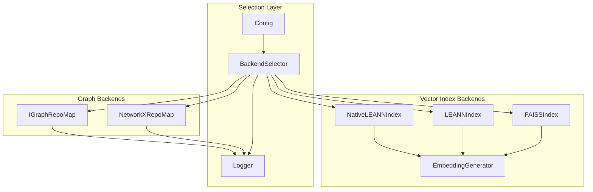
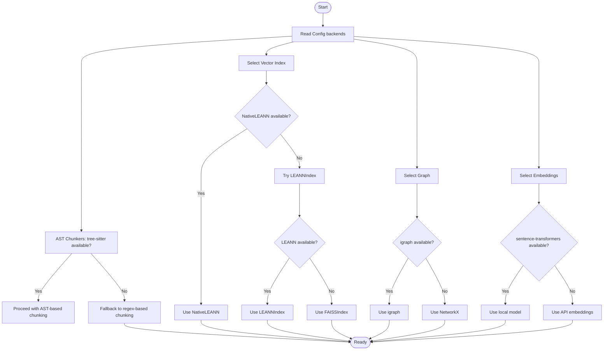
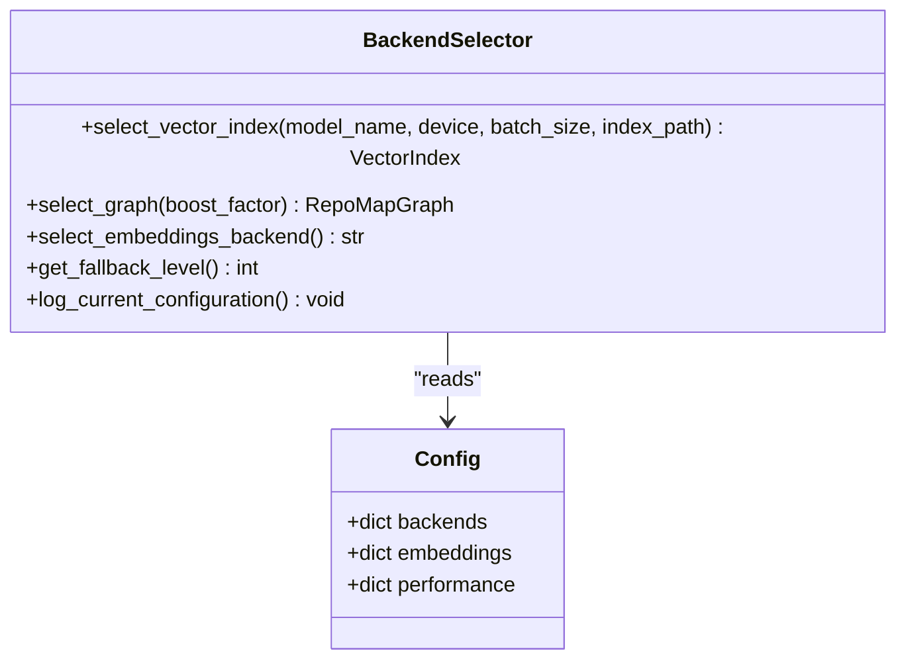
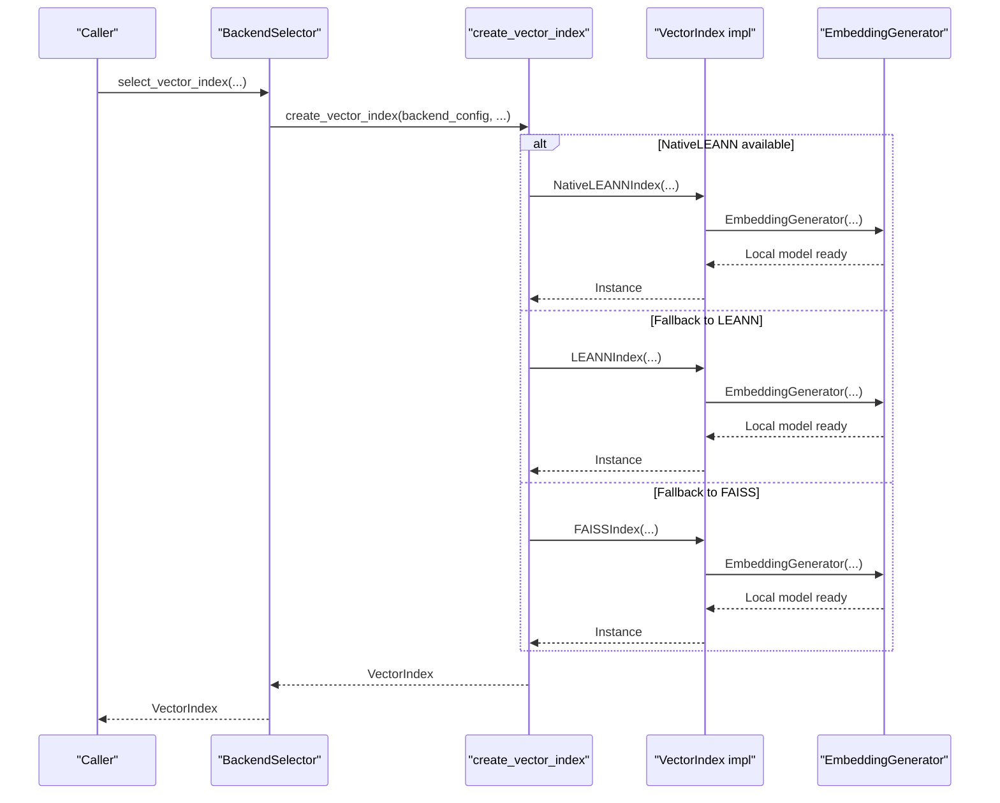
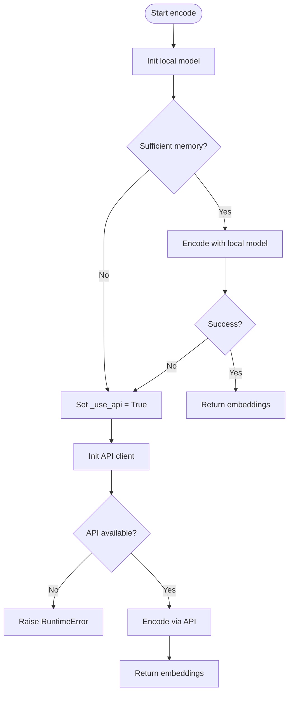
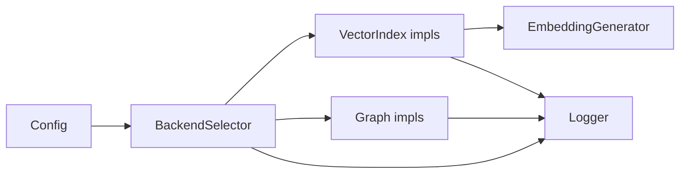

# Automatic Detection Algorithms

<cite>
**Referenced Files in This Document**
- [backend_selector.py](file://src/ws_ctx_engine/backend_selector/backend_selector.py)
- [vector_index.py](file://src/ws_ctx_engine/vector_index/vector_index.py)
- [leann_index.py](file://src/ws_ctx_engine/vector_index/leann_index.py)
- [graph.py](file://src/ws_ctx_engine/graph/graph.py)
- [config.py](file://src/ws_ctx_engine/config/config.py)
- [logger.py](file://src/ws_ctx_engine/logger/logger.py)
- [test_backend_selector_properties.py](file://tests/property/test_backend_selector_properties.py)
- [test_fallback_scenarios.py](file://tests/integration/test_fallback_scenarios.py)
</cite>

## Table of Contents
1. [Introduction](#introduction)
2. [Project Structure](#project-structure)
3. [Core Components](#core-components)
4. [Architecture Overview](#architecture-overview)
5. [Detailed Component Analysis](#detailed-component-analysis)
6. [Dependency Analysis](#dependency-analysis)
7. [Performance Considerations](#performance-considerations)
8. [Troubleshooting Guide](#troubleshooting-guide)
9. [Conclusion](#conclusion)

## Introduction
This document explains the automatic backend detection algorithms that enable the system to select optimal backends at runtime while gracefully degrading when dependencies are unavailable. It covers:
- Runtime detection for tree-sitter availability (via AST chunkers)
- Leann library presence checks
- igraph compilation success verification
- Faiss installation verification
- Sentence-transformers model loading with API fallback
- Configuration-driven selection for "auto" mode
- Error handling and graceful degradation
- Diagnostic information and performance optimization tips

## Project Structure
The backend detection spans several modules:
- BackendSelector orchestrates selection and logs fallbacks
- Vector index backends (LEANN, FAISS) and embedding generation
- Graph backends (igraph, NetworkX) with fallback
- Configuration defines backend choices and defaults
- Logger records fallback events and diagnostics



**Diagram sources**
- [backend_selector.py:13-191](file://src/ws_ctx_engine/backend_selector/backend_selector.py#L13-L191)
- [vector_index.py:96-280](file://src/ws_ctx_engine/vector_index/vector_index.py#L96-L280)
- [leann_index.py:20-297](file://src/ws_ctx_engine/vector_index/leann_index.py#L20-L297)
- [graph.py:97-667](file://src/ws_ctx_engine/graph/graph.py#L97-L667)
- [config.py:74-101](file://src/ws_ctx_engine/config/config.py#L74-L101)
- [logger.py:13-145](file://src/ws_ctx_engine/logger/logger.py#L13-L145)

**Section sources**
- [backend_selector.py:13-191](file://src/ws_ctx_engine/backend_selector/backend_selector.py#L13-L191)
- [config.py:74-101](file://src/ws_ctx_engine/config/config.py#L74-L101)

## Core Components
- BackendSelector: Central orchestrator that reads configuration and selects backends with graceful degradation. It logs the current configuration and fallback level.
- VectorIndex family: Abstractions and implementations for semantic indexing with local and API embedding fallback.
- Graph backends: igraph (fast C++ backend) and NetworkX (pure Python fallback).
- Configuration: Defines backend choices and validates user settings.
- Logger: Provides structured logging including fallback events.

Key responsibilities:
- Translate "auto" into explicit backend choices based on availability
- Fail fast with clear messages when all backends fail
- Log fallback events for diagnostics

**Section sources**
- [backend_selector.py:13-191](file://src/ws_ctx_engine/backend_selector/backend_selector.py#L13-L191)
- [vector_index.py:21-84](file://src/ws_ctx_engine/vector_index/vector_index.py#L21-L84)
- [graph.py:19-95](file://src/ws_ctx_engine/graph/graph.py#L19-L95)
- [config.py:16-111](file://src/ws_ctx_engine/config/config.py#L16-L111)
- [logger.py:13-78](file://src/ws_ctx_engine/logger/logger.py#L13-L78)

## Architecture Overview
The selection architecture follows a layered fallback strategy:
- Vector index: NativeLEANN → LEANN → FAISS
- Graph: igraph → NetworkX
- Embeddings: Local sentence-transformers → API (OpenAI)
- Fallback levels: 1–6 representing decreasing capability



**Diagram sources**
- [backend_selector.py:36-156](file://src/ws_ctx_engine/backend_selector/backend_selector.py#L36-L156)
- [vector_index.py:96-280](file://src/ws_ctx_engine/vector_index/vector_index.py#L96-L280)
- [leann_index.py:67-83](file://src/ws_ctx_engine/vector_index/leann_index.py#L67-L83)
- [graph.py:572-621](file://src/ws_ctx_engine/graph/graph.py#L572-L621)

## Detailed Component Analysis

### BackendSelector: Configuration-Driven Selection and Fallback
- Reads configuration for vector_index, graph, and embeddings backends
- Determines fallback level (1–6) based on available components
- Logs current configuration and fallback level
- Delegates creation to specialized factories and constructors



**Diagram sources**
- [backend_selector.py:26-178](file://src/ws_ctx_engine/backend_selector/backend_selector.py#L26-L178)
- [config.py:74-101](file://src/ws_ctx_engine/config/config.py#L74-L101)

**Section sources**
- [backend_selector.py:26-178](file://src/ws_ctx_engine/backend_selector/backend_selector.py#L26-L178)
- [config.py:74-101](file://src/ws_ctx_engine/config/config.py#L74-L101)

### Vector Index Backends: Availability and Fallback
- NativeLEANNIndex: Requires leann library; raises ImportError if unavailable
- LEANNIndex: Pure Python implementation; used when NativeLEANN is unavailable
- FAISSIndex: Requires faiss-cpu; raises RuntimeError with installation guidance
- EmbeddingGenerator: Attempts sentence-transformers; falls back to OpenAI API on OOM or import errors



**Diagram sources**
- [backend_selector.py:36-81](file://src/ws_ctx_engine/backend_selector/backend_selector.py#L36-L81)
- [vector_index.py:282-504](file://src/ws_ctx_engine/vector_index/vector_index.py#L282-L504)
- [leann_index.py:20-142](file://src/ws_ctx_engine/vector_index/leann_index.py#L20-L142)

**Section sources**
- [leann_index.py:67-83](file://src/ws_ctx_engine/vector_index/leann_index.py#L67-L83)
- [vector_index.py:506-647](file://src/ws_ctx_engine/vector_index/vector_index.py#L506-L647)
- [vector_index.py:96-280](file://src/ws_ctx_engine/vector_index/vector_index.py#L96-L280)

### Graph Backends: igraph vs NetworkX
- IGraphRepoMap: Requires python-igraph; raises ImportError if unavailable
- NetworkXRepoMap: Requires networkx; raises ImportError if unavailable
- create_graph tries igraph first; logs fallback to NetworkX when igraph is unavailable

```mermaid
sequenceDiagram
participant Caller as "Caller"
participant Selector as "BackendSelector"
participant Factory as "create_graph"
participant IG as "IGraphRepoMap"
participant NX as "NetworkXRepoMap"
Caller->>Selector : select_graph(...)
Selector->>Factory : create_graph(backend_config, boost_factor)
alt backend == "igraph" or "auto"
Factory->>IG : IGraphRepoMap(boost_factor)
IG-->>Factory : Instance
catch ImportError
Factory->>NX : NetworkXRepoMap(boost_factor)
NX-->>Factory : Instance
end
Factory-->>Selector : RepoMapGraph
Selector-->>Caller : RepoMapGraph
```

**Diagram sources**
- [graph.py:572-621](file://src/ws_ctx_engine/graph/graph.py#L572-L621)
- [graph.py:97-315](file://src/ws_ctx_engine/graph/graph.py#L97-L315)
- [graph.py:317-569](file://src/ws_ctx_engine/graph/graph.py#L317-L569)

**Section sources**
- [graph.py:97-123](file://src/ws_ctx_engine/graph/graph.py#L97-L123)
- [graph.py:317-343](file://src/ws_ctx_engine/graph/graph.py#L317-L343)
- [graph.py:572-621](file://src/ws_ctx_engine/graph/graph.py#L572-L621)

### Embeddings: Local Model vs API Fallback
- EmbeddingGenerator attempts sentence-transformers model loading
- Checks available memory and falls back to API on low memory or exceptions
- API client initialization requires environment variable; logs errors if missing



**Diagram sources**
- [vector_index.py:143-280](file://src/ws_ctx_engine/vector_index/vector_index.py#L143-L280)

**Section sources**
- [vector_index.py:143-280](file://src/ws_ctx_engine/vector_index/vector_index.py#L143-L280)

### Tree-Sitter Availability in AST Chunkers
- AST chunkers rely on tree-sitter grammars for language-specific parsing
- When tree-sitter is unavailable, the system falls back to regex-based chunking
- This fallback ensures chunking continues without crashing

[No sources needed since this section describes conceptual fallback behavior not tied to specific source files]

## Dependency Analysis
- BackendSelector depends on Config for backend choices and delegates to factories
- VectorIndex implementations depend on EmbeddingGenerator for embeddings
- Graph implementations depend on external libraries (igraph, networkx)
- Logger is injected into components to record fallback events



**Diagram sources**
- [backend_selector.py:26-178](file://src/ws_ctx_engine/backend_selector/backend_selector.py#L26-L178)
- [vector_index.py:96-280](file://src/ws_ctx_engine/vector_index/vector_index.py#L96-L280)
- [graph.py:97-315](file://src/ws_ctx_engine/graph/graph.py#L97-L315)
- [logger.py:64-77](file://src/ws_ctx_engine/logger/logger.py#L64-L77)

**Section sources**
- [backend_selector.py:26-178](file://src/ws_ctx_engine/backend_selector/backend_selector.py#L26-L178)
- [vector_index.py:96-280](file://src/ws_ctx_engine/vector_index/vector_index.py#L96-L280)
- [graph.py:97-315](file://src/ws_ctx_engine/graph/graph.py#L97-L315)
- [logger.py:64-77](file://src/ws_ctx_engine/logger/logger.py#L64-L77)

## Performance Considerations
- Prefer NativeLEANN for optimal storage savings and speed when available
- Use FAISS for larger repositories; ensure adequate RAM for indexing
- Monitor memory during local model loading; expect fallback to API on low memory
- igraph is significantly faster than NetworkX for PageRank; prefer when available
- Embedding batch size can impact throughput; tune based on device capabilities

[No sources needed since this section provides general guidance]

## Troubleshooting Guide
Common detection failures and diagnostics:
- Leann not available: ImportError raised; install via documented command
  - Reference: [leann_index.py:78-82](file://src/ws_ctx_engine/vector_index/leann_index.py#L78-L82)
- FAISS not installed: RuntimeError with installation guidance
  - Reference: [vector_index.py:584-587](file://src/ws_ctx_engine/vector_index/vector_index.py#L584-L587)
- igraph not available: ImportError; install python-igraph
  - Reference: [graph.py:115-122](file://src/ws_ctx_engine/graph/graph.py#L115-L122)
- sentence-transformers not available: Warning; falls back to API
  - Reference: [vector_index.py:164-172](file://src/ws_ctx_engine/vector_index/vector_index.py#L164-L172)
- Low memory during encoding: Warning; model cleared and API fallback triggered
  - Reference: [vector_index.py:234-245](file://src/ws_ctx_engine/vector_index/vector_index.py#L234-L245)
- API client initialization fails: Error logged; check environment variable
  - Reference: [vector_index.py:192-197](file://src/ws_ctx_engine/vector_index/vector_index.py#L192-L197)

Diagnostic logging:
- Fallback events are logged with component, primary, fallback, and reason
  - Reference: [logger.py:64-77](file://src/ws_ctx_engine/logger/logger.py#L64-L77)
- BackendSelector logs current configuration and fallback level
  - Reference: [backend_selector.py:158-177](file://src/ws_ctx_engine/backend_selector/backend_selector.py#L158-L177)

Validation and tests:
- Property-based tests validate graceful degradation and fallback ordering
  - Reference: [test_backend_selector_properties.py:14-133](file://tests/property/test_backend_selector_properties.py#L14-L133)
- Integration tests simulate fallback scenarios (LEANN→FAISS, igraph→NetworkX)
  - Reference: [test_fallback_scenarios.py:327-467](file://tests/integration/test_fallback_scenarios.py#L327-L467)

**Section sources**
- [leann_index.py:78-82](file://src/ws_ctx_engine/vector_index/leann_index.py#L78-L82)
- [vector_index.py:584-587](file://src/ws_ctx_engine/vector_index/vector_index.py#L584-L587)
- [graph.py:115-122](file://src/ws_ctx_engine/graph/graph.py#L115-L122)
- [vector_index.py:164-172](file://src/ws_ctx_engine/vector_index/vector_index.py#L164-L172)
- [vector_index.py:234-245](file://src/ws_ctx_engine/vector_index/vector_index.py#L234-L245)
- [vector_index.py:192-197](file://src/ws_ctx_engine/vector_index/vector_index.py#L192-L197)
- [logger.py:64-77](file://src/ws_ctx_engine/logger/logger.py#L64-L77)
- [backend_selector.py:158-177](file://src/ws_ctx_engine/backend_selector/backend_selector.py#L158-L177)
- [test_backend_selector_properties.py:14-133](file://tests/property/test_backend_selector_properties.py#L14-L133)
- [test_fallback_scenarios.py:327-467](file://tests/integration/test_fallback_scenarios.py#L327-L467)

## Conclusion
The automatic detection algorithms provide robust, configuration-driven backend selection with clear fallback chains. They prioritize optimal backends when available and gracefully degrade to simpler alternatives, ensuring system reliability. Structured logging captures fallback events for diagnostics, while tests validate correctness and resilience across environments.