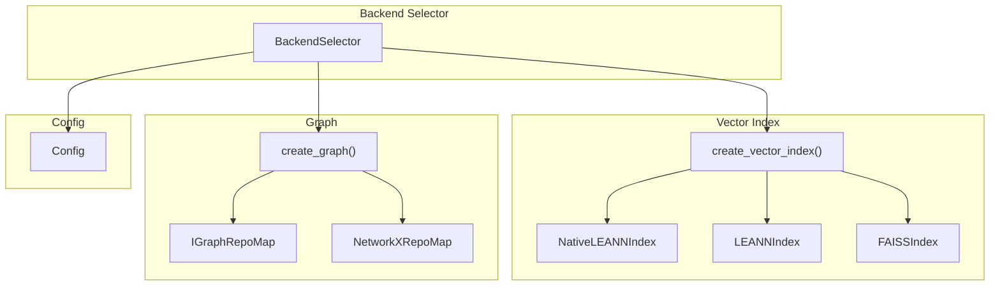
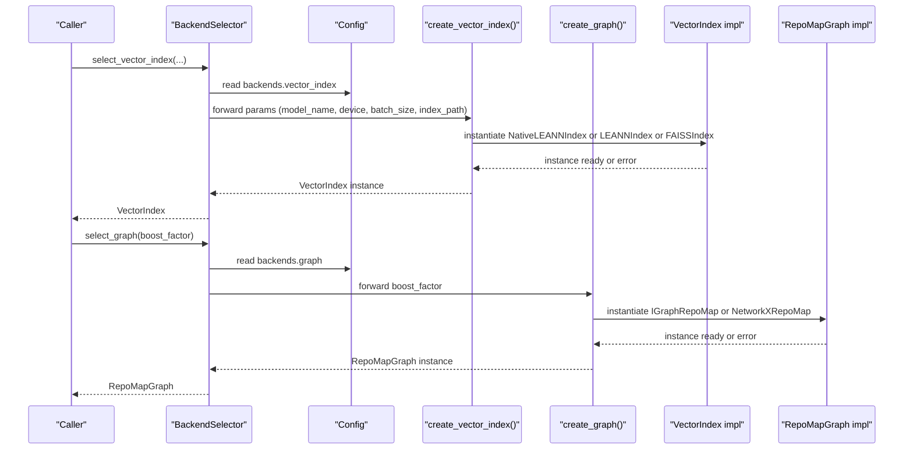
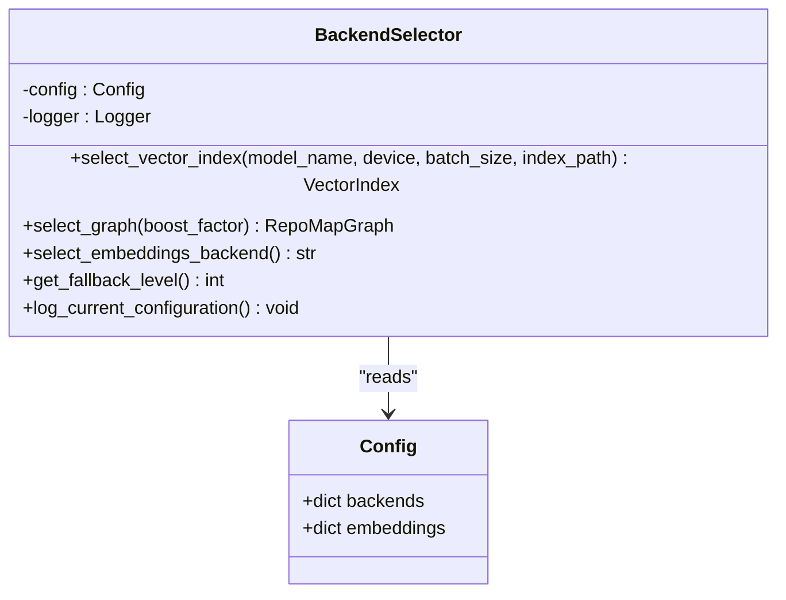
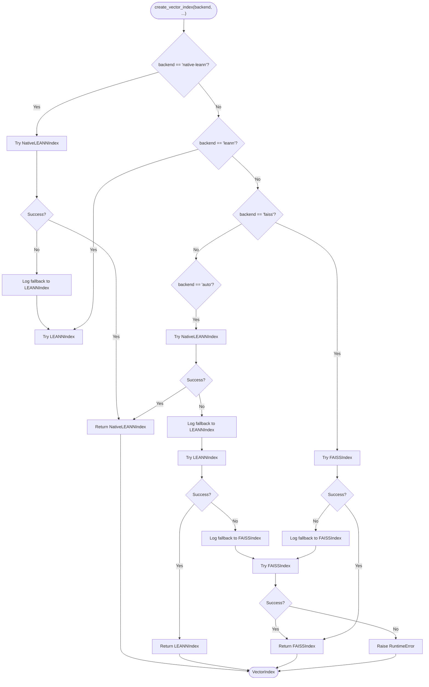
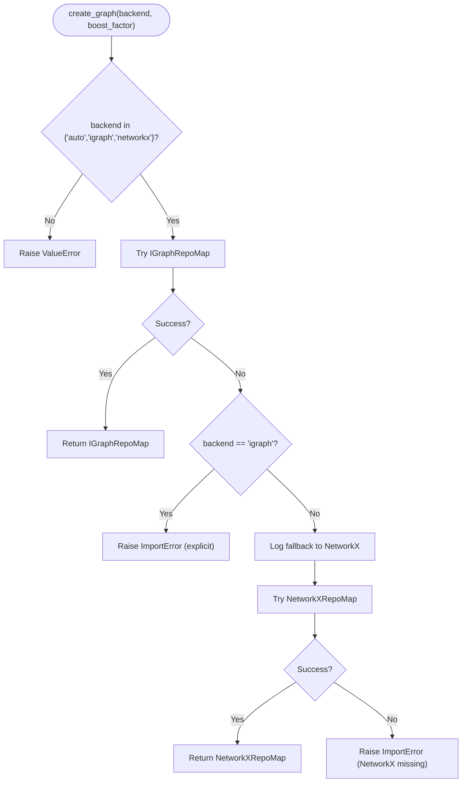
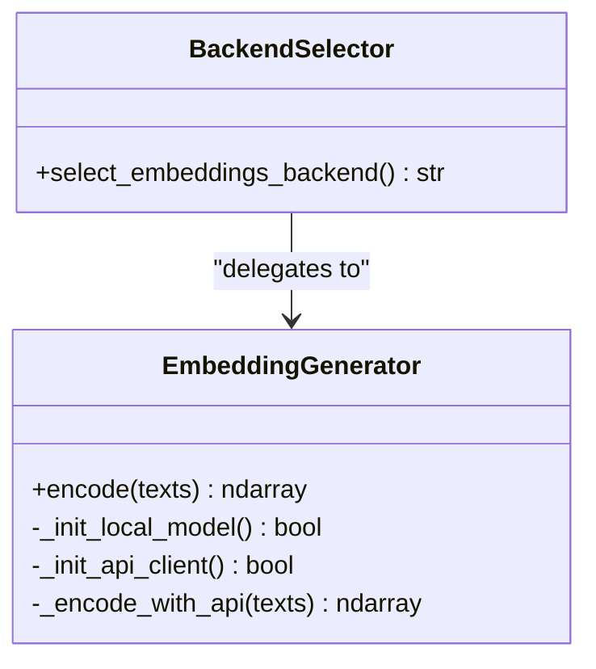
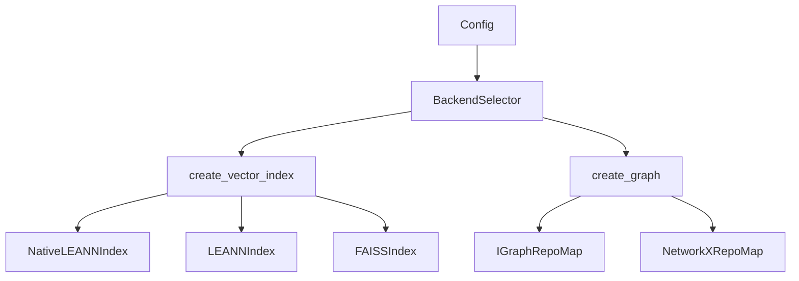

# Backend Factory Implementation

<cite>
**Referenced Files in This Document**
- [backend_selector.py](file://src/ws_ctx_engine/backend_selector/backend_selector.py)
- [vector_index.py](file://src/ws_ctx_engine/vector_index/vector_index.py)
- [leann_index.py](file://src/ws_ctx_engine/vector_index/leann_index.py)
- [graph.py](file://src/ws_ctx_engine/graph/graph.py)
- [config.py](file://src/ws_ctx_engine/config/config.py)
- [__init__.py (vector_index)](file://src/ws_ctx_engine/vector_index/__init__.py)
- [__init__.py (graph)](file://src/ws_ctx_engine/graph/__init__.py)
- [__init__.py (backend_selector)](file://src/ws_ctx_engine/backend_selector/__init__.py)
- [cli.py](file://src/ws_ctx_engine/cli/cli.py)
- [indexer.py](file://src/ws_ctx_engine/workflow/indexer.py)
</cite>

## Table of Contents
1. [Introduction](#introduction)
2. [Project Structure](#project-structure)
3. [Core Components](#core-components)
4. [Architecture Overview](#architecture-overview)
5. [Detailed Component Analysis](#detailed-component-analysis)
6. [Dependency Analysis](#dependency-analysis)
7. [Performance Considerations](#performance-considerations)
8. [Troubleshooting Guide](#troubleshooting-guide)
9. [Conclusion](#conclusion)

## Introduction
This document explains the centralized backend factory pattern that orchestrates vector index creation, graph construction, and embedding backend selection. It details how the factory encapsulates instantiation logic, parameter forwarding, configuration validation, and graceful fallback transitions. It also covers extension points for adding new backends and integration patterns with the broader system.

## Project Structure
The backend factory lives in the backend selector module and delegates to specialized factories and constructors:
- Centralized backend selection and fallback orchestration
- Vector index factory with three backend tiers
- Graph factory with igraph and NetworkX backends
- Configuration-driven selection with validation and defaults

**Diagram sources**
- [backend_selector.py:13-191](file://src/ws_ctx_engine/backend_selector/backend_selector.py#L13-L191)
- [vector_index.py:972-1081](file://src/ws_ctx_engine/vector_index/vector_index.py#L972-L1081)
- [leann_index.py:265-297](file://src/ws_ctx_engine/vector_index/leann_index.py#L265-L297)
- [graph.py:572-621](file://src/ws_ctx_engine/graph/graph.py#L572-L621)
- [config.py:74-81](file://src/ws_ctx_engine/config/config.py#L74-L81)

**Section sources**
- [backend_selector.py:13-191](file://src/ws_ctx_engine/backend_selector/backend_selector.py#L13-L191)
- [vector_index.py:972-1081](file://src/ws_ctx_engine/vector_index/vector_index.py#L972-L1081)
- [graph.py:572-621](file://src/ws_ctx_engine/graph/graph.py#L572-L621)
- [config.py:74-81](file://src/ws_ctx_engine/config/config.py#L74-L81)

## Core Components
- BackendSelector: Central orchestrator that selects and logs fallback levels, forwards parameters to specialized factories, and propagates errors.
- create_vector_index: Factory that tries NativeLEANN, then LEANN, then FAISS with detailed fallback logging and error propagation.
- create_graph: Factory that tries igraph first, falls back to NetworkX, and logs fallback events.
- Config: Validates and normalizes backend selections and embedding parameters.

Key responsibilities:
- Parameter forwarding: model_name, device, batch_size, index_path, boost_factor
- Configuration validation: backends and embeddings sections
- Error propagation: re-raises RuntimeError when all backends fail
- Logging: structured fallback and configuration logs

**Section sources**
- [backend_selector.py:36-178](file://src/ws_ctx_engine/backend_selector/backend_selector.py#L36-L178)
- [vector_index.py:972-1081](file://src/ws_ctx_engine/vector_index/vector_index.py#L972-L1081)
- [graph.py:572-621](file://src/ws_ctx_engine/graph/graph.py#L572-L621)
- [config.py:286-318](file://src/ws_ctx_engine/config/config.py#L286-L318)

## Architecture Overview
The factory chain follows a consistent pattern:
- BackendSelector reads Config and delegates to specialized factories
- Factories attempt preferred backends first, then progressively degrade
- Errors are logged and re-raised to surface meaningful failures
- Backends are persisted with explicit metadata to support load-time backend detection

**Diagram sources**
- [backend_selector.py:36-110](file://src/ws_ctx_engine/backend_selector/backend_selector.py#L36-L110)
- [vector_index.py:972-1081](file://src/ws_ctx_engine/vector_index/vector_index.py#L972-L1081)
- [graph.py:572-621](file://src/ws_ctx_engine/graph/graph.py#L572-L621)
- [config.py:74-81](file://src/ws_ctx_engine/config/config.py#L74-L81)

## Detailed Component Analysis

### BackendSelector
Central orchestrator that:
- Reads configuration for backends and embeddings
- For vector index: validates and forwards parameters, catches and re-raises errors
- For graph: delegates to create_graph and logs failures
- Determines fallback level based on configuration
- Logs current configuration and fallback level

**Diagram sources**
- [backend_selector.py:13-191](file://src/ws_ctx_engine/backend_selector/backend_selector.py#L13-L191)
- [config.py:74-92](file://src/ws_ctx_engine/config/config.py#L74-L92)

**Section sources**
- [backend_selector.py:26-178](file://src/ws_ctx_engine/backend_selector/backend_selector.py#L26-L178)
- [config.py:74-92](file://src/ws_ctx_engine/config/config.py#L74-L92)

### Vector Index Factory
The vector index factory implements a three-tier fallback:
1. NativeLEANNIndex (preferred, 97% storage savings)
2. LEANNIndex (cosine similarity fallback)
3. FAISSIndex (IndexFlatL2 + IndexIDMap2 fallback)

**Diagram sources**
- [vector_index.py:972-1081](file://src/ws_ctx_engine/vector_index/vector_index.py#L972-L1081)
- [leann_index.py:265-297](file://src/ws_ctx_engine/vector_index/leann_index.py#L265-L297)

**Section sources**
- [vector_index.py:972-1081](file://src/ws_ctx_engine/vector_index/vector_index.py#L972-L1081)
- [leann_index.py:265-297](file://src/ws_ctx_engine/vector_index/leann_index.py#L265-L297)

### Graph Factory
The graph factory attempts igraph first (fast C++ backend), then falls back to NetworkX (pure Python). It validates backend selection and raises informative errors when unavailable.

**Diagram sources**
- [graph.py:572-621](file://src/ws_ctx_engine/graph/graph.py#L572-L621)

**Section sources**
- [graph.py:572-621](file://src/ws_ctx_engine/graph/graph.py#L572-L621)

### Embedding Backend Selection
BackendSelector exposes the configured embeddings backend (local, API, or auto) and delegates embedding generation to the embedding generator, which automatically switches to API fallback when local resources are insufficient.

**Diagram sources**
- [backend_selector.py:111-118](file://src/ws_ctx_engine/backend_selector/backend_selector.py#L111-L118)
- [vector_index.py:96-280](file://src/ws_ctx_engine/vector_index/vector_index.py#L96-L280)

**Section sources**
- [backend_selector.py:111-118](file://src/ws_ctx_engine/backend_selector/backend_selector.py#L111-L118)
- [vector_index.py:96-280](file://src/ws_ctx_engine/vector_index/vector_index.py#L96-L280)

### Configuration Validation and Defaults
Config validates and normalizes:
- backends: vector_index, graph, embeddings
- embeddings: model, device, batch_size, api_provider, api_key_env
- performance: cache_embeddings, incremental_index

It ensures robust defaults and logs warnings for invalid values.

**Section sources**
- [config.py:286-398](file://src/ws_ctx_engine/config/config.py#L286-L398)

### Parameter Forwarding Mechanisms
- BackendSelector forwards model_name, device, batch_size, index_path to vector index factory and boost_factor to graph factory.
- Vector index factory accepts backend selection and forwards model/device/batch parameters to underlying implementations.
- Graph factory accepts backend selection and boost_factor.

These parameters are validated by Config and passed through to the respective factories.

**Section sources**
- [backend_selector.py:36-110](file://src/ws_ctx_engine/backend_selector/backend_selector.py#L36-L110)
- [vector_index.py:972-1081](file://src/ws_ctx_engine/vector_index/vector_index.py#L972-L1081)
- [graph.py:572-621](file://src/ws_ctx_engine/graph/graph.py#L572-L621)
- [config.py:74-92](file://src/ws_ctx_engine/config/config.py#L74-L92)

### Error Propagation Throughout the Factory Chain
- Vector index factory logs fallbacks and raises RuntimeError if all backends fail.
- Graph factory raises ImportError for unavailable backends or ValueError for invalid backend selection.
- BackendSelector catches and re-raises errors from factories with context.

**Section sources**
- [vector_index.py:1042-1077](file://src/ws_ctx_engine/vector_index/vector_index.py#L1042-L1077)
- [graph.py:590-620](file://src/ws_ctx_engine/graph/graph.py#L590-L620)
- [backend_selector.py:70-80](file://src/ws_ctx_engine/backend_selector/backend_selector.py#L70-L80)

### Examples of Custom Backend Registration and Extension Points
To add a new vector index backend:
1. Implement a new VectorIndex subclass with build, search, save, load.
2. Extend create_vector_index to handle a new backend string and instantiate your class.
3. Ensure save/load persist a "backend" identifier for automatic detection.

To add a new graph backend:
1. Implement a new RepoMapGraph subclass with build, pagerank, save, load.
2. Extend create_graph to handle a new backend string and instantiate your class.
3. Ensure save/load persist a "backend" identifier for automatic detection.

Integration patterns:
- Use BackendSelector to centralize backend selection and logging.
- Persist indexes with metadata to enable automatic backend detection on load.
- Respect Config backends and embeddings sections for consistent behavior.

**Section sources**
- [vector_index.py:972-1081](file://src/ws_ctx_engine/vector_index/vector_index.py#L972-L1081)
- [graph.py:572-621](file://src/ws_ctx_engine/graph/graph.py#L572-L621)
- [vector_index.py:1083-1120](file://src/ws_ctx_engine/vector_index/vector_index.py#L1083-L1120)
- [graph.py:623-667](file://src/ws_ctx_engine/graph/graph.py#L623-L667)

### Integration Patterns with Broader System Architecture
- CLI auto-resolution augments Config backends with runtime availability checks.
- Workflow indexer coordinates embedding cache usage and incremental updates with FAISS.
- Index loader detects backend from persisted metadata and loads accordingly.

**Section sources**
- [cli.py:283-296](file://src/ws_ctx_engine/cli/cli.py#L283-L296)
- [indexer.py:197-244](file://src/ws_ctx_engine/workflow/indexer.py#L197-L244)
- [vector_index.py:1083-1120](file://src/ws_ctx_engine/vector_index/vector_index.py#L1083-L1120)
- [graph.py:623-667](file://src/ws_ctx_engine/graph/graph.py#L623-L667)

## Dependency Analysis
The backend factory relies on:
- Config for validated backend choices
- Vector index factory for index instantiation and persistence
- Graph factory for dependency graph construction and PageRank
- Logger for fallback and configuration logging

**Diagram sources**
- [config.py:74-81](file://src/ws_ctx_engine/config/config.py#L74-L81)
- [backend_selector.py:13-191](file://src/ws_ctx_engine/backend_selector/backend_selector.py#L13-L191)
- [vector_index.py:972-1081](file://src/ws_ctx_engine/vector_index/vector_index.py#L972-L1081)
- [graph.py:572-621](file://src/ws_ctx_engine/graph/graph.py#L572-L621)

**Section sources**
- [config.py:74-92](file://src/ws_ctx_engine/config/config.py#L74-L92)
- [backend_selector.py:13-191](file://src/ws_ctx_engine/backend_selector/backend_selector.py#L13-L191)
- [vector_index.py:972-1081](file://src/ws_ctx_engine/vector_index/vector_index.py#L972-L1081)
- [graph.py:572-621](file://src/ws_ctx_engine/graph/graph.py#L572-L621)

## Performance Considerations
- NativeLEANNIndex provides significant storage savings and fast search by leveraging the LEANN library.
- FAISSIndex uses IndexFlatL2 wrapped in IndexIDMap2 for exact search and incremental updates.
- EmbeddingGenerator dynamically switches to API fallback under memory pressure to maintain responsiveness.
- Incremental updates in FAISSIndex minimize rebuild costs by removing and adding only changed files.

[No sources needed since this section provides general guidance]

## Troubleshooting Guide
Common issues and resolutions:
- All vector index backends failed: Install the leann library for optimal performance or rely on fallbacks.
- igraph not available: Install python-igraph or configure graph backend to networkx.
- NetworkX not available: Install networkx or adjust backend selection.
- Low memory during embedding: EmbeddingGenerator automatically falls back to API; ensure API credentials are configured.
- Invalid backend selection: Validate Config.backends values and restart with corrected configuration.

**Section sources**
- [vector_index.py:1042-1077](file://src/ws_ctx_engine/vector_index/vector_index.py#L1042-L1077)
- [graph.py:590-620](file://src/ws_ctx_engine/graph/graph.py#L590-L620)
- [vector_index.py:164-172](file://src/ws_ctx_engine/vector_index/vector_index.py#L164-L172)
- [config.py:286-318](file://src/ws_ctx_engine/config/config.py#L286-L318)

## Conclusion
The backend factory pattern centralizes instantiation and fallback logic, ensuring seamless transitions across vector index, graph, and embedding backends. By validating configuration, forwarding parameters, and propagating errors with clear logs, the system delivers robust and extensible backend selection suitable for diverse environments and performance requirements.