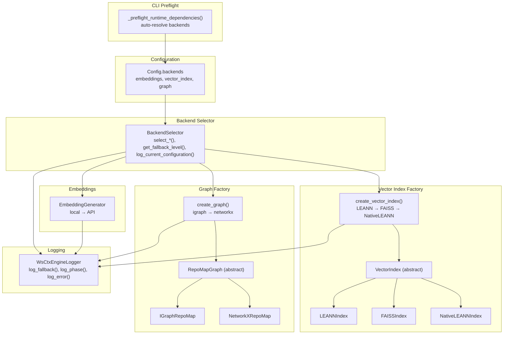
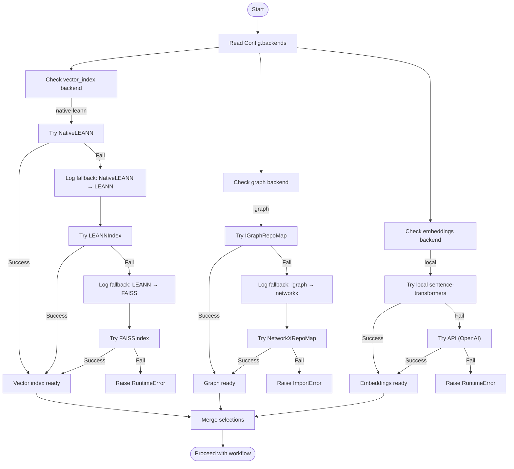
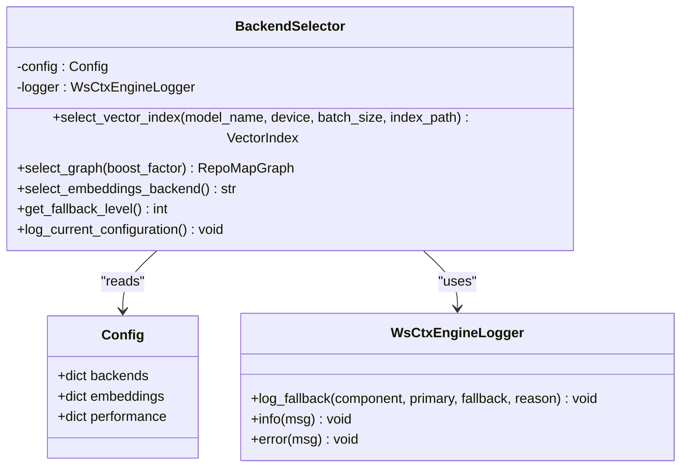
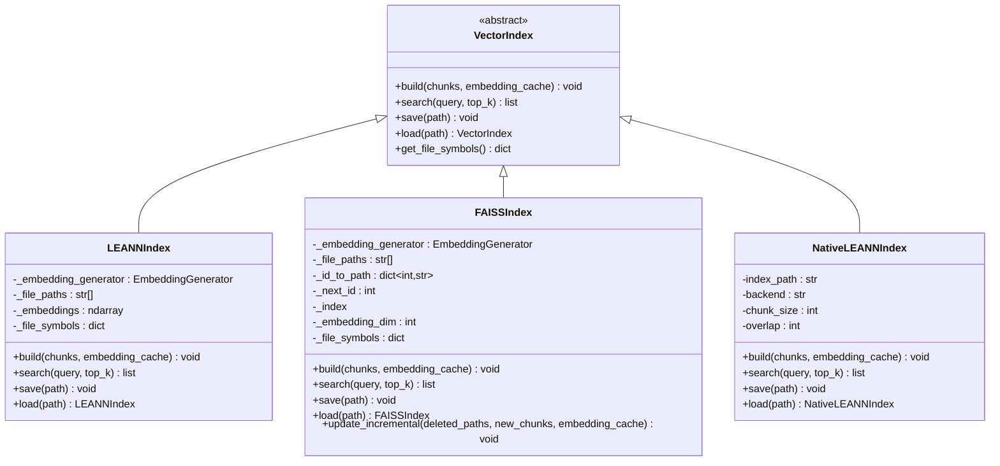
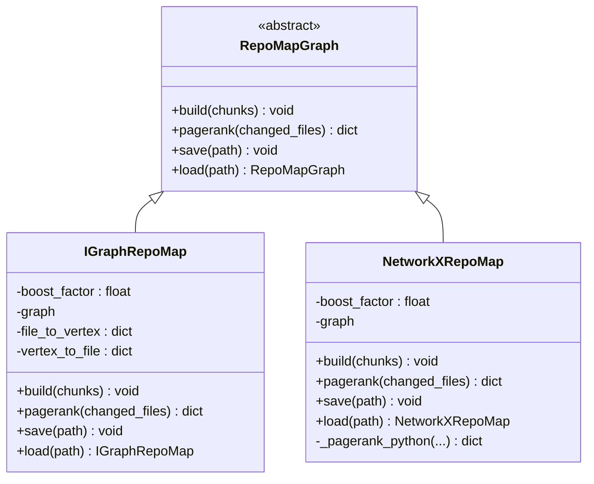
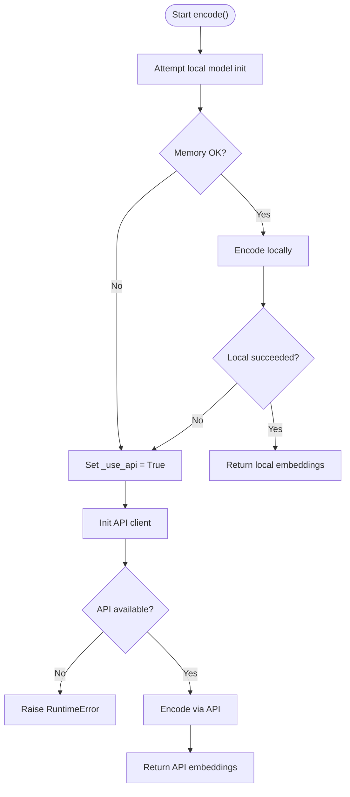
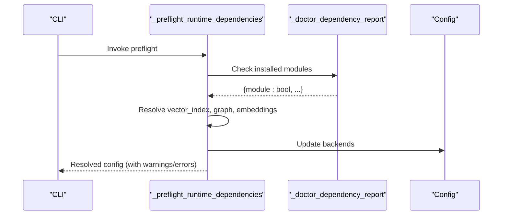
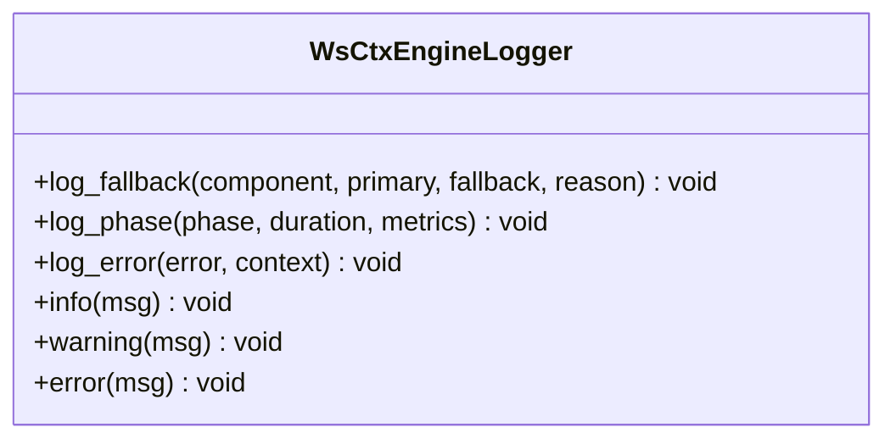
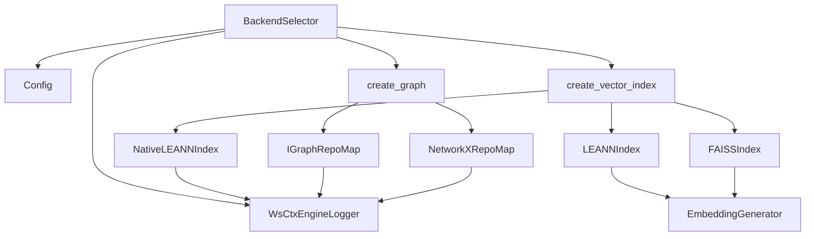

# Backend Selection Strategy

<cite>
**Referenced Files in This Document**
- [backend_selector.py](file://src/ws_ctx_engine/backend_selector/backend_selector.py)
- [vector_index.py](file://src/ws_ctx_engine/vector_index/vector_index.py)
- [leann_index.py](file://src/ws_ctx_engine/vector_index/leann_index.py)
- [graph.py](file://src/ws_ctx_engine/graph/graph.py)
- [logger.py](file://src/ws_ctx_engine/logger/logger.py)
- [config.py](file://src/ws_ctx_engine/config/config.py)
- [cli.py](file://src/ws_ctx_engine/cli/cli.py)
- [models.py](file://src/ws_ctx_engine/models/models.py)
- [indexer.py](file://src/ws_ctx_engine/workflow/indexer.py)
</cite>

## Table of Contents
1. [Introduction](#introduction)
2. [Project Structure](#project-structure)
3. [Core Components](#core-components)
4. [Architecture Overview](#architecture-overview)
5. [Detailed Component Analysis](#detailed-component-analysis)
6. [Dependency Analysis](#dependency-analysis)
7. [Performance Considerations](#performance-considerations)
8. [Troubleshooting Guide](#troubleshooting-guide)
9. [Conclusion](#conclusion)

## Introduction
This document explains the backend selection and fallback strategy used across the system. It covers how the system automatically detects and selects optimal backends for vector indexing, graph construction, and embeddings, and how it gracefully degrades when prerequisites are missing. It also documents the factory-style creation functions, configuration-driven selection, logging of fallback transitions, performance characteristics of each tier, and migration paths between implementations.

## Project Structure
The backend selection spans several modules:
- BackendSelector centralizes selection and logging of fallback levels
- Vector index backends (LEANN, FAISS, NativeLEANN) are created via factory functions
- Graph backends (igraph, NetworkX) are created via a dedicated factory
- Embeddings backend selection is driven by configuration and runtime availability
- CLI preflight validates runtime dependencies and auto-resolves backends
- Logging provides actionable fallback messages

**Diagram sources**
- [backend_selector.py:13-191](file://src/ws_ctx_engine/backend_selector/backend_selector.py#L13-L191)
- [vector_index.py:972-1120](file://src/ws_ctx_engine/vector_index/vector_index.py#L972-L1120)
- [graph.py:572-667](file://src/ws_ctx_engine/graph/graph.py#L572-L667)
- [logger.py:13-145](file://src/ws_ctx_engine/logger/logger.py#L13-L145)
- [cli.py:256-327](file://src/ws_ctx_engine/cli/cli.py#L256-L327)

**Section sources**
- [backend_selector.py:13-191](file://src/ws_ctx_engine/backend_selector/backend_selector.py#L13-L191)
- [vector_index.py:972-1120](file://src/ws_ctx_engine/vector_index/vector_index.py#L972-L1120)
- [graph.py:572-667](file://src/ws_ctx_engine/graph/graph.py#L572-L667)
- [logger.py:13-145](file://src/ws_ctx_engine/logger/logger.py#L13-L145)
- [cli.py:256-327](file://src/ws_ctx_engine/cli/cli.py#L256-L327)

## Core Components
- BackendSelector: Central orchestrator that reads configuration, selects backends, and logs the effective fallback level.
- VectorIndex factory: Attempts NativeLEANN → LEANN → FAISS with explicit fallback logging.
- Graph factory: Attempts igraph → NetworkX with explicit fallback logging.
- EmbeddingGenerator: Attempts local sentence-transformers → API fallback with memory-aware checks.
- CLI preflight: Validates runtime availability and auto-resolves backends to “auto”-compatible configurations.
- Logging: Provides structured logs for fallback transitions and operational phases.

Key responsibilities:
- Configuration-driven selection via Config.backends
- Automatic fallback chains with actionable logs
- Graceful degradation when prerequisites are missing
- Migration-friendly index formats enabling cross-backend loading

**Section sources**
- [backend_selector.py:13-191](file://src/ws_ctx_engine/backend_selector/backend_selector.py#L13-L191)
- [vector_index.py:972-1120](file://src/ws_ctx_engine/vector_index/vector_index.py#L972-L1120)
- [graph.py:572-667](file://src/ws_ctx_engine/graph/graph.py#L572-L667)
- [logger.py:64-95](file://src/ws_ctx_engine/logger/logger.py#L64-L95)
- [cli.py:256-327](file://src/ws_ctx_engine/cli/cli.py#L256-L327)

## Architecture Overview
The system implements a layered fallback architecture:
- Optimal tier: NativeLEANN + igraph + local embeddings (97% storage savings)
- Good tier: LEANN + igraph + local embeddings
- Acceptable tier: LEANN + NetworkX + local embeddings
- Degraded tier: FAISS + NetworkX + local embeddings
- Minimal tier: FAISS + NetworkX + API embeddings
- Fallback-only tier: File-size ranking (no graph)

**Diagram sources**
- [backend_selector.py:36-118](file://src/ws_ctx_engine/backend_selector/backend_selector.py#L36-L118)
- [vector_index.py:972-1080](file://src/ws_ctx_engine/vector_index/vector_index.py#L972-L1080)
- [graph.py:572-621](file://src/ws_ctx_engine/graph/graph.py#L572-L621)
- [logger.py:64-77](file://src/ws_ctx_engine/logger/logger.py#L64-L77)

## Detailed Component Analysis

### BackendSelector
- Purpose: Centralizes backend selection and logs the current fallback level.
- Methods:
  - select_vector_index: Delegates to create_vector_index with configuration-derived parameters.
  - select_graph: Delegates to create_graph with boost factor.
  - select_embeddings_backend: Returns configured embeddings backend.
  - get_fallback_level: Computes numeric fallback level based on configuration.
  - log_current_configuration: Emits structured log with level and descriptions.

**Diagram sources**
- [backend_selector.py:13-191](file://src/ws_ctx_engine/backend_selector/backend_selector.py#L13-L191)
- [config.py:16-111](file://src/ws_ctx_engine/config/config.py#L16-L111)
- [logger.py:13-145](file://src/ws_ctx_engine/logger/logger.py#L13-L145)

**Section sources**
- [backend_selector.py:13-191](file://src/ws_ctx_engine/backend_selector/backend_selector.py#L13-L191)
- [config.py:74-92](file://src/ws_ctx_engine/config/config.py#L74-L92)
- [logger.py:64-95](file://src/ws_ctx_engine/logger/logger.py#L64-L95)

### Vector Index Factory and Backends
- create_vector_index: Attempts NativeLEANN → LEANN → FAISS with explicit fallback logging and error handling.
- LEANNIndex: Cosine similarity over file-level embeddings; supports save/load and embedding caching.
- FAISSIndex: Exact brute-force search via IndexFlatL2 wrapped in IndexIDMap2; supports incremental updates and migration.
- NativeLEANNIndex: Uses the LEANN library for 97% storage savings; integrates with builder/searcher APIs.

**Diagram sources**
- [vector_index.py:21-84](file://src/ws_ctx_engine/vector_index/vector_index.py#L21-L84)
- [vector_index.py:282-504](file://src/ws_ctx_engine/vector_index/vector_index.py#L282-L504)
- [vector_index.py:506-964](file://src/ws_ctx_engine/vector_index/vector_index.py#L506-L964)
- [leann_index.py:20-297](file://src/ws_ctx_engine/vector_index/leann_index.py#L20-L297)

**Section sources**
- [vector_index.py:972-1080](file://src/ws_ctx_engine/vector_index/vector_index.py#L972-L1080)
- [vector_index.py:282-504](file://src/ws_ctx_engine/vector_index/vector_index.py#L282-L504)
- [vector_index.py:506-964](file://src/ws_ctx_engine/vector_index/vector_index.py#L506-L964)
- [leann_index.py:20-297](file://src/ws_ctx_engine/vector_index/leann_index.py#L20-L297)

### Graph Factory and Backends
- create_graph: Attempts igraph → NetworkX with explicit fallback logging and error handling.
- IGraphRepoMap: Fast PageRank using python-igraph; supports save/load.
- NetworkXRepoMap: Pure Python PageRank with scipy preference and fallback to power iteration.

**Diagram sources**
- [graph.py:19-95](file://src/ws_ctx_engine/graph/graph.py#L19-L95)
- [graph.py:97-315](file://src/ws_ctx_engine/graph/graph.py#L97-L315)
- [graph.py:317-570](file://src/ws_ctx_engine/graph/graph.py#L317-L570)

**Section sources**
- [graph.py:572-621](file://src/ws_ctx_engine/graph/graph.py#L572-L621)
- [graph.py:97-315](file://src/ws_ctx_engine/graph/graph.py#L97-L315)
- [graph.py:317-570](file://src/ws_ctx_engine/graph/graph.py#L317-L570)

### Embeddings Backend and Fallback
- EmbeddingGenerator:
  - Initializes local sentence-transformers if available and memory allows.
  - Falls back to API (OpenAI) on import errors, memory errors, or other exceptions.
  - Uses memory threshold to preemptively switch to API when low memory is detected.
- Configuration: Config.embeddings controls model, device, batch size, and API provider/key env.

**Diagram sources**
- [vector_index.py:96-280](file://src/ws_ctx_engine/vector_index/vector_index.py#L96-L280)
- [config.py:84-92](file://src/ws_ctx_engine/config/config.py#L84-L92)

**Section sources**
- [vector_index.py:96-280](file://src/ws_ctx_engine/vector_index/vector_index.py#L96-L280)
- [config.py:84-92](file://src/ws_ctx_engine/config/config.py#L84-L92)

### CLI Preflight and Auto-Resolution
- _preflight_runtime_dependencies:
  - Detects installed modules and auto-resolves backends to “auto”-compatible configurations.
  - Emits warnings for conservative auto-resolutions and raises errors for hard requirements.
- doctor command reports dependency status and recommends installation profiles.

**Diagram sources**
- [cli.py:239-327](file://src/ws_ctx_engine/cli/cli.py#L239-L327)

**Section sources**
- [cli.py:239-327](file://src/ws_ctx_engine/cli/cli.py#L239-L327)

### Logging and Observability
- WsCtxEngineLogger:
  - Provides structured logs with console and file handlers.
  - log_fallback: Standardized fallback notifications with component, primary, fallback, and reason.
  - log_phase: Logs phase durations and metrics.
  - log_error: Logs errors with context and stack traces.

**Diagram sources**
- [logger.py:13-145](file://src/ws_ctx_engine/logger/logger.py#L13-L145)

**Section sources**
- [logger.py:64-95](file://src/ws_ctx_engine/logger/logger.py#L64-L95)

## Dependency Analysis
- BackendSelector depends on Config, RepoMapGraph, VectorIndex, and WsCtxEngineLogger.
- VectorIndex implementations depend on EmbeddingGenerator and external libraries (faiss, sentence-transformers).
- Graph implementations depend on igraph or networkx.
- CLI preflight depends on importlib.util and environment variables for API keys.

**Diagram sources**
- [backend_selector.py:26-118](file://src/ws_ctx_engine/backend_selector/backend_selector.py#L26-L118)
- [vector_index.py:972-1080](file://src/ws_ctx_engine/vector_index/vector_index.py#L972-L1080)
- [graph.py:572-621](file://src/ws_ctx_engine/graph/graph.py#L572-L621)

**Section sources**
- [backend_selector.py:26-118](file://src/ws_ctx_engine/backend_selector/backend_selector.py#L26-L118)
- [vector_index.py:972-1080](file://src/ws_ctx_engine/vector_index/vector_index.py#L972-L1080)
- [graph.py:572-621](file://src/ws_ctx_engine/graph/graph.py#L572-L621)

## Performance Considerations
- NativeLEANNIndex:
  - 97% storage savings by recomputing on-demand; ideal for large repositories.
  - Requires leann library installation.
- LEANNIndex:
  - Cosine similarity over file-level embeddings; moderate storage overhead.
  - Supports embedding caching to avoid re-encoding unchanged files.
- FAISSIndex:
  - Exact brute-force search using IndexFlatL2 wrapped in IndexIDMap2.
  - Supports incremental updates and migration from legacy indices.
  - Recommended for repositories up to ~50k files without HNSW overhead.
- IGraphRepoMap:
  - Fast PageRank computation using C++ backend; suitable for large graphs.
- NetworkXRepoMap:
  - Pure Python PageRank; slower but more portable; uses scipy if available, otherwise power iteration.

[No sources needed since this section provides general guidance]

## Troubleshooting Guide
Common fallback scenarios and resolutions:
- Vector index fallback:
  - If leann is unavailable, system falls back from NativeLEANN to LEANN to FAISS and logs the transition.
  - If all fail, a clear RuntimeError is raised with installation guidance.
- Graph fallback:
  - If igraph is unavailable, system falls back from IGraphRepoMap to NetworkXRepoMap and logs the transition.
  - If neither is available, an ImportError is raised with installation guidance.
- Embeddings fallback:
  - If sentence-transformers is unavailable or memory-constrained, system falls back to API embeddings.
  - If API is unavailable or key is missing, a RuntimeError is raised with configuration guidance.
- CLI preflight:
  - doctor command lists missing dependencies and recommends installation profiles.
  - _preflight_runtime_dependencies resolves backends conservatively and warns about missing requirements.

Operational tips:
- Enable verbose logging to capture fallback events and phase timings.
- Review logs for “Fallback triggered” entries to diagnose backend transitions.
- Ensure OPENAI_API_KEY is set when using API embeddings.

**Section sources**
- [vector_index.py:1031-1080](file://src/ws_ctx_engine/vector_index/vector_index.py#L1031-L1080)
- [graph.py:594-621](file://src/ws_ctx_engine/graph/graph.py#L594-L621)
- [vector_index.py:164-172](file://src/ws_ctx_engine/vector_index/vector_index.py#L164-L172)
- [cli.py:329-363](file://src/ws_ctx_engine/cli/cli.py#L329-L363)
- [cli.py:256-327](file://src/ws_ctx_engine/cli/cli.py#L256-L327)

## Conclusion
The system’s backend selection strategy ensures optimal performance by prioritizing native implementations with graceful fallbacks across vector indexing, graph construction, and embeddings. Configuration-driven selection, runtime dependency preflight, and structured logging provide actionable insights during fallback transitions. The factory pattern and standardized interfaces enable seamless migration between implementations and robust operation under varied environments.