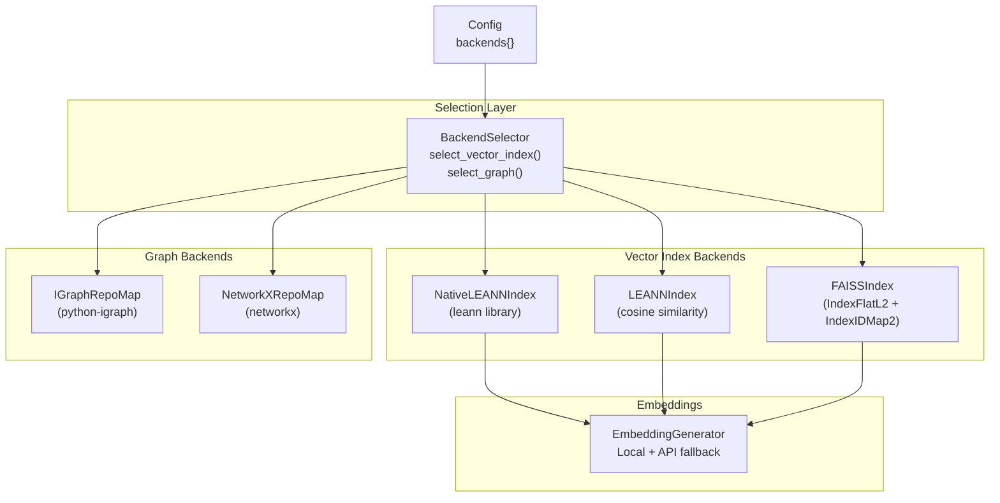
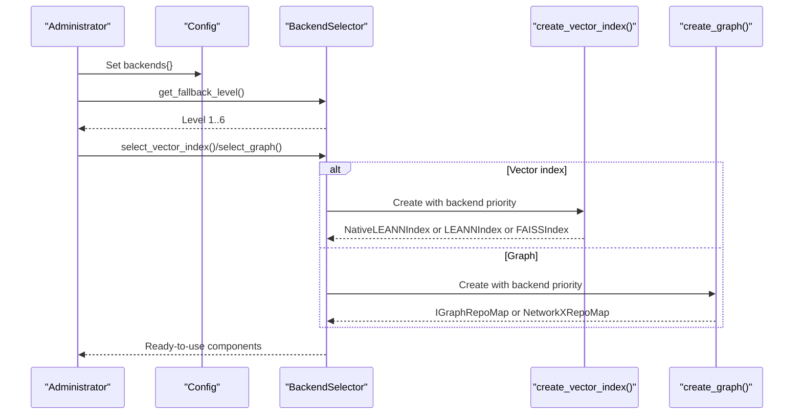
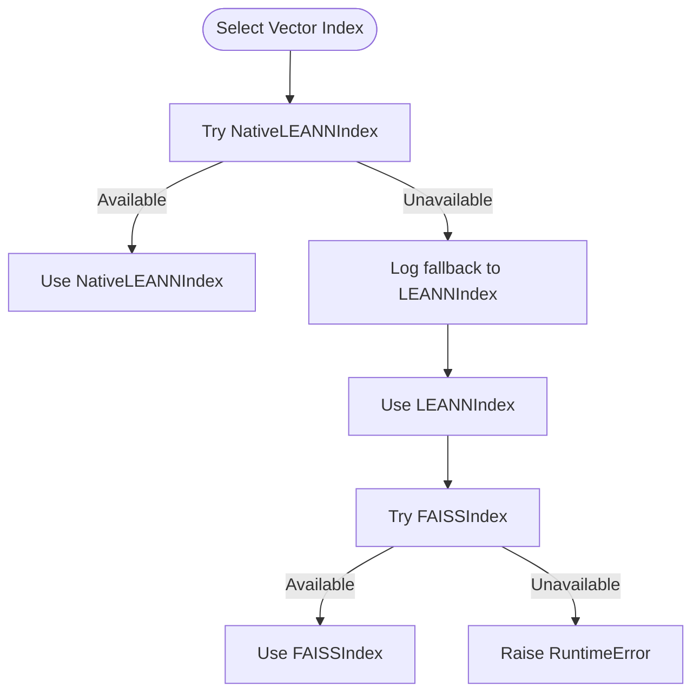
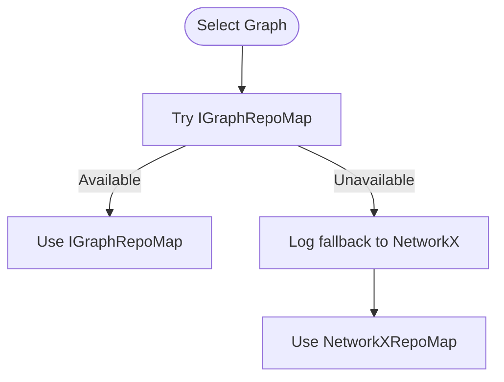
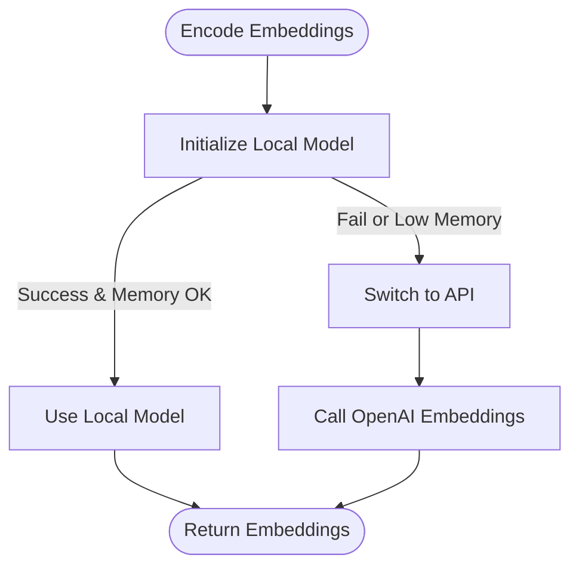
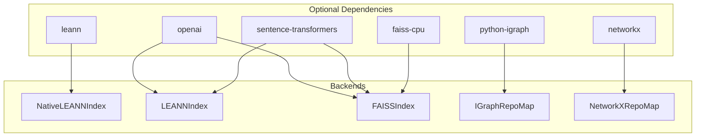

# Fallback Hierarchy Levels

<cite>
**Referenced Files in This Document**
- [backend_selector.py](file://src/ws_ctx_engine/backend_selector/backend_selector.py)
- [graph.py](file://src/ws_ctx_engine/graph/graph.py)
- [vector_index.py](file://src/ws_ctx_engine/vector_index/vector_index.py)
- [leann_index.py](file://src/ws_ctx_engine/vector_index/leann_index.py)
- [config.py](file://src/ws_ctx_engine/config/config.py)
- [indexer.py](file://src/ws_ctx_engine/workflow/indexer.py)
- [logger.py](file://src/ws_ctx_engine/logger/logger.py)
- [test_fallback_scenarios.py](file://tests/integration/test_fallback_scenarios.py)
- [performance.md](file://docs/guides/performance.md)
</cite>

## Table of Contents
1. [Introduction](#introduction)
2. [Project Structure](#project-structure)
3. [Core Components](#core-components)
4. [Architecture Overview](#architecture-overview)
5. [Detailed Component Analysis](#detailed-component-analysis)
6. [Dependency Analysis](#dependency-analysis)
7. [Performance Considerations](#performance-considerations)
8. [Troubleshooting Guide](#troubleshooting-guide)
9. [Conclusion](#conclusion)

## Introduction
This document explains the six-level fallback hierarchy used by the system to automatically select the best available backends for vector indexing, graph construction, and embeddings. It details the specific backend combinations per level, performance characteristics, trade-offs, and criteria for transitioning between levels. Administrators can use this guide to configure the system for optimal performance while ensuring graceful degradation when dependencies are unavailable.

## Project Structure
The fallback logic spans three subsystems:
- Backend selection orchestrator
- Vector index backends (LEANN variants and FAISS)
- Graph backends (igraph and NetworkX)
- Configuration-driven selection and logging of fallback events

**Diagram sources**
- [backend_selector.py:13-191](file://src/ws_ctx_engine/backend_selector/backend_selector.py#L13-L191)
- [vector_index.py:972-1120](file://src/ws_ctx_engine/vector_index/vector_index.py#L972-L1120)
- [leann_index.py:20-297](file://src/ws_ctx_engine/vector_index/leann_index.py#L20-L297)
- [graph.py:572-667](file://src/ws_ctx_engine/graph/graph.py#L572-L667)
- [config.py:74-81](file://src/ws_ctx_engine/config/config.py#L74-L81)

**Section sources**
- [backend_selector.py:13-191](file://src/ws_ctx_engine/backend_selector/backend_selector.py#L13-L191)
- [config.py:74-81](file://src/ws_ctx_engine/config/config.py#L74-L81)

## Core Components
- BackendSelector: Centralized orchestrator that selects backends and logs current configuration and fallback events.
- VectorIndex backends: NativeLEANNIndex (optimal), LEANNIndex (cosine similarity), FAISSIndex (exact search).
- Graph backends: IGraphRepoMap (fast, C++), NetworkXRepoMap (portable, Python).
- EmbeddingGenerator: Local embeddings with automatic API fallback on memory errors or unavailability.

Key behaviors:
- Automatic fallback chains for vector index and graph construction.
- Fallback level computed from configuration values for vector_index, graph, and embeddings.
- Structured logging for fallback events and performance metrics.

**Section sources**
- [backend_selector.py:13-191](file://src/ws_ctx_engine/backend_selector/backend_selector.py#L13-L191)
- [vector_index.py:972-1120](file://src/ws_ctx_engine/vector_index/vector_index.py#L972-L1120)
- [graph.py:572-667](file://src/ws_ctx_engine/graph/graph.py#L572-L667)
- [leann_index.py:20-297](file://src/ws_ctx_engine/vector_index/leann_index.py#L20-L297)
- [logger.py:64-77](file://src/ws_ctx_engine/logger/logger.py#L64-L77)

## Architecture Overview
The fallback hierarchy is driven by configuration and implemented through factory functions and backend classes. The system attempts higher-performance backends first and degrades gracefully when dependencies are missing or fail.

**Diagram sources**
- [backend_selector.py:120-178](file://src/ws_ctx_engine/backend_selector/backend_selector.py#L120-L178)
- [vector_index.py:972-1080](file://src/ws_ctx_engine/vector_index/vector_index.py#L972-L1080)
- [graph.py:572-621](file://src/ws_ctx_engine/graph/graph.py#L572-L621)

## Detailed Component Analysis

### Fallback Level Definitions and Criteria
The system defines six levels of fallback based on configuration values for vector_index, graph, and embeddings. The level determines the combination of backends used.

- Level 1: Optimal
  - Graph: igraph or auto
  - Vector index: native-leann or auto
  - Embeddings: local or auto
  - Storage: 97% savings with NativeLEANN
  - Performance: Fastest for indexing and queries
  - Transition to: None (best level)

- Level 2: Good
  - Graph: NetworkX
  - Vector index: native-leann or auto
  - Embeddings: local or auto
  - Storage: 97% savings with NativeLEANN
  - Performance: Slightly slower than Level 1 due to Python graph backend

- Level 3: Acceptable
  - Graph: NetworkX
  - Vector index: leann
  - Embeddings: local or auto
  - Storage: Reduced storage vs FAISS
  - Performance: Moderate indexing/query performance

- Level 4: Degraded
  - Graph: NetworkX
  - Vector index: faiss
  - Embeddings: local or auto
  - Storage: Higher storage footprint
  - Performance: Slower than Levels 1–3; acceptable for medium repos

- Level 5: Minimal
  - Graph: NetworkX
  - Vector index: faiss
  - Embeddings: api
  - Storage: Highest storage footprint
  - Performance: Slowest due to network latency; use only when local embeddings unavailable

- Level 6: Fallback only
  - Graph: File size ranking (no graph)
  - Vector index: Not applicable
  - Embeddings: Not applicable
  - Use case: Extremely constrained environments; basic file selection by size

Detection logic summary:
- Level 1: graph=auto or igraph AND vector_index=auto or native-leann AND embeddings=auto or local
- Level 2: vector_index=auto or native-leann AND embeddings=auto or local
- Level 3: vector_index=leann AND embeddings=local
- Level 4: vector_index=faiss AND embeddings=local
- Level 5: vector_index=faiss AND embeddings=api
- Level 6: Otherwise (no graph available)

**Section sources**
- [backend_selector.py:120-156](file://src/ws_ctx_engine/backend_selector/backend_selector.py#L120-L156)

### Backend Selection and Fallback Chains

#### Vector Index Backends
- NativeLEANNIndex (optimal): Uses the leann library for 97% storage savings via graph-based selective recomputation. Attempts to create first in auto mode; logs fallback if unavailable.
- LEANNIndex (cosine similarity): Stores file-level embeddings; good balance of performance and portability.
- FAISSIndex (IndexFlatL2 + IndexIDMap2): Exact nearest neighbor search; supports incremental updates; slower than LEANN but widely available.

**Diagram sources**
- [vector_index.py:1031-1080](file://src/ws_ctx_engine/vector_index/vector_index.py#L1031-L1080)
- [leann_index.py:67-83](file://src/ws_ctx_engine/vector_index/leann_index.py#L67-L83)

**Section sources**
- [vector_index.py:972-1120](file://src/ws_ctx_engine/vector_index/vector_index.py#L972-L1120)
- [leann_index.py:20-297](file://src/ws_ctx_engine/vector_index/leann_index.py#L20-L297)

#### Graph Backends
- IGraphRepoMap: Fast PageRank computation using python-igraph (C++ backend). Falls back to NetworkX when unavailable.
- NetworkXRepoMap: Portable PageRank using pure Python; slower than igraph but broadly compatible.

**Diagram sources**
- [graph.py:594-621](file://src/ws_ctx_engine/graph/graph.py#L594-L621)

**Section sources**
- [graph.py:572-667](file://src/ws_ctx_engine/graph/graph.py#L572-L667)

#### Embeddings Backend
- Local embeddings: sentence-transformers model; uses CPU by default.
- API embeddings: OpenAI embeddings; used when local model fails or memory is insufficient.
- Automatic fallback: Triggers when local model import fails, memory errors occur, or API client cannot be initialized.

**Diagram sources**
- [vector_index.py:199-280](file://src/ws_ctx_engine/vector_index/vector_index.py#L199-L280)

**Section sources**
- [vector_index.py:96-280](file://src/ws_ctx_engine/vector_index/vector_index.py#L96-L280)

### Practical Configuration Changes That Trigger Level Transitions
- To reach Level 1: Set vector_index to native-leann or auto, graph to igraph or auto, embeddings to local or auto.
- To reach Level 2: Keep vector_index as native-leann or auto, switch graph to networkx, keep embeddings as local or auto.
- To reach Level 3: Set vector_index to leann, keep graph as networkx, keep embeddings as local.
- To reach Level 4: Set vector_index to faiss, keep graph as networkx, keep embeddings as local.
- To reach Level 5: Set vector_index to faiss, keep graph as networkx, set embeddings to api.
- To reach Level 6: Force graph to networkx or auto (so it falls back to file-size ranking), and disable vector index/embeddings features.

Note: The system resolves auto modes based on availability of dependencies (e.g., leann, faiss-cpu, python-igraph). See CLI validation logic for auto-resolution behavior.

**Section sources**
- [config.py:74-81](file://src/ws_ctx_engine/config/config.py#L74-L81)
- [backend_selector.py:120-156](file://src/ws_ctx_engine/backend_selector/backend_selector.py#L120-L156)
- [cli.py:283-296](file://src/ws_ctx_engine/cli/cli.py#L283-L296)

### Monitoring Indicators for Fallback Events
- BackendSelector logs the current fallback level and configuration on startup or when queried.
- Logger.log_fallback records structured fallback events with component, primary backend, fallback backend, and reason.
- Integration tests demonstrate fallback triggers for both vector index and graph backends.

Examples of logged fallback events:
- Vector index fallback: NativeLEANN → LEANNIndex or LEANNIndex → FAISSIndex
- Graph fallback: igraph → NetworkX
- Embeddings fallback: Local → API

**Section sources**
- [backend_selector.py:158-178](file://src/ws_ctx_engine/backend_selector/backend_selector.py#L158-L178)
- [logger.py:64-77](file://src/ws_ctx_engine/logger/logger.py#L64-L77)
- [test_fallback_scenarios.py:327-467](file://tests/integration/test_fallback_scenarios.py#L327-L467)

## Dependency Analysis
The fallback system relies on optional third-party libraries. Availability determines which backends are attempted first and whether fallbacks are triggered.

**Diagram sources**
- [vector_index.py:1001-1017](file://src/ws_ctx_engine/vector_index/vector_index.py#L1001-L1017)
- [graph.py:115-122](file://src/ws_ctx_engine/graph/graph.py#L115-L122)
- [leann_index.py:73-82](file://src/ws_ctx_engine/vector_index/leann_index.py#L73-L82)

**Section sources**
- [vector_index.py:1001-1017](file://src/ws_ctx_engine/vector_index/vector_index.py#L1001-L1017)
- [graph.py:115-122](file://src/ws_ctx_engine/graph/graph.py#L115-L122)
- [leann_index.py:73-82](file://src/ws_ctx_engine/vector_index/leann_index.py#L73-L82)

## Performance Considerations
- Level 1 (NativeLEANN + igraph + local embeddings) offers the fastest indexing and querying with 97% storage savings.
- Level 2 (NativeLEANN + NetworkX + local embeddings) trades igraph speed for broader compatibility.
- Levels 3–5 degrade in speed and storage efficiency as backends become less optimal.
- Level 6 (file size ranking only) avoids graph computation but loses semantic relevance.

Performance targets observed in tests:
- Indexing and query durations remain within acceptable bounds across fallback backends.
- NetworkX is slower than igraph; FAISS is slower than LEANN for small-to-medium repositories.

Rust extension acceleration:
- Optional Rust hot-path improvements (file walking, hashing, token counting) further reduce overhead when available.

**Section sources**
- [test_fallback_scenarios.py:392-466](file://tests/integration/test_fallback_scenarios.py#L392-L466)
- [performance.md:8-18](file://docs/guides/performance.md#L8-L18)

## Troubleshooting Guide
Common fallback scenarios and resolutions:
- Missing leann: System logs fallback from NativeLEANN to LEANNIndex; install leann to restore Level 1.
- Missing python-igraph: System logs fallback from igraph to NetworkX; install python-igraph for Level 1.
- Out-of-memory with local embeddings: System switches to API embeddings; ensure OPENAI_API_KEY is set.
- Missing faiss-cpu: System logs fallback from FAISS to LEANN; install faiss-cpu for Level 4.

Administrative actions:
- Adjust backends{} in configuration to force desired levels.
- Enable embedding cache to reduce repeated encoding costs.
- Monitor logs for fallback events to diagnose dependency issues.

**Section sources**
- [vector_index.py:1042-1076](file://src/ws_ctx_engine/vector_index/vector_index.py#L1042-L1076)
- [graph.py:594-621](file://src/ws_ctx_engine/graph/graph.py#L594-L621)
- [vector_index.py:234-245](file://src/ws_ctx_engine/vector_index/vector_index.py#L234-L245)
- [indexer.py:197-237](file://src/ws_ctx_engine/workflow/indexer.py#L197-L237)

## Conclusion
The six-level fallback hierarchy ensures reliable operation across diverse environments by automatically selecting the best available backends. Administrators should aim for Level 1 when dependencies permit, monitor fallback events, and tune configuration to achieve the right balance of performance, storage, and portability.