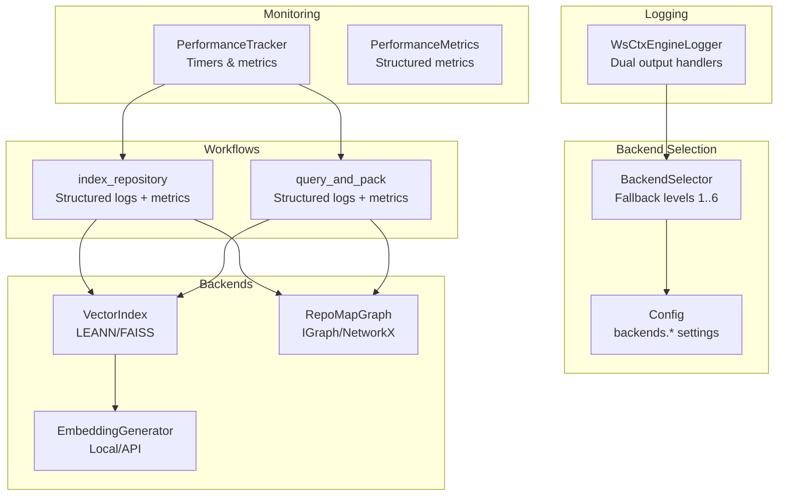
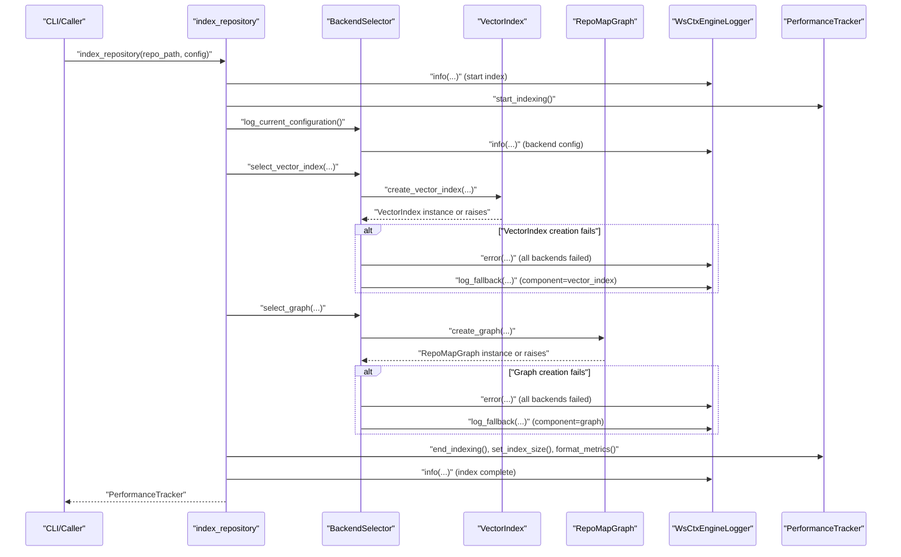
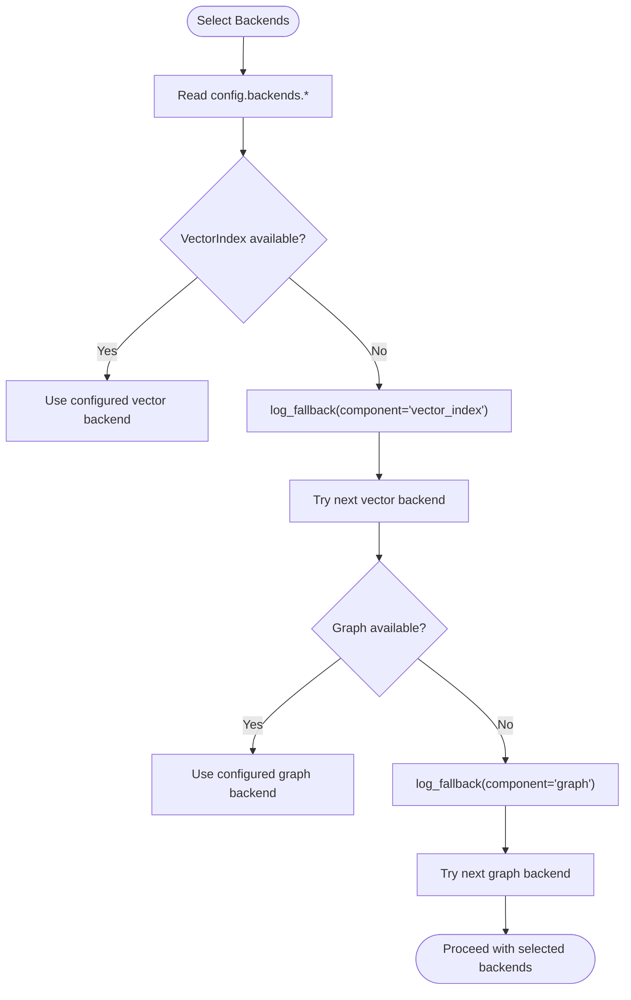
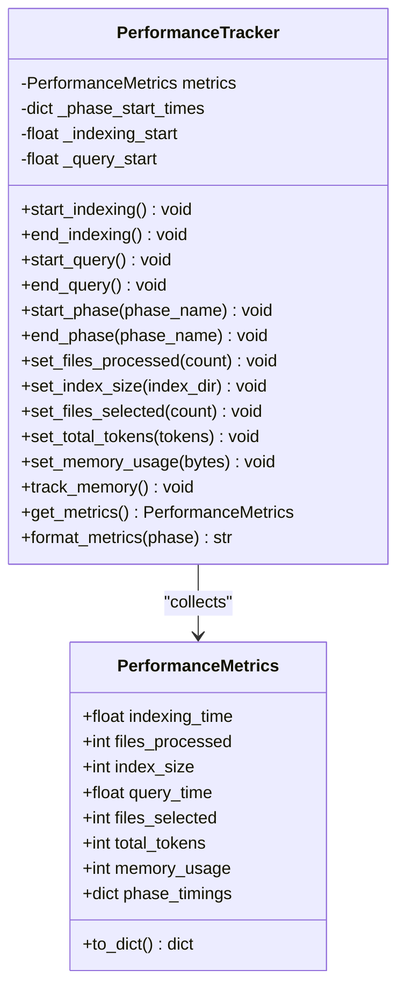
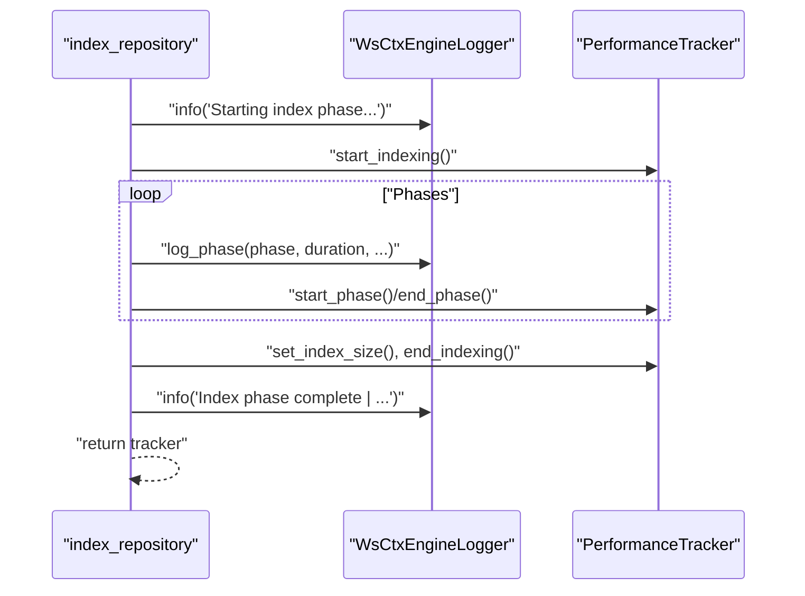
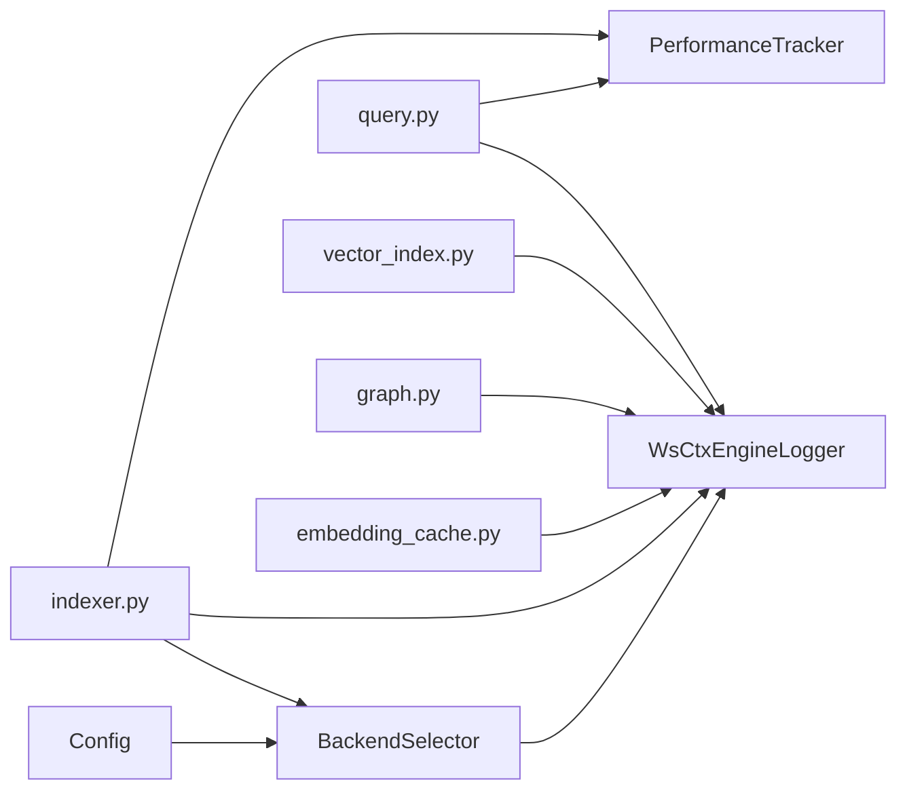

# Logging and Monitoring

<cite>
**Referenced Files in This Document**
- [logger.py](file://src/ws_ctx_engine/logger/logger.py)
- [backend_selector.py](file://src/ws_ctx_engine/backend_selector/backend_selector.py)
- [performance.py](file://src/ws_ctx_engine/monitoring/performance.py)
- [config.py](file://src/ws_ctx_engine/config/config.py)
- [graph.py](file://src/ws_ctx_engine/graph/graph.py)
- [vector_index.py](file://src/ws_ctx_engine/vector_index/vector_index.py)
- [indexer.py](file://src/ws_ctx_engine/workflow/indexer.py)
- [query.py](file://src/ws_ctx_engine/workflow/query.py)
- [embedding_cache.py](file://src/ws_ctx_engine/vector_index/embedding_cache.py)
- [models.py](file://src/ws_ctx_engine/models/models.py)
- [logger_demo.py](file://examples/logger_demo.py)
- [test_logger.py](file://tests/unit/test_logger.py)
- [test_fallback_scenarios.py](file://tests/integration/test_fallback_scenarios.py)
</cite>

## Table of Contents
1. [Introduction](#introduction)
2. [Project Structure](#project-structure)
3. [Core Components](#core-components)
4. [Architecture Overview](#architecture-overview)
5. [Detailed Component Analysis](#detailed-component-analysis)
6. [Dependency Analysis](#dependency-analysis)
7. [Performance Considerations](#performance-considerations)
8. [Troubleshooting Guide](#troubleshooting-guide)
9. [Conclusion](#conclusion)
10. [Appendices](#appendices)

## Introduction
This document describes the logging and monitoring system for backend selection and runtime observability in the engine. It explains how structured logs capture backend availability, selection decisions, fallback events, and performance metrics. It also provides guidance for analyzing logs to troubleshoot backend issues, benchmark performance across tiers, and build automated monitoring dashboards for backend health.

## Project Structure
The logging and monitoring system spans several modules:
- Logging infrastructure: centralized logger with dual output (console and file) and structured message formats
- Backend selection: automatic fallback chains for vector index, graph, and embeddings
- Monitoring: performance metrics collection and reporting for indexing and query phases
- Workflows: index and query phases that emit structured logs and metrics
- Configuration: backend choices and performance tuning options

**Diagram sources**
- [logger.py:13-145](file://src/ws_ctx_engine/logger/logger.py#L13-L145)
- [backend_selector.py:13-191](file://src/ws_ctx_engine/backend_selector/backend_selector.py#L13-L191)
- [performance.py:72-263](file://src/ws_ctx_engine/monitoring/performance.py#L72-L263)
- [indexer.py:72-371](file://src/ws_ctx_engine/workflow/indexer.py#L72-L371)
- [query.py:230-617](file://src/ws_ctx_engine/workflow/query.py#L230-L617)
- [vector_index.py:282-800](file://src/ws_ctx_engine/vector_index/vector_index.py#L282-L800)
- [graph.py:572-667](file://src/ws_ctx_engine/graph/graph.py#L572-L667)

**Section sources**
- [logger.py:13-145](file://src/ws_ctx_engine/logger/logger.py#L13-L145)
- [backend_selector.py:13-191](file://src/ws_ctx_engine/backend_selector/backend_selector.py#L13-L191)
- [performance.py:72-263](file://src/ws_ctx_engine/monitoring/performance.py#L72-L263)
- [indexer.py:72-371](file://src/ws_ctx_engine/workflow/indexer.py#L72-L371)
- [query.py:230-617](file://src/ws_ctx_engine/workflow/query.py#L230-L617)

## Core Components
- WsCtxEngineLogger: dual-output logger with structured format and specialized helpers for fallback, phase completion, and error logging
- BackendSelector: centralizes backend selection with explicit fallback levels and emits structured fallback logs
- PerformanceTracker and PerformanceMetrics: collect and report timing, file counts, index size, token counts, and memory usage
- Workflows: index_repository and query_and_pack orchestrate phases, log progress, and record metrics
- Config: defines backend choices and performance-related toggles that influence logging and monitoring

Key structured log categories:
- Backend configuration and fallback events
- Phase completion with metrics
- Error occurrences with context and stack traces

**Section sources**
- [logger.py:64-125](file://src/ws_ctx_engine/logger/logger.py#L64-L125)
- [backend_selector.py:120-178](file://src/ws_ctx_engine/backend_selector/backend_selector.py#L120-L178)
- [performance.py:13-70](file://src/ws_ctx_engine/monitoring/performance.py#L13-L70)
- [indexer.py:168-371](file://src/ws_ctx_engine/workflow/indexer.py#L168-L371)
- [query.py:310-617](file://src/ws_ctx_engine/workflow/query.py#L310-L617)
- [config.py:74-101](file://src/ws_ctx_engine/config/config.py#L74-L101)

## Architecture Overview
The logging and monitoring architecture integrates tightly with backend selection and workflows:

**Diagram sources**
- [indexer.py:125-371](file://src/ws_ctx_engine/workflow/indexer.py#L125-L371)
- [backend_selector.py:36-119](file://src/ws_ctx_engine/backend_selector/backend_selector.py#L36-L119)
- [logger.py:64-125](file://src/ws_ctx_engine/logger/logger.py#L64-L125)
- [performance.py:95-214](file://src/ws_ctx_engine/monitoring/performance.py#L95-L214)

## Detailed Component Analysis

### Logging Infrastructure
- Dual output handlers: console (INFO+) and file (DEBUG+), with a standardized format
- Specialized helpers:
  - log_fallback(component, primary, fallback, reason): captures backend fallback events
  - log_phase(phase, duration, **metrics): records phase completion with metrics
  - log_error(error, context): logs errors with stack traces and contextual key-value pairs
- Singleton access via get_logger()

Practical usage examples are demonstrated in the demo script and unit tests.

**Section sources**
- [logger.py:13-145](file://src/ws_ctx_engine/logger/logger.py#L13-L145)
- [logger_demo.py:1-36](file://examples/logger_demo.py#L1-L36)
- [test_logger.py:82-180](file://tests/unit/test_logger.py#L82-L180)

### Backend Selection and Fallback Tracking
- BackendSelector determines fallback level (1–6) based on configuration for vector_index, graph, and embeddings
- It logs the current configuration and triggers fallback events when primary backends fail
- Fallback events are emitted using the structured log_fallback format

**Diagram sources**
- [backend_selector.py:120-178](file://src/ws_ctx_engine/backend_selector/backend_selector.py#L120-L178)
- [graph.py:572-621](file://src/ws_ctx_engine/graph/graph.py#L572-L621)
- [vector_index.py:506-647](file://src/ws_ctx_engine/vector_index/vector_index.py#L506-L647)

**Section sources**
- [backend_selector.py:120-178](file://src/ws_ctx_engine/backend_selector/backend_selector.py#L120-L178)
- [graph.py:572-621](file://src/ws_ctx_engine/graph/graph.py#L572-L621)
- [vector_index.py:506-647](file://src/ws_ctx_engine/vector_index/vector_index.py#L506-L647)

### Performance Monitoring and Metrics
- PerformanceTracker measures:
  - Overall indexing and query durations
  - Phase-specific timings
  - Files processed, files selected, total tokens
  - Index size on disk
  - Peak memory usage (when psutil is available)
- PerformanceMetrics provides a serializable snapshot of collected metrics

**Diagram sources**
- [performance.py:13-263](file://src/ws_ctx_engine/monitoring/performance.py#L13-L263)

**Section sources**
- [performance.py:72-263](file://src/ws_ctx_engine/monitoring/performance.py#L72-L263)
- [indexer.py:358-371](file://src/ws_ctx_engine/workflow/indexer.py#L358-L371)
- [query.py:602-617](file://src/ws_ctx_engine/workflow/query.py#L602-L617)

### Workflows: Indexing and Query
- index_repository orchestrates parsing, vector indexing, graph building, metadata saving, and domain map building. It logs phase completions and errors, records metrics, and reports totals.
- query_and_pack loads indexes, retrieves candidates, selects within budget, packs output, and logs metrics.

**Diagram sources**
- [indexer.py:118-371](file://src/ws_ctx_engine/workflow/indexer.py#L118-L371)
- [logger.py:79-94](file://src/ws_ctx_engine/logger/logger.py#L79-L94)
- [performance.py:95-133](file://src/ws_ctx_engine/monitoring/performance.py#L95-L133)

**Section sources**
- [indexer.py:118-371](file://src/ws_ctx_engine/workflow/indexer.py#L118-L371)
- [query.py:291-617](file://src/ws_ctx_engine/workflow/query.py#L291-L617)

### Embeddings and API Fallback Logging
- EmbeddingGenerator attempts local embeddings and falls back to API when memory constraints or failures occur. It logs fallback events with component, primary, fallback, and reason.

**Section sources**
- [vector_index.py:199-251](file://src/ws_ctx_engine/vector_index/vector_index.py#L199-L251)
- [vector_index.py:253-280](file://src/ws_ctx_engine/vector_index/vector_index.py#L253-L280)

### Configuration Impact on Logging and Monitoring
- Config.backends controls backend selection and influences fallback level and logs
- Config.embeddings affects embedding generation and may trigger API fallback logs
- Config.performance toggles caching and incremental indexing, impacting metrics and logs

**Section sources**
- [config.py:74-101](file://src/ws_ctx_engine/config/config.py#L74-L101)
- [config.py:192-215](file://src/ws_ctx_engine/config/config.py#L192-L215)

## Dependency Analysis
- Logger is used pervasively across modules for structured logging
- BackendSelector depends on Config and uses logger for fallback and configuration logs
- Workflows depend on BackendSelector and logger for phase and error logs; they also depend on PerformanceTracker for metrics
- VectorIndex and Graph implementations use logger for fallback and operational logs
- EmbeddingCache uses standard logging to report cache load/save status

**Diagram sources**
- [config.py:74-101](file://src/ws_ctx_engine/config/config.py#L74-L101)
- [backend_selector.py:26-34](file://src/ws_ctx_engine/backend_selector/backend_selector.py#L26-L34)
- [indexer.py:125-127](file://src/ws_ctx_engine/workflow/indexer.py#L125-L127)
- [query.py:288-290](file://src/ws_ctx_engine/workflow/query.py#L288-L290)
- [vector_index.py:124-125](file://src/ws_ctx_engine/vector_index/vector_index.py#L124-L125)
- [graph.py:16-16](file://src/ws_ctx_engine/graph/graph.py#L16-L16)
- [embedding_cache.py:25-25](file://src/ws_ctx_engine/vector_index/embedding_cache.py#L25-L25)

**Section sources**
- [config.py:74-101](file://src/ws_ctx_engine/config/config.py#L74-L101)
- [backend_selector.py:26-34](file://src/ws_ctx_engine/backend_selector/backend_selector.py#L26-L34)
- [indexer.py:125-127](file://src/ws_ctx_engine/workflow/indexer.py#L125-L127)
- [query.py:288-290](file://src/ws_ctx_engine/workflow/query.py#L288-L290)
- [vector_index.py:124-125](file://src/ws_ctx_engine/vector_index/vector_index.py#L124-L125)
- [graph.py:16-16](file://src/ws_ctx_engine/graph/graph.py#L16-L16)
- [embedding_cache.py:25-25](file://src/ws_ctx_engine/vector_index/embedding_cache.py#L25-L25)

## Performance Considerations
- Use PerformanceTracker to measure end-to-end indexing and query durations
- Track phase-specific timings to identify bottlenecks
- Monitor index size growth and memory usage to assess storage and resource needs
- Enable incremental indexing and embedding cache to reduce rebuild times

[No sources needed since this section provides general guidance]

## Troubleshooting Guide

### Interpreting Structured Logs
- Backend configuration logs include fallback level and backend choices
- Fallback logs include component, primary backend, fallback backend, and reason
- Phase logs include phase name, duration, and additional metrics
- Error logs include context key-value pairs and stack traces

Examples of log analysis:
- Backend fallback: locate warnings indicating component, primary, fallback, and reason
- Phase performance: compare durations across phases to identify slow steps
- Errors: use context fields and stack traces to pinpoint failing components

**Section sources**
- [logger.py:64-125](file://src/ws_ctx_engine/logger/logger.py#L64-L125)
- [indexer.py:168-176](file://src/ws_ctx_engine/workflow/indexer.py#L168-L176)
- [query.py:317-322](file://src/ws_ctx_engine/workflow/query.py#L317-L322)

### Diagnosing Backend Issues
- If vector index creation fails, check fallback logs and configuration for vector_index backend
- If graph creation fails, check fallback logs and configuration for graph backend
- If embeddings fail due to memory, look for API fallback logs and adjust device/batch_size

**Section sources**
- [backend_selector.py:70-80](file://src/ws_ctx_engine/backend_selector/backend_selector.py#L70-L80)
- [backend_selector.py:104-109](file://src/ws_ctx_engine/backend_selector/backend_selector.py#L104-L109)
- [vector_index.py:235-245](file://src/ws_ctx_engine/vector_index/vector_index.py#L235-L245)

### Automated Monitoring Dashboards
- Use structured logs to build dashboards tracking:
  - Fallback frequency per component
  - Phase durations over time
  - Error rates and error distribution
- Use PerformanceTracker metrics to monitor:
  - Index size growth
  - Token counts and budget utilization
  - Peak memory usage trends

[No sources needed since this section provides general guidance]

## Conclusion
The logging and monitoring system provides a robust, structured approach to backend selection observability and performance tracking. By leveraging structured logs and metrics, teams can quickly diagnose backend issues, benchmark performance across tiers, and operate reliable automated monitoring systems.

[No sources needed since this section summarizes without analyzing specific files]

## Appendices

### Log Message Reference
- Backend configuration: "Backend configuration | level=<N> | description=... | vector_index=... | graph=... | embeddings=..."
- Fallback event: "Fallback triggered | component=<name> | primary=<backend> | fallback=<backend> | reason=<msg>"
- Phase completion: "Phase complete | phase=<name> | duration=<s>s | <metrics...>"
- Error occurrence: "Error occurred | <context...>", with stack trace

**Section sources**
- [backend_selector.py:171-177](file://src/ws_ctx_engine/backend_selector/backend_selector.py#L171-L177)
- [logger.py:64-108](file://src/ws_ctx_engine/logger/logger.py#L64-L108)

### Example Workflows and Tests
- Demo script demonstrates logger usage for fallback, phase logs, and error logging
- Unit tests validate structured log format and fallback/error logging behavior
- Integration tests exercise fallback scenarios and validate graceful degradation

**Section sources**
- [logger_demo.py:1-36](file://examples/logger_demo.py#L1-L36)
- [test_logger.py:82-180](file://tests/unit/test_logger.py#L82-L180)
- [test_fallback_scenarios.py:327-467](file://tests/integration/test_fallback_scenarios.py#L327-L467)