# Component Interaction Patterns

<cite>
**Referenced Files in This Document**
- [__init__.py](file://src/ws_ctx_engine/__init__.py)
- [init_cli.py](file://src/ws_ctx_engine/init_cli.py)
- [cli.py](file://src/ws_ctx_engine/cli/cli.py)
- [cli/__main__.py](file://src/ws_ctx_engine/cli/__main__.py)
- [workflow/__init__.py](file://src/ws_ctx_engine/workflow/__init__.py)
- [workflow/indexer.py](file://src/ws_ctx_engine/workflow/indexer.py)
- [workflow/query.py](file://src/ws_ctx_engine/workflow/query.py)
- [chunker/__init__.py](file://src/ws_ctx_engine/chunker/__init__.py)
- [backend_selector/backend_selector.py](file://src/ws_ctx_engine/backend_selector/backend_selector.py)
- [vector_index/__init__.py](file://src/ws_ctx_engine/vector_index/__init__.py)
- [graph/graph.py](file://src/ws_ctx_engine/graph/graph.py)
- [retrieval/retrieval.py](file://src/ws_ctx_engine/retrieval/retrieval.py)
- [budget/budget.py](file://src/ws_ctx_engine/budget/budget.py)
- [logger/logger.py](file://src/ws_ctx_engine/logger/logger.py)
- [packer/__init__.py](file://src/ws_ctx_engine/packer/__init__.py)
</cite>

## Table of Contents
1. [Introduction](#introduction)
2. [Project Structure](#project-structure)
3. [Core Components](#core-components)
4. [Architecture Overview](#architecture-overview)
5. [Detailed Component Analysis](#detailed-component-analysis)
6. [Dependency Analysis](#dependency-analysis)
7. [Performance Considerations](#performance-considerations)
8. [Troubleshooting Guide](#troubleshooting-guide)
9. [Conclusion](#conclusion)

## Introduction
This document explains the component interaction patterns and module dependency management in ws-ctx-engine. It focuses on how the CLI, workflow engine, chunker, vector index, graph engine, and packer modules collaborate. It also documents data flow patterns, event propagation, and communication mechanisms, including the observer pattern for logging and monitoring, the strategy pattern for backend selection, and the factory pattern for component creation. Finally, it covers the module initialization sequence, shared resource management, and error propagation strategies across the component hierarchy.

## Project Structure
The ws-ctx-engine package organizes functionality by feature domains:
- CLI: user-facing commands and orchestration
- Workflow: index and query phases
- Chunker: code parsing and chunk extraction
- Backend selector: strategy-driven backend selection
- Vector index: embedding and similarity search
- Graph: structural ranking via PageRank
- Retrieval: hybrid ranking engine
- Budget: token-aware file selection
- Packer: output packaging
- Logger and monitoring: structured logging and performance tracking

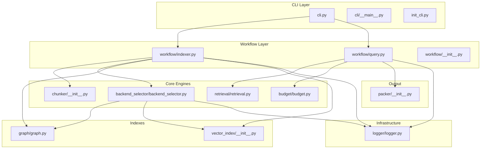

**Diagram sources**
- [cli.py:1-1656](file://src/ws_ctx_engine/cli/cli.py#L1-L1656)
- [cli/__main__.py:1-5](file://src/ws_ctx_engine/cli/__main__.py#L1-L5)
- [init_cli.py:1-24](file://src/ws_ctx_engine/init_cli.py#L1-L24)
- [workflow/indexer.py:1-493](file://src/ws_ctx_engine/workflow/indexer.py#L1-L493)
- [workflow/query.py:1-617](file://src/ws_ctx_engine/workflow/query.py#L1-L617)
- [workflow/__init__.py:1-5](file://src/ws_ctx_engine/workflow/__init__.py#L1-L5)
- [chunker/__init__.py:1-55](file://src/ws_ctx_engine/chunker/__init__.py#L1-L55)
- [backend_selector/backend_selector.py:1-191](file://src/ws_ctx_engine/backend_selector/backend_selector.py#L1-L191)
- [graph/graph.py:1-667](file://src/ws_ctx_engine/graph/graph.py#L1-L667)
- [vector_index/__init__.py:1-24](file://src/ws_ctx_engine/vector_index/__init__.py#L1-L24)
- [retrieval/retrieval.py:1-627](file://src/ws_ctx_engine/retrieval/retrieval.py#L1-L627)
- [budget/budget.py:1-105](file://src/ws_ctx_engine/budget/budget.py#L1-L105)
- [logger/logger.py:1-145](file://src/ws_ctx_engine/logger/logger.py#L1-L145)
- [packer/__init__.py:1-9](file://src/ws_ctx_engine/packer/__init__.py#L1-L9)

**Section sources**
- [__init__.py:1-33](file://src/ws_ctx_engine/__init__.py#L1-L33)
- [cli.py:1-1656](file://src/ws_ctx_engine/cli/cli.py#L1-L1656)
- [workflow/indexer.py:1-493](file://src/ws_ctx_engine/workflow/indexer.py#L1-L493)
- [workflow/query.py:1-617](file://src/ws_ctx_engine/workflow/query.py#L1-L617)

## Core Components
- CLI: Provides commands for indexing, searching, querying, and running the MCP server. Orchestrates workflow execution and manages runtime dependencies and logging.
- Workflow indexer: Builds and persists indexes (vector and graph) and metadata for incremental querying.
- Workflow query: Loads indexes, retrieves candidates with hybrid ranking, selects files within budget, and packs output.
- Chunker: Parses codebases into chunks with fallback strategies.
- Backend selector: Centralized strategy for selecting vector index, graph, and embeddings backends with graceful fallback.
- Vector index: Abstractions and factories for embedding generation and similarity search backends.
- Graph: Abstractions and factories for RepoMap graph construction and PageRank computation.
- Retrieval: Hybrid ranking combining semantic and structural signals.
- Budget: Greedy selection constrained by token budgets.
- Packer: Output packaging into XML, ZIP, or structured formats.
- Logger: Structured logging with dual console/file output and fallback/phase/error logging hooks.

**Section sources**
- [cli.py:1-1656](file://src/ws_ctx_engine/cli/cli.py#L1-L1656)
- [workflow/indexer.py:1-493](file://src/ws_ctx_engine/workflow/indexer.py#L1-L493)
- [workflow/query.py:1-617](file://src/ws_ctx_engine/workflow/query.py#L1-L617)
- [chunker/__init__.py:1-55](file://src/ws_ctx_engine/chunker/__init__.py#L1-L55)
- [backend_selector/backend_selector.py:1-191](file://src/ws_ctx_engine/backend_selector/backend_selector.py#L1-L191)
- [vector_index/__init__.py:1-24](file://src/ws_ctx_engine/vector_index/__init__.py#L1-L24)
- [graph/graph.py:1-667](file://src/ws_ctx_engine/graph/graph.py#L1-L667)
- [retrieval/retrieval.py:1-627](file://src/ws_ctx_engine/retrieval/retrieval.py#L1-L627)
- [budget/budget.py:1-105](file://src/ws_ctx_engine/budget/budget.py#L1-L105)
- [packer/__init__.py:1-9](file://src/ws_ctx_engine/packer/__init__.py#L1-L9)
- [logger/logger.py:1-145](file://src/ws_ctx_engine/logger/logger.py#L1-L145)

## Architecture Overview
The system follows a layered architecture:
- CLI layer validates inputs, sets up logging, and invokes workflow functions.
- Workflow layer orchestrates index and query phases, coordinating chunking, backend selection, and index persistence/loading.
- Engines layer encapsulates domain-specific logic: chunking, retrieval, budgeting, and packing.
- Infrastructure layer provides logging and monitoring utilities.

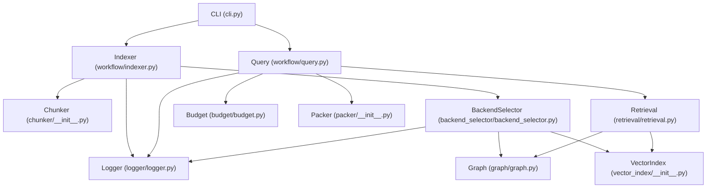

**Diagram sources**
- [cli.py:1-1656](file://src/ws_ctx_engine/cli/cli.py#L1-L1656)
- [workflow/indexer.py:1-493](file://src/ws_ctx_engine/workflow/indexer.py#L1-L493)
- [workflow/query.py:1-617](file://src/ws_ctx_engine/workflow/query.py#L1-L617)
- [chunker/__init__.py:1-55](file://src/ws_ctx_engine/chunker/__init__.py#L1-L55)
- [backend_selector/backend_selector.py:1-191](file://src/ws_ctx_engine/backend_selector/backend_selector.py#L1-L191)
- [vector_index/__init__.py:1-24](file://src/ws_ctx_engine/vector_index/__init__.py#L1-L24)
- [graph/graph.py:1-667](file://src/ws_ctx_engine/graph/graph.py#L1-L667)
- [retrieval/retrieval.py:1-627](file://src/ws_ctx_engine/retrieval/retrieval.py#L1-L627)
- [budget/budget.py:1-105](file://src/ws_ctx_engine/budget/budget.py#L1-L105)
- [packer/__init__.py:1-9](file://src/ws_ctx_engine/packer/__init__.py#L1-L9)
- [logger/logger.py:1-145](file://src/ws_ctx_engine/logger/logger.py#L1-L145)

## Detailed Component Analysis

### CLI Orchestration and Event Propagation
- The CLI initializes Typer, Rich console, and a global logger. It exposes commands for indexing, searching, querying, and running the MCP server.
- Commands validate inputs, enforce runtime dependency checks, and emit structured NDJSON in agent mode.
- Logging events propagate through the global logger to capture phase timings, fallbacks, and errors.

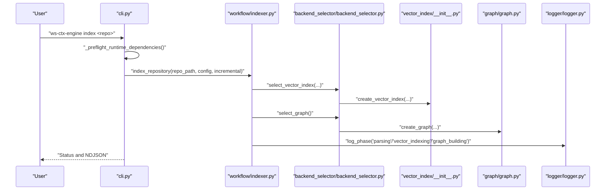

**Diagram sources**
- [cli.py:1-1656](file://src/ws_ctx_engine/cli/cli.py#L1-L1656)
- [workflow/indexer.py:1-493](file://src/ws_ctx_engine/workflow/indexer.py#L1-L493)
- [backend_selector/backend_selector.py:1-191](file://src/ws_ctx_engine/backend_selector/backend_selector.py#L1-L191)
- [vector_index/__init__.py:1-24](file://src/ws_ctx_engine/vector_index/__init__.py#L1-L24)
- [graph/graph.py:1-667](file://src/ws_ctx_engine/graph/graph.py#L1-L667)
- [logger/logger.py:1-145](file://src/ws_ctx_engine/logger/logger.py#L1-L145)

**Section sources**
- [cli.py:1-1656](file://src/ws_ctx_engine/cli/cli.py#L1-L1656)
- [logger/logger.py:1-145](file://src/ws_ctx_engine/logger/logger.py#L1-L145)

### Workflow Index Phase
- Parses codebase with AST chunker and fallback.
- Builds vector index with backend selection and optional incremental updates.
- Builds RepoMap graph with backend selection.
- Persists indexes and metadata for staleness detection.
- Tracks performance and logs phase metrics.

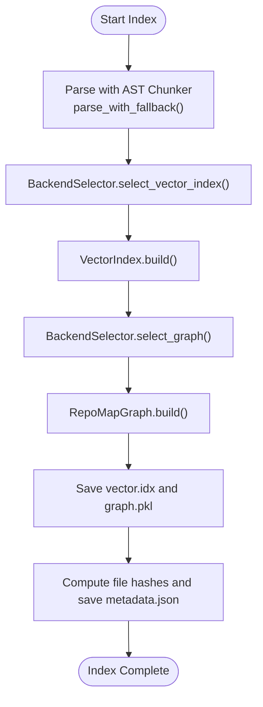

**Diagram sources**
- [workflow/indexer.py:1-493](file://src/ws_ctx_engine/workflow/indexer.py#L1-L493)
- [chunker/__init__.py:1-55](file://src/ws_ctx_engine/chunker/__init__.py#L1-L55)
- [backend_selector/backend_selector.py:1-191](file://src/ws_ctx_engine/backend_selector/backend_selector.py#L1-L191)
- [vector_index/__init__.py:1-24](file://src/ws_ctx_engine/vector_index/__init__.py#L1-L24)
- [graph/graph.py:1-667](file://src/ws_ctx_engine/graph/graph.py#L1-L667)

**Section sources**
- [workflow/indexer.py:1-493](file://src/ws_ctx_engine/workflow/indexer.py#L1-L493)
- [chunker/__init__.py:1-55](file://src/ws_ctx_engine/chunker/__init__.py#L1-L55)

### Workflow Query Phase
- Loads persisted indexes with staleness detection and auto-rebuild.
- Builds a RetrievalEngine with vector index and graph.
- Retrieves candidates with hybrid ranking, applies domain/path/symbol boosts, and penalizes test files.
- Selects files within token budget and packs output in configured format.

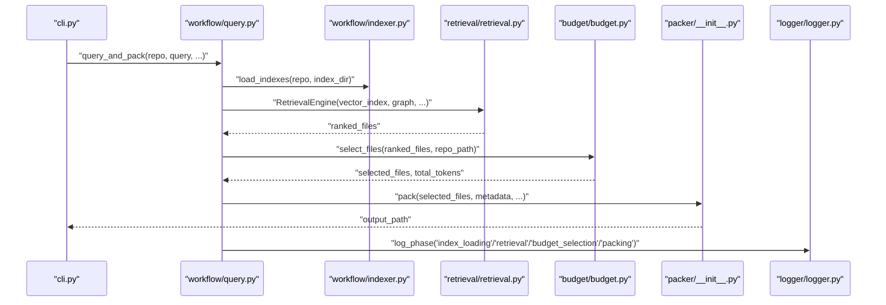

**Diagram sources**
- [workflow/query.py:1-617](file://src/ws_ctx_engine/workflow/query.py#L1-L617)
- [workflow/indexer.py:1-493](file://src/ws_ctx_engine/workflow/indexer.py#L1-L493)
- [retrieval/retrieval.py:1-627](file://src/ws_ctx_engine/retrieval/retrieval.py#L1-L627)
- [budget/budget.py:1-105](file://src/ws_ctx_engine/budget/budget.py#L1-L105)
- [packer/__init__.py:1-9](file://src/ws_ctx_engine/packer/__init__.py#L1-L9)
- [logger/logger.py:1-145](file://src/ws_ctx_engine/logger/logger.py#L1-L145)

**Section sources**
- [workflow/query.py:1-617](file://src/ws_ctx_engine/workflow/query.py#L1-L617)
- [retrieval/retrieval.py:1-627](file://src/ws_ctx_engine/retrieval/retrieval.py#L1-L627)
- [budget/budget.py:1-105](file://src/ws_ctx_engine/budget/budget.py#L1-L105)

### Backend Selection Strategy Pattern
- BackendSelector centralizes backend selection for vector index, graph, and embeddings.
- Uses configuration-driven fallback chains to choose optimal backends with graceful degradation.
- Emits structured logs for fallback events and logs current configuration level.

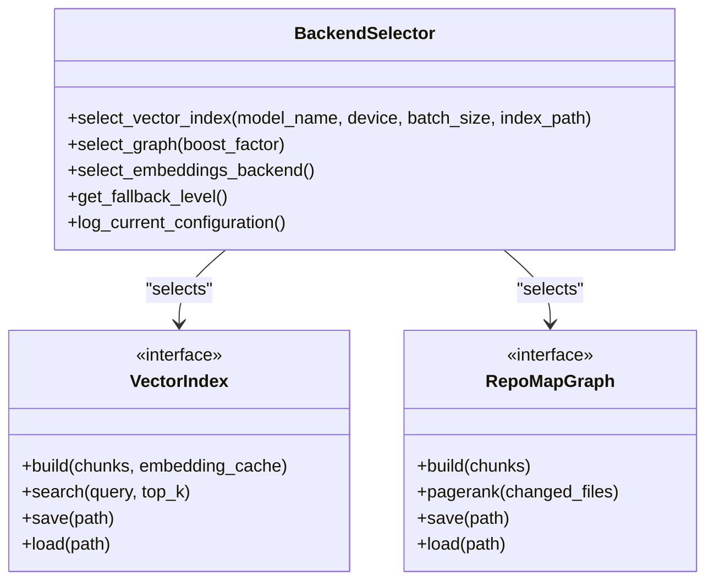

**Diagram sources**
- [backend_selector/backend_selector.py:1-191](file://src/ws_ctx_engine/backend_selector/backend_selector.py#L1-L191)
- [vector_index/__init__.py:1-24](file://src/ws_ctx_engine/vector_index/__init__.py#L1-L24)
- [graph/graph.py:1-667](file://src/ws_ctx_engine/graph/graph.py#L1-L667)

**Section sources**
- [backend_selector/backend_selector.py:1-191](file://src/ws_ctx_engine/backend_selector/backend_selector.py#L1-L191)
- [graph/graph.py:1-667](file://src/ws_ctx_engine/graph/graph.py#L1-L667)
- [vector_index/__init__.py:1-24](file://src/ws_ctx_engine/vector_index/__init__.py#L1-L24)

### Chunker Fallback Factory Pattern
- The chunker module exports a factory function that attempts TreeSitter-based parsing and falls back to Regex-based parsing if unavailable or failing.
- This pattern encapsulates creation logic and provides robustness against missing native dependencies.

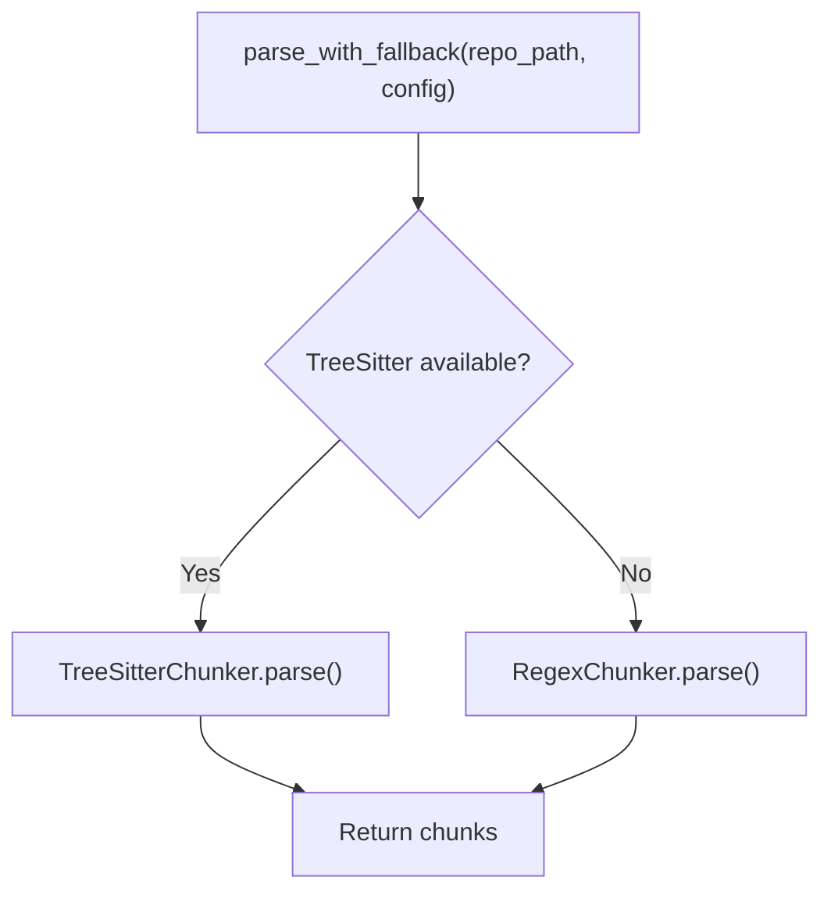

**Diagram sources**
- [chunker/__init__.py:1-55](file://src/ws_ctx_engine/chunker/__init__.py#L1-L55)

**Section sources**
- [chunker/__init__.py:1-55](file://src/ws_ctx_engine/chunker/__init__.py#L1-L55)

### Retrieval Engine Hybrid Ranking
- Combines semantic similarity and PageRank scores with additional signals (symbol matches, path keywords, domain alignment, test penalties).
- Applies adaptive boosting based on query classification and normalizes final scores.

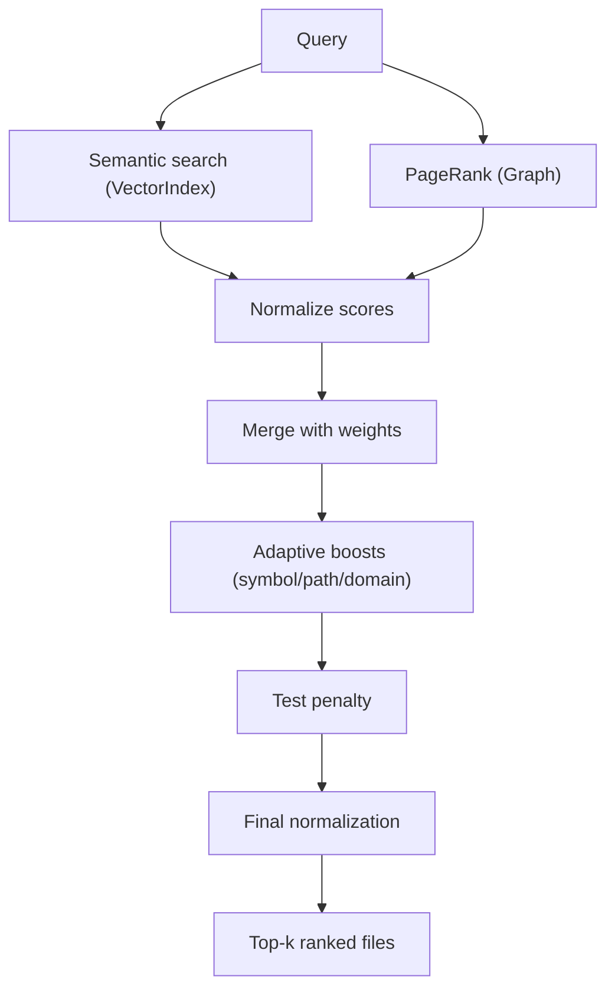

**Diagram sources**
- [retrieval/retrieval.py:1-627](file://src/ws_ctx_engine/retrieval/retrieval.py#L1-L627)
- [vector_index/__init__.py:1-24](file://src/ws_ctx_engine/vector_index/__init__.py#L1-L24)
- [graph/graph.py:1-667](file://src/ws_ctx_engine/graph/graph.py#L1-L667)

**Section sources**
- [retrieval/retrieval.py:1-627](file://src/ws_ctx_engine/retrieval/retrieval.py#L1-L627)

### Budget Manager Greedy Selection
- Implements a greedy knapsack algorithm to select files within a token budget, reserving headroom for metadata.

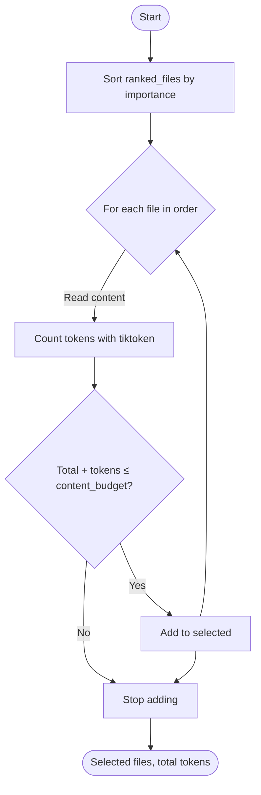

**Diagram sources**
- [budget/budget.py:1-105](file://src/ws_ctx_engine/budget/budget.py#L1-L105)

**Section sources**
- [budget/budget.py:1-105](file://src/ws_ctx_engine/budget/budget.py#L1-L105)

### Observer Pattern for Logging and Monitoring
- WsCtxEngineLogger provides structured logging with dual handlers (console and file) and specialized methods for fallbacks, phase completion, and error reporting.
- Components log events through the global logger, enabling cross-cutting observability and error propagation.

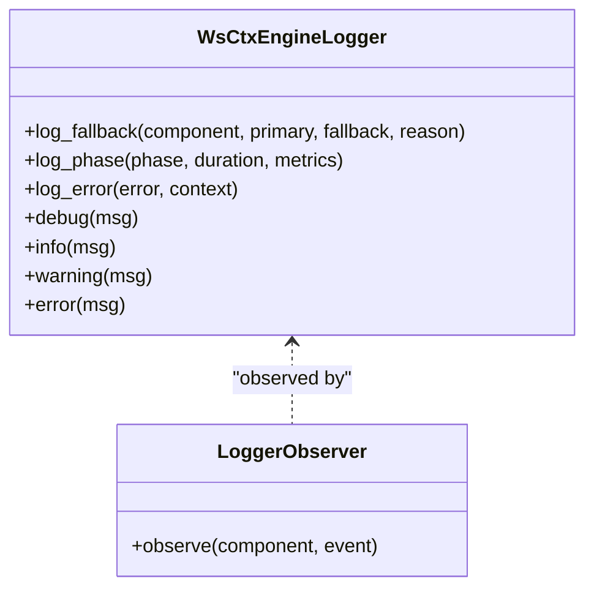

**Diagram sources**
- [logger/logger.py:1-145](file://src/ws_ctx_engine/logger/logger.py#L1-L145)

**Section sources**
- [logger/logger.py:1-145](file://src/ws_ctx_engine/logger/logger.py#L1-L145)

## Dependency Analysis
- CLI depends on workflow modules and the logger. It also depends on the MCP server entrypoint for agent scenarios.
- Workflow indexer depends on chunker, backend selector, graph, and vector index modules. It logs phases and tracks performance.
- Workflow query depends on retrieval, budget, packer, and domain map utilities. It loads indexes and orchestrates packing.
- Backend selector depends on configuration, graph, and vector index factories.
- Retrieval engine depends on vector index and graph abstractions.
- Budget manager depends on tiktoken for token counting.
- Packer re-exports XML and ZIP packers for convenience.

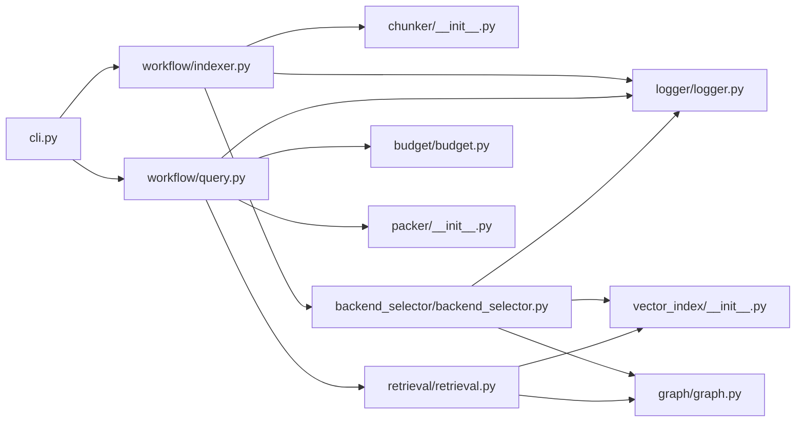

**Diagram sources**
- [cli.py:1-1656](file://src/ws_ctx_engine/cli/cli.py#L1-L1656)
- [workflow/indexer.py:1-493](file://src/ws_ctx_engine/workflow/indexer.py#L1-L493)
- [workflow/query.py:1-617](file://src/ws_ctx_engine/workflow/query.py#L1-L617)
- [chunker/__init__.py:1-55](file://src/ws_ctx_engine/chunker/__init__.py#L1-L55)
- [backend_selector/backend_selector.py:1-191](file://src/ws_ctx_engine/backend_selector/backend_selector.py#L1-L191)
- [graph/graph.py:1-667](file://src/ws_ctx_engine/graph/graph.py#L1-L667)
- [vector_index/__init__.py:1-24](file://src/ws_ctx_engine/vector_index/__init__.py#L1-L24)
- [retrieval/retrieval.py:1-627](file://src/ws_ctx_engine/retrieval/retrieval.py#L1-L627)
- [budget/budget.py:1-105](file://src/ws_ctx_engine/budget/budget.py#L1-L105)
- [packer/__init__.py:1-9](file://src/ws_ctx_engine/packer/__init__.py#L1-L9)
- [logger/logger.py:1-145](file://src/ws_ctx_engine/logger/logger.py#L1-L145)

**Section sources**
- [workflow/__init__.py:1-5](file://src/ws_ctx_engine/workflow/__init__.py#L1-L5)
- [__init__.py:1-33](file://src/ws_ctx_engine/__init__.py#L1-L33)

## Performance Considerations
- Incremental indexing: The indexer detects changed/deleted files and updates only affected parts when possible, reducing rebuild time.
- Embedding cache: During indexing, embedding caches can be reused to avoid recomputing unchanged files.
- Memory tracking: PerformanceTracker records memory usage across phases to identify hotspots.
- Fallback strategies: Choosing lighter backends (e.g., NetworkX, FAISS CPU) reduces latency when native libraries are unavailable.
- Output pre-processing: Compression and session-level deduplication reduce output size and token usage.

[No sources needed since this section provides general guidance]

## Troubleshooting Guide
- Dependency doctor: The CLI provides a doctor command to check optional dependencies and recommend installation profiles.
- Runtime dependency preflight: Commands validate required packages and environment variables before execution, raising actionable errors.
- Error logging: Components log structured errors with context and stack traces via the global logger.
- Fallback logging: When backends fail, the logger emits fallback events with component, primary, fallback, and reason details.
- Index staleness: Query phase automatically rebuilds stale indexes if detected, ensuring reliable retrieval.

**Section sources**
- [cli.py:1-1656](file://src/ws_ctx_engine/cli/cli.py#L1-L1656)
- [logger/logger.py:1-145](file://src/ws_ctx_engine/logger/logger.py#L1-L145)
- [workflow/indexer.py:1-493](file://src/ws_ctx_engine/workflow/indexer.py#L1-L493)
- [workflow/query.py:1-617](file://src/ws_ctx_engine/workflow/query.py#L1-L617)

## Conclusion
ws-ctx-engine coordinates multiple modules through clear separation of concerns:
- CLI orchestrates workflows and enforces runtime checks.
- Workflow modules manage index and query phases with robust fallbacks.
- Engines encapsulate domain logic with standardized interfaces.
- Infrastructure supports observability and error propagation.
The strategy pattern in backend selection, the factory pattern in chunking, and the observer pattern in logging collectively enable maintainability, resilience, and performance across diverse environments.