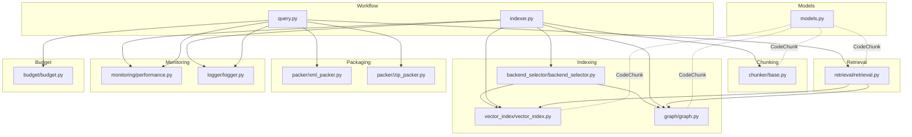
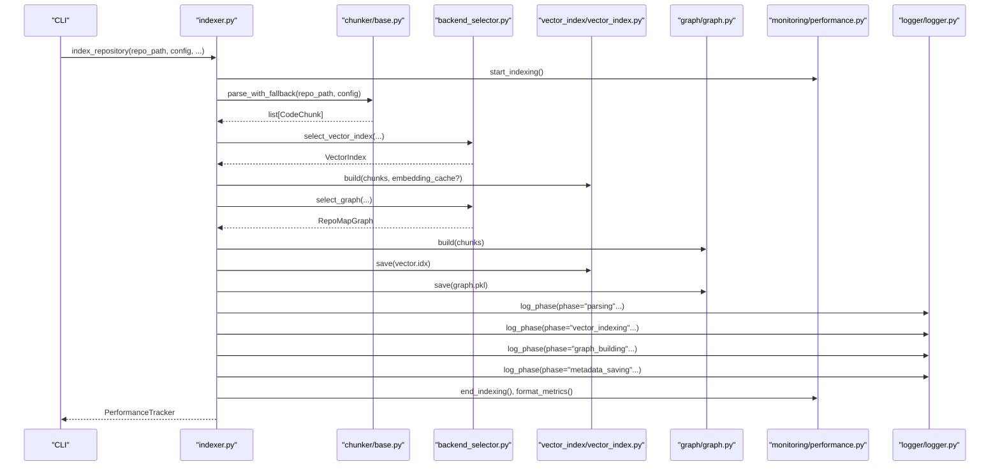
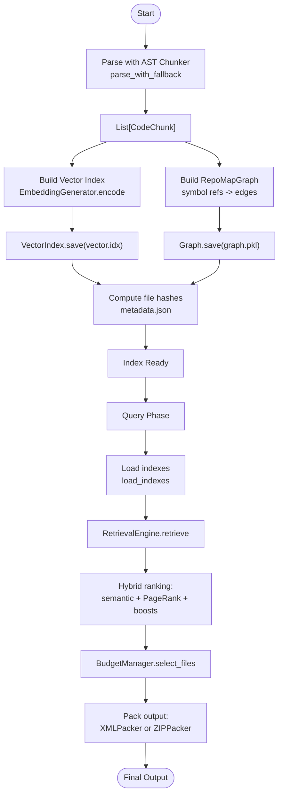
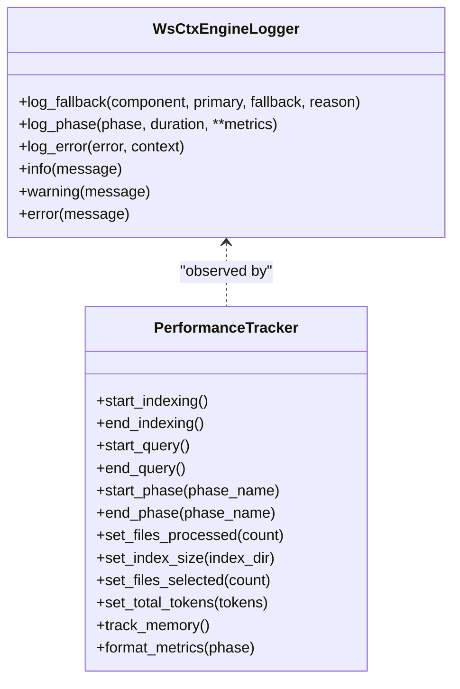
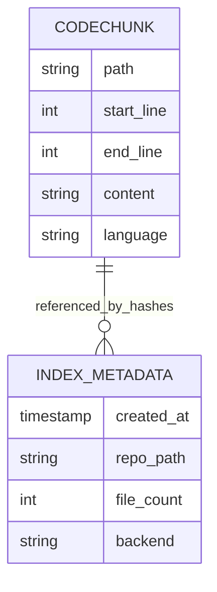
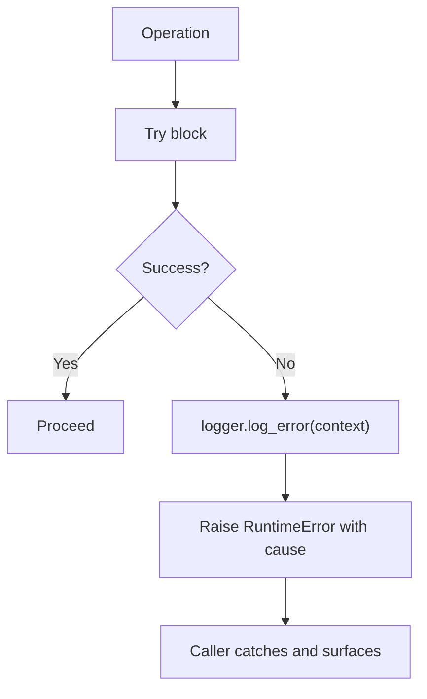
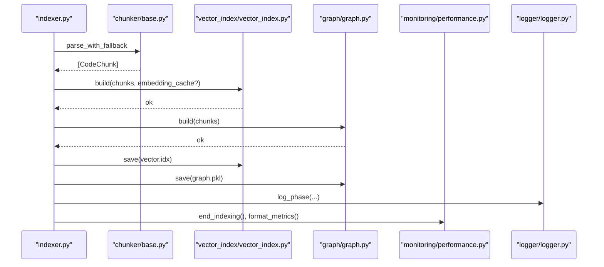
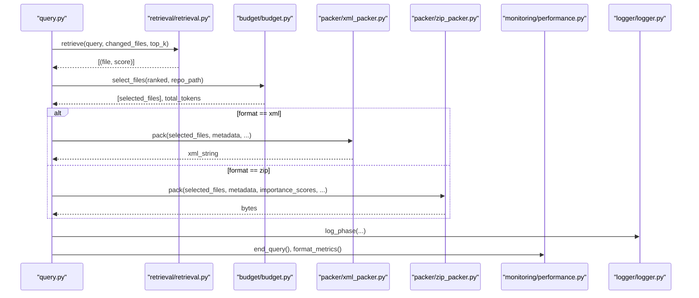
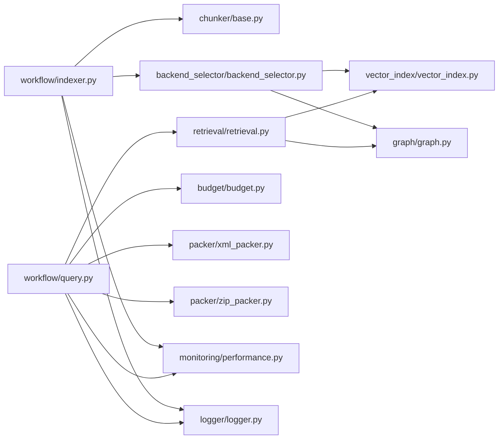

# Data Flow & Event Propagation

<cite>
**Referenced Files in This Document**
- [__init__.py](file://src/ws_ctx_engine/__init__.py)
- [models.py](file://src/ws_ctx_engine/models/models.py)
- [indexer.py](file://src/ws_ctx_engine/workflow/indexer.py)
- [query.py](file://src/ws_ctx_engine/workflow/query.py)
- [logger.py](file://src/ws_ctx_engine/logger/logger.py)
- [performance.py](file://src/ws_ctx_engine/monitoring/performance.py)
- [base.py](file://src/ws_ctx_engine/chunker/base.py)
- [vector_index.py](file://src/ws_ctx_engine/vector_index/vector_index.py)
- [graph.py](file://src/ws_ctx_engine/graph/graph.py)
- [backend_selector.py](file://src/ws_ctx_engine/backend_selector/backend_selector.py)
- [budget.py](file://src/ws_ctx_engine/budget/budget.py)
- [xml_packer.py](file://src/ws_ctx_engine/packer/xml_packer.py)
- [zip_packer.py](file://src/ws_ctx_engine/packer/zip_packer.py)
- [retrieval.py](file://src/ws_ctx_engine/retrieval/retrieval.py)
</cite>

## Table of Contents
1. [Introduction](#introduction)
2. [Project Structure](#project-structure)
3. [Core Components](#core-components)
4. [Architecture Overview](#architecture-overview)
5. [Detailed Component Analysis](#detailed-component-analysis)
6. [Dependency Analysis](#dependency-analysis)
7. [Performance Considerations](#performance-considerations)
8. [Troubleshooting Guide](#troubleshooting-guide)
9. [Conclusion](#conclusion)

## Introduction
This document explains the data flow patterns and event propagation mechanisms in the ws-ctx-engine system. It traces how raw file inputs are transformed through AST parsing, vector indexing, semantic search, PageRank computation, and finally packaged into outputs. It also documents the observer-style logging and monitoring infrastructure, shared state management, serialization patterns, and error propagation strategies. Concrete examples illustrate the movement of CodeChunk objects and performance metrics across indexing and querying phases.

## Project Structure
The ws-ctx-engine organizes functionality by workflow phases and functional domains:
- Workflow: indexing and querying orchestration
- Data models: shared data structures and serialization
- Chunking: AST and fallback parsing
- Indexing: vector index and graph construction
- Retrieval: hybrid ranking (semantic + PageRank)
- Monitoring: performance metrics and logging
- Packaging: XML and ZIP output generation
- Budget: token-aware file selection

**Diagram sources**
- [indexer.py:72-371](file://src/ws_ctx_engine/workflow/indexer.py#L72-L371)
- [query.py:230-616](file://src/ws_ctx_engine/workflow/query.py#L230-L616)
- [models.py:10-84](file://src/ws_ctx_engine/models/models.py#L10-L84)
- [chunker/base.py:41-176](file://src/ws_ctx_engine/chunker/base.py#L41-L176)
- [vector_index/vector_index.py:21-84](file://src/ws_ctx_engine/vector_index/vector_index.py#L21-L84)
- [graph/graph.py:19-94](file://src/ws_ctx_engine/graph/graph.py#L19-L94)
- [backend_selector/backend_selector.py:13-118](file://src/ws_ctx_engine/backend_selector/backend_selector.py#L13-L118)
- [retrieval/retrieval.py:140-368](file://src/ws_ctx_engine/retrieval/retrieval.py#L140-L368)
- [packer/xml_packer.py:51-137](file://src/ws_ctx_engine/packer/xml_packer.py#L51-L137)
- [packer/zip_packer.py:17-90](file://src/ws_ctx_engine/packer/zip_packer.py#L17-L90)
- [monitoring/performance.py:72-262](file://src/ws_ctx_engine/monitoring/performance.py#L72-L262)
- [logger/logger.py:13-144](file://src/ws_ctx_engine/logger/logger.py#L13-L144)
- [budget/budget.py:8-104](file://src/ws_ctx_engine/budget/budget.py#L8-L104)

**Section sources**
- [__init__.py:8-32](file://src/ws_ctx_engine/__init__.py#L8-L32)

## Core Components
- CodeChunk: The central data structure representing parsed code segments with metadata (path, line range, content, symbols, language). It supports serialization/deserialization for caching and persistence.
- PerformanceTracker: Tracks timing, file counts, index sizes, tokens, and memory usage across phases.
- WsCtxEngineLogger: Structured logging with dual console/file outputs and specialized helpers for fallbacks, phase completion, and errors.
- BackendSelector: Centralized backend selection with graceful fallback chains for vector index and graph components.
- RetrievalEngine: Hybrid ranking combining semantic similarity and PageRank, with adaptive boosting and normalization.
- BudgetManager: Greedy knapsack selection respecting token budgets and metadata allocation.
- XMLPacker and ZIPPacker: Output packers for XML and ZIP formats with manifests and token accounting.

**Section sources**
- [models.py:10-84](file://src/ws_ctx_engine/models/models.py#L10-L84)
- [performance.py:72-262](file://src/ws_ctx_engine/monitoring/performance.py#L72-L262)
- [logger.py:13-144](file://src/ws_ctx_engine/logger/logger.py#L13-L144)
- [backend_selector.py:13-118](file://src/ws_ctx_engine/backend_selector/backend_selector.py#L13-L118)
- [retrieval.py:140-368](file://src/ws_ctx_engine/retrieval/retrieval.py#L140-L368)
- [budget.py:8-104](file://src/ws_ctx_engine/budget/budget.py#L8-L104)
- [xml_packer.py:51-137](file://src/ws_ctx_engine/packer/xml_packer.py#L51-L137)
- [zip_packer.py:17-90](file://src/ws_ctx_engine/packer/zip_packer.py#L17-L90)

## Architecture Overview
The system follows a phased pipeline:
- Indexing phase: parse files, build vector index and graph, persist artifacts, compute metadata.
- Querying phase: load indexes, retrieve candidates with hybrid ranking, select within budget, pack output.

**Diagram sources**
- [indexer.py:72-371](file://src/ws_ctx_engine/workflow/indexer.py#L72-L371)
- [chunker/base.py:41-176](file://src/ws_ctx_engine/chunker/base.py#L41-L176)
- [backend_selector/backend_selector.py:36-109](file://src/ws_ctx_engine/backend_selector/backend_selector.py#L36-L109)
- [vector_index/vector_index.py:310-461](file://src/ws_ctx_engine/vector_index/vector_index.py#L310-L461)
- [graph/graph.py:129-231](file://src/ws_ctx_engine/graph/graph.py#L129-L231)
- [monitoring/performance.py:95-113](file://src/ws_ctx_engine/monitoring/performance.py#L95-L113)
- [logger/logger.py:79-94](file://src/ws_ctx_engine/logger/logger.py#L79-L94)

## Detailed Component Analysis

### Data Transformation Pipeline: From Raw Files to Final Output
- Raw files are parsed into CodeChunk objects using AST chunkers with fallbacks.
- CodeChunk objects are grouped by file path and embedded into vectors; symbols are recorded for semantic boosting.
- A dependency graph is constructed from symbol references; PageRank scores reflect structural importance.
- Hybrid scores combine semantic similarity and PageRank, then normalize and apply adaptive boosts.
- BudgetManager greedily selects files within token budget, reserving headroom for metadata.
- Outputs are packed into XML or ZIP with manifests and token counts.

**Diagram sources**
- [indexer.py:156-328](file://src/ws_ctx_engine/workflow/indexer.py#L156-L328)
- [vector_index/vector_index.py:310-461](file://src/ws_ctx_engine/vector_index/vector_index.py#L310-L461)
- [graph/graph.py:129-231](file://src/ws_ctx_engine/graph/graph.py#L129-L231)
- [retrieval/retrieval.py:250-368](file://src/ws_ctx_engine/retrieval/retrieval.py#L250-L368)
- [budget/budget.py:50-104](file://src/ws_ctx_engine/budget/budget.py#L50-L104)
- [xml_packer.py:85-137](file://src/ws_ctx_engine/packer/xml_packer.py#L85-L137)
- [zip_packer.py:49-90](file://src/ws_ctx_engine/packer/zip_packer.py#L49-L90)

**Section sources**
- [indexer.py:72-371](file://src/ws_ctx_engine/workflow/indexer.py#L72-L371)
- [query.py:230-616](file://src/ws_ctx_engine/workflow/query.py#L230-L616)

### Observer Pattern for Logging and Monitoring
- Logging: WsCtxEngineLogger provides structured logs with console and file handlers, and specialized helpers:
  - log_fallback(component, primary, fallback, reason)
  - log_phase(phase, duration, **metrics)
  - log_error(error, context)
- Monitoring: PerformanceTracker records phase timings, file counts, index sizes, tokens, and peak memory usage. It formats metrics for human-readable reporting.

**Diagram sources**
- [logger.py:13-144](file://src/ws_ctx_engine/logger/logger.py#L13-L144)
- [performance.py:72-262](file://src/ws_ctx_engine/monitoring/performance.py#L72-L262)

**Section sources**
- [logger.py:13-144](file://src/ws_ctx_engine/logger/logger.py#L13-L144)
- [performance.py:72-262](file://src/ws_ctx_engine/monitoring/performance.py#L72-L262)

### Shared State Management and Serialization Patterns
- CodeChunk serialization: to_dict/from_dict enables caching and persistence of parsed segments.
- Index metadata: IndexMetadata stores creation timestamp, repo path, file counts, backend, and SHA256 hashes for staleness detection.
- VectorIndex and Graph persistence: Saved via pickle with backend identification; load functions detect backend and restore state.
- BackendSelector: Centralizes configuration-driven backend selection and logs current fallback level.

**Diagram sources**
- [models.py:10-84](file://src/ws_ctx_engine/models/models.py#L10-L84)
- [models.py:87-151](file://src/ws_ctx_engine/models/models.py#L87-L151)
- [vector_index/vector_index.py:429-461](file://src/ws_ctx_engine/vector_index/vector_index.py#L429-L461)
- [graph/graph.py:233-265](file://src/ws_ctx_engine/graph/graph.py#L233-L265)
- [indexer.py:283-328](file://src/ws_ctx_engine/workflow/indexer.py#L283-L328)

**Section sources**
- [models.py:35-84](file://src/ws_ctx_engine/models/models.py#L35-L84)
- [models.py:87-151](file://src/ws_ctx_engine/models/models.py#L87-L151)
- [vector_index/vector_index.py:429-503](file://src/ws_ctx_engine/vector_index/vector_index.py#L429-L503)
- [graph/graph.py:233-314](file://src/ws_ctx_engine/graph/graph.py#L233-L314)
- [indexer.py:283-328](file://src/ws_ctx_engine/workflow/indexer.py#L283-L328)

### Error Propagation Strategies
- Indexing and querying phases wrap operations in try/except blocks, logging errors with context and raising runtime exceptions with descriptive messages.
- BackendSelector logs fallbacks and propagates failures when all backends fail.
- RetrievalEngine continues partial computations (e.g., semantic or PageRank only) and normalizes results.

**Diagram sources**
- [indexer.py:174-176](file://src/ws_ctx_engine/workflow/indexer.py#L174-L176)
- [indexer.py:251-253](file://src/ws_ctx_engine/workflow/indexer.py#L251-L253)
- [query.py:316-322](file://src/ws_ctx_engine/workflow/query.py#L316-L322)
- [backend_selector.py:78-80](file://src/ws_ctx_engine/backend_selector/backend_selector.py#L78-L80)

**Section sources**
- [indexer.py:174-176](file://src/ws_ctx_engine/workflow/indexer.py#L174-L176)
- [indexer.py:251-253](file://src/ws_ctx_engine/workflow/indexer.py#L251-L253)
- [query.py:316-322](file://src/ws_ctx_engine/workflow/query.py#L316-L322)
- [backend_selector.py:78-80](file://src/ws_ctx_engine/backend_selector/backend_selector.py#L78-L80)

### Concrete Examples: Data Flow Through Indexing and Querying

#### Indexing Phase Example
- Input: repository path, configuration
- Steps:
  - Parse codebase with AST chunker (fallback)
  - Build vector index (with embedding cache when enabled)
  - Build graph (RepoMap)
  - Save artifacts and metadata
- Outputs: persisted vector.idx, graph.pkl, metadata.json; PerformanceTracker with metrics

**Diagram sources**
- [indexer.py:156-250](file://src/ws_ctx_engine/workflow/indexer.py#L156-L250)
- [vector_index/vector_index.py:310-461](file://src/ws_ctx_engine/vector_index/vector_index.py#L310-L461)
- [graph/graph.py:129-231](file://src/ws_ctx_engine/graph/graph.py#L129-L231)
- [logger/logger.py:79-94](file://src/ws_ctx_engine/logger/logger.py#L79-L94)
- [monitoring/performance.py:99-113](file://src/ws_ctx_engine/monitoring/performance.py#L99-L113)

**Section sources**
- [indexer.py:72-371](file://src/ws_ctx_engine/workflow/indexer.py#L72-L371)

#### Querying Phase Example
- Input: repository path, query, optional changed_files
- Steps:
  - Load indexes (auto-rebuild if stale)
  - Retrieve candidates with hybrid ranking
  - Select files within token budget
  - Pack output (XML or ZIP)
- Outputs: file path and metrics; XML/ZIP content and manifest

**Diagram sources**
- [query.py:230-616](file://src/ws_ctx_engine/workflow/query.py#L230-L616)
- [retrieval/retrieval.py:250-368](file://src/ws_ctx_engine/retrieval/retrieval.py#L250-L368)
- [budget/budget.py:50-104](file://src/ws_ctx_engine/budget/budget.py#L50-L104)
- [xml_packer.py:85-137](file://src/ws_ctx_engine/packer/xml_packer.py#L85-L137)
- [zip_packer.py:49-90](file://src/ws_ctx_engine/packer/zip_packer.py#L49-L90)
- [logger/logger.py:79-94](file://src/ws_ctx_engine/logger/logger.py#L79-L94)
- [monitoring/performance.py:109-113](file://src/ws_ctx_engine/monitoring/performance.py#L109-L113)

**Section sources**
- [query.py:230-616](file://src/ws_ctx_engine/workflow/query.py#L230-L616)

## Dependency Analysis
- Coupling:
  - Workflow orchestrators depend on models, chunkers, backends, retrievers, packers, and monitors.
  - RetrievalEngine depends on VectorIndex and RepoMapGraph abstractions.
  - BackendSelector decouples consumers from backend availability and configuration.
- Cohesion:
  - Each module encapsulates a single responsibility (parsing, indexing, retrieval, packaging).
- External dependencies:
  - VectorIndex relies on sentence-transformers and optional OpenAI API for embeddings.
  - Graph backends rely on igraph or NetworkX; fallback gracefully degrades.
  - Packaging uses lxml and zipfile; fallback encodings handle decoding errors.

**Diagram sources**
- [indexer.py:14-24](file://src/ws_ctx_engine/workflow/indexer.py#L14-L24)
- [query.py:13-22](file://src/ws_ctx_engine/workflow/query.py#L13-L22)
- [backend_selector.py:7-10](file://src/ws_ctx_engine/backend_selector/backend_selector.py#L7-L10)
- [retrieval.py:19-21](file://src/ws_ctx_engine/retrieval/retrieval.py#L19-L21)
- [budget.py:3-6](file://src/ws_ctx_engine/budget/budget.py#L3-L6)
- [xml_packer.py:7-11](file://src/ws_ctx_engine/packer/xml_packer.py#L7-L11)
- [zip_packer.py:7-14](file://src/ws_ctx_engine/packer/zip_packer.py#L7-L14)
- [performance.py:8-10](file://src/ws_ctx_engine/monitoring/performance.py#L8-L10)
- [logger.py:7-10](file://src/ws_ctx_engine/logger/logger.py#L7-L10)

**Section sources**
- [indexer.py:14-24](file://src/ws_ctx_engine/workflow/indexer.py#L14-L24)
- [query.py:13-22](file://src/ws_ctx_engine/workflow/query.py#L13-L22)
- [backend_selector.py:7-10](file://src/ws_ctx_engine/backend_selector/backend_selector.py#L7-L10)
- [retrieval.py:19-21](file://src/ws_ctx_engine/retrieval/retrieval.py#L19-L21)
- [budget.py:3-6](file://src/ws_ctx_engine/budget/budget.py#L3-L6)
- [xml_packer.py:7-11](file://src/ws_ctx_engine/packer/xml_packer.py#L7-L11)
- [zip_packer.py:7-14](file://src/ws_ctx_engine/packer/zip_packer.py#L7-L14)
- [performance.py:8-10](file://src/ws_ctx_engine/monitoring/performance.py#L8-L10)
- [logger.py:7-10](file://src/ws_ctx_engine/logger/logger.py#L7-L10)

## Performance Considerations
- Embedding caching: VectorIndex implementations consult caches to avoid re-embedding unchanged files.
- Incremental updates: VectorIndex supports incremental updates when hashes change; otherwise full rebuilds leverage caches.
- Memory tracking: PerformanceTracker optionally tracks peak memory using psutil.
- Token budgeting: BudgetManager reserves headroom for metadata and uses greedy selection to maximize utility within limits.
- Output shuffling: XMLPacker can reorder files to improve model recall at window edges.

[No sources needed since this section provides general guidance]

## Troubleshooting Guide
- Indexing failures:
  - Verify repository path exists and is a directory.
  - Check that parse_with_fallback produces non-empty chunks.
  - Inspect vector index and graph build logs; fallbacks are logged with reasons.
- Query failures:
  - Ensure indexes exist and are not stale; auto-rebuild is supported.
  - Validate retrieval weights and configuration; warnings are logged when partial computations occur.
- Logging:
  - Use structured logs to identify phase durations and errors.
  - Investigate fallbacks and degraded configurations via backend logs.
- Metrics:
  - Review formatted metrics for indexing and query phases to locate bottlenecks.

**Section sources**
- [indexer.py:104-108](file://src/ws_ctx_engine/workflow/indexer.py#L104-L108)
- [indexer.py:174-176](file://src/ws_ctx_engine/workflow/indexer.py#L174-L176)
- [indexer.py:251-253](file://src/ws_ctx_engine/workflow/indexer.py#L251-L253)
- [query.py:166-170](file://src/ws_ctx_engine/workflow/query.py#L166-L170)
- [query.py:316-322](file://src/ws_ctx_engine/workflow/query.py#L316-L322)
- [logger.py:64-77](file://src/ws_ctx_engine/logger/logger.py#L64-L77)
- [logger.py:96-108](file://src/ws_ctx_engine/logger/logger.py#L96-L108)
- [performance.py:215-245](file://src/ws_ctx_engine/monitoring/performance.py#L215-L245)

## Conclusion
The ws-ctx-engine implements a robust, observable pipeline that transforms raw code into optimized context for LLMs. CodeChunk serves as the central data carrier, moving through AST parsing, vector indexing, semantic search, PageRank computation, and budget-aware selection to final packaging. The system’s logging and monitoring infrastructure provides comprehensive observability, while backend selection and error handling ensure graceful degradation. This design balances performance, reliability, and maintainability across diverse environments.