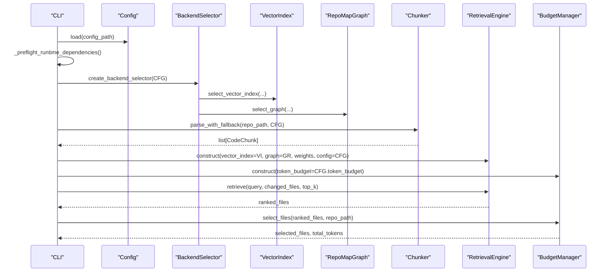
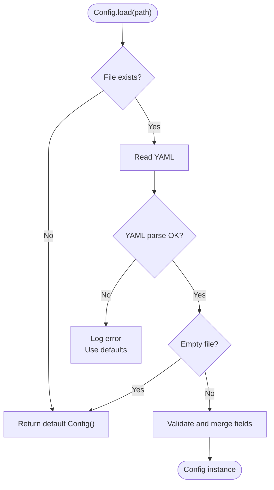
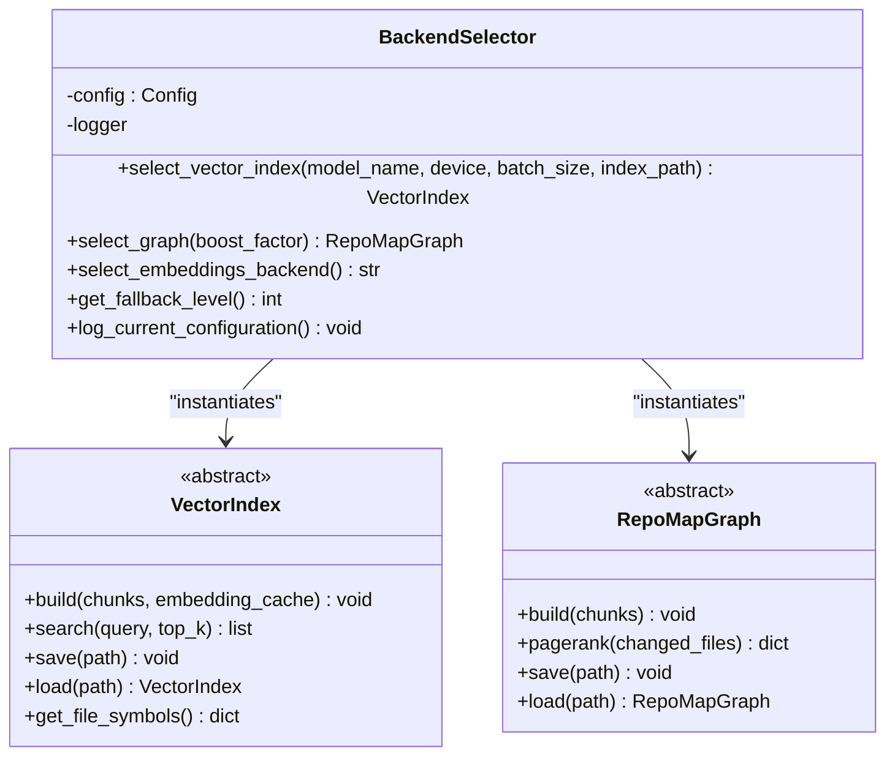
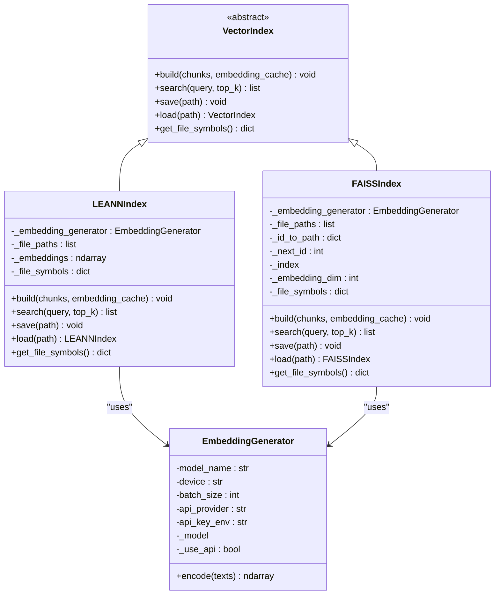
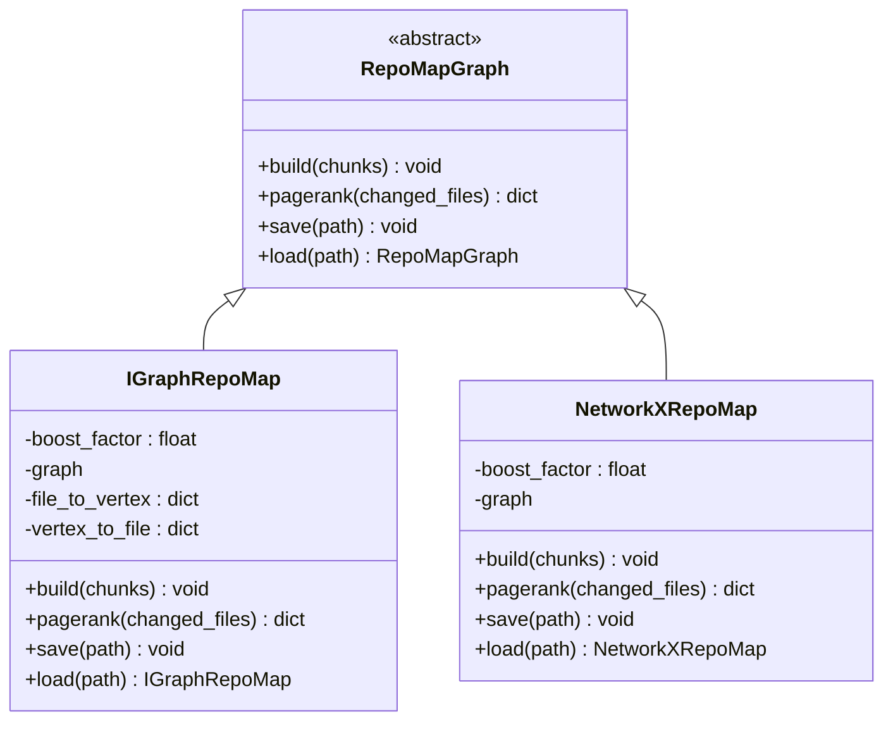
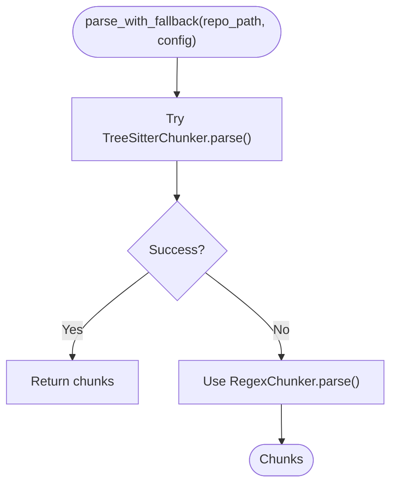
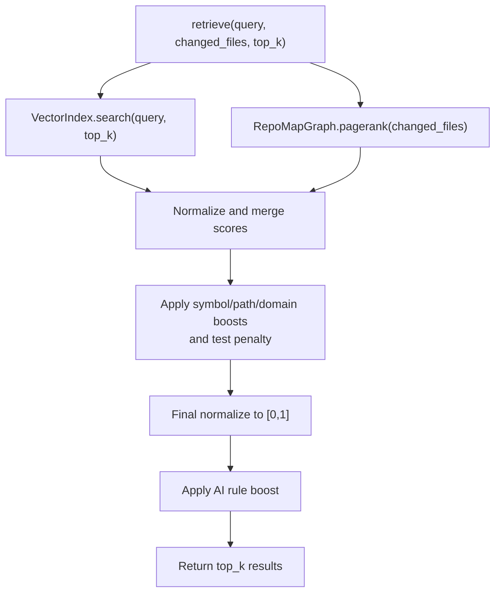
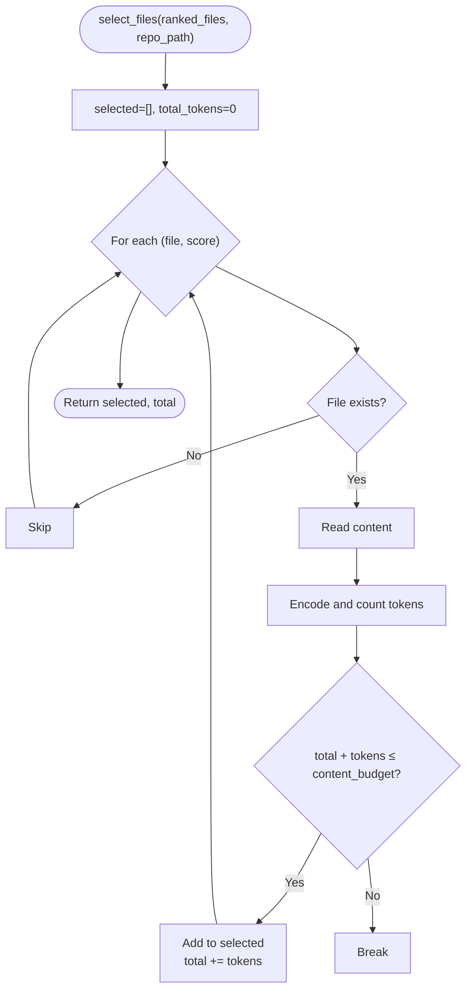
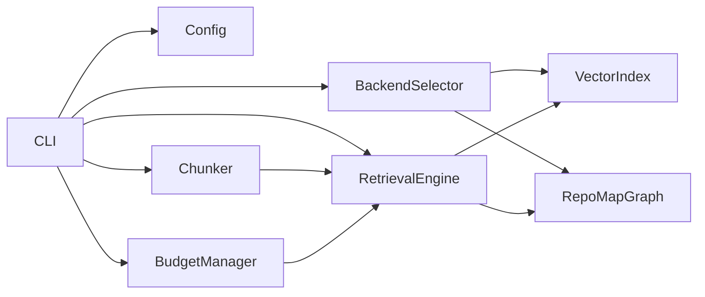

# Dependency Management & Module Initialization

<cite>
**Referenced Files in This Document**
- [__init__.py](file://src/ws_ctx_engine/__init__.py)
- [init_cli.py](file://src/ws_ctx_engine/init_cli.py)
- [config.py](file://src/ws_ctx_engine/config/config.py)
- [backend_selector.py](file://src/ws_ctx_engine/backend_selector/backend_selector.py)
- [budget.py](file://src/ws_ctx_engine/budget/budget.py)
- [retrieval.py](file://src/ws_ctx_engine/retrieval/retrieval.py)
- [vector_index.py](file://src/ws_ctx_engine/vector_index/vector_index.py)
- [graph.py](file://src/ws_ctx_engine/graph/graph.py)
- [base.py](file://src/ws_ctx_engine/chunker/base.py)
- [chunker_init.py](file://src/ws_ctx_engine/chunker/__init__.py)
- [cli.py](file://src/ws_ctx_engine/cli/cli.py)
- [models.py](file://src/ws_ctx_engine/models/models.py)
- [logger.py](file://src/ws_ctx_engine/logger/logger.py)
</cite>

## Table of Contents
1. [Introduction](#introduction)
2. [Project Structure](#project-structure)
3. [Core Components](#core-components)
4. [Architecture Overview](#architecture-overview)
5. [Detailed Component Analysis](#detailed-component-analysis)
6. [Dependency Analysis](#dependency-analysis)
7. [Performance Considerations](#performance-considerations)
8. [Troubleshooting Guide](#troubleshooting-guide)
9. [Conclusion](#conclusion)
10. [Appendices](#appendices)

## Introduction
This document explains dependency management and module initialization patterns in ws-ctx-engine. It focuses on:
- The module import hierarchy and initialization sequence
- The backend selector pattern coordinating component instantiation
- The Config class role in managing shared dependencies
- Initialization order for critical components (BudgetManager, RetrievalEngine, Chunker)
- Lazy loading strategies, circular dependency prevention, and resource cleanup
- Examples of proper module imports and initialization sequences for CLI and programmatic usage

## Project Structure
The engine is organized around cohesive subsystems:
- Configuration and logging
- Backend selection and pluggable backends
- Indexing and retrieval pipeline
- Budget management and output packing
- CLI entrypoints and workflows

```mermaid
graph TB
subgraph "Core"
CFG["Config"]
LOG["Logger"]
end
subgraph "Backends"
BS["BackendSelector"]
VI["VectorIndex (LEANN/FAISS)"]
GR["RepoMapGraph (IGraph/NetworkX)"]
end
subgraph "Processing"
CH["Chunker (TreeSitter/Regex)"]
RET["RetrievalEngine"]
BGT["BudgetManager"]
end
subgraph "CLI"
CLI["CLI Commands"]
end
CFG --> BS
CFG --> LOG
BS --> VI
BS --> GR
CH --> RET
VI --> RET
GR --> RET
BGT --> RET
CLI --> CFG
CLI --> BS
CLI --> CH
CLI --> RET
CLI --> BGT
```

**Diagram sources**
- [config.py:16-399](file://src/ws_ctx_engine/config/config.py#L16-L399)
- [backend_selector.py:13-191](file://src/ws_ctx_engine/backend_selector/backend_selector.py#L13-L191)
- [vector_index.py:21-800](file://src/ws_ctx_engine/vector_index/vector_index.py#L21-L800)
- [graph.py:19-667](file://src/ws_ctx_engine/graph/graph.py#L19-L667)
- [base.py:41-176](file://src/ws_ctx_engine/chunker/base.py#L41-L176)
- [retrieval.py:140-627](file://src/ws_ctx_engine/retrieval/retrieval.py#L140-L627)
- [budget.py:8-105](file://src/ws_ctx_engine/budget/budget.py#L8-L105)
- [cli.py:22-800](file://src/ws_ctx_engine/cli/cli.py#L22-L800)

**Section sources**
- [__init__.py:8-32](file://src/ws_ctx_engine/__init__.py#L8-L32)
- [cli.py:22-800](file://src/ws_ctx_engine/cli/cli.py#L22-L800)

## Core Components
- Config: Centralized configuration loader and validator with defaults and runtime validation.
- BackendSelector: Orchestrator for vector index, graph, and embeddings backends with graceful fallback.
- VectorIndex: Pluggable vector index with local and API embedding generation.
- RepoMapGraph: Pluggable graph with PageRank computation.
- Chunker: AST-based chunking with fallback to regex; integrates with language resolvers.
- RetrievalEngine: Hybrid retrieval combining semantic and structural signals.
- BudgetManager: Greedy knapsack selection constrained by token budgets.
- Logger: Structured logging with dual console/file output and fallback logging.

**Section sources**
- [config.py:16-399](file://src/ws_ctx_engine/config/config.py#L16-L399)
- [backend_selector.py:13-191](file://src/ws_ctx_engine/backend_selector/backend_selector.py#L13-L191)
- [vector_index.py:21-800](file://src/ws_ctx_engine/vector_index/vector_index.py#L21-L800)
- [graph.py:19-667](file://src/ws_ctx_engine/graph/graph.py#L19-L667)
- [base.py:41-176](file://src/ws_ctx_engine/chunker/base.py#L41-L176)
- [retrieval.py:140-627](file://src/ws_ctx_engine/retrieval/retrieval.py#L140-L627)
- [budget.py:8-105](file://src/ws_ctx_engine/budget/budget.py#L8-L105)
- [logger.py:13-145](file://src/ws_ctx_engine/logger/logger.py#L13-L145)

## Architecture Overview
The engine composes subsystems through a layered initialization:
- CLI loads Config and validates runtime dependencies
- BackendSelector resolves backends based on Config
- VectorIndex and RepoMapGraph are instantiated and optionally persisted
- Chunker parses code into CodeChunk objects
- RetrievalEngine orchestrates hybrid ranking
- BudgetManager selects files within token budget
- Output is generated and packed



**Diagram sources**
- [cli.py:438-500](file://src/ws_ctx_engine/cli/cli.py#L438-L500)
- [config.py:112-215](file://src/ws_ctx_engine/config/config.py#L112-L215)
- [backend_selector.py:36-118](file://src/ws_ctx_engine/backend_selector/backend_selector.py#L36-L118)
- [vector_index.py:282-504](file://src/ws_ctx_engine/vector_index/vector_index.py#L282-L504)
- [graph.py:572-621](file://src/ws_ctx_engine/graph/graph.py#L572-L621)
- [base.py:14-25](file://src/ws_ctx_engine/chunker/base.py#L14-L25)
- [retrieval.py:191-244](file://src/ws_ctx_engine/retrieval/retrieval.py#L191-L244)
- [budget.py:50-105](file://src/ws_ctx_engine/budget/budget.py#L50-L105)

## Detailed Component Analysis

### Config: Centralized Dependency Configuration
- Loads YAML configuration with robust validation and defaults
- Validates output format, token budget, scoring weights, patterns, backends, embeddings, and performance settings
- Provides a single source of truth for shared dependencies across subsystems



**Diagram sources**
- [config.py:112-215](file://src/ws_ctx_engine/config/config.py#L112-L215)

**Section sources**
- [config.py:16-399](file://src/ws_ctx_engine/config/config.py#L16-L399)

### Backend Selector Pattern
- Coordinates instantiation of vector index, graph, and embeddings backends
- Implements fallback chains and logs current configuration level
- Delegates to factory functions for graph and vector index creation



**Diagram sources**
- [backend_selector.py:13-191](file://src/ws_ctx_engine/backend_selector/backend_selector.py#L13-L191)
- [vector_index.py:21-94](file://src/ws_ctx_engine/vector_index/vector_index.py#L21-L94)
- [graph.py:19-94](file://src/ws_ctx_engine/graph/graph.py#L19-L94)

**Section sources**
- [backend_selector.py:13-191](file://src/ws_ctx_engine/backend_selector/backend_selector.py#L13-L191)
- [graph.py:572-621](file://src/ws_ctx_engine/graph/graph.py#L572-L621)
- [vector_index.py:282-504](file://src/ws_ctx_engine/vector_index/vector_index.py#L282-L504)

### VectorIndex: Pluggable Embeddings and Index Backends
- Supports LEANNIndex (graph-based, 97% storage savings) and FAISSIndex (fallback)
- EmbeddingGenerator handles local model and API fallback with memory checks
- Provides save/load for persistence and incremental updates



**Diagram sources**
- [vector_index.py:21-800](file://src/ws_ctx_engine/vector_index/vector_index.py#L21-L800)

**Section sources**
- [vector_index.py:96-280](file://src/ws_ctx_engine/vector_index/vector_index.py#L96-L280)
- [vector_index.py:282-504](file://src/ws_ctx_engine/vector_index/vector_index.py#L282-L504)
- [vector_index.py:506-800](file://src/ws_ctx_engine/vector_index/vector_index.py#L506-L800)

### RepoMapGraph: Pluggable Graph and PageRank
- IGraphRepoMap (C++ backend) and NetworkXRepoMap (Python backend) with fallback
- Supports boost factor for changed files and normalization
- Provides save/load with backend detection



**Diagram sources**
- [graph.py:19-667](file://src/ws_ctx_engine/graph/graph.py#L19-L667)

**Section sources**
- [graph.py:97-315](file://src/ws_ctx_engine/graph/graph.py#L97-L315)
- [graph.py:317-570](file://src/ws_ctx_engine/graph/graph.py#L317-L570)
- [graph.py:572-667](file://src/ws_ctx_engine/graph/graph.py#L572-L667)

### Chunker: AST Parsing with Fallback
- ASTChunker base with language-specific resolvers
- parse_with_fallback chooses TreeSitterChunker or RegexChunker with logging
- Integrates with Rust-accelerated file walking when available



**Diagram sources**
- [chunker_init.py:17-38](file://src/ws_ctx_engine/chunker/__init__.py#L17-L38)
- [base.py:14-25](file://src/ws_ctx_engine/chunker/base.py#L14-L25)

**Section sources**
- [chunker_init.py:17-38](file://src/ws_ctx_engine/chunker/__init__.py#L17-L38)
- [base.py:41-176](file://src/ws_ctx_engine/chunker/base.py#L41-L176)

### RetrievalEngine: Hybrid Ranking and Signals
- Combines semantic scores (VectorIndex) and PageRank scores (RepoMapGraph)
- Applies symbol/path/domain boosts and test file penalty
- Normalizes and returns top-k results; supports AI rule boosting



**Diagram sources**
- [retrieval.py:250-368](file://src/ws_ctx_engine/retrieval/retrieval.py#L250-L368)

**Section sources**
- [retrieval.py:140-627](file://src/ws_ctx_engine/retrieval/retrieval.py#L140-L627)

### BudgetManager: Greedy Knapsack Selection
- Reserves 20% of budget for metadata; selects files using 80% content budget
- Reads file content and counts tokens to enforce budget



**Diagram sources**
- [budget.py:50-105](file://src/ws_ctx_engine/budget/budget.py#L50-L105)

**Section sources**
- [budget.py:8-105](file://src/ws_ctx_engine/budget/budget.py#L8-L105)

### Logger: Structured Logging and Fallback Reporting
- Dual handler (console and file) with structured format
- Provides fallback logging for backend transitions and error reporting

**Section sources**
- [logger.py:13-145](file://src/ws_ctx_engine/logger/logger.py#L13-L145)

## Dependency Analysis
- Cohesion and coupling:
  - Config centralizes cross-cutting concerns; low coupling to subsystems
  - BackendSelector encapsulates backend resolution; high cohesion around instantiation
  - RetrievalEngine depends on VectorIndex and RepoMapGraph; loose coupling via interfaces
- External dependencies:
  - VectorIndex relies on sentence-transformers and optional API clients
  - Graph backends rely on igraph or networkx; fallback logic ensures availability
  - Chunker relies on tree-sitter grammars and regex fallback
- Circular dependencies:
  - No circular imports observed among major modules; imports are unidirectional from CLI/config to subsystems



**Diagram sources**
- [cli.py:22-800](file://src/ws_ctx_engine/cli/cli.py#L22-L800)
- [config.py:16-399](file://src/ws_ctx_engine/config/config.py#L16-L399)
- [backend_selector.py:13-191](file://src/ws_ctx_engine/backend_selector/backend_selector.py#L13-L191)
- [vector_index.py:21-800](file://src/ws_ctx_engine/vector_index/vector_index.py#L21-L800)
- [graph.py:19-667](file://src/ws_ctx_engine/graph/graph.py#L19-L667)
- [base.py:41-176](file://src/ws_ctx_engine/chunker/base.py#L41-L176)
- [retrieval.py:140-627](file://src/ws_ctx_engine/retrieval/retrieval.py#L140-L627)
- [budget.py:8-105](file://src/ws_ctx_engine/budget/budget.py#L8-L105)

**Section sources**
- [cli.py:22-800](file://src/ws_ctx_engine/cli/cli.py#L22-L800)
- [__init__.py:8-32](file://src/ws_ctx_engine/__init__.py#L8-L32)

## Performance Considerations
- Backend selection prioritizes optimal backends (e.g., LEANN + igraph) and degrades gracefully
- EmbeddingGenerator uses memory checks and switches to API fallback when needed
- FAISSIndex leverages IndexIDMap2 for efficient incremental updates
- Chunker integrates Rust-accelerated file walking when available
- RetrievalEngine normalizes scores and applies targeted boosts to reduce search space

[No sources needed since this section provides general guidance]

## Troubleshooting Guide
- Dependency preflight failures:
  - CLI validates runtime dependencies and raises actionable errors/warnings
  - Use doctor command to diagnose missing optional dependencies
- Backend fallbacks:
  - Logger emits fallback events with component, primary, and fallback details
- Configuration issues:
  - Config.load logs and falls back to defaults on parse/read errors
- Resource cleanup:
  - Save/load methods handle persistence; ensure proper paths and permissions

**Section sources**
- [cli.py:239-327](file://src/ws_ctx_engine/cli/cli.py#L239-L327)
- [logger.py:64-95](file://src/ws_ctx_engine/logger/logger.py#L64-L95)
- [config.py:131-141](file://src/ws_ctx_engine/config/config.py#L131-L141)

## Conclusion
ws-ctx-engine’s design centers on a clean separation of concerns:
- Config provides shared, validated configuration
- BackendSelector coordinates pluggable backends with graceful fallback
- RetrievalEngine composes vector and graph capabilities with budget-aware selection
- CLI orchestrates initialization and execution with preflight checks and structured logging

[No sources needed since this section summarizes without analyzing specific files]

## Appendices

### Initialization Sequences and Examples

- CLI initialization sequence
  - Load Config from path or defaults
  - Preflight runtime dependencies and resolve backends
  - Create BackendSelector and instantiate VectorIndex and RepoMapGraph
  - Parse chunks with Chunker
  - Construct RetrievalEngine and BudgetManager
  - Execute retrieval and selection

- Programmatic usage example outline
  - Import Config, BackendSelector, VectorIndex, RepoMapGraph, Chunker, RetrievalEngine, BudgetManager
  - Instantiate Config and BackendSelector
  - Resolve and create backends
  - Parse repository with Chunker
  - Build indexes and run retrieval
  - Apply BudgetManager to select files
  - Pack and output results

**Section sources**
- [cli.py:438-500](file://src/ws_ctx_engine/cli/cli.py#L438-L500)
- [config.py:112-215](file://src/ws_ctx_engine/config/config.py#L112-L215)
- [backend_selector.py:36-118](file://src/ws_ctx_engine/backend_selector/backend_selector.py#L36-L118)
- [chunker_init.py:17-38](file://src/ws_ctx_engine/chunker/__init__.py#L17-L38)
- [retrieval.py:191-244](file://src/ws_ctx_engine/retrieval/retrieval.py#L191-L244)
- [budget.py:50-105](file://src/ws_ctx_engine/budget/budget.py#L50-L105)

### Lazy Loading Strategies
- Backend instantiation deferred until needed (select_* methods)
- EmbeddingGenerator lazily initializes local model or API client
- Chunker attempts TreeSitter first, falls back to Regex

**Section sources**
- [backend_selector.py:36-118](file://src/ws_ctx_engine/backend_selector/backend_selector.py#L36-L118)
- [vector_index.py:143-173](file://src/ws_ctx_engine/vector_index/vector_index.py#L143-L173)
- [chunker_init.py:17-38](file://src/ws_ctx_engine/chunker/__init__.py#L17-L38)

### Circular Dependency Prevention
- Unidirectional import flow from CLI/config to subsystems
- Factory functions (create_backend_selector, create_graph, etc.) isolate instantiation
- Interfaces (VectorIndex, RepoMapGraph) decouple consumers from implementations

**Section sources**
- [backend_selector.py:180-191](file://src/ws_ctx_engine/backend_selector/backend_selector.py#L180-L191)
- [graph.py:572-621](file://src/ws_ctx_engine/graph/graph.py#L572-L621)
- [vector_index.py:21-94](file://src/ws_ctx_engine/vector_index/vector_index.py#L21-L94)
- [graph.py:19-94](file://src/ws_ctx_engine/graph/graph.py#L19-L94)

### Resource Cleanup Patterns
- Save/load methods for persistent state
- Logger writes structured logs to files and console
- CLI emits NDJSON for agent mode and structured status/error payloads

**Section sources**
- [vector_index.py:429-504](file://src/ws_ctx_engine/vector_index/vector_index.py#L429-L504)
- [graph.py:233-315](file://src/ws_ctx_engine/graph/graph.py#L233-L315)
- [logger.py:13-145](file://src/ws_ctx_engine/logger/logger.py#L13-L145)
- [cli.py:50-86](file://src/ws_ctx_engine/cli/cli.py#L50-L86)