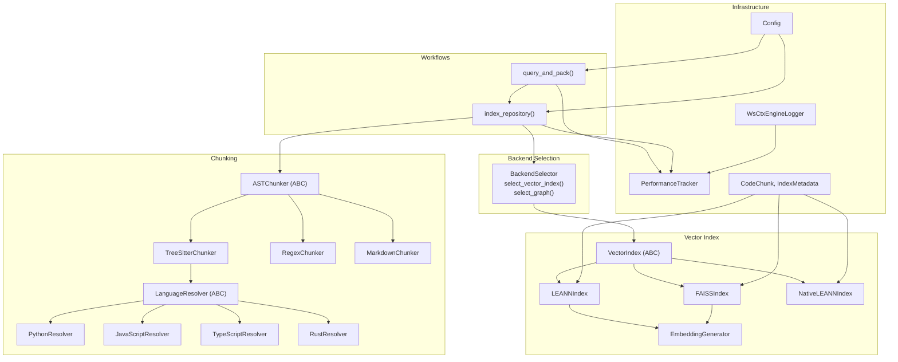
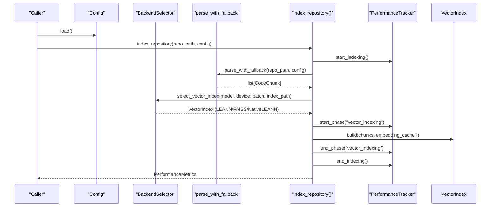
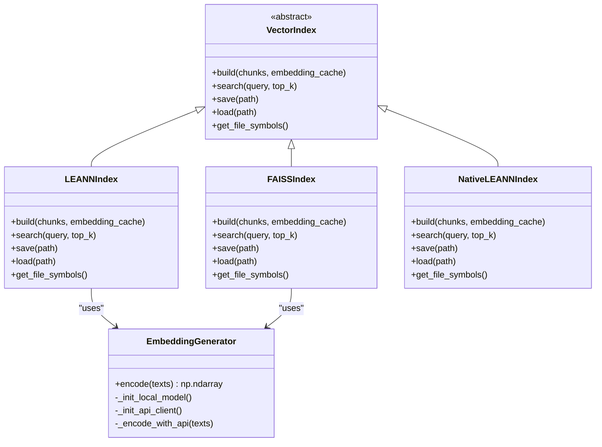
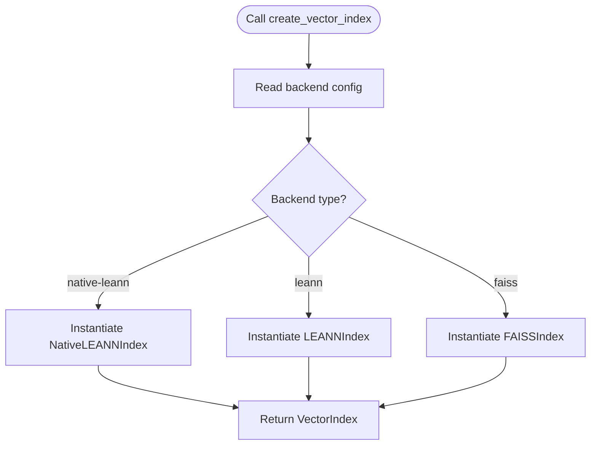
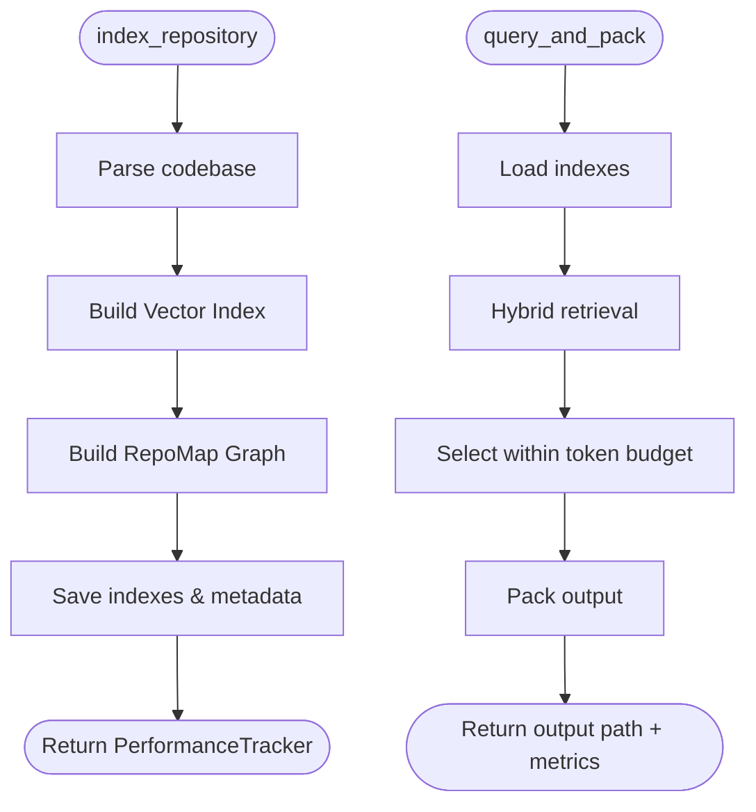
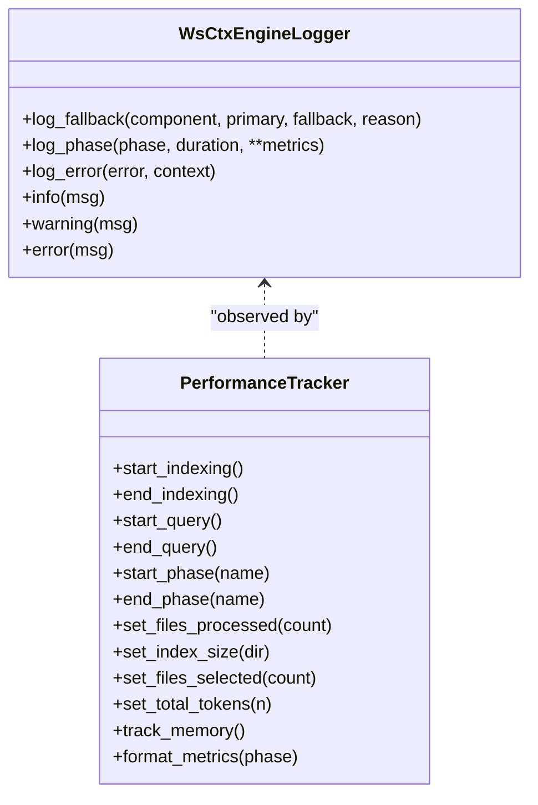
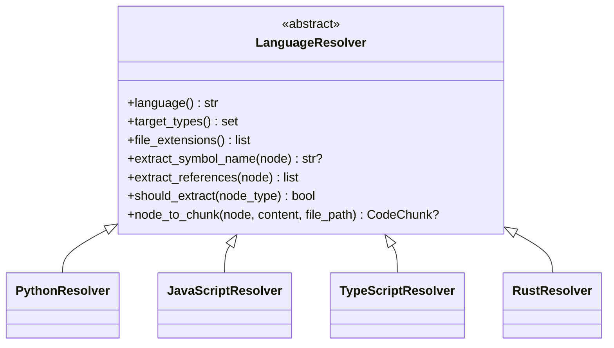
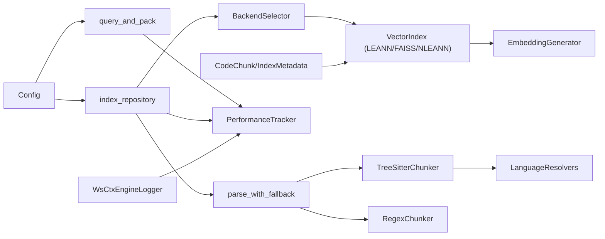

# Design Patterns Implementation

<cite>
**Referenced Files in This Document**
- [backend_selector.py](file://src/ws_ctx_engine/backend_selector/backend_selector.py)
- [vector_index.py](file://src/ws_ctx_engine/vector_index/vector_index.py)
- [leann_index.py](file://src/ws_ctx_engine/vector_index/leann_index.py)
- [base.py](file://src/ws_ctx_engine/chunker/resolvers/base.py)
- [python.py](file://src/ws_ctx_engine/chunker/resolvers/python.py)
- [javascript.py](file://src/ws_ctx_engine/chunker/resolvers/javascript.py)
- [typescript.py](file://src/ws_ctx_engine/chunker/resolvers/typescript.py)
- [rust.py](file://src/ws_ctx_engine/chunker/resolvers/rust.py)
- [logger.py](file://src/ws_ctx_engine/logger/logger.py)
- [config.py](file://src/ws_ctx_engine/config/config.py)
- [indexer.py](file://src/ws_ctx_engine/workflow/indexer.py)
- [query.py](file://src/ws_ctx_engine/workflow/query.py)
- [performance.py](file://src/ws_ctx_engine/monitoring/performance.py)
- [models.py](file://src/ws_ctx_engine/models/models.py)
- [__init__.py](file://src/ws_ctx_engine/vector_index/__init__.py)
- [__init__.py](file://src/ws_ctx_engine/chunker/__init__.py)
- [base.py](file://src/ws_ctx_engine/chunker/base.py)
- [tree_sitter.py](file://src/ws_ctx_engine/chunker/tree_sitter.py)
- [regex.py](file://src/ws_ctx_engine/chunker/regex.py)
</cite>

## Table of Contents
1. [Introduction](#introduction)
2. [Project Structure](#project-structure)
3. [Core Components](#core-components)
4. [Architecture Overview](#architecture-overview)
5. [Detailed Component Analysis](#detailed-component-analysis)
6. [Dependency Analysis](#dependency-analysis)
7. [Performance Considerations](#performance-considerations)
8. [Troubleshooting Guide](#troubleshooting-guide)
9. [Conclusion](#conclusion)

## Introduction
This document analyzes the design patterns implemented across the ws-ctx-engine codebase, focusing on strategy, factory, template method, observer, resolver, decorator, and singleton patterns. It explains how these patterns enable interchangeable vector index backends, standardized workflows, language-specific chunking, enhanced logging, and centralized configuration management. The goal is to help developers understand the architecture, maintainability, and extensibility benefits of each pattern and how they contribute to robust context packaging workflows.

## Project Structure
The ws-ctx-engine organizes functionality by subsystem:
- Backend selection and vector index backends
- Chunking and language-specific resolvers
- Workflows for indexing and querying
- Logging, monitoring, and configuration
- Models and utilities

**Diagram sources**
- [backend_selector.py:13-191](file://src/ws_ctx_engine/backend_selector/backend_selector.py#L13-L191)
- [vector_index.py:21-800](file://src/ws_ctx_engine/vector_index/vector_index.py#L21-L800)
- [leann_index.py:20-297](file://src/ws_ctx_engine/vector_index/leann_index.py#L20-L297)
- [base.py:41-176](file://src/ws_ctx_engine/chunker/base.py#L41-L176)
- [tree_sitter.py:15-160](file://src/ws_ctx_engine/chunker/tree_sitter.py#L15-L160)
- [regex.py:15-219](file://src/ws_ctx_engine/chunker/regex.py#L15-L219)
- [base.py:7-70](file://src/ws_ctx_engine/chunker/resolvers/base.py#L7-L70)
- [python.py:6-61](file://src/ws_ctx_engine/chunker/resolvers/python.py#L6-L61)
- [javascript.py:6-85](file://src/ws_ctx_engine/chunker/resolvers/javascript.py#L6-L85)
- [typescript.py:6-103](file://src/ws_ctx_engine/chunker/resolvers/typescript.py#L6-L103)
- [rust.py:6-55](file://src/ws_ctx_engine/chunker/resolvers/rust.py#L6-L55)
- [indexer.py:72-493](file://src/ws_ctx_engine/workflow/indexer.py#L72-L493)
- [query.py:158-617](file://src/ws_ctx_engine/workflow/query.py#L158-L617)
- [logger.py:13-145](file://src/ws_ctx_engine/logger/logger.py#L13-L145)
- [config.py:16-399](file://src/ws_ctx_engine/config/config.py#L16-L399)
- [performance.py:72-263](file://src/ws_ctx_engine/monitoring/performance.py#L72-L263)
- [models.py:10-152](file://src/ws_ctx_engine/models/models.py#L10-L152)

**Section sources**
- [backend_selector.py:13-191](file://src/ws_ctx_engine/backend_selector/backend_selector.py#L13-L191)
- [vector_index.py:21-800](file://src/ws_ctx_engine/vector_index/vector_index.py#L21-L800)
- [leann_index.py:20-297](file://src/ws_ctx_engine/vector_index/leann_index.py#L20-L297)
- [base.py:41-176](file://src/ws_ctx_engine/chunker/base.py#L41-L176)
- [tree_sitter.py:15-160](file://src/ws_ctx_engine/chunker/tree_sitter.py#L15-L160)
- [regex.py:15-219](file://src/ws_ctx_engine/chunker/regex.py#L15-L219)
- [base.py:7-70](file://src/ws_ctx_engine/chunker/resolvers/base.py#L7-L70)
- [python.py:6-61](file://src/ws_ctx_engine/chunker/resolvers/python.py#L6-L61)
- [javascript.py:6-85](file://src/ws_ctx_engine/chunker/resolvers/javascript.py#L6-L85)
- [typescript.py:6-103](file://src/ws_ctx_engine/chunker/resolvers/typescript.py#L6-L103)
- [rust.py:6-55](file://src/ws_ctx_engine/chunker/resolvers/rust.py#L6-L55)
- [indexer.py:72-493](file://src/ws_ctx_engine/workflow/indexer.py#L72-L493)
- [query.py:158-617](file://src/ws_ctx_engine/workflow/query.py#L158-L617)
- [logger.py:13-145](file://src/ws_ctx_engine/logger/logger.py#L13-L145)
- [config.py:16-399](file://src/ws_ctx_engine/config/config.py#L16-L399)
- [performance.py:72-263](file://src/ws_ctx_engine/monitoring/performance.py#L72-L263)
- [models.py:10-152](file://src/ws_ctx_engine/models/models.py#L10-L152)

## Core Components
- Strategy pattern: VectorIndex abstraction with interchangeable implementations (LEANNIndex, FAISSIndex, NativeLEANNIndex) enabling backend selection and graceful fallback.
- Factory pattern: Creation functions (e.g., create_vector_index, create_native_leann_index) and parse_with_fallback for constructing components based on availability and configuration.
- Template method pattern: Workflow functions index_repository and query_and_pack define standardized phases with hooks for backend selection, parsing, indexing, retrieval, budgeting, packing, and monitoring.
- Observer pattern: WsCtxEngineLogger acts as a centralized observer/logging facility, emitting structured logs and metrics consumed by PerformanceTracker and workflows.
- Resolver pattern: LanguageResolver subclasses encapsulate language-specific AST node extraction and symbol resolution for TreeSitterChunker.
- Decorator pattern: Logging enhancements via structured messages and fallback notifications integrated into components (e.g., EmbeddingGenerator, BackendSelector).
- Singleton pattern: Global logger instance via get_logger ensures a single logging facade across the application.

**Section sources**
- [vector_index.py:21-800](file://src/ws_ctx_engine/vector_index/vector_index.py#L21-L800)
- [leann_index.py:20-297](file://src/ws_ctx_engine/vector_index/leann_index.py#L20-L297)
- [__init__.py:1-24](file://src/ws_ctx_engine/vector_index/__init__.py#L1-L24)
- [__init__.py:1-55](file://src/ws_ctx_engine/chunker/__init__.py#L1-L55)
- [indexer.py:72-493](file://src/ws_ctx_engine/workflow/indexer.py#L72-L493)
- [query.py:158-617](file://src/ws_ctx_engine/workflow/query.py#L158-L617)
- [logger.py:13-145](file://src/ws_ctx_engine/logger/logger.py#L13-L145)
- [base.py:7-70](file://src/ws_ctx_engine/chunker/resolvers/base.py#L7-L70)
- [config.py:16-399](file://src/ws_ctx_engine/config/config.py#L16-L399)

## Architecture Overview
The system orchestrates a standardized pipeline:
- Configuration drives backend selection and workflow behavior.
- Chunkers parse codebases into CodeChunk objects using language-specific resolvers.
- Vector index backends provide semantic search with interchangeable implementations.
- Workflows coordinate phases, monitor performance, and handle fallbacks.
- Logging and monitoring provide observability across operations.

**Diagram sources**
- [indexer.py:72-493](file://src/ws_ctx_engine/workflow/indexer.py#L72-L493)
- [vector_index.py:21-800](file://src/ws_ctx_engine/vector_index/vector_index.py#L21-L800)
- [leann_index.py:20-297](file://src/ws_ctx_engine/vector_index/leann_index.py#L20-L297)
- [__init__.py:17-38](file://src/ws_ctx_engine/chunker/__init__.py#L17-L38)
- [config.py:16-399](file://src/ws_ctx_engine/config/config.py#L16-L399)
- [performance.py:72-263](file://src/ws_ctx_engine/monitoring/performance.py#L72-L263)

## Detailed Component Analysis

### Strategy Pattern: Vector Index Backends
The VectorIndex abstract base class defines a uniform interface for building, searching, saving, and loading indexes. Concrete implementations (LEANNIndex, FAISSIndex, NativeLEANNIndex) encapsulate different backend technologies while preserving interchangeability.

Key characteristics:
- Uniform API: build, search, save, load, get_file_symbols.
- EmbeddingGenerator supports local and API-backed embeddings with fallback.
- BackendSelector coordinates selection and fallback chains.

Benefits and trade-offs:
- Benefits: Interchangeability, testability, and ability to switch backends without changing callers.
- Trade-offs: Some backends require optional dependencies (e.g., FAISS, Native LEANN), adding installation complexity.

**Diagram sources**
- [vector_index.py:21-800](file://src/ws_ctx_engine/vector_index/vector_index.py#L21-L800)
- [leann_index.py:20-297](file://src/ws_ctx_engine/vector_index/leann_index.py#L20-L297)

**Section sources**
- [vector_index.py:21-800](file://src/ws_ctx_engine/vector_index/vector_index.py#L21-L800)
- [leann_index.py:20-297](file://src/ws_ctx_engine/vector_index/leann_index.py#L20-L297)
- [backend_selector.py:36-118](file://src/ws_ctx_engine/backend_selector/backend_selector.py#L36-L118)

### Factory Pattern: Component Creation
Creation functions encapsulate construction logic and error handling:
- create_vector_index and load_vector_index in vector_index module.
- create_native_leann_index for NativeLEANNIndex.
- parse_with_fallback selects TreeSitterChunker with regex fallback.

Benefits and trade-offs:
- Benefits: Centralized instantiation logic, consistent error handling, and simplified caller code.
- Trade-offs: Requires careful validation of configuration and optional dependencies.

**Diagram sources**
- [vector_index.py:21-800](file://src/ws_ctx_engine/vector_index/vector_index.py#L21-L800)
- [leann_index.py:20-297](file://src/ws_ctx_engine/vector_index/leann_index.py#L20-L297)
- [__init__.py:1-24](file://src/ws_ctx_engine/vector_index/__init__.py#L1-L24)

**Section sources**
- [vector_index.py:21-800](file://src/ws_ctx_engine/vector_index/vector_index.py#L21-L800)
- [leann_index.py:20-297](file://src/ws_ctx_engine/vector_index/leann_index.py#L20-L297)
- [__init__.py:1-24](file://src/ws_ctx_engine/vector_index/__init__.py#L1-L24)
- [__init__.py:17-38](file://src/ws_ctx_engine/chunker/__init__.py#L17-L38)

### Template Method Pattern: Standardized Workflows
The index_repository and query_and_pack functions define a fixed sequence of phases with hooks for backend selection, parsing, indexing, retrieval, budgeting, packing, and monitoring.

Benefits and trade-offs:
- Benefits: Consistent behavior across runs, predictable phases, and easy extension points.
- Trade-offs: Tight coupling to specific phases; modifications require careful validation.

**Diagram sources**
- [indexer.py:72-493](file://src/ws_ctx_engine/workflow/indexer.py#L72-L493)
- [query.py:158-617](file://src/ws_ctx_engine/workflow/query.py#L158-L617)

**Section sources**
- [indexer.py:72-493](file://src/ws_ctx_engine/workflow/indexer.py#L72-L493)
- [query.py:158-617](file://src/ws_ctx_engine/workflow/query.py#L158-L617)

### Observer Pattern: Logging and Monitoring
WsCtxEngineLogger provides structured logging with dual outputs and specialized helpers (log_fallback, log_phase, log_error). PerformanceTracker observes workflow phases and metrics.

Benefits and trade-offs:
- Benefits: Centralized logging, structured metrics, and actionable alerts on fallbacks.
- Trade-offs: Extra I/O overhead; requires disciplined usage to avoid noisy logs.

**Diagram sources**
- [logger.py:13-145](file://src/ws_ctx_engine/logger/logger.py#L13-L145)
- [performance.py:72-263](file://src/ws_ctx_engine/monitoring/performance.py#L72-L263)

**Section sources**
- [logger.py:13-145](file://src/ws_ctx_engine/logger/logger.py#L13-L145)
- [performance.py:72-263](file://src/ws_ctx_engine/monitoring/performance.py#L72-L263)
- [indexer.py:115-127](file://src/ws_ctx_engine/workflow/indexer.py#L115-L127)
- [query.py:288-292](file://src/ws_ctx_engine/workflow/query.py#L288-L292)

### Resolver Pattern: Language-Specific Chunking
LanguageResolver abstracts AST node extraction per language. TreeSitterChunker composes resolvers to transform AST nodes into CodeChunk objects.

Benefits and trade-offs:
- Benefits: Clean separation of language logic, extensible with new languages.
- Trade-offs: Requires accurate AST node identification and symbol extraction rules.

**Diagram sources**
- [base.py:7-70](file://src/ws_ctx_engine/chunker/resolvers/base.py#L7-L70)
- [python.py:6-61](file://src/ws_ctx_engine/chunker/resolvers/python.py#L6-L61)
- [javascript.py:6-85](file://src/ws_ctx_engine/chunker/resolvers/javascript.py#L6-L85)
- [typescript.py:6-103](file://src/ws_ctx_engine/chunker/resolvers/typescript.py#L6-L103)
- [rust.py:6-55](file://src/ws_ctx_engine/chunker/resolvers/rust.py#L6-L55)

**Section sources**
- [base.py:7-70](file://src/ws_ctx_engine/chunker/resolvers/base.py#L7-L70)
- [tree_sitter.py:15-160](file://src/ws_ctx_engine/chunker/tree_sitter.py#L15-L160)
- [python.py:6-61](file://src/ws_ctx_engine/chunker/resolvers/python.py#L6-L61)
- [javascript.py:6-85](file://src/ws_ctx_engine/chunker/resolvers/javascript.py#L6-L85)
- [typescript.py:6-103](file://src/ws_ctx_engine/chunker/resolvers/typescript.py#L6-L103)
- [rust.py:6-55](file://src/ws_ctx_engine/chunker/resolvers/rust.py#L6-L55)

### Decorator Pattern: Logging Enhancements
Logging enhancements act as decorators around operations:
- EmbeddingGenerator logs fallbacks from local to API embeddings.
- WsCtxEngineLogger provides structured messages and metrics for phases and errors.

Usage examples (paths only):
- [vector_index.py:235-245](file://src/ws_ctx_engine/vector_index/vector_index.py#L235-L245)
- [logger.py:64-94](file://src/ws_ctx_engine/logger/logger.py#L64-L94)

Benefits and trade-offs:
- Benefits: Non-invasive instrumentation, consistent log format, and contextual metadata.
- Trade-offs: Can increase verbosity; requires careful selection of log levels.

**Section sources**
- [vector_index.py:199-280](file://src/ws_ctx_engine/vector_index/vector_index.py#L199-L280)
- [logger.py:64-125](file://src/ws_ctx_engine/logger/logger.py#L64-L125)

### Singleton Pattern: Configuration Management
Config follows a singleton-like pattern via a global loader and validation:
- Config.load reads YAML, validates, and merges defaults.
- get_logger provides a single logger instance.

Usage examples (paths only):
- [config.py:112-215](file://src/ws_ctx_engine/config/config.py#L112-L215)
- [logger.py:131-145](file://src/ws_ctx_engine/logger/logger.py#L131-L145)

Benefits and trade-offs:
- Benefits: Centralized configuration, consistent defaults, and global access.
- Trade-offs: Harder to test with multiple configurations; potential for global state misuse.

**Section sources**
- [config.py:16-399](file://src/ws_ctx_engine/config/config.py#L16-L399)
- [logger.py:131-145](file://src/ws_ctx_engine/logger/logger.py#L131-L145)

## Dependency Analysis
The following diagram highlights key dependencies among major components:

**Diagram sources**
- [config.py:16-399](file://src/ws_ctx_engine/config/config.py#L16-L399)
- [indexer.py:72-493](file://src/ws_ctx_engine/workflow/indexer.py#L72-L493)
- [query.py:158-617](file://src/ws_ctx_engine/workflow/query.py#L158-L617)
- [backend_selector.py:13-191](file://src/ws_ctx_engine/backend_selector/backend_selector.py#L13-L191)
- [vector_index.py:21-800](file://src/ws_ctx_engine/vector_index/vector_index.py#L21-L800)
- [leann_index.py:20-297](file://src/ws_ctx_engine/vector_index/leann_index.py#L20-L297)
- [__init__.py:17-38](file://src/ws_ctx_engine/chunker/__init__.py#L17-L38)
- [tree_sitter.py:15-160](file://src/ws_ctx_engine/chunker/tree_sitter.py#L15-L160)
- [regex.py:15-219](file://src/ws_ctx_engine/chunker/regex.py#L15-L219)
- [base.py:7-70](file://src/ws_ctx_engine/chunker/resolvers/base.py#L7-L70)
- [performance.py:72-263](file://src/ws_ctx_engine/monitoring/performance.py#L72-L263)
- [logger.py:13-145](file://src/ws_ctx_engine/logger/logger.py#L13-L145)
- [models.py:10-152](file://src/ws_ctx_engine/models/models.py#L10-L152)

**Section sources**
- [config.py:16-399](file://src/ws_ctx_engine/config/config.py#L16-L399)
- [indexer.py:72-493](file://src/ws_ctx_engine/workflow/indexer.py#L72-L493)
- [query.py:158-617](file://src/ws_ctx_engine/workflow/query.py#L158-L617)
- [backend_selector.py:13-191](file://src/ws_ctx_engine/backend_selector/backend_selector.py#L13-L191)
- [vector_index.py:21-800](file://src/ws_ctx_engine/vector_index/vector_index.py#L21-L800)
- [leann_index.py:20-297](file://src/ws_ctx_engine/vector_index/leann_index.py#L20-L297)
- [__init__.py:17-38](file://src/ws_ctx_engine/chunker/__init__.py#L17-L38)
- [tree_sitter.py:15-160](file://src/ws_ctx_engine/chunker/tree_sitter.py#L15-L160)
- [regex.py:15-219](file://src/ws_ctx_engine/chunker/regex.py#L15-L219)
- [base.py:7-70](file://src/ws_ctx_engine/chunker/resolvers/base.py#L7-L70)
- [performance.py:72-263](file://src/ws_ctx_engine/monitoring/performance.py#L72-L263)
- [logger.py:13-145](file://src/ws_ctx_engine/logger/logger.py#L13-L145)
- [models.py:10-152](file://src/ws_ctx_engine/models/models.py#L10-L152)

## Performance Considerations
- Backend selection prioritizes optimal backends (e.g., LEANN with 97% storage savings) and degrades gracefully.
- Incremental indexing reduces rebuild costs by leveraging embedding caches and targeted updates.
- PerformanceTracker measures phase timings, memory usage, and index sizes to guide tuning.
- Configurable token budgets and output formats balance quality and cost.

[No sources needed since this section provides general guidance]

## Troubleshooting Guide
Common issues and resolutions:
- Missing optional dependencies for backends (e.g., FAISS, Native LEANN) cause instantiation failures; install extras or adjust configuration.
- Out-of-memory conditions trigger API embedding fallback; verify environment variables and resource limits.
- Stale indexes prompt automatic rebuild; ensure file permissions and repository integrity.
- Logging reveals fallback events and phase durations; use structured logs to diagnose bottlenecks.

**Section sources**
- [vector_index.py:584-587](file://src/ws_ctx_engine/vector_index/vector_index.py#L584-L587)
- [leann_index.py:78-82](file://src/ws_ctx_engine/vector_index/leann_index.py#L78-L82)
- [logger.py:64-94](file://src/ws_ctx_engine/logger/logger.py#L64-L94)
- [indexer.py:456-467](file://src/ws_ctx_engine/workflow/indexer.py#L456-L467)

## Conclusion
The ws-ctx-engine leverages well-established design patterns to achieve flexibility, reliability, and observability:
- Strategy enables backend interchangeability.
- Factory simplifies component creation.
- Template method standardizes workflows.
- Observer enhances transparency via logging and metrics.
- Resolver pattern cleanly separates language-specific logic.
- Decorator pattern augments operations with structured logging.
- Singleton pattern centralizes configuration and logging.

These patterns collectively improve maintainability, testability, and extensibility, enabling robust context packaging across diverse repositories and environments.