# Inter-Component Communication

<cite>
**Referenced Files in This Document**
- [__init__.py](file://src/ws_ctx_engine/__init__.py)
- [mcp_server.py](file://src/ws_ctx_engine/mcp_server.py)
- [dedup_cache.py](file://src/ws_ctx_engine/session/dedup_cache.py)
- [domain_map.py](file://src/ws_ctx_engine/domain_map/domain_map.py)
- [db.py](file://src/ws_ctx_engine/domain_map/db.py)
- [indexer.py](file://src/ws_ctx_engine/workflow/indexer.py)
- [query.py](file://src/ws_ctx_engine/workflow/query.py)
- [server.py](file://src/ws_ctx_engine/mcp/server.py)
- [tools.py](file://src/ws_ctx_engine/mcp/tools.py)
- [embedding_cache.py](file://src/ws_ctx_engine/vector_index/embedding_cache.py)
- [budget.py](file://src/ws_ctx_engine/budget/budget.py)
- [retrieval.py](file://src/ws_ctx_engine/retrieval/retrieval.py)
- [rate_limiter.py](file://src/ws_ctx_engine/mcp/security/rate_limiter.py)
- [config.py](file://src/ws_ctx_engine/mcp/config.py)
- [performance.py](file://src/ws_ctx_engine/monitoring/performance.py)
- [models.py](file://src/ws_ctx_engine/models/models.py)
- [backend_selector.py](file://src/ws_ctx_engine/backend_selector/backend_selector.py)
- [graph.py](file://src/ws_ctx_engine/graph/graph.py)
</cite>

## Table of Contents
1. [Introduction](#introduction)
2. [Project Structure](#project-structure)
3. [Core Components](#core-components)
4. [Architecture Overview](#architecture-overview)
5. [Detailed Component Analysis](#detailed-component-analysis)
6. [Dependency Analysis](#dependency-analysis)
7. [Performance Considerations](#performance-considerations)
8. [Troubleshooting Guide](#troubleshooting-guide)
9. [Conclusion](#conclusion)

## Introduction
This document explains the inter-component communication mechanisms and integration patterns used by ws-ctx-engine. It covers:
- Message passing protocols for external agents via Model Context Protocol (MCP)
- Shared caches for deduplication and performance optimization
- Domain mapping system for dependency tracking and query classification
- Workflow orchestration across indexing, querying, and packaging
- Synchronous and asynchronous processing modes
- Error handling and retry strategies
- Examples of component interactions during indexing, querying, and packaging

## Project Structure
The project is organized around modular capabilities:
- Workflow orchestration: indexing and querying
- Indexing backends: vector index and graph
- Domain mapping: keyword-to-directory mapping with persistence
- Session-level deduplication cache
- MCP server for external agent integration
- Budget management and retrieval engine
- Monitoring and performance tracking

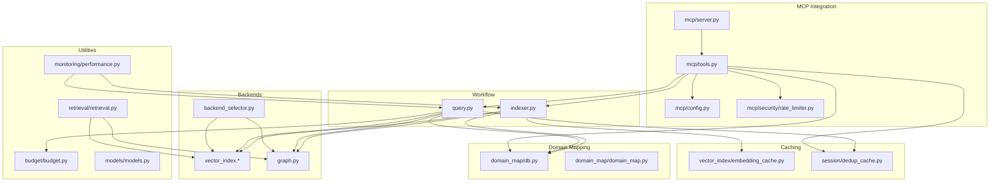

**Diagram sources**
- [indexer.py:72-371](file://src/ws_ctx_engine/workflow/indexer.py#L72-L371)
- [query.py:158-616](file://src/ws_ctx_engine/workflow/query.py#L158-L616)
- [server.py:13-136](file://src/ws_ctx_engine/mcp/server.py#L13-L136)
- [tools.py:29-672](file://src/ws_ctx_engine/mcp/tools.py#L29-L672)
- [db.py:22-296](file://src/ws_ctx_engine/domain_map/db.py#L22-L296)
- [domain_map.py:11-147](file://src/ws_ctx_engine/domain_map/domain_map.py#L11-L147)
- [embedding_cache.py:28-127](file://src/ws_ctx_engine/vector_index/embedding_cache.py#L28-L127)
- [dedup_cache.py:35-154](file://src/ws_ctx_engine/session/dedup_cache.py#L35-L154)
- [budget.py:8-105](file://src/ws_ctx_engine/budget/budget.py#L8-L105)
- [retrieval.py:140-627](file://src/ws_ctx_engine/retrieval/retrieval.py#L140-L627)
- [backend_selector.py:13-191](file://src/ws_ctx_engine/backend_selector/backend_selector.py#L13-L191)
- [graph.py:19-667](file://src/ws_ctx_engine/graph/graph.py#L19-L667)
- [performance.py:72-263](file://src/ws_ctx_engine/monitoring/performance.py#L72-L263)
- [models.py:10-152](file://src/ws_ctx_engine/models/models.py#L10-L152)
- [config.py:22-129](file://src/ws_ctx_engine/mcp/config.py#L22-L129)
- [rate_limiter.py:14-45](file://src/ws_ctx_engine/mcp/security/rate_limiter.py#L14-L45)

**Section sources**
- [__init__.py:1-33](file://src/ws_ctx_engine/__init__.py#L1-L33)
- [mcp_server.py:1-12](file://src/ws_ctx_engine/mcp_server.py#L1-L12)

## Core Components
- Workflow orchestrators:
  - Indexer: parses code, builds vector index, constructs graph, persists metadata and domain map
  - Query: loads indexes, retrieves candidates, selects within budget, packs output
- Retrieval engine: hybrid ranking combining semantic and structural signals
- Budget manager: token-aware file selection using greedy knapsack
- Domain mapping: keyword-to-directories mapping with SQLite-backed persistence
- Session deduplication cache: on-disk cache to avoid repeating identical content
- Embedding cache: persistent disk cache for vector embeddings to accelerate incremental rebuilds
- Backend selector: automatic fallback across vector index, graph, and embeddings backends
- MCP server: STDIO-based JSON-RPC server exposing tools to external agents
- Monitoring: performance metrics and phase timings

**Section sources**
- [indexer.py:72-371](file://src/ws_ctx_engine/workflow/indexer.py#L72-L371)
- [query.py:158-616](file://src/ws_ctx_engine/workflow/query.py#L158-L616)
- [retrieval.py:140-627](file://src/ws_ctx_engine/retrieval/retrieval.py#L140-L627)
- [budget.py:8-105](file://src/ws_ctx_engine/budget/budget.py#L8-L105)
- [domain_map.py:11-147](file://src/ws_ctx_engine/domain_map/domain_map.py#L11-L147)
- [db.py:22-296](file://src/ws_ctx_engine/domain_map/db.py#L22-L296)
- [dedup_cache.py:35-154](file://src/ws_ctx_engine/session/dedup_cache.py#L35-L154)
- [embedding_cache.py:28-127](file://src/ws_ctx_engine/vector_index/embedding_cache.py#L28-L127)
- [backend_selector.py:13-191](file://src/ws_ctx_engine/backend_selector/backend_selector.py#L13-L191)
- [server.py:13-136](file://src/ws_ctx_engine/mcp/server.py#L13-L136)
- [tools.py:29-672](file://src/ws_ctx_engine/mcp/tools.py#L29-L672)
- [performance.py:72-263](file://src/ws_ctx_engine/monitoring/performance.py#L72-L263)

## Architecture Overview
The system follows a layered architecture:
- External agents communicate via MCP over STDIO using JSON-RPC
- Internal components coordinate through explicit function calls and shared artifacts (indexes, caches)
- Indexing and querying are orchestrated by dedicated workflows
- Retrieval combines semantic and structural signals with domain-aware boosting
- Caches reduce redundant computation and improve throughput

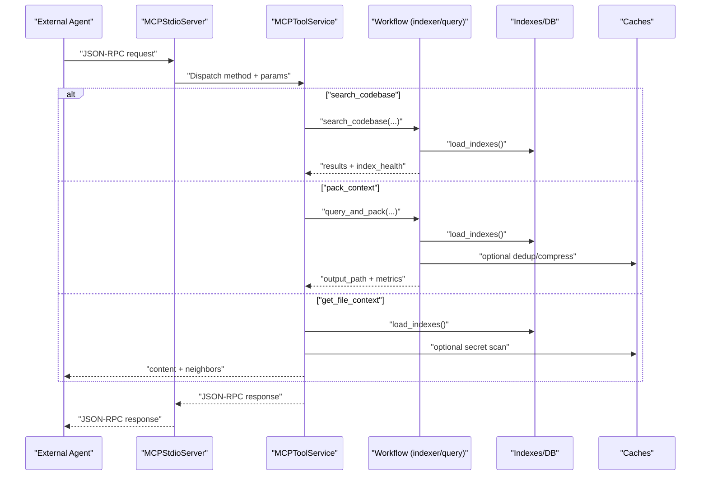

**Diagram sources**
- [server.py:39-136](file://src/ws_ctx_engine/mcp/server.py#L39-L136)
- [tools.py:133-184](file://src/ws_ctx_engine/mcp/tools.py#L133-L184)
- [indexer.py:404-492](file://src/ws_ctx_engine/workflow/indexer.py#L404-L492)
- [query.py:230-616](file://src/ws_ctx_engine/workflow/query.py#L230-L616)

## Detailed Component Analysis

### Message Passing Protocols (MCP)
- Transport: STDIO with newline-delimited JSON messages
- Protocol: JSON-RPC 2.0 subset with methods:
  - initialize: returns protocolVersion, capabilities, serverInfo
  - tools/list: lists tool schemas
  - tools/call: invokes named tool with arguments
- Tools exposed:
  - search_codebase, get_file_context, get_domain_map, get_index_status, pack_context, session_clear
- Request validation: strict checks for method and params types
- Response pattern: success result or error object with code/message
- Rate limiting: per-tool token buckets with refill semantics
- Caching: in-memory TTL cache for selected tools
- Security: workspace guard prevents path traversal; secret scanning redacts sensitive content

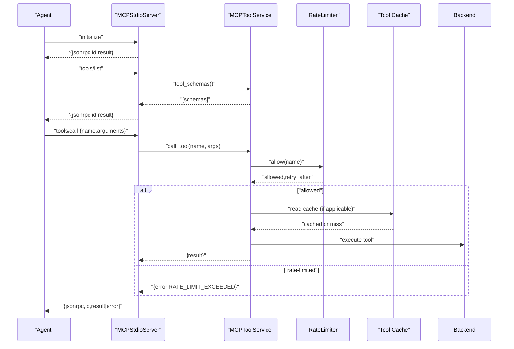

**Diagram sources**
- [server.py:39-136](file://src/ws_ctx_engine/mcp/server.py#L39-L136)
- [tools.py:133-184](file://src/ws_ctx_engine/mcp/tools.py#L133-L184)
- [rate_limiter.py:14-45](file://src/ws_ctx_engine/mcp/security/rate_limiter.py#L14-L45)
- [config.py:22-129](file://src/ws_ctx_engine/mcp/config.py#L22-L129)

**Section sources**
- [server.py:13-136](file://src/ws_ctx_engine/mcp/server.py#L13-L136)
- [tools.py:29-132](file://src/ws_ctx_engine/mcp/tools.py#L29-L132)
- [rate_limiter.py:14-45](file://src/ws_ctx_engine/mcp/security/rate_limiter.py#L14-L45)
- [config.py:22-129](file://src/ws_ctx_engine/mcp/config.py#L22-L129)

### Shared Cache Systems
- Session-level deduplication cache:
  - Tracks content hashes per session
  - Persists to disk as JSON with atomic writes
  - Replaces repeated content with a compact marker
  - Supports clearing all sessions or a specific session
- Embedding cache:
  - Stores content-hash → embedding vector mapping
  - Uses numpy arrays and JSON index for persistence
  - Enables incremental rebuilds by skipping unchanged files

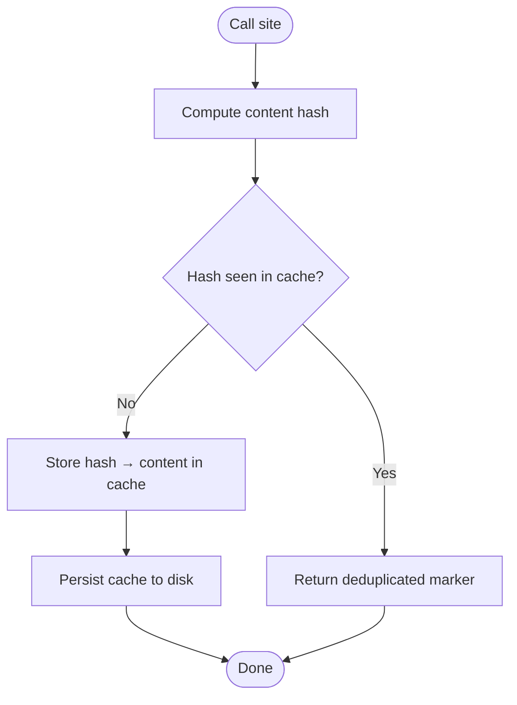

**Diagram sources**
- [dedup_cache.py:65-90](file://src/ws_ctx_engine/session/dedup_cache.py#L65-L90)
- [embedding_cache.py:89-114](file://src/ws_ctx_engine/vector_index/embedding_cache.py#L89-L114)

**Section sources**
- [dedup_cache.py:35-154](file://src/ws_ctx_engine/session/dedup_cache.py#L35-L154)
- [embedding_cache.py:28-127](file://src/ws_ctx_engine/vector_index/embedding_cache.py#L28-L127)

### Domain Mapping System
- Build-time:
  - Extract keywords from file paths and map to directories
  - Persist to SQLite with WAL mode for concurrency
- Query-time:
  - Load domain map and boost files under matched directories
  - Support prefix search and keyword matching
- Migration:
  - Parallel write to both pickle and SQLite
  - Shadow read validation and eventual SQLite-only usage

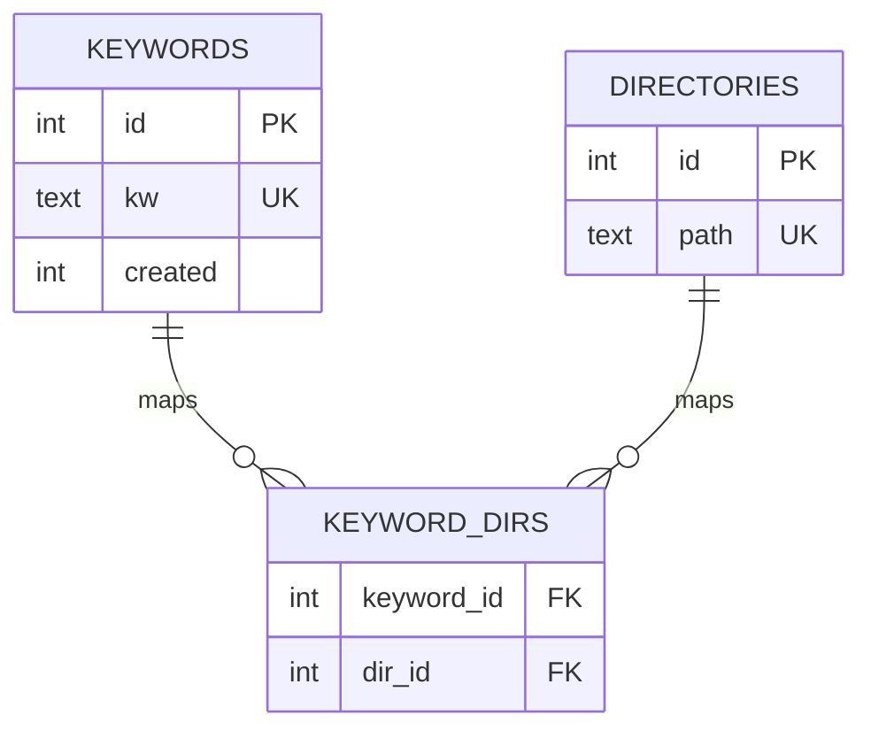

**Diagram sources**
- [db.py:70-101](file://src/ws_ctx_engine/domain_map/db.py#L70-L101)
- [domain_map.py:74-147](file://src/ws_ctx_engine/domain_map/domain_map.py#L74-L147)

**Section sources**
- [domain_map.py:11-147](file://src/ws_ctx_engine/domain_map/domain_map.py#L11-L147)
- [db.py:22-296](file://src/ws_ctx_engine/domain_map/db.py#L22-L296)

### Retrieval Engine and Hybrid Ranking
- Inputs: vector index (semantic), graph (structural PageRank), optional changed files boost
- Additional signals:
  - Symbol exact match boost
  - Path keyword boost
  - Domain boost via domain map
  - Test file penalty
- Normalization: min-max normalization to [0, 1]
- Query classification: adapts boost weights based on query type

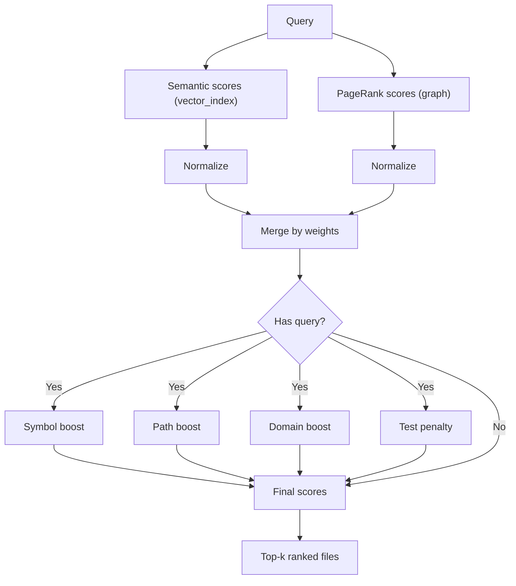

**Diagram sources**
- [retrieval.py:250-369](file://src/ws_ctx_engine/retrieval/retrieval.py#L250-L369)

**Section sources**
- [retrieval.py:140-627](file://src/ws_ctx_engine/retrieval/retrieval.py#L140-L627)

### Budget Management and Selection
- Greedy knapsack algorithm selecting files within token budget
- Reserves ~20% for metadata; uses ~80% for content
- Uses tiktoken to estimate token counts

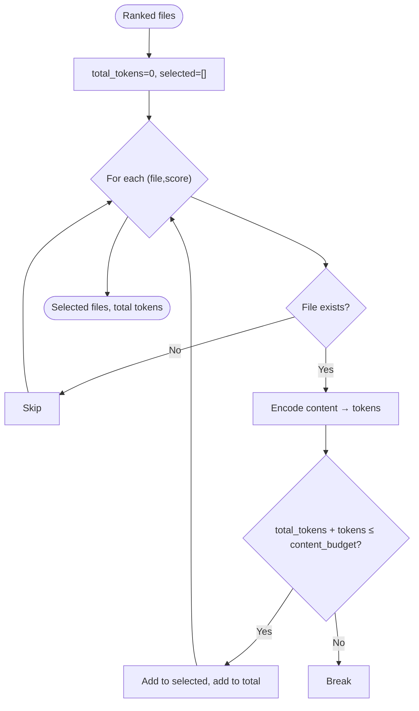

**Diagram sources**
- [budget.py:50-105](file://src/ws_ctx_engine/budget/budget.py#L50-L105)

**Section sources**
- [budget.py:8-105](file://src/ws_ctx_engine/budget/budget.py#L8-L105)

### Workflow Orchestration: Indexing
- Phases:
  1) Parse codebase with AST chunker (with fallback)
  2) Build vector index (with embedding cache and incremental update)
  3) Build graph (with fallback)
  4) Save metadata for staleness detection
  5) Build domain map and persist to DB
- Incremental mode:
  - Detect changed/deleted files via file hashes
  - Update vector index incrementally and persist embedding cache

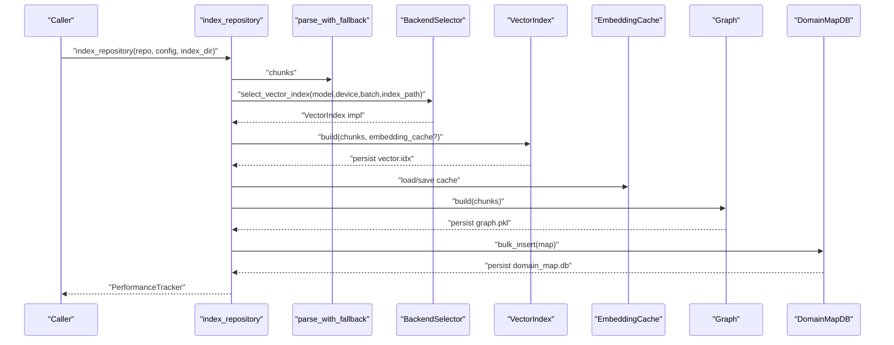

**Diagram sources**
- [indexer.py:72-371](file://src/ws_ctx_engine/workflow/indexer.py#L72-L371)
- [backend_selector.py:36-109](file://src/ws_ctx_engine/backend_selector/backend_selector.py#L36-L109)
- [embedding_cache.py:55-84](file://src/ws_ctx_engine/vector_index/embedding_cache.py#L55-L84)
- [db.py:134-178](file://src/ws_ctx_engine/domain_map/db.py#L134-L178)

**Section sources**
- [indexer.py:72-371](file://src/ws_ctx_engine/workflow/indexer.py#L72-L371)
- [backend_selector.py:13-191](file://src/ws_ctx_engine/backend_selector/backend_selector.py#L13-L191)
- [embedding_cache.py:28-127](file://src/ws_ctx_engine/vector_index/embedding_cache.py#L28-L127)
- [db.py:134-178](file://src/ws_ctx_engine/domain_map/db.py#L134-L178)

### Workflow Orchestration: Querying and Packaging
- Loads indexes with staleness detection and optional rebuild
- Retrieves candidates with hybrid ranking and optional phase-aware re-weighting
- Selects files within token budget
- Packs output in configured format (XML, ZIP, JSON, YAML, Markdown)
- Applies pre-processing: compression and session-level deduplication
- Supports secret scanning and dependency/dependent neighbor discovery

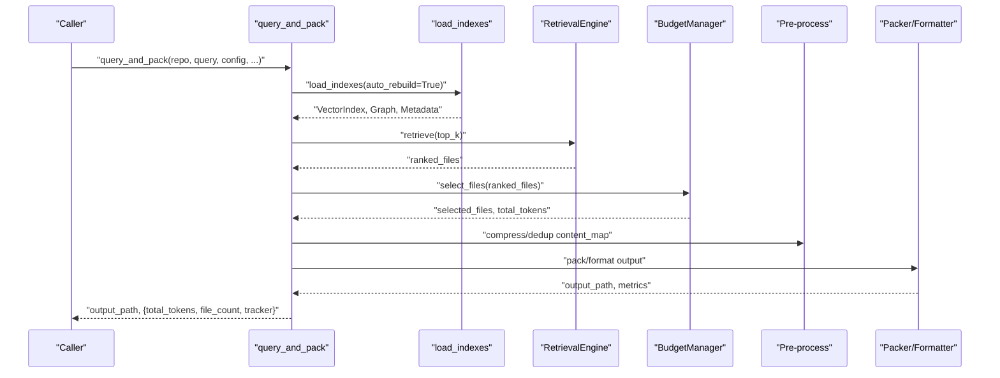

**Diagram sources**
- [query.py:230-616](file://src/ws_ctx_engine/workflow/query.py#L230-L616)
- [retrieval.py:250-369](file://src/ws_ctx_engine/retrieval/retrieval.py#L250-L369)
- [budget.py:50-105](file://src/ws_ctx_engine/budget/budget.py#L50-L105)

**Section sources**
- [query.py:158-616](file://src/ws_ctx_engine/workflow/query.py#L158-L616)
- [retrieval.py:140-627](file://src/ws_ctx_engine/retrieval/retrieval.py#L140-L627)
- [budget.py:8-105](file://src/ws_ctx_engine/budget/budget.py#L8-L105)

### Backend Selection and Fallback
- Centralized selector chooses optimal backends with graceful fallback
- Vector index backends: native LEANN, LEANNIndex, FAISS
- Graph backends: igraph (preferred), NetworkX, file-size ranking fallback
- Embeddings backends: local or API

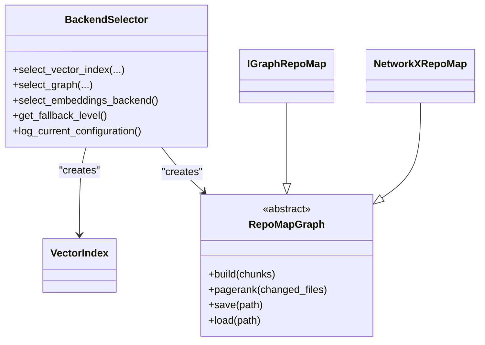

**Diagram sources**
- [backend_selector.py:13-191](file://src/ws_ctx_engine/backend_selector/backend_selector.py#L13-L191)
- [graph.py:19-128](file://src/ws_ctx_engine/graph/graph.py#L19-L128)

**Section sources**
- [backend_selector.py:13-191](file://src/ws_ctx_engine/backend_selector/backend_selector.py#L13-L191)
- [graph.py:19-128](file://src/ws_ctx_engine/graph/graph.py#L19-L128)

### Error Handling and Retry Mechanisms
- MCP:
  - Strict request validation; returns JSON-RPC error objects
  - Rate limiter returns retry-after seconds when exceeded
  - Workspace guard raises permission errors for invalid paths
- Indexing/Query:
  - Graceful fallbacks in backend selection and graph/vector index creation
  - Staleness detection triggers rebuild when needed
  - Exceptions logged with structured context

**Section sources**
- [server.py:57-112](file://src/ws_ctx_engine/mcp/server.py#L57-L112)
- [rate_limiter.py:19-44](file://src/ws_ctx_engine/mcp/security/rate_limiter.py#L19-L44)
- [tools.py:158-166](file://src/ws_ctx_engine/mcp/tools.py#L158-L166)
- [indexer.py:226-254](file://src/ws_ctx_engine/workflow/indexer.py#L226-L254)
- [query.py:316-323](file://src/ws_ctx_engine/workflow/query.py#L316-L323)

## Dependency Analysis
- Cohesion:
  - Workflow modules encapsulate end-to-end operations
  - Retrieval engine is cohesive around hybrid ranking
  - Domain mapping is self-contained with DB persistence
- Coupling:
  - Indexer couples to vector index, graph, domain map, and embedding cache
  - Query couples to retrieval engine, budget manager, packers/formatters, and caches
  - MCP tools couple to workflows and security utilities
- External dependencies:
  - igraph and networkx for graph operations
  - numpy for embedding cache arrays
  - tiktoken for token counting
  - sqlite3 for domain map persistence

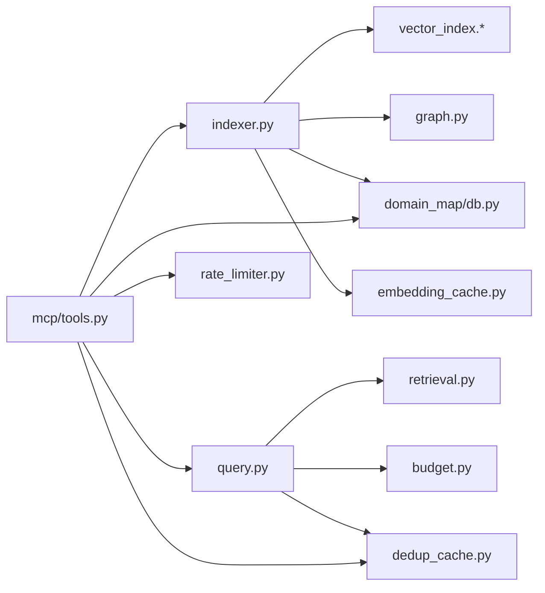

**Diagram sources**
- [indexer.py:14-24](file://src/ws_ctx_engine/workflow/indexer.py#L14-L24)
- [query.py:13-22](file://src/ws_ctx_engine/workflow/query.py#L13-L22)
- [tools.py:11-21](file://src/ws_ctx_engine/mcp/tools.py#L11-L21)

**Section sources**
- [indexer.py:14-24](file://src/ws_ctx_engine/workflow/indexer.py#L14-L24)
- [query.py:13-22](file://src/ws_ctx_engine/workflow/query.py#L13-L22)
- [tools.py:11-21](file://src/ws_ctx_engine/mcp/tools.py#L11-L21)

## Performance Considerations
- Incremental indexing:
  - Detects changed/deleted files and updates vector index incrementally
  - Uses embedding cache to avoid re-embedding unchanged content
- Caching:
  - Session-level deduplication reduces repeated content transmission
  - Domain map DB uses WAL for concurrent reads
- Backends:
  - igraph backend provides fast PageRank; NetworkX as fallback
  - Native LEANN offers significant storage savings
- Monitoring:
  - PerformanceTracker measures phase timings, file counts, token totals, and memory usage

**Section sources**
- [indexer.py:210-235](file://src/ws_ctx_engine/workflow/indexer.py#L210-L235)
- [embedding_cache.py:55-84](file://src/ws_ctx_engine/vector_index/embedding_cache.py#L55-L84)
- [dedup_cache.py:119-137](file://src/ws_ctx_engine/session/dedup_cache.py#L119-L137)
- [db.py:46-57](file://src/ws_ctx_engine/domain_map/db.py#L46-L57)
- [backend_selector.py:158-177](file://src/ws_ctx_engine/backend_selector/backend_selector.py#L158-L177)
- [performance.py:72-263](file://src/ws_ctx_engine/monitoring/performance.py#L72-L263)

## Troubleshooting Guide
- MCP rate limit exceeded:
  - Inspect rate_limits in MCPConfig and adjust overrides
  - Observe retry_after seconds returned by rate limiter
- Workspace path errors:
  - Ensure workspace resolves within configured boundaries
  - Validate permissions and avoid path traversal attempts
- Index staleness:
  - Check index health; rebuild if stale
  - Verify metadata.json presence and integrity
- Backend failures:
  - Confirm availability of igraph or networkx
  - Verify vector index and graph backends are properly configured
- Secret scanning redactions:
  - Review secret scanner results and remove sensitive content before re-indexing

**Section sources**
- [config.py:28-129](file://src/ws_ctx_engine/mcp/config.py#L28-L129)
- [rate_limiter.py:19-44](file://src/ws_ctx_engine/mcp/security/rate_limiter.py#L19-L44)
- [tools.py:250-287](file://src/ws_ctx_engine/mcp/tools.py#L250-L287)
- [indexer.py:456-467](file://src/ws_ctx_engine/workflow/indexer.py#L456-L467)
- [query.py:425-490](file://src/ws_ctx_engine/workflow/query.py#L425-L490)

## Conclusion
ws-ctx-engine integrates external agents via MCP, coordinates internal components through explicit workflows, and optimizes performance using targeted caches and incremental processing. The domain mapping system enhances retrieval relevance, while robust error handling and fallbacks ensure reliability across diverse environments.