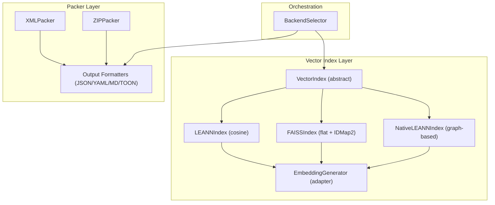
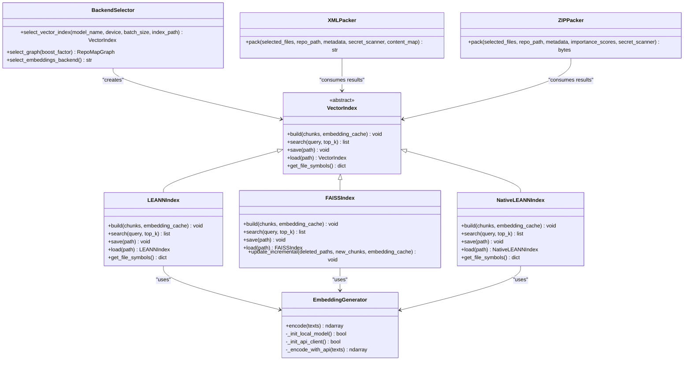
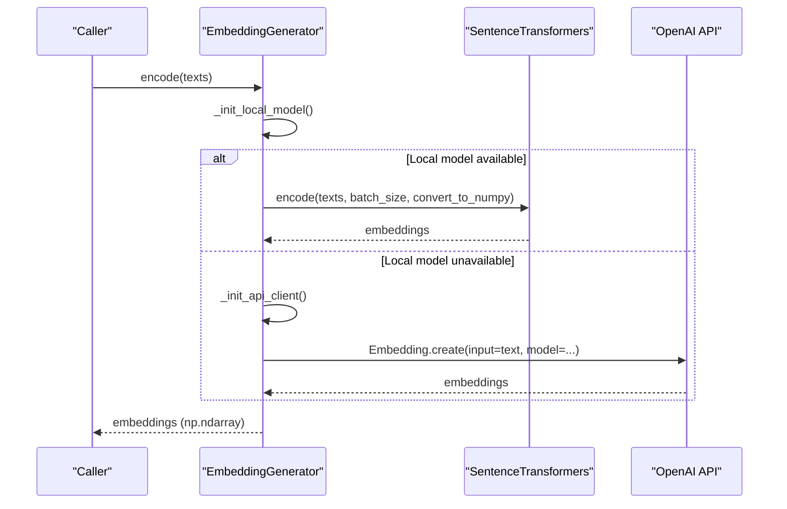
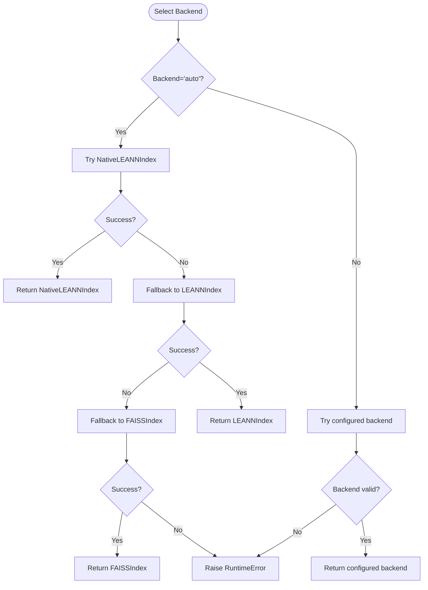
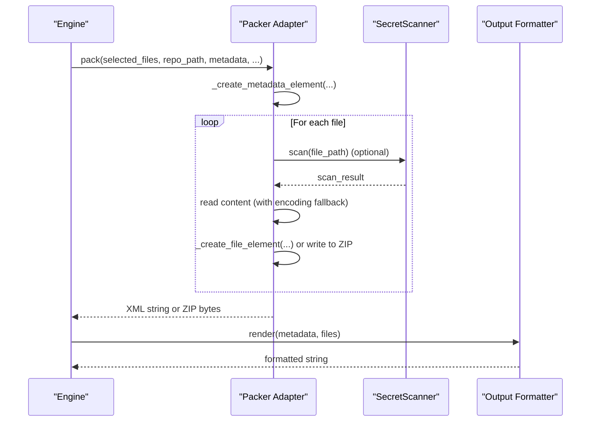
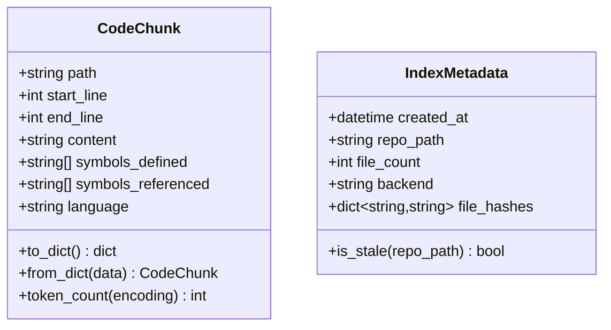
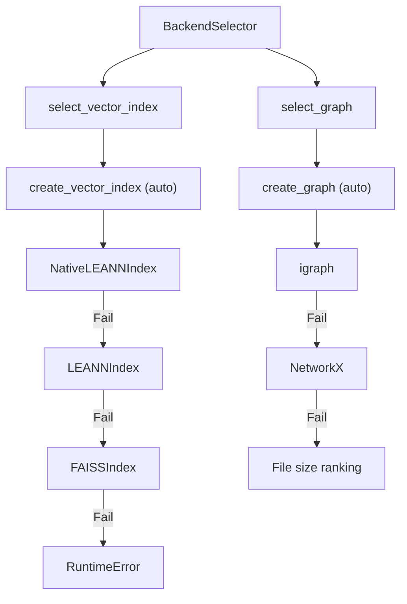
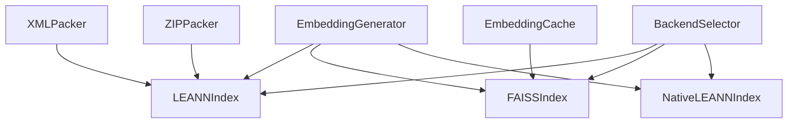

# Adapter Pattern & Integration

<cite>
**Referenced Files in This Document**
- [vector_index.py](file://src/ws_ctx_engine/vector_index/vector_index.py)
- [leann_index.py](file://src/ws_ctx_engine/vector_index/leann_index.py)
- [embedding_cache.py](file://src/ws_ctx_engine/vector_index/embedding_cache.py)
- [xml_packer.py](file://src/ws_ctx_engine/packer/xml_packer.py)
- [zip_packer.py](file://src/ws_ctx_engine/packer/zip_packer.py)
- [backend_selector.py](file://src/ws_ctx_engine/backend_selector/backend_selector.py)
- [models.py](file://src/ws_ctx_engine/models/models.py)
- [output-formatters.md](file://docs/reference/output-formatters.md)
- [packer.md](file://docs/reference/packer.md)
</cite>

## Table of Contents
1. [Introduction](#introduction)
2. [Project Structure](#project-structure)
3. [Core Components](#core-components)
4. [Architecture Overview](#architecture-overview)
5. [Detailed Component Analysis](#detailed-component-analysis)
6. [Dependency Analysis](#dependency-analysis)
7. [Performance Considerations](#performance-considerations)
8. [Troubleshooting Guide](#troubleshooting-guide)
9. [Conclusion](#conclusion)

## Introduction
This document explains how the Adapter pattern is used to integrate external systems and normalize interfaces across vector embeddings, vector index backends, and output formats. It focuses on three adapter categories:
- Embedding adapters: normalize vector generation across local sentence-transformers and API providers
- Vector index adapters: normalize different backends (native LEANN, LEANNIndex, FAISS) behind a unified interface
- Packer adapters: normalize output formats (XML, ZIP) and support pluggable renderers for alternative formats

The goal is to enable pluggable backends and format support while maintaining a consistent interface for downstream consumers.

## Project Structure
The adapter implementations live primarily in:
- Vector index and embedding adapters: src/ws_ctx_engine/vector_index/
- Output packers and formatters: src/ws_ctx_engine/packer/ and docs/reference/output-formatters.md
- Backend selection orchestration: src/ws_ctx_engine/backend_selector/

**Diagram sources**
- [vector_index.py:21-84](file://src/ws_ctx_engine/vector_index/vector_index.py#L21-L84)
- [leann_index.py:20-66](file://src/ws_ctx_engine/vector_index/leann_index.py#L20-L66)
- [xml_packer.py:51-73](file://src/ws_ctx_engine/packer/xml_packer.py#L51-L73)
- [zip_packer.py:17-37](file://src/ws_ctx_engine/packer/zip_packer.py#L17-L37)
- [backend_selector.py:13-24](file://src/ws_ctx_engine/backend_selector/backend_selector.py#L13-L24)

**Section sources**
- [vector_index.py:1-120](file://src/ws_ctx_engine/vector_index/vector_index.py#L1-L120)
- [leann_index.py:1-66](file://src/ws_ctx_engine/vector_index/leann_index.py#L1-L66)
- [xml_packer.py:1-73](file://src/ws_ctx_engine/packer/xml_packer.py#L1-L73)
- [zip_packer.py:1-37](file://src/ws_ctx_engine/packer/zip_packer.py#L1-L37)
- [backend_selector.py:1-35](file://src/ws_ctx_engine/backend_selector/backend_selector.py#L1-L35)

## Core Components
- VectorIndex abstract base class defines the contract for building, searching, saving, loading, and symbol access.
- EmbeddingGenerator adapts sentence-transformers and OpenAI API embeddings behind a unified encode(texts) interface.
- Concrete vector index adapters:
  - LEANNIndex: cosine similarity over file embeddings
  - FAISSIndex: flat L2 index wrapped in IDMap2 for incremental updates
  - NativeLEANNIndex: native graph-based index with 97% storage savings
- Packer adapters:
  - XMLPacker: Repomix-style XML output
  - ZIPPacker: ZIP archive with manifest
  - Output formatters: JSON, YAML, Markdown, TOON (pluggable renderer interface)
- BackendSelector orchestrates backend selection with graceful fallback chains.

**Section sources**
- [vector_index.py:21-84](file://src/ws_ctx_engine/vector_index/vector_index.py#L21-L84)
- [vector_index.py:96-280](file://src/ws_ctx_engine/vector_index/vector_index.py#L96-L280)
- [leann_index.py:20-66](file://src/ws_ctx_engine/vector_index/leann_index.py#L20-L66)
- [xml_packer.py:51-73](file://src/ws_ctx_engine/packer/xml_packer.py#L51-L73)
- [zip_packer.py:17-37](file://src/ws_ctx_engine/packer/zip_packer.py#L17-L37)
- [backend_selector.py:13-24](file://src/ws_ctx_engine/backend_selector/backend_selector.py#L13-L24)

## Architecture Overview
The adapter architecture separates concerns:
- External systems are adapted behind unified interfaces (VectorIndex, EmbeddingGenerator, Packer/Formatter)
- Fallback and selection logic ensures robust operation across environments
- Data structures (CodeChunk, IndexMetadata) normalize cross-cutting concerns

**Diagram sources**
- [vector_index.py:21-84](file://src/ws_ctx_engine/vector_index/vector_index.py#L21-L84)
- [vector_index.py:96-280](file://src/ws_ctx_engine/vector_index/vector_index.py#L96-L280)
- [leann_index.py:20-66](file://src/ws_ctx_engine/vector_index/leann_index.py#L20-L66)
- [xml_packer.py:51-73](file://src/ws_ctx_engine/packer/xml_packer.py#L51-L73)
- [zip_packer.py:17-37](file://src/ws_ctx_engine/packer/zip_packer.py#L17-L37)
- [backend_selector.py:36-80](file://src/ws_ctx_engine/backend_selector/backend_selector.py#L36-L80)

## Detailed Component Analysis

### Embedding Adapter: EmbeddingGenerator
Purpose:
- Wrap sentence-transformers and OpenAI API embeddings behind a single encode(texts) interface
- Provide fallback on memory errors and initialization failures
- Normalize embedding dimensionality and return type

Key behaviors:
- Local-first strategy with memory checks; falls back to API when memory is low or local fails
- API client initialization guarded by environment variables and package availability
- Consistent NumPy array output for downstream vector index adapters

**Diagram sources**
- [vector_index.py:199-280](file://src/ws_ctx_engine/vector_index/vector_index.py#L199-L280)

**Section sources**
- [vector_index.py:96-129](file://src/ws_ctx_engine/vector_index/vector_index.py#L96-L129)
- [vector_index.py:143-172](file://src/ws_ctx_engine/vector_index/vector_index.py#L143-L172)
- [vector_index.py:174-197](file://src/ws_ctx_engine/vector_index/vector_index.py#L174-L197)
- [vector_index.py:199-280](file://src/ws_ctx_engine/vector_index/vector_index.py#L199-L280)

### Vector Index Adapters: Normalized Backends
Purpose:
- Provide a uniform interface across LEANN, FAISS, and native LEANN backends
- Support persistence, loading, and symbol mapping
- Enable incremental updates where supported

Implementation highlights:
- VectorIndex abstract contract ensures consistent method signatures
- create_vector_index centralizes backend selection with fallback
- load_vector_index detects backend type and delegates to the correct loader
- FAISSIndex supports incremental updates via IndexIDMap2 and EmbeddingCache

**Diagram sources**
- [vector_index.py:972-1080](file://src/ws_ctx_engine/vector_index/vector_index.py#L972-L1080)

**Section sources**
- [vector_index.py:21-84](file://src/ws_ctx_engine/vector_index/vector_index.py#L21-L84)
- [vector_index.py:972-1080](file://src/ws_ctx_engine/vector_index/vector_index.py#L972-L1080)
- [vector_index.py:1083-1120](file://src/ws_ctx_engine/vector_index/vector_index.py#L1083-L1120)
- [leann_index.py:84-141](file://src/ws_ctx_engine/vector_index/leann_index.py#L84-L141)

### Packer Adapters: Normalized Output Formats
Purpose:
- Normalize output generation across XML and ZIP formats
- Support pluggable renderers for alternative formats (JSON, YAML, Markdown, TOON)

Implementation highlights:
- XMLPacker produces Repomix-style XML with metadata and CDATA-wrapped content
- ZIPPacker creates archives with preserved directory structure and a manifest
- Output formatters define a shared render(metadata, files) interface for pluggable serialization

**Diagram sources**
- [xml_packer.py:85-137](file://src/ws_ctx_engine/packer/xml_packer.py#L85-L137)
- [zip_packer.py:49-90](file://src/ws_ctx_engine/packer/zip_packer.py#L49-L90)
- [output-formatters.md:21-26](file://docs/reference/output-formatters.md#L21-L26)

**Section sources**
- [xml_packer.py:51-73](file://src/ws_ctx_engine/packer/xml_packer.py#L51-L73)
- [xml_packer.py:85-137](file://src/ws_ctx_engine/packer/xml_packer.py#L85-L137)
- [zip_packer.py:17-37](file://src/ws_ctx_engine/packer/zip_packer.py#L17-L37)
- [zip_packer.py:49-90](file://src/ws_ctx_engine/packer/zip_packer.py#L49-L90)
- [output-formatters.md:1-58](file://docs/reference/output-formatters.md#L1-L58)

### Model Adapters: Data Structure Normalization
Purpose:
- Provide consistent data models consumed by adapters and workflows
- Enable serialization/deserialization and token counting

Key models:
- CodeChunk: encapsulates parsed code segments with metadata and language
- IndexMetadata: stores index creation metadata for staleness detection

**Diagram sources**
- [models.py:10-84](file://src/ws_ctx_engine/models/models.py#L10-L84)
- [models.py:87-152](file://src/ws_ctx_engine/models/models.py#L87-L152)

**Section sources**
- [models.py:10-84](file://src/ws_ctx_engine/models/models.py#L10-L84)
- [models.py:87-152](file://src/ws_ctx_engine/models/models.py#L87-L152)

### Backend Selection Orchestration
Purpose:
- Centralize backend selection with graceful fallback chains
- Log current configuration and fallback level

Highlights:
- select_vector_index delegates to create_vector_index with fallback
- select_graph delegates to create_graph with fallback
- select_embeddings_backend returns configured embeddings mode

**Diagram sources**
- [backend_selector.py:36-80](file://src/ws_ctx_engine/backend_selector/backend_selector.py#L36-L80)
- [vector_index.py:972-1080](file://src/ws_ctx_engine/vector_index/vector_index.py#L972-L1080)

**Section sources**
- [backend_selector.py:13-24](file://src/ws_ctx_engine/backend_selector/backend_selector.py#L13-L24)
- [backend_selector.py:36-80](file://src/ws_ctx_engine/backend_selector/backend_selector.py#L36-L80)
- [backend_selector.py:111-156](file://src/ws_ctx_engine/backend_selector/backend_selector.py#L111-L156)

## Dependency Analysis
- Vector index adapters depend on EmbeddingGenerator for embeddings
- FAISSIndex optionally depends on EmbeddingCache for incremental rebuilds
- Packer adapters consume vector index results and optional secret scanning
- BackendSelector orchestrates creation of vector index adapters and graph backends

**Diagram sources**
- [vector_index.py:96-280](file://src/ws_ctx_engine/vector_index/vector_index.py#L96-L280)
- [embedding_cache.py:28-84](file://src/ws_ctx_engine/vector_index/embedding_cache.py#L28-L84)
- [xml_packer.py:51-73](file://src/ws_ctx_engine/packer/xml_packer.py#L51-L73)
- [zip_packer.py:17-37](file://src/ws_ctx_engine/packer/zip_packer.py#L17-L37)
- [backend_selector.py:36-80](file://src/ws_ctx_engine/backend_selector/backend_selector.py#L36-L80)

**Section sources**
- [vector_index.py:96-280](file://src/ws_ctx_engine/vector_index/vector_index.py#L96-L280)
- [embedding_cache.py:28-84](file://src/ws_ctx_engine/vector_index/embedding_cache.py#L28-L84)
- [xml_packer.py:51-73](file://src/ws_ctx_engine/packer/xml_packer.py#L51-L73)
- [zip_packer.py:17-37](file://src/ws_ctx_engine/packer/zip_packer.py#L17-L37)
- [backend_selector.py:36-80](file://src/ws_ctx_engine/backend_selector/backend_selector.py#L36-L80)

## Performance Considerations
- EmbeddingGenerator minimizes local memory usage and falls back to API when memory is low
- FAISSIndex uses IndexFlatL2 with IndexIDMap2 to support incremental updates without full rebuilds
- NativeLEANNIndex reduces storage needs by leveraging graph-based selective recomputation
- Packer adapters leverage tiktoken for efficient token counting and preserve content via CDATA or ZIP compression

[No sources needed since this section provides general guidance]

## Troubleshooting Guide
Common issues and resolutions:
- Missing sentence-transformers: EmbeddingGenerator logs a warning and attempts API fallback; install the package or configure API credentials
- Out-of-memory during local embedding: EmbeddingGenerator switches to API fallback and frees the local model
- Missing OpenAI API key: EmbeddingGenerator reports an error; set the environment variable
- FAISS not installed: create_vector_index raises a clear error with installation guidance
- Unknown backend in saved index: load_vector_index raises a ValueError; ensure correct backend is available

**Section sources**
- [vector_index.py:164-172](file://src/ws_ctx_engine/vector_index/vector_index.py#L164-L172)
- [vector_index.py:234-245](file://src/ws_ctx_engine/vector_index/vector_index.py#L234-L245)
- [vector_index.py:183-196](file://src/ws_ctx_engine/vector_index/vector_index.py#L183-L196)
- [vector_index.py:584-587](file://src/ws_ctx_engine/vector_index/vector_index.py#L584-L587)
- [vector_index.py:1114-1115](file://src/ws_ctx_engine/vector_index/vector_index.py#L1114-L1115)

## Conclusion
The Adapter pattern is central to enabling pluggable backends and normalized interfaces:
- EmbeddingGenerator adapts diverse embedding providers behind a single encode interface
- VectorIndex adapters normalize different backends (LEANN, FAISS, native LEANN) with consistent contracts
- Packer adapters normalize output formats and support pluggable renderers
- BackendSelector coordinates selection and fallback to ensure robust operation across environments

This design allows seamless integration of external systems (sentence-transformers, OpenAI API, FAISS, LEANN) while maintaining a cohesive interface for downstream consumers.