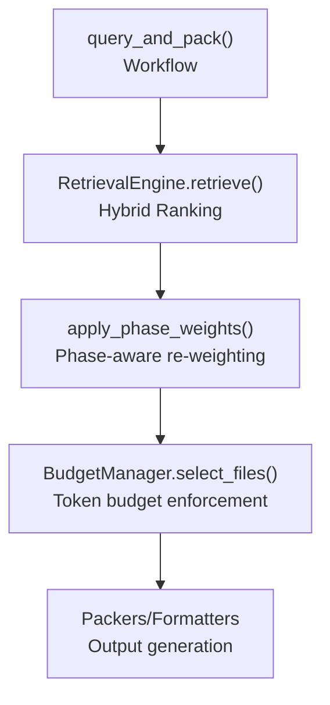
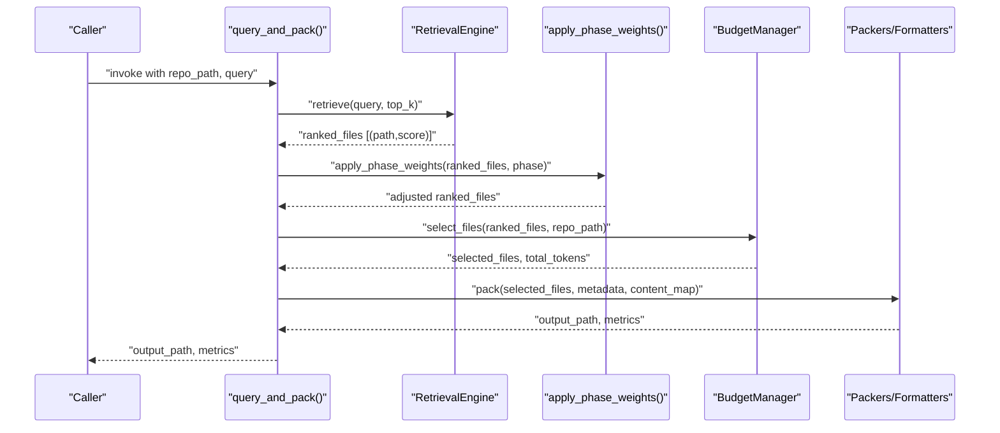
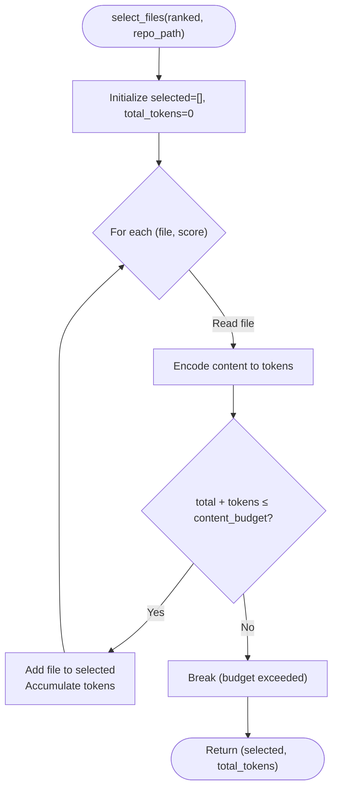
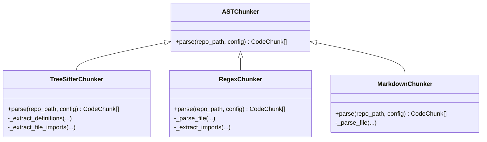
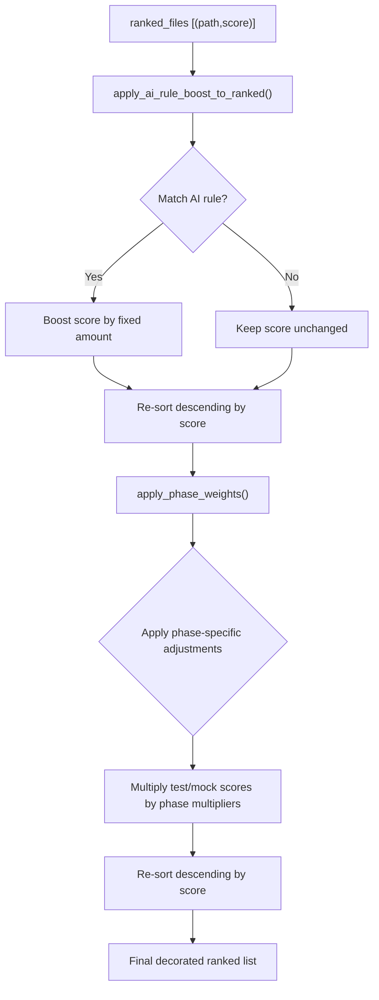
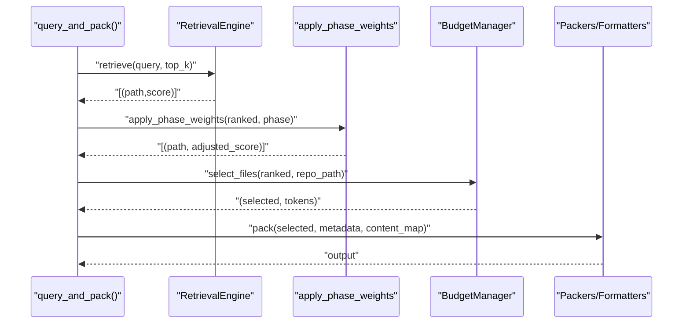

# Decorator Pattern & Enhancement

<cite>
**Referenced Files in This Document**
- [retrieval.py](file://src/ws_ctx_engine/retrieval/retrieval.py)
- [budget.py](file://src/ws_ctx_engine/budget/budget.py)
- [ranker.py](file://src/ws_ctx_engine/ranking/ranker.py)
- [phase_ranker.py](file://src/ws_ctx_engine/ranking/phase_ranker.py)
- [query.py](file://src/ws_ctx_engine/workflow/query.py)
- [indexer.py](file://src/ws_ctx_engine/workflow/indexer.py)
- [base.py](file://src/ws_ctx_engine/chunker/base.py)
- [regex.py](file://src/ws_ctx_engine/chunker/regex.py)
- [tree_sitter.py](file://src/ws_ctx_engine/chunker/tree_sitter.py)
- [markdown.py](file://src/ws_ctx_engine/chunker/markdown.py)
</cite>

## Table of Contents
1. [Introduction](#introduction)
2. [Project Structure](#project-structure)
3. [Core Components](#core-components)
4. [Architecture Overview](#architecture-overview)
5. [Detailed Component Analysis](#detailed-component-analysis)
6. [Dependency Analysis](#dependency-analysis)
7. [Performance Considerations](#performance-considerations)
8. [Troubleshooting Guide](#troubleshooting-guide)
9. [Conclusion](#conclusion)

## Introduction
This document explains how the Decorator pattern is used to enhance functionality without modifying core classes. It focuses on three enhancement categories:
- Budget decorators: Wrapping retrieval operations to enforce token limits.
- Chunk decorators: Adding metadata enrichment during parsing.
- Ranking decorators: Enhancing score calculations with phase-aware and AI-rule boosts.

We describe the decorator chain implementation, method interception, and how decorators compose to provide layered functionality. Examples reference concrete files and functions to illustrate composition patterns and extension points.

## Project Structure
The system orchestrates retrieval, budget enforcement, and output packing through a workflow that composes multiple functional layers:
- RetrievalEngine performs hybrid ranking and returns scored results.
- BudgetManager wraps the ranked list to enforce token budgets.
- Ranking utilities decorate scores with AI rule boosts and phase-aware adjustments.
- Chunkers decorate parsing with metadata enrichment (symbols, imports, language).
- Workflow composes these layers into a cohesive pipeline.

**Diagram sources**
- [query.py:350-366](file://src/ws_ctx_engine/workflow/query.py#L350-L366)
- [retrieval.py:250-368](file://src/ws_ctx_engine/retrieval/retrieval.py#L250-L368)
- [phase_ranker.py:96-122](file://src/ws_ctx_engine/ranking/phase_ranker.py#L96-L122)
- [budget.py:50-104](file://src/ws_ctx_engine/budget/budget.py#L50-L104)

**Section sources**
- [query.py:324-412](file://src/ws_ctx_engine/workflow/query.py#L324-L412)
- [indexer.py:404-492](file://src/ws_ctx_engine/workflow/indexer.py#L404-L492)

## Core Components
- RetrievalEngine: Central scoring engine that merges semantic and structural signals, then applies adaptive boosting and normalization.
- BudgetManager: Greedy selection enforcing token budget constraints.
- Ranking utilities: Functions that boost or adjust scores for AI rule files and agent phases.
- Chunkers: Parsers that extract code chunks enriched with symbols, imports, and language metadata.

These components are designed to be composable and interchangeable, enabling layered enhancements without altering core logic.

**Section sources**
- [retrieval.py:140-627](file://src/ws_ctx_engine/retrieval/retrieval.py#L140-L627)
- [budget.py:8-105](file://src/ws_ctx_engine/budget/budget.py#L8-L105)
- [ranker.py:28-86](file://src/ws_ctx_engine/ranking/ranker.py#L28-L86)
- [phase_ranker.py:96-122](file://src/ws_ctx_engine/ranking/phase_ranker.py#L96-L122)
- [base.py:41-176](file://src/ws_ctx_engine/chunker/base.py#L41-L176)
- [regex.py:15-219](file://src/ws_ctx_engine/chunker/regex.py#L15-L219)
- [tree_sitter.py:15-160](file://src/ws_ctx_engine/chunker/tree_sitter.py#L15-L160)
- [markdown.py:13-100](file://src/ws_ctx_engine/chunker/markdown.py#L13-L100)

## Architecture Overview
The decorator chain is implemented through function composition and layered processing:
- RetrievalEngine.retrieve() produces a ranked list of (file, score).
- apply_phase_weights() decorates scores based on agent phase.
- BudgetManager.select_files() filters the ranked list to fit token budget.
- Output packers/formatters decorate the final payload with metadata and content.

**Diagram sources**
- [query.py:230-617](file://src/ws_ctx_engine/workflow/query.py#L230-L617)
- [retrieval.py:250-368](file://src/ws_ctx_engine/retrieval/retrieval.py#L250-L368)
- [phase_ranker.py:96-122](file://src/ws_ctx_engine/ranking/phase_ranker.py#L96-L122)
- [budget.py:50-104](file://src/ws_ctx_engine/budget/budget.py#L50-L104)

## Detailed Component Analysis

### Budget Decorators: Enforcing Token Limits
BudgetManager wraps the ranked list to enforce token budgets:
- Reserves a portion of the budget for metadata and manifest.
- Iterates the ranked list and accumulates content tokens until the content budget is exhausted.
- Returns selected files and total tokens used.

**Diagram sources**
- [budget.py:50-104](file://src/ws_ctx_engine/budget/budget.py#L50-L104)

**Section sources**
- [budget.py:8-105](file://src/ws_ctx_engine/budget/budget.py#L8-L105)
- [query.py:381-412](file://src/ws_ctx_engine/workflow/query.py#L381-L412)

### Chunk Decorators: Metadata Enrichment During Parsing
Chunkers decorate parsing with metadata:
- TreeSitterChunker enriches chunks with symbols and imports via resolvers and import extraction.
- RegexChunker detects definitions and imports using language-specific regex patterns.
- MarkdownChunker splits documents into chunks by headings and annotates symbols accordingly.

**Diagram sources**
- [base.py:41-176](file://src/ws_ctx_engine/chunker/base.py#L41-L176)
- [tree_sitter.py:15-160](file://src/ws_ctx_engine/chunker/tree_sitter.py#L15-L160)
- [regex.py:15-219](file://src/ws_ctx_engine/chunker/regex.py#L15-L219)
- [markdown.py:13-100](file://src/ws_ctx_engine/chunker/markdown.py#L13-L100)

**Section sources**
- [tree_sitter.py:15-160](file://src/ws_ctx_engine/chunker/tree_sitter.py#L15-L160)
- [regex.py:15-219](file://src/ws_ctx_engine/chunker/regex.py#L15-L219)
- [markdown.py:13-100](file://src/ws_ctx_engine/chunker/markdown.py#L13-L100)

### Ranking Decorators: Enhanced Score Calculations
Ranking decorators enhance score calculations:
- apply_ai_rule_boost_to_ranked(): Applies a large score boost to canonical AI rule files and optionally user-defined extras, then re-sorts.
- apply_phase_weights(): Adjusts scores based on agent phase (e.g., test/mock boosts, token density targets).

**Diagram sources**
- [ranker.py:64-86](file://src/ws_ctx_engine/ranking/ranker.py#L64-L86)
- [phase_ranker.py:96-122](file://src/ws_ctx_engine/ranking/phase_ranker.py#L96-L122)

**Section sources**
- [ranker.py:28-86](file://src/ws_ctx_engine/ranking/ranker.py#L28-L86)
- [phase_ranker.py:96-122](file://src/ws_ctx_engine/ranking/phase_ranker.py#L96-L122)
- [query.py:356-366](file://src/ws_ctx_engine/workflow/query.py#L356-L366)

### Method Interception and Decorator Chain Composition
The workflow intercepts and decorates method outputs:
- RetrievalEngine.retrieve() returns a ranked list; the workflow intercepts it to apply phase weighting.
- apply_phase_weights() transforms scores and re-sorts.
- BudgetManager.select_files() intercepts the ranked list to filter by token budget.
- Output packers/formatters decorate the final payload with metadata and content.

**Diagram sources**
- [query.py:350-585](file://src/ws_ctx_engine/workflow/query.py#L350-L585)
- [retrieval.py:250-368](file://src/ws_ctx_engine/retrieval/retrieval.py#L250-L368)
- [phase_ranker.py:96-122](file://src/ws_ctx_engine/ranking/phase_ranker.py#L96-L122)
- [budget.py:50-104](file://src/ws_ctx_engine/budget/budget.py#L50-L104)

**Section sources**
- [query.py:324-617](file://src/ws_ctx_engine/workflow/query.py#L324-L617)

## Dependency Analysis
The decorator chain depends on clear interfaces and function composition:
- RetrievalEngine exposes retrieve() returning a ranked list.
- Ranking decorators operate on lists of (path, score) tuples.
- BudgetManager expects a ranked list and repo path to compute token counts.
- Workflow composes these layers and passes intermediate results between functions.

**Diagram sources**
- [retrieval.py:250-368](file://src/ws_ctx_engine/retrieval/retrieval.py#L250-L368)
- [phase_ranker.py:96-122](file://src/ws_ctx_engine/ranking/phase_ranker.py#L96-L122)
- [budget.py:50-104](file://src/ws_ctx_engine/budget/budget.py#L50-L104)
- [query.py:350-412](file://src/ws_ctx_engine/workflow/query.py#L350-L412)

**Section sources**
- [query.py:324-412](file://src/ws_ctx_engine/workflow/query.py#L324-L412)

## Performance Considerations
- Greedy budget selection: BudgetManager uses a greedy knapsack over a pre-ranked list, ensuring linear pass over the ranked items.
- Minimal overhead: Ranking decorators operate on lightweight tuples and re-sort only once per decorator stage.
- Chunk metadata enrichment: TreeSitterChunker and RegexChunker add metadata during parsing, avoiding post-hoc computation.

[No sources needed since this section provides general guidance]

## Troubleshooting Guide
Common issues and resolutions:
- Empty or insufficient ranked results: Verify retrieval succeeded and produced a non-empty list before applying decorators.
- Budget selection yields zero files: Increase token budget or reduce top_k to ensure at least one file fits.
- Phase-aware ranking failures: The workflow gracefully ignores phase weighting errors and continues with unmodified rankings.
- Missing tree-sitter dependencies: Install required packages for TreeSitterChunker to enable AST parsing.

**Section sources**
- [query.py:371-379](file://src/ws_ctx_engine/workflow/query.py#L371-L379)
- [query.py:356-366](file://src/ws_ctx_engine/workflow/query.py#L356-L366)
- [tree_sitter.py:32-37](file://src/ws_ctx_engine/chunker/tree_sitter.py#L32-L37)

## Conclusion
The system demonstrates practical decorator-style composition:
- Budget decorators wrap retrieval outputs to enforce token limits.
- Ranking decorators enhance scores with AI rule boosts and phase-aware adjustments.
- Chunk decorators enrich parsing with metadata for richer context.

This layered approach preserves core logic while enabling flexible, composable enhancements through function composition and clear interfaces.