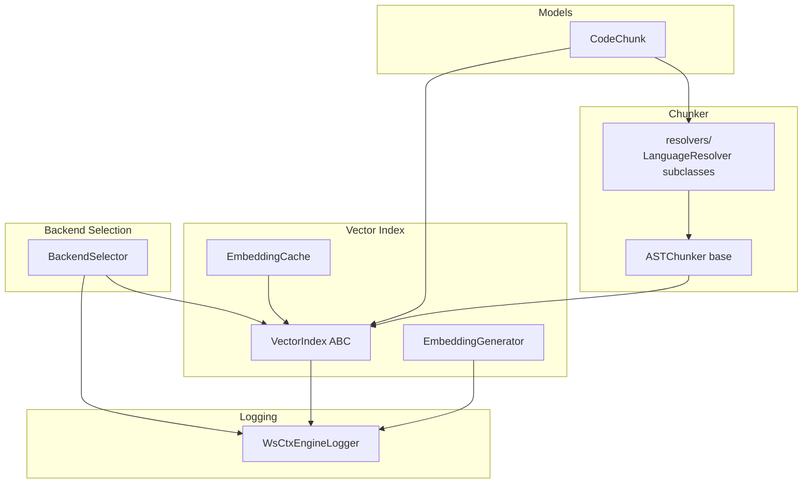
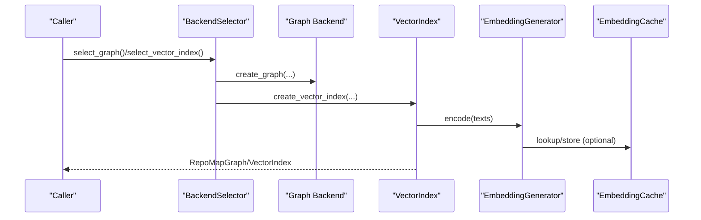
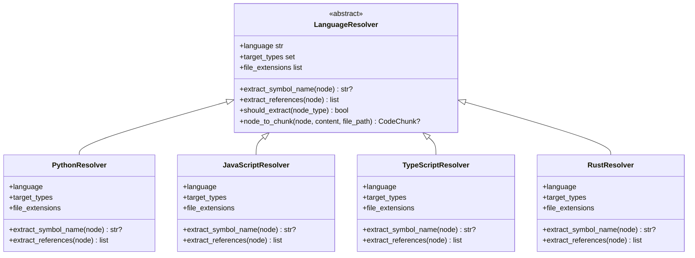
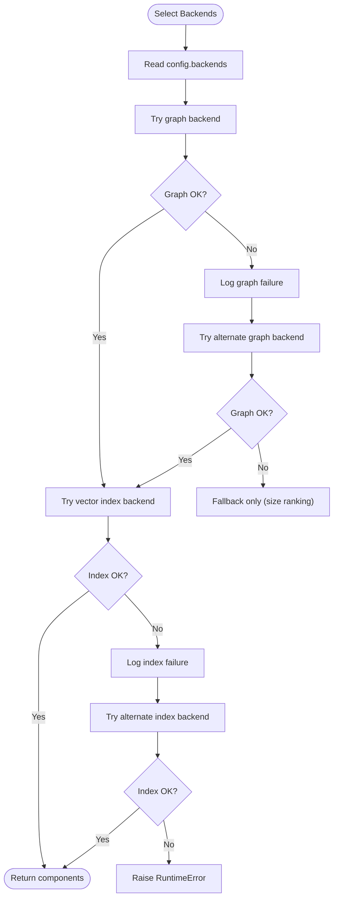
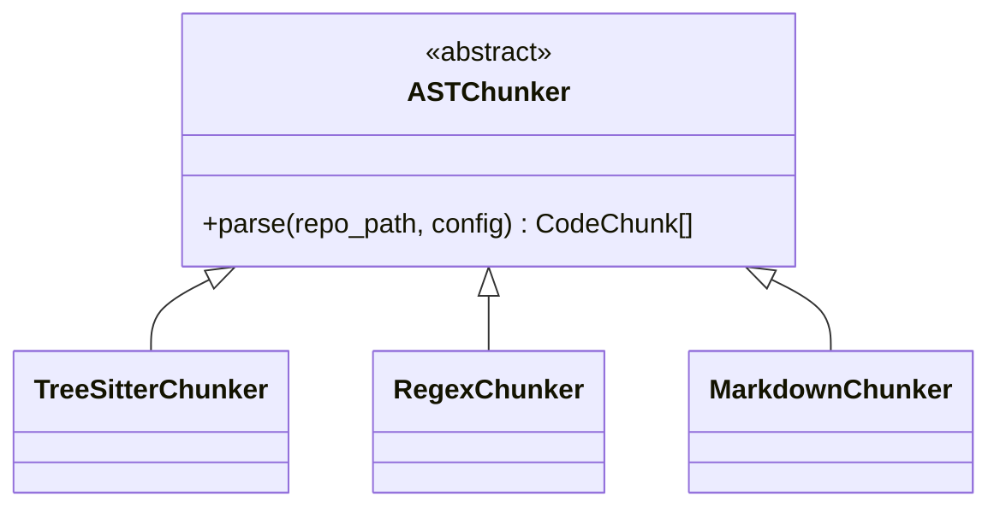
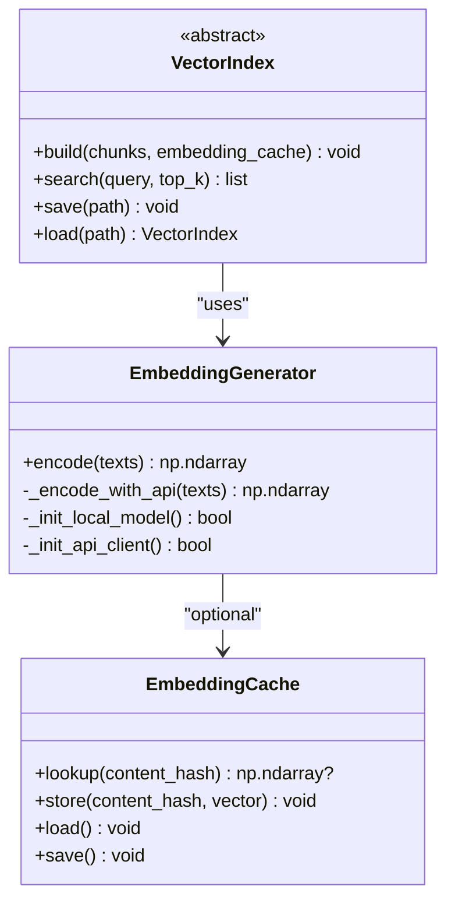
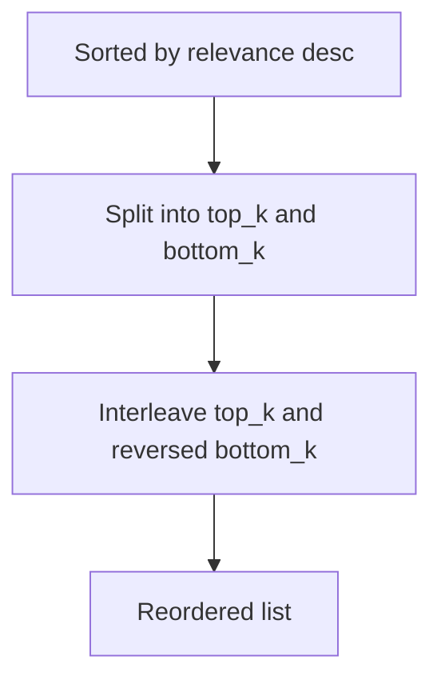
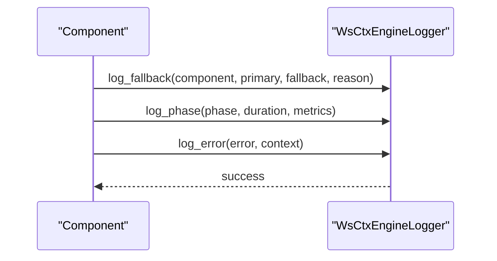
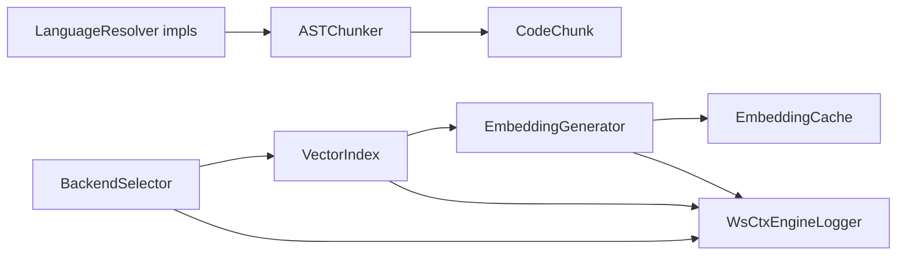

# Design Patterns & Architecture

<cite>
**Referenced Files in This Document**
- [backend_selector.py](file://src/ws_ctx_engine/backend_selector/backend_selector.py)
- [vector_index.py](file://src/ws_ctx_engine/vector_index/vector_index.py)
- [embedding_cache.py](file://src/ws_ctx_engine/vector_index/embedding_cache.py)
- [logger.py](file://src/ws_ctx_engine/logger/logger.py)
- [base.py](file://src/ws_ctx_engine/chunker/resolvers/base.py)
- [python.py](file://src/ws_ctx_engine/chunker/resolvers/python.py)
- [javascript.py](file://src/ws_ctx_engine/chunker/resolvers/javascript.py)
- [typescript.py](file://src/ws_ctx_engine/chunker/resolvers/typescript.py)
- [rust.py](file://src/ws_ctx_engine/chunker/resolvers/rust.py)
- [base_chunker.py](file://src/ws_ctx_engine/chunker/base.py)
- [chunker_init.py](file://src/ws_ctx_engine/chunker/__init__.py)
- [models.py](file://src/ws_ctx_engine/models/models.py)
- [packer.md](file://docs/reference/packer.md)
- [logging.md](file://docs/guides/logging.md)
- [design-ideas.md](file://docs/reference/design-ideas.md)
</cite>

## Table of Contents
1. [Introduction](#introduction)
2. [Project Structure](#project-structure)
3. [Core Components](#core-components)
4. [Architecture Overview](#architecture-overview)
5. [Detailed Component Analysis](#detailed-component-analysis)
6. [Dependency Analysis](#dependency-analysis)
7. [Performance Considerations](#performance-considerations)
8. [Troubleshooting Guide](#troubleshooting-guide)
9. [Conclusion](#conclusion)
10. [Appendices](#appendices)

## Introduction
This document explains the design patterns and architectural principles implemented in ws-ctx-engine, focusing on:
- Strategy pattern for language resolvers and backend selection
- Factory pattern for component creation
- Template Method pattern in the AST chunking pipeline
- Adapter pattern for embedding generation
- Decorator pattern for file ordering optimization
- Observer pattern for logging

It also provides code example paths, benefits for extensibility and maintainability, and guidelines for adding new patterns to the codebase.

## Project Structure
The ws-ctx-engine organizes functionality by feature domains:
- Chunking and language resolvers under chunker/
- Vector indexing and embeddings under vector_index/
- Logging under logger/
- Backend selection under backend_selector/
- Data models under models/

**Diagram sources**
- [base.py:41-44](file://src/ws_ctx_engine/chunker/base.py#L41-L44)
- [base.py:7-70](file://src/ws_ctx_engine/chunker/resolvers/base.py#L7-L70)
- [vector_index.py:21-84](file://src/ws_ctx_engine/vector_index/vector_index.py#L21-L84)
- [embedding_cache.py:28-127](file://src/ws_ctx_engine/vector_index/embedding_cache.py#L28-L127)
- [logger.py:13-145](file://src/ws_ctx_engine/logger/logger.py#L13-L145)
- [backend_selector.py:13-191](file://src/ws_ctx_engine/backend_selector/backend_selector.py#L13-L191)
- [models.py:10-85](file://src/ws_ctx_engine/models/models.py#L10-L85)

**Section sources**
- [base.py:1-176](file://src/ws_ctx_engine/chunker/base.py#L1-L176)
- [base.py:1-70](file://src/ws_ctx_engine/chunker/resolvers/base.py#L1-L70)
- [vector_index.py:1-800](file://src/ws_ctx_engine/vector_index/vector_index.py#L1-L800)
- [embedding_cache.py:1-127](file://src/ws_ctx_engine/vector_index/embedding_cache.py#L1-L127)
- [logger.py:1-145](file://src/ws_ctx_engine/logger/logger.py#L1-L145)
- [backend_selector.py:1-191](file://src/ws_ctx_engine/backend_selector/backend_selector.py#L1-L191)
- [models.py:1-152](file://src/ws_ctx_engine/models/models.py#L1-L152)

## Core Components
- Strategy pattern for language resolvers: Each LanguageResolver subclass defines language-specific extraction behavior, enabling pluggable parsing per language.
- Strategy pattern for backend selection: BackendSelector chooses optimal backends with graceful fallback chains.
- Adapter pattern for embeddings: EmbeddingGenerator adapts between local sentence-transformers and API providers transparently.
- Template Method in AST chunking: ASTChunker defines the skeleton for parsing, delegating language-specific steps to subclasses.
- Decorator pattern for ordering: File ordering transforms improve recall by shuffling top/bottom selections.
- Observer pattern for logging: WsCtxEngineLogger observes system events and logs structured messages.

**Section sources**
- [base.py:7-70](file://src/ws_ctx_engine/chunker/resolvers/base.py#L7-L70)
- [python.py:6-61](file://src/ws_ctx_engine/chunker/resolvers/python.py#L6-L61)
- [javascript.py:6-85](file://src/ws_ctx_engine/chunker/resolvers/javascript.py#L6-L85)
- [typescript.py:6-103](file://src/ws_ctx_engine/chunker/resolvers/typescript.py#L6-L103)
- [rust.py:6-55](file://src/ws_ctx_engine/chunker/resolvers/rust.py#L6-L55)
- [backend_selector.py:13-191](file://src/ws_ctx_engine/backend_selector/backend_selector.py#L13-L191)
- [vector_index.py:96-280](file://src/ws_ctx_engine/vector_index/vector_index.py#L96-L280)
- [base.py:41-44](file://src/ws_ctx_engine/chunker/base.py#L41-L44)
- [packer.md:51-109](file://docs/reference/packer.md#L51-L109)
- [logger.py:13-145](file://src/ws_ctx_engine/logger/logger.py#L13-L145)

## Architecture Overview
The system orchestrates chunking, indexing, and retrieval with layered abstractions and fallback strategies.

**Diagram sources**
- [backend_selector.py:36-118](file://src/ws_ctx_engine/backend_selector/backend_selector.py#L36-L118)
- [vector_index.py:96-280](file://src/ws_ctx_engine/vector_index/vector_index.py#L96-L280)
- [embedding_cache.py:89-127](file://src/ws_ctx_engine/vector_index/embedding_cache.py#L89-L127)

## Detailed Component Analysis

### Strategy Pattern: Language Resolvers
- Purpose: Encapsulate language-specific AST node extraction and symbol resolution.
- Implementation: Abstract base LanguageResolver with concrete subclasses for Python, JavaScript, TypeScript, and Rust.
- Benefits: Extensible per-language without changing the chunking pipeline; easy to add new languages.

**Diagram sources**
- [base.py:7-70](file://src/ws_ctx_engine/chunker/resolvers/base.py#L7-L70)
- [python.py:6-61](file://src/ws_ctx_engine/chunker/resolvers/python.py#L6-L61)
- [javascript.py:6-85](file://src/ws_ctx_engine/chunker/resolvers/javascript.py#L6-L85)
- [typescript.py:6-103](file://src/ws_ctx_engine/chunker/resolvers/typescript.py#L6-L103)
- [rust.py:6-55](file://src/ws_ctx_engine/chunker/resolvers/rust.py#L6-L55)

**Section sources**
- [base.py:7-70](file://src/ws_ctx_engine/chunker/resolvers/base.py#L7-L70)
- [python.py:6-61](file://src/ws_ctx_engine/chunker/resolvers/python.py#L6-L61)
- [javascript.py:6-85](file://src/ws_ctx_engine/chunker/resolvers/javascript.py#L6-L85)
- [typescript.py:6-103](file://src/ws_ctx_engine/chunker/resolvers/typescript.py#L6-L103)
- [rust.py:6-55](file://src/ws_ctx_engine/chunker/resolvers/rust.py#L6-L55)

### Strategy Pattern: Backend Selection
- Purpose: Centralize backend selection with graceful fallback chains for graph and vector index.
- Implementation: BackendSelector reads configuration and attempts backends in priority order, logging failures and raising on total failure.
- Benefits: Robust deployment across environments; minimal code changes when swapping backends.

**Diagram sources**
- [backend_selector.py:36-118](file://src/ws_ctx_engine/backend_selector/backend_selector.py#L36-L118)

**Section sources**
- [backend_selector.py:13-191](file://src/ws_ctx_engine/backend_selector/backend_selector.py#L13-L191)

### Factory Pattern: Component Creation
- Purpose: Provide centralized factories for creating graph and vector index instances with consistent configuration.
- Implementation: BackendSelector exposes create_* functions that encapsulate instantiation and fallback logic.
- Benefits: Consistent initialization, centralized configuration, and simplified caller code.

**Section sources**
- [backend_selector.py:180-191](file://src/ws_ctx_engine/backend_selector/backend_selector.py#L180-L191)

### Template Method Pattern: AST Chunking Pipeline
- Purpose: Define the skeleton of the AST chunking process while allowing language-specific steps to vary.
- Implementation: ASTChunker declares the high-level algorithm; concrete chunkers override specific steps (e.g., node traversal, symbol extraction).
- Benefits: Clear separation of concerns; easy to introduce new chunking strategies without duplicating orchestration logic.

**Diagram sources**
- [base.py:41-44](file://src/ws_ctx_engine/chunker/base.py#L41-L44)

**Section sources**
- [base.py:41-44](file://src/ws_ctx_engine/chunker/base.py#L41-L44)

### Adapter Pattern: Embedding Generation
- Purpose: Provide a unified interface for generating embeddings, switching between local and API providers transparently.
- Implementation: EmbeddingGenerator initializes local models when available and falls back to API clients on memory or error conditions, logging transitions.
- Benefits: Clean abstraction over heterogeneous providers; robustness through fallbacks.

**Diagram sources**
- [vector_index.py:21-84](file://src/ws_ctx_engine/vector_index/vector_index.py#L21-L84)
- [vector_index.py:96-280](file://src/ws_ctx_engine/vector_index/vector_index.py#L96-L280)
- [embedding_cache.py:28-127](file://src/ws_ctx_engine/vector_index/embedding_cache.py#L28-L127)

**Section sources**
- [vector_index.py:96-280](file://src/ws_ctx_engine/vector_index/vector_index.py#L96-L280)
- [embedding_cache.py:28-127](file://src/ws_ctx_engine/vector_index/embedding_cache.py#L28-L127)

### Decorator Pattern: File Ordering Optimization
- Purpose: Improve model recall by reordering selected files to mitigate “lost in the middle” effects.
- Implementation: The ordering transform interleaves top-ranked files at the beginning and end of the context window.
- Benefits: Enhanced retrieval quality with minimal changes to the upstream ranking pipeline.

**Diagram sources**
- [packer.md:51-109](file://docs/reference/packer.md#L51-L109)

**Section sources**
- [packer.md:51-109](file://docs/reference/packer.md#L51-L109)

### Observer Pattern: Logging
- Purpose: Centralize structured logging across components with dual output (console and file) and specialized log methods.
- Implementation: WsCtxEngineLogger provides methods for fallback events, phase timing, and error logging; get_logger returns a singleton instance.
- Benefits: Consistent observability, configurable verbosity, and contextual error reporting.

**Diagram sources**
- [logger.py:64-125](file://src/ws_ctx_engine/logger/logger.py#L64-L125)

**Section sources**
- [logger.py:13-145](file://src/ws_ctx_engine/logger/logger.py#L13-L145)
- [logging.md:81-100](file://docs/guides/logging.md#L81-L100)

## Dependency Analysis
Key dependencies and their roles:
- Chunkers depend on LanguageResolver implementations and CodeChunk models.
- VectorIndex implementations depend on EmbeddingGenerator and optionally EmbeddingCache.
- BackendSelector coordinates graph and index creation and logs outcomes.
- Logger is used across components for structured event observation.

**Diagram sources**
- [base.py:7-70](file://src/ws_ctx_engine/chunker/resolvers/base.py#L7-L70)
- [base.py:41-44](file://src/ws_ctx_engine/chunker/base.py#L41-L44)
- [models.py:10-85](file://src/ws_ctx_engine/models/models.py#L10-L85)
- [vector_index.py:21-84](file://src/ws_ctx_engine/vector_index/vector_index.py#L21-L84)
- [vector_index.py:96-280](file://src/ws_ctx_engine/vector_index/vector_index.py#L96-L280)
- [embedding_cache.py:28-127](file://src/ws_ctx_engine/vector_index/embedding_cache.py#L28-L127)
- [backend_selector.py:13-191](file://src/ws_ctx_engine/backend_selector/backend_selector.py#L13-L191)
- [logger.py:13-145](file://src/ws_ctx_engine/logger/logger.py#L13-L145)

**Section sources**
- [base.py:7-70](file://src/ws_ctx_engine/chunker/resolvers/base.py#L7-L70)
- [base.py:41-44](file://src/ws_ctx_engine/chunker/base.py#L41-L44)
- [models.py:10-85](file://src/ws_ctx_engine/models/models.py#L10-L85)
- [vector_index.py:21-84](file://src/ws_ctx_engine/vector_index/vector_index.py#L21-L84)
- [vector_index.py:96-280](file://src/ws_ctx_engine/vector_index/vector_index.py#L96-L280)
- [embedding_cache.py:28-127](file://src/ws_ctx_engine/vector_index/embedding_cache.py#L28-L127)
- [backend_selector.py:13-191](file://src/ws_ctx_engine/backend_selector/backend_selector.py#L13-L191)
- [logger.py:13-145](file://src/ws_ctx_engine/logger/logger.py#L13-L145)

## Performance Considerations
- Strategy pattern reduces overhead by isolating language-specific logic; choose resolvers appropriate to the codebase to minimize unnecessary parsing.
- Adapter pattern’s fallback to API embeddings avoids out-of-memory scenarios locally, trading latency for reliability.
- Decorator-style ordering improves recall without altering ranking algorithms, reducing re-ranking costs.
- Logger overhead is minimal due to level-based filtering and structured formatting.

[No sources needed since this section provides general guidance]

## Troubleshooting Guide
- Backend selection failures: Review fallback levels and logs to identify failing components; adjust configuration to prioritize available backends.
- Embedding generation errors: Inspect memory thresholds and API client initialization; ensure environment variables are set for API fallback.
- Logging issues: Verify dual handler setup and file permissions; confirm structured format and level filtering meet requirements.

**Section sources**
- [backend_selector.py:158-177](file://src/ws_ctx_engine/backend_selector/backend_selector.py#L158-L177)
- [vector_index.py:130-280](file://src/ws_ctx_engine/vector_index/vector_index.py#L130-L280)
- [logger.py:43-125](file://src/ws_ctx_engine/logger/logger.py#L43-L125)
- [logging.md:81-100](file://docs/guides/logging.md#L81-L100)

## Conclusion
ws-ctx-engine leverages well-established patterns to achieve modularity, resilience, and maintainability:
- Strategy enables language extensibility and backend adaptability
- Factory centralizes component creation
- Template Method standardizes chunking orchestration
- Adapter unifies heterogeneous providers
- Decorator enhances retrieval quality
- Observer provides consistent observability

These patterns collectively support incremental evolution and robust operation across diverse environments.

[No sources needed since this section summarizes without analyzing specific files]

## Appendices

### Guidelines for Implementing New Patterns
- Strategy: Introduce an abstract base and concrete subclasses for interchangeable behaviors; register new variants in the public API surface.
- Factory: Encapsulate construction logic behind a single entry point; handle configuration and fallbacks centrally.
- Template Method: Define the skeleton in an abstract class and delegate language-specific steps to subclasses.
- Adapter: Wrap external APIs behind a unified interface; implement fallbacks and logging for transitions.
- Decorator: Apply transformations to outputs (e.g., ordering) without modifying core algorithms.
- Observer: Use a centralized logger with structured methods for consistent event recording.

**Section sources**
- [base.py:7-70](file://src/ws_ctx_engine/chunker/resolvers/base.py#L7-L70)
- [backend_selector.py:180-191](file://src/ws_ctx_engine/backend_selector/backend_selector.py#L180-L191)
- [base.py:41-44](file://src/ws_ctx_engine/chunker/base.py#L41-L44)
- [vector_index.py:96-280](file://src/ws_ctx_engine/vector_index/vector_index.py#L96-L280)
- [packer.md:51-109](file://docs/reference/packer.md#L51-L109)
- [logger.py:64-125](file://src/ws_ctx_engine/logger/logger.py#L64-L125)