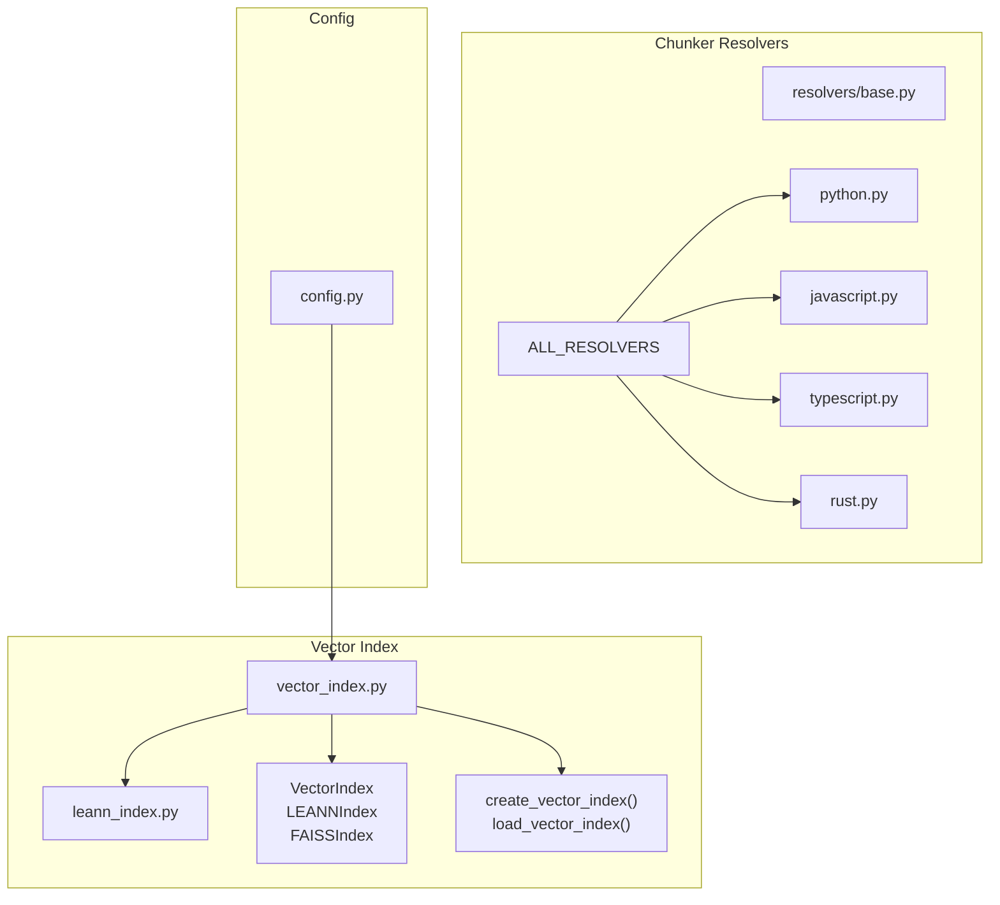
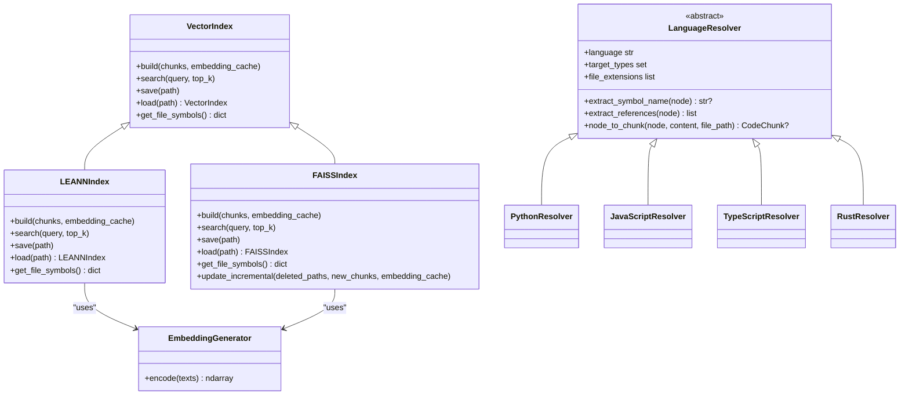
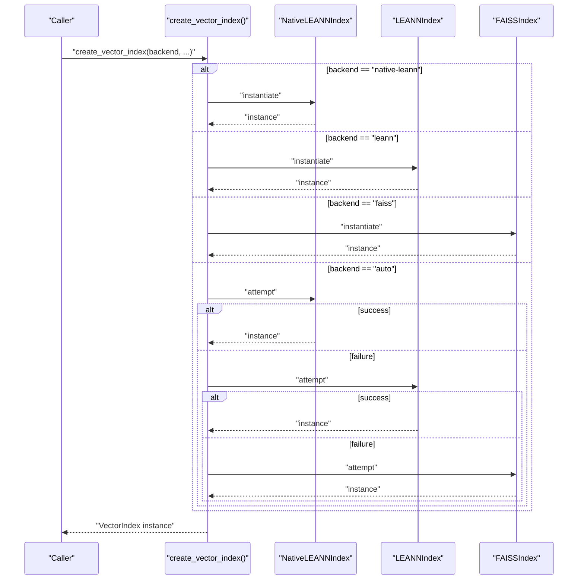
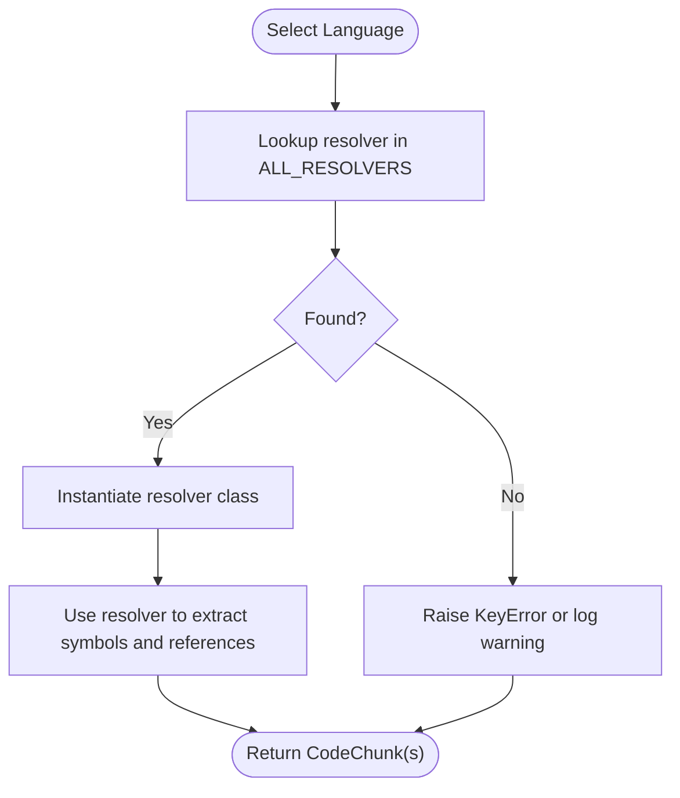
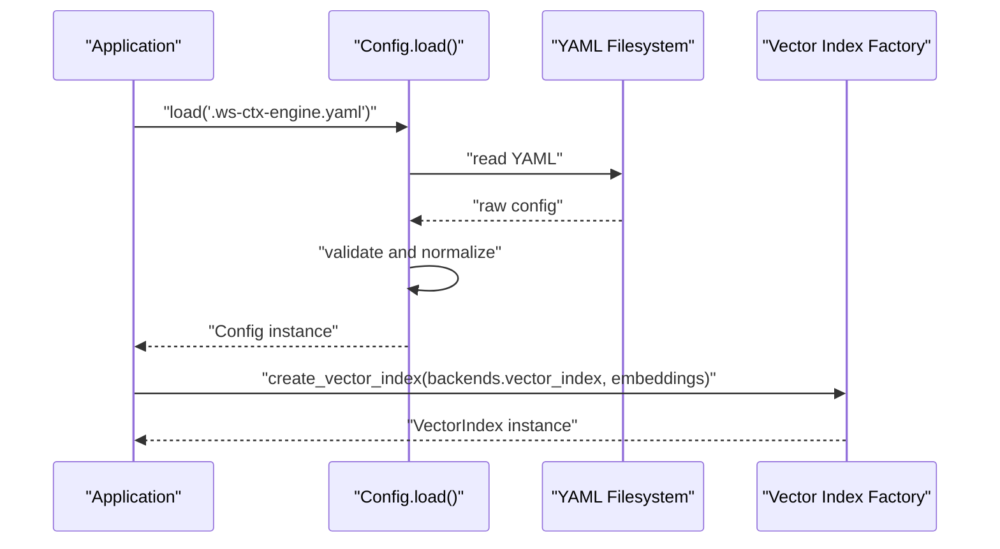
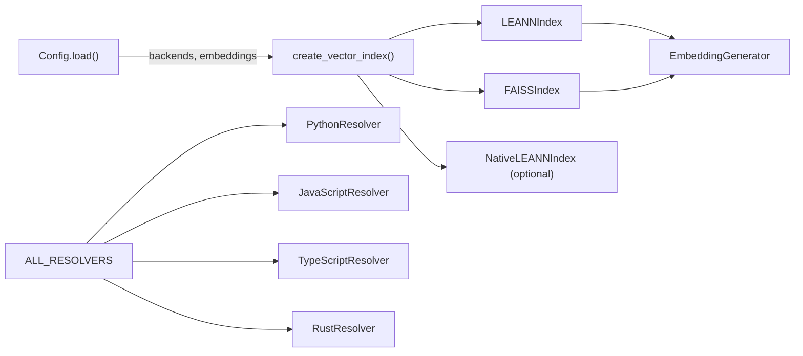

# Factory Pattern & Component Creation

<cite>
**Referenced Files in This Document**
- [vector_index.py](file://src/ws_ctx_engine/vector_index/vector_index.py)
- [leann_index.py](file://src/ws_ctx_engine/vector_index/leann_index.py)
- [__init__.py](file://src/ws_ctx_engine/vector_index/__init__.py)
- [base.py](file://src/ws_ctx_engine/chunker/resolvers/base.py)
- [python.py](file://src/ws_ctx_engine/chunker/resolvers/pythonResolver.py)
- [javascript.py](file://src/ws_ctx_engine/chunker/resolvers/JavaScriptResolver.py)
- [typescript.py](file://src/ws_ctx_engine/chunker/resolvers/TypeScriptResolver.py)
- [rust.py](file://src/ws_ctx_engine/chunker/resolvers/RustResolver.py)
- [__init__.py](file://src/ws_ctx_engine/chunker/resolvers/__init__.py)
- [__init__.py](file://src/ws_ctx_engine/chunker/__init__.py)
- [config.py](file://src/ws_ctx_engine/config/config.py)
</cite>

## Table of Contents
1. [Introduction](#introduction)
2. [Project Structure](#project-structure)
3. [Core Components](#core-components)
4. [Architecture Overview](#architecture-overview)
5. [Detailed Component Analysis](#detailed-component-analysis)
6. [Dependency Analysis](#dependency-analysis)
7. [Performance Considerations](#performance-considerations)
8. [Troubleshooting Guide](#troubleshooting-guide)
9. [Conclusion](#conclusion)

## Introduction
This document explains the Factory pattern implementation used for component creation across the system. It focuses on:
- Vector index factories that select and instantiate appropriate backends (LEANN, FAISS)
- Chunker factories that instantiate language-specific resolvers
- Configuration factories that build component hierarchies based on user settings

It documents factory methods, object creation logic, dependency injection patterns, lifecycle management, and how to register new components with existing factories.

## Project Structure
The relevant modules for factory patterns are organized by feature area:
- Vector index factory and backends: vector_index module
- Chunker resolvers and language-specific factories: chunker/resolvers
- Configuration-driven component construction: config module

**Diagram sources**
- [vector_index.py](file://src/ws_ctx_engine/vector_index/vector_index.py)
- [leann_index.py](file://src/ws_ctx_engine/vector_index/leann_index.py)
- [base.py](file://src/ws_ctx_engine/chunker/resolvers/base.py)
- [python.py](file://src/ws_ctx_engine/chunker/resolvers/python.py)
- [javascript.py](file://src/ws_ctx_engine/chunker/resolvers/javascript.py)
- [typescript.py](file://src/ws_ctx_engine/chunker/resolvers/typescript.py)
- [rust.py](file://src/ws_ctx_engine/chunker/resolvers/rust.py)
- [__init__.py](file://src/ws_ctx_engine/chunker/resolvers/__init__.py)
- [config.py](file://src/ws_ctx_engine/config/config.py)

**Section sources**
- [vector_index.py](file://src/ws_ctx_engine/vector_index/vector_index.py)
- [__init__.py](file://src/ws_ctx_engine/vector_index/__init__.py)
- [base.py](file://src/ws_ctx_engine/chunker/resolvers/base.py)
- [__init__.py](file://src/ws_ctx_engine/chunker/resolvers/__init__.py)
- [config.py](file://src/ws_ctx_engine/config/config.py)

## Core Components
- Vector index factory: create_vector_index selects a backend with automatic fallback and returns a VectorIndex instance. load_vector_index detects backend type from persisted metadata and loads accordingly.
- Chunker resolver registry: ALL_RESOLVERS maps language identifiers to concrete resolver classes, enabling language-specific parsing.
- Configuration-driven construction: Config.load reads .ws-ctx-engine.yaml and validates fields, including backends and embeddings settings that influence component creation.

Key responsibilities:
- Vector index factory: encapsulates backend selection policy and instantiation logic.
- Resolver factory: central registry for language-specific parsers.
- Config factory: validates and normalizes user settings to drive component construction.

**Section sources**
- [vector_index.py](file://src/ws_ctx_engine/vector_index/vector_index.py)
- [__init__.py](file://src/ws_ctx_engine/vector_index/__init__.py)
- [__init__.py](file://src/ws_ctx_engine/chunker/resolvers/__init__.py)
- [config.py](file://src/ws_ctx_engine/config/config.py)

## Architecture Overview
The factory architecture separates concerns:
- Factory methods encapsulate creation logic and policy decisions
- Concrete components implement shared interfaces
- Configuration drives which factories are invoked and how they are parameterized

**Diagram sources**
- [vector_index.py](file://src/ws_ctx_engine/vector_index/vector_index.py)
- [base.py](file://src/ws_ctx_engine/chunker/resolvers/base.py)
- [python.py](file://src/ws_ctx_engine/chunker/resolvers/python.py)
- [javascript.py](file://src/ws_ctx_engine/chunker/resolvers/javascript.py)
- [typescript.py](file://src/ws_ctx_engine/chunker/resolvers/typescript.py)
- [rust.py](file://src/ws_ctx_engine/chunker/resolvers/rust.py)

## Detailed Component Analysis

### Vector Index Factory
The vector index factory provides two primary entry points:
- create_vector_index: constructs a VectorIndex instance based on backend selection policy
- load_vector_index: restores a previously persisted index by detecting backend metadata

Backend selection policy:
- native-leann: attempts to create a native LEANN backend; falls back to other backends if unavailable
- leann: creates a cosine-similarity LEANN implementation
- faiss: creates a FAISS-backed index
- auto: tries native LEANN first, then LEANN, then FAISS, logging fallbacks

Object creation logic:
- Factory imports backends conditionally to handle missing optional dependencies
- On success, returns a concrete VectorIndex subclass instance
- On failure, raises a descriptive error indicating the failing backend and remediation steps

Lifecycle management:
- build initializes embedding generation and computes embeddings per file
- save persists index state and metadata
- load reconstructs the index from disk, restoring state and embedding generator configuration

**Diagram sources**
- [vector_index.py](file://src/ws_ctx_engine/vector_index/vector_index.py)

**Section sources**
- [vector_index.py](file://src/ws_ctx_engine/vector_index/vector_index.py)
- [__init__.py](file://src/ws_ctx_engine/vector_index/__init__.py)

### Chunker Resolver Factory
The resolver factory is a registry pattern:
- ALL_RESOLVERS maps language identifiers to concrete resolver classes
- Each resolver implements LanguageResolver with language-specific extraction logic

Usage pattern:
- Select resolver by language key from ALL_RESOLVERS
- Instantiate the resolver class to process AST nodes for a given language

**Diagram sources**
- [__init__.py](file://src/ws_ctx_engine/chunker/resolvers/__init__.py)
- [base.py](file://src/ws_ctx_engine/chunker/resolvers/base.py)

**Section sources**
- [__init__.py](file://src/ws_ctx_engine/chunker/resolvers/__init__.py)
- [base.py](file://src/ws_ctx_engine/chunker/resolvers/base.py)
- [python.py](file://src/ws_ctx_engine/chunker/resolvers/python.py)
- [javascript.py](file://src/ws_ctx_engine/chunker/resolvers/javascript.py)
- [typescript.py](file://src/ws_ctx_engine/chunker/resolvers/typescript.py)
- [rust.py](file://src/ws_ctx_engine/chunker/resolvers/rust.py)

### Configuration Factory
The configuration factory is implemented as a dataclass with a load method:
- Loads YAML settings from .ws-ctx-engine.yaml with graceful defaults
- Validates and normalizes fields, including:
  - backends: vector_index, graph, embeddings selection
  - embeddings: model, device, batch_size, API provider and key environment variable
  - performance: cache_embeddings, incremental_index flags

Dependency injection pattern:
- Config fields are passed to downstream factories/components (e.g., vector index factory receives embeddings settings)
- Backends selection influences which factory methods are invoked

**Diagram sources**
- [config.py](file://src/ws_ctx_engine/config/config.py)
- [vector_index.py](file://src/ws_ctx_engine/vector_index/vector_index.py)

**Section sources**
- [config.py](file://src/ws_ctx_engine/config/config.py)

## Dependency Analysis
- Vector index factory depends on:
  - Concrete backend classes (LEANNIndex, FAISSIndex)
  - Optional native backend (NativeLEANNIndex) imported conditionally
  - EmbeddingGenerator for vectorization
- Chunker resolver factory depends on:
  - LanguageResolver base class
  - Concrete resolvers for supported languages
- Configuration factory depends on:
  - YAML parsing and validation utilities
  - Logger for warnings and fallback messages

**Diagram sources**
- [vector_index.py](file://src/ws_ctx_engine/vector_index/vector_index.py)
- [__init__.py](file://src/ws_ctx_engine/vector_index/__init__.py)
- [__init__.py](file://src/ws_ctx_engine/chunker/resolvers/__init__.py)
- [config.py](file://src/ws_ctx_engine/config/config.py)

**Section sources**
- [vector_index.py](file://src/ws_ctx_engine/vector_index/vector_index.py)
- [__init__.py](file://src/ws_ctx_engine/vector_index/__init__.py)
- [__init__.py](file://src/ws_ctx_engine/chunker/resolvers/__init__.py)
- [config.py](file://src/ws_ctx_engine/config/config.py)

## Performance Considerations
- Vector index factory:
  - Native LEANN offers significant storage savings and is prioritized when available
  - FAISS provides exact brute-force search with IndexIDMap2 for incremental updates
  - EmbeddingGenerator dynamically chooses local vs API encoding based on memory availability
- Chunker resolver factory:
  - Registry lookup is O(1) dictionary access
  - Concrete resolvers operate on AST nodes; performance depends on language parser availability and Tree-sitter fallback
- Configuration factory:
  - YAML parsing and validation occur once at startup; subsequent reads are inexpensive

[No sources needed since this section provides general guidance]

## Troubleshooting Guide
Common issues and resolutions:
- Vector index factory failures:
  - Missing optional native backend: install the required package or choose a different backend
  - Out of memory during local embedding: switch to API provider or reduce batch size
  - FAISS not installed: install faiss-cpu or choose another backend
- Chunker resolver factory failures:
  - Unsupported language: ensure the language identifier exists in ALL_RESOLVERS
  - Missing Tree-sitter bindings: fallback to RegexChunker or install Tree-sitter grammars
- Configuration factory failures:
  - Invalid YAML or missing fields: validate .ws-ctx-engine.yaml against documented schema
  - Backend selection conflicts: adjust backends configuration to valid values

**Section sources**
- [vector_index.py](file://src/ws_ctx_engine/vector_index/vector_index.py)
- [__init__.py](file://src/ws_ctx_engine/chunker/resolvers/__init__.py)
- [config.py](file://src/ws_ctx_engine/config/config.py)

## Conclusion
The system employs robust Factory patterns to manage component creation:
- Vector index factory encapsulates backend selection and instantiation with clear fallback policies
- Chunker resolver factory provides a centralized registry for language-specific parsing
- Configuration factory validates and normalizes settings that drive component construction

These patterns enable extensibility, maintainability, and predictable lifecycle management across the system.