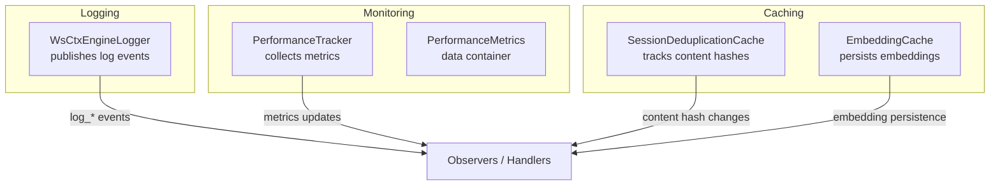
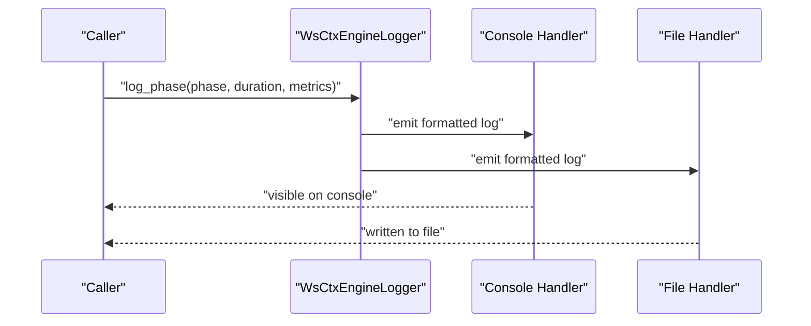
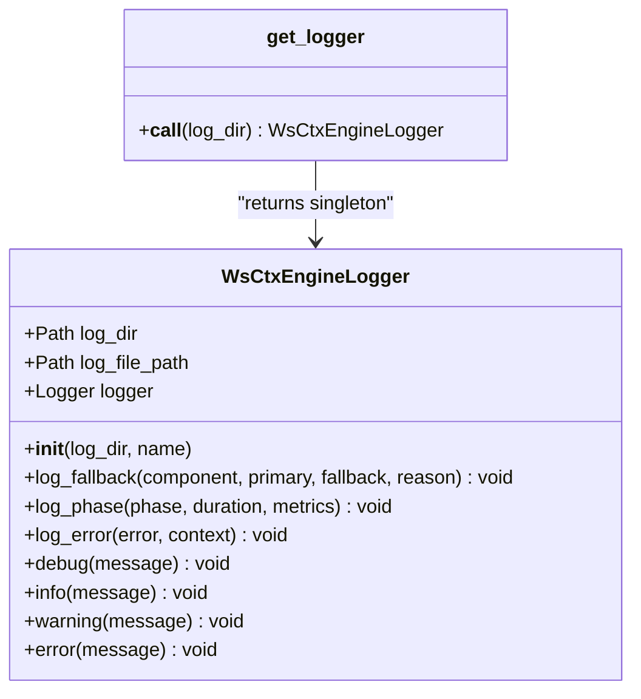
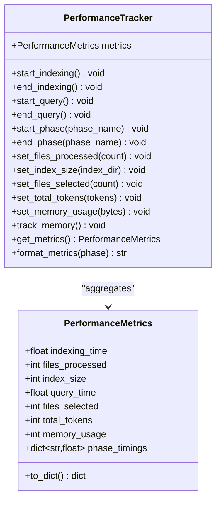
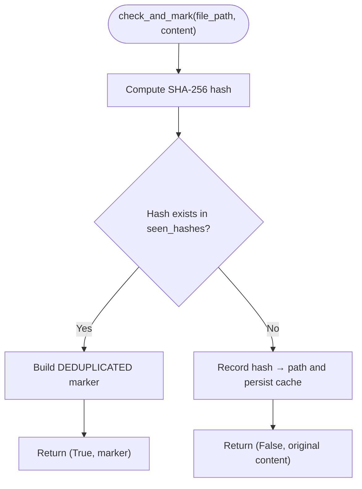
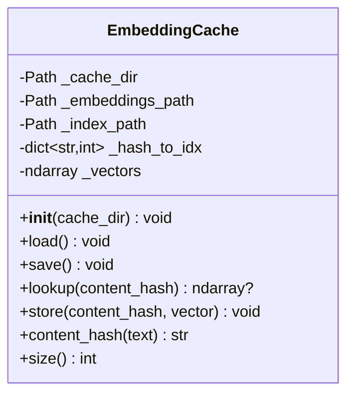
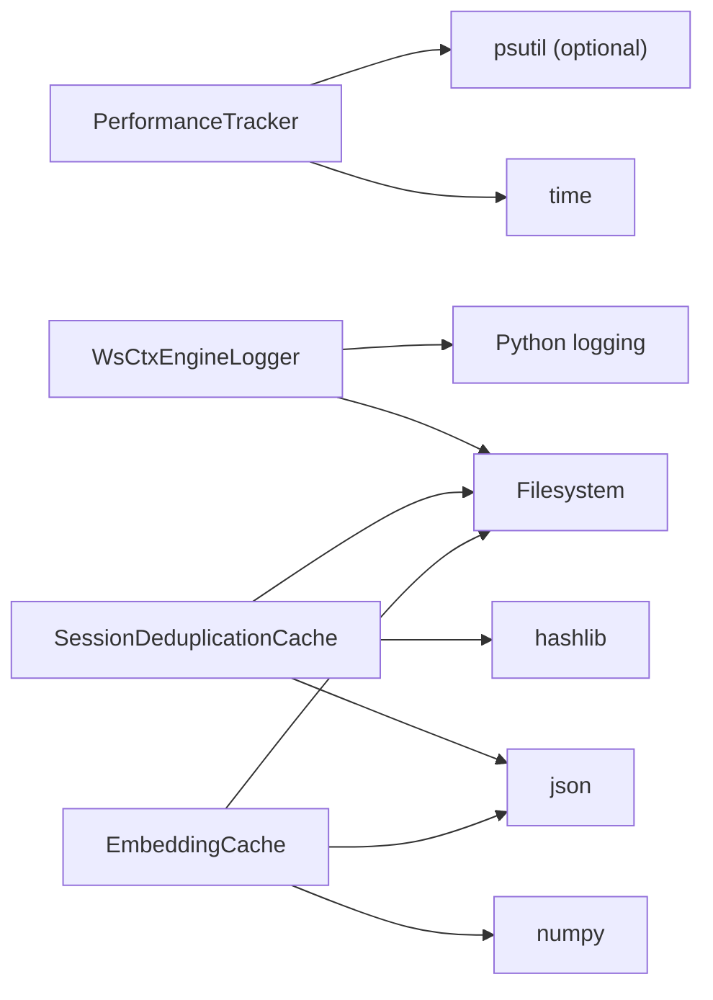

# Observer Pattern & Event Handling

<cite>
**Referenced Files in This Document**
- [logger.py](file://src/ws_ctx_engine/logger/logger.py)
- [performance.py](file://src/ws_ctx_engine/monitoring/performance.py)
- [dedup_cache.py](file://src/ws_ctx_engine/session/dedup_cache.py)
- [embedding_cache.py](file://src/ws_ctx_engine/vector_index/embedding_cache.py)
- [logger_demo.py](file://examples/logger_demo.py)
- [test_logger.py](file://tests/unit/test_logger.py)
- [test_session_dedup_cache.py](file://tests/unit/test_session_dedup_cache.py)
- [__init__.py](file://src/ws_ctx_engine/__init__.py)
</cite>

## Table of Contents
1. [Introduction](#introduction)
2. [Project Structure](#project-structure)
3. [Core Components](#core-components)
4. [Architecture Overview](#architecture-overview)
5. [Detailed Component Analysis](#detailed-component-analysis)
6. [Dependency Analysis](#dependency-analysis)
7. [Performance Considerations](#performance-considerations)
8. [Troubleshooting Guide](#troubleshooting-guide)
9. [Conclusion](#conclusion)

## Introduction
This document explains how the Observer pattern is implemented across logging, monitoring, and caching subsystems in the ws-ctx-engine project. It focuses on:
- How WsCtxEngineLogger acts as an observable subject that emits log events to registered observers (handlers)
- How performance monitors observe system metrics during indexing and query operations
- How cache observers track content changes and deduplicate repeated content

We also describe observer registration, notification mechanisms, and the event-driven architecture, with practical examples and diagrams that map to actual source files.

## Project Structure
The Observer pattern touches three primary areas:
- Logging: WsCtxEngineLogger publishes structured log events
- Monitoring: PerformanceTracker collects and exposes metrics
- Caching: SessionDeduplicationCache and EmbeddingCache persistently track content changes

**Diagram sources**
- [logger.py:13-145](file://src/ws_ctx_engine/logger/logger.py#L13-L145)
- [performance.py:13-263](file://src/ws_ctx_engine/monitoring/performance.py#L13-L263)
- [dedup_cache.py:35-154](file://src/ws_ctx_engine/session/dedup_cache.py#L35-L154)
- [embedding_cache.py:28-127](file://src/ws_ctx_engine/vector_index/embedding_cache.py#L28-L127)

**Section sources**
- [logger.py:13-145](file://src/ws_ctx_engine/logger/logger.py#L13-L145)
- [performance.py:72-263](file://src/ws_ctx_engine/monitoring/performance.py#L72-L263)
- [dedup_cache.py:35-154](file://src/ws_ctx_engine/session/dedup_cache.py#L35-L154)
- [embedding_cache.py:28-127](file://src/ws_ctx_engine/vector_index/embedding_cache.py#L28-L127)

## Core Components
- WsCtxEngineLogger: Centralized logging subject emitting structured log events to console and file handlers. Provides convenience methods for fallback, phase completion, and error logging.
- PerformanceTracker: Tracks timing, file counts, index sizes, token counts, and memory usage; exposes metrics for observation.
- SessionDeduplicationCache: Persists content hashes per session; acts as an observer of content changes and provides dedup markers when content repeats.
- EmbeddingCache: Persists content-hash to embedding mappings; logs load/save events that can be observed by external systems.

Key implementation references:
- Logger subject and methods: [logger.py:13-145](file://src/ws_ctx_engine/logger/logger.py#L13-L145)
- Performance metrics and tracker: [performance.py:13-263](file://src/ws_ctx_engine/monitoring/performance.py#L13-L263)
- Session cache observer: [dedup_cache.py:35-154](file://src/ws_ctx_engine/session/dedup_cache.py#L35-L154)
- Embedding cache persistence: [embedding_cache.py:28-127](file://src/ws_ctx_engine/vector_index/embedding_cache.py#L28-L127)

**Section sources**
- [logger.py:13-145](file://src/ws_ctx_engine/logger/logger.py#L13-L145)
- [performance.py:72-263](file://src/ws_ctx_engine/monitoring/performance.py#L72-L263)
- [dedup_cache.py:35-154](file://src/ws_ctx_engine/session/dedup_cache.py#L35-L154)
- [embedding_cache.py:28-127](file://src/ws_ctx_engine/vector_index/embedding_cache.py#L28-L127)

## Architecture Overview
The system follows an event-driven architecture:
- Subjects emit events: WsCtxEngineLogger emits log events; PerformanceTracker emits metric snapshots; caches emit persistence events
- Observers react: Handlers receive log events; external systems monitor metrics; downstream components consume dedup markers and embedding updates

**Diagram sources**
- [logger.py:79-94](file://src/ws_ctx_engine/logger/logger.py#L79-L94)
- [logger.py:43-62](file://src/ws_ctx_engine/logger/logger.py#L43-L62)

**Section sources**
- [logger.py:79-94](file://src/ws_ctx_engine/logger/logger.py#L79-L94)
- [logger.py:43-62](file://src/ws_ctx_engine/logger/logger.py#L43-L62)

## Detailed Component Analysis

### WsCtxEngineLogger: Observable Subject for Log Events
WsCtxEngineLogger is the central observable subject that publishes structured log events to registered observers (console and file handlers). It supports:
- Dual-output handlers: console (INFO+) and file (DEBUG+)
- Structured formatting: timestamp | level | name | message
- Convenience methods for fallback, phase completion, and error logging

- Observer registration: The subject initializes and registers console and file handlers internally; observers are effectively bound to these handlers.
- Notification mechanism: Calls to log_* methods propagate through the Python logging framework to attached handlers.
- Event-driven behavior: Each log_* call triggers immediate emission to observers.

Practical usage and examples:
- Logger demo script demonstrates basic usage and structured logging: [logger_demo.py:1-36](file://examples/logger_demo.py#L1-L36)
- Unit tests verify structured format, fallback logging, phase logging, and error logging: [test_logger.py:82-180](file://tests/unit/test_logger.py#L82-L180)

**Diagram sources**
- [logger.py:13-145](file://src/ws_ctx_engine/logger/logger.py#L13-L145)

**Section sources**
- [logger.py:13-145](file://src/ws_ctx_engine/logger/logger.py#L13-L145)
- [logger_demo.py:1-36](file://examples/logger_demo.py#L1-L36)
- [test_logger.py:82-180](file://tests/unit/test_logger.py#L82-L180)

### PerformanceTracker: Metrics Observer for System Performance
PerformanceTracker observes system metrics across indexing and query phases. It tracks:
- Timing: indexing_time, query_time, and per-phase timings
- Counts: files_processed, files_selected, total_tokens
- Memory: peak memory usage
- Persistence: index size calculation via directory walk

- Observer registration: External systems can poll metrics via get_metrics() and format_metrics().
- Notification mechanism: Metrics are updated synchronously during lifecycle methods; observers can subscribe by periodically retrieving metrics.
- Event-driven behavior: Lifecycle methods (start/end) act as events that trigger metric updates.

**Diagram sources**
- [performance.py:13-263](file://src/ws_ctx_engine/monitoring/performance.py#L13-L263)

**Section sources**
- [performance.py:72-263](file://src/ws_ctx_engine/monitoring/performance.py#L72-L263)

### SessionDeduplicationCache: Content Change Observer for Caching
SessionDeduplicationCache observes content changes by tracking content hashes within a session. It:
- Computes SHA-256 hashes for incoming content
- Persists seen hashes to disk in a JSON file
- Returns a dedup marker when the same content is encountered again
- Supports atomic writes to avoid corruption and isolation via session_id

- Observer registration: The cache itself is the observer; it maintains state and persists changes.
- Notification mechanism: On first encounter, content is stored; on subsequent encounters, a marker is returned.
- Event-driven behavior: Each call to check_and_mark is an event that either updates state or returns a cached result.

**Diagram sources**
- [dedup_cache.py:65-89](file://src/ws_ctx_engine/session/dedup_cache.py#L65-L89)

**Section sources**
- [dedup_cache.py:35-154](file://src/ws_ctx_engine/session/dedup_cache.py#L35-L154)
- [test_session_dedup_cache.py:8-98](file://tests/unit/test_session_dedup_cache.py#L8-L98)

### EmbeddingCache: Persistence Observer for Vector Embeddings
EmbeddingCache persists content-hash to embedding vector mappings to avoid recomputation. It:
- Loads existing cache from disk (JSON index + NumPy vectors)
- Stores new or updated embeddings
- Saves cache atomically to disk
- Logs load/save events for observability

- Observer registration: External systems can observe load/save events via logger output.
- Notification mechanism: load() and save() methods log informational and warning events.
- Event-driven behavior: Persistence events occur on explicit load/save calls.

**Diagram sources**
- [embedding_cache.py:28-127](file://src/ws_ctx_engine/vector_index/embedding_cache.py#L28-L127)

**Section sources**
- [embedding_cache.py:28-127](file://src/ws_ctx_engine/vector_index/embedding_cache.py#L28-L127)

## Dependency Analysis
The modules interact as follows:
- WsCtxEngineLogger depends on Python logging and file I/O; it emits to console and file handlers
- PerformanceTracker depends on time measurement and optional psutil for memory tracking
- SessionDeduplicationCache depends on hashing and JSON persistence
- EmbeddingCache depends on NumPy and JSON for persistence

**Diagram sources**
- [logger.py:7-11](file://src/ws_ctx_engine/logger/logger.py#L7-L11)
- [performance.py:8-11](file://src/ws_ctx_engine/monitoring/performance.py#L8-L11)
- [dedup_cache.py:28-32](file://src/ws_ctx_engine/session/dedup_cache.py#L28-L32)
- [embedding_cache.py:18-24](file://src/ws_ctx_engine/vector_index/embedding_cache.py#L18-L24)

**Section sources**
- [logger.py:7-11](file://src/ws_ctx_engine/logger/logger.py#L7-L11)
- [performance.py:8-11](file://src/ws_ctx_engine/monitoring/performance.py#L8-L11)
- [dedup_cache.py:28-32](file://src/ws_ctx_engine/session/dedup_cache.py#L28-L32)
- [embedding_cache.py:18-24](file://src/ws_ctx_engine/vector_index/embedding_cache.py#L18-L24)

## Performance Considerations
- Logging overhead: Using dual handlers (console and file) increases I/O; ensure batching and appropriate log levels for production.
- Metrics tracking: Memory tracking via psutil adds overhead; disable if not needed.
- Cache persistence: Atomic writes in SessionDeduplicationCache and EmbeddingCache minimize corruption risk but add I/O; tune frequency of saves.
- Hash computation: SHA-256 hashing is efficient but consider content size; large files increase CPU usage.

## Troubleshooting Guide
Common issues and resolutions:
- Duplicate handlers: Creating multiple loggers with the same name avoids duplicates by reusing the underlying logger; verify handler count and avoid repeated initialization.
- Path traversal protection: SessionDeduplicationCache validates cache file paths to prevent directory traversal; ensure session_id does not contain path separators.
- Cache corruption: Atomic write strategy prevents partial writes; if corruption occurs, clear cache and regenerate.
- Embedding cache loading: Load failures are logged as warnings; verify file permissions and disk space.

Evidence and references:
- Singleton logger and handler verification: [test_logger.py:241-263](file://tests/unit/test_logger.py#L241-L263)
- Path traversal protection: [dedup_cache.py:49-57](file://src/ws_ctx_engine/session/dedup_cache.py#L49-L57)
- Atomic write behavior: [dedup_cache.py:119-136](file://src/ws_ctx_engine/session/dedup_cache.py#L119-L136)
- Embedding cache load/save logging: [embedding_cache.py:55-83](file://src/ws_ctx_engine/vector_index/embedding_cache.py#L55-L83)

**Section sources**
- [test_logger.py:241-263](file://tests/unit/test_logger.py#L241-L263)
- [dedup_cache.py:49-57](file://src/ws_ctx_engine/session/dedup_cache.py#L49-L57)
- [dedup_cache.py:119-136](file://src/ws_ctx_engine/session/dedup_cache.py#L119-L136)
- [embedding_cache.py:55-83](file://src/ws_ctx_engine/vector_index/embedding_cache.py#L55-L83)

## Conclusion
The ws-ctx-engine project implements an event-driven architecture centered around:
- WsCtxEngineLogger as an observable subject emitting structured log events
- PerformanceTracker observing and aggregating system metrics
- SessionDeduplicationCache and EmbeddingCache acting as observers of content changes and persistence events

Observers are integrated through Python logging handlers, polling of metrics, and cache state updates. The design emphasizes reliability (atomic writes), observability (structured logs and metrics), and performance (hash-based deduplication and optional memory tracking).