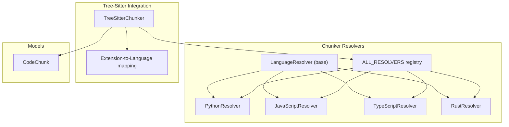
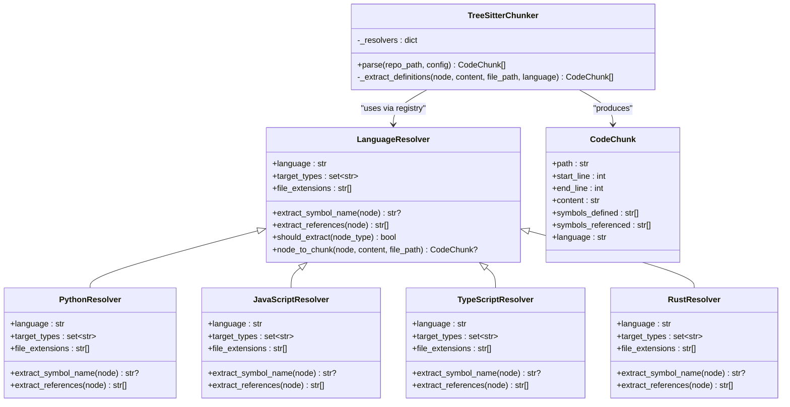
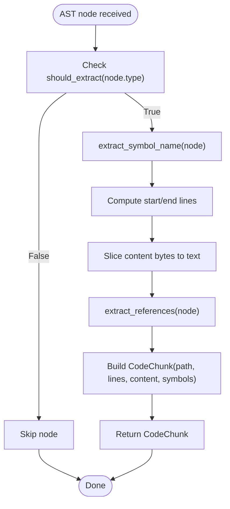
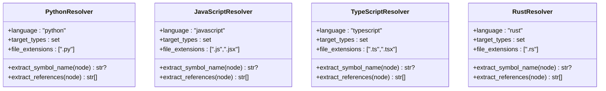
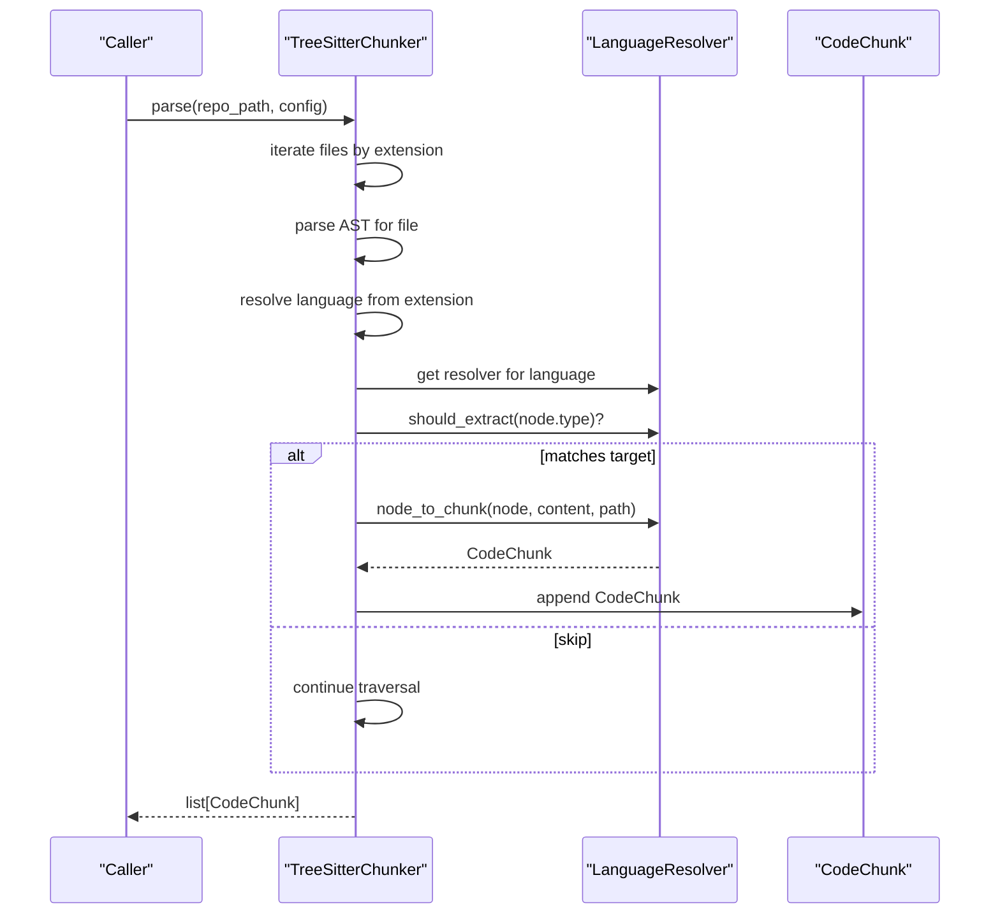
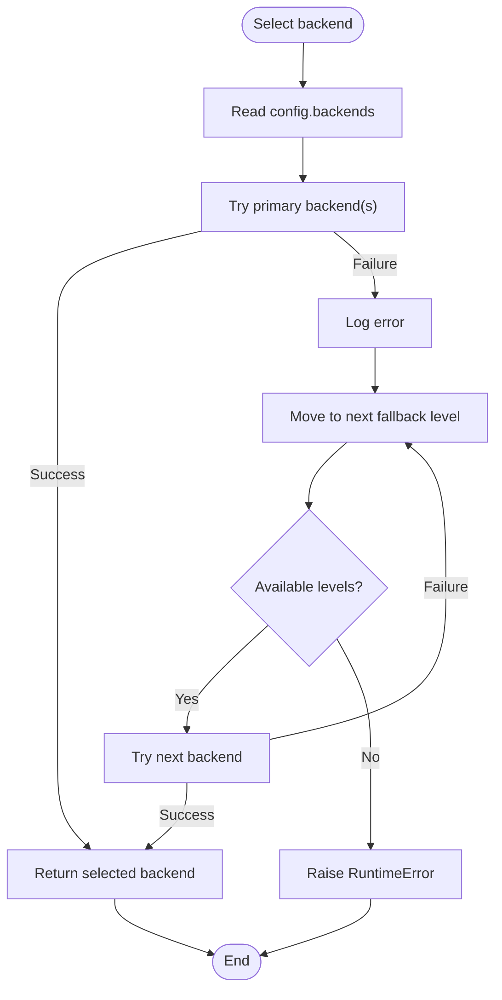
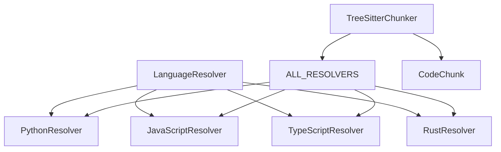

# Strategy Pattern Implementation

<cite>
**Referenced Files in This Document**
- [base.py](file://src/ws_ctx_engine/chunker/resolvers/base.py)
- [python.py](file://src/ws_ctx_engine/chunker/resolvers/python.py)
- [javascript.py](file://src/ws_ctx_engine/chunker/resolvers/javascript.py)
- [typescript.py](file://src/ws_ctx_engine/chunker/resolvers/typescript.py)
- [rust.py](file://src/ws_ctx_engine/chunker/resolvers/rust.py)
- [__init__.py](file://src/ws_ctx_engine/chunker/resolvers/__init__.py)
- [tree_sitter.py](file://src/ws_ctx_engine/chunker/tree_sitter.py)
- [base_chunker.py](file://src/ws_ctx_engine/chunker/base.py)
- [backend_selector.py](file://src/ws_ctx_engine/backend_selector/backend_selector.py)
- [models.py](file://src/ws_ctx_engine/models/models.py)
- [test_resolvers.py](file://tests/unit/test_resolvers.py)
- [test_backend_selector_properties.py](file://tests/property/test_backend_selector_properties.py)
</cite>

## Table of Contents
1. [Introduction](#introduction)
2. [Project Structure](#project-structure)
3. [Core Components](#core-components)
4. [Architecture Overview](#architecture-overview)
5. [Detailed Component Analysis](#detailed-component-analysis)
6. [Dependency Analysis](#dependency-analysis)
7. [Performance Considerations](#performance-considerations)
8. [Troubleshooting Guide](#troubleshooting-guide)
9. [Conclusion](#conclusion)

## Introduction
This document explains the Strategy pattern implementation in the ws-ctx-engine chunker subsystem, focusing on language-specific code resolution via the LanguageResolver abstraction and its concrete implementations. It also documents the backend selector pattern that chooses appropriate components based on configuration and availability, and demonstrates how these patterns enable extensibility, maintainability, and testing isolation.

## Project Structure
The Strategy pattern is centered around the resolvers module, which defines a common interface for language-specific AST parsing strategies. The TreeSitterChunker orchestrates the selection and execution of these strategies during repository traversal. The backend selector pattern resides in the backend_selector module and applies similar runtime selection logic to choose optimal backends with graceful fallback.

**Diagram sources**
- [base.py:7-70](file://src/ws_ctx_engine/chunker/resolvers/base.py#L7-L70)
- [python.py:6-61](file://src/ws_ctx_engine/chunker/resolvers/python.py#L6-L61)
- [javascript.py:6-85](file://src/ws_ctx_engine/chunker/resolvers/javascript.py#L6-L85)
- [typescript.py:6-103](file://src/ws_ctx_engine/chunker/resolvers/typescript.py#L6-L103)
- [rust.py:6-55](file://src/ws_ctx_engine/chunker/resolvers/rust.py#L6-L55)
- [__init__.py:9-25](file://src/ws_ctx_engine/chunker/resolvers/__init__.py#L9-L25)
- [tree_sitter.py:15-160](file://src/ws_ctx_engine/chunker/tree_sitter.py#L15-L160)
- [models.py:10-58](file://src/ws_ctx_engine/models/models.py#L10-L58)

**Section sources**
- [base.py:7-70](file://src/ws_ctx_engine/chunker/resolvers/base.py#L7-L70)
- [__init__.py:9-25](file://src/ws_ctx_engine/chunker/resolvers/__init__.py#L9-L25)
- [tree_sitter.py:15-160](file://src/ws_ctx_engine/chunker/tree_sitter.py#L15-L160)
- [models.py:10-58](file://src/ws_ctx_engine/models/models.py#L10-L58)

## Core Components
- LanguageResolver (abstract base): Defines the contract for language-specific AST node extraction, including language identification, target AST node types, file extensions, symbol name extraction, reference extraction, and conversion to CodeChunk.
- Concrete resolvers: PythonResolver, JavaScriptResolver, TypeScriptResolver, and RustResolver implement language-specific parsing strategies.
- Resolver registry: ALL_RESOLVERS maps language identifiers to concrete resolver classes.
- TreeSitterChunker: Orchestrates AST parsing, selects the appropriate resolver per file extension, and aggregates CodeChunk results.
- CodeChunk: The output model representing parsed code segments with metadata.

Benefits:
- Extensibility: New languages can be added by implementing a new resolver and updating the registry.
- Maintenance: Language-specific logic is isolated in dedicated classes.
- Testing isolation: Each resolver can be unit-tested independently.

**Section sources**
- [base.py:7-70](file://src/ws_ctx_engine/chunker/resolvers/base.py#L7-L70)
- [python.py:6-61](file://src/ws_ctx_engine/chunker/resolvers/python.py#L6-L61)
- [javascript.py:6-85](file://src/ws_ctx_engine/chunker/resolvers/javascript.py#L6-L85)
- [typescript.py:6-103](file://src/ws_ctx_engine/chunker/resolvers/typescript.py#L6-L103)
- [rust.py:6-55](file://src/ws_ctx_engine/chunker/resolvers/rust.py#L6-L55)
- [__init__.py:9-25](file://src/ws_ctx_engine/chunker/resolvers/__init__.py#L9-L25)
- [tree_sitter.py:15-160](file://src/ws_ctx_engine/chunker/tree_sitter.py#L15-L160)
- [models.py:10-58](file://src/ws_ctx_engine/models/models.py#L10-L58)

## Architecture Overview
The Strategy pattern is applied in two complementary ways:
1. Language-specific resolvers: Each language has a dedicated resolver that implements the LanguageResolver contract.
2. Backend selector pattern: Runtime selection of optimal backends with graceful fallback based on configuration and availability.

**Diagram sources**
- [base.py:7-70](file://src/ws_ctx_engine/chunker/resolvers/base.py#L7-L70)
- [python.py:6-61](file://src/ws_ctx_engine/chunker/resolvers/python.py#L6-L61)
- [javascript.py:6-85](file://src/ws_ctx_engine/chunker/resolvers/javascript.py#L6-L85)
- [typescript.py:6-103](file://src/ws_ctx_engine/chunker/resolvers/typescript.py#L6-L103)
- [rust.py:6-55](file://src/ws_ctx_engine/chunker/resolvers/rust.py#L6-L55)
- [tree_sitter.py:15-160](file://src/ws_ctx_engine/chunker/tree_sitter.py#L15-L160)
- [models.py:10-58](file://src/ws_ctx_engine/models/models.py#L10-L58)

## Detailed Component Analysis

### LanguageResolver Abstraction
The LanguageResolver defines a uniform interface for language-specific AST parsing:
- Properties: language, target_types, file_extensions.
- Methods: extract_symbol_name, extract_references, should_extract, node_to_chunk.
- Base behavior: node_to_chunk computes line numbers, content slices, and constructs CodeChunk with symbols_defined and symbols_referenced.

**Diagram sources**
- [base.py:44-70](file://src/ws_ctx_engine/chunker/resolvers/base.py#L44-L70)

**Section sources**
- [base.py:7-70](file://src/ws_ctx_engine/chunker/resolvers/base.py#L7-L70)

### Concrete Resolvers: Python, JavaScript, TypeScript, Rust
Each concrete resolver specializes:
- language: constant language identifier.
- target_types: AST node types to extract for that language.
- file_extensions: supported file extensions.
- extract_symbol_name: language-specific logic to locate identifiers in AST nodes.
- extract_references: recursive collection of referenced identifiers.

Key differences:
- PythonResolver supports function/class definitions, decorated definitions, and type aliases.
- JavaScriptResolver supports function/class declarations, method definitions, lexical declarations, JSX elements, export statements, and generator functions.
- TypeScriptResolver extends JavaScript with interface, type alias, enum, abstract class, internal module declarations, and JSX support.
- RustResolver supports function, struct, trait, impl, enum, const, type, static, mod, macro, union, and function signature items.

**Diagram sources**
- [python.py:6-61](file://src/ws_ctx_engine/chunker/resolvers/python.py#L6-L61)
- [javascript.py:6-85](file://src/ws_ctx_engine/chunker/resolvers/javascript.py#L6-L85)
- [typescript.py:6-103](file://src/ws_ctx_engine/chunker/resolvers/typescript.py#L6-L103)
- [rust.py:6-55](file://src/ws_ctx_engine/chunker/resolvers/rust.py#L6-L55)

**Section sources**
- [python.py:6-61](file://src/ws_ctx_engine/chunker/resolvers/python.py#L6-L61)
- [javascript.py:6-85](file://src/ws_ctx_engine/chunker/resolvers/javascript.py#L6-L85)
- [typescript.py:6-103](file://src/ws_ctx_engine/chunker/resolvers/typescript.py#L6-L103)
- [rust.py:6-55](file://src/ws_ctx_engine/chunker/resolvers/rust.py#L6-L55)

### Resolver Registry and TreeSitterChunker Integration
The resolver registry maps language identifiers to concrete classes. TreeSitterChunker:
- Initializes language parsers and maps file extensions to languages.
- Builds a resolver cache keyed by language.
- Walks repository files, filters by include/exclude patterns, parses ASTs, and delegates extraction to the appropriate resolver.

**Diagram sources**
- [tree_sitter.py:57-160](file://src/ws_ctx_engine/chunker/tree_sitter.py#L57-L160)
- [base.py:44-70](file://src/ws_ctx_engine/chunker/resolvers/base.py#L44-L70)
- [models.py:10-58](file://src/ws_ctx_engine/models/models.py#L10-L58)

**Section sources**
- [__init__.py:9-25](file://src/ws_ctx_engine/chunker/resolvers/__init__.py#L9-L25)
- [tree_sitter.py:40-56](file://src/ws_ctx_engine/chunker/tree_sitter.py#L40-L56)
- [tree_sitter.py:145-160](file://src/ws_ctx_engine/chunker/tree_sitter.py#L145-L160)

### Backend Selector Pattern
The backend selector pattern chooses optimal components with graceful fallback:
- Centralized selection logic with fallback chains for vector index, graph, and embeddings.
- Configuration-driven behavior with automatic fallback levels.
- Logging of current configuration and fallback level.

**Diagram sources**
- [backend_selector.py:13-191](file://src/ws_ctx_engine/backend_selector/backend_selector.py#L13-L191)

**Section sources**
- [backend_selector.py:13-191](file://src/ws_ctx_engine/backend_selector/backend_selector.py#L13-L191)

## Dependency Analysis
- LanguageResolver is the abstraction; concrete resolvers depend on it.
- TreeSitterChunker depends on the resolver registry and the LanguageResolver interface.
- CodeChunk is the output model consumed by downstream components.
- BackendSelector depends on configuration and logging, and coordinates backend instantiation.

**Diagram sources**
- [base.py:7-70](file://src/ws_ctx_engine/chunker/resolvers/base.py#L7-L70)
- [__init__.py:9-25](file://src/ws_ctx_engine/chunker/resolvers/__init__.py#L9-L25)
- [tree_sitter.py:15-160](file://src/ws_ctx_engine/chunker/tree_sitter.py#L15-L160)
- [models.py:10-58](file://src/ws_ctx_engine/models/models.py#L10-L58)

**Section sources**
- [base.py:7-70](file://src/ws_ctx_engine/chunker/resolvers/base.py#L7-L70)
- [__init__.py:9-25](file://src/ws_ctx_engine/chunker/resolvers/__init__.py#L9-L25)
- [tree_sitter.py:15-160](file://src/ws_ctx_engine/chunker/tree_sitter.py#L15-L160)
- [models.py:10-58](file://src/ws_ctx_engine/models/models.py#L10-L58)

## Performance Considerations
- Strategy instantiation cost: Resolvers are instantiated per language and cached in TreeSitterChunker for reuse.
- AST traversal: TreeSitterChunker recursively traverses AST nodes and delegates extraction to the appropriate resolver, minimizing overhead by filtering nodes via should_extract.
- Fallback selection: BackendSelector evaluates configuration and availability to avoid expensive operations when simpler alternatives suffice.

[No sources needed since this section provides general guidance]

## Troubleshooting Guide
Common issues and resolutions:
- Missing tree-sitter dependencies: TreeSitterChunker raises a clear ImportError with installation guidance when required parsers are unavailable.
- Unsupported file extensions: Files with extensions not in the indexed set trigger warnings; they are indexed as plain text.
- Resolver mismatches: Ensure ALL_RESOLVERS includes entries for all supported languages and that extension-to-language mapping aligns with resolver capabilities.
- Backend failures: BackendSelector logs detailed errors and raises RuntimeError when all backends fail; verify configuration and environment prerequisites.

**Section sources**
- [tree_sitter.py:32-37](file://src/ws_ctx_engine/chunker/tree_sitter.py#L32-L37)
- [base_chunker.py:106-116](file://src/ws_ctx_engine/chunker/base.py#L106-L116)
- [backend_selector.py:78-80](file://src/ws_ctx_engine/backend_selector/backend_selector.py#L78-L80)

## Conclusion
The Strategy pattern in ws-ctx-engine enables clean separation of language-specific parsing logic while maintaining a unified interface for consumers. Combined with the backend selector pattern, the system achieves robust runtime selection and graceful degradation. These patterns collectively improve extensibility, simplify maintenance, and facilitate isolated testing of individual components.