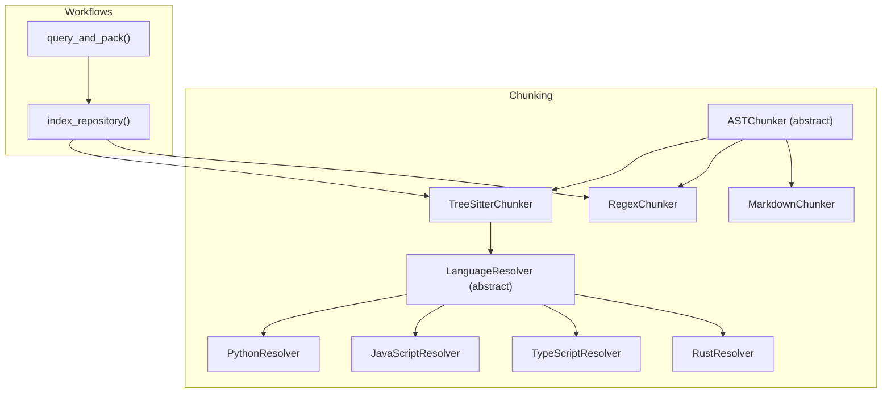
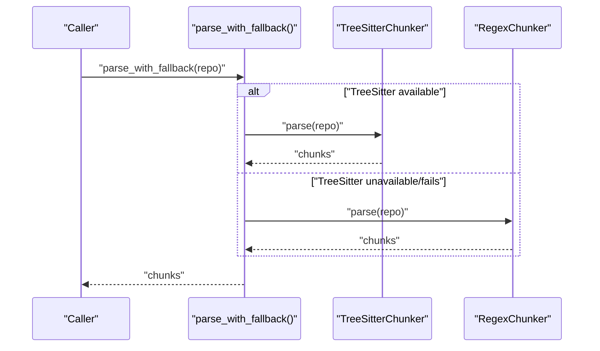
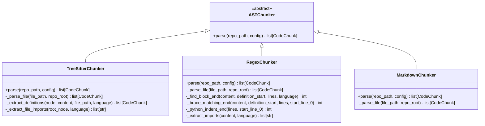
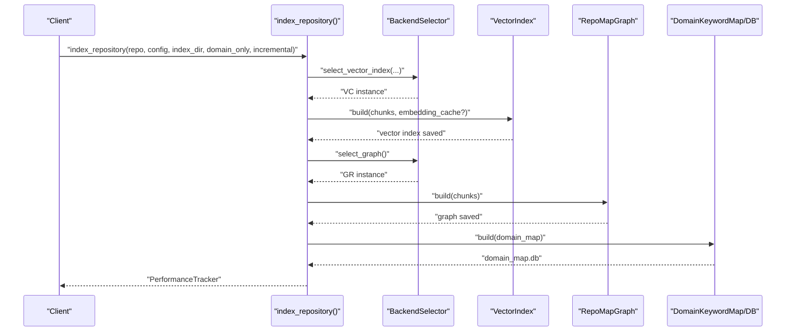
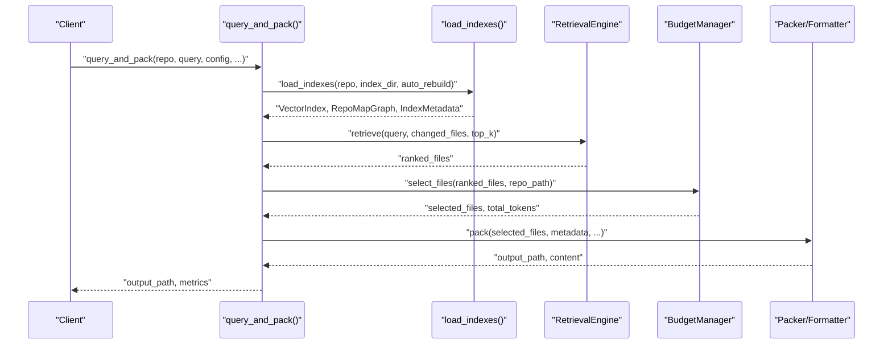
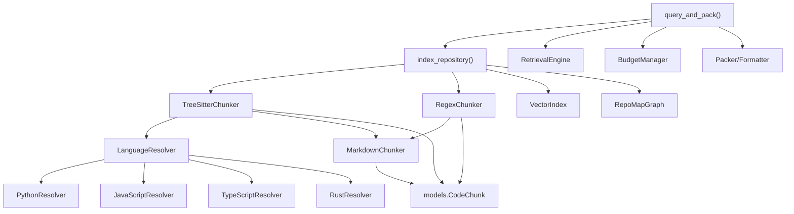

# Template Method Pattern

<cite>
**Referenced Files in This Document**
- [base.py](file://src/ws_ctx_engine/chunker/base.py)
- [tree_sitter.py](file://src/ws_ctx_engine/chunker/tree_sitter.py)
- [regex.py](file://src/ws_ctx_engine/chunker/regex.py)
- [markdown.py](file://src/ws_ctx_engine/chunker/markdown.py)
- [base.py](file://src/ws_ctx_engine/chunker/resolvers/base.py)
- [python.py](file://src/ws_ctx_engine/chunker/resolvers/python.py)
- [javascript.py](file://src/ws_ctx_engine/chunker/resolvers/javascript.py)
- [typescript.py](file://src/ws_ctx_engine/chunker/resolvers/typescript.py)
- [rust.py](file://src/ws_ctx_engine/chunker/resolvers/rust.py)
- [__init__.py](file://src/ws_ctx_engine/chunker/resolvers/__init__.py)
- [__init__.py](file://src/ws_ctx_engine/chunker/__init__.py)
- [indexer.py](file://src/ws_ctx_engine/workflow/indexer.py)
- [query.py](file://src/ws_ctx_engine/workflow/query.py)
- [models.py](file://src/ws_ctx_engine/models/models.py)
- [test_ast_chunker.py](file://tests/unit/test_ast_chunker.py)
- [test_base_chunker.py](file://tests/unit/test_base_chunker.py)
- [test_query_workflow.py](file://tests/integration/test_query_workflow.py)
</cite>

## Table of Contents
1. [Introduction](#introduction)
2. [Project Structure](#project-structure)
3. [Core Components](#core-components)
4. [Architecture Overview](#architecture-overview)
5. [Detailed Component Analysis](#detailed-component-analysis)
6. [Dependency Analysis](#dependency-analysis)
7. [Performance Considerations](#performance-considerations)
8. [Troubleshooting Guide](#troubleshooting-guide)
9. [Conclusion](#conclusion)

## Introduction
This document explains how the Template Method pattern is implemented across the chunking and workflow pipelines. It focuses on:
- The abstract chunker base class that defines the skeleton for AST parsing operations while delegating language-specific details to concrete subclasses.
- The indexing and query workflows that use template-like orchestrations to standardize processing while enabling customization via pluggable components (chunkers, resolvers, backends).
- Hook points and extension mechanisms that allow concrete implementations to override specific steps without altering the overall process.

## Project Structure
The Template Method spans two primary areas:
- Chunking subsystem: an abstract ASTChunker with concrete implementations (TreeSitterChunker, RegexChunker, MarkdownChunker) and language-specific resolvers.
- Workflow subsystem: indexing and query phases that orchestrate chunking, indexing, retrieval, budgeting, packing, and output generation.



**Diagram sources**
- [base.py:41-44](file://src/ws_ctx_engine/chunker/base.py#L41-L44)
- [tree_sitter.py:15-160](file://src/ws_ctx_engine/chunker/tree_sitter.py#L15-L160)
- [regex.py:15-219](file://src/ws_ctx_engine/chunker/regex.py#L15-L219)
- [markdown.py:13-100](file://src/ws_ctx_engine/chunker/markdown.py#L13-L100)
- [base.py:7-70](file://src/ws_ctx_engine/chunker/resolvers/base.py#L7-L70)
- [python.py:6-61](file://src/ws_ctx_engine/chunker/resolvers/python.py#L6-L61)
- [javascript.py:6-85](file://src/ws_ctx_engine/chunker/resolvers/javascript.py#L6-L85)
- [typescript.py:6-103](file://src/ws_ctx_engine/chunker/resolvers/typescript.py#L6-L103)
- [rust.py:6-55](file://src/ws_ctx_engine/chunker/resolvers/rust.py#L6-L55)
- [indexer.py:72-371](file://src/ws_ctx_engine/workflow/indexer.py#L72-L371)
- [query.py:230-617](file://src/ws_ctx_engine/workflow/query.py#L230-L617)

**Section sources**
- [base.py:41-44](file://src/ws_ctx_engine/chunker/base.py#L41-L44)
- [tree_sitter.py:15-160](file://src/ws_ctx_engine/chunker/tree_sitter.py#L15-L160)
- [regex.py:15-219](file://src/ws_ctx_engine/chunker/regex.py#L15-L219)
- [markdown.py:13-100](file://src/ws_ctx_engine/chunker/markdown.py#L13-L100)
- [base.py:7-70](file://src/ws_ctx_engine/chunker/resolvers/base.py#L7-L70)
- [python.py:6-61](file://src/ws_ctx_engine/chunker/resolvers/python.py#L6-L61)
- [javascript.py:6-85](file://src/ws_ctx_engine/chunker/resolvers/javascript.py#L6-L85)
- [typescript.py:6-103](file://src/ws_ctx_engine/chunker/resolvers/typescript.py#L6-L103)
- [rust.py:6-55](file://src/ws_ctx_engine/chunker/resolvers/rust.py#L6-L55)
- [indexer.py:72-371](file://src/ws_ctx_engine/workflow/indexer.py#L72-L371)
- [query.py:230-617](file://src/ws_ctx_engine/workflow/query.py#L230-L617)

## Core Components
- Abstract chunker base class: Defines the skeleton for parsing repositories into code chunks while delegating language-specific extraction to subclasses.
- Concrete chunkers:
  - TreeSitterChunker: Uses py-tree-sitter with language-specific resolvers and Markdown handling.
  - RegexChunker: Fallback using regex patterns for function/class blocks and imports.
  - MarkdownChunker: Splits Markdown files into chunks by headings.
- Language resolvers: Encapsulate symbol extraction and AST node-to-chunk conversion per language.
- Workflow orchestrators:
  - Indexing: Standardized phases for parsing, vector indexing, graph building, metadata saving, and domain map building.
  - Query: Standardized phases for index loading, hybrid retrieval, budget selection, and output packing.

**Section sources**
- [base.py:41-44](file://src/ws_ctx_engine/chunker/base.py#L41-L44)
- [tree_sitter.py:15-160](file://src/ws_ctx_engine/chunker/tree_sitter.py#L15-L160)
- [regex.py:15-219](file://src/ws_ctx_engine/chunker/regex.py#L15-L219)
- [markdown.py:13-100](file://src/ws_ctx_engine/chunker/markdown.py#L13-L100)
- [base.py:7-70](file://src/ws_ctx_engine/chunker/resolvers/base.py#L7-L70)
- [indexer.py:72-371](file://src/ws_ctx_engine/workflow/indexer.py#L72-L371)
- [query.py:230-617](file://src/ws_ctx_engine/workflow/query.py#L230-L617)

## Architecture Overview
The Template Method pattern is evident in:
- Chunkers define a common parse(repository) skeleton, with subclasses overriding language-specific extraction routines.
- Workflows define standardized sequences of operations, invoking pluggable components (chunkers, backends, packers) at well-defined hooks.



**Diagram sources**
- [__init__.py:17-38](file://src/ws_ctx_engine/chunker/__init__.py#L17-L38)
- [tree_sitter.py:57-89](file://src/ws_ctx_engine/chunker/tree_sitter.py#L57-L89)
- [regex.py:75-105](file://src/ws_ctx_engine/chunker/regex.py#L75-L105)

**Section sources**
- [__init__.py:17-38](file://src/ws_ctx_engine/chunker/__init__.py#L17-L38)
- [tree_sitter.py:57-89](file://src/ws_ctx_engine/chunker/tree_sitter.py#L57-L89)
- [regex.py:75-105](file://src/ws_ctx_engine/chunker/regex.py#L75-L105)

## Detailed Component Analysis

### Abstract Chunker Base Class and Concrete Implementations
The ASTChunker abstract base class establishes the template method for parsing repositories. Concrete chunkers implement language-specific extraction while sharing the same orchestration.



Key template method steps:
- Repository traversal and inclusion filtering.
- Per-language extraction of definitions and references.
- Construction of CodeChunk objects with metadata.

Hook points for customization:
- Language-specific symbol extraction and block boundary detection.
- Import/reference collection strategies.

**Diagram sources**
- [base.py:41-44](file://src/ws_ctx_engine/chunker/base.py#L41-L44)
- [tree_sitter.py:57-160](file://src/ws_ctx_engine/chunker/tree_sitter.py#L57-L160)
- [regex.py:75-219](file://src/ws_ctx_engine/chunker/regex.py#L75-L219)
- [markdown.py:23-100](file://src/ws_ctx_engine/chunker/markdown.py#L23-L100)

**Section sources**
- [base.py:41-44](file://src/ws_ctx_engine/chunker/base.py#L41-L44)
- [tree_sitter.py:57-160](file://src/ws_ctx_engine/chunker/tree_sitter.py#L57-L160)
- [regex.py:75-219](file://src/ws_ctx_engine/chunker/regex.py#L75-L219)
- [markdown.py:23-100](file://src/ws_ctx_engine/chunker/markdown.py#L23-L100)

### Language Resolvers
LanguageResolver abstract base class defines how AST nodes are converted to CodeChunk instances. Concrete resolvers implement language-specific symbol extraction and target node types.

```mermaid
classDiagram
class LanguageResolver {
<<abstract>>
+language str
+target_types set[str]
+file_extensions list[str]
+extract_symbol_name(node) str?
+extract_references(node) list[str]
+should_extract(node_type) bool
+node_to_chunk(node, content, file_path) CodeChunk?
}
class PythonResolver {
+language "python"
+target_types {...}
+extract_symbol_name(node) str?
+extract_references(node) list[str]
}
class JavaScriptResolver {
+language "javascript"
+target_types {...}
+extract_symbol_name(node) str?
+extract_references(node) list[str]
}
class TypeScriptResolver {
+language "typescript"
+target_types {...}
+extract_symbol_name(node) str?
+extract_references(node) list[str]
}
class RustResolver {
+language "rust"
+target_types {...}
+extract_symbol_name(node) str?
+extract_references(node) list[str]
}
LanguageResolver <|-- PythonResolver
LanguageResolver <|-- JavaScriptResolver
LanguageResolver <|-- TypeScriptResolver
LanguageResolver <|-- RustResolver
```

TreeSitterChunker composes resolvers per language and delegates node-to-chunk conversion to them.

**Diagram sources**
- [base.py:7-70](file://src/ws_ctx_engine/chunker/resolvers/base.py#L7-L70)
- [python.py:6-61](file://src/ws_ctx_engine/chunker/resolvers/python.py#L6-L61)
- [javascript.py:6-85](file://src/ws_ctx_engine/chunker/resolvers/javascript.py#L6-L85)
- [typescript.py:6-103](file://src/ws_ctx_engine/chunker/resolvers/typescript.py#L6-L103)
- [rust.py:6-55](file://src/ws_ctx_engine/chunker/resolvers/rust.py#L6-L55)
- [__init__.py:9-16](file://src/ws_ctx_engine/chunker/resolvers/__init__.py#L9-L16)
- [tree_sitter.py:54-55](file://src/ws_ctx_engine/chunker/tree_sitter.py#L54-L55)

**Section sources**
- [base.py:7-70](file://src/ws_ctx_engine/chunker/resolvers/base.py#L7-L70)
- [python.py:6-61](file://src/ws_ctx_engine/chunker/resolvers/python.py#L6-L61)
- [javascript.py:6-85](file://src/ws_ctx_engine/chunker/resolvers/javascript.py#L6-L85)
- [typescript.py:6-103](file://src/ws_ctx_engine/chunker/resolvers/typescript.py#L6-L103)
- [rust.py:6-55](file://src/ws_ctx_engine/chunker/resolvers/rust.py#L6-L55)
- [__init__.py:9-16](file://src/ws_ctx_engine/chunker/resolvers/__init__.py#L9-L16)
- [tree_sitter.py:54-55](file://src/ws_ctx_engine/chunker/tree_sitter.py#L54-L55)

### Indexing Workflow (Template Method Orchestration)
The indexing workflow defines a standardized sequence of phases, invoking pluggable components at each step. This is the primary example of the Template Method applied to workflows.



Key template steps:
- Parse codebase with AST chunker (with fallback).
- Build vector index (with optional incremental update and embedding cache).
- Build graph (RepoMap).
- Save metadata for staleness detection.
- Build domain keyword map and persist to database.

Hook points:
- BackendSelector chooses vector index and graph implementations.
- parse_with_fallback selects TreeSitter or Regex chunker.
- Incremental mode updates only changed/deleted files.

**Diagram sources**
- [indexer.py:72-371](file://src/ws_ctx_engine/workflow/indexer.py#L72-L371)
- [__init__.py:17-38](file://src/ws_ctx_engine/chunker/__init__.py#L17-L38)

**Section sources**
- [indexer.py:72-371](file://src/ws_ctx_engine/workflow/indexer.py#L72-L371)
- [__init__.py:17-38](file://src/ws_ctx_engine/chunker/__init__.py#L17-L38)

### Query Workflow (Template Method Orchestration)
The query workflow follows a standardized sequence for retrieving, selecting, and packaging results.



Key template steps:
- Load indexes with auto-detection and optional rebuild.
- Hybrid retrieval combining semantic and graph signals.
- Budget-aware file selection.
- Output packing/formatting (XML, ZIP, JSON, YAML, TOON, Markdown).

Hook points:
- RetrievalEngine weights and ranking.
- BudgetManager selection policy.
- Packer/formatter selection based on configuration.

**Diagram sources**
- [query.py:230-617](file://src/ws_ctx_engine/workflow/query.py#L230-L617)
- [indexer.py:404-492](file://src/ws_ctx_engine/workflow/indexer.py#L404-L492)

**Section sources**
- [query.py:230-617](file://src/ws_ctx_engine/workflow/query.py#L230-L617)
- [indexer.py:404-492](file://src/ws_ctx_engine/workflow/indexer.py#L404-L492)

### Execution Flow Examples and Hook Points
- Fallback parsing flow: parse_with_fallback attempts TreeSitterChunker and falls back to RegexChunker if unavailable or failing.
- Incremental indexing: detects changed/deleted files and updates vector index incrementally when possible.
- Query phases: index loading, hybrid retrieval, budget selection, and output packing are standardized with configurable components.

Concrete examples:
- Unit tests demonstrate TreeSitterChunker and RegexChunker parsing behavior and fallback logic.
- Integration tests exercise the full index → query → pack workflow end-to-end.

**Section sources**
- [__init__.py:17-38](file://src/ws_ctx_engine/chunker/__init__.py#L17-L38)
- [test_ast_chunker.py:252-294](file://tests/unit/test_ast_chunker.py#L252-L294)
- [test_query_workflow.py:186-570](file://tests/integration/test_query_workflow.py#L186-L570)

## Dependency Analysis
The Template Method relies on clear separation of concerns:
- Chunkers depend on resolvers for language-specific extraction.
- Workflows depend on chunkers and backends via factory/selectors.
- Models define shared data structures used across chunkers and workflows.



**Diagram sources**
- [tree_sitter.py:54-55](file://src/ws_ctx_engine/chunker/tree_sitter.py#L54-L55)
- [regex.py:73-73](file://src/ws_ctx_engine/chunker/regex.py#L73-L73)
- [markdown.py:34-47](file://src/ws_ctx_engine/chunker/markdown.py#L34-L47)
- [indexer.py:157-163](file://src/ws_ctx_engine/workflow/indexer.py#L157-L163)
- [query.py:178-183](file://src/ws_ctx_engine/workflow/query.py#L178-L183)
- [models.py:10-34](file://src/ws_ctx_engine/models/models.py#L10-L34)

**Section sources**
- [tree_sitter.py:54-55](file://src/ws_ctx_engine/chunker/tree_sitter.py#L54-L55)
- [regex.py:73-73](file://src/ws_ctx_engine/chunker/regex.py#L73-L73)
- [markdown.py:34-47](file://src/ws_ctx_engine/chunker/markdown.py#L34-L47)
- [indexer.py:157-163](file://src/ws_ctx_engine/workflow/indexer.py#L157-L163)
- [query.py:178-183](file://src/ws_ctx_engine/workflow/query.py#L178-L183)
- [models.py:10-34](file://src/ws_ctx_engine/models/models.py#L10-L34)

## Performance Considerations
- Incremental indexing reduces rebuild costs by updating only changed/deleted files and leveraging embedding caches.
- Fallback logic ensures robustness when advanced parsers are unavailable.
- Budget-aware selection controls output size and cost.
- Parallelizable phases (parsing, vector indexing, graph building) improve throughput.

[No sources needed since this section provides general guidance]

## Troubleshooting Guide
Common issues and resolutions:
- TreeSitter not available: parse_with_fallback automatically switches to RegexChunker and logs a warning.
- Stale indexes: load_indexes detects staleness and can rebuild automatically.
- Empty or insufficient chunks: verify include/exclude patterns and .gitignore handling.
- Token budget exceeded: adjust token budget or reduce top_k to fit constraints.

**Section sources**
- [__init__.py:26-37](file://src/ws_ctx_engine/chunker/__init__.py#L26-L37)
- [indexer.py:456-467](file://src/ws_ctx_engine/workflow/indexer.py#L456-L467)
- [query.py:395-411](file://src/ws_ctx_engine/workflow/query.py#L395-L411)

## Conclusion
The Template Method pattern is central to both the chunking and workflow subsystems:
- Chunkers share a common parse(repository) template while delegating language-specific extraction to resolvers and concrete implementations.
- Workflows standardize multi-phase processing, exposing hook points for pluggable components and configurations.
This design enables extensibility, maintainability, and predictable behavior across diverse repository structures and use cases.