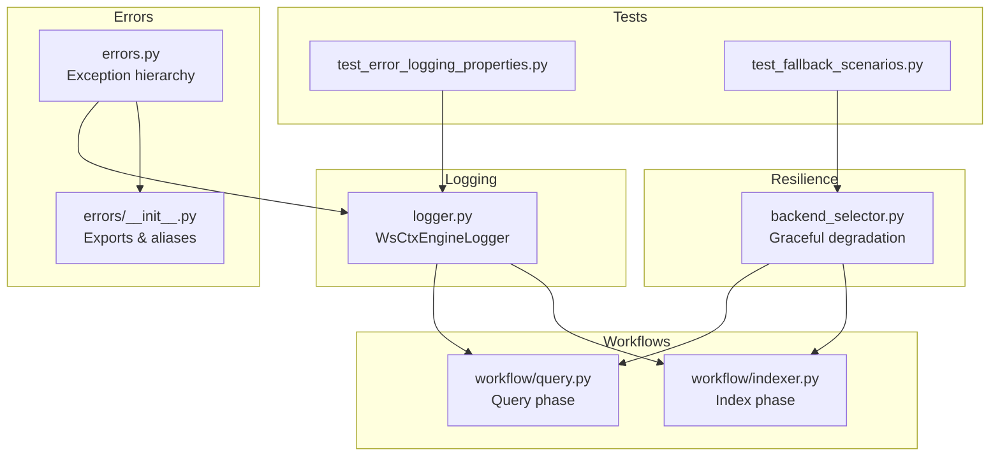
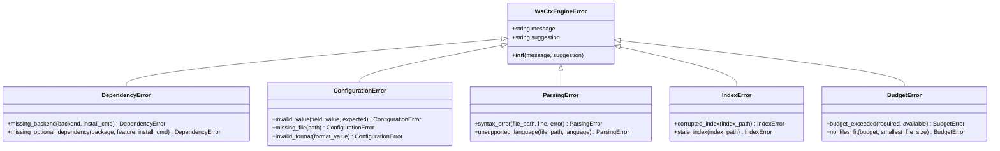
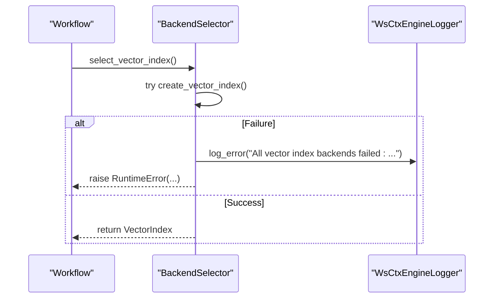
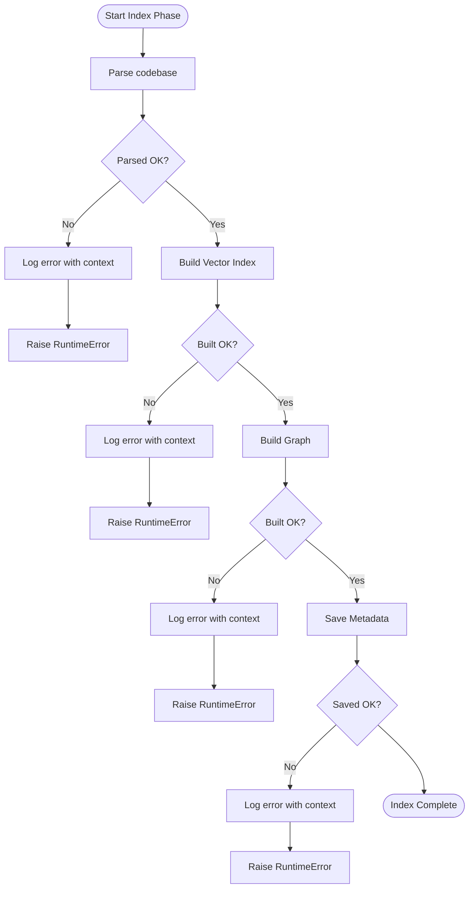
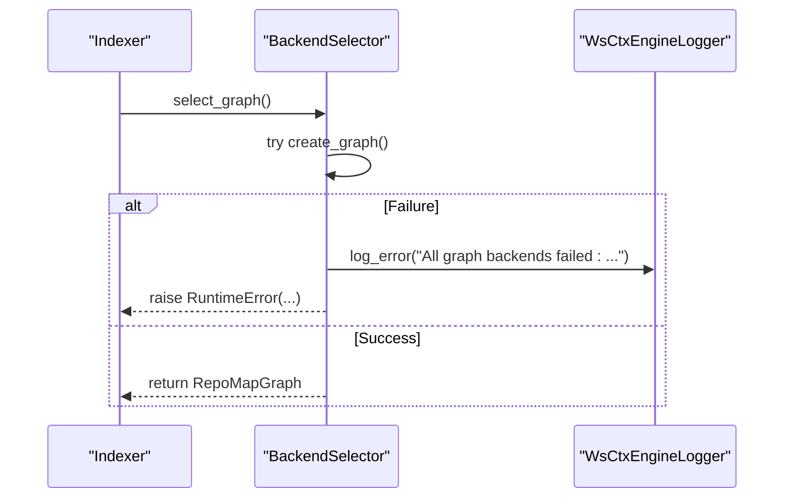
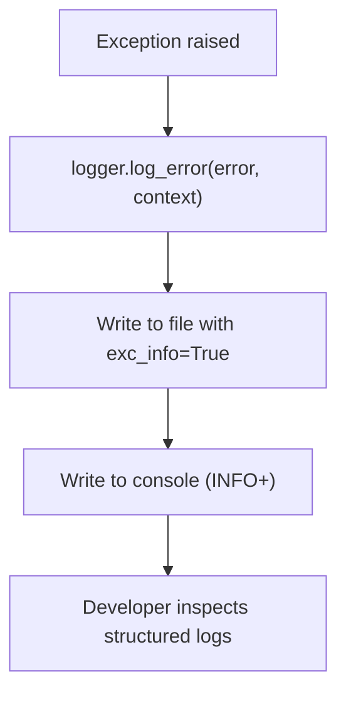
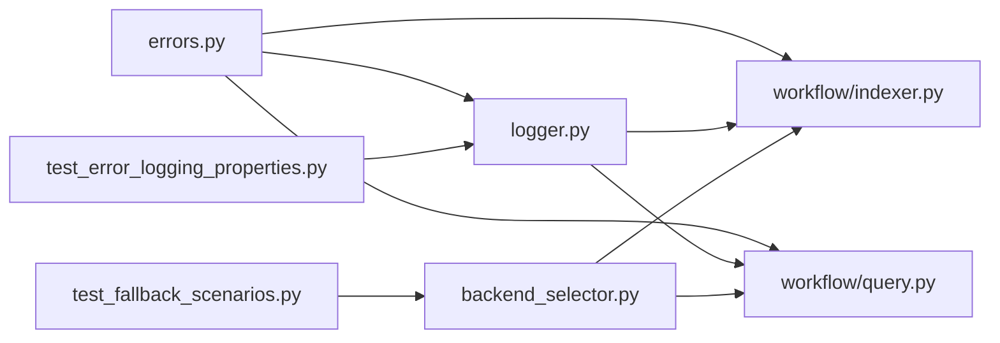

# Error Handling & Resilience

<cite>
**Referenced Files in This Document**
- [errors.py](file://src/ws_ctx_engine/errors/errors.py)
- [__init__.py](file://src/ws_ctx_engine/errors/__init__.py)
- [logger.py](file://src/ws_ctx_engine/logger/logger.py)
- [indexer.py](file://src/ws_ctx_engine/workflow/indexer.py)
- [query.py](file://src/ws_ctx_engine/workflow/query.py)
- [backend_selector.py](file://src/ws_ctx_engine/backend_selector/backend_selector.py)
- [test_error_logging_properties.py](file://tests/property/test_error_logging_properties.py)
- [test_fallback_scenarios.py](file://tests/integration/test_fallback_scenarios.py)
- [architecture.md](file://docs/reference/architecture.md)
- [supporting-modules.md](file://docs/reference/supporting-modules.md)
</cite>

## Table of Contents
1. [Introduction](#introduction)
2. [Project Structure](#project-structure)
3. [Core Components](#core-components)
4. [Architecture Overview](#architecture-overview)
5. [Detailed Component Analysis](#detailed-component-analysis)
6. [Dependency Analysis](#dependency-analysis)
7. [Performance Considerations](#performance-considerations)
8. [Troubleshooting Guide](#troubleshooting-guide)
9. [Conclusion](#conclusion)

## Introduction
This document explains the error handling philosophy and resilience mechanisms in ws-ctx-engine with a focus on:
- The exception hierarchy centered on WsCtxEngineError
- Specialized exceptions for distinct failure modes
- The “fail gracefully, log actionably” approach
- Error propagation patterns and recovery strategies during fallback transitions
- The logging system that captures actionable context for debugging
- Best practices for extending the error handling system

The philosophy is grounded in structured, user-friendly error messages that include:
1) What failed
2) Why it failed
3) How to fix it

This is enforced by the exception hierarchy and the logging infrastructure.

## Project Structure
The error handling and resilience spans several modules:
- Exception definitions and exports
- Logging infrastructure
- Workflow phases that catch and log errors
- Backend selection with graceful degradation
- Tests validating error logging and fallback behavior

**Diagram sources**
- [errors.py:1-320](file://src/ws_ctx_engine/errors/errors.py#L1-L320)
- [__init__.py:1-24](file://src/ws_ctx_engine/errors/__init__.py#L1-L24)
- [logger.py:1-145](file://src/ws_ctx_engine/logger/logger.py#L1-L145)
- [indexer.py:1-493](file://src/ws_ctx_engine/workflow/indexer.py#L1-L493)
- [query.py:1-617](file://src/ws_ctx_engine/workflow/query.py#L1-L617)
- [backend_selector.py:1-191](file://src/ws_ctx_engine/backend_selector/backend_selector.py#L1-L191)
- [test_error_logging_properties.py:1-84](file://tests/property/test_error_logging_properties.py#L1-L84)
- [test_fallback_scenarios.py:1-665](file://tests/integration/test_fallback_scenarios.py#L1-L665)

**Section sources**
- [errors.py:1-320](file://src/ws_ctx_engine/errors/errors.py#L1-L320)
- [logger.py:1-145](file://src/ws_ctx_engine/logger/logger.py#L1-L145)
- [indexer.py:1-493](file://src/ws_ctx_engine/workflow/indexer.py#L1-L493)
- [query.py:1-617](file://src/ws_ctx_engine/workflow/query.py#L1-L617)
- [backend_selector.py:1-191](file://src/ws_ctx_engine/backend_selector/backend_selector.py#L1-L191)
- [test_error_logging_properties.py:1-84](file://tests/property/test_error_logging_properties.py#L1-L84)
- [test_fallback_scenarios.py:1-665](file://tests/integration/test_fallback_scenarios.py#L1-L665)

## Core Components
- Exception hierarchy
  - WsCtxEngineError: Base class with message and suggestion fields
  - DependencyError: Missing required or optional dependencies
  - ConfigurationError: Invalid values, missing files, invalid formats
  - ParsingError: Syntax errors and unsupported languages
  - IndexError: Corrupted or stale indexes
  - BudgetError: Token budget exceeded or no files fit
- Logging system
  - WsCtxEngineLogger: Dual-output logger (console + file), structured format, contextual error logging, fallback logging
- Workflows
  - Indexer and query phases wrap operations in try/catch, log errors with context, and raise clear runtime errors
- Backend selection
  - Centralized fallback chains with graceful degradation and logging

**Section sources**
- [errors.py:10-320](file://src/ws_ctx_engine/errors/errors.py#L10-L320)
- [__init__.py:1-24](file://src/ws_ctx_engine/errors/__init__.py#L1-L24)
- [logger.py:13-145](file://src/ws_ctx_engine/logger/logger.py#L13-L145)
- [indexer.py:174-253](file://src/ws_ctx_engine/workflow/indexer.py#L174-L253)
- [query.py:320-411](file://src/ws_ctx_engine/workflow/query.py#L320-L411)
- [backend_selector.py:13-191](file://src/ws_ctx_engine/backend_selector/backend_selector.py#L13-L191)

## Architecture Overview
The error handling architecture enforces:
- Fail gracefully: Catch exceptions early, log actionable context, and continue with safer alternatives or degrade gracefully
- Log actionably: Every error includes a structured message with failure description, cause analysis, and actionable solution
- Propagate clearly: Convert internal failures into user-facing exceptions with suggestions
- Recover during fallback: Use backend selection and fallback chains to preserve functionality

**Diagram sources**
- [errors.py:10-320](file://src/ws_ctx_engine/errors/errors.py#L10-L320)

**Section sources**
- [errors.py:10-320](file://src/ws_ctx_engine/errors/errors.py#L10-L320)
- [architecture.md:683-737](file://docs/reference/architecture.md#L683-L737)

## Detailed Component Analysis

### Exception Hierarchy and Specialized Exceptions
- WsCtxEngineError: Base class storing message and suggestion, and formatting a combined message
- DependencyError: Provides installation guidance for missing backends or optional packages
- ConfigurationError: Guides correcting invalid values, missing files, or invalid formats
- ParsingError: Helps resolve syntax errors or unsupported languages
- IndexError: Advises rebuilding or deleting corrupted/stale indexes
- BudgetError: Suggests adjusting budgets or reducing file selection

These exceptions are exported via the errors package and aliased for backward compatibility.

**Section sources**
- [errors.py:10-320](file://src/ws_ctx_engine/errors/errors.py#L10-L320)
- [__init__.py:1-24](file://src/ws_ctx_engine/errors/__init__.py#L1-L24)
- [supporting-modules.md:308-362](file://docs/reference/supporting-modules.md#L308-L362)

### Logging Infrastructure and Actionable Messages
- WsCtxEngineLogger
  - Dual output: console (INFO+) and file (DEBUG+)
  - Structured format: timestamp | level | name | message
  - Methods:
    - log_fallback(component, primary, fallback, reason): Logs fallback events with context
    - log_phase(phase, duration, **metrics): Logs phase completion with metrics
    - log_error(error, context): Logs error with stack trace and optional context fields
- Tests validate comprehensive error logging, including fallback triggers and error context inclusion.

**Diagram sources**
- [backend_selector.py:36-81](file://src/ws_ctx_engine/backend_selector/backend_selector.py#L36-L81)
- [logger.py:96-108](file://src/ws_ctx_engine/logger/logger.py#L96-L108)

**Section sources**
- [logger.py:13-145](file://src/ws_ctx_engine/logger/logger.py#L13-L145)
- [test_error_logging_properties.py:41-84](file://tests/property/test_error_logging_properties.py#L41-L84)

### Error Propagation Patterns in Workflows
- Indexing phase
  - Catches exceptions during parsing, vector indexing, graph building, metadata saving, and domain map building
  - Logs errors with context (phase, repo_path)
  - Raises RuntimeError with a clear message while preserving the original cause
- Query phase
  - Loads indexes and handles missing index files with actionable guidance
  - Logs retrieval, budget selection, and packing failures with context
  - Raises RuntimeError with a clear message while preserving the original cause

**Diagram sources**
- [indexer.py:156-328](file://src/ws_ctx_engine/workflow/indexer.py#L156-L328)

**Section sources**
- [indexer.py:156-328](file://src/ws_ctx_engine/workflow/indexer.py#L156-L328)
- [query.py:316-411](file://src/ws_ctx_engine/workflow/query.py#L316-L411)

### Recovery Strategies During Fallback Transitions
- Backend selection with graceful degradation
  - Hierarchical fallback levels from optimal to minimal capabilities
  - Logs current configuration and fallback level
  - On total backend failure, logs an error and raises a clear RuntimeError
- Integration tests demonstrate:
  - LEANN to FAISS fallback
  - igraph to NetworkX fallback
  - Local to API embeddings fallback (conceptually validated)
  - Graceful handling of missing files, invalid configs, and corrupted files

**Diagram sources**
- [backend_selector.py:82-109](file://src/ws_ctx_engine/backend_selector/backend_selector.py#L82-L109)
- [test_fallback_scenarios.py:327-467](file://tests/integration/test_fallback_scenarios.py#L327-L467)

**Section sources**
- [backend_selector.py:13-191](file://src/ws_ctx_engine/backend_selector/backend_selector.py#L13-L191)
- [test_fallback_scenarios.py:327-467](file://tests/integration/test_fallback_scenarios.py#L327-L467)

### Logging System for Debugging Context
- Structured logs include timestamps, levels, logger names, and messages
- Contextual fields are appended to log lines for traceability
- Error logs include stack traces for deep debugging
- Fallback logs capture component, primary backend, fallback backend, and reason

**Diagram sources**
- [logger.py:96-108](file://src/ws_ctx_engine/logger/logger.py#L96-L108)
- [test_error_logging_properties.py:65-84](file://tests/property/test_error_logging_properties.py#L65-L84)

**Section sources**
- [logger.py:64-108](file://src/ws_ctx_engine/logger/logger.py#L64-L108)
- [test_error_logging_properties.py:25-84](file://tests/property/test_error_logging_properties.py#L25-L84)

## Dependency Analysis
- Errors module depends on typing for type hints
- Logger module depends on standard logging, datetime, pathlib, and typing
- Workflows depend on logger and backend selector
- Tests depend on logger and error classes to validate logging behavior

**Diagram sources**
- [errors.py:7-8](file://src/ws_ctx_engine/errors/errors.py#L7-L8)
- [logger.py:7-10](file://src/ws_ctx_engine/logger/logger.py#L7-L10)
- [indexer.py:14-22](file://src/ws_ctx_engine/workflow/indexer.py#L14-L22)
- [query.py:13-22](file://src/ws_ctx_engine/workflow/query.py#L13-L22)
- [backend_selector.py:7-10](file://src/ws_ctx_engine/backend_selector/backend_selector.py#L7-L10)
- [test_error_logging_properties.py:14-22](file://tests/property/test_error_logging_properties.py#L14-L22)
- [test_fallback_scenarios.py:16-38](file://tests/integration/test_fallback_scenarios.py#L16-L38)

**Section sources**
- [errors.py:7-8](file://src/ws_ctx_engine/errors/errors.py#L7-L8)
- [logger.py:7-10](file://src/ws_ctx_engine/logger/logger.py#L7-L10)
- [indexer.py:14-22](file://src/ws_ctx_engine/workflow/indexer.py#L14-L22)
- [query.py:13-22](file://src/ws_ctx_engine/workflow/query.py#L13-L22)
- [backend_selector.py:7-10](file://src/ws_ctx_engine/backend_selector/backend_selector.py#L7-L10)
- [test_error_logging_properties.py:14-22](file://tests/property/test_error_logging_properties.py#L14-L22)
- [test_fallback_scenarios.py:16-38](file://tests/integration/test_fallback_scenarios.py#L16-L38)

## Performance Considerations
- Logging overhead is minimized by separate handlers (console vs file) and structured formatting
- Workflows track performance and memory usage, enabling targeted optimization around error-prone steps
- Fallback strategies balance functionality and performance, with warnings when fallbacks occur

[No sources needed since this section provides general guidance]

## Troubleshooting Guide
Common scenarios and how to address them:
- Dependency issues
  - Use DependencyError helpers to guide installation of missing backends or optional packages
- Configuration problems
  - Use ConfigurationError helpers to correct invalid values, missing files, or invalid formats
- Parsing failures
  - Use ParsingError helpers to fix syntax errors or switch to supported languages
- Index problems
  - Use IndexError helpers to rebuild or delete corrupted/stale indexes
- Budget constraints
  - Use BudgetError helpers to increase budgets or reduce file selection
- Logging and diagnostics
  - Inspect structured logs for timestamps, levels, and contextual fields
  - Use log_error with context to capture file paths, line numbers, and function names
  - Monitor fallback logs to understand backend transitions

**Section sources**
- [errors.py:31-320](file://src/ws_ctx_engine/errors/errors.py#L31-L320)
- [logger.py:64-108](file://src/ws_ctx_engine/logger/logger.py#L64-L108)
- [test_error_logging_properties.py:65-84](file://tests/property/test_error_logging_properties.py#L65-L84)

## Conclusion
ws-ctx-engine’s error handling and resilience are built on:
- A clear exception hierarchy with actionable suggestions
- Structured logging that captures context for debugging
- Robust fallback mechanisms that preserve functionality
- Workflow-level error propagation that surfaces clear, user-facing messages

This approach ensures the system “fails gracefully” while remaining “actionable,” enabling quick diagnosis and resolution.