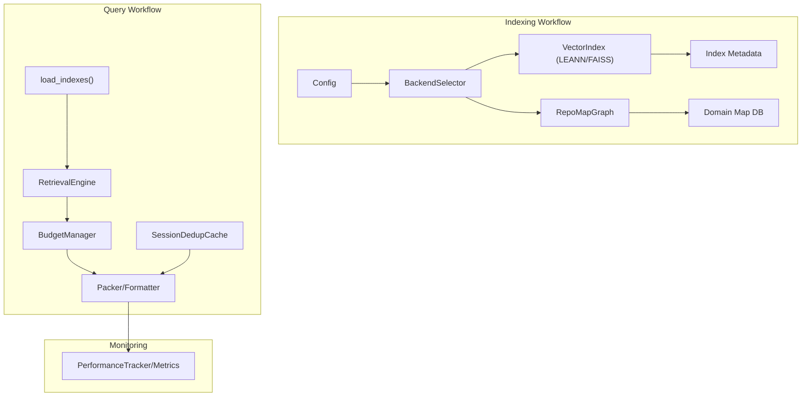
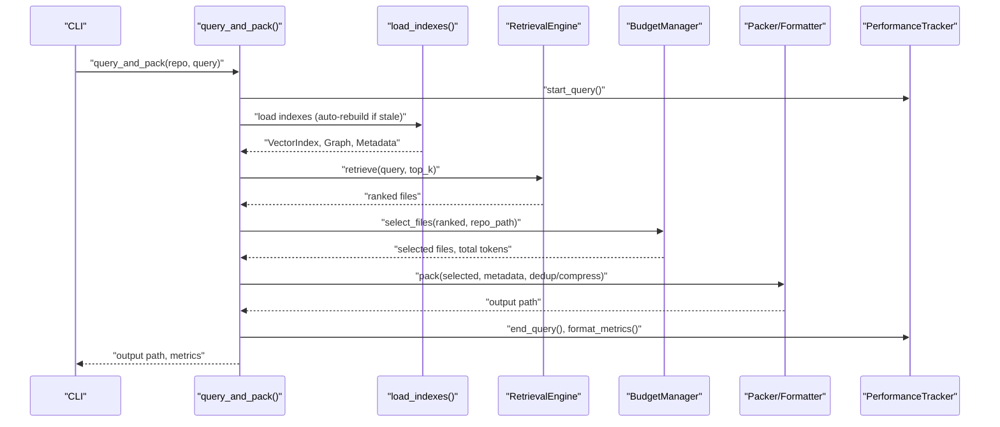
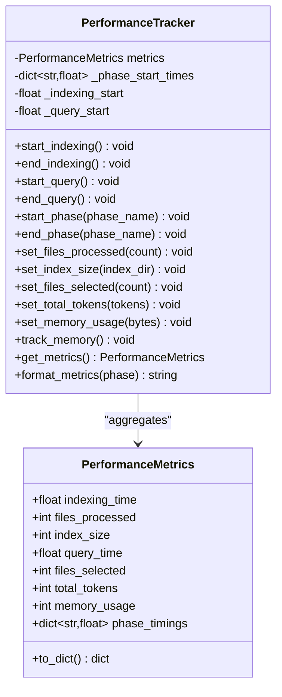
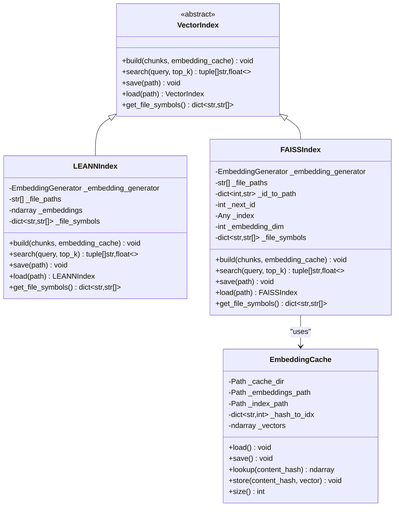
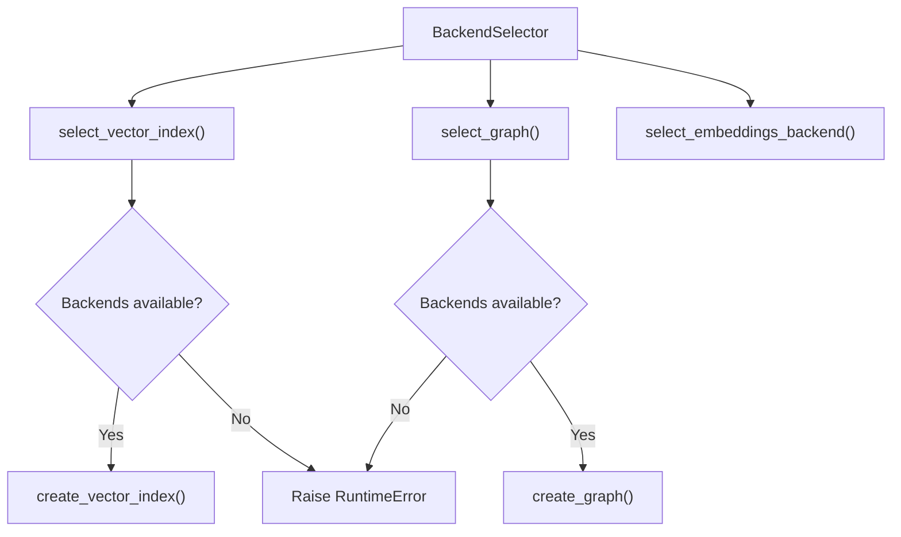
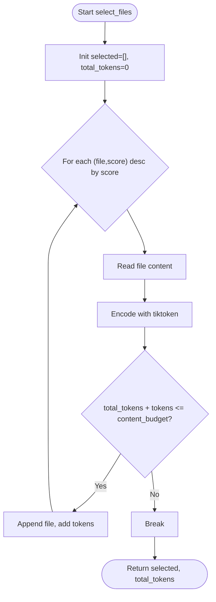
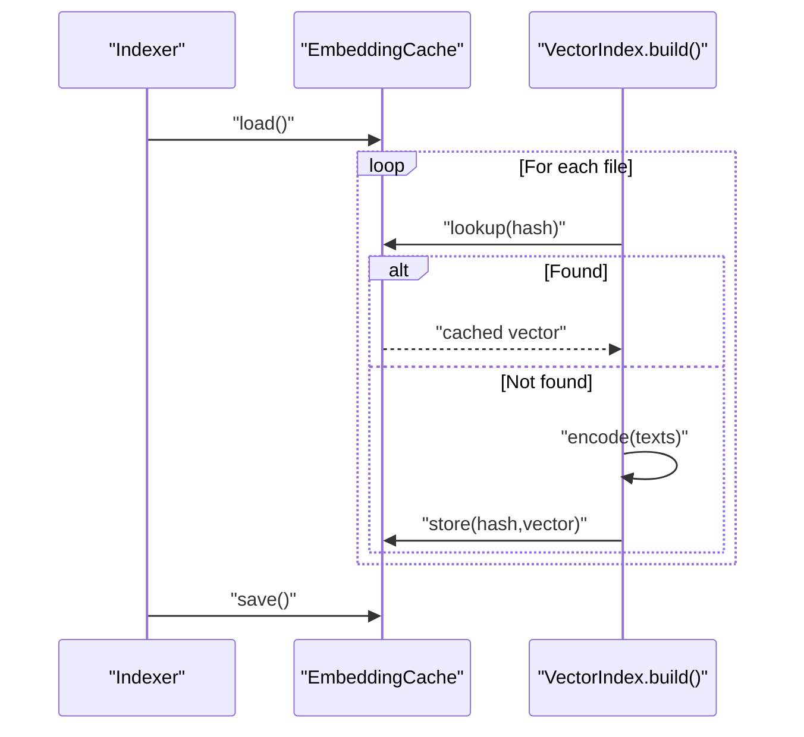
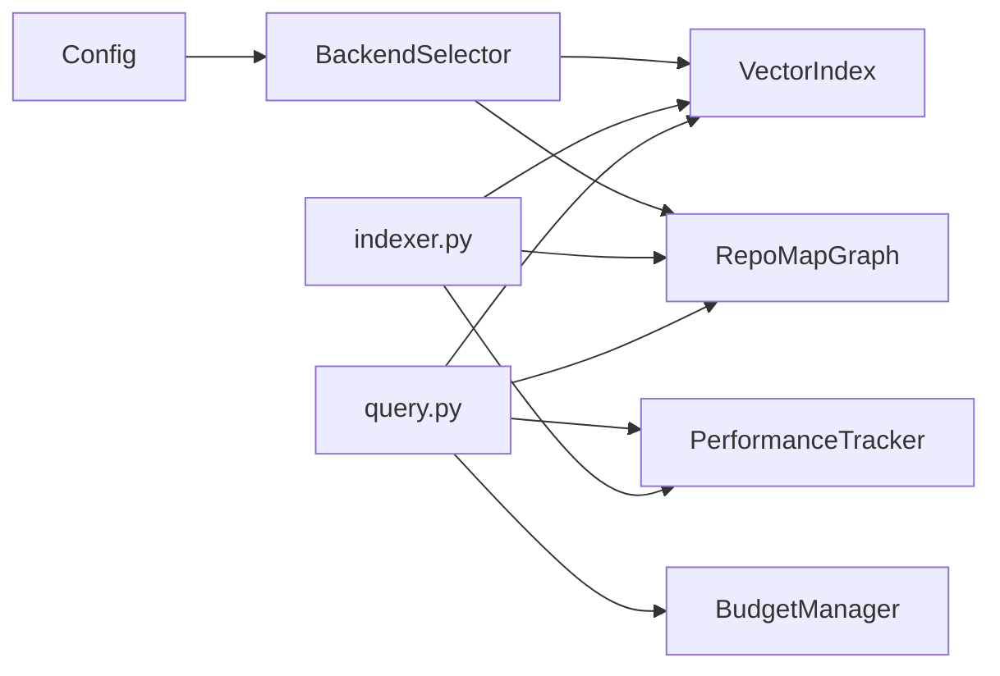

# Performance Architecture

<cite>
**Referenced Files in This Document**
- [performance.md](file://docs/guides/performance.md)
- [performance.py](file://src/ws_ctx_engine/monitoring/performance.py)
- [embedding_cache.py](file://src/ws_ctx_engine/vector_index/embedding_cache.py)
- [dedup_cache.py](file://src/ws_ctx_engine/session/dedup_cache.py)
- [budget.py](file://src/ws_ctx_engine/budget/budget.py)
- [query.py](file://src/ws_ctx_engine/workflow/query.py)
- [indexer.py](file://src/ws_ctx_engine/workflow/indexer.py)
- [vector_index.py](file://src/ws_ctx_engine/vector_index/vector_index.py)
- [backend_selector.py](file://src/ws_ctx_engine/backend_selector/backend_selector.py)
- [base.py](file://src/ws_ctx_engine/chunker/base.py)
- [config.py](file://src/ws_ctx_engine/config/config.py)
- [test_performance_benchmarks.py](file://tests/test_performance_benchmarks.py)
</cite>

## Table of Contents
1. [Introduction](#introduction)
2. [Project Structure](#project-structure)
3. [Core Components](#core-components)
4. [Architecture Overview](#architecture-overview)
5. [Detailed Component Analysis](#detailed-component-analysis)
6. [Dependency Analysis](#dependency-analysis)
7. [Performance Considerations](#performance-considerations)
8. [Troubleshooting Guide](#troubleshooting-guide)
9. [Conclusion](#conclusion)
10. [Appendices](#appendices)

## Introduction
This document describes the performance architecture and optimization targets of ws-ctx-engine. It covers pipeline stages, memory usage targets, storage optimization strategies, backend performance characteristics, caching mechanisms for embeddings and indices, and techniques to achieve sub-second query times. It also documents monitoring and profiling infrastructure, performance regression detection, and practical tuning guidelines for custom deployments.

## Project Structure
The performance-critical parts of ws-ctx-engine are organized around two major workflows:
- Indexing workflow: parses code, builds vector and graph indexes, persists metadata and domain maps.
- Query workflow: loads indexes, retrieves candidates, selects within token budget, packs output, and tracks metrics.

Key modules involved in performance:
- Monitoring and metrics: PerformanceTracker and PerformanceMetrics
- Indexing and retrieval: VectorIndex backends (LEANNIndex, FAISSIndex), BackendSelector
- Budget-aware selection: BudgetManager
- Caching: EmbeddingCache (disk-backed), SessionDeduplicationCache (session-level)
- File walking and hot-path acceleration: Rust extension fallback chain
- Configuration: performance tuning knobs (cache_embeddings, incremental_index)

**Diagram sources**
- [indexer.py:72-371](file://src/ws_ctx_engine/workflow/indexer.py#L72-L371)
- [query.py:230-617](file://src/ws_ctx_engine/workflow/query.py#L230-L617)
- [backend_selector.py:13-191](file://src/ws_ctx_engine/backend_selector/backend_selector.py#L13-L191)
- [vector_index.py:21-800](file://src/ws_ctx_engine/vector_index/vector_index.py#L21-L800)
- [performance.py:72-263](file://src/ws_ctx_engine/monitoring/performance.py#L72-L263)

**Section sources**
- [indexer.py:72-371](file://src/ws_ctx_engine/workflow/indexer.py#L72-L371)
- [query.py:230-617](file://src/ws_ctx_engine/workflow/query.py#L230-L617)
- [backend_selector.py:13-191](file://src/ws_ctx_engine/backend_selector/backend_selector.py#L13-L191)
- [vector_index.py:21-800](file://src/ws_ctx_engine/vector_index/vector_index.py#L21-L800)
- [performance.py:72-263](file://src/ws_ctx_engine/monitoring/performance.py#L72-L263)

## Core Components
- PerformanceTracker and PerformanceMetrics: Track per-phase timings, file counts, index size, token counts, and peak memory usage. Supports human-readable formatting and disk-backed index size calculation.
- VectorIndex backends: LEANNIndex (cosine similarity over file embeddings) and FAISSIndex (exact brute-force search with ID mapping for incremental updates).
- BackendSelector: Centralized selection with graceful fallback across vector index, graph, and embeddings backends.
- BudgetManager: Greedy knapsack selection constrained to 80% of token budget for content, reserving 20% for metadata/manifest.
- EmbeddingCache: Disk-backed cache of content-hash → embedding vector to avoid re-embedding unchanged files.
- SessionDeduplicationCache: Lightweight session-level cache to deduplicate repeated file content across agent calls.
- Hot-path acceleration: Optional Rust extension for file walking and hashing/token counting with Python fallback.

**Section sources**
- [performance.py:13-263](file://src/ws_ctx_engine/monitoring/performance.py#L13-L263)
- [vector_index.py:21-800](file://src/ws_ctx_engine/vector_index/vector_index.py#L21-L800)
- [backend_selector.py:13-191](file://src/ws_ctx_engine/backend_selector/backend_selector.py#L13-L191)
- [budget.py:8-105](file://src/ws_ctx_engine/budget/budget.py#L8-L105)
- [embedding_cache.py:28-127](file://src/ws_ctx_engine/vector_index/embedding_cache.py#L28-L127)
- [dedup_cache.py:35-154](file://src/ws_ctx_engine/session/dedup_cache.py#L35-L154)
- [base.py:10-25](file://src/ws_ctx_engine/chunker/base.py#L10-L25)

## Architecture Overview
The system achieves sub-second query times by combining:
- Efficient index backends (LEANNIndex for storage savings, FAISSIndex for exact brute-force search)
- Incremental indexing with embedding cache and file-hash metadata
- Token-aware budget selection to cap output size
- Session-level deduplication to reduce token usage
- Monitoring-driven performance targets and regression tests

**Diagram sources**
- [query.py:230-617](file://src/ws_ctx_engine/workflow/query.py#L230-L617)
- [indexer.py:404-493](file://src/ws_ctx_engine/workflow/indexer.py#L404-L493)
- [budget.py:50-105](file://src/ws_ctx_engine/budget/budget.py#L50-L105)

## Detailed Component Analysis

### Performance Monitoring and Metrics
- Tracks indexing and query phases, files processed, index size, files selected, total tokens, and peak memory usage.
- Provides formatted metrics and human-readable size formatting.
- Uses psutil for memory tracking when available.

**Diagram sources**
- [performance.py:13-263](file://src/ws_ctx_engine/monitoring/performance.py#L13-L263)

**Section sources**
- [performance.py:72-263](file://src/ws_ctx_engine/monitoring/performance.py#L72-L263)

### Vector Index Backends and Storage Optimization
- LEANNIndex: Stores file-level embeddings; 97% storage savings by recomputing on-the-fly for non-indexed vectors.
- FAISSIndex: Exact brute-force search with IndexIDMap2 to maintain stable ID-to-path mapping across deletions.
- EmbeddingCache: Persists embeddings.npy and embedding_index.json; content-hash-based invalidation ensures correctness.

**Diagram sources**
- [vector_index.py:21-800](file://src/ws_ctx_engine/vector_index/vector_index.py#L21-L800)
- [embedding_cache.py:28-127](file://src/ws_ctx_engine/vector_index/embedding_cache.py#L28-L127)

**Section sources**
- [vector_index.py:282-800](file://src/ws_ctx_engine/vector_index/vector_index.py#L282-L800)
- [embedding_cache.py:28-127](file://src/ws_ctx_engine/vector_index/embedding_cache.py#L28-L127)

### Backend Selection and Fallback Chain
- BackendSelector chooses vector index, graph, and embeddings backends with a defined fallback hierarchy.
- Logs current fallback level and configuration for observability.

**Diagram sources**
- [backend_selector.py:36-118](file://src/ws_ctx_engine/backend_selector/backend_selector.py#L36-L118)

**Section sources**
- [backend_selector.py:13-191](file://src/ws_ctx_engine/backend_selector/backend_selector.py#L13-L191)

### Budget-Aware File Selection
- BudgetManager implements a greedy knapsack algorithm, selecting files within an 80% content budget (reserving 20% for metadata/manifest).
- Uses tiktoken encoding to estimate token counts.

**Diagram sources**
- [budget.py:50-105](file://src/ws_ctx_engine/budget/budget.py#L50-L105)

**Section sources**
- [budget.py:8-105](file://src/ws_ctx_engine/budget/budget.py#L8-L105)

### Caching Mechanisms
- EmbeddingCache: Disk-backed cache keyed by SHA-256 of concatenated chunk content per file; invalidates on content change.
- SessionDeduplicationCache: Per-session cache of file content hashes; replaces repeated content with a compact marker and persists to disk safely.

**Diagram sources**
- [indexer.py:197-237](file://src/ws_ctx_engine/workflow/indexer.py#L197-L237)
- [embedding_cache.py:55-127](file://src/ws_ctx_engine/vector_index/embedding_cache.py#L55-L127)

**Section sources**
- [embedding_cache.py:28-127](file://src/ws_ctx_engine/vector_index/embedding_cache.py#L28-L127)
- [dedup_cache.py:35-154](file://src/ws_ctx_engine/session/dedup_cache.py#L35-L154)

### Hot-Path Acceleration and File Walking
- Optional Rust extension provides accelerated file walking and hashing/token counting with a Python fallback chain.
- Improves performance significantly for large repositories.

**Section sources**
- [base.py:10-25](file://src/ws_ctx_engine/chunker/base.py#L10-L25)
- [performance.md:1-81](file://docs/guides/performance.md#L1-L81)

### Query Pipeline Stages and Metrics
- Index loading, retrieval, budget selection, packing, and post-processing (compression/dedup) are tracked as distinct phases.
- Metrics include per-phase durations, files selected, total tokens, and peak memory usage.

**Section sources**
- [query.py:294-617](file://src/ws_ctx_engine/workflow/query.py#L294-L617)

### Indexing Pipeline Stages and Metrics
- Parsing, vector indexing (with optional incremental and embedding cache), graph building, metadata saving, and domain map building.
- Index size tracking and per-phase metrics.

**Section sources**
- [indexer.py:129-371](file://src/ws_ctx_engine/workflow/indexer.py#L129-L371)

## Dependency Analysis
- Indexing depends on BackendSelector for backend resolution, VectorIndex backends for embeddings, and RepoMapGraph for graph construction.
- Query depends on load_indexes for index loading, RetrievalEngine for candidate ranking, BudgetManager for selection, and Packer/Formatter for output generation.
- Monitoring integrates across both workflows via PerformanceTracker.

**Diagram sources**
- [indexer.py:72-371](file://src/ws_ctx_engine/workflow/indexer.py#L72-L371)
- [query.py:230-617](file://src/ws_ctx_engine/workflow/query.py#L230-L617)
- [backend_selector.py:13-118](file://src/ws_ctx_engine/backend_selector/backend_selector.py#L13-L118)
- [budget.py:8-105](file://src/ws_ctx_engine/budget/budget.py#L8-L105)
- [performance.py:72-263](file://src/ws_ctx_engine/monitoring/performance.py#L72-L263)

**Section sources**
- [indexer.py:72-371](file://src/ws_ctx_engine/workflow/indexer.py#L72-L371)
- [query.py:230-617](file://src/ws_ctx_engine/workflow/query.py#L230-L617)
- [backend_selector.py:13-118](file://src/ws_ctx_engine/backend_selector/backend_selector.py#L13-L118)
- [budget.py:8-105](file://src/ws_ctx_engine/budget/budget.py#L8-L105)
- [performance.py:72-263](file://src/ws_ctx_engine/monitoring/performance.py#L72-L263)

## Performance Considerations
- Performance targets:
  - Sub-second query times for large repositories with primary backends.
  - Indexing within 5 minutes for 10k files with primary backends; 10 minutes with fallback backends.
  - Memory usage tracked and reported; psutil integration optional.
- Backend characteristics:
  - Primary: LEANNIndex (cosine similarity) with 97% storage savings; FAISSIndex (exact brute-force) for accuracy.
  - Fallback: FAISSIndex with API embeddings; file-size ranking fallback when all else fails.
- Storage optimization:
  - EmbeddingCache reduces re-encoding costs on incremental rebuilds.
  - FAISSIndex uses IndexIDMap2 to preserve ID-to-path mapping across deletions.
  - Domain map persisted as SQLite DB for keyword lookups.
- Hot-path acceleration:
  - Rust extension improves file walking, hashing, and token counting.
- Token budgeting:
  - 80% content budget with 20% reserved for metadata/manifest.
- Session-level deduplication:
  - Replaces repeated file content with compact markers to reduce tokens and cost.

**Section sources**
- [test_performance_benchmarks.py:141-440](file://tests/test_performance_benchmarks.py#L141-L440)
- [vector_index.py:282-800](file://src/ws_ctx_engine/vector_index/vector_index.py#L282-L800)
- [indexer.py:197-237](file://src/ws_ctx_engine/workflow/indexer.py#L197-L237)
- [budget.py:8-105](file://src/ws_ctx_engine/budget/budget.py#L8-L105)
- [dedup_cache.py:35-154](file://src/ws_ctx_engine/session/dedup_cache.py#L35-L154)
- [base.py:10-25](file://src/ws_ctx_engine/chunker/base.py#L10-L25)
- [performance.md:1-81](file://docs/guides/performance.md#L1-L81)

## Troubleshooting Guide
- Performance regression detection:
  - Benchmarks enforce upper bounds on indexing and query durations for primary and fallback backends.
  - Memory usage is tracked and logged; missing psutil disables memory tracking.
- Common issues:
  - Missing Rust extension: fallback to Python implementations; expect slower hot-path operations.
  - Out-of-memory during local embedding: automatic fallback to API embeddings.
  - Stale indexes: automatic rebuild triggered; disable via configuration to force using stale indexes.
  - Backend failures: BackendSelector logs current fallback level and raises if all backends fail.
- Tuning guidelines:
  - Prefer primary backends (LEANN + igraph) for optimal performance.
  - Enable embedding cache and incremental indexing for large repositories.
  - Adjust token budget and output format to balance quality and speed.
  - Monitor per-phase metrics to identify bottlenecks (parsing, vector indexing, retrieval, packing).

**Section sources**
- [test_performance_benchmarks.py:141-440](file://tests/test_performance_benchmarks.py#L141-L440)
- [vector_index.py:130-280](file://src/ws_ctx_engine/vector_index/vector_index.py#L130-L280)
- [indexer.py:456-493](file://src/ws_ctx_engine/workflow/indexer.py#L456-L493)
- [backend_selector.py:158-191](file://src/ws_ctx_engine/backend_selector/backend_selector.py#L158-L191)
- [performance.py:185-206](file://src/ws_ctx_engine/monitoring/performance.py#L185-L206)

## Conclusion
ws-ctx-engine’s performance architecture combines efficient index backends, incremental rebuilds with embedding caching, token-aware budgeting, and robust monitoring. The system targets sub-second queries and scalable indexing through backend fallbacks, hot-path acceleration, and careful storage optimization. The provided benchmarks and metrics enable regression detection and targeted tuning for custom deployments.

## Appendices

### Performance Targets and Benchmarks
- Primary backend indexing: <300s for 10k files.
- Fallback backend indexing: <600s for 10k files.
- Primary backend query: <10s for 10k files.
- Fallback backend query: <15s for 10k files.
- Memory usage tracked via psutil when available.

**Section sources**
- [test_performance_benchmarks.py:173-369](file://tests/test_performance_benchmarks.py#L173-L369)
- [performance.md:8-81](file://docs/guides/performance.md#L8-L81)

### Configuration Options for Performance
- performance.cache_embeddings: Persist embeddings to disk to avoid re-embedding unchanged files.
- performance.incremental_index: Gate incremental rebuilds; can be disabled to force full rebuilds.
- embeddings.batch_size: Controls batching for embedding generation.
- token_budget: Total token budget for context; 80% reserved for content.

**Section sources**
- [config.py:94-101](file://src/ws_ctx_engine/config/config.py#L94-L101)
- [config.py:371-399](file://src/ws_ctx_engine/config/config.py#L371-L399)
- [budget.py:32-49](file://src/ws_ctx_engine/budget/budget.py#L32-L49)