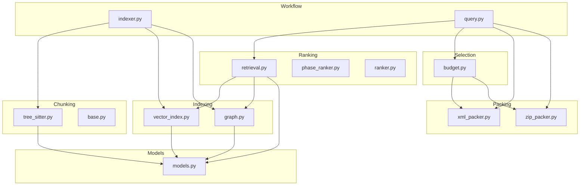
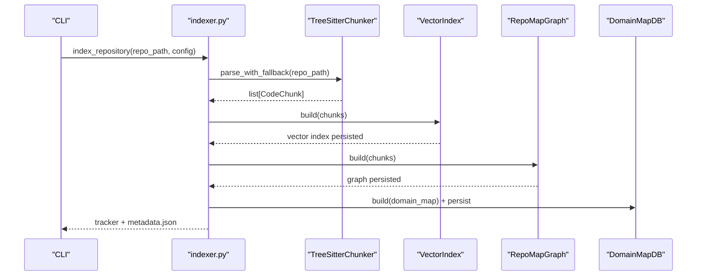
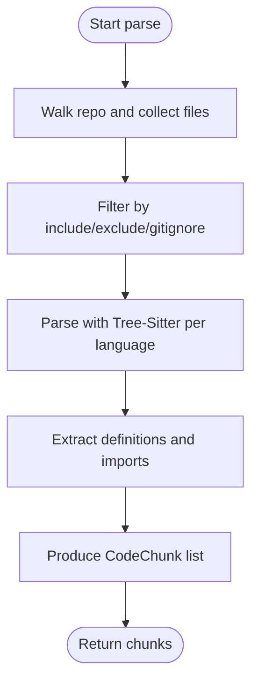
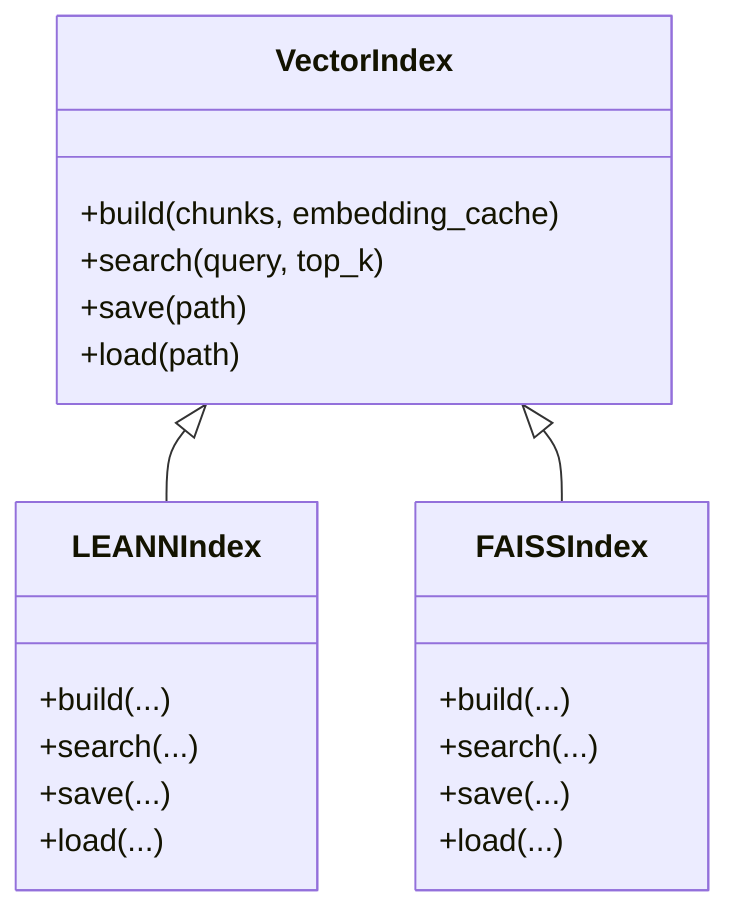
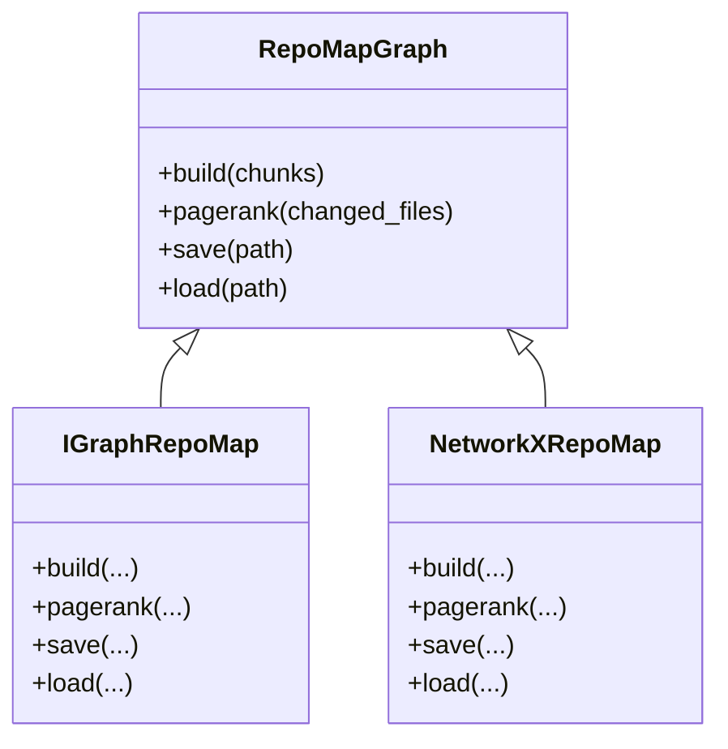
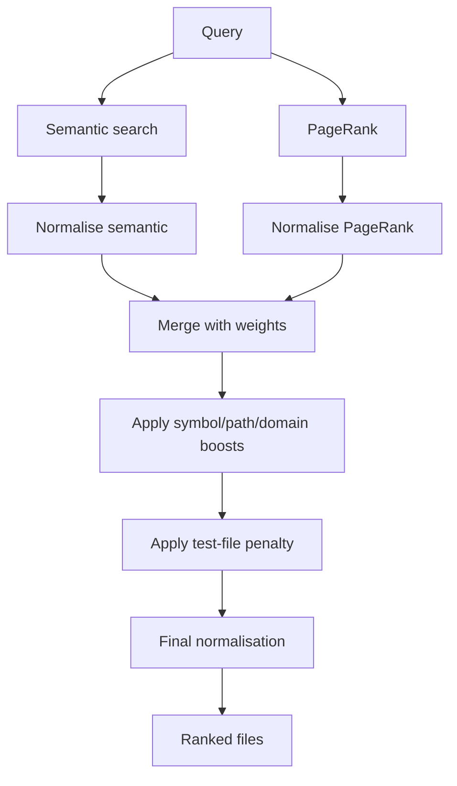
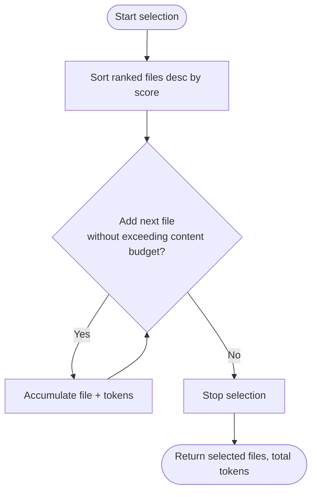
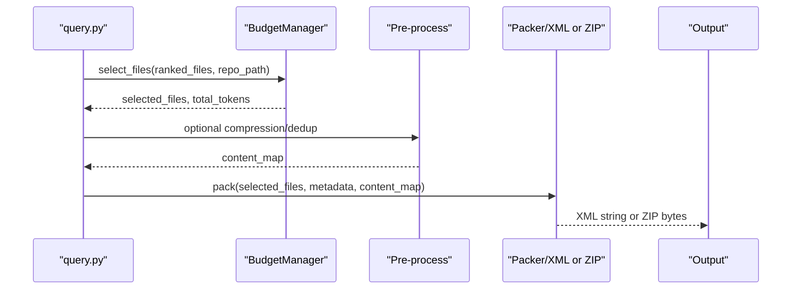
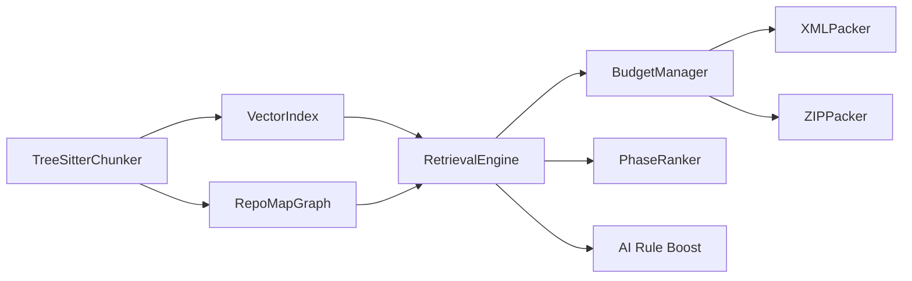

# Pipeline Architecture

<cite>
**Referenced Files in This Document**
- [indexer.py](file://src/ws_ctx_engine/workflow/indexer.py)
- [query.py](file://src/ws_ctx_engine/workflow/query.py)
- [models.py](file://src/ws_ctx_engine/models/models.py)
- [tree_sitter.py](file://src/ws_ctx_engine/chunker/tree_sitter.py)
- [base.py](file://src/ws_ctx_engine/chunker/base.py)
- [vector_index.py](file://src/ws_ctx_engine/vector_index/vector_index.py)
- [graph.py](file://src/ws_ctx_engine/graph/graph.py)
- [retrieval.py](file://src/ws_ctx_engine/retrieval/retrieval.py)
- [budget.py](file://src/ws_ctx_engine/budget/budget.py)
- [xml_packer.py](file://src/ws_ctx_engine/packer/xml_packer.py)
- [zip_packer.py](file://src/ws_ctx_engine/packer/zip_packer.py)
- [phase_ranker.py](file://src/ws_ctx_engine/ranking/phase_ranker.py)
- [ranker.py](file://src/ws_ctx_engine/ranking/ranker.py)
</cite>

## Table of Contents
1. [Introduction](#introduction)
2. [Project Structure](#project-structure)
3. [Core Components](#core-components)
4. [Architecture Overview](#architecture-overview)
5. [Detailed Component Analysis](#detailed-component-analysis)
6. [Dependency Analysis](#dependency-analysis)
7. [Performance Considerations](#performance-considerations)
8. [Troubleshooting Guide](#troubleshooting-guide)
9. [Conclusion](#conclusion)

## Introduction
This document explains the 6-stage pipeline architecture of ws-ctx-engine: chunking, indexing, graphing, ranking, selection, and packing. It details how CodeChunk objects flow through each stage, how intermediate results are persisted, and how final outputs are generated. It also documents the token budget allocation strategy and how each stage contributes to optimization goals such as relevance, recall, and token efficiency.

## Project Structure
The pipeline is implemented across several modules:
- Workflow orchestration: indexing and querying
- Data models: CodeChunk and IndexMetadata
- Chunking: AST parsing with Tree-Sitter and fallbacks
- Indexing: vector embeddings and graph construction
- Ranking: hybrid scoring and phase-aware weighting
- Selection: greedy knapsack with token budget
- Packing: XML and ZIP output generation

**Diagram sources**
- [indexer.py:72-371](file://src/ws_ctx_engine/workflow/indexer.py#L72-L371)
- [query.py:230-616](file://src/ws_ctx_engine/workflow/query.py#L230-L616)
- [models.py:10-152](file://src/ws_ctx_engine/models/models.py#L10-L152)
- [tree_sitter.py:15-160](file://src/ws_ctx_engine/chunker/tree_sitter.py#L15-L160)
- [vector_index.py:21-800](file://src/ws_ctx_engine/vector_index/vector_index.py#L21-L800)
- [graph.py:19-667](file://src/ws_ctx_engine/graph/graph.py#L19-L667)
- [retrieval.py:140-627](file://src/ws_ctx_engine/retrieval/retrieval.py#L140-L627)
- [budget.py:8-105](file://src/ws_ctx_engine/budget/budget.py#L8-L105)
- [xml_packer.py:51-239](file://src/ws_ctx_engine/packer/xml_packer.py#L51-L239)
- [zip_packer.py:17-254](file://src/ws_ctx_engine/packer/zip_packer.py#L17-L254)

**Section sources**
- [indexer.py:72-371](file://src/ws_ctx_engine/workflow/indexer.py#L72-L371)
- [query.py:230-616](file://src/ws_ctx_engine/workflow/query.py#L230-L616)

## Core Components
- CodeChunk: Encapsulates parsed code segments with metadata (path, line range, content, symbols, language). It supports token counting and serialisation for incremental caching.
- IndexMetadata: Stores index creation timestamp, backend, file count, and file hashes for staleness detection.
- RetrievalEngine: Combines semantic and structural signals to produce hybrid scores, then applies additional boosts and penalties and normalises to [0, 1].

**Section sources**
- [models.py:10-152](file://src/ws_ctx_engine/models/models.py#L10-L152)
- [retrieval.py:140-627](file://src/ws_ctx_engine/retrieval/retrieval.py#L140-L627)

## Architecture Overview
The pipeline consists of two main workflows orchestrated by indexer.py and query.py. The indexer builds persistent artifacts (vector index, graph, domain map, metadata). The query workflow loads these artifacts, retrieves candidates, selects within budget, and packs outputs.

**Diagram sources**
- [indexer.py:72-371](file://src/ws_ctx_engine/workflow/indexer.py#L72-L371)
- [tree_sitter.py:57-89](file://src/ws_ctx_engine/chunker/tree_sitter.py#L57-L89)
- [vector_index.py:28-84](file://src/ws_ctx_engine/vector_index/vector_index.py#L28-L84)
- [graph.py:27-94](file://src/ws_ctx_engine/graph/graph.py#L27-L94)

## Detailed Component Analysis

### Stage 1: Chunking (AST parsing)
- Responsibilities: Discover files, filter via include/exclude/gitignore, parse with Tree-Sitter per-language, extract definitions and imports, and produce CodeChunk objects.
- Key behaviors:
  - Language coverage: Python, JavaScript, TypeScript, Rust via Tree-Sitter with resolvers.
  - Fallbacks: Markdown chunker and regex fallbacks for unsupported extensions.
  - File filtering: gitignore patterns, include/exclude configs, and explicit matching rules.
- Outputs: list[CodeChunk] consumed by downstream stages.

**Diagram sources**
- [tree_sitter.py:57-160](file://src/ws_ctx_engine/chunker/tree_sitter.py#L57-L160)
- [base.py:47-176](file://src/ws_ctx_engine/chunker/base.py#L47-L176)

**Section sources**
- [tree_sitter.py:15-160](file://src/ws_ctx_engine/chunker/tree_sitter.py#L15-L160)
- [base.py:41-176](file://src/ws_ctx_engine/chunker/base.py#L41-L176)

### Stage 2: Indexing (vector embeddings)
- Responsibilities: Build semantic vector index from CodeChunk content, manage embedding generation and caching, and persist the index.
- Key behaviors:
  - Embedding generation: sentence-transformers with fallback to OpenAI API; memory-aware selection.
  - Incremental update: detect changed/deleted files and update FAISS index accordingly.
  - Caching: EmbeddingCache skips re-embedding unchanged files across full rebuilds.
- Outputs: persisted vector index file.

**Diagram sources**
- [vector_index.py:21-800](file://src/ws_ctx_engine/vector_index/vector_index.py#L21-L800)

**Section sources**
- [vector_index.py:282-800](file://src/ws_ctx_engine/vector_index/vector_index.py#L282-L800)

### Stage 3: Graphing (dependency analysis)
- Responsibilities: Construct a directed dependency graph from symbol references and compute PageRank scores for structural importance.
- Key behaviors:
  - Backend selection: igraph (preferred, C++), with NetworkX fallback (pure Python).
  - Changed-file boosting: multiply PageRank scores for changed files and renormalise.
  - Persistence: pickle-based save/load with backend detection.
- Outputs: persisted graph file.

**Diagram sources**
- [graph.py:19-667](file://src/ws_ctx_engine/graph/graph.py#L19-L667)

**Section sources**
- [graph.py:97-667](file://src/ws_ctx_engine/graph/graph.py#L97-L667)

### Stage 4: Ranking (hybrid scoring)
- Responsibilities: Combine semantic similarity and PageRank into hybrid scores, then apply symbol/path/domain boosts and test-file penalties, and finally normalise to [0, 1].
- Key behaviors:
  - Query tokenisation and stop-word filtering.
  - Adaptive boosting per query type (symbol, path-dominant, semantic-dominant).
  - Domain keyword mapping for directory-based boosting.
  - AI rule boost: always rank canonical rule files highly.
- Outputs: list of (file_path, score) sorted descending.

**Diagram sources**
- [retrieval.py:250-368](file://src/ws_ctx_engine/retrieval/retrieval.py#L250-L368)
- [ranker.py:28-86](file://src/ws_ctx_engine/ranking/ranker.py#L28-L86)

**Section sources**
- [retrieval.py:140-627](file://src/ws_ctx_engine/retrieval/retrieval.py#L140-L627)
- [ranker.py:28-86](file://src/ws_ctx_engine/ranking/ranker.py#L28-L86)

### Stage 5: Selection (budget optimization)
- Responsibilities: Select files within the token budget using a greedy knapsack algorithm, reserving 20% for metadata and manifest.
- Key behaviors:
  - Token counting via tiktoken; reads file content to compute tokens.
  - Accumulate files in descending score order until content budget is exhausted.
- Outputs: selected file paths and total tokens used.

**Diagram sources**
- [budget.py:50-105](file://src/ws_ctx_engine/budget/budget.py#L50-L105)

**Section sources**
- [budget.py:8-105](file://src/ws_ctx_engine/budget/budget.py#L8-L105)

### Stage 6: Packing (format generation)
- Responsibilities: Generate final outputs in configured format (XML, ZIP, JSON, YAML, TOON, Markdown) with metadata and optional pre-processing (compression, deduplication).
- Key behaviors:
  - XML: Repomix-style structure with metadata and file entries; optional shuffling to improve recall.
  - ZIP: Preserved directory structure under files/, plus REVIEW_CONTEXT.md manifest.
  - Other formats: structured payloads with metadata and file lists.
  - Security: optional secret scanning with redaction.
- Outputs: file path or bytes depending on format.

**Diagram sources**
- [query.py:413-616](file://src/ws_ctx_engine/workflow/query.py#L413-L616)
- [xml_packer.py:85-137](file://src/ws_ctx_engine/packer/xml_packer.py#L85-L137)
- [zip_packer.py:49-90](file://src/ws_ctx_engine/packer/zip_packer.py#L49-L90)

**Section sources**
- [query.py:413-616](file://src/ws_ctx_engine/workflow/query.py#L413-L616)
- [xml_packer.py:51-239](file://src/ws_ctx_engine/packer/xml_packer.py#L51-L239)
- [zip_packer.py:17-254](file://src/ws_ctx_engine/packer/zip_packer.py#L17-L254)

### Token Budget Allocation Strategy
- Total token budget is split into:
  - Content budget: 80% for file contents
  - Metadata/manifest budget: 20% reserved for headers, manifests, and auxiliary info
- Selection respects content budget greedily; final token usage is tracked and reported.

**Section sources**
- [budget.py:32-49](file://src/ws_ctx_engine/budget/budget.py#L32-L49)
- [query.py:387-411](file://src/ws_ctx_engine/workflow/query.py#L387-L411)

### Persistence Mechanisms for Intermediate Results
- Indexes and metadata:
  - Vector index: persisted as a binary file (LEANN or FAISS).
  - Graph: pickled representation with backend detection.
  - Domain keyword map: SQLite-backed database (DomainMapDB) storing keyword-to-directories mapping.
  - Metadata: JSON with creation timestamp, repo path, file count, backend, and file hashes for staleness detection.
- Staleness detection: compare stored file hashes with current disk state; rebuild if needed.

**Section sources**
- [indexer.py:27-329](file://src/ws_ctx_engine/workflow/indexer.py#L27-L329)
- [models.py:87-152](file://src/ws_ctx_engine/models/models.py#L87-L152)
- [vector_index.py:429-503](file://src/ws_ctx_engine/vector_index/vector_index.py#L429-L503)
- [graph.py:233-314](file://src/ws_ctx_engine/graph/graph.py#L233-L314)

### Final Output Formats
- XML: Repomix-style with metadata header and file entries; optional content compression and deduplication markers.
- ZIP: Archive with files/ directory and REVIEW_CONTEXT.md manifest; includes importance scores and reading suggestions.
- Structured formats: JSON, YAML, TOON, Markdown with metadata and file payloads.

**Section sources**
- [xml_packer.py:51-239](file://src/ws_ctx_engine/packer/xml_packer.py#L51-L239)
- [zip_packer.py:17-254](file://src/ws_ctx_engine/packer/zip_packer.py#L17-L254)
- [query.py:536-587](file://src/ws_ctx_engine/workflow/query.py#L536-L587)

### Agent Phase-Aware Ranking
- Optional phase-aware re-weighting adjusts scoring for agent workflows:
  - Discovery: emphasis on directory trees and low-token-density signatures.
  - Edit: verbatim code and related definitions; higher token density.
  - Test: increased boost for test and mock files.
- Applied after initial hybrid ranking.

**Section sources**
- [phase_ranker.py:25-138](file://src/ws_ctx_engine/ranking/phase_ranker.py#L25-L138)
- [query.py:356-366](file://src/ws_ctx_engine/workflow/query.py#L356-L366)

## Dependency Analysis
The pipeline stages are loosely coupled via well-defined interfaces and data models. The main dependencies are:
- indexer.py depends on chunker, vector_index, graph, and domain map persistence.
- query.py depends on retrieval, budget, and packers.
- All stages consume CodeChunk and emit ranked file lists or packed outputs.

**Diagram sources**
- [indexer.py:129-282](file://src/ws_ctx_engine/workflow/indexer.py#L129-L282)
- [query.py:324-412](file://src/ws_ctx_engine/workflow/query.py#L324-L412)
- [retrieval.py:140-368](file://src/ws_ctx_engine/retrieval/retrieval.py#L140-L368)
- [budget.py:50-105](file://src/ws_ctx_engine/budget/budget.py#L50-L105)
- [xml_packer.py:51-239](file://src/ws_ctx_engine/packer/xml_packer.py#L51-L239)
- [zip_packer.py:17-254](file://src/ws_ctx_engine/packer/zip_packer.py#L17-L254)

**Section sources**
- [indexer.py:72-371](file://src/ws_ctx_engine/workflow/indexer.py#L72-L371)
- [query.py:230-616](file://src/ws_ctx_engine/workflow/query.py#L230-L616)

## Performance Considerations
- Embedding generation: memory-aware fallback to API to avoid out-of-memory conditions.
- Incremental indexing: detect changed/deleted files and update FAISS index; reuse EmbeddingCache to avoid re-embedding unchanged files.
- Backend selection: igraph preferred for PageRank; NetworkX as fallback for portability.
- Token budget: 80% content budget ensures room for metadata; greedy selection prevents overconsumption.
- Output pre-processing: optional compression and session-level deduplication reduce token usage and repeated content.

[No sources needed since this section provides general guidance]

## Troubleshooting Guide
- Index rebuild on staleness: if file hashes differ or metadata is missing, the loader triggers a rebuild.
- Partial failures: retrieval falls back to PageRank-only or semantic-only when one backend fails; warnings are logged.
- Encoding issues: ZIP/XML readers fall back to latin-1 when UTF-8 decode fails; secrets are redacted when detected.
- Missing dependencies: igraph/networkx or FAISS may be unavailable; fallbacks are attempted with logs.

**Section sources**
- [indexer.py:456-492](file://src/ws_ctx_engine/workflow/indexer.py#L456-L492)
- [retrieval.py:290-307](file://src/ws_ctx_engine/retrieval/retrieval.py#L290-L307)
- [xml_packer.py:214-220](file://src/ws_ctx_engine/packer/xml_packer.py#L214-L220)
- [zip_packer.py:114-123](file://src/ws_ctx_engine/packer/zip_packer.py#L114-L123)

## Conclusion
The ws-ctx-engine pipeline transforms raw codebases into optimised context for LLMs through six stages: chunking, indexing, graphing, ranking, selection, and packing. CodeChunk serves as the central data structure, flowing through AST parsing, vector embeddings, dependency graphs, hybrid scoring, token-aware selection, and final output generation. Persistence mechanisms ensure incremental rebuilds and staleness detection, while the token budget allocation and optional pre-processing deliver efficient, high-quality context suitable for diverse agent workflows.