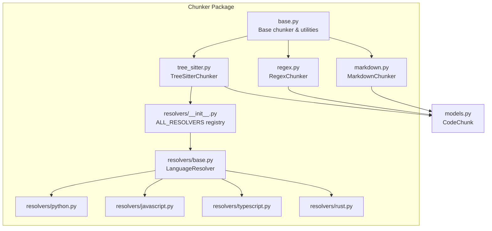
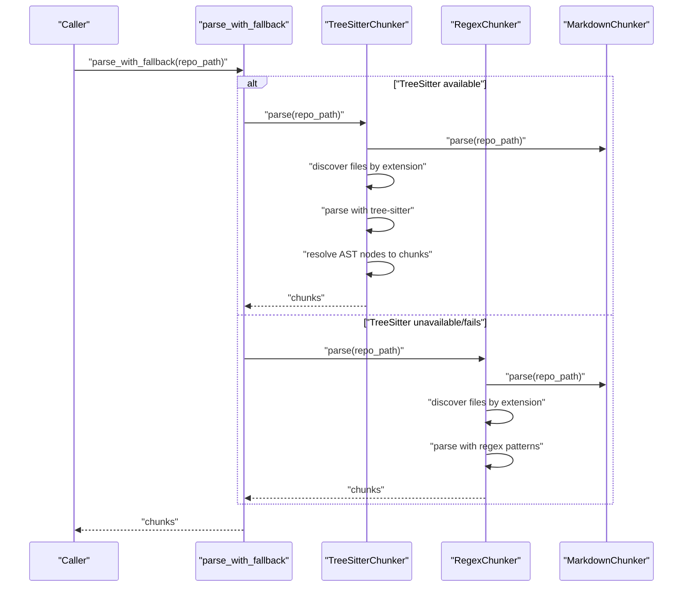
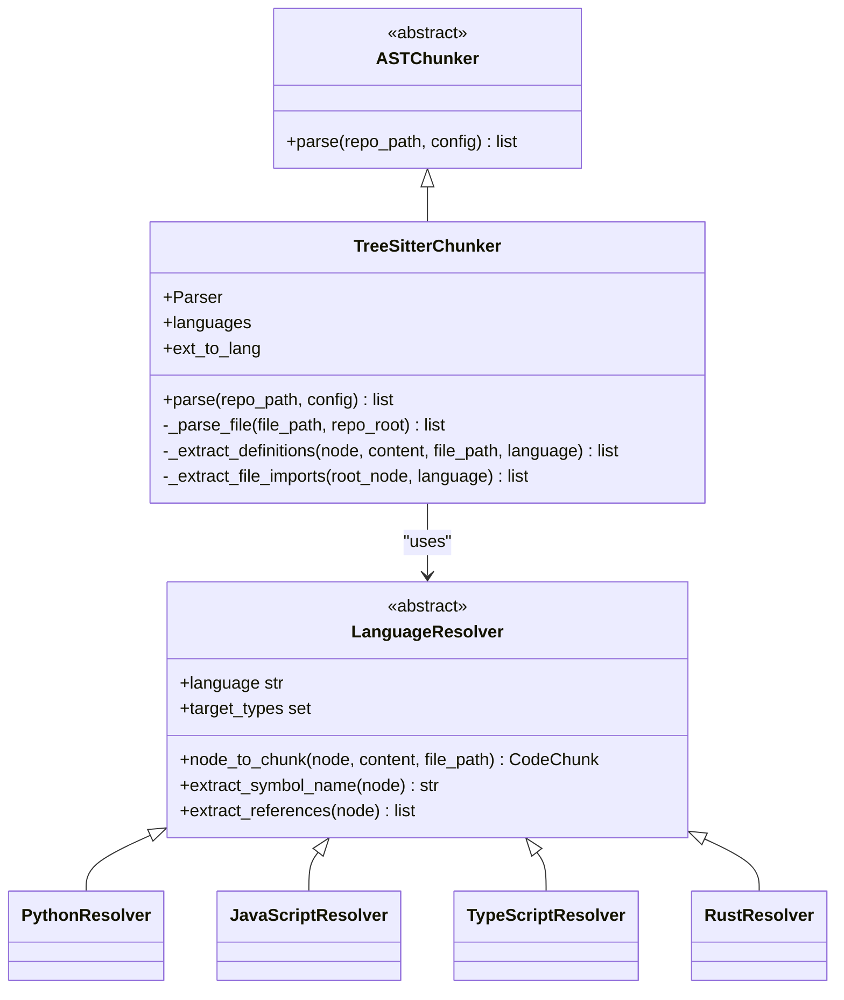
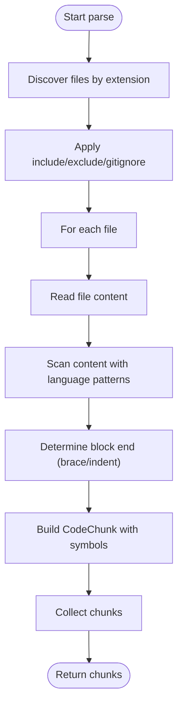
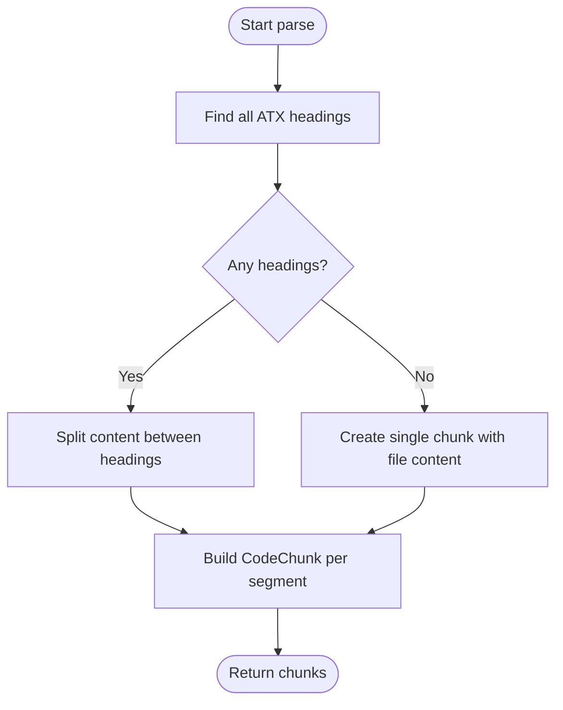
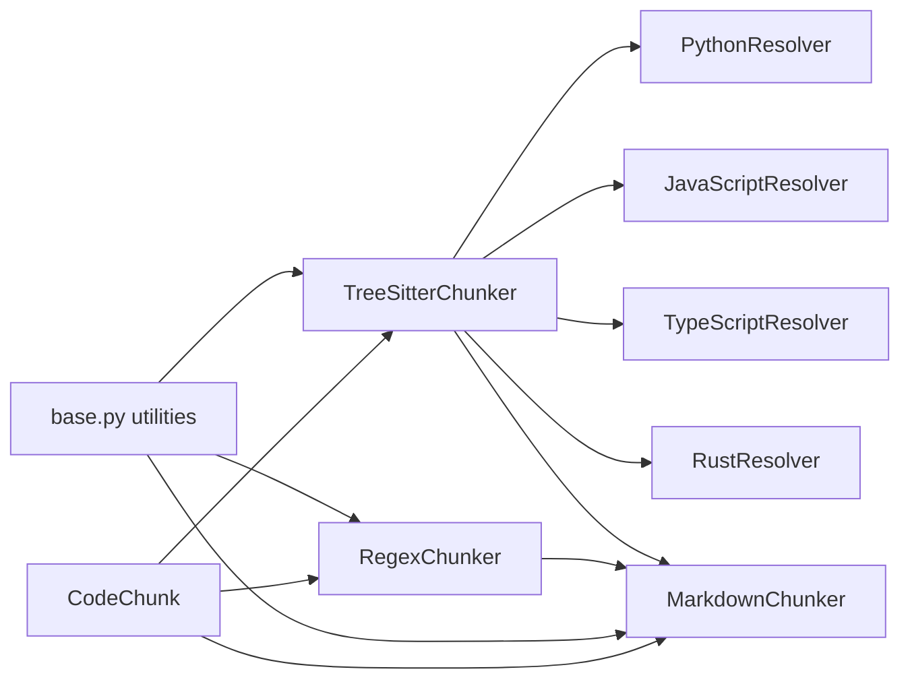

# Stage 1: Code Chunking

<cite>
**Referenced Files in This Document**
- [__init__.py](file://src/ws_ctx_engine/chunker/__init__.py)
- [base.py](file://src/ws_ctx_engine/chunker/base.py)
- [tree_sitter.py](file://src/ws_ctx_engine/chunker/tree_sitter.py)
- [regex.py](file://src/ws_ctx_engine/chunker/regex.py)
- [markdown.py](file://src/ws_ctx_engine/chunker/markdown.py)
- [resolvers/__init__.py](file://src/ws_ctx_engine/chunker/resolvers/__init__.py)
- [resolvers/base.py](file://src/ws_ctx_engine/chunker/resolvers/base.py)
- [resolvers/python.py](file://src/ws_ctx_engine/chunker/resolvers/python.py)
- [resolvers/javascript.py](file://src/ws_ctx_engine/chunker/resolvers/javascript.py)
- [resolvers/typescript.py](file://src/ws_ctx_engine/chunker/resolvers/typescript.py)
- [resolvers/rust.py](file://src/ws_ctx_engine/chunker/resolvers/rust.py)
- [models.py](file://src/ws_ctx_engine/models/models.py)
- [test_ast_chunker.py](file://tests/unit/test_ast_chunker.py)
- [test_tree_sitter_chunker.py](file://tests/unit/test_tree_sitter_chunker.py)
- [test_regex_chunker.py](file://tests/unit/test_regex_chunker.py)
- [test_markdown_chunker.py](file://tests/unit/test_markdown_chunker.py)
</cite>

## Table of Contents
1. [Introduction](#introduction)
2. [Project Structure](#project-structure)
3. [Core Components](#core-components)
4. [Architecture Overview](#architecture-overview)
5. [Detailed Component Analysis](#detailed-component-analysis)
6. [Dependency Analysis](#dependency-analysis)
7. [Performance Considerations](#performance-considerations)
8. [Troubleshooting Guide](#troubleshooting-guide)
9. [Conclusion](#conclusion)

## Introduction
This document explains Stage 1 of the pipeline: code chunking. It covers how the AST chunker parses source code using tree-sitter parsers with language-specific resolvers, including fallback mechanisms for unsupported languages. It documents chunk extraction across Python, JavaScript, TypeScript, Rust, and Markdown, detailing chunking algorithms, symbol extraction, content normalization, resolver selection logic, and error handling strategies. It also explains how chunk boundaries are determined and how edge cases in parsing are handled.

## Project Structure
The chunking stage is implemented under the chunker package with a layered design:
- Base abstractions and shared utilities
- Tree-sitter-based AST chunker
- Regex-based fallback chunker
- Markdown-specific chunker
- Language-specific resolvers for AST-to-chunk conversion
- Data model for normalized chunks



**Diagram sources**
- [base.py:1-176](file://src/ws_ctx_engine/chunker/base.py#L1-L176)
- [tree_sitter.py:1-160](file://src/ws_ctx_engine/chunker/tree_sitter.py#L1-L160)
- [regex.py:1-219](file://src/ws_ctx_engine/chunker/regex.py#L1-L219)
- [markdown.py:1-100](file://src/ws_ctx_engine/chunker/markdown.py#L1-L100)
- [resolvers/__init__.py:1-26](file://src/ws_ctx_engine/chunker/resolvers/__init__.py#L1-L26)
- [resolvers/base.py:1-70](file://src/ws_ctx_engine/chunker/resolvers/base.py#L1-L70)
- [resolvers/python.py:1-61](file://src/ws_ctx_engine/chunker/resolvers/python.py#L1-L61)
- [resolvers/javascript.py:1-85](file://src/ws_ctx_engine/chunker/resolvers/javascript.py#L1-L85)
- [resolvers/typescript.py:1-103](file://src/ws_ctx_engine/chunker/resolvers/typescript.py#L1-L103)
- [resolvers/rust.py:1-55](file://src/ws_ctx_engine/chunker/resolvers/rust.py#L1-L55)
- [models.py:10-84](file://src/ws_ctx_engine/models/models.py#L10-L84)

**Section sources**
- [base.py:1-176](file://src/ws_ctx_engine/chunker/base.py#L1-L176)
- [tree_sitter.py:1-160](file://src/ws_ctx_engine/chunker/tree_sitter.py#L1-L160)
- [regex.py:1-219](file://src/ws_ctx_engine/chunker/regex.py#L1-L219)
- [markdown.py:1-100](file://src/ws_ctx_engine/chunker/markdown.py#L1-L100)
- [resolvers/__init__.py:1-26](file://src/ws_ctx_engine/chunker/resolvers/__init__.py#L1-L26)
- [resolvers/base.py:1-70](file://src/ws_ctx_engine/chunker/resolvers/base.py#L1-L70)
- [resolvers/python.py:1-61](file://src/ws_ctx_engine/chunker/resolvers/python.py#L1-L61)
- [resolvers/javascript.py:1-85](file://src/ws_ctx_engine/chunker/resolvers/javascript.py#L1-L85)
- [resolvers/typescript.py:1-103](file://src/ws_ctx_engine/chunker/resolvers/typescript.py#L1-L103)
- [resolvers/rust.py:1-55](file://src/ws_ctx_engine/chunker/resolvers/rust.py#L1-L55)
- [models.py:10-84](file://src/ws_ctx_engine/models/models.py#L10-L84)

## Core Components
- ASTChunker: Abstract base for chunkers that parse source files into structured chunks.
- TreeSitterChunker: Uses tree-sitter parsers per language and language-specific resolvers to extract definitions and compute boundaries.
- RegexChunker: Fallback that extracts definitions and imports using language-specific regex patterns and block boundary heuristics.
- MarkdownChunker: Splits Markdown files into chunks at ATX heading boundaries, ensuring no content is silently dropped.
- LanguageResolver: Abstract interface for converting AST nodes to CodeChunk instances, including symbol extraction and references.
- CodeChunk: Normalized data structure representing a chunk with path, line range, content, defined and referenced symbols, and language.

Key behaviors:
- File discovery and inclusion/exclusion filtering are centralized in base utilities.
- Markdown is processed first and separately from language-specific AST parsing.
- Fallback logic switches from TreeSitterChunker to RegexChunker when tree-sitter dependencies are missing or parsing fails.

**Section sources**
- [base.py:41-176](file://src/ws_ctx_engine/chunker/base.py#L41-L176)
- [tree_sitter.py:15-160](file://src/ws_ctx_engine/chunker/tree_sitter.py#L15-L160)
- [regex.py:15-219](file://src/ws_ctx_engine/chunker/regex.py#L15-L219)
- [markdown.py:13-100](file://src/ws_ctx_engine/chunker/markdown.py#L13-L100)
- [resolvers/base.py:7-70](file://src/ws_ctx_engine/chunker/resolvers/base.py#L7-L70)
- [models.py:10-84](file://src/ws_ctx_engine/models/models.py#L10-L84)
- [__init__.py:17-55](file://src/ws_ctx_engine/chunker/__init__.py#L17-L55)

## Architecture Overview
The chunking pipeline integrates three major paths:
- Tree-sitter AST parsing with language-specific resolvers
- Regex-based fallback for languages and conditions where tree-sitter is unavailable
- Markdown processing with heading-based chunking



**Diagram sources**
- [__init__.py:17-55](file://src/ws_ctx_engine/chunker/__init__.py#L17-L55)
- [tree_sitter.py:57-89](file://src/ws_ctx_engine/chunker/tree_sitter.py#L57-L89)
- [regex.py:75-105](file://src/ws_ctx_engine/chunker/regex.py#L75-L105)
- [markdown.py:23-48](file://src/ws_ctx_engine/chunker/markdown.py#L23-L48)

## Detailed Component Analysis

### TreeSitterChunker
TreeSitterChunker builds language parsers and uses resolvers to convert AST nodes into CodeChunk objects. It:
- Validates repository path
- Parses Markdown files first
- Iterates supported extensions and filters by include/exclude/gitignore rules
- Parses each file with the appropriate tree-sitter language
- Extracts definitions via resolvers and collects file-level imports to enrich symbols_referenced



**Diagram sources**
- [tree_sitter.py:15-160](file://src/ws_ctx_engine/chunker/tree_sitter.py#L15-L160)
- [resolvers/base.py:7-70](file://src/ws_ctx_engine/chunker/resolvers/base.py#L7-L70)
- [resolvers/python.py:6-61](file://src/ws_ctx_engine/chunker/resolvers/python.py#L6-L61)
- [resolvers/javascript.py:6-85](file://src/ws_ctx_engine/chunker/resolvers/javascript.py#L6-L85)
- [resolvers/typescript.py:6-103](file://src/ws_ctx_engine/chunker/resolvers/typescript.py#L6-L103)
- [resolvers/rust.py:6-55](file://src/ws_ctx_engine/chunker/resolvers/rust.py#L6-L55)

Key implementation highlights:
- Resolver selection: The chunker maps file extensions to languages and instantiates resolvers per language.
- Import extraction: For each language, it traverses AST nodes of known import types and collects identifiers and string literals.
- Definition extraction: It recursively traverses the AST, delegating to resolvers to decide whether to convert a node into a CodeChunk.

**Section sources**
- [tree_sitter.py:18-56](file://src/ws_ctx_engine/chunker/tree_sitter.py#L18-L56)
- [tree_sitter.py:57-114](file://src/ws_ctx_engine/chunker/tree_sitter.py#L57-L114)
- [tree_sitter.py:116-160](file://src/ws_ctx_engine/chunker/tree_sitter.py#L116-L160)
- [resolvers/__init__.py:9-26](file://src/ws_ctx_engine/chunker/resolvers/__init__.py#L9-L26)

### RegexChunker (Fallback)
RegexChunker provides a robust fallback that:
- Parses files by language-specific patterns for functions, classes, and arrow functions
- Determines block boundaries using brace matching or Python indentation rules
- Extracts imports and adds them to symbols_referenced



**Diagram sources**
- [regex.py:75-143](file://src/ws_ctx_engine/chunker/regex.py#L75-L143)
- [regex.py:145-219](file://src/ws_ctx_engine/chunker/regex.py#L145-L219)

**Section sources**
- [regex.py:18-74](file://src/ws_ctx_engine/chunker/regex.py#L18-L74)
- [regex.py:75-143](file://src/ws_ctx_engine/chunker/regex.py#L75-L143)
- [regex.py:145-219](file://src/ws_ctx_engine/chunker/regex.py#L145-L219)

### MarkdownChunker
MarkdownChunker splits Markdown files into chunks at ATX heading boundaries. If no headings are present, the entire file becomes a single chunk with the filename stem as the defined symbol.



**Diagram sources**
- [markdown.py:23-99](file://src/ws_ctx_engine/chunker/markdown.py#L23-L99)

**Section sources**
- [markdown.py:13-100](file://src/ws_ctx_engine/chunker/markdown.py#L13-L100)

### Language Resolvers
Each resolver defines:
- language identifier and target AST node types
- symbol name extraction from AST nodes
- references collection across identifiers
- conversion of nodes to CodeChunk with accurate line ranges and content slices

```mermaid
classDiagram
class LanguageResolver {
<<abstract>>
+language str
+target_types set
+extract_symbol_name(node) str
+extract_references(node) list
+node_to_chunk(node, content, file_path) CodeChunk
}
class PythonResolver {
+target_types = {function_definition, class_definition, decorated_definition, type_alias_statement}
}
class JavaScriptResolver {
+target_types = {function_declaration, class_declaration, method_definition, lexical_declaration, jsx_element, jsx_self_closing_element, export_statement, generator_function_declaration}
}
class TypeScriptResolver {
+target_types = {function_declaration, class_declaration, method_definition, interface_declaration, type_alias_declaration, enum_declaration, abstract_class_declaration, lexical_declaration, jsx_element, jsx_self_closing_element, export_statement, internal_module}
}
class RustResolver {
+target_types = {function_item, struct_item, trait_item, impl_item, enum_item, const_item, type_item, static_item, mod_item, macro_definition, union_item, function_signature_item}
}
LanguageResolver <|-- PythonResolver
LanguageResolver <|-- JavaScriptResolver
LanguageResolver <|-- TypeScriptResolver
LanguageResolver <|-- RustResolver
```

**Diagram sources**
- [resolvers/base.py:7-70](file://src/ws_ctx_engine/chunker/resolvers/base.py#L7-L70)
- [resolvers/python.py:6-61](file://src/ws_ctx_engine/chunker/resolvers/python.py#L6-L61)
- [resolvers/javascript.py:6-85](file://src/ws_ctx_engine/chunker/resolvers/javascript.py#L6-L85)
- [resolvers/typescript.py:6-103](file://src/ws_ctx_engine/chunker/resolvers/typescript.py#L6-L103)
- [resolvers/rust.py:6-55](file://src/ws_ctx_engine/chunker/resolvers/rust.py#L6-L55)

**Section sources**
- [resolvers/base.py:17-70](file://src/ws_ctx_engine/chunker/resolvers/base.py#L17-L70)
- [resolvers/python.py:9-61](file://src/ws_ctx_engine/chunker/resolvers/python.py#L9-L61)
- [resolvers/javascript.py:9-85](file://src/ws_ctx_engine/chunker/resolvers/javascript.py#L9-L85)
- [resolvers/typescript.py:9-103](file://src/ws_ctx_engine/chunker/resolvers/typescript.py#L9-L103)
- [resolvers/rust.py:9-55](file://src/ws_ctx_engine/chunker/resolvers/rust.py#L9-L55)

### CodeChunk Model
CodeChunk is the normalized representation of a chunk:
- path: relative path from repository root
- start_line, end_line: inclusive 1-indexed line range
- content: raw source code slice
- symbols_defined: list of defined symbols in the chunk
- symbols_referenced: imports and referenced identifiers
- language: programming language or markdown

It supports serialization/deserialization and token counting helpers.

**Section sources**
- [models.py:10-84](file://src/ws_ctx_engine/models/models.py#L10-L84)

## Dependency Analysis
- TreeSitterChunker depends on:
  - tree-sitter parsers for Python, JavaScript, TypeScript, and Rust
  - LanguageResolver implementations
  - MarkdownChunker for Markdown files
- RegexChunker depends on:
  - Language-specific regex patterns for imports and definitions
  - MarkdownChunker for Markdown files
- Both depend on base utilities for file filtering and ignore spec handling.



**Diagram sources**
- [tree_sitter.py:39-55](file://src/ws_ctx_engine/chunker/tree_sitter.py#L39-L55)
- [regex.py:64-74](file://src/ws_ctx_engine/chunker/regex.py#L64-L74)
- [base.py:47-116](file://src/ws_ctx_engine/chunker/base.py#L47-L116)
- [models.py:10-84](file://src/ws_ctx_engine/models/models.py#L10-L84)

**Section sources**
- [tree_sitter.py:39-55](file://src/ws_ctx_engine/chunker/tree_sitter.py#L39-L55)
- [regex.py:64-74](file://src/ws_ctx_engine/chunker/regex.py#L64-L74)
- [base.py:47-116](file://src/ws_ctx_engine/chunker/base.py#L47-L116)
- [models.py:10-84](file://src/ws_ctx_engine/models/models.py#L10-L84)

## Performance Considerations
- Tree-sitter parsing is efficient but requires external native parsers; ensure they are installed to avoid fallback overhead.
- Regex fallback is slower than AST parsing but broadly compatible; tune patterns for accuracy vs. speed.
- Markdown processing is linear in content length and bounded by heading detection.
- File filtering via gitignore and include/exclude reduces IO and parsing workload.
- Consider caching or incremental parsing if repository sizes grow large.

[No sources needed since this section provides general guidance]

## Troubleshooting Guide
Common issues and strategies:
- Missing tree-sitter dependencies: The chunker raises an ImportError with installation guidance. Fallback to RegexChunker is automatic via parse_with_fallback.
- Parsing failures: Exceptions during file parsing are caught and logged as warnings; the chunker continues processing remaining files.
- Unsupported file extensions: A warning is emitted indicating no AST parser is available; such files are indexed as plain text.
- Markdown read errors: Read exceptions are caught and logged; affected files are skipped.
- Edge cases:
  - Empty files produce no chunks.
  - Files with no headings become a single Markdown chunk.
  - Nested constructs are handled by resolvers and regex heuristics.

Validation references:
- TreeSitterChunker graceful failure and import extraction tests
- RegexChunker robustness across languages and nested structures
- MarkdownChunker handling of headings, empty ranges, and read errors
- Fallback mechanism tests verifying warning logs and successful parsing

**Section sources**
- [tree_sitter.py:32-37](file://src/ws_ctx_engine/chunker/tree_sitter.py#L32-L37)
- [tree_sitter.py:84-88](file://src/ws_ctx_engine/chunker/tree_sitter.py#L84-L88)
- [base.py:106-115](file://src/ws_ctx_engine/chunker/base.py#L106-L115)
- [markdown.py:43-46](file://src/ws_ctx_engine/chunker/markdown.py#L43-L46)
- [test_ast_chunker.py:142-158](file://tests/unit/test_ast_chunker.py#L142-L158)
- [test_tree_sitter_chunker.py:61-134](file://tests/unit/test_tree_sitter_chunker.py#L61-L134)
- [test_regex_chunker.py:261-272](file://tests/unit/test_regex_chunker.py#L261-L272)
- [test_markdown_chunker.py:171-184](file://tests/unit/test_markdown_chunker.py#L171-L184)
- [test_ast_chunker.py:263-293](file://tests/unit/test_ast_chunker.py#L263-L293)

## Conclusion
The code chunking stage provides a robust, layered approach:
- Tree-sitter-based AST parsing with language-specific resolvers for precise symbol extraction and boundaries
- Regex fallback for broad compatibility and resilience
- Markdown processing with heading-aware chunking
- Strong error handling and graceful degradation
Together, these components deliver normalized CodeChunk objects ready for downstream stages such as ranking and retrieval.