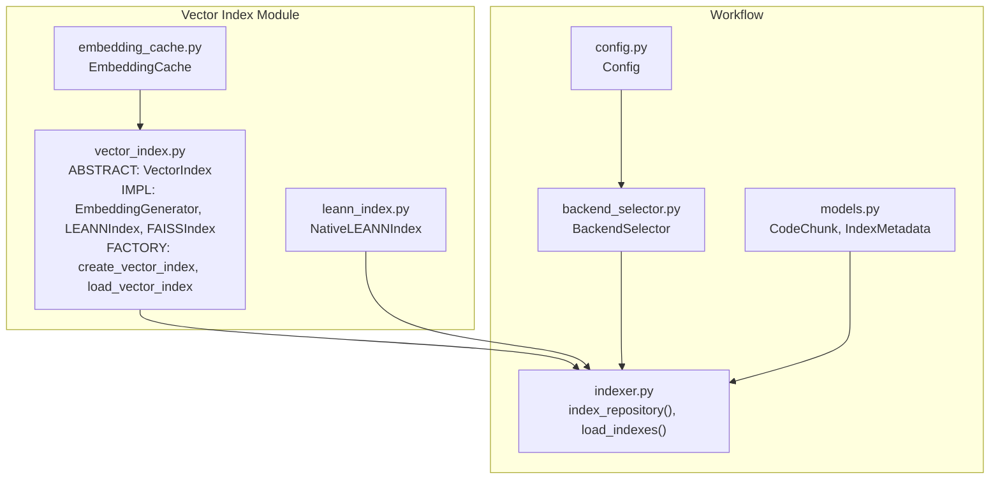
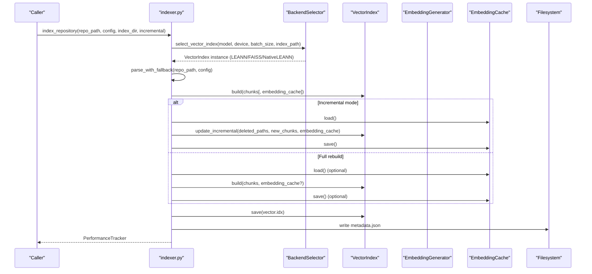
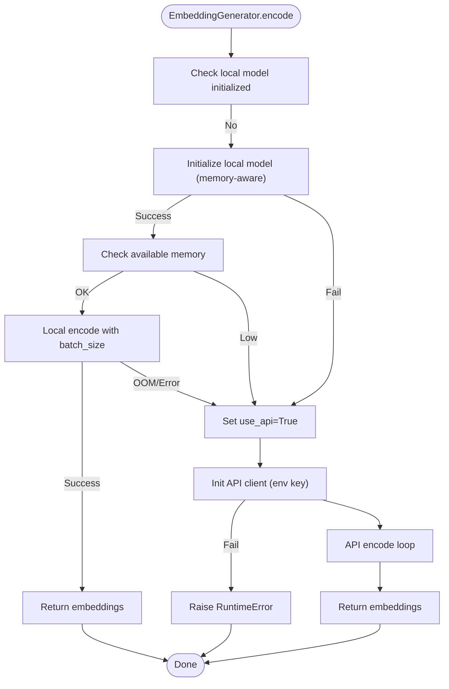
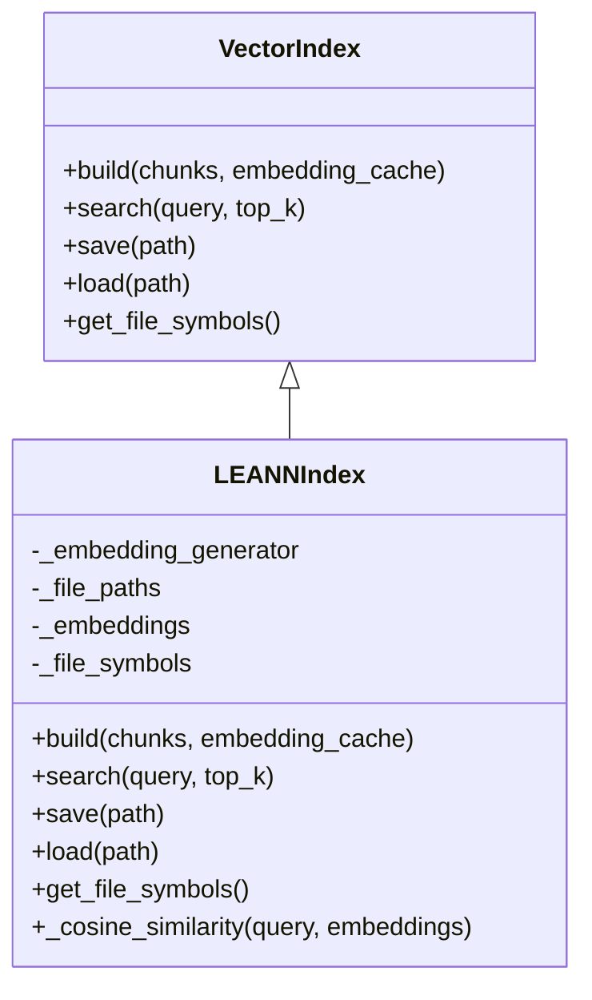
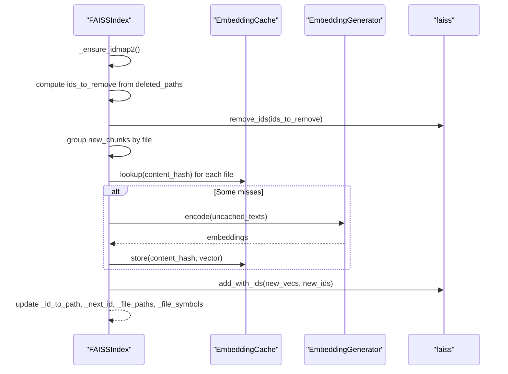
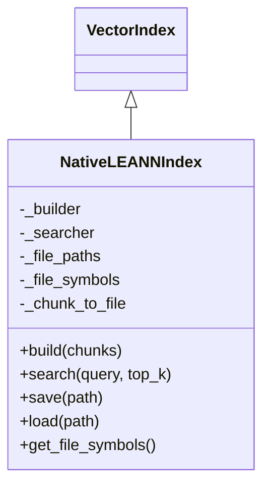
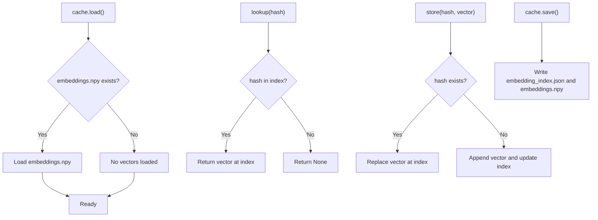
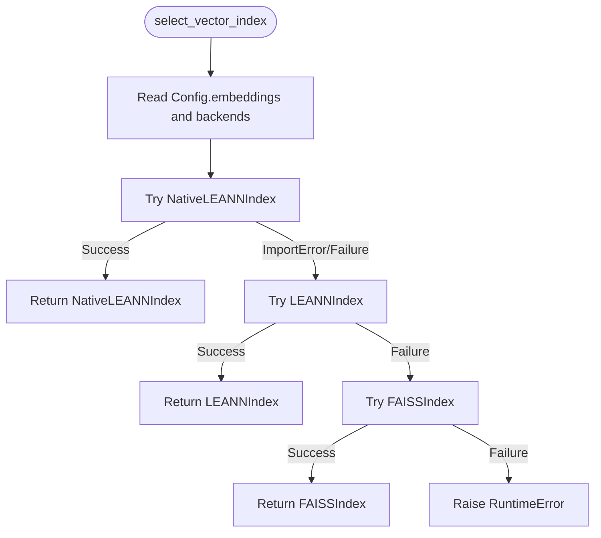
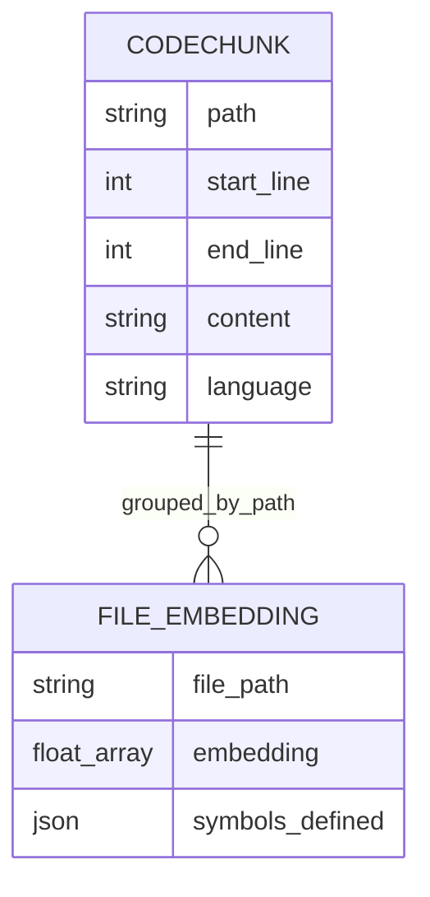
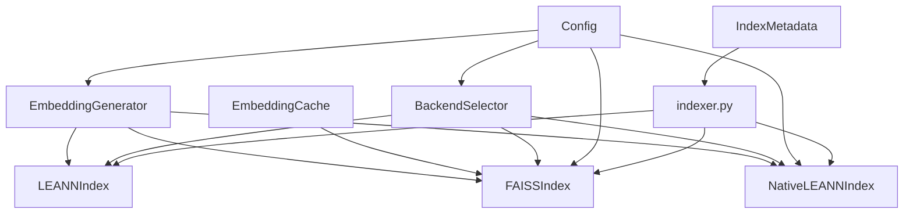

# Stage 2: Vector Indexing

<cite>
**Referenced Files in This Document**
- [vector_index.py](file://src/ws_ctx_engine/vector_index/vector_index.py)
- [leann_index.py](file://src/ws_ctx_engine/vector_index/leann_index.py)
- [embedding_cache.py](file://src/ws_ctx_engine/vector_index/embedding_cache.py)
- [indexer.py](file://src/ws_ctx_engine/workflow/indexer.py)
- [backend_selector.py](file://src/ws_ctx_engine/backend_selector/backend_selector.py)
- [config.py](file://src/ws_ctx_engine/config/config.py)
- [models.py](file://src/ws_ctx_engine/models/models.py)
- [vector-index.md](file://docs/reference/vector-index.md)
- [test_vector_index.py](file://tests/unit/test_vector_index.py)
</cite>

## Table of Contents
1. [Introduction](#introduction)
2. [Project Structure](#project-structure)
3. [Core Components](#core-components)
4. [Architecture Overview](#architecture-overview)
5. [Detailed Component Analysis](#detailed-component-analysis)
6. [Dependency Analysis](#dependency-analysis)
7. [Performance Considerations](#performance-considerations)
8. [Troubleshooting Guide](#troubleshooting-guide)
9. [Conclusion](#conclusion)
10. [Appendices](#appendices)

## Introduction
This document explains the vector indexing stage that powers semantic search over code repositories. It covers:
- Embedding generation using sentence-transformers with automatic API fallback
- LEANN implementations for efficient similarity search and storage
- FAISS fallback mechanisms for scalable vector search
- An embedding cache system for performance optimization, incremental updates, and memory management
- Backend selection strategy, model configuration, and device allocation
- Examples of vector operations, similarity calculations, and index persistence
- How code chunks relate to vector representations and how the system scales to large repositories

## Project Structure
The vector indexing module is organized around a shared interface and multiple backend implementations, plus auxiliary components for caching and workflow orchestration.

**Diagram sources**
- [vector_index.py:1-1120](file://src/ws_ctx_engine/vector_index/vector_index.py#L1-L1120)
- [leann_index.py:1-297](file://src/ws_ctx_engine/vector_index/leann_index.py#L1-L297)
- [embedding_cache.py:1-127](file://src/ws_ctx_engine/vector_index/embedding_cache.py#L1-L127)
- [indexer.py:1-493](file://src/ws_ctx_engine/workflow/indexer.py#L1-L493)
- [backend_selector.py:1-191](file://src/ws_ctx_engine/backend_selector/backend_selector.py#L1-L191)
- [config.py:1-399](file://src/ws_ctx_engine/config/config.py#L1-L399)
- [models.py:1-152](file://src/ws_ctx_engine/models/models.py#L1-L152)

**Section sources**
- [vector_index.py:1-1120](file://src/ws_ctx_engine/vector_index/vector_index.py#L1-L1120)
- [leann_index.py:1-297](file://src/ws_ctx_engine/vector_index/leann_index.py#L1-L297)
- [embedding_cache.py:1-127](file://src/ws_ctx_engine/vector_index/embedding_cache.py#L1-L127)
- [indexer.py:1-493](file://src/ws_ctx_engine/workflow/indexer.py#L1-L493)
- [backend_selector.py:1-191](file://src/ws_ctx_engine/backend_selector/backend_selector.py#L1-L191)
- [config.py:1-399](file://src/ws_ctx_engine/config/config.py#L1-L399)
- [models.py:1-152](file://src/ws_ctx_engine/models/models.py#L1-L152)

## Core Components
- VectorIndex: Abstract interface defining build, search, save, load, and optional symbol mapping.
- EmbeddingGenerator: Generates embeddings locally via sentence-transformers or via API fallback (OpenAI) with memory-aware checks.
- LEANNIndex: File-level cosine similarity index backed by NumPy arrays; stores all embeddings.
- FAISSIndex: FAISS-based index using IndexFlatL2 wrapped in IndexIDMap2 for incremental updates; supports API fallback.
- NativeLEANNIndex: Production LEANN implementation using the actual LEANN library with graph-based recomputation and two backends (HNSW/DiskANN).
- EmbeddingCache: Disk-backed cache for content-hash → embedding mappings to accelerate incremental rebuilds.
- BackendSelector: Centralized selection with graceful fallback across vector index, graph, and embeddings backends.
- Config: Provides model name, device, batch size, and performance toggles for caching and incremental indexing.
- CodeChunk/IndexMetadata: Data models for chunks and index metadata used in indexing and staleness detection.

**Section sources**
- [vector_index.py:21-1120](file://src/ws_ctx_engine/vector_index/vector_index.py#L21-L1120)
- [leann_index.py:20-297](file://src/ws_ctx_engine/vector_index/leann_index.py#L20-L297)
- [embedding_cache.py:28-127](file://src/ws_ctx_engine/vector_index/embedding_cache.py#L28-L127)
- [backend_selector.py:13-191](file://src/ws_ctx_engine/backend_selector/backend_selector.py#L13-L191)
- [config.py:16-399](file://src/ws_ctx_engine/config/config.py#L16-L399)
- [models.py:10-152](file://src/ws_ctx_engine/models/models.py#L10-L152)

## Architecture Overview
The vector indexing pipeline integrates embedding generation, backend selection, and persistence. The workflow orchestrator coordinates parsing, index building, and metadata management.

**Diagram sources**
- [indexer.py:72-371](file://src/ws_ctx_engine/workflow/indexer.py#L72-L371)
- [backend_selector.py:36-81](file://src/ws_ctx_engine/backend_selector/backend_selector.py#L36-L81)
- [vector_index.py:972-1120](file://src/ws_ctx_engine/vector_index/vector_index.py#L972-L1120)
- [embedding_cache.py:55-84](file://src/ws_ctx_engine/vector_index/embedding_cache.py#L55-L84)

## Detailed Component Analysis

### Embedding Generation with Sentence Transformers and API Fallback
- Initializes a local sentence-transformers model when memory allows and logs warnings on failures.
- Falls back to OpenAI API embeddings when local initialization fails or memory is low.
- Uses a memory threshold to avoid out-of-memory conditions during model loading and encoding.
- Encodes batches of texts and returns NumPy arrays of embeddings.

**Diagram sources**
- [vector_index.py:96-280](file://src/ws_ctx_engine/vector_index/vector_index.py#L96-L280)

**Section sources**
- [vector_index.py:96-280](file://src/ws_ctx_engine/vector_index/vector_index.py#L96-L280)

### LEANNIndex: File-Level Cosine Similarity Index
- Groups chunks by file path, concatenates content per file, and generates a single embedding per file.
- Stores file paths, embeddings, and symbol mappings; performs cosine similarity search.
- Persists all state via pickle with metadata and embeddings array.

**Diagram sources**
- [vector_index.py:282-504](file://src/ws_ctx_engine/vector_index/vector_index.py#L282-L504)

**Section sources**
- [vector_index.py:282-504](file://src/ws_ctx_engine/vector_index/vector_index.py#L282-L504)

### FAISSIndex: FAISS-Based Index with Incremental Updates
- Uses IndexFlatL2 wrapped in IndexIDMap2 to support incremental removals and additions.
- Supports migration from legacy indices to IndexIDMap2 for consistent ID management.
- Implements update_incremental to remove deleted/changed files and add new ones, leveraging EmbeddingCache to avoid re-embedding unchanged content.
- Converts FAISS L2 distances to cosine similarities for consistent scoring.

**Diagram sources**
- [vector_index.py:815-962](file://src/ws_ctx_engine/vector_index/vector_index.py#L815-L962)

**Section sources**
- [vector_index.py:506-809](file://src/ws_ctx_engine/vector_index/vector_index.py#L506-L809)
- [vector_index.py:815-962](file://src/ws_ctx_engine/vector_index/vector_index.py#L815-L962)

### NativeLEANNIndex: Production LEANN with Graph-Based Recomputation
- Uses the actual LEANN library to build and search indexes with 97% storage savings.
- Supports HNSW and DiskANN backends and persists index files alongside metadata.
- Provides build, search, save, and load methods with metadata persistence.

**Diagram sources**
- [leann_index.py:20-297](file://src/ws_ctx_engine/vector_index/leann_index.py#L20-L297)

**Section sources**
- [leann_index.py:20-297](file://src/ws_ctx_engine/vector_index/leann_index.py#L20-L297)

### EmbeddingCache: Incremental Indexing and Memory Management
- Disk-backed cache mapping content hash to embedding vectors.
- Uses SHA-256 of concatenated file content to detect changes.
- Stores vectors in a contiguous NumPy array and maintains an index mapping hashes to rows.
- Enables skipping re-embedding unchanged files during incremental rebuilds.

**Diagram sources**
- [embedding_cache.py:55-84](file://src/ws_ctx_engine/vector_index/embedding_cache.py#L55-L84)
- [embedding_cache.py:89-114](file://src/ws_ctx_engine/vector_index/embedding_cache.py#L89-L114)

**Section sources**
- [embedding_cache.py:28-127](file://src/ws_ctx_engine/vector_index/embedding_cache.py#L28-L127)

### Backend Selection Strategy and Model Configuration
- BackendSelector selects vector index backends in priority order: NativeLEANN → LEANN → FAISS, with graceful fallback and logging.
- Config controls model name, device, batch size, and performance toggles (cache_embeddings, incremental_index).
- The workflow respects configuration flags and detects staleness to decide incremental vs full rebuilds.

**Diagram sources**
- [backend_selector.py:36-81](file://src/ws_ctx_engine/backend_selector/backend_selector.py#L36-L81)
- [vector_index.py:972-1080](file://src/ws_ctx_engine/vector_index/vector_index.py#L972-L1080)

**Section sources**
- [backend_selector.py:13-191](file://src/ws_ctx_engine/backend_selector/backend_selector.py#L13-L191)
- [config.py:74-101](file://src/ws_ctx_engine/config/config.py#L74-L101)
- [indexer.py:125-253](file://src/ws_ctx_engine/workflow/indexer.py#L125-L253)

### Relationship Between Code Chunks and Vector Representations
- CodeChunk instances carry path, content, and symbol metadata.
- During indexing, chunks are grouped by file path; content is concatenated per file before embedding.
- Symbol definitions are aggregated per file for potential boosting in downstream ranking.
- IndexMetadata stores file hashes to detect staleness and trigger rebuilds.

**Diagram sources**
- [models.py:10-59](file://src/ws_ctx_engine/models/models.py#L10-L59)
- [vector_index.py:330-362](file://src/ws_ctx_engine/vector_index/vector_index.py#L330-L362)

**Section sources**
- [models.py:10-59](file://src/ws_ctx_engine/models/models.py#L10-L59)
- [vector_index.py:330-362](file://src/ws_ctx_engine/vector_index/vector_index.py#L330-L362)

### Examples of Vector Operations, Similarity Calculations, and Index Persistence
- Basic usage: create a vector index, build from parsed chunks, search, and persist.
- Loading existing indexes: load_vector_index auto-detects backend from saved metadata.
- With embedding cache: load cache, build/update index, and save cache for next run.

Refer to the reference documentation for concrete examples and expected behavior.

**Section sources**
- [vector-index.md:420-480](file://docs/reference/vector-index.md#L420-L480)
- [vector_index.py:1083-1119](file://src/ws_ctx_engine/vector_index/vector_index.py#L1083-L1119)
- [test_vector_index.py:177-200](file://tests/unit/test_vector_index.py#L177-L200)

## Dependency Analysis
- VectorIndex implementations depend on EmbeddingGenerator for embeddings.
- FAISSIndex depends on FAISS library and uses IndexIDMap2 for ID mapping and incremental updates.
- NativeLEANNIndex depends on the LEANN library and persists index files separately from metadata.
- EmbeddingCache is integrated into FAISSIndex build/update flows to avoid redundant embeddings.
- BackendSelector centralizes backend selection and logs fallbacks.
- Config drives model/device/batch settings and performance toggles.

**Diagram sources**
- [vector_index.py:96-1120](file://src/ws_ctx_engine/vector_index/vector_index.py#L96-L1120)
- [leann_index.py:67-82](file://src/ws_ctx_engine/vector_index/leann_index.py#L67-L82)
- [embedding_cache.py:44-50](file://src/ws_ctx_engine/vector_index/embedding_cache.py#L44-L50)
- [backend_selector.py:26-81](file://src/ws_ctx_engine/backend_selector/backend_selector.py#L26-L81)
- [config.py:74-101](file://src/ws_ctx_engine/config/config.py#L74-L101)
- [indexer.py:190-253](file://src/ws_ctx_engine/workflow/indexer.py#L190-L253)

**Section sources**
- [vector_index.py:96-1120](file://src/ws_ctx_engine/vector_index/vector_index.py#L96-L1120)
- [leann_index.py:67-82](file://src/ws_ctx_engine/vector_index/leann_index.py#L67-L82)
- [embedding_cache.py:44-50](file://src/ws_ctx_engine/vector_index/embedding_cache.py#L44-L50)
- [backend_selector.py:26-81](file://src/ws_ctx_engine/backend_selector/backend_selector.py#L26-L81)
- [config.py:74-101](file://src/ws_ctx_engine/config/config.py#L74-L101)
- [indexer.py:190-253](file://src/ws_ctx_engine/workflow/indexer.py#L190-L253)

## Performance Considerations
- Storage savings: NativeLEANNIndex achieves 97% storage savings by selectively recomputing vectors; FAISSIndex and LEANNIndex store all embeddings.
- Search latency targets: NativeLEANNIndex is fastest for large repositories; FAISSIndex offers the fastest search among the three.
- Memory usage: NativeLEANNIndex uses minimal memory (~3MB for 10k files with 384-dim embeddings); FAISSIndex and LEANNIndex scale linearly with file count.
- Incremental updates: FAISSIndex uses IndexIDMap2 to support removals and additions without rebuilding; EmbeddingCache avoids re-embedding unchanged files.
- Device allocation: Config supports CPU and CUDA devices; EmbeddingGenerator enforces memory checks before loading local models.

[No sources needed since this section provides general guidance]

## Troubleshooting Guide
- Out of memory during local model loading: EmbeddingGenerator falls back to API; ensure sufficient memory or reduce batch size.
- Missing FAISS or LEANN libraries: BackendSelector logs fallbacks; install required packages for optimal performance.
- Stale indexes: load_indexes compares file hashes and can trigger automatic rebuilds.
- Incremental update failures: The workflow falls back to full rebuild if incremental update fails; verify cache and index paths.

**Section sources**
- [vector_index.py:130-251](file://src/ws_ctx_engine/vector_index/vector_index.py#L130-L251)
- [indexer.py:226-230](file://src/ws_ctx_engine/workflow/indexer.py#L226-L230)
- [indexer.py:456-467](file://src/ws_ctx_engine/workflow/indexer.py#L456-L467)

## Conclusion
The vector indexing stage provides a robust, configurable, and scalable foundation for semantic search over codebases. By combining memory-aware embedding generation, multiple backend implementations, and an incremental caching strategy, it balances performance, storage efficiency, and reliability. The workflow integrates seamlessly with parsing and metadata management to support large repositories and frequent updates.

[No sources needed since this section summarizes without analyzing specific files]

## Appendices

### Backend Selection Levels and Descriptions
- Level 1: Optimal (igraph + NativeLEANN + local embeddings, 97% storage savings)
- Level 2: Good (NetworkX + NativeLEANN + local embeddings)
- Level 3: Acceptable (NetworkX + LEANNIndex + local embeddings)
- Level 4: Degraded (NetworkX + FAISS + local embeddings)
- Level 5: Minimal (NetworkX + FAISS + API embeddings)
- Level 6: Fallback only (file size ranking)

**Section sources**
- [backend_selector.py:120-177](file://src/ws_ctx_engine/backend_selector/backend_selector.py#L120-L177)

### Configuration Reference
- backends.vector_index: auto | native-leann | leann | faiss
- embeddings.model: default sentence-transformers model
- embeddings.device: cpu | cuda
- embeddings.batch_size: positive integer
- performance.cache_embeddings: enable/disable embedding cache
- performance.incremental_index: gate incremental flag

**Section sources**
- [config.py:74-101](file://src/ws_ctx_engine/config/config.py#L74-L101)