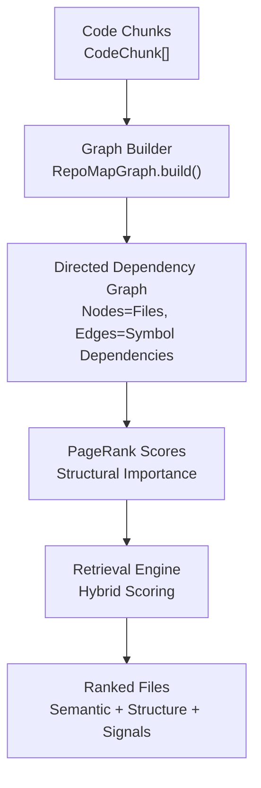
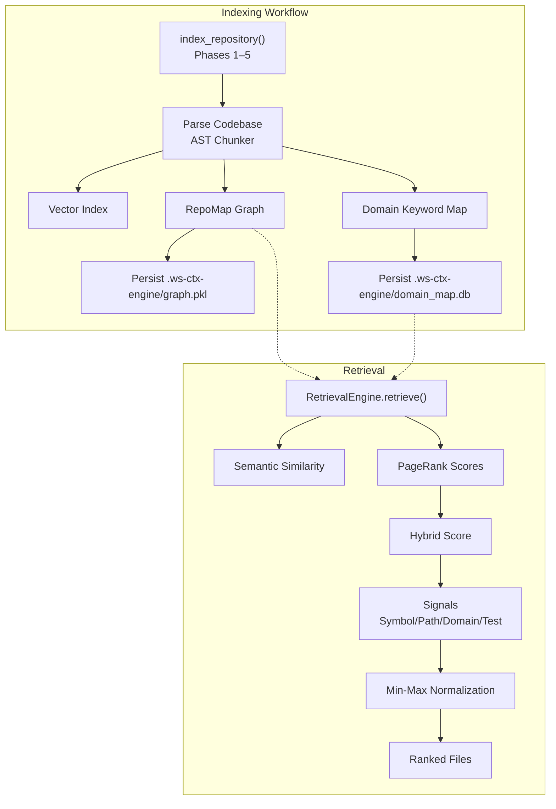
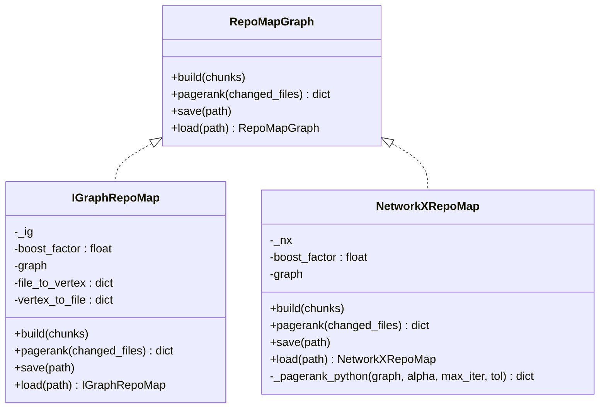
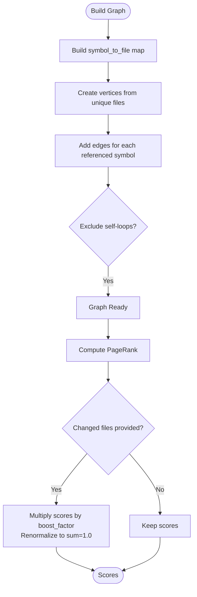
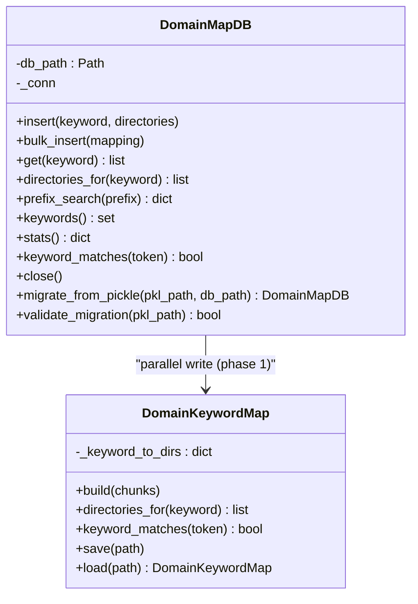
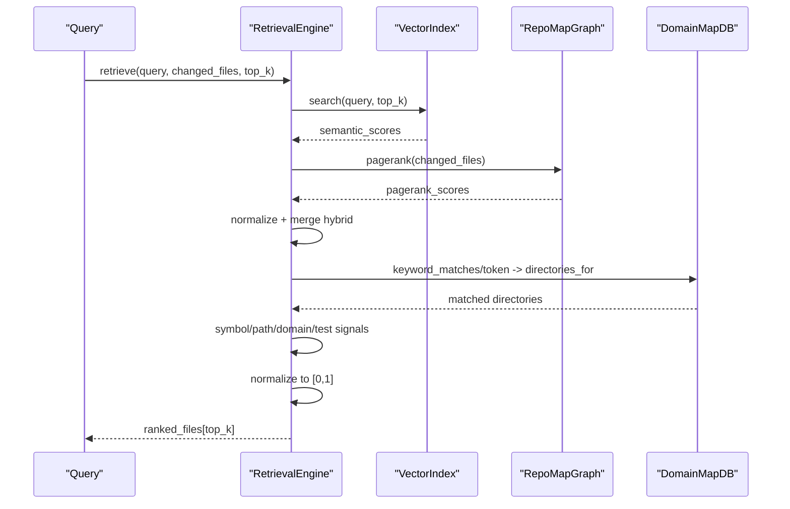
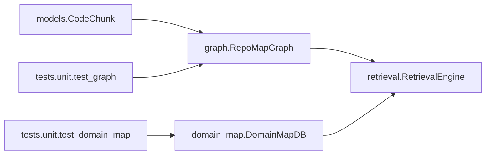

# Stage 3: Graph Construction

<cite>
**Referenced Files in This Document**
- [graph.py](file://src/ws_ctx_engine/graph/graph.py)
- [indexer.py](file://src/ws_ctx_engine/workflow/indexer.py)
- [models.py](file://src/ws_ctx_engine/models/models.py)
- [retrieval.py](file://src/ws_ctx_engine/retrieval/retrieval.py)
- [ranker.py](file://src/ws_ctx_engine/ranking/ranker.py)
- [domain_map.py](file://src/ws_ctx_engine/domain_map/domain_map.py)
- [db.py](file://src/ws_ctx_engine/domain_map/db.py)
- [graph.md](file://docs/reference/graph.md)
- [retrieval.md](file://docs/reference/retrieval.md)
- [test_graph.py](file://tests/unit/test_graph.py)
- [test_domain_map.py](file://tests/unit/test_domain_map.py)
</cite>

## Table of Contents
1. [Introduction](#introduction)
2. [Project Structure](#project-structure)
3. [Core Components](#core-components)
4. [Architecture Overview](#architecture-overview)
5. [Detailed Component Analysis](#detailed-component-analysis)
6. [Dependency Analysis](#dependency-analysis)
7. [Performance Considerations](#performance-considerations)
8. [Troubleshooting Guide](#troubleshooting-guide)
9. [Conclusion](#conclusion)

## Introduction
This document explains the graph construction stage that builds a dependency graph from code relationships and computes PageRank scores to rank files by structural importance. It covers how symbol references and imports are transformed into a directed graph, how PageRank is computed (including changed-file boosting), and how the resulting scores integrate with semantic search to enhance retrieval quality. It also documents the domain keyword mapping and the database storage system used to persist and query domain knowledge.

## Project Structure
The graph construction stage spans several modules:
- Graph construction and PageRank: [graph.py](file://src/ws_ctx_engine/graph/graph.py)
- Indexing workflow: [indexer.py](file://src/ws_ctx_engine/workflow/indexer.py)
- Data models: [models.py](file://src/ws_ctx_engine/models/models.py)
- Retrieval integration: [retrieval.py](file://src/ws_ctx_engine/retrieval/retrieval.py)
- Ranking enhancements: [ranker.py](file://src/ws_ctx_engine/ranking/ranker.py)
- Domain keyword mapping: [domain_map.py](file://src/ws_ctx_engine/domain_map/domain_map.py) and [db.py](file://src/ws_ctx_engine/domain_map/db.py)

**Section sources**
- [graph.py:19-95](file://src/ws_ctx_engine/graph/graph.py#L19-L95)
- [indexer.py:72-371](file://src/ws_ctx_engine/workflow/indexer.py#L72-L371)

## Core Components
- RepoMapGraph: Abstract interface for building dependency graphs and computing PageRank scores.
- IGraphRepoMap: Fast implementation using python-igraph (C++ backend).
- NetworkXRepoMap: Portable fallback using NetworkX (Python backend).
- RetrievalEngine: Integrates PageRank with semantic scores and additional signals.
- DomainKeywordMap and DomainMapDB: Build and persist domain keyword-to-directory mappings.
- CodeChunk: The atomic unit of indexing, carrying symbol definitions and references.

Key responsibilities:
- Build a directed graph from symbol references: nodes are files, edges represent “file A depends on file B” when A references symbols defined in B.
- Compute PageRank scores to reflect structural importance.
- Persist graphs and domain maps for incremental reuse.
- Combine PageRank with semantic similarity and domain/path/symbol signals in retrieval.

**Section sources**
- [graph.py:19-95](file://src/ws_ctx_engine/graph/graph.py#L19-L95)
- [graph.py:97-315](file://src/ws_ctx_engine/graph/graph.py#L97-L315)
- [graph.py:317-570](file://src/ws_ctx_engine/graph/graph.py#L317-L570)
- [models.py:10-85](file://src/ws_ctx_engine/models/models.py#L10-L85)
- [retrieval.py:140-369](file://src/ws_ctx_engine/retrieval/retrieval.py#L140-L369)
- [domain_map.py:11-147](file://src/ws_ctx_engine/domain_map/domain_map.py#L11-L147)
- [db.py:22-334](file://src/ws_ctx_engine/domain_map/db.py#L22-L334)

## Architecture Overview
The graph construction stage is orchestrated by the indexing workflow and integrates with retrieval and ranking modules.

**Diagram sources**
- [indexer.py:72-371](file://src/ws_ctx_engine/workflow/indexer.py#L72-L371)
- [retrieval.py:250-369](file://src/ws_ctx_engine/retrieval/retrieval.py#L250-L369)

**Section sources**
- [indexer.py:72-371](file://src/ws_ctx_engine/workflow/indexer.py#L72-L371)
- [retrieval.py:140-369](file://src/ws_ctx_engine/retrieval/retrieval.py#L140-L369)

## Detailed Component Analysis

### Graph Construction and PageRank
The graph is built from symbol references:
- Nodes: Unique file paths from CodeChunk instances.
- Edges: Directed from file A to file B when A references a symbol defined in B.
- Self-loops are excluded.

PageRank computation:
- Base scores are computed using either igraph (fast) or NetworkX (portable).
- Optionally boost scores for changed files and renormalize to sum to 1.0.

**Diagram sources**
- [graph.py:19-95](file://src/ws_ctx_engine/graph/graph.py#L19-L95)
- [graph.py:97-315](file://src/ws_ctx_engine/graph/graph.py#L97-L315)
- [graph.py:317-570](file://src/ws_ctx_engine/graph/graph.py#L317-L570)

Edge creation algorithm:
- Build a symbol-to-defining-file map from symbols_defined.
- For each chunk’s symbols_referenced, resolve the target file and add a directed edge from the chunk’s file to the target file.
- Exclude self-loops.

PageRank computation:
- igraph: Uses a native PageRank implementation on directed graphs.
- NetworkX: Uses scipy-based PageRank if available; otherwise, a pure Python power iteration implementation.
- Changed files are multiplied by a boost factor and scores are renormalized.

**Diagram sources**
- [graph.py:129-187](file://src/ws_ctx_engine/graph/graph.py#L129-L187)
- [graph.py:188-232](file://src/ws_ctx_engine/graph/graph.py#L188-L232)
- [graph.py:347-401](file://src/ws_ctx_engine/graph/graph.py#L347-L401)
- [graph.py:402-509](file://src/ws_ctx_engine/graph/graph.py#L402-L509)

Integration with retrieval:
- RetrievalEngine retrieves semantic scores and PageRank scores, normalizes them, merges with weights, then applies symbol/path/domain/test signals and normalizes again to [0, 1].

**Section sources**
- [graph.py:129-232](file://src/ws_ctx_engine/graph/graph.py#L129-L232)
- [graph.py:347-509](file://src/ws_ctx_engine/graph/graph.py#L347-L509)
- [retrieval.py:250-369](file://src/ws_ctx_engine/retrieval/retrieval.py#L250-L369)

### Domain Keyword Mapping and Database Storage
DomainKeywordMap extracts domain keywords from file paths and maps them to directories. DomainMapDB provides an SQLite-backed replacement with WAL mode, indexes, and prefix search.

**Diagram sources**
- [domain_map.py:11-147](file://src/ws_ctx_engine/domain_map/domain_map.py#L11-L147)
- [db.py:22-334](file://src/ws_ctx_engine/domain_map/db.py#L22-L334)

Domain extraction:
- Split path parts and clean separators, then extract tokens longer than 2 characters that are not in a predefined noise-word set.
- Map each token to the parent directory of the file.

SQLite schema highlights:
- Keywords table with unique, case-insensitive collation.
- Directories table with unique paths.
- KeywordDirs junction table linking keywords to directories.
- Indexes for efficient lookups and prefix searches.

**Section sources**
- [domain_map.py:77-147](file://src/ws_ctx_engine/domain_map/domain_map.py#L77-L147)
- [db.py:70-106](file://src/ws_ctx_engine/domain_map/db.py#L70-L106)
- [db.py:107-178](file://src/ws_ctx_engine/domain_map/db.py#L107-L178)
- [db.py:179-244](file://src/ws_ctx_engine/domain_map/db.py#L179-L244)

### Retrieval Integration and Hybrid Ranking
RetrievalEngine combines semantic similarity and PageRank into a hybrid score, then applies:
- Symbol boost: files defining symbols mentioned in the query.
- Path boost: files whose paths contain query keywords.
- Domain boost: files under directories matching domain keywords.
- Test penalty: multiplicative reduction for test files.
- AI rule boost: deterministic top-k placement for project-level rule files.

**Diagram sources**
- [retrieval.py:250-369](file://src/ws_ctx_engine/retrieval/retrieval.py#L250-L369)
- [ranker.py:28-86](file://src/ws_ctx_engine/ranking/ranker.py#L28-L86)

**Section sources**
- [retrieval.py:140-369](file://src/ws_ctx_engine/retrieval/retrieval.py#L140-L369)
- [ranker.py:28-86](file://src/ws_ctx_engine/ranking/ranker.py#L28-L86)

## Dependency Analysis
- Graph builder depends on CodeChunk to extract symbol definitions and references.
- RetrievalEngine depends on both VectorIndex and RepoMapGraph for hybrid scoring.
- DomainMapDB is used during indexing to persist domain knowledge alongside the graph.
- Tests validate graph construction correctness, PageRank normalization, and domain keyword extraction.

**Diagram sources**
- [models.py:10-85](file://src/ws_ctx_engine/models/models.py#L10-L85)
- [graph.py:19-95](file://src/ws_ctx_engine/graph/graph.py#L19-L95)
- [retrieval.py:140-369](file://src/ws_ctx_engine/retrieval/retrieval.py#L140-L369)
- [domain_map.py:11-147](file://src/ws_ctx_engine/domain_map/domain_map.py#L11-L147)
- [test_graph.py:12-52](file://tests/unit/test_graph.py#L12-L52)
- [test_domain_map.py:16-26](file://tests/unit/test_domain_map.py#L16-L26)

**Section sources**
- [models.py:10-85](file://src/ws_ctx_engine/models/models.py#L10-L85)
- [graph.py:19-95](file://src/ws_ctx_engine/graph/graph.py#L19-L95)
- [retrieval.py:140-369](file://src/ws_ctx_engine/retrieval/retrieval.py#L140-L369)
- [domain_map.py:11-147](file://src/ws_ctx_engine/domain_map/domain_map.py#L11-L147)
- [test_graph.py:12-52](file://tests/unit/test_graph.py#L12-L52)
- [test_domain_map.py:16-26](file://tests/unit/test_domain_map.py#L16-L26)

## Performance Considerations
- Graph construction: O(V + E) where V is unique files and E is symbol references.
- PageRank: O(V + E) for both igraph and NetworkX backends.
- Domain keyword extraction: O(N) over file paths, with dictionary operations.
- SQLite domain map: WAL mode and indexes optimize reads and prefix searches.

Practical tips:
- Prefer igraph for large repositories to minimize latency.
- Use incremental indexing to avoid rebuilding the entire graph when only a subset of files changes.
- Enable embedding cache to reduce redundant vector computations during incremental updates.

[No sources needed since this section provides general guidance]

## Troubleshooting Guide
Common issues and resolutions:
- Missing python-igraph: Install the package or force NetworkX backend.
- Empty chunks list: Ensure parsing succeeded and produced CodeChunk objects.
- Graph not built before PageRank: Call build() before pagerank().
- Stale indexes: The loader detects file hash mismatches and can trigger rebuild.
- Domain map migration: Use the provided migration utilities to move from pickle to SQLite.

**Section sources**
- [graph.py:572-621](file://src/ws_ctx_engine/graph/graph.py#L572-L621)
- [indexer.py:404-493](file://src/ws_ctx_engine/workflow/indexer.py#L404-L493)
- [db.py:310-334](file://src/ws_ctx_engine/domain_map/db.py#L310-L334)

## Conclusion
The graph construction stage transforms code relationships into a structured dependency graph and computes PageRank scores to reflect structural importance. Combined with semantic similarity and domain/path/symbol signals, this hybrid ranking significantly improves retrieval quality. The domain keyword mapping and SQLite-backed persistence enable scalable, query-time classification and efficient prefix-based directory matching. Together, these components form a robust foundation for intelligent code navigation and context selection.