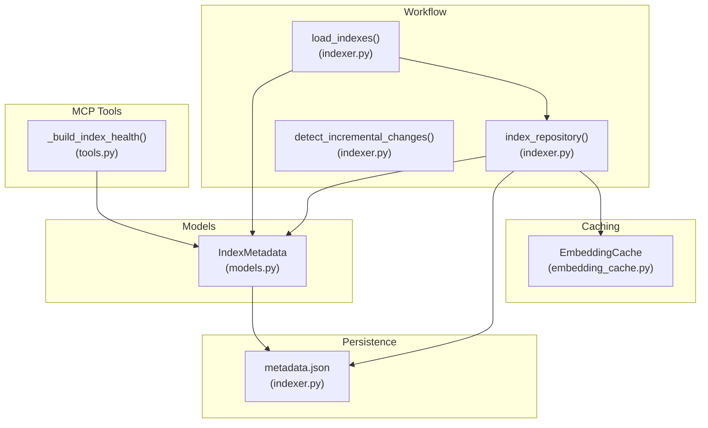
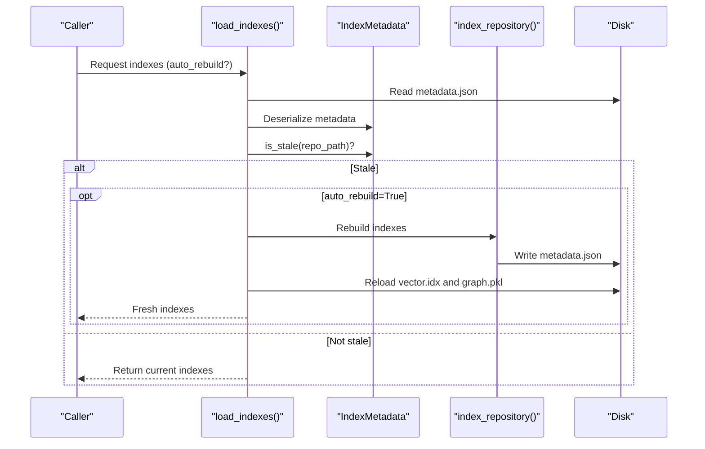
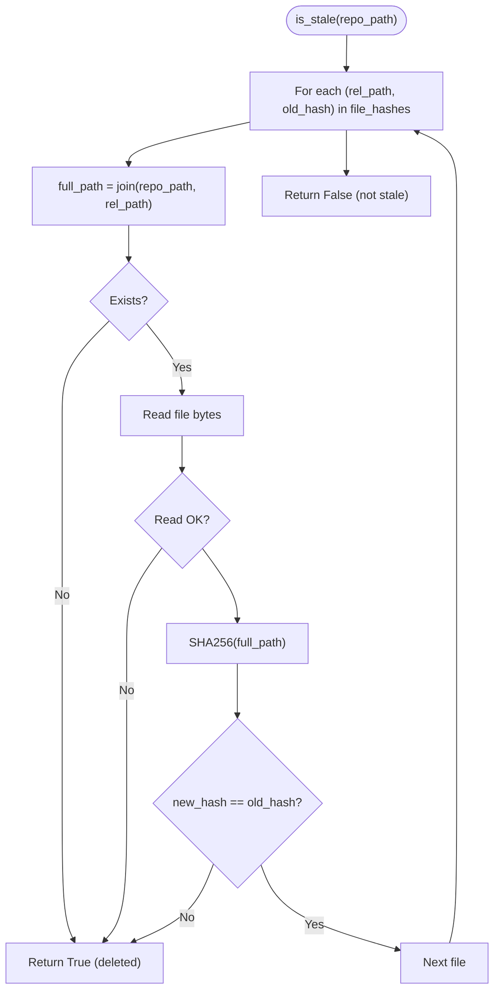
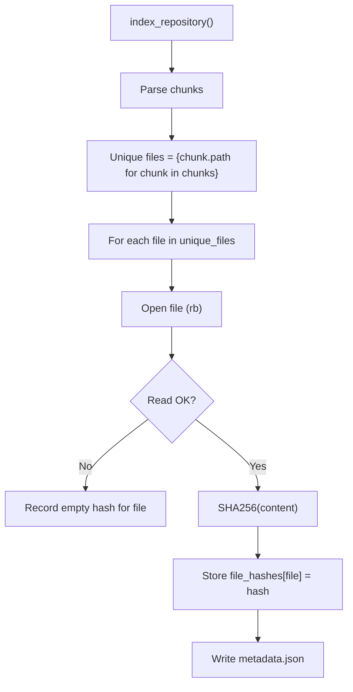
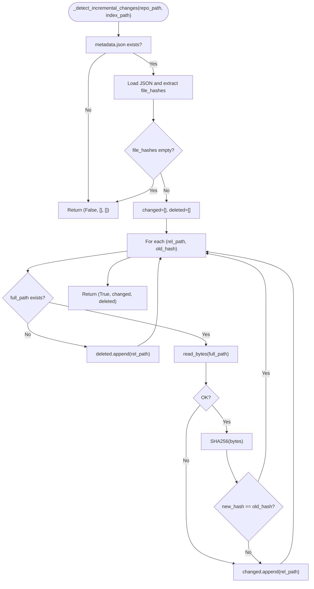
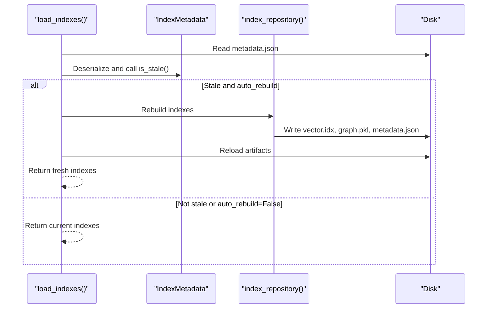
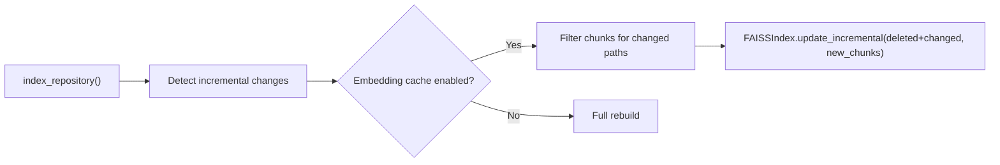
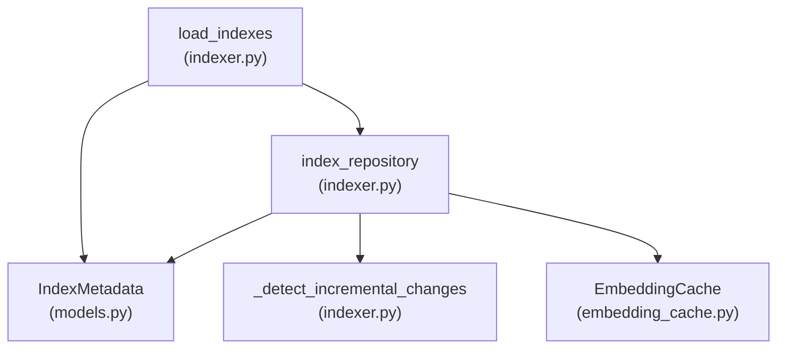

# Stage 4: Metadata Management

<cite>
**Referenced Files in This Document**
- [models.py](file://src/ws_ctx_engine/models/models.py)
- [indexer.py](file://src/ws_ctx_engine/workflow/indexer.py)
- [tools.py](file://src/ws_ctx_engine/mcp/tools.py)
- [embedding_cache.py](file://src/ws_ctx_engine/vector_index/embedding_cache.py)
- [vector_index.py](file://src/ws_ctx_engine/vector_index/vector_index.py)
- [test_index_workflow.py](file://tests/property/test_index_workflow.py)
- [test_models.py](file://tests/unit/test_models.py)
</cite>

## Table of Contents
1. [Introduction](#introduction)
2. [Project Structure](#project-structure)
3. [Core Components](#core-components)
4. [Architecture Overview](#architecture-overview)
5. [Detailed Component Analysis](#detailed-component-analysis)
6. [Dependency Analysis](#dependency-analysis)
7. [Performance Considerations](#performance-considerations)
8. [Troubleshooting Guide](#troubleshooting-guide)
9. [Conclusion](#conclusion)

## Introduction
This document explains the metadata management stage responsible for:
- Persisting index metadata to enable staleness detection
- Computing and storing file hashes for incremental change detection
- Detecting staleness and triggering automatic rebuilds
- Supporting selective rebuilding to optimize performance

It covers the IndexMetadata model, file hash computation, incremental detection logic, and fallback strategies when metadata is missing or unreadable.

## Project Structure
The metadata management functionality spans several modules:
- Model definition for index metadata
- Indexing workflow that computes hashes and persists metadata
- Loading workflow that checks staleness and rebuilds when needed
- Embedding cache integration for efficient incremental updates
- MCP tooling that surfaces health and staleness status

**Diagram sources**
- [models.py:87-151](file://src/ws_ctx_engine/models/models/models.py#L87-L151)
- [indexer.py:27-70](file://src/ws_ctx_engine/workflow/indexer.py#L27-L70)
- [indexer.py:72-371](file://src/ws_ctx_engine/workflow/indexer.py#L72-L371)
- [indexer.py:404-492](file://src/ws_ctx_engine/workflow/indexer.py#L404-L492)
- [embedding_cache.py:28-127](file://src/ws_ctx_engine/vector_index/embedding_cache.py#L28-L127)
- [tools.py:406-439](file://src/ws_ctx_engine/mcp/tools.py#L406-L439)

**Section sources**
- [models.py:87-151](file://src/ws_ctx_engine/models/models.py#L87-L151)
- [indexer.py:27-70](file://src/ws_ctx_engine/workflow/indexer.py#L27-L70)
- [indexer.py:72-371](file://src/ws_ctx_engine/workflow/indexer.py#L72-L371)
- [indexer.py:404-492](file://src/ws_ctx_engine/workflow/indexer.py#L404-L492)
- [embedding_cache.py:28-127](file://src/ws_ctx_engine/vector_index/embedding_cache.py#L28-L127)
- [tools.py:406-439](file://src/ws_ctx_engine/mcp/tools.py#L406-L439)

## Core Components
- IndexMetadata: Stores index creation timestamp, repository path, file count, backend identifier, and a mapping of file paths to SHA256 hashes. Provides staleness detection by comparing stored hashes with current file content.
- Hash computation: Computes SHA256 hashes for unique files in the parsed chunks and persists them in metadata.json alongside other metadata fields.
- Incremental detection: Compares stored hashes against current disk state to identify changed and deleted files, enabling selective rebuilding.
- Automatic rebuild: When staleness is detected, the loader can trigger a rebuild and reload the fresh indexes.

Key responsibilities:
- Persist metadata.json with file_hashes and other fields
- Compute hashes for unique files during indexing
- Detect staleness by comparing hashes and existence
- Trigger rebuilds when auto_rebuild is enabled

**Section sources**
- [models.py:87-151](file://src/ws_ctx_engine/models/models.py#L87-L151)
- [indexer.py:27-70](file://src/ws_ctx_engine/workflow/indexer.py#L27-L70)
- [indexer.py:284-328](file://src/ws_ctx_engine/workflow/indexer.py#L284-L328)
- [indexer.py:404-492](file://src/ws_ctx_engine/workflow/indexer.py#L404-L492)

## Architecture Overview
The metadata management stage integrates with the indexing and loading workflows to maintain freshness and performance.

**Diagram sources**
- [indexer.py:404-492](file://src/ws_ctx_engine/workflow/indexer.py#L404-L492)
- [models.py:108-151](file://src/ws_ctx_engine/models/models.py#L108-L151)

## Detailed Component Analysis

### IndexMetadata Model
IndexMetadata encapsulates:
- created_at: Timestamp when the index was built
- repo_path: Absolute path to the repository root
- file_count: Number of unique files indexed
- backend: String identifying the backend(s) used
- file_hashes: Mapping from relative file paths to SHA256 hashes

Staleness detection algorithm:
- Iterate stored file_hashes
- For each path, construct absolute path using repo_path
- If file does not exist, mark as stale
- Attempt to compute current SHA256; on read errors, mark as stale
- If computed hash differs from stored hash, mark as stale
- Return True if any condition triggered staleness; False otherwise

**Diagram sources**
- [models.py:108-151](file://src/ws_ctx_engine/models/models.py#L108-L151)

**Section sources**
- [models.py:87-151](file://src/ws_ctx_engine/models/models.py#L87-L151)
- [test_models.py:203-390](file://tests/unit/test_models.py#L203-L390)

### File Hash Computation and Persistence
During indexing:
- Unique files are identified from parsed chunks
- For each unique file, compute SHA256 over the entire file content
- On read errors, store an empty hash to record failure
- Persist metadata.json with created_at, repo_path, file_count, backend, and file_hashes

**Diagram sources**
- [indexer.py:284-328](file://src/ws_ctx_engine/workflow/indexer.py#L284-L328)
- [indexer.py:374-401](file://src/ws_ctx_engine/workflow/indexer.py#L374-L401)

**Section sources**
- [indexer.py:284-328](file://src/ws_ctx_engine/workflow/indexer.py#L284-L328)
- [indexer.py:374-401](file://src/ws_ctx_engine/workflow/indexer.py#L374-L401)

### Incremental Change Detection
The incremental detection compares stored hashes with current disk state:
- If metadata.json is missing or unreadable, return fallback indicating full rebuild is required
- If file_hashes is empty, return fallback
- For each stored relative path:
  - If file does not exist, add to deleted list
  - If read fails, add to changed list
  - Otherwise compute SHA256 and compare with stored hash; if different, add to changed list
- Return (incremental_possible, changed_paths, deleted_paths)

**Diagram sources**
- [indexer.py:27-70](file://src/ws_ctx_engine/workflow/indexer.py#L27-L70)

**Section sources**
- [indexer.py:27-70](file://src/ws_ctx_engine/workflow/indexer.py#L27-L70)

### Automatic Rebuild Triggers
Automatic rebuild occurs when:
- load_indexes detects staleness via IndexMetadata.is_stale
- auto_rebuild is True
- The loader invokes index_repository to rebuild and reload

**Diagram sources**
- [indexer.py:404-492](file://src/ws_ctx_engine/workflow/indexer.py#L404-L492)
- [models.py:108-151](file://src/ws_ctx_engine/models/models.py#L108-L151)

**Section sources**
- [indexer.py:404-492](file://src/ws_ctx_engine/workflow/indexer.py#L404-L492)
- [test_index_workflow.py:257-316](file://tests/property/test_index_workflow.py#L257-L316)

### Embedding Cache Integration for Selective Rebuilding
When incremental mode is active and embedding cache is enabled:
- Only changed files are re-embedded
- Unchanged files reuse cached embeddings
- Vector index supports incremental update with deleted and new chunks

**Diagram sources**
- [indexer.py:197-234](file://src/ws_ctx_engine/workflow/indexer.py#L197-L234)
- [embedding_cache.py:28-127](file://src/ws_ctx_engine/vector_index/embedding_cache.py#L28-L127)
- [vector_index.py:506-800](file://src/ws_ctx_engine/vector_index/vector_index.py#L506-L800)

**Section sources**
- [indexer.py:197-234](file://src/ws_ctx_engine/workflow/indexer.py#L197-L234)
- [embedding_cache.py:28-127](file://src/ws_ctx_engine/vector_index/embedding_cache.py#L28-L127)
- [vector_index.py:506-800](file://src/ws_ctx_engine/vector_index/vector_index.py#L506-L800)

### Metadata Structure Examples
- metadata.json fields:
  - created_at: ISO format timestamp
  - repo_path: Absolute path to repository root
  - file_count: Integer count of unique files
  - backend: String identifier (e.g., backend combination)
  - file_hashes: Object mapping relative file paths to SHA256 hex digests

Hash comparison logic:
- For each stored file path, compute SHA256 of current file content
- If read fails or hash mismatch occurs, indexes are considered stale
- Deleted files also trigger staleness

**Section sources**
- [indexer.py:284-328](file://src/ws_ctx_engine/workflow/indexer.py#L284-L328)
- [models.py:108-151](file://src/ws_ctx_engine/models/models.py#L108-L151)

## Dependency Analysis
- IndexMetadata depends on:
  - os.path for constructing absolute paths
  - hashlib for SHA256 computation
  - datetime for timestamp handling
- index_repository depends on:
  - IndexMetadata for persistence
  - _detect_incremental_changes for change tracking
  - VectorIndex and RepoMapGraph for index artifacts
  - EmbeddingCache for selective rebuilding
- load_indexes depends on:
  - IndexMetadata for staleness checks
  - index_repository for rebuild fallback

**Diagram sources**
- [models.py:87-151](file://src/ws_ctx_engine/models/models.py#L87-L151)
- [indexer.py:27-70](file://src/ws_ctx_engine/workflow/indexer.py#L27-L70)
- [indexer.py:72-371](file://src/ws_ctx_engine/workflow/indexer.py#L72-L371)
- [indexer.py:404-492](file://src/ws_ctx_engine/workflow/indexer.py#L404-L492)
- [embedding_cache.py:28-127](file://src/ws_ctx_engine/vector_index/embedding_cache.py#L28-L127)

**Section sources**
- [models.py:87-151](file://src/ws_ctx_engine/models/models.py#L87-L151)
- [indexer.py:27-70](file://src/ws_ctx_engine/workflow/indexer.py#L27-L70)
- [indexer.py:72-371](file://src/ws_ctx_engine/workflow/indexer.py#L72-L371)
- [indexer.py:404-492](file://src/ws_ctx_engine/workflow/indexer.py#L404-L492)
- [embedding_cache.py:28-127](file://src/ws_ctx_engine/vector_index/embedding_cache.py#L28-L127)

## Performance Considerations
- Prefer incremental mode when:
  - performance.incremental_index is enabled
  - embedding cache is enabled to avoid re-embedding unchanged files
- Limit IO by computing hashes only for unique files
- Use selective rebuilding to minimize embedding and index construction costs
- Ensure metadata.json is present and readable to avoid fallback to full rebuild

[No sources needed since this section provides general guidance]

## Troubleshooting Guide
Common issues and resolutions:
- Missing metadata.json:
  - Behavior: Incremental detection returns fallback; full rebuild is performed
  - Resolution: Ensure index_repository completes successfully and writes metadata.json
- Corrupted or unreadable metadata:
  - Behavior: Incremental detection returns fallback; full rebuild is performed
  - Resolution: Delete corrupted metadata.json and rebuild
- Stale indexes despite recent changes:
  - Behavior: is_stale returns True due to missing or changed files
  - Resolution: Confirm file existence and permissions; rebuild with auto_rebuild enabled
- Read failures during hash computation:
  - Behavior: Empty hash recorded; rebuild will include the file
  - Resolution: Fix file permissions or exclude problematic files

Validation references:
- Unit tests for IndexMetadata.is_stale scenarios
- Property tests validating automatic rebuild behavior

**Section sources**
- [test_models.py:203-390](file://tests/unit/test_models.py#L203-L390)
- [test_index_workflow.py:226-316](file://tests/property/test_index_workflow.py#L226-L316)

## Conclusion
The metadata management stage provides robust staleness detection through persisted file hashes and supports efficient incremental rebuilding. By combining IndexMetadata, incremental change detection, and embedding cache integration, the system minimizes rebuild overhead while ensuring index freshness. Automatic rebuild triggers further improve reliability, and comprehensive tests validate correctness across various scenarios.