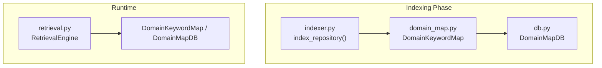
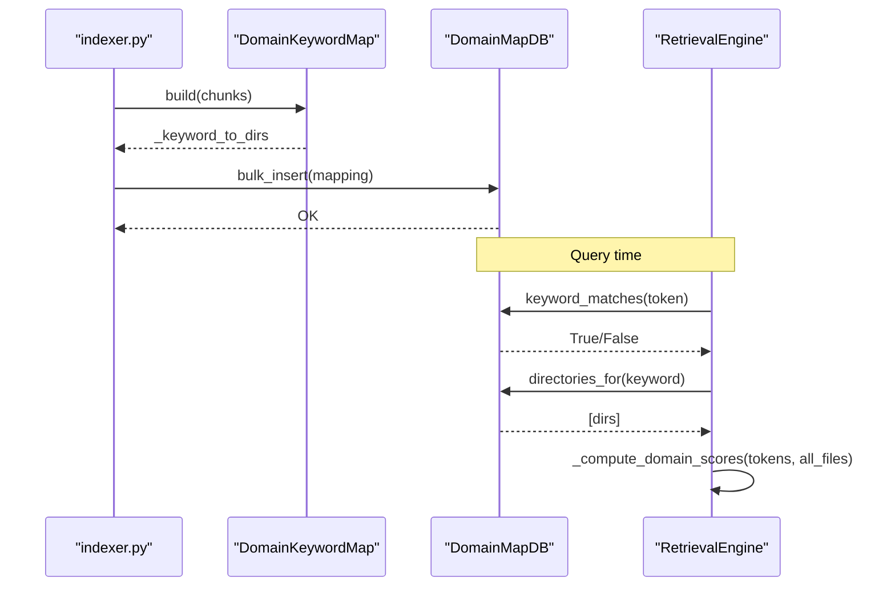
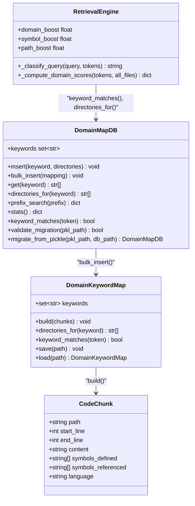

# Stage 5: Domain Keyword Mapping

<cite>
**Referenced Files in This Document**
- [domain_map.py](file://src/ws_ctx_engine/domain_map/domain_map.py)
- [db.py](file://src/ws_ctx_engine/domain_map/db.py)
- [indexer.py](file://src/ws_ctx_engine/workflow/indexer.py)
- [retrieval.py](file://src/ws_ctx_engine/retrieval/retrieval.py)
- [models.py](file://src/ws_ctx_engine/models/models.py)
- [test_domain_map.py](file://tests/unit/test_domain_map.py)
- [test_domain_map_db.py](file://tests/unit/test_domain_map_db.py)
</cite>

## Table of Contents
1. [Introduction](#introduction)
2. [Project Structure](#project-structure)
3. [Core Components](#core-components)
4. [Architecture Overview](#architecture-overview)
5. [Detailed Component Analysis](#detailed-component-analysis)
6. [Dependency Analysis](#dependency-analysis)
7. [Performance Considerations](#performance-considerations)
8. [Troubleshooting Guide](#troubleshooting-guide)
9. [Conclusion](#conclusion)

## Introduction
This document explains Stage 5 of the indexing workflow: Domain Keyword Mapping. It covers how domain-specific keywords are extracted from code chunks, mapped to directories and file patterns, and persisted in a domain map database. It documents the keyword extraction algorithms, domain classification logic, and parallel write optimizations during indexing. It also details the DomainKeywordMap class, bulk insertion processes, and the database schema, including examples of keyword-to-directory mappings, domain classification patterns, and performance benefits of pre-computed domain relationships.

## Project Structure
The domain keyword mapping stage spans several modules:
- DomainKeywordMap: in-memory keyword-to-directories mapping builder
- DomainMapDB: SQLite-backed replacement with WAL mode and bulk operations
- Workflow indexer: orchestrates indexing and triggers domain map building
- Retrieval engine: consumes domain maps for query classification and scoring
- Models: CodeChunk carries file paths used for keyword extraction

**Diagram sources**
- [indexer.py:330-356](file://src/ws_ctx_engine/workflow/indexer.py#L330-L356)
- [domain_map.py:11-147](file://src/ws_ctx_engine/domain_map/domain_map.py#L11-L147)
- [db.py:22-374](file://src/ws_ctx_engine/domain_map/db.py#L22-L374)
- [retrieval.py:467-553](file://src/ws_ctx_engine/retrieval/retrieval.py#L467-L553)

**Section sources**
- [indexer.py:330-356](file://src/ws_ctx_engine/workflow/indexer.py#L330-L356)
- [domain_map.py:11-147](file://src/ws_ctx_engine/domain_map/domain_map.py#L11-L147)
- [db.py:22-374](file://src/ws_ctx_engine/domain_map/db.py#L22-L374)
- [retrieval.py:467-553](file://src/ws_ctx_engine/retrieval/retrieval.py#L467-L553)

## Core Components
- DomainKeywordMap: extracts keywords from file paths and builds a dictionary mapping keywords to sets of directories. It filters out noise words and supports exact and prefix matching.
- DomainMapDB: provides a normalized relational schema with WAL mode, prefix search, and bulk insertion for efficient storage and retrieval.
- Workflow integration: the indexer builds DomainKeywordMap from CodeChunk paths and persists it to DomainMapDB.
- RetrievalEngine: uses domain maps to classify queries and compute domain-based scores.

Key responsibilities:
- Keyword extraction from path parts (splitting on separators, normalization, noise filtering)
- Directory association per keyword
- Bulk persistence and prefix search
- Query classification and scoring using domain maps

**Section sources**
- [domain_map.py:11-147](file://src/ws_ctx_engine/domain_map/domain_map.py#L11-L147)
- [db.py:22-374](file://src/ws_ctx_engine/domain_map/db.py#L22-L374)
- [indexer.py:330-356](file://src/ws_ctx_engine/workflow/indexer.py#L330-L356)
- [retrieval.py:467-553](file://src/ws_ctx_engine/retrieval/retrieval.py#L467-L553)

## Architecture Overview
The domain keyword mapping stage follows a two-phase persistence strategy during indexing:
1. Build DomainKeywordMap from CodeChunk paths
2. Persist to DomainMapDB via bulk_insert

At query time, RetrievalEngine uses either DomainKeywordMap (legacy) or DomainMapDB (recommended) to:
- Classify queries as symbol, path-dominant, or semantic-dominant
- Compute domain scores by checking if files reside under directories associated with matched keywords

**Diagram sources**
- [indexer.py:330-356](file://src/ws_ctx_engine/workflow/indexer.py#L330-L356)
- [domain_map.py:77-106](file://src/ws_ctx_engine/domain_map/domain_map.py#L77-L106)
- [db.py:134-177](file://src/ws_ctx_engine/domain_map/db.py#L134-L177)
- [retrieval.py:467-553](file://src/ws_ctx_engine/retrieval/retrieval.py#L467-L553)

## Detailed Component Analysis

### DomainKeywordMap: Keyword Extraction and Mapping
DomainKeywordMap builds a keyword-to-directories map from CodeChunk paths. The algorithm:
- Iterates over unique file paths from chunks
- For each path part (including filename and directory names), extracts tokens
- Normalizes tokens by replacing separators with spaces and lowercasing
- Filters out noise words and short tokens
- Adds each keyword to the set of directories associated with that keyword

Key behaviors:
- Noise words: extensive list of common tokens filtered out (e.g., “src”, “lib”, “test”, “utils”)
- Exact and prefix matching: supports exact match and prefix match with minimum length thresholds
- Persistence: supports save/load via pickle

Examples of keyword-to-directory mappings:
- A file path “chunker/tree_sitter.py” produces keywords “chunker”, “tree”, “sitter”
- A directory “vector_index” becomes keyword “vector”, “index” (filtered if “index” is noise)
- Multiple files in the same directory associate the directory with the keyword

**Section sources**
- [domain_map.py:19-72](file://src/ws_ctx_engine/domain_map/domain_map.py#L19-L72)
- [domain_map.py:77-106](file://src/ws_ctx_engine/domain_map/domain_map.py#L77-L106)
- [domain_map.py:117-128](file://src/ws_ctx_engine/domain_map/domain_map.py#L117-L128)
- [domain_map.py:130-143](file://src/ws_ctx_engine/domain_map/domain_map.py#L130-L143)
- [test_domain_map.py:12-33](file://tests/unit/test_domain_map.py#L12-L33)
- [test_domain_map.py:34-55](file://tests/unit/test_domain_map.py#L34-L55)
- [test_domain_map.py:214-234](file://tests/unit/test_domain_map.py#L214-L234)

### DomainMapDB: SQLite Schema and Bulk Operations
DomainMapDB provides a normalized relational schema optimized for efficient queries and concurrent reads:
- keywords: unique domain keywords (collated NOCASE)
- directories: unique directory paths
- keyword_dirs: junction table linking keywords to directories

Optimizations:
- WAL mode for concurrent reads
- Indices on keywords(kw), keywords(kw COLLATE NOCASE), and keyword_dirs(keyword_id)
- Bulk insertion in a single transaction to minimize I/O overhead
- Prefix search capability for fuzzy matching

Bulk insertion process:
- Inserts all keywords first (INSERT OR IGNORE)
- Inserts all directories (INSERT OR IGNORE)
- Resolves keyword and directory IDs and inserts junction records (INSERT OR IGNORE)

Validation and migration:
- validate_migration compares SQLite vs pickle for shadow-read verification
- migrate_from_pickle loads legacy pickle and bulk-inserts into SQLite

**Section sources**
- [db.py:70-105](file://src/ws_ctx_engine/domain_map/db.py#L70-L105)
- [db.py:134-177](file://src/ws_ctx_engine/domain_map/db.py#L134-L177)
- [db.py:218-244](file://src/ws_ctx_engine/domain_map/db.py#L218-L244)
- [db.py:335-373](file://src/ws_ctx_engine/domain_map/db.py#L335-L373)
- [test_domain_map_db.py:83-114](file://tests/unit/test_domain_map_db.py#L83-L114)
- [test_domain_map_db.py:335-422](file://tests/unit/test_domain_map_db.py#L335-L422)

### Indexing Workflow Integration
During indexing, the workflow:
- Builds DomainKeywordMap from CodeChunk paths
- Converts internal mapping to a dict keyed by keyword with lists of directories
- Persists via DomainMapDB.bulk_insert
- Closes the database connection

This ensures the domain map is available for retrieval and query classification.

**Section sources**
- [indexer.py:330-356](file://src/ws_ctx_engine/workflow/indexer.py#L330-L356)
- [models.py:10-59](file://src/ws_ctx_engine/models/models.py#L10-L59)

### Domain Classification Logic
RetrievalEngine uses the domain map to classify queries and compute domain-based scores:
- Query classification prioritizes path-dominant when any token matches a domain keyword
- Effective weights vary by query type to adapt boosting
- Domain scores are computed by checking if files reside under directories associated with matched keywords

Patterns:
- Exact matches: “chunker” matches “chunker”
- Prefix matches: “chunking” matches “chunker” when prefix length ≥ 4
- Directory-based scoring: files under matched directories receive score 1.0

**Section sources**
- [retrieval.py:467-521](file://src/ws_ctx_engine/retrieval/retrieval.py#L467-L521)
- [retrieval.py:523-553](file://src/ws_ctx_engine/retrieval/retrieval.py#L523-L553)
- [test_domain_map.py:237-328](file://tests/unit/test_domain_map.py#L237-L328)

## Dependency Analysis
- DomainKeywordMap depends on CodeChunk for path extraction
- DomainMapDB depends on sqlite3 and uses normalized schema with indices
- RetrievalEngine depends on DomainMapDB for classification and scoring
- Workflow indexer coordinates building and persistence

**Diagram sources**
- [domain_map.py:11-147](file://src/ws_ctx_engine/domain_map/domain_map.py#L11-L147)
- [db.py:22-374](file://src/ws_ctx_engine/domain_map/db.py#L22-L374)
- [models.py:10-59](file://src/ws_ctx_engine/models/models.py#L10-L59)
- [retrieval.py:467-553](file://src/ws_ctx_engine/retrieval/retrieval.py#L467-L553)

**Section sources**
- [domain_map.py:11-147](file://src/ws_ctx_engine/domain_map/domain_map.py#L11-L147)
- [db.py:22-374](file://src/ws_ctx_engine/domain_map/db.py#L22-L374)
- [models.py:10-59](file://src/ws_ctx_engine/models/models.py#L10-L59)
- [retrieval.py:467-553](file://src/ws_ctx_engine/retrieval/retrieval.py#L467-L553)

## Performance Considerations
- Bulk insertion: DomainMapDB.bulk_insert performs all writes in a single transaction, reducing I/O overhead and improving throughput compared to repeated individual writes.
- WAL mode: Enables concurrent reads while maintaining durability and reducing contention.
- Indices: Properly indexed columns (keywords.kw, keyword_dirs.keyword_id) optimize lookups and prefix searches.
- Noise filtering: Reduces the number of keywords and improves matching precision.
- Pre-computed domain relationships: Avoids runtime computation of directory membership checks by storing keyword-to-directory mappings, enabling O(1) directory lookups per keyword.

[No sources needed since this section provides general guidance]

## Troubleshooting Guide
Common issues and resolutions:
- Empty or missing keywords: Ensure CodeChunk paths are valid and not filtered by noise words
- Case sensitivity: DomainMapDB uses NOCASE collation; queries are normalized to lowercase
- Migration validation failures: Use validate_migration to compare SQLite vs pickle and resolve discrepancies
- Prefix matching thresholds: Adjust minimum prefix length and token length thresholds if needed
- Transaction failures: DomainMapDB wraps writes in transactions; failures roll back safely

**Section sources**
- [test_domain_map_db.py:335-422](file://tests/unit/test_domain_map_db.py#L335-L422)
- [db.py:335-373](file://src/ws_ctx_engine/domain_map/db.py#L335-L373)

## Conclusion
The Domain Keyword Mapping stage transforms file paths into domain-aware keywords and associates them with directories. DomainKeywordMap performs extraction and filtering; DomainMapDB persists and optimizes lookups with bulk operations and WAL mode. RetrievalEngine leverages these mappings for robust query classification and scoring. The result is a scalable, efficient system that boosts path-dominant queries and improves retrieval quality through pre-computed domain relationships.