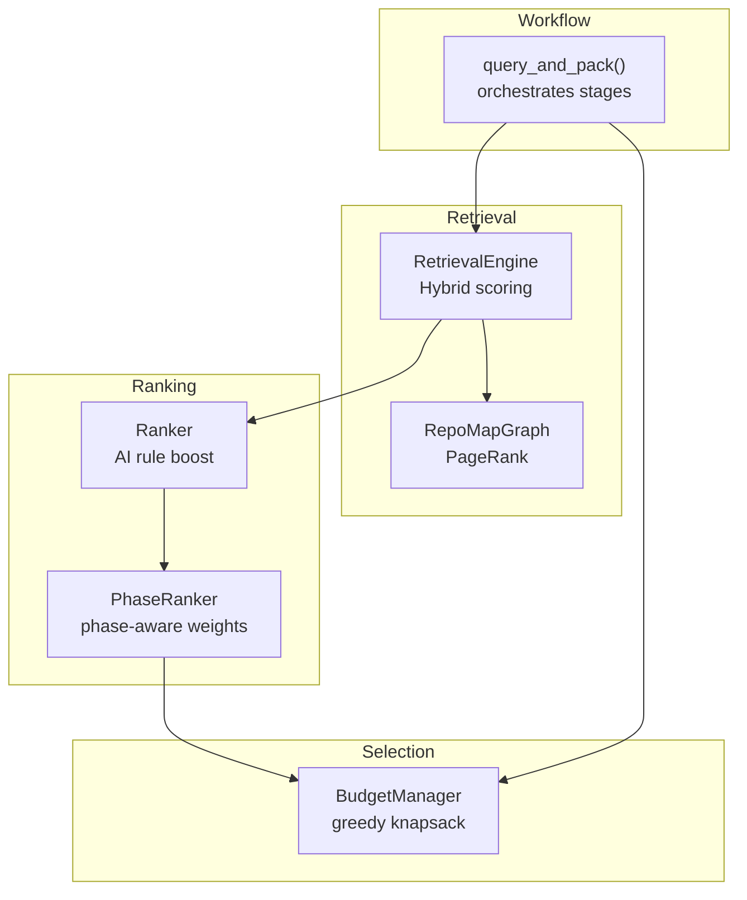
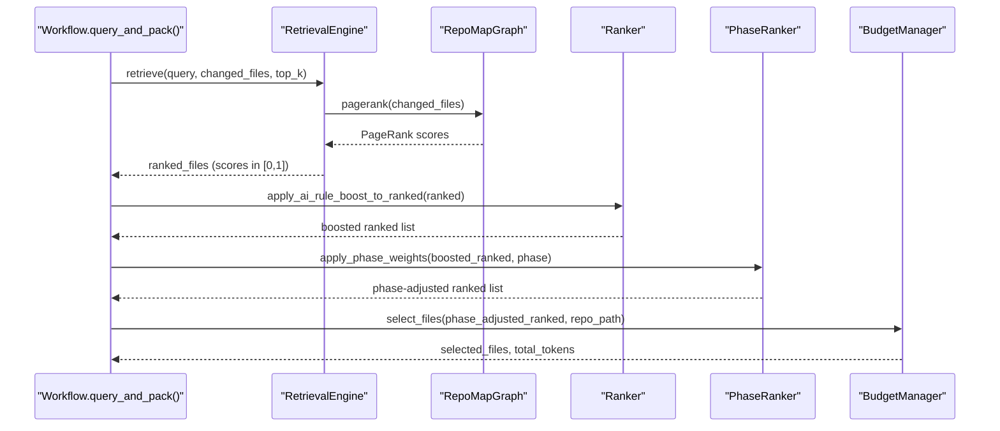
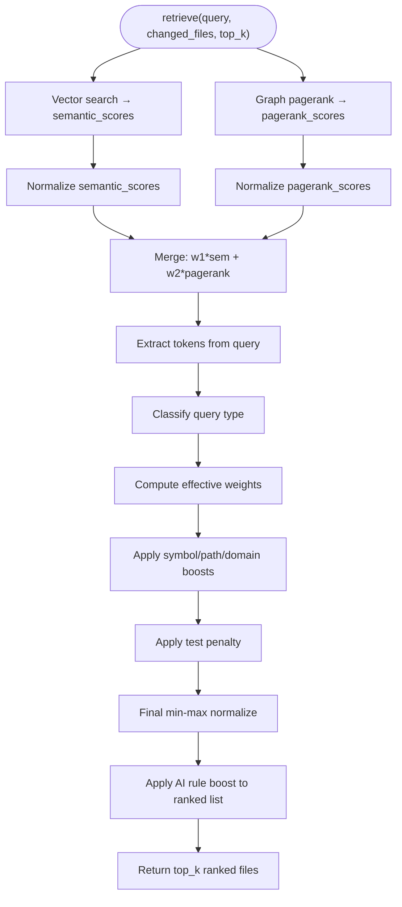
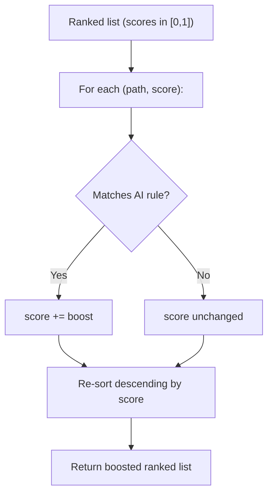
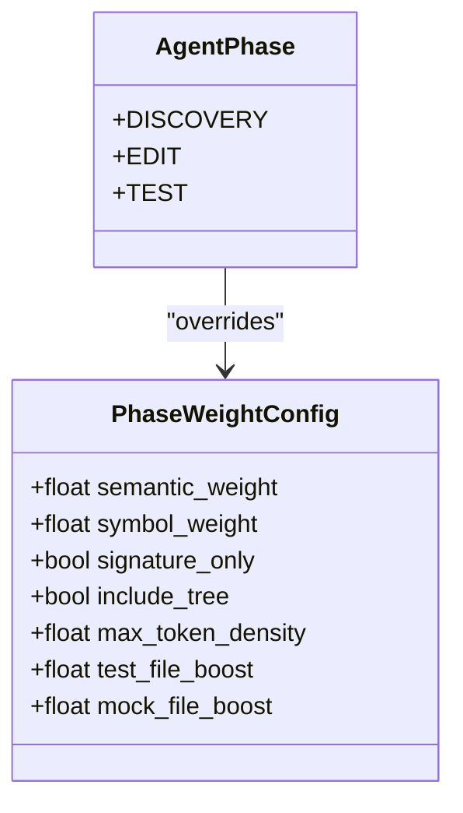
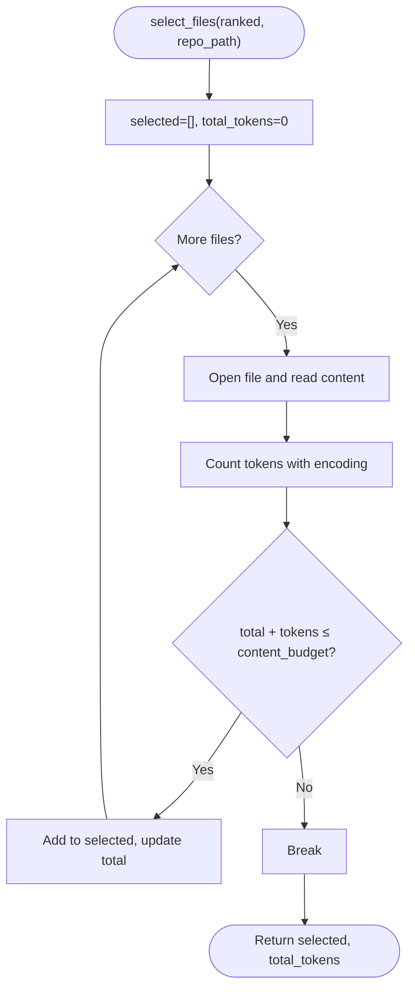
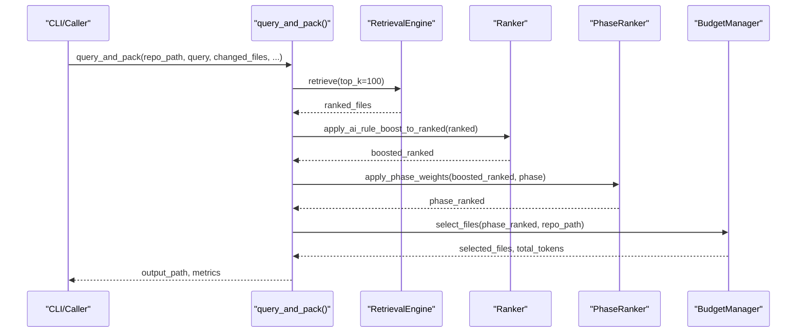
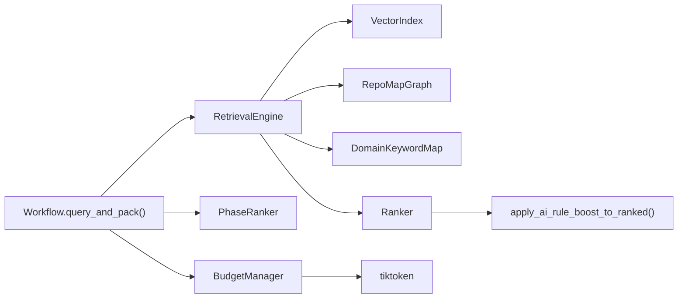

# Stage 6: Ranking and Selection

<cite>
**Referenced Files in This Document**
- [ranker.py](file://src/ws_ctx_engine/ranking/ranker.py)
- [phase_ranker.py](file://src/ws_ctx_engine/ranking/phase_ranker.py)
- [budget.py](file://src/ws_ctx_engine/budget/budget.py)
- [retrieval.py](file://src/ws_ctx_engine/retrieval/retrieval.py)
- [query.py](file://src/ws_ctx_engine/workflow/query.py)
- [graph.py](file://src/ws_ctx_engine/graph/graph.py)
- [config.py](file://src/ws_ctx_engine/config/config.py)
- [models.py](file://src/ws_ctx_engine/models/models.py)
- [ranking.md](file://docs/reference/ranking.md)
- [test_ranker.py](file://tests/unit/test_ranker.py)
- [test_budget.py](file://tests/unit/test_budget.py)
- [test_phase_ranker.py](file://tests/unit/test_phase_ranker.py)
</cite>

## Table of Contents
1. [Introduction](#introduction)
2. [Project Structure](#project-structure)
3. [Core Components](#core-components)
4. [Architecture Overview](#architecture-overview)
5. [Detailed Component Analysis](#detailed-component-analysis)
6. [Dependency Analysis](#dependency-analysis)
7. [Performance Considerations](#performance-considerations)
8. [Troubleshooting Guide](#troubleshooting-guide)
9. [Conclusion](#conclusion)

## Introduction
This document explains the ranking and selection stage of the context retrieval pipeline. It covers the hybrid ranking algorithm that combines semantic similarity and structural PageRank scores, the token budget management system, and content selection optimization. It documents the RetrievalEngine, Ranker utilities, PhaseRanker, and BudgetManager, and shows how they integrate into the full workflow. Practical examples illustrate hybrid scoring, token counting, and content prioritization, and explain how the system balances relevance and structural importance while respecting token limits.

## Project Structure
The ranking and selection stage spans several modules:
- RetrievalEngine: hybrid scoring (semantic + PageRank) plus additional signals
- Ranker: deterministic boost for AI rule files
- PhaseRanker: phase-aware re-weighting for agent workflows
- BudgetManager: greedy knapsack selection constrained by token budget
- Workflow orchestration: ties everything together and manages packing

**Diagram sources**
- [retrieval.py:140-368](file://src/ws_ctx_engine/retrieval/retrieval.py#L140-L368)
- [ranker.py:28-85](file://src/ws_ctx_engine/ranking/ranker.py#L28-L85)
- [phase_ranker.py:96-127](file://src/ws_ctx_engine/ranking/phase_ranker.py#L96-L127)
- [budget.py:50-104](file://src/ws_ctx_engine/budget/budget.py#L50-L104)
- [query.py:324-411](file://src/ws_ctx_engine/workflow/query.py#L324-L411)

**Section sources**
- [retrieval.py:140-368](file://src/ws_ctx_engine/retrieval/retrieval.py#L140-L368)
- [ranker.py:28-85](file://src/ws_ctx_engine/ranking/ranker.py#L28-L85)
- [phase_ranker.py:96-127](file://src/ws_ctx_engine/ranking/phase_ranker.py#L96-L127)
- [budget.py:50-104](file://src/ws_ctx_engine/budget/budget.py#L50-L104)
- [query.py:324-411](file://src/ws_ctx_engine/workflow/query.py#L324-L411)

## Core Components
- RetrievalEngine: Merges semantic similarity and PageRank scores, applies symbol/path/domain boosts, and penalizes test files. Scores are normalized to [0, 1] and then boosted by AI rule files.
- Ranker: Applies a fixed score boost to AI rule files so they always rank at the top, regardless of query.
- PhaseRanker: Adjusts scores based on agent phase (discovery/edit/test) to tailor content selection to workflow needs.
- BudgetManager: Greedily selects files within a token budget using a knapsack algorithm, reserving 20% for metadata and manifest.

**Section sources**
- [retrieval.py:140-368](file://src/ws_ctx_engine/retrieval/retrieval.py#L140-L368)
- [ranker.py:28-85](file://src/ws_ctx_engine/ranking/ranker.py#L28-L85)
- [phase_ranker.py:96-127](file://src/ws_ctx_engine/ranking/phase_ranker.py#L96-L127)
- [budget.py:50-104](file://src/ws_ctx_engine/budget/budget.py#L50-L104)

## Architecture Overview
The ranking and selection pipeline proceeds in four stages orchestrated by the workflow:

**Diagram sources**
- [query.py:324-411](file://src/ws_ctx_engine/workflow/query.py#L324-L411)
- [retrieval.py:250-368](file://src/ws_ctx_engine/retrieval/retrieval.py#L250-L368)
- [ranker.py:64-85](file://src/ws_ctx_engine/ranking/ranker.py#L64-L85)
- [phase_ranker.py:96-127](file://src/ws_ctx_engine/ranking/phase_ranker.py#L96-L127)
- [budget.py:50-104](file://src/ws_ctx_engine/budget/budget.py#L50-L104)

## Detailed Component Analysis

### RetrievalEngine: Hybrid Ranking and Signal Application
RetrievalEngine computes hybrid importance scores by combining semantic similarity and structural PageRank, then enriches scores with symbol/path/domain signals and a test-file penalty. The final scores are normalized to [0, 1] and then boosted by AI rule files.

Key behaviors:
- Semantic scores: vector search results mapped to scores
- PageRank scores: structural importance from the dependency graph
- Normalization: min-max normalization for both semantic and PageRank scores
- Merging: weighted combination of normalized scores
- Signals:
  - Symbol boost: exact matches between query tokens and defined symbols
  - Path boost: tokens appearing in file paths (exact, substring, prefix)
  - Domain boost: files under directories matching domain keywords
  - Test penalty: multiplicative reduction for likely test files
- Final normalization: ensures scores are in [0, 1]
- AI rule boost: pushes rule files to the top regardless of query

**Diagram sources**
- [retrieval.py:250-368](file://src/ws_ctx_engine/retrieval/retrieval.py#L250-L368)

**Section sources**
- [retrieval.py:140-368](file://src/ws_ctx_engine/retrieval/retrieval.py#L140-L368)

### Ranker: AI Rule Boost
The Ranker module ensures that AI rule files (e.g., project-level instructions for agents) are always included in the final context pack. It applies a fixed score boost to any file matching the canonical set of rule filenames or user-defined extras.

Highlights:
- Canonical rule files: a predefined set of filenames/paths
- Boost value: large enough to out-rank any relevance score after normalization
- Matching: by filename or normalized path
- Convenience function: applies boost to a full ranked list and re-sorts

**Diagram sources**
- [ranker.py:28-85](file://src/ws_ctx_engine/ranking/ranker.py#L28-L85)

**Section sources**
- [ranker.py:28-85](file://src/ws_ctx_engine/ranking/ranker.py#L28-L85)
- [ranking.md:1-162](file://docs/reference/ranking.md#L1-L162)
- [test_ranker.py:1-83](file://tests/unit/test_ranker.py#L1-L83)

### PhaseRanker: Phase-Aware Re-weighting
PhaseRanker tailors the ranking to agent workflow phases:
- Discovery: emphasizes directory trees and signatures; lowers token density
- Edit: balanced weighting; preserves verbatim code
- Test: boosts test and mock files to surface testing context

It adjusts effective weights for symbol/path/domain signals and multiplies scores for test/mock files when applicable.

**Diagram sources**
- [phase_ranker.py:25-127](file://src/ws_ctx_engine/ranking/phase_ranker.py#L25-L127)

**Section sources**
- [phase_ranker.py:96-127](file://src/ws_ctx_engine/ranking/phase_ranker.py#L96-L127)
- [test_phase_ranker.py:1-46](file://tests/unit/test_phase_ranker.py#L1-L46)

### BudgetManager: Greedy Knapsack Selection
BudgetManager greedily selects files within a token budget using a knapsack algorithm:
- Reserves 20% of the budget for metadata/manifest
- Processes files in descending order of importance score
- Counts tokens using tiktoken encoding
- Stops when adding the next file would exceed the content budget
- Returns selected files and total tokens used

**Diagram sources**
- [budget.py:50-104](file://src/ws_ctx_engine/budget/budget.py#L50-L104)

**Section sources**
- [budget.py:50-104](file://src/ws_ctx_engine/budget/budget.py#L50-L104)
- [test_budget.py:1-283](file://tests/unit/test_budget.py#L1-L283)

### Token Counting and Content Prioritization
Token counting uses tiktoken encoding to estimate content size. The workflow:
- Reads file content
- Encodes with the same encoding used by BudgetManager
- Accumulates tokens while staying within the content budget (80% of total)

This ensures prioritization favors higher-ranked files first, up to the token limit.

**Section sources**
- [budget.py:86-94](file://src/ws_ctx_engine/budget/budget.py#L86-L94)
- [models.py:60-84](file://src/ws_ctx_engine/models/models.py#L60-L84)

### Retrieval Workflow and Integration
The workflow orchestrates retrieval, ranking, and selection:
- Loads indexes and builds domain map
- Builds RetrievalEngine with configured weights
- Retrieves candidates with hybrid ranking
- Optionally applies phase-aware re-weighting
- Applies AI rule boost
- Selects files within token budget
- Packs output in configured format

**Diagram sources**
- [query.py:324-411](file://src/ws_ctx_engine/workflow/query.py#L324-L411)

**Section sources**
- [query.py:324-411](file://src/ws_ctx_engine/workflow/query.py#L324-L411)

## Dependency Analysis
- RetrievalEngine depends on:
  - VectorIndex for semantic search
  - RepoMapGraph for PageRank scores
  - DomainKeywordMap for domain classification
- Ranker is invoked by RetrievalEngine during finalization
- PhaseRanker is optional and applied after retrieval
- BudgetManager depends on tiktoken for token counting
- Workflow composes all components and controls the pipeline

**Diagram sources**
- [retrieval.py:191-237](file://src/ws_ctx_engine/retrieval/retrieval.py#L191-L237)
- [query.py:341-348](file://src/ws_ctx_engine/workflow/query.py#L341-L348)
- [budget.py:32-48](file://src/ws_ctx_engine/budget/budget.py#L32-L48)

**Section sources**
- [retrieval.py:191-237](file://src/ws_ctx_engine/retrieval/retrieval.py#L191-L237)
- [query.py:341-348](file://src/ws_ctx_engine/workflow/query.py#L341-L348)
- [budget.py:32-48](file://src/ws_ctx_engine/budget/budget.py#L32-L48)

## Performance Considerations
- Greedy selection: BudgetManager’s greedy knapsack is efficient and predictable, with linear pass over ranked files.
- Token counting: Uses tiktoken encoding; consistent across components to avoid discrepancies.
- Normalization: Min-max normalization ensures scores are bounded and comparable across signals.
- Phase-aware adjustments: Light-weight multiplicative re-weighting tailored to agent phases.
- PageRank computation: RepoMapGraph implementations provide fast PageRank computation suitable for large repositories.

[No sources needed since this section provides general guidance]

## Troubleshooting Guide
Common issues and resolutions:
- Invalid token budget: BudgetManager raises an error if budget is not positive.
- Missing files: BudgetManager skips unreadable or missing files gracefully.
- Weights not summing to 1.0: RetrievalEngine validates weights and warns if they do not sum to approximately 1.0.
- AI rule files not included: Ensure the AI rule boost is applied after retrieval and before budget selection.
- Phase parsing failures: PhaseRanker parsing returns None for invalid inputs; workflow logs warnings and continues without phase adjustments.

**Section sources**
- [budget.py:42-48](file://src/ws_ctx_engine/budget/budget.py#L42-L48)
- [test_budget.py:47-57](file://tests/unit/test_budget.py#L47-L57)
- [retrieval.py:219-227](file://src/ws_ctx_engine/retrieval/retrieval.py#L219-L227)
- [query.py:359-366](file://src/ws_ctx_engine/workflow/query.py#L359-L366)

## Conclusion
The ranking and selection stage combines semantic and structural signals to produce robust file rankings, then enforces token budget constraints to ensure practical context sizes. The Ranker guarantees inclusion of AI rule files, PhaseRanker adapts to agent phases, and BudgetManager performs greedy selection within the token budget. Together, these components balance relevance and structural importance while respecting resource limits.