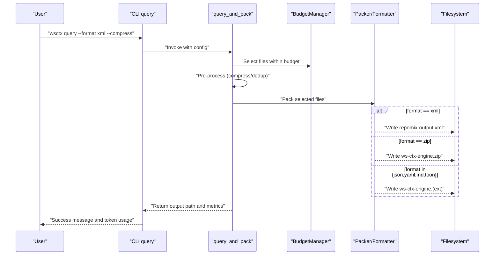
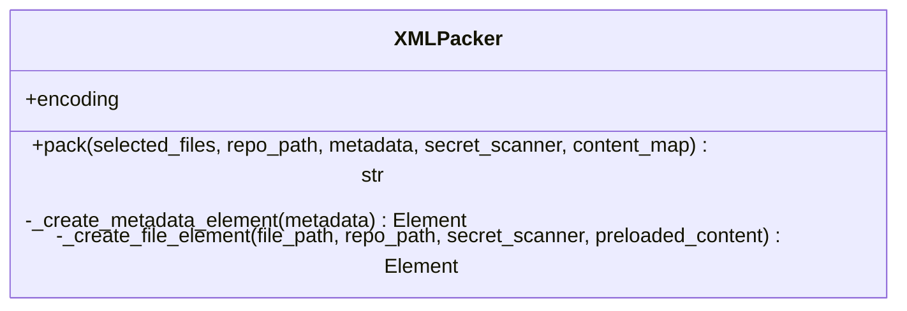
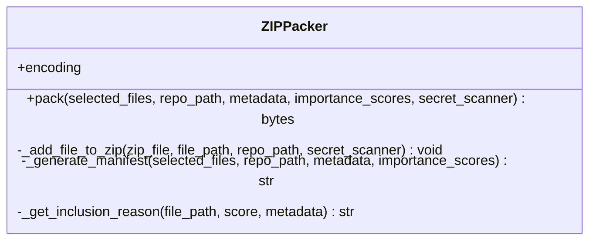
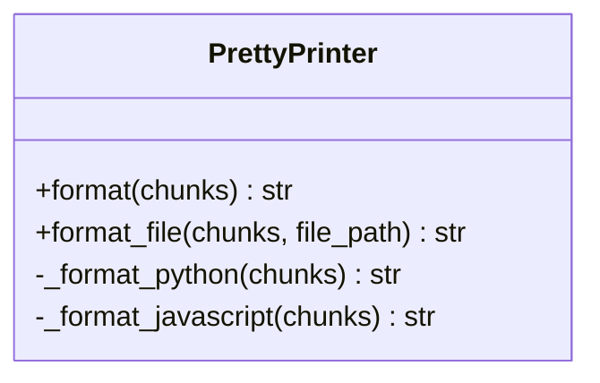
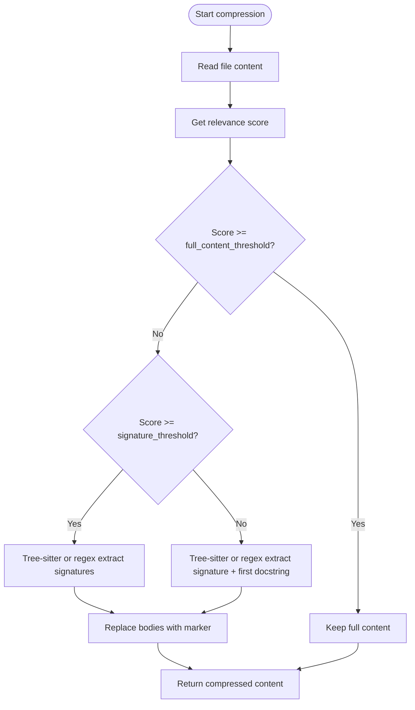
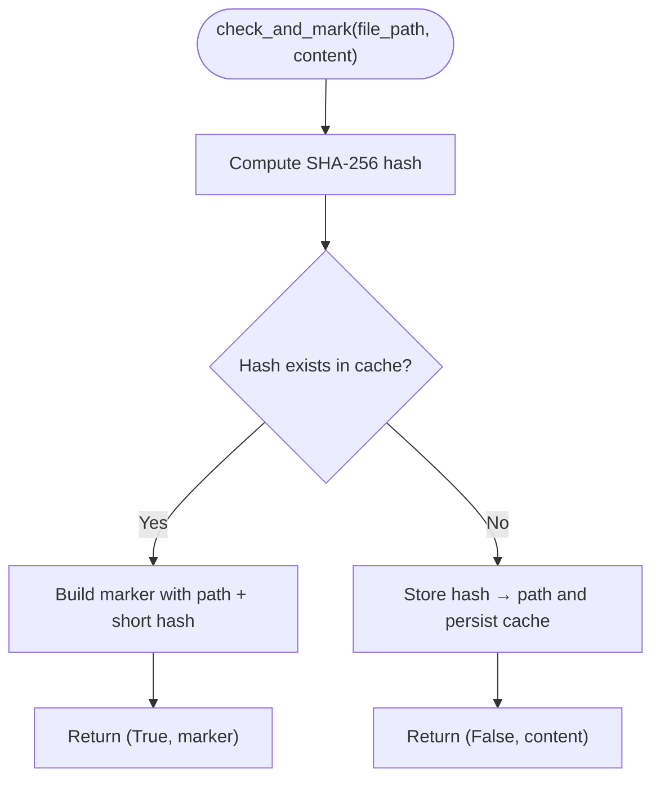
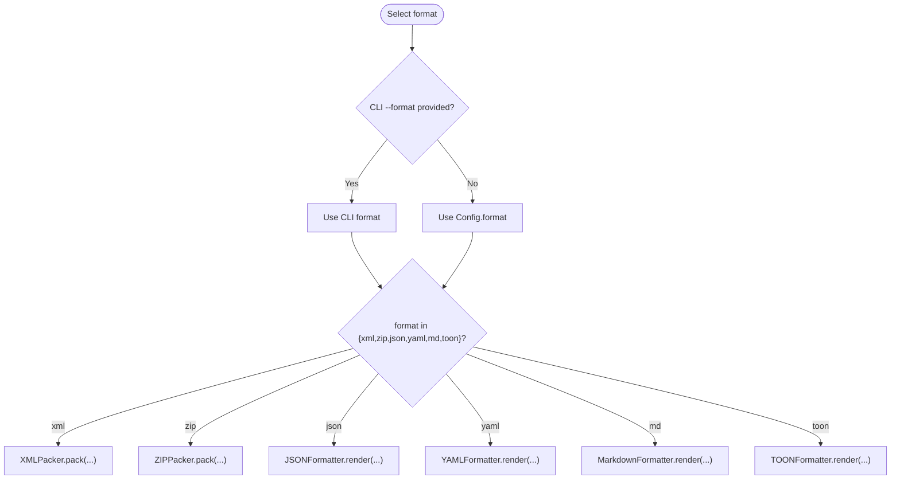
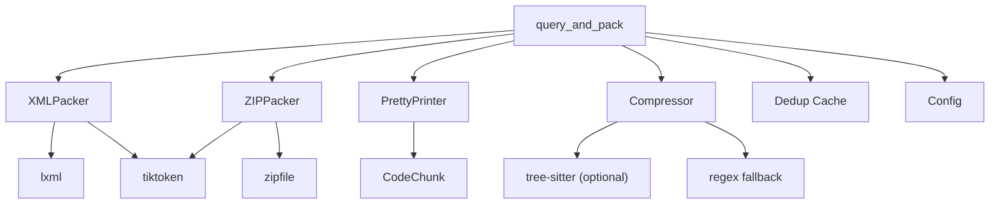

# Stage 7: Packing and Output

<cite>
**Referenced Files in This Document**
- [xml_packer.py](file://src/ws_ctx_engine/packer/xml_packer.py)
- [zip_packer.py](file://src/ws_ctx_engine/packer/zip_packer.py)
- [__init__.py](file://src/ws_ctx_engine/packer/__init__.py)
- [pretty_printer.py](file://src/ws_ctx_engine/formatters/pretty_printer.py)
- [dedup_cache.py](file://src/ws_ctx_engine/session/dedup_cache.py)
- [compressor.py](file://src/ws_ctx_engine/output/compressor.py)
- [json_formatter.py](file://src/ws_ctx_engine/output/json_formatter.py)
- [yaml_formatter.py](file://src/ws_ctx_engine/output/yaml_formatter.py)
- [query.py](file://src/ws_ctx_engine/workflow/query.py)
- [cli.py](file://src/ws_ctx_engine/cli/cli.py)
- [config.py](file://src/ws_ctx_engine/config/config.py)
- [output-formatters.md](file://docs/reference/output-formatters.md)
- [packer.md](file://docs/reference/packer.md)
- [test_xml_packer.py](file://tests/unit/test_xml_packer.py)
- [test_zip_packer.py](file://tests/unit/test_zip_packer.py)
- [test_pretty_printer.py](file://tests/unit/test_pretty_printer.py)
- [test_pretty_printer_properties.py](file://tests/property/test_pretty_printer_properties.py)
- [test_xml_packer_properties.py](file://tests/property/test_xml_packer_properties.py)
- [test_zip_packer_properties.py](file://tests/property/test_zip_packer_properties.py)
</cite>

## Table of Contents
1. [Introduction](#introduction)
2. [Project Structure](#project-structure)
3. [Core Components](#core-components)
4. [Architecture Overview](#architecture-overview)
5. [Detailed Component Analysis](#detailed-component-analysis)
6. [Dependency Analysis](#dependency-analysis)
7. [Performance Considerations](#performance-considerations)
8. [Troubleshooting Guide](#troubleshooting-guide)
9. [Conclusion](#conclusion)

## Introduction
This stage focuses on the packing and output stage of the context engine. It covers how the system transforms selected files into consumable outputs, including:
- XML packaging with metadata and file contents
- ZIP compression with preserved directory structure and a human-readable manifest
- Pretty printing for round-trip testing and human-readable formats
- Smart content compression and session-level deduplication
- Format selection logic and context shuffling for improved model recall

The goal is to produce agent-friendly, secure, and efficient outputs while maintaining context integrity across formats.

## Project Structure
The packing and output functionality spans several modules:
- Packer: XMLPacker and ZIPPacker for primary formats
- Formatters: PrettyPrinter and auxiliary formatters for human-readable and machine-readable outputs
- Workflow: Orchestration of selection, pre-processing, packing, and output writing
- CLI: User-facing controls for format selection, compression, and deduplication
- Supporting utilities: Compression, deduplication cache, and configuration

```mermaid
graph TB
subgraph "Packer"
XML["XMLPacker<br/>XML output"]
ZIP["ZIPPacker<br/>ZIP archive"]
end
subgraph "Formatters"
PP["PrettyPrinter<br/>Round-trip formatting"]
JSONF["JSONFormatter"]
YAML["YAMLFormatter"]
end
subgraph "Workflow"
WF["query_and_pack<br/>Selection + Packing"]
end
subgraph "CLI"
CLI["CLI query command"]
end
subgraph "Support"
COMP["Compressor<br/>smart compression"]
DEDUP["Dedup Cache<br/>session-level dedup"]
CFG["Config<br/>format, budget, paths"]
end
CLI --> WF
WF --> XML
WF --> ZIP
WF --> JSONF
WF --> YAML
WF --> PP
WF --> COMP
WF --> DEDUP
WF --> CFG
```

**Diagram sources**
- [xml_packer.py:51-138](file://src/ws_ctx_engine/packer/xml_packer.py#L51-L138)
- [zip_packer.py:17-90](file://src/ws_ctx_engine/packer/zip_packer.py#L17-L90)
- [pretty_printer.py:13-86](file://src/ws_ctx_engine/formatters/pretty_printer.py#L13-L86)
- [json_formatter.py:9-16](file://src/ws_ctx_engine/output/json_formatter.py#L9-L16)
- [yaml_formatter.py:14-46](file://src/ws_ctx_engine/output/yaml_formatter.py#L14-L46)
- [query.py:230-617](file://src/ws_ctx_engine/workflow/query.py#L230-L617)
- [cli.py:698-932](file://src/ws_ctx_engine/cli/cli.py#L698-L932)
- [compressor.py:217-266](file://src/ws_ctx_engine/output/compressor.py#L217-L266)
- [dedup_cache.py:35-90](file://src/ws_ctx_engine/session/dedup_cache.py#L35-L90)
- [config.py:28-31](file://src/ws_ctx_engine/config/config.py#L28-L31)

**Section sources**
- [xml_packer.py:1-239](file://src/ws_ctx_engine/packer/xml_packer.py#L1-L239)
- [zip_packer.py:1-254](file://src/ws_ctx_engine/packer/zip_packer.py#L1-L254)
- [pretty_printer.py:1-205](file://src/ws_ctx_engine/formatters/pretty_printer.py#L1-L205)
- [query.py:230-617](file://src/ws_ctx_engine/workflow/query.py#L230-L617)
- [cli.py:698-932](file://src/ws_ctx_engine/cli/cli.py#L698-L932)
- [compressor.py:1-266](file://src/ws_ctx_engine/output/compressor.py#L1-L266)
- [dedup_cache.py:1-154](file://src/ws_ctx_engine/session/dedup_cache.py#L1-L154)
- [config.py:1-399](file://src/ws_ctx_engine/config/config.py#L1-L399)

## Core Components
- XMLPacker: Generates Repomix-style XML with metadata and file contents, including token counts and optional secret redaction. It supports context shuffling to improve model recall.
- ZIPPacker: Creates ZIP archives with preserved directory structure under files/, and a REVIEW_CONTEXT.md manifest summarizing the selection rationale and reading order.
- PrettyPrinter: Formats CodeChunk objects back to syntactically valid source code for round-trip testing and human readability.
- Compressor: Applies relevance-aware compression to reduce token usage by replacing function/class bodies with markers based on file importance scores.
- SessionDeduplicationCache: Tracks file content hashes within a session to replace duplicates with compact markers, reducing redundant transmission.
- Config: Centralizes format selection, token budget, and output paths.

Key behaviors:
- Format selection: CLI and Config determine the output format; XML and ZIP are primary, with JSON/YAML/Markdown/TOON as alternatives.
- Pre-processing pipeline: Optional compression and deduplication are applied before packing to optimize token usage and reduce redundancy.
- Security: Optional secret scanning redacts sensitive content across formats.

**Section sources**
- [xml_packer.py:51-138](file://src/ws_ctx_engine/packer/xml_packer.py#L51-L138)
- [zip_packer.py:17-90](file://src/ws_ctx_engine/packer/zip_packer.py#L17-L90)
- [pretty_printer.py:13-86](file://src/ws_ctx_engine/formatters/pretty_printer.py#L13-L86)
- [compressor.py:217-266](file://src/ws_ctx_engine/output/compressor.py#L217-L266)
- [dedup_cache.py:35-90](file://src/ws_ctx_engine/session/dedup_cache.py#L35-L90)
- [config.py:28-31](file://src/ws_ctx_engine/config/config.py#L28-L31)
- [cli.py:794-808](file://src/ws_ctx_engine/cli/cli.py#L794-L808)

## Architecture Overview
The packing and output stage is orchestrated by the query workflow, which:
- Loads indexes and retrieves candidates
- Selects files within the token budget
- Optionally pre-processes content (compression, deduplication)
- Packs outputs according to the configured format
- Writes results to files or streams them to stdout



**Diagram sources**
- [query.py:230-617](file://src/ws_ctx_engine/workflow/query.py#L230-L617)
- [cli.py:698-932](file://src/ws_ctx_engine/cli/cli.py#L698-L932)
- [xml_packer.py:85-137](file://src/ws_ctx_engine/packer/xml_packer.py#L85-L137)
- [zip_packer.py:49-90](file://src/ws_ctx_engine/packer/zip_packer.py#L49-L90)
- [json_formatter.py:9-16](file://src/ws_ctx_engine/output/json_formatter.py#L9-L16)
- [yaml_formatter.py:14-46](file://src/ws_ctx_engine/output/yaml_formatter.py#L14-L46)

## Detailed Component Analysis

### XMLPacker
XMLPacker constructs a Repomix-style XML document:
- Root element repository with metadata and files sections
- Metadata includes repository name, file count, total tokens, optional query, changed files, and index health
- Files are represented as file elements with path and tokens attributes and CDATA content
- Optional secret redaction and UTF-8/lax decoding support
- Pretty-printed XML with XML declaration

Context shuffling:
- The workflow can reorder the top and bottom portions of the file list to improve recall for LLMs.



**Diagram sources**
- [xml_packer.py:51-138](file://src/ws_ctx_engine/packer/xml_packer.py#L51-L138)

**Section sources**
- [xml_packer.py:51-138](file://src/ws_ctx_engine/packer/xml_packer.py#L51-L138)
- [query.py:447-456](file://src/ws_ctx_engine/workflow/query.py#L447-L456)
- [packer.md:111-147](file://docs/reference/packer.md#L111-L147)

### ZIPPacker
ZIPPacker creates a ZIP archive with:
- files/ directory preserving the original directory structure
- REVIEW_CONTEXT.md manifest with repository metadata, inclusion reasons, and suggested reading order
- Optional secret redaction and UTF-8 fallback decoding



**Diagram sources**
- [zip_packer.py:17-227](file://src/ws_ctx_engine/packer/zip_packer.py#L17-L227)

**Section sources**
- [zip_packer.py:17-227](file://src/ws_ctx_engine/packer/zip_packer.py#L17-L227)
- [packer.md:212-236](file://docs/reference/packer.md#L212-L236)

### PrettyPrinter
PrettyPrinter formats CodeChunk objects back to valid source code:
- Groups chunks by language and validates uniformity
- Supports Python, JavaScript, and TypeScript
- Filters nested chunks to maintain top-level structure
- Joins chunks with double newlines for readability



**Diagram sources**
- [pretty_printer.py:13-176](file://src/ws_ctx_engine/formatters/pretty_printer.py#L13-L176)

**Section sources**
- [pretty_printer.py:13-176](file://src/ws_ctx_engine/formatters/pretty_printer.py#L13-L176)
- [test_pretty_printer.py:1-205](file://tests/unit/test_pretty_printer.py#L1-L205)
- [test_pretty_printer_properties.py:1-205](file://tests/property/test_pretty_printer_properties.py#L1-L205)

### Content Compression
Smart compression reduces token usage by replacing function/class bodies with markers based on relevance:
- High relevance (≥ threshold): full content retained
- Medium relevance (≥ lower threshold): signatures only
- Low relevance (< lower threshold): signature plus first docstring
- Uses Tree-sitter when available; falls back to regex for Python/JS/TS/Rust



**Diagram sources**
- [compressor.py:217-266](file://src/ws_ctx_engine/output/compressor.py#L217-L266)

**Section sources**
- [compressor.py:1-266](file://src/ws_ctx_engine/output/compressor.py#L1-L266)
- [output-formatters.md:164-205](file://docs/reference/output-formatters.md#L164-L205)

### Session-Level Deduplication
SessionDeduplicationCache tracks file content hashes within a session and replaces duplicates with compact markers:
- Hash-based dedup with atomic writes to a JSON cache file
- Marker template includes path and short hash
- Safe path resolution to prevent traversal
- Clear-all utility for maintenance



**Diagram sources**
- [dedup_cache.py:65-89](file://src/ws_ctx_engine/session/dedup_cache.py#L65-L89)

**Section sources**
- [dedup_cache.py:1-154](file://src/ws_ctx_engine/session/dedup_cache.py#L1-L154)
- [query.py:429-490](file://src/ws_ctx_engine/workflow/query.py#L429-L490)

### Format Selection Logic
Format selection is driven by configuration and CLI flags:
- Config.default format is zip; CLI allows overriding to xml, json, yaml, md, toon, or zip
- CLI also exposes --compress and --no-dedup flags
- The workflow conditionally applies compression and deduplication before packing
- Binary formats (zip) are written as bytes; text formats are written as UTF-8 strings



**Diagram sources**
- [config.py:28-31](file://src/ws_ctx_engine/config/config.py#L28-L31)
- [cli.py:794-808](file://src/ws_ctx_engine/cli/cli.py#L794-L808)
- [query.py:505-587](file://src/ws_ctx_engine/workflow/query.py#L505-L587)

**Section sources**
- [config.py:28-31](file://src/ws_ctx_engine/config/config.py#L28-L31)
- [cli.py:794-808](file://src/ws_ctx_engine/cli/cli.py#L794-L808)
- [query.py:505-587](file://src/ws_ctx_engine/workflow/query.py#L505-L587)
- [packer.md:207-216](file://docs/reference/packer.md#L207-L216)

## Dependency Analysis
- XMLPacker depends on lxml for XML construction and tiktoken for token counting.
- ZIPPacker depends on zipfile for archive creation and tiktoken for token counting.
- PrettyPrinter depends on CodeChunk models and language-specific formatting logic.
- Compressor depends on tree-sitter grammars when available; otherwise uses regex fallbacks.
- Workflow orchestrates packers/formatters, compression, and deduplication, and writes outputs to disk.
- CLI validates and applies format selection and pre-processing flags.



**Diagram sources**
- [xml_packer.py:10-11](file://src/ws_ctx_engine/packer/xml_packer.py#L10-L11)
- [zip_packer.py:8-12](file://src/ws_ctx_engine/packer/zip_packer.py#L8-L12)
- [compressor.py:142-171](file://src/ws_ctx_engine/output/compressor.py#L142-L171)
- [query.py:230-617](file://src/ws_ctx_engine/workflow/query.py#L230-L617)

**Section sources**
- [xml_packer.py:10-11](file://src/ws_ctx_engine/packer/xml_packer.py#L10-L11)
- [zip_packer.py:8-12](file://src/ws_ctx_engine/packer/zip_packer.py#L8-L12)
- [compressor.py:142-171](file://src/ws_ctx_engine/output/compressor.py#L142-L171)
- [query.py:230-617](file://src/ws_ctx_engine/workflow/query.py#L230-L617)

## Performance Considerations
- Token efficiency: Smart compression reduces token usage by replacing bodies with markers for lower-relevance files.
- Memory safety: ZIP is built in-memory using BytesIO to avoid temporary filesystem overhead.
- Encoding robustness: Both XMLPacker and ZIPPacker handle UTF-8 decoding with fallback to latin-1 for resilience.
- Context integrity: XMLPacker supports context shuffling to mitigate “Lost in the Middle” recall issues.
- Deduplication: Session-level deduplication avoids re-sending identical content across agent calls.

[No sources needed since this section provides general guidance]

## Troubleshooting Guide
Common issues and resolutions:
- Invalid format: Ensure format is one of xml, zip, json, yaml, md, toon; otherwise defaults to zip.
- Empty or unreadable files: UTF-8 decoding failures fall back to latin-1; verify file encodings.
- Missing indexes: The workflow raises explicit errors if indexes are not found; run the indexing command first.
- Token budget exceeded: The budget manager selects files greedily; adjust token budget or reduce selection.
- Dedup cache path traversal: Session cache enforces safe path resolution; avoid session IDs with directory separators.

**Section sources**
- [config.py:218-231](file://src/ws_ctx_engine/config/config.py#L218-L231)
- [xml_packer.py:214-220](file://src/ws_ctx_engine/packer/xml_packer.py#L214-L220)
- [zip_packer.py:114-123](file://src/ws_ctx_engine/packer/zip_packer.py#L114-L123)
- [query.py:316-322](file://src/ws_ctx_engine/workflow/query.py#L316-L322)
- [dedup_cache.py:49-57](file://src/ws_ctx_engine/session/dedup_cache.py#L49-L57)

## Conclusion
The packing and output stage delivers flexible, secure, and efficient context packaging tailored for both agents and humans. XMLPacker and ZIPPacker provide agent-friendly and bundle-friendly formats respectively, complemented by smart compression and session-level deduplication to optimize token usage and reduce redundancy. The PrettyPrinter ensures round-trip fidelity for testing. Format selection is centralized via configuration and CLI flags, enabling seamless integration into agent workflows while preserving context integrity across diverse output formats.