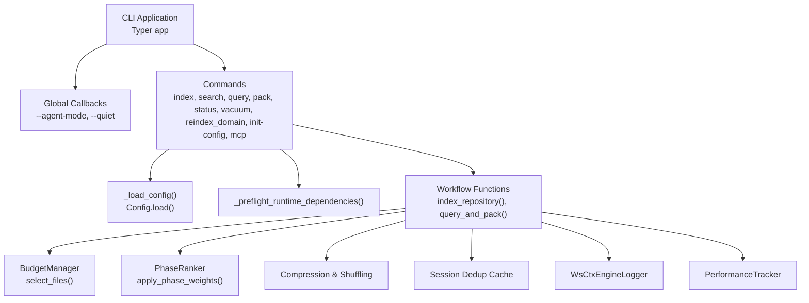
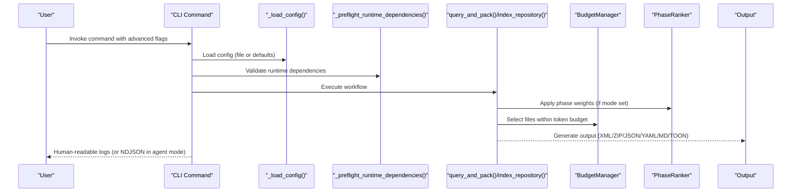
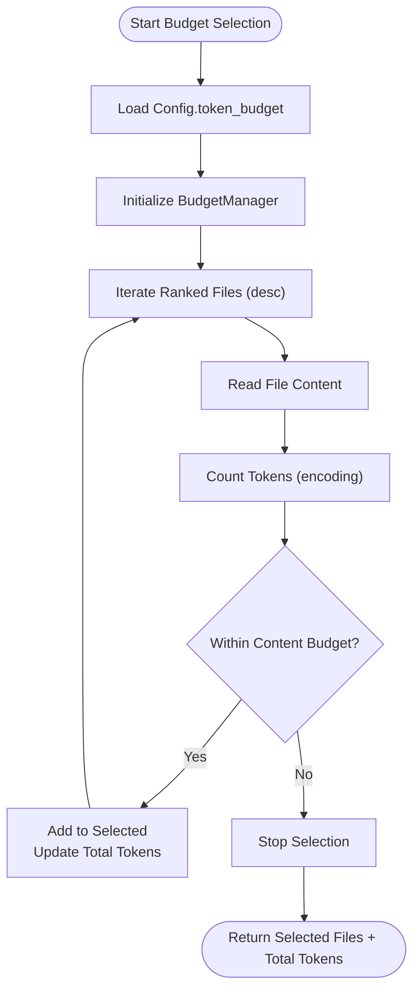
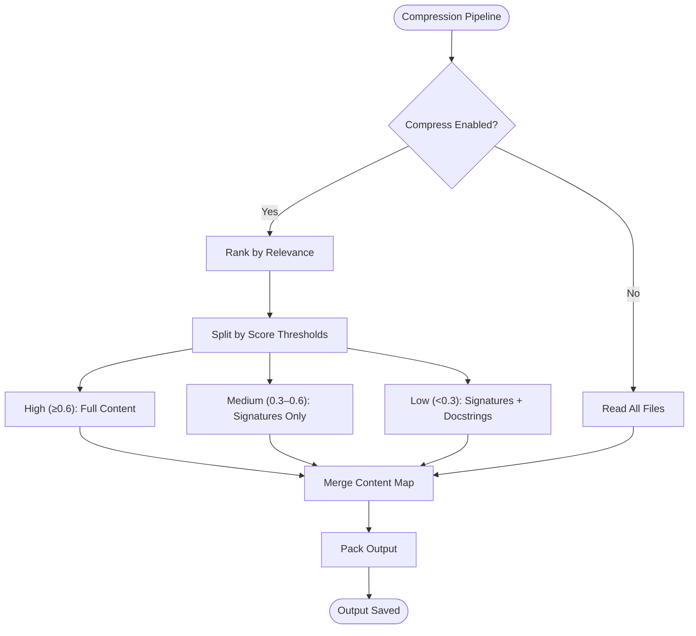
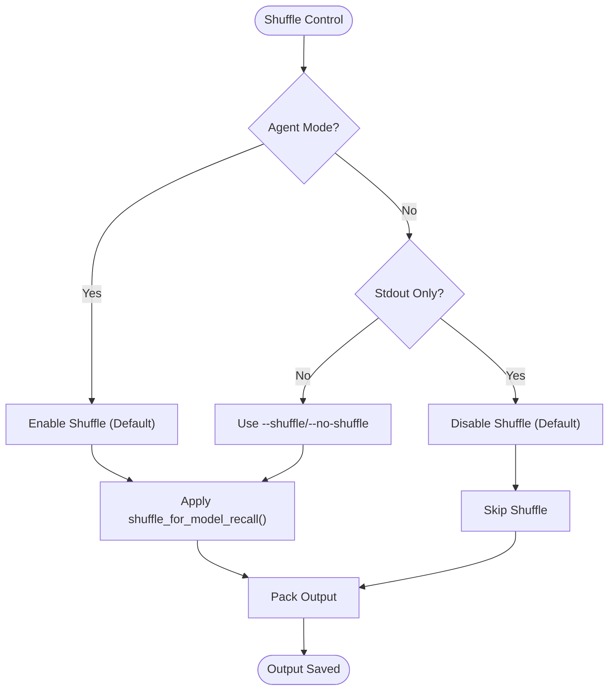
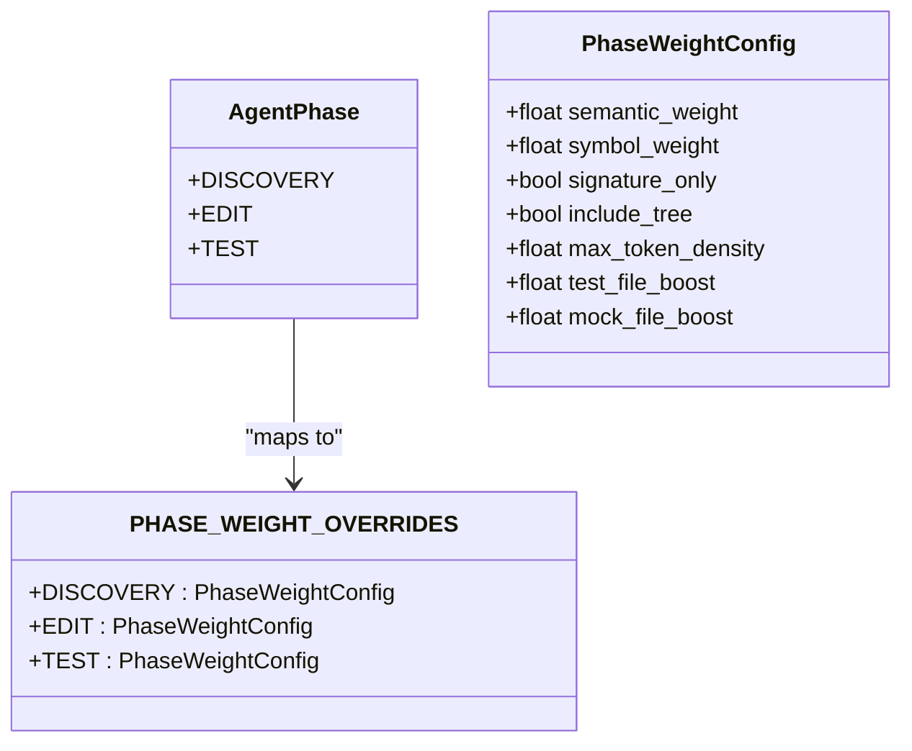
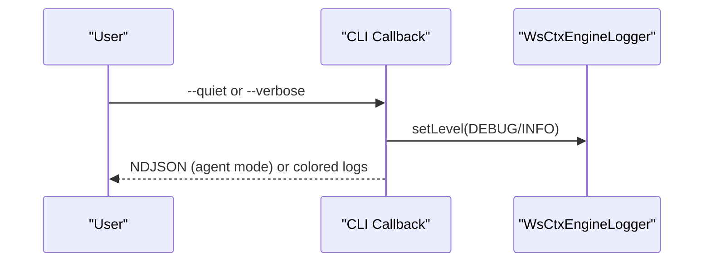
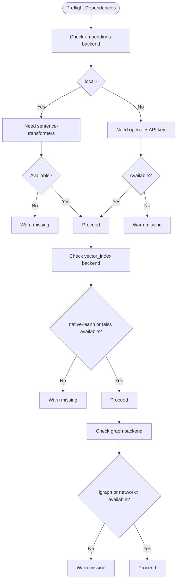

# Advanced Options & Flags

<cite>
**Referenced Files in This Document**
- [cli.py](file://src/ws_ctx_engine/cli/cli.py)
- [config.py](file://src/ws_ctx_engine/config/config.py)
- [budget.py](file://src/ws_ctx_engine/budget/budget.py)
- [logger.py](file://src/ws_ctx_engine/logger/logger.py)
- [query.py](file://src/ws_ctx_engine/workflow/query.py)
- [indexer.py](file://src/ws_ctx_engine/workflow/indexer.py)
- [phase_ranker.py](file://src/ws_ctx_engine/ranking/phase_ranker.py)
- [dedup_cache.py](file://src/ws_ctx_engine/session/dedup_cache.py)
- [performance.py](file://src/ws_ctx_engine/monitoring/performance.py)
- [compression.md](file://docs/guides/compression.md)
- [logging.md](file://docs/guides/logging.md)
- [performance.md](file://docs/guides/performance.md)
- [mcp-server.md](file://docs/integrations/mcp-server.md)
- [init_cli.py](file://src/ws_ctx_engine/init_cli.py)
</cite>

## Table of Contents
1. [Introduction](#introduction)
2. [Project Structure](#project-structure)
3. [Core Components](#core-components)
4. [Architecture Overview](#architecture-overview)
5. [Detailed Component Analysis](#detailed-component-analysis)
6. [Dependency Analysis](#dependency-analysis)
7. [Performance Considerations](#performance-considerations)
8. [Troubleshooting Guide](#troubleshooting-guide)
9. [Conclusion](#conclusion)
10. [Appendices](#appendices)

## Introduction
This document provides expert-level guidance for advanced CLI options and flags in ws-ctx-engine. It focuses on specialized features such as token budget management, compression settings, shuffle controls, and mode adjustments for agent phases. It also covers verbose logging, agent mode functionality, clipboard operations, performance optimization, memory management, batch processing, troubleshooting flags, diagnostic options, and integration with automated workflows.

## Project Structure
The CLI surface is implemented around a central Typer application with command-specific options and shared configuration. Advanced features are layered through:
- CLI callbacks and commands
- Configuration loading and validation
- Budget management and token-aware selection
- Phase-aware ranking for agent workflows
- Compression and context shuffling
- Session-level deduplication
- Structured logging and performance tracking

**Diagram sources**
- [cli.py:376-403](file://src/ws_ctx_engine/cli/cli.py#L376-L403)
- [cli.py:405-501](file://src/ws_ctx_engine/cli/cli.py#L405-L501)
- [cli.py:697-932](file://src/ws_ctx_engine/cli/cli.py#L697-L932)
- [cli.py:934-1196](file://src/ws_ctx_engine/cli/cli.py#L934-L1196)
- [config.py:112-215](file://src/ws_ctx_engine/config/config.py#L112-L215)
- [query.py:230-617](file://src/ws_ctx_engine/workflow/query.py#L230-L617)
- [budget.py:50-105](file://src/ws_ctx_engine/budget/budget.py#L50-L105)
- [phase_ranker.py:96-123](file://src/ws_ctx_engine/ranking/phase_ranker.py#L96-L123)
- [dedup_cache.py:65-90](file://src/ws_ctx_engine/session/dedup_cache.py#L65-L90)
- [logger.py:13-145](file://src/ws_ctx_engine/logger/logger.py#L13-L145)
- [performance.py:72-263](file://src/ws_ctx_engine/monitoring/performance.py#L72-L263)

**Section sources**
- [cli.py:376-403](file://src/ws_ctx_engine/cli/cli.py#L376-L403)
- [config.py:112-215](file://src/ws_ctx_engine/config/config.py#L112-L215)

## Core Components
- CLI application with global callbacks for agent mode and quiet logging
- Commands for indexing, searching, querying, packing, status, vacuum, reindex domain, init-config, and MCP server
- Configuration loader with validation and defaults
- Budget manager for token-aware file selection
- Phase-aware ranking for agent workflows
- Compression and context shuffling for improved recall and reduced token usage
- Session-level deduplication cache
- Structured logging and performance tracking

**Section sources**
- [cli.py:376-403](file://src/ws_ctx_engine/cli/cli.py#L376-L403)
- [cli.py:405-501](file://src/ws_ctx_engine/cli/cli.py#L405-L501)
- [cli.py:697-932](file://src/ws_ctx_engine/cli/cli.py#L697-L932)
- [cli.py:934-1196](file://src/ws_ctx_engine/cli/cli.py#L934-L1196)
- [config.py:16-111](file://src/ws_ctx_engine/config/config.py#L16-L111)
- [budget.py:8-50](file://src/ws_ctx_engine/budget/budget.py#L8-L50)
- [phase_ranker.py:25-72](file://src/ws_ctx_engine/ranking/phase_ranker.py#L25-L72)
- [dedup_cache.py:35-60](file://src/ws_ctx_engine/session/dedup_cache.py#L35-L60)
- [logger.py:13-63](file://src/ws_ctx_engine/logger/logger.py#L13-L63)
- [performance.py:72-140](file://src/ws_ctx_engine/monitoring/performance.py#L72-L140)

## Architecture Overview
The CLI orchestrates end-to-end workflows with advanced controls:
- Global agent mode switches output to NDJSON on stdout and routes logs to stderr
- Per-command verbose flags enable detailed timing information
- Token budget and compression/shuffle controls shape output size and model recall
- Mode flags adjust ranking weights for agent phases
- Session-level deduplication reduces redundant content across repeated calls
- Runtime dependency preflight validates optional backends and suggests installations

**Diagram sources**
- [cli.py:787-932](file://src/ws_ctx_engine/cli/cli.py#L787-L932)
- [cli.py:1029-1196](file://src/ws_ctx_engine/cli/cli.py#L1029-L1196)
- [query.py:230-617](file://src/ws_ctx_engine/workflow/query.py#L230-L617)
- [budget.py:50-105](file://src/ws_ctx_engine/budget/budget.py#L50-L105)
- [phase_ranker.py:96-123](file://src/ws_ctx_engine/ranking/phase_ranker.py#L96-L123)

## Detailed Component Analysis

### Token Budget Management
- Purpose: Control total tokens in generated context to fit model limits
- CLI flags:
  - `--budget/-b INT`: Overrides token budget from config
- Behavior:
  - BudgetManager reserves 20% for metadata and uses 80% for content
  - Greedy selection accumulates files until content budget is exhausted
  - Logs and reports total tokens used and budget utilization percentage
- Expert tips:
  - Lower budgets increase compression effectiveness
  - Combine with compression and shuffle for optimal recall

**Diagram sources**
- [budget.py:50-105](file://src/ws_ctx_engine/budget/budget.py#L50-L105)
- [query.py:381-412](file://src/ws_ctx_engine/workflow/query.py#L381-L412)

**Section sources**
- [budget.py:8-50](file://src/ws_ctx_engine/budget/budget.py#L8-L50)
- [budget.py:50-105](file://src/ws_ctx_engine/budget/budget.py#L50-L105)
- [query.py:381-412](file://src/ws_ctx_engine/workflow/query.py#L381-L412)

### Compression Settings
- Purpose: Reduce token usage with relevance-aware compression
- CLI flags:
  - `--compress`: Enable smart compression for selected files
- Behavior:
  - High relevance: full content
  - Medium relevance: signatures only
  - Low relevance: signatures + docstrings
  - Uses language-specific parsers (Tree-sitter preferred, regex fallback)
- Expert tips:
  - Combine with shuffle to keep high-relevance files at top/bottom
  - Use with JSON/YAML/MD/TXT outputs for readable formats

**Diagram sources**
- [compression.md:8-49](file://docs/guides/compression.md#L8-L49)
- [query.py:461-490](file://src/ws_ctx_engine/workflow/query.py#L461-L490)

**Section sources**
- [compression.md:8-49](file://docs/guides/compression.md#L8-L49)
- [query.py:461-490](file://src/ws_ctx_engine/workflow/query.py#L461-L490)

### Shuffle Controls
- Purpose: Combat “Lost in the Middle” by placing high-relevance files at both ends
- CLI flags:
  - `--shuffle/--no-shuffle`: Toggle shuffling (default on in agent mode)
- Behavior:
  - Interleaves top-ranked files to top and bottom positions
  - Applied primarily to XML output for model recall
- Expert tips:
  - Keep on for agent mode; disable for stdout-only or when preserving original order is required

**Diagram sources**
- [compression.md:52-80](file://docs/guides/compression.md#L52-L80)
- [query.py:447-456](file://src/ws_ctx_engine/workflow/query.py#L447-L456)

**Section sources**
- [compression.md:52-80](file://docs/guides/compression.md#L52-L80)
- [query.py:447-456](file://src/ws_ctx_engine/workflow/query.py#L447-L456)

### Mode Adjustments for Agent Phases
- Purpose: Tailor ranking weights for agent workflows (Discovery, Edit, Test)
- CLI flags:
  - `--mode discovery|edit|test`: Adjusts ranking weights and boosts
- Behavior:
  - Discovery: Signature-only, include directory trees, lower token density
  - Edit: Verbatim code, higher token density
  - Test: Boosts test and mock files
- Expert tips:
  - Use `--mode edit` for implementation tasks requiring full code
  - Use `--mode test` for verification and debugging tasks

**Diagram sources**
- [phase_ranker.py:25-72](file://src/ws_ctx_engine/ranking/phase_ranker.py#L25-L72)

**Section sources**
- [phase_ranker.py:96-123](file://src/ws_ctx_engine/ranking/phase_ranker.py#L96-L123)
- [query.py:356-366](file://src/ws_ctx_engine/workflow/query.py#L356-L366)

### Verbose Logging and Quiet Mode
- Purpose: Control verbosity and log levels for diagnostics
- CLI flags:
  - Global: `--quiet/--no-quiet` (suppress INFO+, show only warnings/errors)
  - Per-command: `--verbose/-v` (enable DEBUG logging with detailed timing)
- Behavior:
  - Agent mode routes human-readable logs to stderr and emits NDJSON on stdout
  - Structured logging to both console and file with timestamped entries
- Expert tips:
  - Use `--verbose` for profiling slow phases
  - Use `--quiet` in CI to reduce noise

**Diagram sources**
- [cli.py:376-403](file://src/ws_ctx_engine/cli/cli.py#L376-L403)
- [logger.py:13-63](file://src/ws_ctx_engine/logger/logger.py#L13-L63)

**Section sources**
- [cli.py:376-403](file://src/ws_ctx_engine/cli/cli.py#L376-L403)
- [logger.py:13-63](file://src/ws_ctx_engine/logger/logger.py#L13-L63)
- [logging.md:1-100](file://docs/guides/logging.md#L1-L100)

### Clipboard Operations
- Purpose: Copy output to system clipboard for quick paste
- CLI flags:
  - `--copy`: Copies output content to clipboard after packing
- Behavior:
  - Attempts platform-specific tools (pbcopy, clip, xclip, xsel)
  - Emits a warning if no clipboard tool is found
- Expert tips:
  - Useful for pasting into chat windows or editors
  - Combine with `--stdout` for piping to other tools

**Section sources**
- [cli.py:64-86](file://src/ws_ctx_engine/cli/cli.py#L64-L86)
- [cli.py:902-904](file://src/ws_ctx_engine/cli/cli.py#L902-L904)
- [cli.py:1173-1175](file://src/ws_ctx_engine/cli/cli.py#L1173-L1175)

### Session-Level Semantic Deduplication
- Purpose: Avoid sending identical content multiple times within a session
- CLI flags:
  - `--session-id STR`: Identifier for dedup cache
  - `--no-dedup`: Disable deduplication entirely
- Behavior:
  - Persists a JSON cache under `.ws-ctx-engine` with hashed content markers
  - Replaces repeated content with compact markers
- Expert tips:
  - Use persistent session IDs across agent runs to maximize reuse
  - Disable dedup for deterministic outputs or when caching is undesired

**Section sources**
- [dedup_cache.py:35-90](file://src/ws_ctx_engine/session/dedup_cache.py#L35-L90)
- [query.py:429-490](file://src/ws_ctx_engine/workflow/query.py#L429-L490)

### Batch Processing and Automation
- Strategies:
  - Use `--stdout` to pipe outputs to downstream tools
  - Use `--agent-mode` for machine-parseable NDJSON streams
  - Use `--quiet` to suppress human-readable logs in CI
  - Use `--format` to select output schema (XML, ZIP, JSON, YAML, MD, TOON)
  - Use `--compress` and `--shuffle` to optimize token usage and recall
- Expert tips:
  - Chain commands: `ws-ctx-engine index && ws-ctx-engine pack . --compress --shuffle`
  - Use `--mode` to tailor outputs per agent phase
  - Combine with `--session-id` for multi-call workflows

**Section sources**
- [cli.py:778-932](file://src/ws_ctx_engine/cli/cli.py#L778-L932)
- [cli.py:1020-1196](file://src/ws_ctx_engine/cli/cli.py#L1020-L1196)

### MCP Server and Rate Limits
- Purpose: Run ws-ctx-engine as an MCP stdio server for agent integrations
- CLI flags:
  - `--workspace/-w PATH`: Bind server to a workspace
  - `--mcp-config PATH`: Custom MCP config JSON
  - `--rate-limit TOOL=LIMIT`: Override tool rate limits (e.g., search_codebase=60)
- Behavior:
  - Validates rate limit format and tool names
  - Starts stdio server with configured workspace and limits
- Expert tips:
  - Use rate limits to protect external APIs and manage throughput
  - Persist MCP config for reproducible server setups

**Section sources**
- [cli.py:646-695](file://src/ws_ctx_engine/cli/cli.py#L646-L695)
- [mcp-server.md:89-94](file://docs/integrations/mcp-server.md#L89-L94)

### Initialization and Configuration
- Purpose: Generate smart configuration tailored to the repository
- CLI flags:
  - `--include-gitignore/--no-include-gitignore`: Include .gitignore patterns
  - `--vector-index/--graph/--embeddings`: Backend selection hints
  - `--force`: Overwrite existing config
- Behavior:
  - Builds a payload combining config defaults and repository-specific patterns
  - Updates .gitignore with ws-ctx-engine artifact patterns
- Expert tips:
  - Use `--include-gitignore` to respect project exclusions
  - Lock down backends with explicit flags for reproducibility

**Section sources**
- [cli.py:1462-1558](file://src/ws_ctx_engine/cli/cli.py#L1462-L1558)
- [init_cli.py:10-24](file://src/ws_ctx_engine/init_cli.py#L10-L24)

## Dependency Analysis
Runtime dependency preflight ensures optional backends are available and suggests installations when missing. It resolves:
- Embeddings backends: local (sentence-transformers) or API (openai)
- Vector index backends: native-leann, leann, or faiss
- Graph backends: igraph or networkx

**Diagram sources**
- [cli.py:256-327](file://src/ws_ctx_engine/cli/cli.py#L256-L327)

**Section sources**
- [cli.py:256-327](file://src/ws_ctx_engine/cli/cli.py#L256-L327)

## Performance Considerations
- Rust extension: Optional acceleration for file walking, hashing, and token counting
- Memory tracking: PerformanceTracker optionally records peak memory usage
- Incremental indexing: Rebuilds only changed/deleted files when possible
- Embedding cache: Persists embeddings to disk to avoid recomputation
- Parallel workers: Reserved for future parallel processing

**Section sources**
- [performance.md:1-81](file://docs/guides/performance.md#L1-L81)
- [performance.py:185-206](file://src/ws_ctx_engine/monitoring/performance.py#L185-L206)
- [indexer.py:142-238](file://src/ws_ctx_engine/workflow/indexer.py#L142-L238)
- [config.py:94-101](file://src/ws_ctx_engine/config/config.py#L94-L101)

## Troubleshooting Guide
- Doctor command: Reports availability of recommended dependencies and suggests installation
- Error logging: Structured logs with context and stack traces
- Quiet mode: Suppresses INFO-level noise for cleaner CI logs
- Verbose mode: Enables DEBUG-level logs with detailed timings
- Index staleness: Use status and vacuum commands to diagnose and optimize

**Section sources**
- [cli.py:330-364](file://src/ws_ctx_engine/cli/cli.py#L330-L364)
- [logger.py:96-125](file://src/ws_ctx_engine/logger/logger.py#L96-L125)
- [cli.py:1198-1329](file://src/ws_ctx_engine/cli/cli.py#L1198-L1329)

## Conclusion
The advanced CLI options in ws-ctx-engine enable expert-level control over token budgets, compression, shuffle, agent-phase modes, logging, and automation. By combining these flags with session-level deduplication, rate-limited MCP servers, and performance optimizations, teams can achieve efficient, reproducible, and agent-friendly workflows.

## Appendices

### Quick Reference: Advanced Flags
- Token budget: `--budget INT`
- Compression: `--compress`
- Shuffle: `--shuffle/--no-shuffle`
- Agent mode: `--agent-mode`
- Verbose logging: `--verbose/-v`
- Quiet mode: `--quiet/--no-quiet`
- Output format: `--format xml|zip|json|yaml|md|toon`
- Secrets scan: `--secrets-scan`
- Copy to clipboard: `--copy`
- Mode adjustment: `--mode discovery|edit|test`
- Session dedup: `--session-id STR`, `--no-dedup`
- MCP server: `--workspace PATH`, `--mcp-config PATH`, `--rate-limit TOOL=LIMIT`
- Init config: `--include-gitignore/--no-include-gitignore`, `--vector-index/--graph/--embeddings`, `--force`

[No sources needed since this section summarizes flags without analyzing specific files]