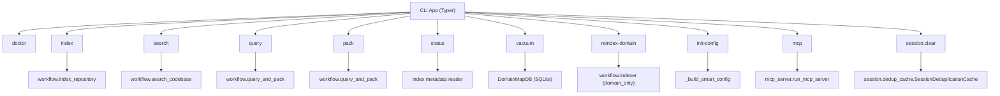
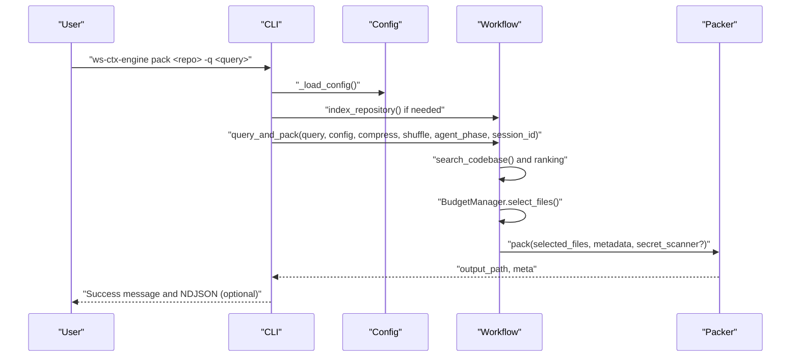
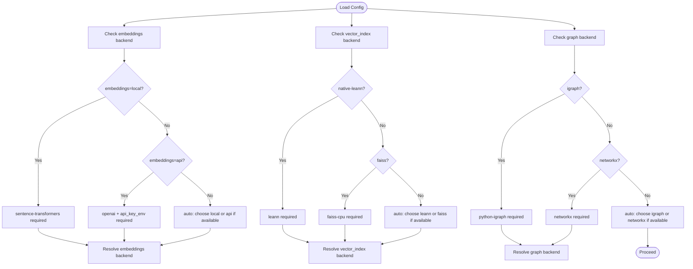

# CLI Reference

<cite>
**Referenced Files in This Document**
- [cli.py](file://src/ws_ctx_engine/cli/cli.py)
- [cli.md](file://docs/reference/cli.md)
- [output-formats.md](file://docs/guides/output-formats.md)
- [budget.md](file://docs/reference/budget.md)
- [config.md](file://docs/reference/config.md)
- [config.py](file://src/ws_ctx_engine/config/config.py)
- [packer.md](file://docs/reference/packer.md)
- [ranking.md](file://docs/reference/ranking.md)
- [logging.md](file://docs/guides/logging.md)
- [__init__.py](file://src/ws_ctx_engine/workflow/__init__.py)
- [__init__.py](file://src/ws_ctx_engine/packer/__init__.py)
</cite>

## Table of Contents
1. [Introduction](#introduction)
2. [Project Structure](#project-structure)
3. [Core Components](#core-components)
4. [Architecture Overview](#architecture-overview)
5. [Detailed Command Reference](#detailed-command-reference)
6. [Dependency Analysis](#dependency-analysis)
7. [Performance Considerations](#performance-considerations)
8. [Troubleshooting Guide](#troubleshooting-guide)
9. [Conclusion](#conclusion)
10. [Appendices](#appendices)

## Introduction
This document is the comprehensive CLI reference for ws-ctx-engine. It documents all commands, their parameters, options, and usage patterns. It explains output formats, token budget management, compression, shuffling, agent-phase modes, configuration integration, logging, and error handling. Practical workflows for code review, bug investigation, and documentation generation are included, along with troubleshooting and performance optimization guidance.

## Project Structure
The CLI is implemented as a Typer application with subcommands for doctor, index, search, query, pack, status, vacuum, reindex-domain, init-config, mcp, and session management. The CLI delegates to workflow functions and integrates with configuration, packer, ranking, and logger modules.

**Diagram sources**
- [cli.py:329-1656](file://src/ws_ctx_engine/cli/cli.py#L329-L1656)
- [__init__.py:1-5](file://src/ws_ctx_engine/workflow/__init__.py#L1-L5)
- [__init__.py:1-9](file://src/ws_ctx_engine/packer/__init__.py#L1-L9)

**Section sources**
- [cli.py:27-62](file://src/ws_ctx_engine/cli/cli.py#L27-L62)

## Core Components
- CLI Application: Typer-based app with callbacks for global options and subcommands.
- Configuration: Dataclass-backed Config with YAML loading, validation, and defaults.
- Workflow: Indexing, search, and query-and-pack orchestration.
- Packer: Output generation in XML, ZIP, JSON, YAML, MD, and experimental TOON.
- Ranking: AI rule boost and phase-aware adjustments.
- Logger: Structured dual-output logging (console + file) with levels and metrics.
- Session Dedup: Best-effort semantic deduplication cache for agent sessions.

**Section sources**
- [cli.py:22-36](file://src/ws_ctx_engine/cli/cli.py#L22-L36)
- [config.py:16-111](file://src/ws_ctx_engine/config/config.py#L16-L111)
- [__init__.py:1-5](file://src/ws_ctx_engine/workflow/__init__.py#L1-L5)
- [packer.md:1-27](file://docs/reference/packer.md#L1-L27)
- [ranking.md:1-16](file://docs/reference/ranking.md#L1-L16)
- [logging.md:81-100](file://docs/guides/logging.md#L81-L100)

## Architecture Overview
The CLI orchestrates three major phases:
1. Indexing: Builds vector and graph indexes.
2. Retrieval: Searches indexes and ranks files.
3. Packing: Selects files by token budget, optionally shuffles and compresses, and writes output.

**Diagram sources**
- [cli.py:934-1195](file://src/ws_ctx_engine/cli/cli.py#L934-L1195)
- [cli.py:778-931](file://src/ws_ctx_engine/cli/cli.py#L778-L931)
- [cli.py:405-501](file://src/ws_ctx_engine/cli/cli.py#L405-L501)
- [__init__.py:1-5](file://src/ws_ctx_engine/workflow/__init__.py#L1-L5)
- [packer.md:107-147](file://docs/reference/packer.md#L107-L147)

## Detailed Command Reference

### Global Options
- --version, -V: Print version and exit.
- --agent-mode: Emit NDJSON on stdout; send human-readable logs to stderr.
- --quiet/--no-quiet: Suppress informational logs; show only warnings and errors.

These options are handled by the CLI callback and affect logging verbosity and output mode.

**Section sources**
- [cli.py:376-403](file://src/ws_ctx_engine/cli/cli.py#L376-L403)

### doctor
Purpose: Check optional dependencies and recommend installation tiers.

Usage:
- ws-ctx-engine doctor

Behavior:
- Reports presence/absence of recommended packages.
- On missing packages, suggests installing the full feature set.

Output:
- Human-readable table of dependencies and recommendations.
- Exit code 0 if all recommended packages present; 1 otherwise.

**Section sources**
- [cli.py:329-363](file://src/ws_ctx_engine/cli/cli.py#L329-L363)
- [cli.md:51-78](file://docs/reference/cli.md#L51-L78)

### index
Purpose: Build and save indexes for a repository.

Usage:
- ws-ctx-engine index <repo_path> [--config PATH | -c PATH] [--verbose | -v] [--incremental]

Arguments:
- repo_path: Path to the repository root directory.

Options:
- --config PATH, -c PATH: Path to custom configuration file.
- --verbose, -v: Enable verbose logging with detailed timing.
- --incremental: Only re-index files changed since last build.

Behavior:
- Validates repo path existence and directory.
- Preflight checks runtime dependencies.
- Calls workflow.index_repository with optional incremental mode.
- Emits NDJSON status on success.

Common workflows:
- Initial setup: doctor → init-config → index
- Post-changes: index --incremental

**Section sources**
- [cli.py:405-501](file://src/ws_ctx_engine/cli/cli.py#L405-L501)
- [cli.md:82-116](file://docs/reference/cli.md#L82-L116)

### search
Purpose: Search the indexed codebase and return ranked file paths.

Usage:
- ws-ctx-engine search "<query>" [--repo PATH | -r PATH] [--limit N | -l N] [--domain-filter STR] [--config PATH | -c PATH] [--verbose | -v] [--agent-mode]

Arguments:
- query: Natural language query for semantic search.

Options:
- --repo PATH, -r PATH: Repository root (default: current directory).
- --limit N, -l N: Maximum results (1-50).
- --domain-filter STR: Optional domain filter.
- --config PATH, -c PATH: Custom config path.
- --verbose, -v: Enable verbose logging.
- --agent-mode: Emit NDJSON metadata and results.

Behavior:
- Validates repo path.
- Preflight checks dependencies.
- Calls workflow.search_codebase and prints results or emits NDJSON.

**Section sources**
- [cli.py:503-644](file://src/ws_ctx_engine/cli/cli.py#L503-L644)
- [cli.md:119-156](file://docs/reference/cli.md#L119-L156)

### query
Purpose: Search indexes and generate output in the configured format.

Usage:
- ws-ctx-engine query "<query>" [--repo PATH | -r PATH] [--format FORMAT | -f FORMAT] [--budget N | -b N] [--config PATH | -c PATH] [--verbose | -v] [--secrets-scan] [--agent-mode] [--stdout] [--copy] [--compress] [--shuffle | --no-shuffle] [--mode discovery|edit|test] [--session-id ID] [--no-dedup]

Arguments:
- query: Natural language query for semantic search.

Options:
- --repo PATH, -r PATH: Repository root.
- --format FORMAT, -f FORMAT: Output format: xml, zip, json, yaml, md, toon.
- --budget N, -b N: Token budget for context window.
- --config PATH, -c PATH: Custom config path.
- --verbose, -v: Enable verbose logging.
- --secrets-scan: Enable secret scanning and redaction.
- --agent-mode: Emit NDJSON status.
- --stdout: Write output to stdout instead of file.
- --copy: Copy output to clipboard after packing.
- --compress: Apply smart compression.
- --shuffle/--no-shuffle: Reorder files to combat “Lost in the Middle.”
- --mode discovery|edit|test: Adjust ranking weights for agent phases.
- --session-id ID: Session identifier for semantic deduplication.
- --no-dedup: Disable session-level semantic deduplication.

Behavior:
- Validates format and budget.
- Preflight checks dependencies.
- Calls workflow.query_and_pack with compression, shuffling, mode, and session options.
- Prints summary and output path; copies to clipboard if requested.

Practical examples:
- Code review: query "authentication logic" --format xml --compress
- Bug investigation: query "error handling" --budget 50000 --copy
- Documentation generation: query "API endpoints" --format md

**Section sources**
- [cli.py:697-931](file://src/ws_ctx_engine/cli/cli.py#L697-L931)
- [cli.md:159-206](file://docs/reference/cli.md#L159-L206)
- [output-formats.md:1-131](file://docs/guides/output-formats.md#L1-L131)
- [packer.md:295-351](file://docs/reference/packer.md#L295-L351)
- [ranking.md:36-86](file://docs/reference/ranking.md#L36-L86)

### pack
Purpose: Execute full pipeline: index, query, and pack.

Usage:
- ws-ctx-engine pack [repo_path] [--query QUERY | -q QUERY] [--changed-files PATH] [--format FORMAT | -f FORMAT] [--budget N | -b N] [--config PATH | -c PATH] [--verbose | -v] [--secrets-scan] [--agent-mode] [--stdout] [--copy] [--compress] [--shuffle | --no-shuffle] [--mode discovery|edit|test] [--session-id ID] [--no-dedup]

Arguments:
- repo_path: Repository root (default: current directory).

Options:
- --query QUERY, -q QUERY: Natural language query for semantic search.
- --changed-files PATH: Path to a file listing changed files (one per line) for PageRank boosting.
- Other options mirror query command.

Behavior:
- Loads config and validates formats/budgets.
- Checks/creates indexes automatically.
- Executes query and pack steps with the same options as query.
- Supports stdout, copy, and NDJSON status.

Practical examples:
- CI/CD review: git diff --name-only | ws-ctx-engine pack . -q "review changes" --format xml
- Production workflow: pack . -q "API layer" --format xml --compress --shuffle

**Section sources**
- [cli.py:934-1195](file://src/ws_ctx_engine/cli/cli.py#L934-L1195)
- [cli.md:210-256](file://docs/reference/cli.md#L210-L256)

### status
Purpose: Show index status and statistics.

Usage:
- ws-ctx-engine status <repo_path> [--config PATH | -c PATH] [--agent-mode]

Behavior:
- Validates repo path and index presence.
- Reads metadata.json and computes sizes.
- Prints human-friendly stats or emits NDJSON.

**Section sources**
- [cli.py:1198-1328](file://src/ws_ctx_engine/cli/cli.py#L1198-L1328)
- [cli.md:260-298](file://docs/reference/cli.md#L260-L298)

### vacuum
Purpose: Optimize SQLite database by running VACUUM.

Usage:
- ws-ctx-engine vacuum <repo_path> [--config PATH | -c PATH]

Behavior:
- Requires domain_map.db; runs VACUUM and reports new size.

**Section sources**
- [cli.py:1331-1393](file://src/ws_ctx_engine/cli/cli.py#L1331-L1393)
- [cli.md:301-326](file://docs/reference/cli.md#L301-L326)

### reindex-domain
Purpose: Rebuild only the domain map database (SQLite).

Usage:
- ws-ctx-engine reindex-domain <repo_path> [--config PATH | -c PATH]

Behavior:
- Rebuilds domain_map.db without touching vector/graph indexes.

**Section sources**
- [cli.py:1396-1459](file://src/ws_ctx_engine/cli/cli.py#L1396-L1459)
- [cli.md:330-351](file://docs/reference/cli.md#L330-L351)

### init-config
Purpose: Generate a smart .ws-ctx-engine.yaml for the repository.

Usage:
- ws-ctx-engine init-config [repo_path] [--force] [--include-gitignore | --no-include-gitignore] [--vector-index auto|native-leann|leann|faiss] [--graph auto|igraph|networkx] [--embeddings auto|local|api]

Behavior:
- Builds a payload with exclude patterns, backends, and preferences.
- Writes .ws-ctx-engine.yaml and updates .gitignore with ws-ctx-engine artifact patterns.

**Section sources**
- [cli.py:1462-1557](file://src/ws_ctx_engine/cli/cli.py#L1462-L1557)
- [cli.md:354-386](file://docs/reference/cli.md#L354-L386)

### mcp
Purpose: Run ws-ctx-engine as an MCP stdio server.

Usage:
- ws-ctx-engine mcp [--workspace PATH | -w PATH] [--mcp-config PATH] [--rate-limit TOOL=N]

Behavior:
- Starts MCP server bound to a workspace with optional rate limits.
- Parses rate-limit entries as TOOL=LIMIT.

**Section sources**
- [cli.py:646-694](file://src/ws_ctx_engine/cli/cli.py#L646-L694)
- [cli.md:390-414](file://docs/reference/cli.md#L390-L414)

### session clear
Purpose: Delete session-level semantic deduplication cache files.

Usage:
- ws-ctx-engine session clear [repo_path] [--session-id ID]

Behavior:
- Clears a specific session cache or all session caches in .ws-ctx-engine.

**Section sources**
- [cli.py:1610-1633](file://src/ws_ctx_engine/cli/cli.py#L1610-L1633)
- [cli.md:418-446](file://docs/reference/cli.md#L418-L446)

## Dependency Analysis
Runtime dependency preflight resolves backends and validates environment requirements. It supports auto-selection among available modules and reports warnings/errors.

**Diagram sources**
- [cli.py:256-326](file://src/ws_ctx_engine/cli/cli.py#L256-L326)

**Section sources**
- [cli.py:256-326](file://src/ws_ctx_engine/cli/cli.py#L256-L326)

## Performance Considerations
- Token budget: Tune token_budget to match your LLM’s context window. The Budget module reserves ~80% for content and 20% for metadata/manifest.
- Compression: Use --compress to reduce output size by retaining full content for high-relevance files and signatures for others.
- Shuffling: Enable --shuffle to improve recall by placing top-ranked files at both ends of the context window.
- Incremental indexing: Use --incremental to re-index only changed files after initial index.
- Backend selection: Auto-resolution chooses the fastest available backends; install recommended packages for optimal performance.
- Verbosity: Use --verbose to capture timing metrics for profiling.

[No sources needed since this section provides general guidance]

## Troubleshooting Guide
Common issues and resolutions:
- Repository path not found or not a directory: Ensure the path exists and is a directory.
- Indexes not found: Run ws-ctx-engine index first to build indexes.
- Invalid format or budget: Verify --format is one of xml, zip, json, yaml, md, toon and --budget is positive.
- Dependency errors: Run ws-ctx-engine doctor to check required packages; install recommended extras.
- Permission errors: Ensure write permissions to .ws-ctx-engine and output directories.
- Clipboard issues: Some systems lack clipboard tools; the CLI warns and continues.

Logging:
- Dual output: Console shows INFO and above; file captures DEBUG and above with structured timestamps.
- Verbose mode: Adds detailed timing for phases.
- Error context: Includes stack traces and contextual metadata.

**Section sources**
- [cli.py:446-500](file://src/ws_ctx_engine/cli/cli.py#L446-L500)
- [cli.py:632-643](file://src/ws_ctx_engine/cli/cli.py#L632-L643)
- [cli.py:810-822](file://src/ws_ctx_engine/cli/cli.py#L810-L822)
- [cli.py:1052-1064](file://src/ws_ctx_engine/cli/cli.py#L1052-L1064)
- [logging.md:81-100](file://docs/guides/logging.md#L81-L100)

## Conclusion
The ws-ctx-engine CLI provides a complete toolkit for indexing, searching, and packaging repository context for LLMs. With flexible output formats, token-aware budgeting, compression, shuffling, and agent-phase modes, it supports diverse workflows from code review to documentation generation. Use configuration files, logging, and the dependency doctor to tailor performance and reliability to your environment.

[No sources needed since this section summarizes without analyzing specific files]

## Appendices

### Output Formats and Use Cases
- XML: Repomix-compatible with CDATA sections; ideal for interoperability.
- ZIP: Archive with preserved structure and a human-readable manifest; ideal for offline review.
- JSON: Structured data for programmatic consumption.
- YAML: Human-readable variant of JSON.
- MD: Markdown output for lightweight documentation tasks.
- TOON: Experimental format (use with caution).

**Section sources**
- [output-formats.md:1-131](file://docs/guides/output-formats.md#L1-L131)
- [config.md:99-103](file://docs/reference/config.md#L99-L103)

### Token Budget Management
- Default budget: 100,000 tokens.
- Allocation: ~80% content, ~20% metadata/manifest.
- Accuracy: ±2% compared to API tokenizers.

**Section sources**
- [budget.md:106-116](file://docs/reference/budget.md#L106-L116)
- [config.md:99-103](file://docs/reference/config.md#L99-L103)

### Advanced Options Summary
- --mode discovery/edit/test: Adjusts ranking weights for agent phases.
- --session-id and --no-dedup: Control semantic deduplication cache behavior.
- --changed-files: Boost PageRank for specified files.
- --rate-limit: MCP server rate limiting (TOOL=LIMIT).
- --agent-mode: NDJSON output for programmatic consumption.

**Section sources**
- [cli.py:854-859](file://src/ws_ctx_engine/cli/cli.py#L854-L859)
- [cli.py:1096-1101](file://src/ws_ctx_engine/cli/cli.py#L1096-L1101)
- [cli.py:677-680](file://src/ws_ctx_engine/cli/cli.py#L677-L680)
- [cli.py:1616-1620](file://src/ws_ctx_engine/cli/cli.py#L1616-L1620)