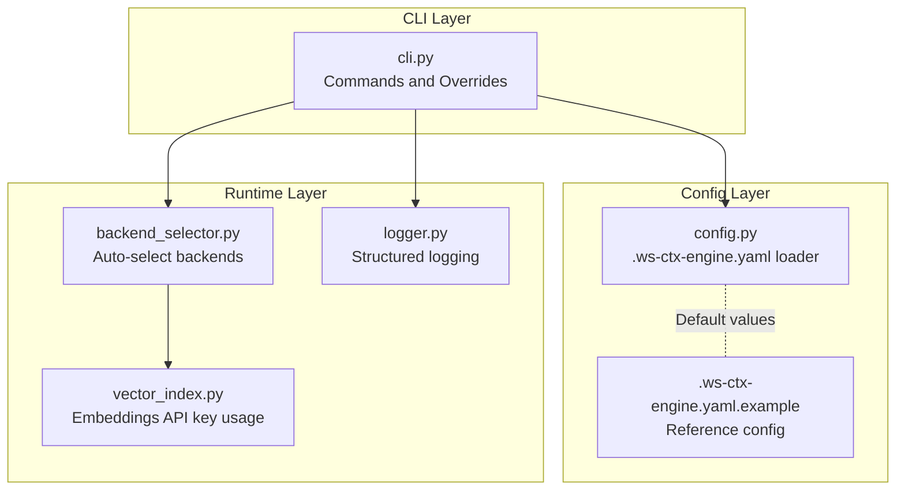
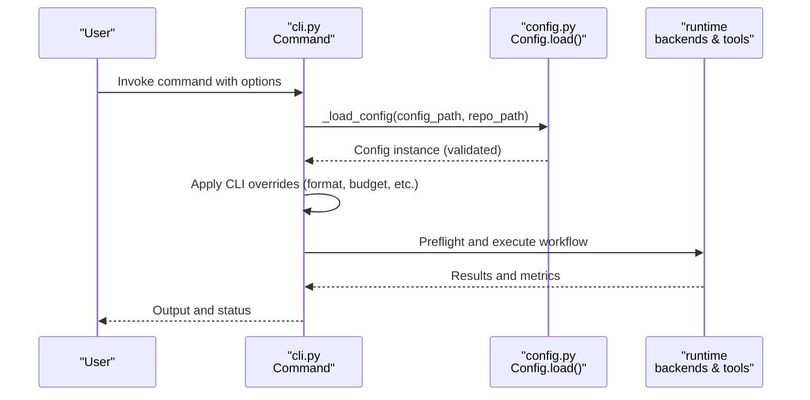
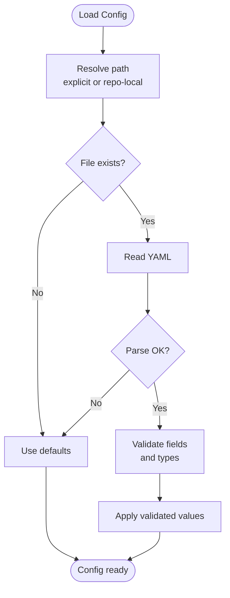
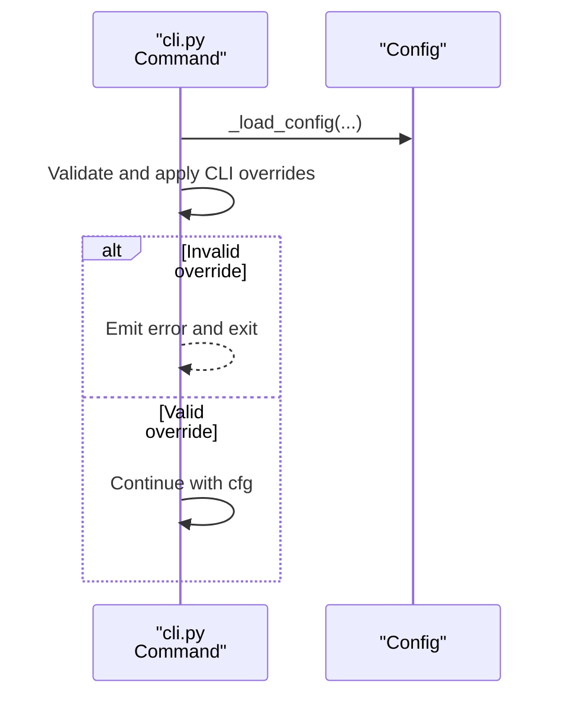
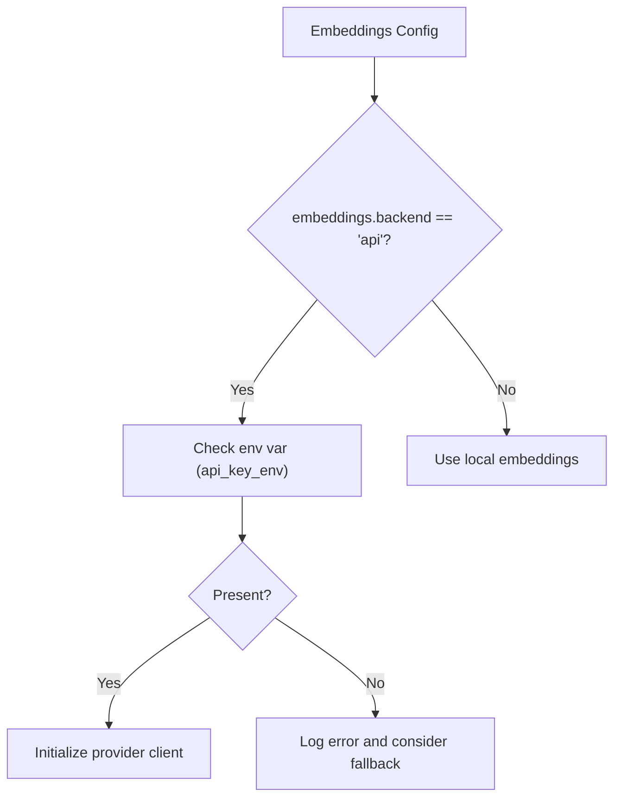
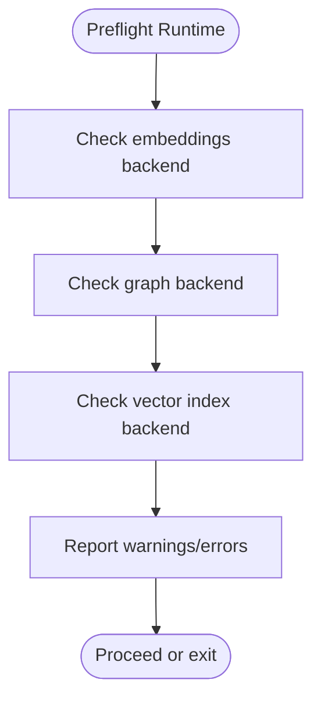
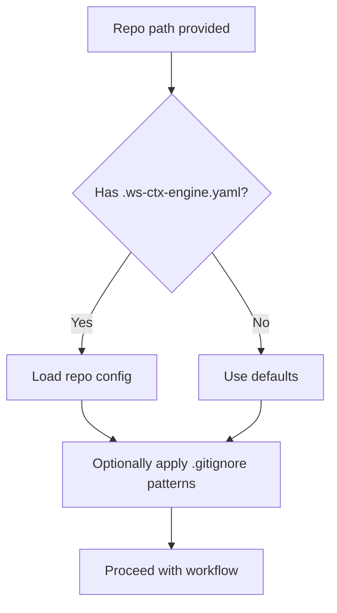
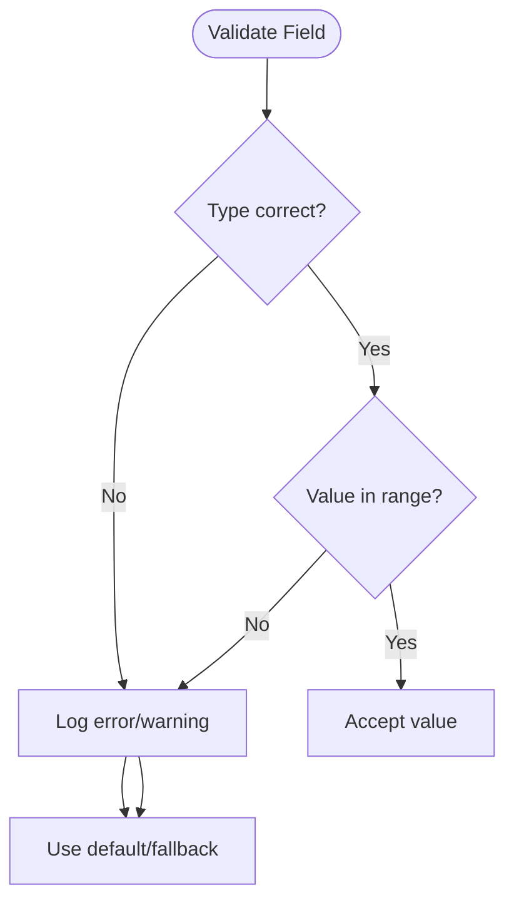
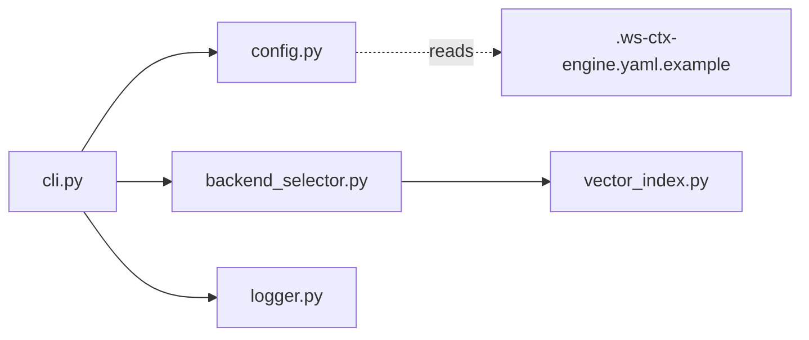

# Configuration Integration

<cite>
**Referenced Files in This Document**
- [cli.py](file://src/ws_ctx_engine/cli/cli.py)
- [config.py](file://src/ws_ctx_engine/config/config.py)
- [logger.py](file://src/ws_ctx_engine/logger/logger.py)
- [backend_selector.py](file://src/ws_ctx_engine/backend_selector/backend_selector.py)
- [vector_index.py](file://src/ws_ctx_engine/vector_index/vector_index.py)
- [.ws-ctx-engine.yaml.example](file://.ws-ctx-engine.yaml.example)
- [test_config_integration.py](file://tests/integration/test_config_integration.py)
- [test_config.py](file://tests/unit/test_config.py)
</cite>

## Table of Contents
1. [Introduction](#introduction)
2. [Project Structure](#project-structure)
3. [Core Components](#core-components)
4. [Architecture Overview](#architecture-overview)
5. [Detailed Component Analysis](#detailed-component-analysis)
6. [Dependency Analysis](#dependency-analysis)
7. [Performance Considerations](#performance-considerations)
8. [Troubleshooting Guide](#troubleshooting-guide)
9. [Conclusion](#conclusion)

## Introduction
This document explains how CLI configuration integrates with the application’s configuration system. It covers how CLI options override configuration file settings, precedence rules, configuration loading mechanisms, validation, error handling, and debugging techniques. It also documents environment variable integration, dynamic runtime resolution, and advanced configuration patterns such as backend auto-selection and graceful fallback.

## Project Structure
The configuration integration spans three layers:
- CLI layer: Defines command-line options and applies overrides to the loaded configuration.
- Configuration layer: Loads and validates .ws-ctx-engine.yaml with robust fallbacks.
- Runtime layer: Applies configuration to backends and components, including environment-dependent behavior.

**Diagram sources**
- [cli.py:1560-1599](file://src/ws_ctx_engine/cli/cli.py#L1560-L1599)
- [config.py:112-215](file://src/ws_ctx_engine/config/config.py#L112-L215)
- [.ws-ctx-engine.yaml.example:1-254](file://.ws-ctx-engine.yaml.example#L1-L254)
- [backend_selector.py:1-191](file://src/ws_ctx_engine/backend_selector/backend_selector.py#L1-L191)
- [vector_index.py:180-198](file://src/ws_ctx_engine/vector_index/vector_index.py#L180-L198)
- [logger.py:13-145](file://src/ws_ctx_engine/logger/logger.py#L13-L145)

**Section sources**
- [cli.py:1560-1599](file://src/ws_ctx_engine/cli/cli.py#L1560-L1599)
- [config.py:112-215](file://src/ws_ctx_engine/config/config.py#L112-L215)
- [.ws-ctx-engine.yaml.example:1-254](file://.ws-ctx-engine.yaml.example#L1-L254)

## Core Components
- Configuration loader: Reads .ws-ctx-engine.yaml, validates fields, and falls back to defaults on errors or absence.
- CLI command overrides: Apply CLI flags after loading configuration, ensuring user intent takes precedence.
- Runtime dependency checks: Resolve backend selection dynamically based on installed packages and environment variables.
- Logging and diagnostics: Structured logs capture configuration decisions and failures.

Key behaviors:
- Configuration precedence: CLI flags override loaded configuration for the affected fields.
- Graceful degradation: Invalid or missing config values revert to safe defaults; missing files use defaults.
- Environment integration: Embeddings API initialization depends on environment variables and availability of the required SDK.

**Section sources**
- [config.py:112-215](file://src/ws_ctx_engine/config/config.py#L112-L215)
- [cli.py:793-822](file://src/ws_ctx_engine/cli/cli.py#L793-L822)
- [cli.py:1035-1064](file://src/ws_ctx_engine/cli/cli.py#L1035-L1064)
- [cli.py:1560-1599](file://src/ws_ctx_engine/cli/cli.py#L1560-L1599)
- [vector_index.py:180-198](file://src/ws_ctx_engine/vector_index/vector_index.py#L180-L198)

## Architecture Overview
The configuration integration flow connects CLI commands, configuration loading, and runtime behavior.

**Diagram sources**
- [cli.py:1560-1599](file://src/ws_ctx_engine/cli/cli.py#L1560-L1599)
- [config.py:112-215](file://src/ws_ctx_engine/config/config.py#L112-L215)
- [backend_selector.py:1-191](file://src/ws_ctx_engine/backend_selector/backend_selector.py#L1-L191)

## Detailed Component Analysis

### Configuration Loading and Validation
- File resolution:
  - Explicit path via --config.
  - Repository-local .ws-ctx-engine.yaml if present.
  - Defaults when no file is found or on parse errors.
- Validation and defaults:
  - Strict validation per field category (format, weights, patterns, backends, embeddings, performance).
  - On invalid values, logs warnings and substitutes safe defaults.
  - Empty or unreadable files degrade gracefully to defaults.
- Example reference: See the annotated example configuration for all supported keys and comments.

**Diagram sources**
- [cli.py:1560-1599](file://src/ws_ctx_engine/cli/cli.py#L1560-L1599)
- [config.py:112-215](file://src/ws_ctx_engine/config/config.py#L112-L215)

**Section sources**
- [config.py:112-215](file://src/ws_ctx_engine/config/config.py#L112-L215)
- [.ws-ctx-engine.yaml.example:1-254](file://.ws-ctx-engine.yaml.example#L1-L254)
- [test_config.py:66-146](file://tests/unit/test_config.py#L66-L146)
- [test_config_integration.py:19-78](file://tests/integration/test_config_integration.py#L19-L78)

### CLI Precedence and Overrides
- Commands that accept --config and --repo also accept per-field overrides:
  - query/pack: --format, --budget, --mode, --session-id, --no-dedup, --compress, --shuffle, --stdout, --copy, --secrets-scan, --verbose, --agent-mode.
  - index/search/mcp/status/vacuum/reindex-domain: --config, --repo, --verbose, --agent-mode (plus command-specific flags).
- Override logic:
  - After loading Config, CLI flags are checked and applied to the cfg object.
  - Invalid overrides produce immediate errors with guidance.
- Example: The query command validates --format against allowed values and enforces positive --budget.

**Diagram sources**
- [cli.py:793-822](file://src/ws_ctx_engine/cli/cli.py#L793-L822)
- [cli.py:1035-1064](file://src/ws_ctx_engine/cli/cli.py#L1035-L1064)

**Section sources**
- [cli.py:793-822](file://src/ws_ctx_engine/cli/cli.py#L793-L822)
- [cli.py:1035-1064](file://src/ws_ctx_engine/cli/cli.py#L1035-L1064)

### Environment Variable Integration
- Embeddings API initialization:
  - Uses environment variables to supply API keys for providers.
  - If the required environment variable is missing, API mode is not used and may trigger fallback or errors depending on configuration.
- Vector index embedding generator:
  - Retrieves API key from environment and initializes the provider client.
  - Logs meaningful errors when initialization fails.

**Diagram sources**
- [cli.py:269-271](file://src/ws_ctx_engine/cli/cli.py#L269-L271)
- [vector_index.py:180-198](file://src/ws_ctx_engine/vector_index/vector_index.py#L180-L198)

**Section sources**
- [cli.py:269-271](file://src/ws_ctx_engine/cli/cli.py#L269-L271)
- [vector_index.py:180-198](file://src/ws_ctx_engine/vector_index/vector_index.py#L180-L198)

### Runtime Backend Resolution and Auto-Selection
- Backends are auto-selected based on installed packages and configuration:
  - Vector index: native-leann, leann, or faiss depending on availability.
  - Graph: igraph or networkx depending on availability.
  - Embeddings: local or api depending on availability and environment variables.
- The CLI preflight validates these dependencies and raises actionable errors if required packages are missing.

**Diagram sources**
- [cli.py:256-326](file://src/ws_ctx_engine/cli/cli.py#L256-L326)
- [backend_selector.py:1-191](file://src/ws_ctx_engine/backend_selector/backend_selector.py#L1-L191)

**Section sources**
- [cli.py:256-326](file://src/ws_ctx_engine/cli/cli.py#L256-L326)
- [backend_selector.py:1-191](file://src/ws_ctx_engine/backend_selector/backend_selector.py#L1-L191)

### Configuration Inheritance and Repository-Specific Behavior
- Repository-local .ws-ctx-engine.yaml is preferred when present.
- The CLI can merge .gitignore patterns into exclude_patterns when requested, augmenting the loaded configuration.
- The example configuration demonstrates typical categories and recommended defaults.

**Diagram sources**
- [cli.py:1583-1599](file://src/ws_ctx_engine/cli/cli.py#L1583-L1599)
- [cli.py:120-135](file://src/ws_ctx_engine/cli/cli.py#L120-L135)
- [.ws-ctx-engine.yaml.example:1-254](file://.ws-ctx-engine.yaml.example#L1-L254)

**Section sources**
- [cli.py:120-135](file://src/ws_ctx_engine/cli/cli.py#L120-L135)
- [cli.py:1583-1599](file://src/ws_ctx_engine/cli/cli.py#L1583-L1599)
- [.ws-ctx-engine.yaml.example:1-254](file://.ws-ctx-engine.yaml.example#L1-L254)

### Validation, Error Handling, and Debugging
- Validation:
  - Strict type checks and value ranges for numeric and categorical fields.
  - Weight normalization warnings when semantic_weight + pagerank_weight deviates from 1.0.
- Error handling:
  - Invalid YAML or missing files degrade to defaults with logs.
  - CLI-level validation prevents invalid overrides and exits with helpful messages.
- Logging:
  - Structured logs capture phases, errors, and fallback decisions.
  - Verbosity can be increased via --verbose to enable debug-level logs.

**Diagram sources**
- [config.py:217-284](file://src/ws_ctx_engine/config/config.py#L217-L284)
- [config.py:286-398](file://src/ws_ctx_engine/config/config.py#L286-L398)
- [logger.py:96-108](file://src/ws_ctx_engine/logger/logger.py#L96-L108)

**Section sources**
- [config.py:217-284](file://src/ws_ctx_engine/config/config.py#L217-L284)
- [config.py:286-398](file://src/ws_ctx_engine/config/config.py#L286-L398)
- [logger.py:96-108](file://src/ws_ctx_engine/logger/logger.py#L96-L108)
- [test_config.py:148-301](file://tests/unit/test_config.py#L148-L301)

## Dependency Analysis
- CLI depends on Config for initial settings and on runtime modules for backend selection and execution.
- Config depends on YAML parsing and validates against internal schemas.
- Runtime modules depend on environment variables and installed packages for backend capabilities.

**Diagram sources**
- [cli.py:1-36](file://src/ws_ctx_engine/cli/cli.py#L1-L36)
- [config.py:1-14](file://src/ws_ctx_engine/config/config.py#L1-L14)
- [backend_selector.py:1-11](file://src/ws_ctx_engine/backend_selector/backend_selector.py#L1-L11)
- [vector_index.py:180-198](file://src/ws_ctx_engine/vector_index/vector_index.py#L180-L198)
- [logger.py:13-20](file://src/ws_ctx_engine/logger/logger.py#L13-L20)
- [.ws-ctx-engine.yaml.example:1-20](file://.ws-ctx-engine.yaml.example#L1-L20)

**Section sources**
- [cli.py:1-36](file://src/ws_ctx_engine/cli/cli.py#L1-L36)
- [config.py:1-14](file://src/ws_ctx_engine/config/config.py#L1-L14)
- [backend_selector.py:1-11](file://src/ws_ctx_engine/backend_selector/backend_selector.py#L1-L11)
- [vector_index.py:180-198](file://src/ws_ctx_engine/vector_index/vector_index.py#L180-L198)
- [logger.py:13-20](file://src/ws_ctx_engine/logger/logger.py#L13-L20)

## Performance Considerations
- Token budget and output format influence downstream processing costs and I/O.
- Incremental indexing and embedding caching reduce rebuild times when enabled in configuration.
- Backend selection impacts memory and compute usage; prefer native backends when available.

[No sources needed since this section provides general guidance]

## Troubleshooting Guide
Common issues and resolutions:
- Invalid configuration values:
  - Symptom: Unexpected defaults or warnings.
  - Action: Fix or remove offending fields; see validation rules.
- Missing configuration file:
  - Symptom: Defaults used.
  - Action: Create .ws-ctx-engine.yaml or specify --config.
- Invalid CLI overrides:
  - Symptom: Immediate error with guidance.
  - Action: Correct the flag value (e.g., valid format, positive budget).
- Missing runtime dependencies:
  - Symptom: Errors indicating missing packages or environment variables.
  - Action: Install recommended extras or set required environment variables.

**Section sources**
- [config.py:130-141](file://src/ws_ctx_engine/config/config.py#L130-L141)
- [cli.py:256-326](file://src/ws_ctx_engine/cli/cli.py#L256-L326)
- [test_config.py:135-146](file://tests/unit/test_config.py#L135-L146)

## Conclusion
The CLI configuration integration ensures predictable precedence (file → defaults) with explicit overrides from command-line flags. Robust validation and graceful degradation maintain reliability, while environment-aware runtime selection enables flexible deployment. Use the example configuration as a baseline and adjust per environment and performance needs.