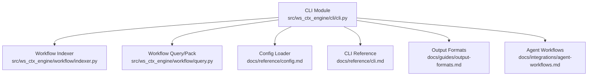
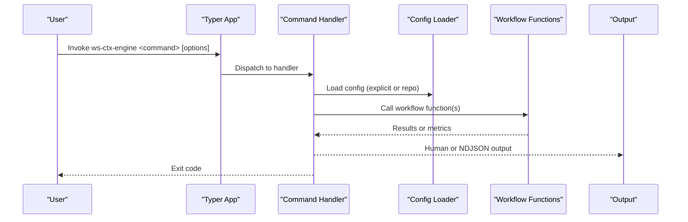
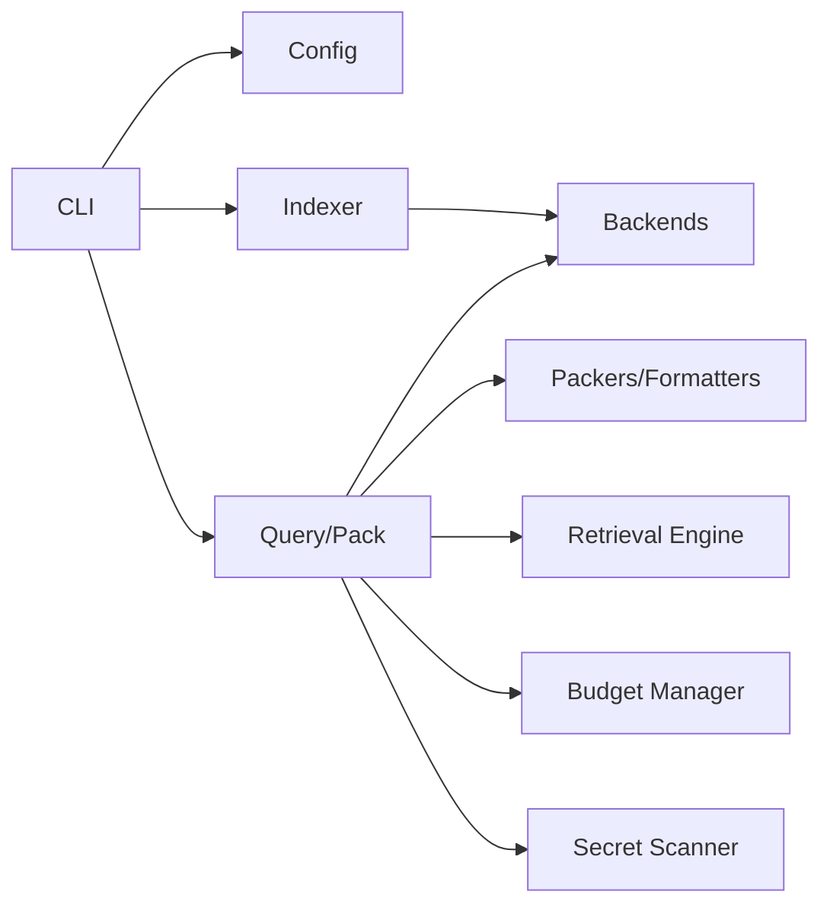

# Core Commands

<cite>
**Referenced Files in This Document**
- [cli.py](file://src/ws_ctx_engine/cli/cli.py)
- [cli.md](file://docs/reference/cli.md)
- [output-formats.md](file://docs/guides/output-formats.md)
- [agent-workflows.md](file://docs/integrations/agent-workflows.md)
- [config.md](file://docs/reference/config.md)
- [indexer.py](file://src/ws_ctx_engine/workflow/indexer.py)
- [query.py](file://src/ws_ctx_engine/workflow/query.py)
- [errors.py](file://src/ws_ctx_engine/errors/errors.py)
- [test_cli.py](file://tests/unit/test_cli.py)
</cite>

## Table of Contents
1. [Introduction](#introduction)
2. [Project Structure](#project-structure)
3. [Core Components](#core-components)
4. [Architecture Overview](#architecture-overview)
5. [Detailed Component Analysis](#detailed-component-analysis)
6. [Dependency Analysis](#dependency-analysis)
7. [Performance Considerations](#performance-considerations)
8. [Troubleshooting Guide](#troubleshooting-guide)
9. [Conclusion](#conclusion)

## Introduction
This document provides comprehensive documentation for the core CLI commands: doctor, index, search, and query. It explains parameters, options, defaults, behaviors, output formats, verbosity, agent mode, command chaining, configuration integration, error handling, exit codes, and troubleshooting for each command.

## Project Structure
The CLI is implemented in a single module with a Typer app and delegates to workflow functions. The workflow module orchestrates indexing, searching, and packing operations.

**Diagram sources**
- [cli.py:1-1656](file://src/ws_ctx_engine/cli/cli.py#L1-L1656)
- [indexer.py:1-493](file://src/ws_ctx_engine/workflow/indexer.py#L1-L493)
- [query.py:1-617](file://src/ws_ctx_engine/workflow/query.py#L1-L617)
- [config.md:1-453](file://docs/reference/config.md#L1-L453)
- [cli.md:1-602](file://docs/reference/cli.md#L1-L602)
- [output-formats.md:1-131](file://docs/guides/output-formats.md#L1-L131)
- [agent-workflows.md:1-103](file://docs/integrations/agent-workflows.md#L1-L103)

**Section sources**
- [cli.py:1-1656](file://src/ws_ctx_engine/cli/cli.py#L1-L1656)
- [cli.md:1-602](file://docs/reference/cli.md#L1-L602)

## Core Components
- CLI app with Typer and Rich for output formatting.
- Global options: --version, --agent-mode, --quiet.
- Commands: doctor, index, search, query, pack, status, vacuum, reindex-domain, init-config, mcp, session.
- Commands delegate to workflow functions for indexing, searching, and packing.

**Section sources**
- [cli.py:27-404](file://src/ws_ctx_engine/cli/cli.py#L27-L404)
- [cli.md:16-47](file://docs/reference/cli.md#L16-L47)

## Architecture Overview
High-level flow for each command:

**Diagram sources**
- [cli.py:329-931](file://src/ws_ctx_engine/cli/cli.py#L329-L931)
- [indexer.py:72-371](file://src/ws_ctx_engine/workflow/indexer.py#L72-L371)
- [query.py:158-617](file://src/ws_ctx_engine/workflow/query.py#L158-L617)

## Detailed Component Analysis

### doctor
Purpose: Check optional dependencies and recommend installation tiers.

Parameters and options:
- None (no arguments or flags).

Behavior:
- Reports presence/absence of recommended packages.
- Exits with code 0 if all recommended packages are present; otherwise exits with code 1.

Common usage:
- Run to diagnose missing dependencies before indexing or querying.

Exit codes:
- 0: All recommended dependencies present.
- 1: Some recommended dependencies missing.

Practical example:
- ws-ctx-engine doctor

**Section sources**
- [cli.py:329-364](file://src/ws_ctx_engine/cli/cli.py#L329-L364)

### index
Purpose: Build and save indexes for a repository.

Parameters and options:
- Argument: repo_path (path to repository root).
- Options:
  - --config/-c: Path to custom configuration file.
  - --verbose/-v: Enable verbose logging.
  - --incremental: Only re-index files changed since last build.

Behavior:
- Validates repo path existence and directory type.
- Loads configuration (explicit or from repo).
- Runs dependency preflight checks.
- Builds vector index, graph, and domain map.
- Saves indexes to .ws-ctx-engine/.
- Supports incremental mode using file hashes and embedding cache.

Common workflows:
- Initial indexing: ws-ctx-engine index /path/to/repo
- Incremental: ws-ctx-engine index /path/to/repo --incremental
- With custom config: ws-ctx-engine index /path/to/repo -c custom.yaml

Exit codes:
- 0: Success.
- 1: Failure (e.g., invalid path, runtime error).

Practical example:
- ws-ctx-engine index .

**Section sources**
- [cli.py:406-501](file://src/ws_ctx_engine/cli/cli.py#L406-L501)
- [indexer.py:72-371](file://src/ws_ctx_engine/workflow/indexer.py#L72-L371)

### search
Purpose: Search the indexed codebase and return ranked file paths.

Parameters and options:
- Argument: query (natural language query).
- Options:
  - --repo/-r: Repository root path (default: current directory).
  - --limit/-l: Maximum results (1-50, default: 10).
  - --domain-filter: Filter results by domain.
  - --config/-c: Custom configuration file.
  - --verbose/-v: Enable verbose logging.
  - --agent-mode: Emit NDJSON output.

Behavior:
- Validates repo path.
- Loads configuration.
- Runs dependency preflight checks.
- Calls search_codebase to retrieve ranked files.
- Emits NDJSON metadata and result rows in agent mode.

Common workflows:
- Basic search: ws-ctx-engine search "authentication logic"
- With limit and repo: ws-ctx-engine search "database queries" --repo /path/to/repo --limit 20
- Agent mode: ws-ctx-engine search "error handling" --agent-mode

Exit codes:
- 0: Success.
- 1: Failure (e.g., invalid path, runtime error).

Practical example:
- ws-ctx-engine search "user authentication flow"

**Section sources**
- [cli.py:504-644](file://src/ws_ctx_engine/cli/cli.py#L504-L644)
- [query.py:158-228](file://src/ws_ctx_engine/workflow/query.py#L158-L228)

### query
Purpose: Search indexes and generate output in configured format.

Parameters and options:
- Argument: query (natural language query).
- Options:
  - --repo/-r: Repository root path (default: current directory).
  - --format/-f: Output format: xml, zip, json, yaml, md, toon.
  - --budget/-b: Token budget for context window.
  - --config/-c: Custom configuration file.
  - --verbose/-v: Enable verbose logging.
  - --secrets-scan: Enable secret scanning and redaction.
  - --agent-mode: Emit NDJSON output.
  - --stdout: Write output to stdout.
  - --copy: Copy output to clipboard.
  - --compress: Apply smart compression.
  - --shuffle/--no-shuffle: Reorder files for model recall (default: on).
  - --mode: Agent phase mode: discovery, edit, test.
  - --session-id: Session identifier for semantic deduplication.
  - --no-dedup: Disable session-level semantic deduplication.

Behavior:
- Validates repo path.
- Loads configuration and applies CLI overrides (--format, --budget).
- Runs dependency preflight checks.
- Executes query_and_pack to retrieve, select, and pack files.
- Supports stdout output and clipboard copy.
- Emits NDJSON status on success.

Common workflows:
- Basic query: ws-ctx-engine query "user authentication flow"
- With format and budget: ws-ctx-engine query "API endpoints" --format xml --budget 50000
- With compression and clipboard: ws-ctx-engine query "error handling" --compress --copy
- Agent mode with session: ws-ctx-engine query "database schema" --agent-mode --session-id agent-123

Exit codes:
- 0: Success.
- 1: Failure (e.g., invalid path, runtime error).

Practical example:
- ws-ctx-engine query "fix the auth bug" --format xml --compress --shuffle

**Section sources**
- [cli.py:698-931](file://src/ws_ctx_engine/cli/cli.py#L698-L931)
- [query.py:230-617](file://src/ws_ctx_engine/workflow/query.py#L230-L617)
- [output-formats.md:1-131](file://docs/guides/output-formats.md#L1-L131)
- [agent-workflows.md:1-103](file://docs/integrations/agent-workflows.md#L1-L103)

## Dependency Analysis
- CLI depends on:
  - Config loader for configuration resolution.
  - Workflow functions for indexing/searching/packing.
  - Rich for human-friendly output.
  - Typer for CLI parsing.
- Workflow functions depend on:
  - Backend selector, vector index, graph, domain map, budget manager, packers/formatters, retrieval engine, secret scanner.

**Diagram sources**
- [cli.py:22-25](file://src/ws_ctx_engine/cli/cli.py#L22-L25)
- [indexer.py:14-22](file://src/ws_ctx_engine/workflow/indexer.py#L14-L22)
- [query.py:13-22](file://src/ws_ctx_engine/workflow/query.py#L13-L22)

**Section sources**
- [cli.py:22-25](file://src/ws_ctx_engine/cli/cli.py#L22-L25)
- [indexer.py:14-22](file://src/ws_ctx_engine/workflow/indexer.py#L14-L22)
- [query.py:13-22](file://src/ws_ctx_engine/workflow/query.py#L13-L22)

## Performance Considerations
- Incremental indexing reduces rebuild time by only processing changed files and leveraging embedding cache.
- Shuffle improves model recall for XML output.
- Compression reduces token usage by replacing lower-ranked file content with signatures.
- Deduplication avoids redundant content across agent calls within a session.
- Token budget controls total output size to fit model context windows.

[No sources needed since this section provides general guidance]

## Troubleshooting Guide
Common issues and resolutions:
- Missing indexes: Run index first; the CLI suggests running ws-ctx-engine index.
- Invalid repository path: Ensure the path exists and is a directory.
- Invalid format or budget flags: Use supported values and positive integers.
- Dependency errors: Use ws-ctx-engine doctor to diagnose missing packages; install recommended extras.
- Agent mode output: NDJSON emitted to stdout; human logs to stderr.

Exit codes:
- 0: Success.
- 1: Failure (various validation/runtime errors).

Examples from tests:
- Index failure with nonexistent path.
- Query failure without indexes.
- Invalid format or budget flags rejected.

**Section sources**
- [cli.py:446-501](file://src/ws_ctx_engine/cli/cli.py#L446-L501)
- [cli.py:632-644](file://src/ws_ctx_engine/cli/cli.py#L632-L644)
- [cli.py:920-931](file://src/ws_ctx_engine/cli/cli.py#L920-L931)
- [test_cli.py:111-139](file://tests/unit/test_cli.py#L111-L139)
- [test_cli.py:269-291](file://tests/unit/test_cli.py#L269-L291)
- [test_cli.py:383-413](file://tests/unit/test_cli.py#L383-L413)

## Conclusion
The core CLI commands provide a robust, configurable pipeline for repository indexing, semantic search, and context packing. They integrate tightly with configuration files, support agent-friendly NDJSON output, and offer advanced features like incremental indexing, compression, deduplication, and phase-aware ranking. Use doctor to diagnose dependencies, index to build indexes, search to discover files, and query to generate LLM-ready outputs.