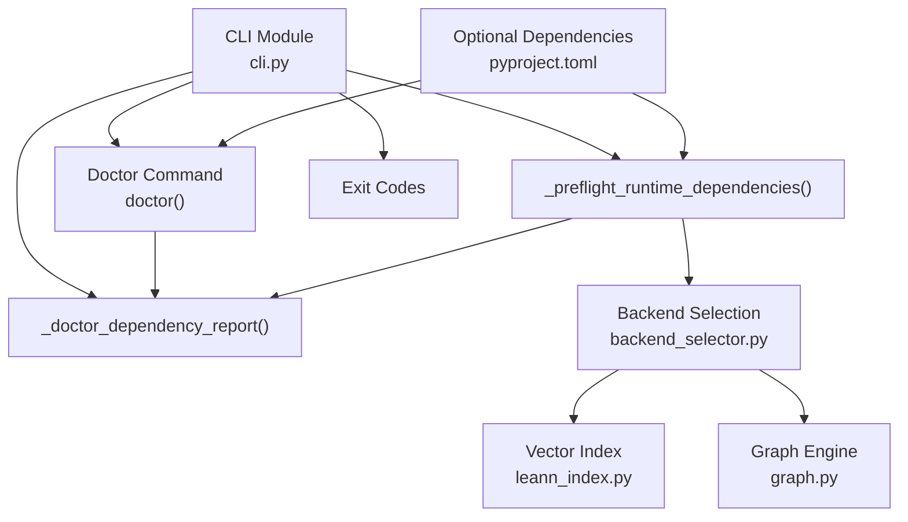
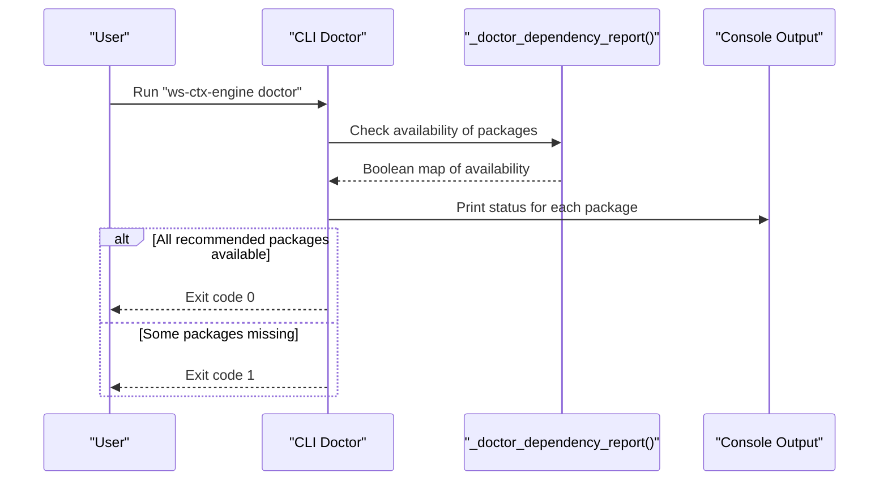
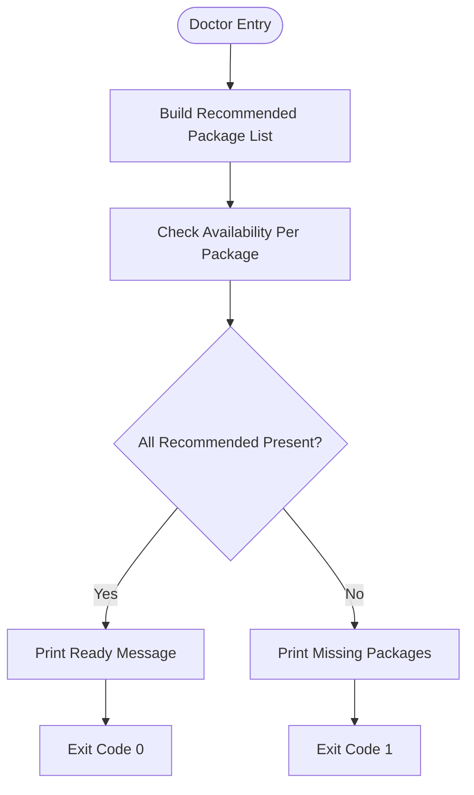
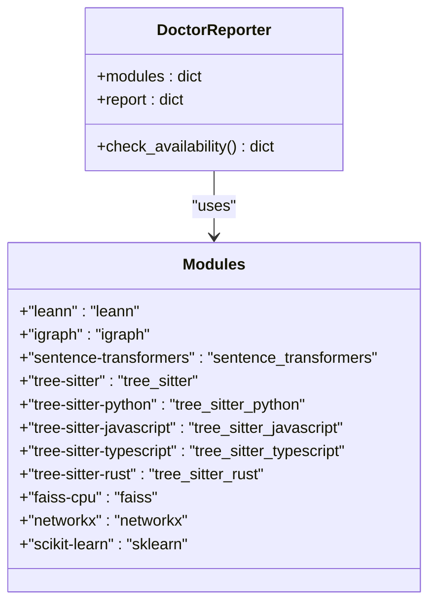
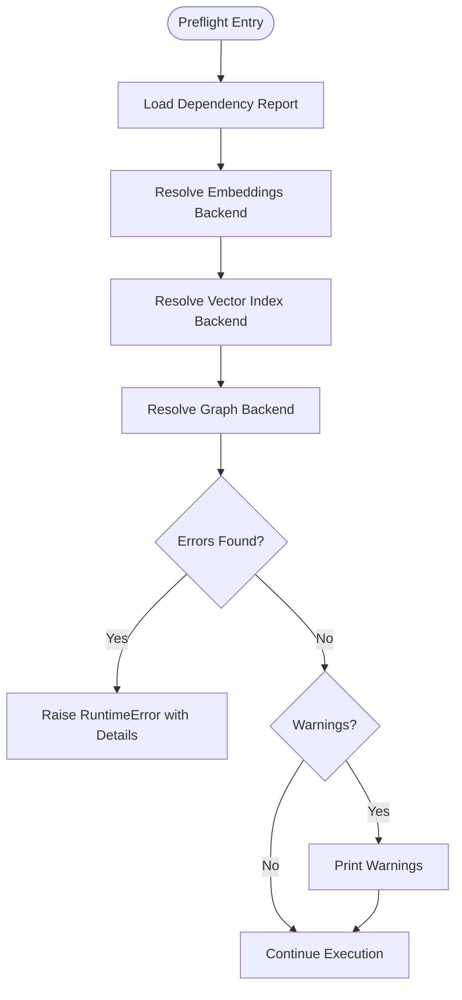
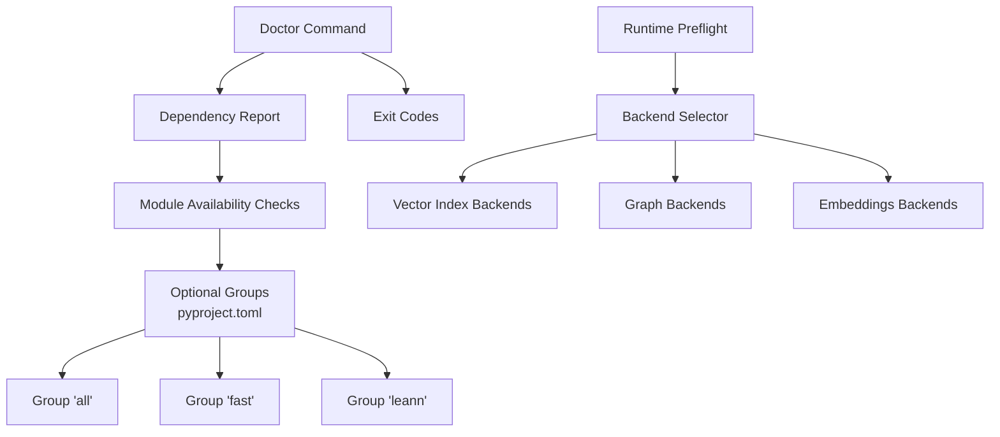

# Doctor Command

<cite>
**Referenced Files in This Document**
- [cli.py](file://src/ws_ctx_engine/cli/cli.py)
- [pyproject.toml](file://pyproject.toml)
- [leann_index.py](file://src/ws_ctx_engine/vector_index/leann_index.py)
- [graph.py](file://src/ws_ctx_engine/graph/graph.py)
- [backend_selector.py](file://src/ws_ctx_engine/backend_selector/backend_selector.py)
- [commands.sh](file://src/ws_ctx_engine/scripts/lib/commands.sh)
- [install.sh](file://src/ws_ctx_engine/scripts/lib/install.sh)
</cite>

## Table of Contents
1. [Introduction](#introduction)
2. [Project Structure](#project-structure)
3. [Core Components](#core-components)
4. [Architecture Overview](#architecture-overview)
5. [Detailed Component Analysis](#detailed-component-analysis)
6. [Dependency Analysis](#dependency-analysis)
7. [Performance Considerations](#performance-considerations)
8. [Troubleshooting Guide](#troubleshooting-guide)
9. [Conclusion](#conclusion)

## Introduction
The doctor command provides a quick health check of optional dependencies required for advanced features in the ws-ctx-engine CLI. It reports which packages are available and suggests a complete installation profile when features are missing. This document explains the dependency checks, the recommendation logic, exit codes, and how doctor integrates with the broader CLI ecosystem.

## Project Structure
The doctor command is implemented in the CLI module and leverages optional dependency groups defined in the project configuration. The relevant components include:
- CLI doctor command and dependency reporting helpers
- Optional dependency groups in pyproject.toml
- Vector index and graph backends that require specific packages
- Backend selector that orchestrates fallback logic

**Diagram sources**
- [cli.py:239-363](file://src/ws_ctx_engine/cli/cli.py#L239-L363)
- [backend_selector.py:13-191](file://src/ws_ctx_engine/backend_selector/backend_selector.py#L13-L191)
- [leann_index.py:20-83](file://src/ws_ctx_engine/vector_index/leann_index.py#L20-L83)
- [graph.py:97-122](file://src/ws_ctx_engine/graph/graph.py#L97-L122)
- [pyproject.toml:67-110](file://pyproject.toml#L67-L110)

**Section sources**
- [cli.py:239-363](file://src/ws_ctx_engine/cli/cli.py#L239-L363)
- [pyproject.toml:67-110](file://pyproject.toml#L67-L110)

## Core Components
- Doctor command: Prints availability status for a curated set of optional packages and exits with appropriate codes.
- Dependency reporter: Checks module availability for a predefined list of packages.
- Runtime preflight: Validates configuration against available packages and resolves backends automatically.

Key responsibilities:
- Report missing packages for full-feature capability
- Suggest installation commands for complete feature set
- Exit with code 0 when all recommended packages are present, otherwise exit with code 1
- Integrate with CLI commands to validate runtime dependencies before execution

**Section sources**
- [cli.py:239-363](file://src/ws_ctx_engine/cli/cli.py#L239-L363)
- [cli.py:256-326](file://src/ws_ctx_engine/cli/cli.py#L256-L326)

## Architecture Overview
The doctor command operates independently but shares the same dependency-checking logic used by runtime preflight. The flow below shows how doctor determines readiness and how preflight enforces constraints.

**Diagram sources**
- [cli.py:329-363](file://src/ws_ctx_engine/cli/cli.py#L329-L363)
- [cli.py:239-253](file://src/ws_ctx_engine/cli/cli.py#L239-L253)

**Section sources**
- [cli.py:329-363](file://src/ws_ctx_engine/cli/cli.py#L329-L363)
- [cli.py:239-253](file://src/ws_ctx_engine/cli/cli.py#L239-L253)

## Detailed Component Analysis

### Doctor Command Implementation
The doctor command:
- Builds a curated list of recommended packages
- Reports availability for each package
- Determines if all recommended packages are present
- Prints a summary and exits with code 0 if ready, otherwise prints missing packages and exits with code 1

**Diagram sources**
- [cli.py:329-363](file://src/ws_ctx_engine/cli/cli.py#L329-L363)
- [cli.py:239-253](file://src/ws_ctx_engine/cli/cli.py#L239-L253)

**Section sources**
- [cli.py:329-363](file://src/ws_ctx_engine/cli/cli.py#L329-L363)

### Dependency Reporting Logic
The reporter checks a fixed set of modules and returns a boolean map indicating availability. The list includes:
- leann
- igraph
- sentence-transformers
- tree-sitter and language-specific grammars
- faiss-cpu
- networkx
- scikit-learn

**Diagram sources**
- [cli.py:239-253](file://src/ws_ctx_engine/cli/cli.py#L239-L253)

**Section sources**
- [cli.py:239-253](file://src/ws_ctx_engine/cli/cli.py#L239-L253)

### Runtime Preflight and Recommendation Logic
While doctor focuses on reporting, the runtime preflight validates configuration against available packages and resolves backends automatically. It supports:
- Embeddings backends: local (sentence-transformers), API (openai), auto resolution
- Vector index backends: native-leann, leann, faiss, auto resolution
- Graph backends: igraph, networkx, auto resolution

**Diagram sources**
- [cli.py:256-326](file://src/ws_ctx_engine/cli/cli.py#L256-L326)

**Section sources**
- [cli.py:256-326](file://src/ws_ctx_engine/cli/cli.py#L256-L326)

### Dependency Matrix and Feature Requirements
The following table summarizes which features require specific packages:

- Local embeddings (sentence-transformers)
  - Required for embeddings=local
  - Also requires torch for sentence-transformers

- API embeddings (openai)
  - Required for embeddings=api
  - Requires OPENAI_API_KEY or configured env var

- Native LEANN vector index (leann)
  - Required for vector_index=native-leann
  - Provides 97% storage savings

- FAISS vector index (faiss-cpu)
  - Required for vector_index=faiss
  - Fallback when leann is unavailable

- igraph graph engine (python-igraph)
  - Required for graph=igraph
  - Fast C++ backend for PageRank

- NetworkX graph engine (networkx)
  - Required for graph=networkx
  - Pure Python fallback

- Tree-sitter AST parsing
  - Required for language-specific chunking
  - tree-sitter + language grammars

- TF-IDF embeddings (scikit-learn)
  - Used as fallback when sentence-transformers is unavailable

**Section sources**
- [cli.py:256-326](file://src/ws_ctx_engine/cli/cli.py#L256-L326)
- [pyproject.toml:75-89](file://pyproject.toml#L75-L89)
- [leann_index.py:67-82](file://src/ws_ctx_engine/vector_index/leann_index.py#L67-L82)
- [graph.py:97-122](file://src/ws_ctx_engine/graph/graph.py#L97-L122)

### Setup Profiles and Installation Commands
The project defines optional dependency groups that map to setup profiles:
- fast: faiss-cpu + networkx + scikit-learn
- all/full: Includes primary backends (leann, igraph, sentence-transformers, tree-sitter family)
- leann: Minimal LEANN-only profile

Installation commands:
- Complete feature set: pip install "ws-ctx-engine[all]"
- Fast fallbacks only: pip install "ws-ctx-engine[fast]"
- LEANN only: pip install "ws-ctx-engine[leann]"

The doctor command also prints a recommended install line when features are missing.

**Section sources**
- [pyproject.toml:67-110](file://pyproject.toml#L67-L110)
- [cli.py:361-362](file://src/ws_ctx_engine/cli/cli.py#L361-L362)

### Exit Codes and Integration
- Doctor command:
  - Exit code 0: All recommended packages present
  - Exit code 1: Some recommended packages missing

- Runtime commands (index/search/query/pack) use preflight:
  - Exit code 0: Successful completion
  - Exit code 1: Errors encountered (including dependency validation failures)

The doctor command integrates with the CLI ecosystem by sharing the same dependency-checking infrastructure used by runtime commands.

**Section sources**
- [cli.py:356-363](file://src/ws_ctx_engine/cli/cli.py#L356-L363)
- [cli.py:466-466](file://src/ws_ctx_engine/cli/cli.py#L466-L466)
- [cli.py:574-574](file://src/ws_ctx_engine/cli/cli.py#L574-L574)
- [cli.py:849-849](file://src/ws_ctx_engine/cli/cli.py#L849-L849)
- [cli.py:1091-1091](file://src/ws_ctx_engine/cli/cli.py#L1091-L1091)

## Dependency Analysis
The doctor command relies on a curated set of packages for full feature coverage. The backend selector coordinates fallback chains across vector index, graph, and embeddings backends. The pyproject.toml optional dependency groups define the installation profiles that satisfy these requirements.

**Diagram sources**
- [cli.py:239-363](file://src/ws_ctx_engine/cli/cli.py#L239-L363)
- [pyproject.toml:67-110](file://pyproject.toml#L67-L110)
- [backend_selector.py:13-191](file://src/ws_ctx_engine/backend_selector/backend_selector.py#L13-L191)

**Section sources**
- [cli.py:239-363](file://src/ws_ctx_engine/cli/cli.py#L239-L363)
- [pyproject.toml:67-110](file://pyproject.toml#L67-L110)
- [backend_selector.py:13-191](file://src/ws_ctx_engine/backend_selector/backend_selector.py#L13-L191)

## Performance Considerations
- Doctor performs lightweight module availability checks using importlib.util.find_spec
- Runtime preflight adds minimal overhead by reusing the same report
- Backend selection avoids expensive operations until actual indexing/search occurs

## Troubleshooting Guide
Common scenarios and resolutions:
- Missing sentence-transformers
  - Symptom: Embeddings backend cannot be resolved to local
  - Resolution: pip install "ws-ctx-engine[all]" or install sentence-transformers and torch

- Missing python-igraph
  - Symptom: Graph backend cannot use igraph
  - Resolution: pip install python-igraph or rely on networkx fallback

- Missing leann
  - Symptom: Native LEANN backend unavailable
  - Resolution: pip install leann or rely on FAISS fallback

- Missing faiss-cpu
  - Symptom: FAISS backend unavailable
  - Resolution: pip install faiss-cpu

- Missing tree-sitter grammars
  - Symptom: Language-specific chunking not available
  - Resolution: pip install "ws-ctx-engine[all]" or install specific tree-sitter language packages

- Missing networkx
  - Symptom: Graph fallback not available
  - Resolution: pip install networkx

- Missing scikit-learn
  - Symptom: TF-IDF fallback not available
  - Resolution: pip install scikit-learn

Integration with CLI:
- The doctor command is invoked directly via ws-ctx-engine doctor
- Scripts in the project reference CLI commands and can surface doctor output during initialization flows

**Section sources**
- [cli.py:329-363](file://src/ws_ctx_engine/cli/cli.py#L329-L363)
- [install.sh:24-50](file://src/ws_ctx_engine/scripts/lib/install.sh#L24-L50)
- [commands.sh:8-36](file://src/ws_ctx_engine/scripts/lib/commands.sh#L8-L36)

## Conclusion
The doctor command provides a concise way to assess optional dependency readiness for advanced features. By checking a curated set of packages and suggesting installation commands, it helps users configure their environment appropriately. Combined with runtime preflight logic, it ensures commands operate with the best available backends while gracefully degrading when packages are missing.