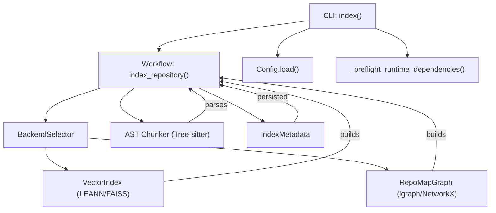
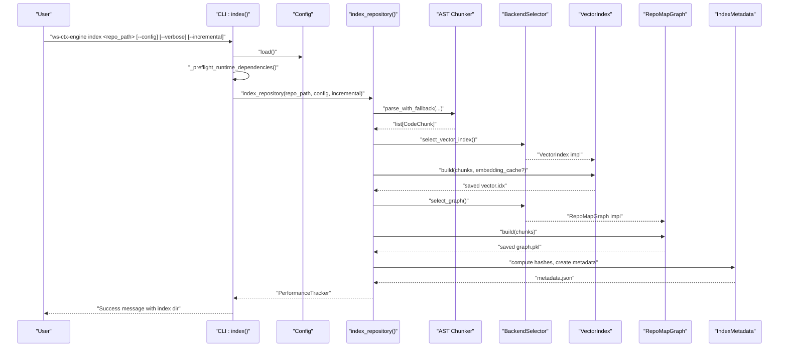
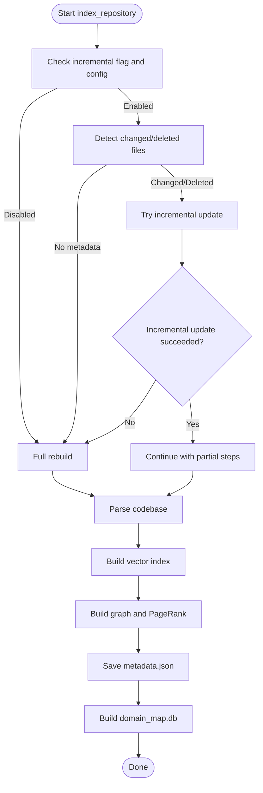
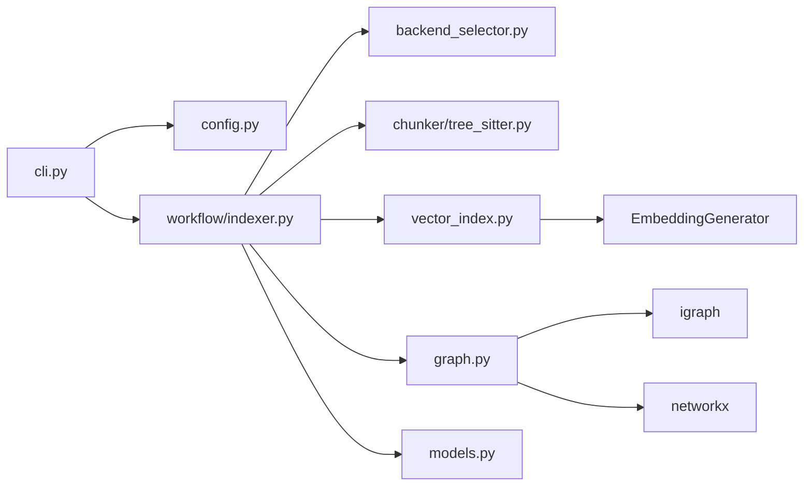

# Index Command

<cite>
**Referenced Files in This Document**
- [cli.py](file://src/ws_ctx_engine/cli/cli.py)
- [indexer.py](file://src/ws_ctx_engine/workflow/indexer.py)
- [config.py](file://src/ws_ctx_engine/config/config.py)
- [backend_selector.py](file://src/ws_ctx_engine/backend_selector/backend_selector.py)
- [vector_index.py](file://src/ws_ctx_engine/vector_index/vector_index.py)
- [graph.py](file://src/ws_ctx_engine/graph/graph.py)
- [tree_sitter.py](file://src/ws_ctx_engine/chunker/tree_sitter.py)
- [base.py](file://src/ws_ctx_engine/chunker/base.py)
- [models.py](file://src/ws_ctx_engine/models/models.py)
- [README.md](file://README.md)
- [.ws-ctx-engine.yaml.example](file://.ws-ctx-engine.yaml.example)
</cite>

## Table of Contents
1. [Introduction](#introduction)
2. [Project Structure](#project-structure)
3. [Core Components](#core-components)
4. [Architecture Overview](#architecture-overview)
5. [Detailed Component Analysis](#detailed-component-analysis)
6. [Dependency Analysis](#dependency-analysis)
7. [Performance Considerations](#performance-considerations)
8. [Troubleshooting Guide](#troubleshooting-guide)
9. [Conclusion](#conclusion)
10. [Appendices](#appendices)

## Introduction
The index command builds and saves persistent indexes for a repository to accelerate subsequent semantic search and context packaging. It discovers files, parses them into structured chunks, builds a vector index for semantic search, constructs a dependency graph for structural ranking, and persists artifacts to a dedicated directory. The command supports:
- repo_path argument: path to the repository root
- --config/-c: custom configuration file path
- --verbose/-v: enable detailed logging with timing
- --incremental: selectively re-index only changed/deleted files

## Project Structure
The index command integrates several subsystems:
- CLI layer: defines the index command, validates arguments, sets logging, and orchestrates runtime dependency checks
- Workflow layer: executes the indexing pipeline and manages incremental mode
- Configuration: loads and validates .ws-ctx-engine.yaml
- Backend selection: chooses vector index, graph, and embeddings backends with fallbacks
- Indexing backends: LEANN/FAISS vector index and igraph/NetworkX graph
- AST chunking: Tree-sitter-based parsing with language-specific resolvers
- Models: shared data structures for chunks and index metadata

**Diagram sources**
- [cli.py:406-501](file://src/ws_ctx_engine/cli/cli.py#L406-L501)
- [indexer.py:72-371](file://src/ws_ctx_engine/workflow/indexer.py#L72-L371)
- [config.py:112-215](file://src/ws_ctx_engine/config/config.py#L112-L215)
- [backend_selector.py:13-191](file://src/ws_ctx_engine/backend_selector/backend_selector.py#L13-L191)
- [vector_index.py:21-1120](file://src/ws_ctx_engine/vector_index/vector_index.py#L21-L1120)
- [graph.py:19-667](file://src/ws_ctx_engine/graph/graph.py#L19-L667)
- [tree_sitter.py:15-160](file://src/ws_ctx_engine/chunker/tree_sitter.py#L15-L160)
- [models.py:87-152](file://src/ws_ctx_engine/models/models.py#L87-L152)

**Section sources**
- [cli.py:406-501](file://src/ws_ctx_engine/cli/cli.py#L406-L501)
- [indexer.py:72-371](file://src/ws_ctx_engine/workflow/indexer.py#L72-L371)
- [config.py:112-215](file://src/ws_ctx_engine/config/config.py#L112-L215)

## Core Components
- CLI index command: parses arguments, loads configuration, validates repo path, runs preflight checks, and delegates to the indexing workflow
- Indexing workflow: orchestrates parsing, vector index building, graph construction, metadata saving, and domain keyword map building
- Configuration: loads .ws-ctx-engine.yaml with validation and default fallbacks; controls backends, embeddings, performance, and filtering
- Backend selector: selects vector index, graph, and embeddings backends with graceful fallbacks
- Vector index: LEANN (primary) and FAISS (fallback) with embedding caching and incremental update support
- Graph: igraph (primary) and NetworkX (fallback) with PageRank computation and optional changed-file boosting
- AST chunker: Tree-sitter-based parsing with language-specific resolvers and regex fallbacks
- Models: CodeChunk and IndexMetadata for chunk representation and staleness detection

**Section sources**
- [cli.py:406-501](file://src/ws_ctx_engine/cli/cli.py#L406-L501)
- [indexer.py:72-371](file://src/ws_ctx_engine/workflow/indexer.py#L72-L371)
- [config.py:16-399](file://src/ws_ctx_engine/config/config.py#L16-L399)
- [backend_selector.py:13-191](file://src/ws_ctx_engine/backend_selector/backend_selector.py#L13-L191)
- [vector_index.py:21-1120](file://src/ws_ctx_engine/vector_index/vector_index.py#L21-L1120)
- [graph.py:19-667](file://src/ws_ctx_engine/graph/graph.py#L19-L667)
- [tree_sitter.py:15-160](file://src/ws_ctx_engine/chunker/tree_sitter.py#L15-L160)
- [models.py:10-152](file://src/ws_ctx_engine/models/models.py#L10-L152)

## Architecture Overview
The index command follows a staged pipeline:
1. Argument parsing and configuration loading
2. Runtime dependency preflight
3. Incremental detection (optional)
4. AST parsing into CodeChunks
5. Vector index building (with embedding cache and incremental updates)
6. Graph construction and PageRank computation
7. Metadata persistence for staleness detection
8. Domain keyword map building and persistence

**Diagram sources**
- [cli.py:406-501](file://src/ws_ctx_engine/cli/cli.py#L406-L501)
- [indexer.py:72-371](file://src/ws_ctx_engine/workflow/indexer.py#L72-L371)
- [backend_selector.py:36-110](file://src/ws_ctx_engine/backend_selector/backend_selector.py#L36-L110)
- [vector_index.py:282-504](file://src/ws_ctx_engine/vector_index/vector_index.py#L282-L504)
- [graph.py:572-621](file://src/ws_ctx_engine/graph/graph.py#L572-L621)
- [models.py:87-152](file://src/ws_ctx_engine/models/models.py#L87-L152)

## Detailed Component Analysis

### CLI index command
- Arguments and options:
  - repo_path: positional argument for repository root
  - --config/-c: path to custom .ws-ctx-engine.yaml
  - --verbose/-v: set logger level to DEBUG
  - --incremental: enable selective re-indexing
- Behavior:
  - Validates repo_path existence and directory type
  - Loads configuration via Config.load()
  - Runs _preflight_runtime_dependencies() to resolve backends and check availability
  - Calls index_repository() and prints success with index directory path

**Section sources**
- [cli.py:406-501](file://src/ws_ctx_engine/cli/cli.py#L406-L501)
- [config.py:112-215](file://src/ws_ctx_engine/config/config.py#L112-L215)

### Indexing workflow
- Phases:
  1) AST parsing: parse_with_fallback produces CodeChunk list
  2) Vector index: build with optional embedding cache and incremental update
  3) Graph: build RepoMapGraph and compute PageRank
  4) Metadata: compute file hashes and persist metadata.json
  5) Domain keyword map: build and persist domain_map.db
- Incremental mode:
  - Detects changed/deleted files by comparing stored hashes with current content
  - Attempts incremental update of FAISS index when possible; falls back to full rebuild on failure
  - Honors performance.incremental_index setting to disable incremental behavior even when requested

**Diagram sources**
- [indexer.py:27-69](file://src/ws_ctx_engine/workflow/indexer.py#L27-L69)
- [indexer.py:134-235](file://src/ws_ctx_engine/workflow/indexer.py#L134-L235)
- [indexer.py:72-371](file://src/ws_ctx_engine/workflow/indexer.py#L72-L371)

**Section sources**
- [indexer.py:72-371](file://src/ws_ctx_engine/workflow/indexer.py#L72-L371)

### Configuration and backend selection
- Configuration loading:
  - Reads .ws-ctx-engine.yaml with validation and defaults
  - Supports output format, token budget, include/exclude patterns, backend selection, embeddings, and performance tuning
- Backend selection:
  - Vector index: auto → native-leann → leann → faiss
  - Graph: auto → igraph → networkx
  - Embeddings: auto → local (sentence-transformers) → api (OpenAI)
- Runtime preflight:
  - Validates availability of required packages and environment variables
  - Logs actionable recommendations for missing dependencies

**Section sources**
- [config.py:16-399](file://src/ws_ctx_engine/config/config.py#L16-L399)
- [backend_selector.py:13-191](file://src/ws_ctx_engine/backend_selector/backend_selector.py#L13-L191)
- [cli.py:256-326](file://src/ws_ctx_engine/cli/cli.py#L256-L326)

### Vector index backends
- LEANNIndex (primary):
  - Stores embeddings for files; recomputes on-the-fly for non-stored vectors
  - Saves to vector.idx with pickle
- FAISSIndex (fallback):
  - Uses IndexFlatL2 + IndexIDMap2 for exact search and incremental updates
  - Supports embedding cache to avoid re-embedding unchanged files
  - Saves to vector.idx plus .faiss file and metadata

**Section sources**
- [vector_index.py:282-504](file://src/ws_ctx_engine/vector_index/vector_index.py#L282-L504)
- [vector_index.py:506-800](file://src/ws_ctx_engine/vector_index/vector_index.py#L506-L800)

### Graph backends
- IGraphRepoMap (primary):
  - Builds directed graph from symbol references; computes PageRank using igraph
  - Saves to graph.pkl with pickle
- NetworkXRepoMap (fallback):
  - Builds directed graph and computes PageRank using NetworkX
  - Includes pure Python power iteration fallback when scipy is unavailable

**Section sources**
- [graph.py:97-315](file://src/ws_ctx_engine/graph/graph.py#L97-L315)
- [graph.py:317-570](file://src/ws_ctx_engine/graph/graph.py#L317-L570)

### AST parsing and chunking
- Tree-sitter chunker:
  - Parses supported languages (.py, .js, .ts, .jsx, .tsx, .rs) with language-specific resolvers
  - Extracts symbols defined and referenced, aggregates imports, and produces CodeChunk list
- File inclusion logic:
  - Respects include/exclude patterns and .gitignore when enabled
  - Emits warnings for unsupported extensions

**Section sources**
- [tree_sitter.py:15-160](file://src/ws_ctx_engine/chunker/tree_sitter.py#L15-L160)
- [base.py:47-176](file://src/ws_ctx_engine/chunker/base.py#L47-L176)

### Index artifacts and .ws-ctx-engine directory
- Saved artifacts:
  - vector.idx: vector index file (LEANN or FAISS)
  - graph.pkl: graph with PageRank scores
  - metadata.json: index metadata for staleness detection
  - domain_map.db: domain keyword map database
  - logs/: execution logs
- Staleness detection:
  - IndexMetadata compares stored file hashes with current content to detect changes

**Section sources**
- [README.md:86-91](file://README.md#L86-L91)
- [models.py:87-152](file://src/ws_ctx_engine/models/models.py#L87-L152)
- [indexer.py:404-492](file://src/ws_ctx_engine/workflow/indexer.py#L404-L492)

## Dependency Analysis
- CLI depends on Config, logger, and the indexing workflow
- Workflow depends on BackendSelector, AST chunker, vector index, graph, and models
- BackendSelector coordinates vector index and graph creation with fallbacks
- Vector index depends on EmbeddingGenerator and optional embedding cache
- Graph depends on igraph or networkx availability

**Diagram sources**
- [cli.py:22-26](file://src/ws_ctx_engine/cli/cli.py#L22-L26)
- [indexer.py:14-24](file://src/ws_ctx_engine/workflow/indexer.py#L14-L24)
- [backend_selector.py:7-11](file://src/ws_ctx_engine/backend_selector/backend_selector.py#L7-L11)
- [vector_index.py:96-280](file://src/ws_ctx_engine/vector_index/vector_index.py#L96-L280)
- [graph.py:8-16](file://src/ws_ctx_engine/graph/graph.py#L8-L16)

**Section sources**
- [cli.py:22-26](file://src/ws_ctx_engine/cli/cli.py#L22-L26)
- [indexer.py:14-24](file://src/ws_ctx_engine/workflow/indexer.py#L14-L24)
- [backend_selector.py:7-11](file://src/ws_ctx_engine/backend_selector/backend_selector.py#L7-L11)

## Performance Considerations
- Incremental indexing reduces rebuild time by updating only changed/deleted files and leveraging embedding caches
- Backend selection prioritizes fast backends (igraph, LEANN, FAISS) with graceful fallbacks
- Embedding caching avoids re-computation of unchanged file embeddings across runs
- Rust-accelerated file walking and hashing improve IO-heavy stages

[No sources needed since this section provides general guidance]

## Troubleshooting Guide
Common issues and resolutions:
- Permission errors when writing index artifacts:
  - Ensure write permissions to the repository root so .ws-ctx-engine/ can be created
- Missing dependencies:
  - Use ws-ctx-engine doctor to diagnose missing packages
  - Install recommended extras: pip install "ws-ctx-engine[all]"
- Out-of-memory during local embeddings:
  - Reduce embeddings.batch_size or switch embeddings backend to API
  - Set OPENAI_API_KEY environment variable for API fallback
- Stale index warnings:
  - Indexes are automatically rebuilt when staleness is detected
  - To force rebuild, remove .ws-ctx-engine/ and re-run index
- Unsupported file extensions:
  - Files without AST parsers are indexed as plain text; install Tree-sitter parsers for additional languages

**Section sources**
- [cli.py:256-326](file://src/ws_ctx_engine/cli/cli.py#L256-L326)
- [README.md:386-428](file://README.md#L386-L428)

## Conclusion
The index command provides a robust, configurable pipeline to build semantic and structural indexes for repositories. It supports incremental updates, comprehensive fallback strategies, and persistent artifacts for efficient querying and context packaging. Proper configuration and dependency management ensure reliable operation across diverse environments.

[No sources needed since this section summarizes without analyzing specific files]

## Appendices

### Practical Examples
- First-time indexing:
  - ws-ctx-engine index /path/to/repo
- Incremental updates:
  - ws-ctx-engine index /path/to/repo --incremental
- Custom configuration:
  - ws-ctx-engine index /path/to/repo --config /path/to/.ws-ctx-engine.yaml --verbose

**Section sources**
- [README.md:78-84](file://README.md#L78-L84)
- [cli.py:406-501](file://src/ws_ctx_engine/cli/cli.py#L406-L501)

### Relationship with Configuration and Backends
- Configuration file controls include/exclude patterns, scoring weights, backend selection, embeddings, and performance tuning
- Backend selection resolves vector index, graph, and embeddings backends with fallbacks based on availability
- Runtime preflight enforces requirements and logs actionable guidance

**Section sources**
- [.ws-ctx-engine.yaml.example:103-180](file://.ws-ctx-engine.yaml.example#L103-L180)
- [config.py:112-215](file://src/ws_ctx_engine/config/config.py#L112-L215)
- [backend_selector.py:13-191](file://src/ws_ctx_engine/backend_selector/backend_selector.py#L13-L191)
- [cli.py:256-326](file://src/ws_ctx_engine/cli/cli.py#L256-L326)