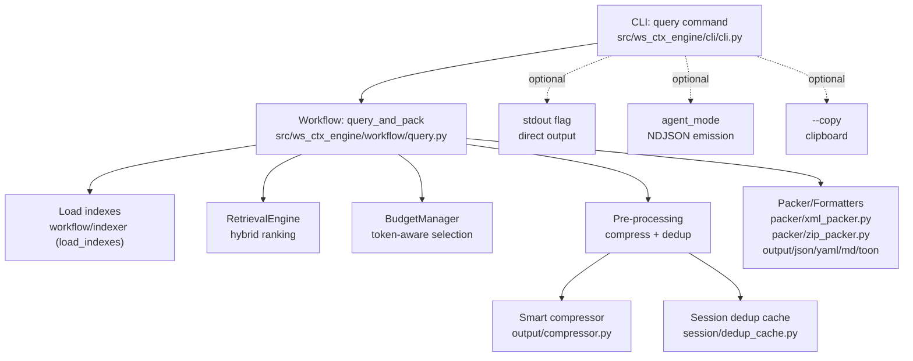
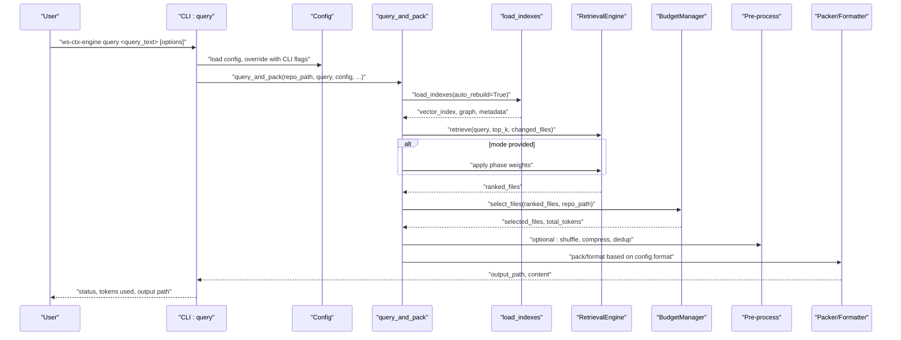
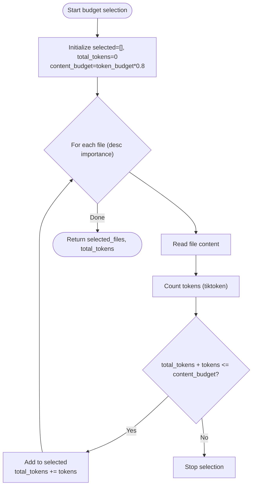
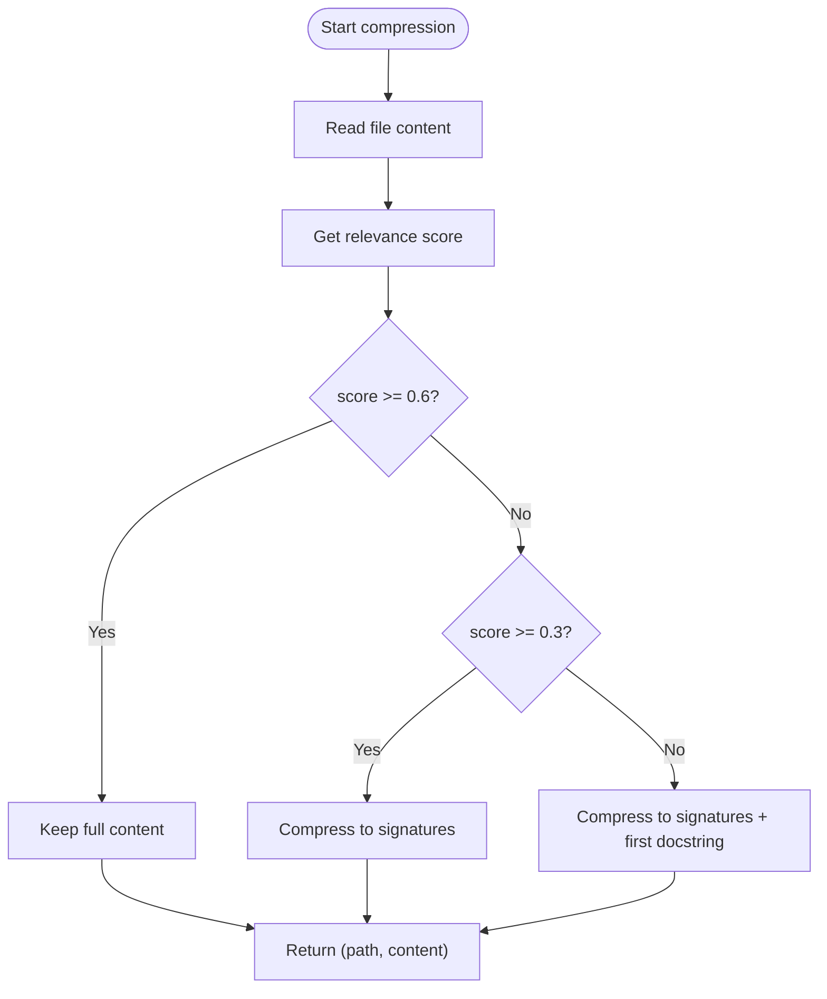
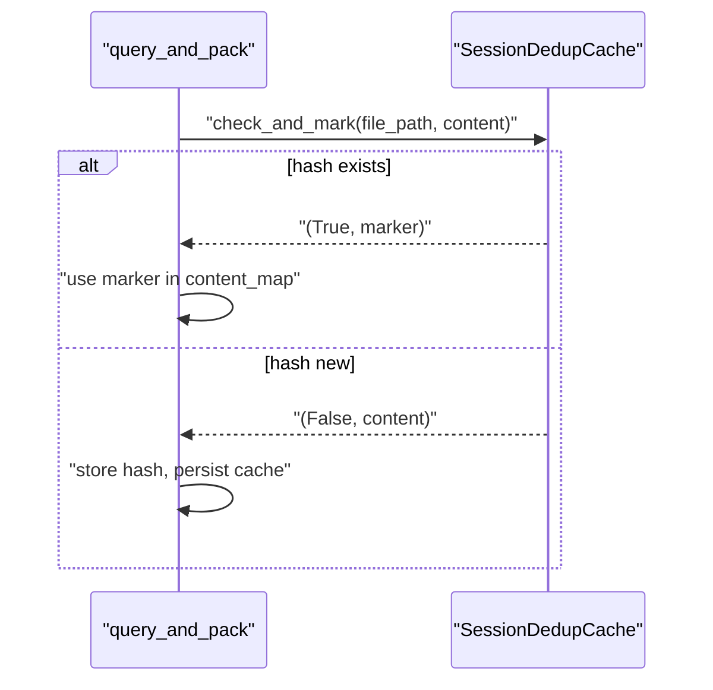
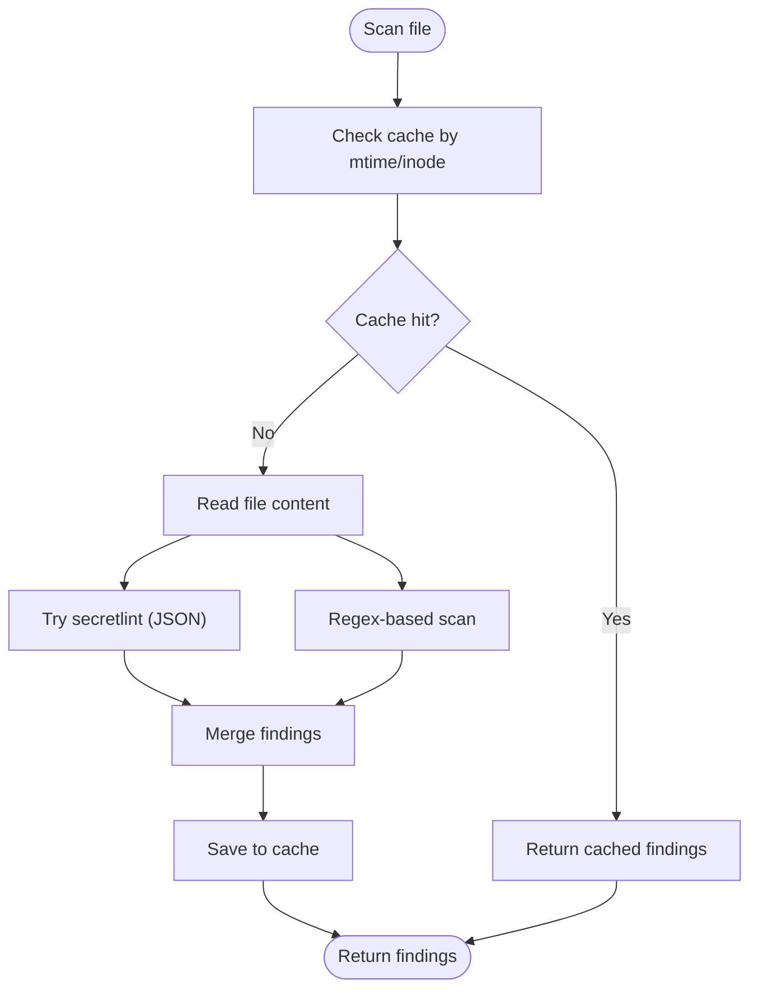
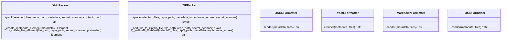
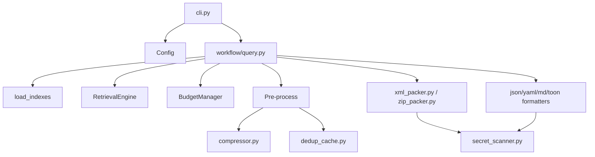

# Query Command

<cite>
**Referenced Files in This Document**
- [cli.py](file://src/ws_ctx_engine/cli/cli.py)
- [query.py](file://src/ws_ctx_engine/workflow/query.py)
- [xml_packer.py](file://src/ws_ctx_engine/packer/xml_packer.py)
- [zip_packer.py](file://src/ws_ctx_engine/packer/zip_packer.py)
- [budget.py](file://src/ws_ctx_engine/budget/budget.py)
- [compressor.py](file://src/ws_ctx_engine/output/compressor.py)
- [dedup_cache.py](file://src/ws_ctx_engine/session/dedup_cache.py)
- [secret_scanner.py](file://src/ws_ctx_engine/secret_scanner.py)
- [json_formatter.py](file://src/ws_ctx_engine/output/json_formatter.py)
- [yaml_formatter.py](file://src/ws_ctx_engine/output/yaml_formatter.py)
- [md_formatter.py](file://src/ws_ctx_engine/output/md_formatter.py)
- [toon_formatter.py](file://src/ws_ctx_engine/output/toon_formatter.py)
</cite>

## Table of Contents
1. [Introduction](#introduction)
2. [Project Structure](#project-structure)
3. [Core Components](#core-components)
4. [Architecture Overview](#architecture-overview)
5. [Detailed Component Analysis](#detailed-component-analysis)
6. [Dependency Analysis](#dependency-analysis)
7. [Performance Considerations](#performance-considerations)
8. [Troubleshooting Guide](#troubleshooting-guide)
9. [Conclusion](#conclusion)
10. [Appendices](#appendices)

## Introduction
The query command searches pre-built indexes for a repository and generates a formatted output pack. It orchestrates index loading, hybrid semantic and graph ranking, token-aware file selection, optional smart compression and session-level deduplication, and finally packages the results into one of several output formats. It also supports agent-friendly NDJSON emission, optional secret scanning, and direct stdout output for integration scenarios.

## Project Structure
The query command is implemented as a Typer CLI command that delegates to a workflow function. The workflow coordinates:
- Index loading and health checks
- Retrieval engine with hybrid ranking
- Budget-aware selection
- Optional compression and session deduplication
- Format-specific packaging or formatting

**Diagram sources**
- [cli.py:698-932](file://src/ws_ctx_engine/cli/cli.py#L698-L932)
- [query.py:230-617](file://src/ws_ctx_engine/workflow/query.py#L230-L617)
- [xml_packer.py:51-138](file://src/ws_ctx_engine/packer/xml_packer.py#L51-L138)
- [zip_packer.py:17-90](file://src/ws_ctx_engine/packer/zip_packer.py#L17-L90)
- [compressor.py:217-266](file://src/ws_ctx_engine/output/compressor.py#L217-L266)
- [dedup_cache.py:35-90](file://src/ws_ctx_engine/session/dedup_cache.py#L35-L90)
- [budget.py:8-105](file://src/ws_ctx_engine/budget/budget.py#L8-L105)

**Section sources**
- [cli.py:698-932](file://src/ws_ctx_engine/cli/cli.py#L698-L932)
- [query.py:230-617](file://src/ws_ctx_engine/workflow/query.py#L230-L617)

## Core Components
- CLI command definition and parameter parsing
- Workflow orchestration (query_and_pack)
- Index loading and retrieval
- Budget manager for token-aware selection
- Smart compression and session deduplication
- Output packers and formatters

Key responsibilities:
- Validate inputs, enforce constraints, and prepare runtime configuration
- Invoke retrieval pipeline and produce ranked candidate lists
- Respect token budgets and compute totals
- Optionally compress content and deduplicate across sessions
- Emit NDJSON in agent mode and support stdout and clipboard modes

**Section sources**
- [cli.py:698-932](file://src/ws_ctx_engine/cli/cli.py#L698-L932)
- [query.py:230-617](file://src/ws_ctx_engine/workflow/query.py#L230-L617)

## Architecture Overview
The query command follows a phased workflow:
1. Load indexes (vector and graph) with auto-rebuild detection
2. Hybrid retrieval (semantic + graph + domain-aware)
3. Phase-aware weighting when agent mode is used
4. Budget selection using greedy knapsack
5. Optional pre-processing: shuffle for XML, smart compression, session dedup
6. Packaging/formatting into XML, ZIP, JSON, YAML, MD, or TOON

**Diagram sources**
- [cli.py:698-932](file://src/ws_ctx_engine/cli/cli.py#L698-L932)
- [query.py:230-617](file://src/ws_ctx_engine/workflow/query.py#L230-L617)
- [budget.py:50-105](file://src/ws_ctx_engine/budget/budget.py#L50-L105)
- [xml_packer.py:85-138](file://src/ws_ctx_engine/packer/xml_packer.py#L85-L138)
- [zip_packer.py:49-90](file://src/ws_ctx_engine/packer/zip_packer.py#L49-L90)
- [compressor.py:217-266](file://src/ws_ctx_engine/output/compressor.py#L217-L266)
- [dedup_cache.py:65-90](file://src/ws_ctx_engine/session/dedup_cache.py#L65-L90)

## Detailed Component Analysis

### CLI Parameter Reference
- query_text (argument): Natural language query for semantic search
- repo_path (--repo/-r): Repository root directory
- format (--format/-f): Output format among xml, zip, json, yaml, md, toon
- budget (--budget/-b): Token budget for context window
- config (--config/-c): Path to custom configuration file
- verbose (--verbose/-v): Enable debug logging
- secrets_scan (--secrets-scan): Enable secret scanning and redaction
- agent_mode (--agent-mode): Emit NDJSON on stdout, logs to stderr
- stdout (--stdout): Write output content to stdout instead of file
- copy (--copy): Copy output to clipboard after packing
- compress (--compress): Apply smart compression
- shuffle/--no-shuffle: Reorder files to combat “Lost in the Middle” (default on)
- mode (--mode): Agent phase mode: discovery, edit, test (adjusts ranking weights)
- session_id (--session-id): Session identifier for semantic deduplication cache
- no_dedup (--no-dedup): Disable session-level semantic deduplication

Behavior highlights:
- Validation ensures format and budget are valid; errors are emitted as NDJSON when agent_mode is enabled
- mode is restricted to predefined values
- stdout triggers direct output emission for supported formats
- copy attempts to copy textual output to the system clipboard

**Section sources**
- [cli.py:698-778](file://src/ws_ctx_engine/cli/cli.py#L698-L778)
- [cli.py:854-860](file://src/ws_ctx_engine/cli/cli.py#L854-L860)
- [cli.py:851-853](file://src/ws_ctx_engine/cli/cli.py#L851-L853)
- [cli.py:902-904](file://src/ws_ctx_engine/cli/cli.py#L902-L904)

### Workflow Orchestration (query_and_pack)
Responsibilities:
- Load indexes with auto-rebuild and health reporting
- Build retrieval engine with semantic, graph, and domain-aware ranking
- Optional phase-aware re-weighting for agent modes
- Select files within token budget using greedy knapsack
- Optional pre-processing: shuffle for XML, smart compression, session dedup
- Pack or format output based on configuration

Key steps:
- Index loading and retrieval
- Budget selection and metrics tracking
- Pre-processing pipeline (shuffle, compress, dedup)
- Format-specific packaging

**Section sources**
- [query.py:230-617](file://src/ws_ctx_engine/workflow/query.py#L230-L617)

### Token Budget Management
- BudgetManager reserves 20% of the budget for metadata/manifest and uses 80% for file content
- Greedy knapsack selection accumulates files in descending order of importance until content budget is exhausted
- Total tokens and selected file count are tracked and logged

**Diagram sources**
- [budget.py:50-105](file://src/ws_ctx_engine/budget/budget.py#L50-L105)

**Section sources**
- [budget.py:8-105](file://src/ws_ctx_engine/budget/budget.py#L8-L105)
- [query.py:387-412](file://src/ws_ctx_engine/workflow/query.py#L387-L412)

### Smart Compression and Content Selection
- Threshold-based compression:
  - High relevance (>= 0.6) → full content
  - Medium relevance (>= 0.3) → signatures only
  - Low relevance (< 0.3) → signatures plus first docstring
- Uses Tree-sitter when available; falls back to regex-based extraction
- Applied before packing to reduce token usage while preserving recall

**Diagram sources**
- [compressor.py:217-266](file://src/ws_ctx_engine/output/compressor.py#L217-L266)
- [compressor.py:104-140](file://src/ws_ctx_engine/output/compressor.py#L104-L140)

**Section sources**
- [compressor.py:217-266](file://src/ws_ctx_engine/output/compressor.py#L217-L266)

### Session-Level Semantic Deduplication
- Maintains a per-session cache keyed by SHA-256(content)
- On collision, replaces content with a compact marker and persists cache to disk
- Cache is stored as a JSON file named by session_id
- Best-effort persistence with atomic writes

**Diagram sources**
- [dedup_cache.py:65-90](file://src/ws_ctx_engine/session/dedup_cache.py#L65-L90)
- [query.py:481-489](file://src/ws_ctx_engine/workflow/query.py#L481-L489)

**Section sources**
- [dedup_cache.py:35-154](file://src/ws_ctx_engine/session/dedup_cache.py#L35-L154)
- [query.py:427-490](file://src/ws_ctx_engine/workflow/query.py#L427-L490)

### Secret Scanning and Redaction
- Optional scanning per file with caching by mtime/inode
- Integrates with packers/formatters to redact content when secrets are detected
- Supports external secretlint with JSON output parsing

**Diagram sources**
- [secret_scanner.py:49-90](file://src/ws_ctx_engine/secret_scanner.py#L49-L90)
- [xml_packer.py:222-227](file://src/ws_ctx_engine/packer/xml_packer.py#L222-L227)
- [zip_packer.py:125-129](file://src/ws_ctx_engine/packer/zip_packer.py#L125-L129)

**Section sources**
- [secret_scanner.py:35-205](file://src/ws_ctx_engine/secret_scanner.py#L35-L205)
- [query.py:425-426](file://src/ws_ctx_engine/workflow/query.py#L425-L426)

### Output Formats and Packaging
- XML: Repomix-style XML with metadata and file entries; supports context shuffling for model recall
- ZIP: Archive with files/ directory and REVIEW_CONTEXT.md manifest
- JSON/YAML/MD/TOON: Structured text formats with metadata and file payloads

**Diagram sources**
- [xml_packer.py:51-138](file://src/ws_ctx_engine/packer/xml_packer.py#L51-L138)
- [zip_packer.py:17-90](file://src/ws_ctx_engine/packer/zip_packer.py#L17-L90)
- [json_formatter.py:9-16](file://src/ws_ctx_engine/output/json_formatter.py#L9-L16)
- [yaml_formatter.py:14-46](file://src/ws_ctx_engine/output/yaml_formatter.py#L14-L46)
- [md_formatter.py:29-83](file://src/ws_ctx_engine/output/md_formatter.py#L29-L83)
- [toon_formatter.py:25-47](file://src/ws_ctx_engine/output/toon_formatter.py#L25-L47)

**Section sources**
- [xml_packer.py:51-239](file://src/ws_ctx_engine/packer/xml_packer.py#L51-L239)
- [zip_packer.py:17-254](file://src/ws_ctx_engine/packer/zip_packer.py#L17-L254)
- [json_formatter.py:9-16](file://src/ws_ctx_engine/output/json_formatter.py#L9-L16)
- [yaml_formatter.py:14-46](file://src/ws_ctx_engine/output/yaml_formatter.py#L14-L46)
- [md_formatter.py:29-83](file://src/ws_ctx_engine/output/md_formatter.py#L29-L83)
- [toon_formatter.py:25-47](file://src/ws_ctx_engine/output/toon_formatter.py#L25-L47)

### Agent Integration Patterns
- agent_mode switches stdout to NDJSON and stderr to human-readable logs
- The CLI emits structured events for meta, result, and status
- JSON stdout mode prints JSON directly when not in agent_mode and not writing to file

Practical usage:
- Pipe JSON output to downstream tools or LLMs that accept JSON
- Use NDJSON for streaming agent consumption

**Section sources**
- [cli.py:37-58](file://src/ws_ctx_engine/cli/cli.py#L37-L58)
- [cli.py:851-853](file://src/ws_ctx_engine/cli/cli.py#L851-L853)
- [cli.py:905-914](file://src/ws_ctx_engine/cli/cli.py#L905-L914)
- [query.py:594-605](file://src/ws_ctx_engine/workflow/query.py#L594-L605)

### Practical Examples
- XML output with token budget and compression:
  - ws-ctx-engine query "authentication logic" --format xml --budget 8000 --compress
- JSON output for agent consumption:
  - ws-ctx-engine query "fix bug" --format json --agent-mode
- Markdown output with secrets scan:
  - ws-ctx-engine query "setup CI" --format md --secrets-scan
- ZIP output with shuffled context:
  - ws-ctx-engine query "frontend components" --format zip --shuffle
- Session deduplication across runs:
  - ws-ctx-engine query "refactor utils" --format json --session-id "session-123"
- Direct stdout for piping:
  - ws-ctx-engine query "unit tests" --format yaml --stdout

Note: These examples illustrate parameter combinations and are intended for quick reference. See the “Agent Integration Patterns” section for NDJSON and JSON stdout usage.

[No sources needed since this section provides usage examples without analyzing specific files]

## Dependency Analysis
- CLI depends on Config and runtime dependency preflight
- Workflow depends on index loader, retrieval engine, budget manager, packers/formatters, and optional pre-processing modules
- XML packer integrates with context shuffling logic
- ZIP packer generates a manifest with inclusion reasons and suggested reading order
- Secret scanner is optional and integrated into packers/formatters
- Session dedup cache is optional and best-effort

**Diagram sources**
- [cli.py:698-932](file://src/ws_ctx_engine/cli/cli.py#L698-L932)
- [query.py:230-617](file://src/ws_ctx_engine/workflow/query.py#L230-L617)
- [xml_packer.py:51-138](file://src/ws_ctx_engine/packer/xml_packer.py#L51-L138)
- [zip_packer.py:17-90](file://src/ws_ctx_engine/packer/zip_packer.py#L17-L90)
- [compressor.py:217-266](file://src/ws_ctx_engine/output/compressor.py#L217-L266)
- [dedup_cache.py:35-90](file://src/ws_ctx_engine/session/dedup_cache.py#L35-L90)
- [secret_scanner.py:35-90](file://src/ws_ctx_engine/secret_scanner.py#L35-L90)

**Section sources**
- [cli.py:698-932](file://src/ws_ctx_engine/cli/cli.py#L698-L932)
- [query.py:230-617](file://src/ws_ctx_engine/workflow/query.py#L230-L617)

## Performance Considerations
- Token budget reservation: 20% for metadata reduces fragmentation and improves throughput
- Greedy selection minimizes I/O and computation by early stopping
- Smart compression significantly reduces token usage for medium/low relevance files
- Context shuffling for XML improves model recall by placing high-relevance files at both ends
- Session deduplication avoids redundant content transmission across agent calls
- Secret scanning is cached by file metadata to avoid repeated scans

[No sources needed since this section provides general guidance]

## Troubleshooting Guide
Common issues and resolutions:
- Index not found or stale:
  - Run the index command first or allow auto-rebuild
  - Check index health and files indexed
- Invalid format or budget:
  - Ensure format is one of xml, zip, json, yaml, md, toon
  - Ensure budget is positive
- Mode validation:
  - Only discovery, edit, test are accepted
- Clipboard copy failures:
  - Some systems lack clipboard tools; the CLI warns and continues
- Secret scanning failures:
  - secretlint availability and timeouts are handled gracefully; regex fallback applies

**Section sources**
- [cli.py:794-822](file://src/ws_ctx_engine/cli/cli.py#L794-L822)
- [cli.py:854-860](file://src/ws_ctx_engine/cli/cli.py#L854-L860)
- [cli.py:800-808](file://src/ws_ctx_engine/cli/cli.py#L800-L808)
- [cli.py:86-86](file://src/ws_ctx_engine/cli/cli.py#L86-L86)
- [query.py:316-323](file://src/ws_ctx_engine/workflow/query.py#L316-L323)

## Conclusion
The query command provides a robust, configurable pipeline for semantic search and context packaging. It balances quality and efficiency through hybrid ranking, token-aware selection, smart compression, and optional deduplication. Its support for multiple output formats and agent-friendly NDJSON makes it suitable for diverse integration scenarios.

[No sources needed since this section summarizes without analyzing specific files]

## Appendices

### Complete Workflow from Search to Output Generation
- Index loading and retrieval
- Optional phase-aware ranking
- Budget selection and metrics
- Optional pre-processing (shuffle, compress, dedup)
- Format-specific packaging or formatting
- NDJSON emission and optional stdout/clipboard

**Section sources**
- [query.py:294-617](file://src/ws_ctx_engine/workflow/query.py#L294-L617)
- [xml_packer.py:18-49](file://src/ws_ctx_engine/packer/xml_packer.py#L18-L49)
- [compressor.py:217-266](file://src/ws_ctx_engine/output/compressor.py#L217-L266)
- [dedup_cache.py:65-90](file://src/ws_ctx_engine/session/dedup_cache.py#L65-L90)
- [secret_scanner.py:49-90](file://src/ws_ctx_engine/secret_scanner.py#L49-L90)