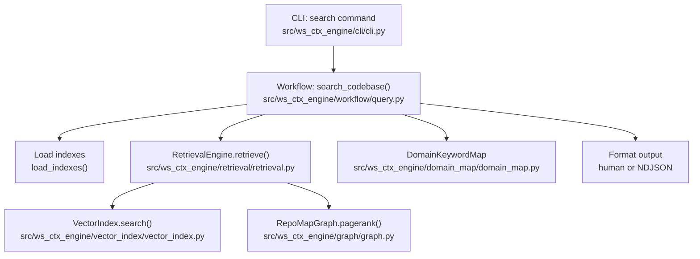
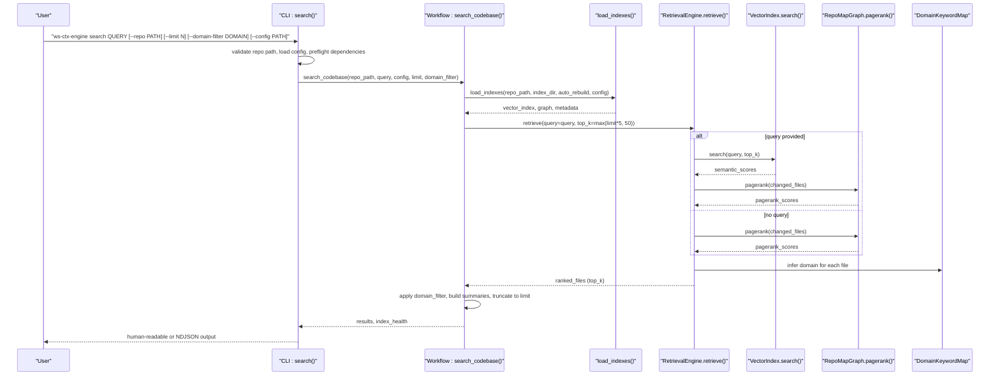
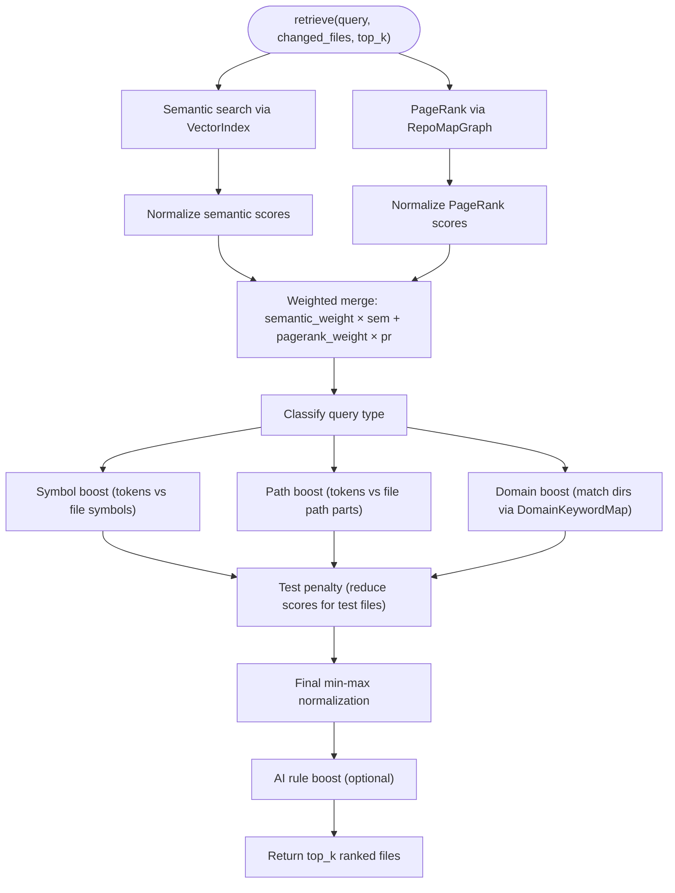
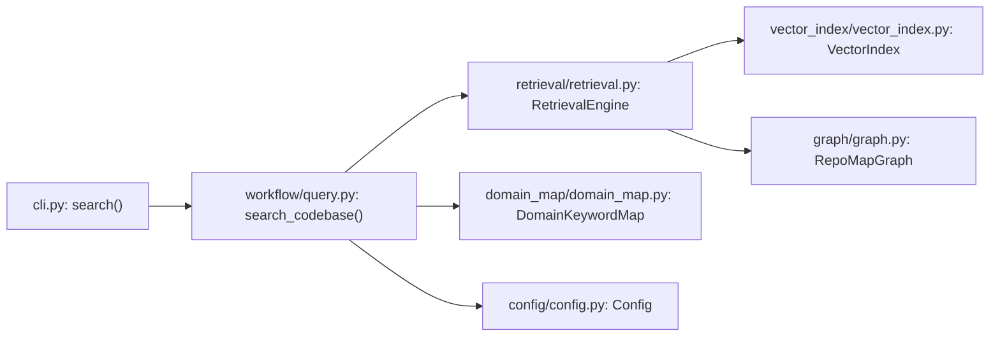

# Search Command

<cite>
**Referenced Files in This Document**
- [cli.py](file://src/ws_ctx_engine/cli/cli.py)
- [query.py](file://src/ws_ctx_engine/workflow/query.py)
- [retrieval.py](file://src/ws_ctx_engine/retrieval/retrieval.py)
- [vector_index.py](file://src/ws_ctx_engine/vector_index/vector_index.py)
- [graph.py](file://src/ws_ctx_engine/graph/graph.py)
- [domain_map.py](file://src/ws_ctx_engine/domain_map/domain_map.py)
- [config.py](file://src/ws_ctx_engine/config/config.py)
- [retrieval.md](file://docs/reference/retrieval.md)
- [output-formats.md](file://docs/guides/output-formats.md)
- [agent-workflows.md](file://docs/integrations/agent-workflows.md)
</cite>

## Table of Contents
1. [Introduction](#introduction)
2. [Project Structure](#project-structure)
3. [Core Components](#core-components)
4. [Architecture Overview](#architecture-overview)
5. [Detailed Component Analysis](#detailed-component-analysis)
6. [Dependency Analysis](#dependency-analysis)
7. [Performance Considerations](#performance-considerations)
8. [Troubleshooting Guide](#troubleshooting-guide)
9. [Conclusion](#conclusion)
10. [Appendices](#appendices)

## Introduction
This document provides comprehensive documentation for the search command that performs semantic search on indexed codebases. It explains all parameters, the end-to-end search pipeline (vector similarity search, PageRank scoring, and hybrid ranking), output format, practical examples, and integration with agent workflows. It also covers the relationship with pre-built indexes and error handling for unindexed repositories.

## Project Structure
The search command is implemented as a CLI command that delegates to a workflow function. The workflow loads pre-built indexes, runs hybrid retrieval, filters results, and emits either human-friendly or NDJSON output.

**Diagram sources**
- [cli.py:503-644](file://src/ws_ctx_engine/cli/cli.py#L503-L644)
- [query.py:158-227](file://src/ws_ctx_engine/workflow/query.py#L158-L227)
- [retrieval.py:250-368](file://src/ws_ctx_engine/retrieval/retrieval.py#L250-L368)
- [vector_index.py:43-56](file://src/ws_ctx_engine/vector_index/vector_index.py#L43-L56)
- [graph.py:46-63](file://src/ws_ctx_engine/graph/graph.py#L46-L63)

**Section sources**
- [cli.py:503-644](file://src/ws_ctx_engine/cli/cli.py#L503-L644)
- [query.py:158-227](file://src/ws_ctx_engine/workflow/query.py#L158-L227)

## Core Components
- CLI search command: defines arguments and options, validates repository path, loads configuration, runs the search workflow, and prints results.
- Workflow search_codebase(): loads indexes, constructs RetrievalEngine, retrieves ranked files, applies domain filtering, and returns results plus index health metadata.
- RetrievalEngine: orchestrates hybrid ranking by combining semantic similarity and PageRank, then applying symbol/path/domain boosts and test penalties.
- VectorIndex: semantic similarity search over code chunks.
- RepoMapGraph: builds dependency graph and computes PageRank scores.
- DomainKeywordMap: maps domain keywords to directories for domain boosting.
- Config: provides default weights and runtime configuration.

**Section sources**
- [cli.py:503-644](file://src/ws_ctx_engine/cli/cli.py#L503-L644)
- [query.py:158-227](file://src/ws_ctx_engine/workflow/query.py#L158-L227)
- [retrieval.py:140-368](file://src/ws_ctx_engine/retrieval/retrieval.py#L140-L368)
- [vector_index.py:21-94](file://src/ws_ctx_engine/vector_index/vector_index.py#L21-L94)
- [graph.py:19-94](file://src/ws_ctx_engine/graph/graph.py#L19-L94)
- [domain_map.py:11-147](file://src/ws_ctx_engine/domain_map/domain_map.py#L11-L147)
- [config.py:16-111](file://src/ws_ctx_engine/config/config.py#L16-L111)

## Architecture Overview
The search pipeline integrates semantic and structural signals to produce a single ranked list of files.

**Diagram sources**
- [cli.py:503-644](file://src/ws_ctx_engine/cli/cli.py#L503-L644)
- [query.py:158-227](file://src/ws_ctx_engine/workflow/query.py#L158-L227)
- [retrieval.py:250-368](file://src/ws_ctx_engine/retrieval/retrieval.py#L250-L368)
- [vector_index.py:43-56](file://src/ws_ctx_engine/vector_index/vector_index.py#L43-L56)
- [graph.py:46-63](file://src/ws_ctx_engine/graph/graph.py#L46-L63)

## Detailed Component Analysis

### CLI Search Command
- Arguments and options:
  - query_text (argument): natural language query for semantic search.
  - repo_path (option): path to repository root (default: current directory).
  - limit (option): maximum number of results (1–50).
  - domain_filter (option): optional domain filter applied to results.
  - config (option): path to custom configuration file.
  - verbose (option): enable debug logging.
  - agent_mode (option): emit NDJSON on stdout and logs to stderr.
- Behavior:
  - Loads configuration and validates repository path.
  - Preflight checks runtime dependencies.
  - Calls search_codebase() and prints results.
  - Emits NDJSON metadata and result records in agent mode.

**Section sources**
- [cli.py:503-644](file://src/ws_ctx_engine/cli/cli.py#L503-L644)

### Workflow search_codebase()
- Loads indexes with auto-rebuild and returns vector_index, graph, and metadata.
- Constructs RetrievalEngine with weights from config.
- Retrieves ranked files with top_k set to max(limit*5, 50) to ensure sufficient candidates.
- Filters by domain_filter (case-insensitive).
- Builds result items with path, score, domain, and summary.
- Returns results and index health metadata.

**Section sources**
- [query.py:158-227](file://src/ws_ctx_engine/workflow/query.py#L158-L227)

### RetrievalEngine Hybrid Ranking
- Steps:
  1) Semantic search: vector_index.search(query, top_k) returns file similarity scores.
  2) PageRank: graph.pagerank(changed_files) returns structural importance scores.
  3) Normalize and blend: min-max normalize both score sets and merge using semantic_weight and pagerank_weight.
  4) Adaptive boosting: based on query type classification:
     - Symbol: boost exact symbol matches.
     - Path-dominant: boost path keyword matches.
     - Domain: boost files under directories matching domain keywords.
  5) Test penalty: reduce scores for files matching test patterns.
  6) Final normalization: min-max normalize to [0, 1].
  7) AI rule boost: optionally push rule files to the top.
- Query type classification:
  - Path-dominant if domain keywords match.
  - Symbol if PascalCase or snake_case identifiers are detected.
  - Otherwise semantic-dominant.
- Effective weights vary by query type to adapt boosting.

**Diagram sources**
- [retrieval.py:250-368](file://src/ws_ctx_engine/retrieval/retrieval.py#L250-L368)
- [retrieval.md:139-281](file://docs/reference/retrieval.md#L139-L281)

**Section sources**
- [retrieval.py:140-368](file://src/ws_ctx_engine/retrieval/retrieval.py#L140-L368)
- [retrieval.md:139-281](file://docs/reference/retrieval.md#L139-L281)

### Vector Similarity Search
- VectorIndex.search(query, top_k) computes cosine similarity between query embedding and file embeddings.
- Supports multiple backends (LEANNIndex, FAISSIndex) with unified interface.
- Returns list of (file_path, similarity_score) tuples.

**Section sources**
- [vector_index.py:43-56](file://src/ws_ctx_engine/vector_index/vector_index.py#L43-L56)
- [vector_index.py:364-401](file://src/ws_ctx_engine/vector_index/vector_index.py#L364-L401)

### PageRank Structural Ranking
- RepoMapGraph.pagerank(changed_files) computes structural importance.
- Supports igraph (fast C++ backend) and NetworkX (pure Python fallback).
- Optionally boosts changed files and renormalizes scores.

**Section sources**
- [graph.py:46-63](file://src/ws_ctx_engine/graph/graph.py#L46-L63)
- [graph.py:188-231](file://src/ws_ctx_engine/graph/graph.py#L188-L231)

### Domain Keyword Mapping
- DomainKeywordMap maps domain keywords to directories for domain boosting.
- Used to detect domain-dominant queries and to boost files under matched directories.

**Section sources**
- [domain_map.py:11-147](file://src/ws_ctx_engine/domain_map/domain_map.py#L11-L147)

### Output Format
- Human-readable: prints ranked results with path, score, domain, and summary.
- NDJSON (agent mode): emits meta record with query, limit, domain_filter, index metadata, followed by result records with rank, path, score, domain, summary.

**Section sources**
- [cli.py:594-627](file://src/ws_ctx_engine/cli/cli.py#L594-L627)
- [output-formats.md:96-109](file://docs/guides/output-formats.md#L96-L109)

## Dependency Analysis
- CLI depends on workflow.search_codebase().
- Workflow depends on load_indexes() to obtain vector_index and graph.
- RetrievalEngine depends on VectorIndex and RepoMapGraph.
- DomainKeywordMap is used for domain inference and boosting.
- Config supplies weights and runtime settings.

**Diagram sources**
- [cli.py:503-644](file://src/ws_ctx_engine/cli/cli.py#L503-L644)
- [query.py:158-227](file://src/ws_ctx_engine/workflow/query.py#L158-L227)
- [retrieval.py:140-238](file://src/ws_ctx_engine/retrieval/retrieval.py#L140-L238)
- [vector_index.py:21-94](file://src/ws_ctx_engine/vector_index/vector_index.py#L21-L94)
- [graph.py:19-94](file://src/ws_ctx_engine/graph/graph.py#L19-L94)
- [domain_map.py:11-147](file://src/ws_ctx_engine/domain_map/domain_map.py#L11-L147)
- [config.py:16-111](file://src/ws_ctx_engine/config/config.py#L16-L111)

**Section sources**
- [cli.py:503-644](file://src/ws_ctx_engine/cli/cli.py#L503-L644)
- [query.py:158-227](file://src/ws_ctx_engine/workflow/query.py#L158-L227)

## Performance Considerations
- Hybrid ranking complexity scales with number of files and tokens.
- Typical latency: sub-100ms for 1k files, sub-500ms for 10k files, sub-2s for 100k files.
- top_k is increased (to max(limit*5, 50)) to ensure sufficient candidates before truncation.

**Section sources**
- [retrieval.md:529-548](file://docs/reference/retrieval.md#L529-L548)

## Troubleshooting Guide
- Unindexed repository:
  - Error: “FileNotFoundError” raised when indexes are missing.
  - Suggestion: run “ws-ctx-engine index” first to build indexes.
- Invalid repository path:
  - Error: “repo_not_found” or “repo_not_directory” emitted in NDJSON.
- Dependency issues:
  - Use “ws-ctx-engine doctor” to check optional dependencies.
  - Runtime preflight resolves backends and reports warnings/errors.
- Agent mode:
  - Use “--agent-mode” to emit NDJSON for agent consumption.

**Section sources**
- [cli.py:632-643](file://src/ws_ctx_engine/cli/cli.py#L632-L643)
- [query.py:316-322](file://src/ws_ctx_engine/workflow/query.py#L316-L322)

## Conclusion
The search command provides a robust, hybrid-ranking search over indexed codebases. It combines semantic similarity and structural PageRank signals, adapts boosting based on query type, and offers flexible output formats for both human and agent consumption. Proper indexing and configuration are essential for reliable results.

## Appendices

### Parameters Reference
- query_text (argument): natural language query for semantic search.
- repo_path (option): path to repository root (default: current directory).
- limit (option): maximum number of results (1–50).
- domain_filter (option): optional domain filter applied to results.
- config (option): path to custom configuration file.
- verbose (option): enable debug logging.
- agent_mode (option): emit NDJSON on stdout and logs to stderr.

**Section sources**
- [cli.py:503-544](file://src/ws_ctx_engine/cli/cli.py#L503-L544)

### Practical Examples
- Basic semantic search:
  - ws-ctx-engine search "authentication logic" --repo /path/to/repo --limit 10
- Filter by domain:
  - ws-ctx-engine search "database connection" --domain-filter database
- Agent mode:
  - ws-ctx-engine search "fix the bug" --agent-mode
- With custom config:
  - ws-ctx-engine search "routing logic" --config .ws-ctx-engine.yaml

**Section sources**
- [cli.py:503-644](file://src/ws_ctx_engine/cli/cli.py#L503-L644)

### Integration with Agent Workflows
- Use agent_mode to integrate with agents that consume NDJSON.
- Combine with other flags for agent-optimized workflows (e.g., session deduplication, compression, shuffling).

**Section sources**
- [agent-workflows.md:85-103](file://docs/integrations/agent-workflows.md#L85-L103)

### Relationship with Pre-built Indexes
- search_codebase() loads indexes with auto-rebuild and returns index health metadata.
- If indexes are missing, a FileNotFoundError is raised with guidance to run index first.

**Section sources**
- [query.py:178-183](file://src/ws_ctx_engine/workflow/query.py#L178-L183)
- [query.py:316-319](file://src/ws_ctx_engine/workflow/query.py#L316-L319)