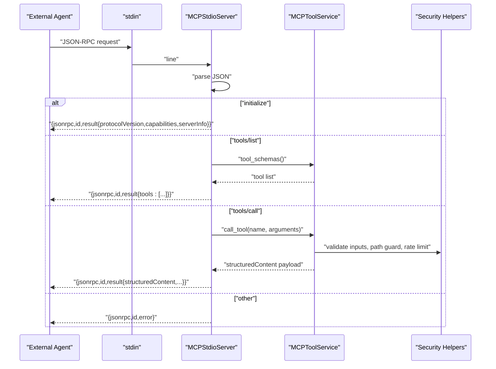
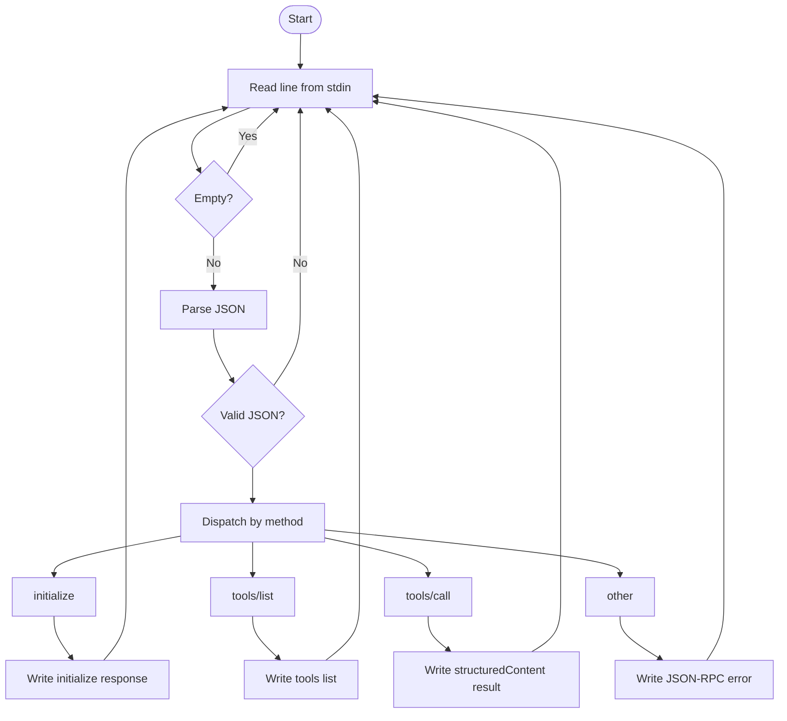
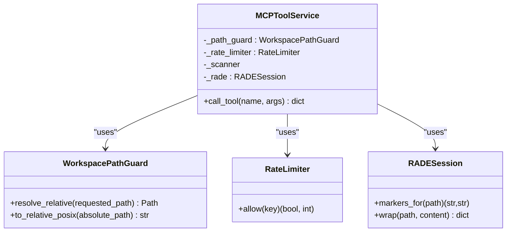
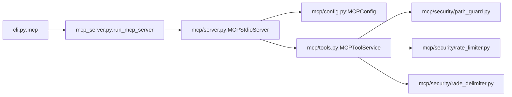

# MCP Server

<cite>
**Referenced Files in This Document**
- [mcp_server.py](file://src/ws_ctx_engine/mcp_server.py)
- [server.py](file://src/ws_ctx_engine/mcp/server.py)
- [tools.py](file://src/ws_ctx_engine/mcp/tools.py)
- [config.py](file://src/ws_ctx_engine/mcp/config.py)
- [path_guard.py](file://src/ws_ctx_engine/mcp/security/path_guard.py)
- [rate_limiter.py](file://src/ws_ctx_engine/mcp/security/rate_limiter.py)
- [rade_delimiter.py](file://src/ws_ctx_engine/mcp/security/rade_delimiter.py)
- [cli.py](file://src/ws_ctx_engine/cli/cli.py)
- [mcp-server.md](file://docs/integrations/mcp-server.md)
- [cli.md](file://docs/reference/cli.md)
- [test_mcp_server.py](file://tests/unit/test_mcp_server.py)
- [test_mcp_tools.py](file://tests/unit/test_mcp_tools.py)
- [test_mcp_rate_limiter.py](file://tests/unit/test_mcp_rate_limiter.py)
</cite>

## Table of Contents
1. [Introduction](#introduction)
2. [Project Structure](#project-structure)
3. [Core Components](#core-components)
4. [Architecture Overview](#architecture-overview)
5. [Detailed Component Analysis](#detailed-component-analysis)
6. [Dependency Analysis](#dependency-analysis)
7. [Performance Considerations](#performance-considerations)
8. [Troubleshooting Guide](#troubleshooting-guide)
9. [Conclusion](#conclusion)
10. [Appendices](#appendices)

## Introduction
This document explains the Model Context Protocol (MCP) server functionality in the repository. It covers the mcp command, workspace binding, configuration and rate limiting, MCP protocol integration, tool definitions, security controls, server lifecycle, error handling, debugging techniques, and best practices for agent integration and production deployments.

## Project Structure
The MCP server is implemented as a thin stdio-based MCP server that integrates with the broader codebase’s indexing, retrieval, and packaging workflows. The CLI exposes the mcp command, which delegates to a dedicated MCP server module. The server composes a configuration loader, a tool service, and security helpers.

```mermaid
graph TB
subgraph "CLI"
CLI["cli.py<br/>Typer app"]
end
subgraph "MCP Server"
WRAP["mcp_server.py<br/>run_mcp_server wrapper"]
SRV["mcp/server.py<br/>MCPStdioServer"]
CFG["mcp/config.py<br/>MCPConfig"]
SVC["mcp/tools.py<br/>MCPToolService"]
end
subgraph "Security & Utilities"
PATHG["mcp/security/path_guard.py<br/>WorkspacePathGuard"]
RL["mcp/security/rate_limiter.py<br/>RateLimiter"]
RADE["mcp/security/rade_delimiter.py<br/>RADESession"]
end
CLI --> WRAP
WRAP --> SRV
SRV --> CFG
SRV --> SVC
SVC --> PATHG
SVC --> RL
SVC --> RADE
```

**Diagram sources**
- [cli.py:646-695](file://src/ws_ctx_engine/cli/cli.py#L646-L695)
- [mcp_server.py:6-11](file://src/ws_ctx_engine/mcp_server.py#L6-L11)
- [server.py:13-136](file://src/ws_ctx_engine/mcp/server.py#L13-L136)
- [config.py:22-129](file://src/ws_ctx_engine/mcp/config.py#L22-L129)
- [tools.py:29-672](file://src/ws_ctx_engine/mcp/tools.py#L29-L672)
- [path_guard.py:6-31](file://src/ws_ctx_engine/mcp/security/path_guard.py#L6-L31)
- [rate_limiter.py:14-45](file://src/ws_ctx_engine/mcp/security/rate_limiter.py#L14-L45)
- [rade_delimiter.py:6-23](file://src/ws_ctx_engine/mcp/security/rade_delimiter.py#L6-L23)

**Section sources**
- [cli.py:646-695](file://src/ws_ctx_engine/cli/cli.py#L646-L695)
- [mcp-server.md:1-94](file://docs/integrations/mcp-server.md#L1-L94)

## Core Components
- MCPStdioServer: Reads JSON-RPC requests from stdin, dispatches to handlers, writes JSON-RPC responses to stdout.
- MCPToolService: Implements MCP tools, enforces rate limits, validates inputs, guards workspace paths, scans for secrets, wraps content safely, and caches selected outputs.
- MCPConfig: Loads and validates MCP configuration (rate limits, cache TTL, workspace), supports overrides, and resolves the effective workspace.
- Security helpers: WorkspacePathGuard prevents path traversal; RateLimiter implements token-bucket rate limiting; RADESession wraps file content with safe delimiters.

Key capabilities:
- Protocol: JSON-RPC 2.0 over stdio, with initialize and tools/* methods.
- Tools: search_codebase, get_file_context, get_domain_map, get_index_status/index_status, pack_context, session_clear.
- Security: read-only, path guard, secret scanning, content wrapping, per-tool rate limiting, caching.

**Section sources**
- [server.py:13-136](file://src/ws_ctx_engine/mcp/server.py#L13-L136)
- [tools.py:29-672](file://src/ws_ctx_engine/mcp/tools.py#L29-L672)
- [config.py:22-129](file://src/ws_ctx_engine/mcp/config.py#L22-L129)
- [path_guard.py:6-31](file://src/ws_ctx_engine/mcp/security/path_guard.py#L6-L31)
- [rate_limiter.py:14-45](file://src/ws_ctx_engine/mcp/security/rate_limiter.py#L14-L45)
- [rade_delimiter.py:6-23](file://src/ws_ctx_engine/mcp/security/rade_delimiter.py#L6-L23)

## Architecture Overview
The MCP server runs as a long-lived process that reads requests from stdin and writes responses to stdout. It initializes configuration, binds to a single workspace, and exposes a curated set of read-only tools.



**Diagram sources**
- [server.py:39-111](file://src/ws_ctx_engine/mcp/server.py#L39-L111)
- [tools.py:133-184](file://src/ws_ctx_engine/mcp/tools.py#L133-L184)
- [path_guard.py:10-20](file://src/ws_ctx_engine/mcp/security/path_guard.py#L10-L20)
- [rate_limiter.py:19-44](file://src/ws_ctx_engine/mcp/security/rate_limiter.py#L19-L44)

## Detailed Component Analysis

### MCP Command and Options
The CLI exposes the mcp command with:
- --workspace/-w: Bind server to a workspace root (overrides mcp_config.workspace when provided).
- --mcp-config: Path to MCP config JSON (defaults to .ws-ctx-engine/mcp_config.json).
- --rate-limit: One or more TOOL=LIMIT overrides for supported tools.

Behavior:
- Validates workspace path if provided.
- Parses rate-limit overrides into a dictionary.
- Delegates to run_mcp_server with workspace, config path, and rate limits.

**Section sources**
- [cli.py:646-695](file://src/ws_ctx_engine/cli/cli.py#L646-L695)
- [cli.md:390-415](file://docs/reference/cli.md#L390-L415)

### Server Lifecycle and Request Handling
- Construction: Resolves effective workspace, loads MCPConfig (including rate limits and cache TTL), constructs MCPToolService.
- Runtime loop: Reads lines from stdin, ignores blank lines and malformed JSON, handles initialize, tools/list, tools/call, and returns appropriate JSON-RPC responses.
- Error handling: Returns standardized JSON-RPC error objects for invalid requests, unknown methods, and invalid params.



**Diagram sources**
- [server.py:39-111](file://src/ws_ctx_engine/mcp/server.py#L39-L111)

**Section sources**
- [server.py:13-136](file://src/ws_ctx_engine/mcp/server.py#L13-L136)
- [test_mcp_server.py:11-91](file://tests/unit/test_mcp_server.py#L11-L91)
- [test_mcp_server.py:160-176](file://tests/unit/test_mcp_server.py#L160-L176)

### Configuration Loading and Resolution
- Default config path: .ws-ctx-engine/mcp_config.json.
- Supported fields: workspace (optional), cache_ttl_seconds (positive integer), rate_limits (object of tool name to positive integer).
- Overrides: CLI --rate-limit values override loaded rate_limits; runtime --workspace overrides mcp_config.workspace.

Resolution:
- resolve_workspace prefers explicit workspace, then configured workspace (relative to bootstrap), otherwise bootstrap workspace.

Validation:
- Strict mode raises on missing file or invalid JSON/object types.
- Unknown tool names or non-positive limits are rejected in strict mode.

**Section sources**
- [config.py:22-129](file://src/ws_ctx_engine/mcp/config.py#L22-L129)
- [test_mcp_server.py:93-136](file://tests/unit/test_mcp_server.py#L93-L136)

### Tool Definitions and Behavior
Available tools:
- search_codebase: Semantic search with limit and optional domain filter; returns ranked results and index health.
- get_file_context: Returns file content with dependency/dependent lists; redacts secrets and wraps content safely; guarded by path guard and secret scanner.
- get_domain_map: Returns top architecture domains inferred from the domain map index; cached with TTL.
- get_index_status/index_status: Returns index health and recommendation; alias shares canonical name for rate limiting; cached with TTL.
- pack_context: Executes query-and-pack with format, token budget, and agent phase; returns output path and metrics.
- session_clear: Clears session deduplication cache files; validates session_id allowlist.

Inputs and validations:
- Each tool validates required and typed inputs; returns INVALID_ARGUMENT with message on violations.
- get_file_context validates booleans and path existence; blocks traversal and symlink escapes.
- pack_context validates format, token budget, and agent phase.

Outputs:
- tools/call returns structuredContent payload; server wraps it in a JSON-RPC result with text content for compatibility.

**Section sources**
- [tools.py:43-131](file://src/ws_ctx_engine/mcp/tools.py#L43-L131)
- [tools.py:133-672](file://src/ws_ctx_engine/mcp/tools.py#L133-L672)
- [test_mcp_tools.py:198-211](file://tests/unit/test_mcp_tools.py#L198-L211)
- [test_mcp_tools.py:220-244](file://tests/unit/test_mcp_tools.py#L220-L244)
- [test_mcp_tools.py:246-277](file://tests/unit/test_mcp_tools.py#L246-L277)
- [test_mcp_tools.py:342-396](file://tests/unit/test_mcp_tools.py#L342-L396)
- [test_mcp_tools.py:423-485](file://tests/unit/test_mcp_tools.py#L423-L485)

### Security Controls
- WorkspacePathGuard: Ensures all requested paths resolve within the bound workspace; raises on traversal attempts.
- Secret scanning: Detects sensitive content; omits content and returns sanitized error when secrets are found.
- Content wrapping: RADESession wraps file content with unique delimiters to mark boundaries.
- Rate limiting: Token-bucket limiter per tool; alias tools share buckets with canonical names.
- Caching: TTL-based cache for domain map and index status; excludes error results.



**Diagram sources**
- [path_guard.py:6-31](file://src/ws_ctx_engine/mcp/security/path_guard.py#L6-L31)
- [rate_limiter.py:14-45](file://src/ws_ctx_engine/mcp/security/rate_limiter.py#L14-L45)
- [rade_delimiter.py:6-23](file://src/ws_ctx_engine/mcp/security/rade_delimiter.py#L6-L23)
- [tools.py:29-672](file://src/ws_ctx_engine/mcp/tools.py#L29-L672)

**Section sources**
- [path_guard.py:6-31](file://src/ws_ctx_engine/mcp/security/path_guard.py#L6-L31)
- [test_mcp_tools.py:9-53](file://tests/unit/test_mcp_tools.py#L9-L53)
- [test_mcp_tools.py:55-95](file://tests/unit/test_mcp_tools.py#L55-L95)
- [test_mcp_tools.py:119-141](file://tests/unit/test_mcp_tools.py#L119-L141)
- [test_mcp_tools.py:143-175](file://tests/unit/test_mcp_tools.py#L143-L175)

### Rate Limiting Details
- Default limits per minute are defined centrally and loaded into RateLimiter.
- allow(key) refills tokens based on elapsed time and checks capacity; returns (allowed, retry_after).
- Aliases like index_status share the same bucket as get_index_status.
- Excess returns RATE_LIMIT_EXCEEDED with retry_after_seconds.

**Section sources**
- [config.py:8-15](file://src/ws_ctx_engine/mcp/config.py#L8-L15)
- [rate_limiter.py:14-45](file://src/ws_ctx_engine/mcp/security/rate_limiter.py#L14-L45)
- [test_mcp_rate_limiter.py:1-70](file://tests/unit/test_mcp_rate_limiter.py#L1-L70)
- [test_mcp_tools.py:143-175](file://tests/unit/test_mcp_tools.py#L143-L175)

### Workspace Management
- Bound to a single workspace root at startup.
- Effective workspace resolution:
  - If --workspace provided, use it.
  - Else if mcp_config.workspace present, resolve relative to bootstrap workspace.
  - Otherwise use bootstrap workspace.
- Invalid workspace paths cause immediate startup failure.

**Section sources**
- [server.py:13-38](file://src/ws_ctx_engine/mcp/server.py#L13-L38)
- [config.py:117-129](file://src/ws_ctx_engine/mcp/config.py#L117-L129)
- [test_mcp_server.py:100-126](file://tests/unit/test_mcp_server.py#L100-L126)

### Protocol Integration
- JSON-RPC 2.0 over stdio.
- Methods:
  - initialize: returns protocolVersion, capabilities, serverInfo.
  - tools/list: returns tool schemas.
  - tools/call: invokes tool with arguments; returns structuredContent payload.
- Notifications like initialized are ignored and return no response.

**Section sources**
- [server.py:69-111](file://src/ws_ctx_engine/mcp/server.py#L69-L111)
- [mcp-server.md:1-94](file://docs/integrations/mcp-server.md#L1-L94)

### Examples and Usage Patterns
- Starting the server:
  - ws-ctx-engine mcp --workspace /path/to/repo
  - ws-ctx-engine mcp -w . --rate-limit search_codebase=60
- Connecting agents:
  - Launch the server and point agents to the stdio endpoint.
  - Use tools/search_codebase, tools/get_file_context, tools/pack_context.
- Workspace management:
  - Use --workspace to bind to a specific directory; ensure it exists and is a directory.
- Rate limiting:
  - Adjust per-tool limits via --rate-limit or mcp_config.json rate_limits.

**Section sources**
- [cli.md:390-415](file://docs/reference/cli.md#L390-L415)
- [mcp-server.md:1-94](file://docs/integrations/mcp-server.md#L1-L94)

## Dependency Analysis
- CLI depends on mcp_server to run the MCP stdio server.
- MCPStdioServer depends on MCPConfig and MCPToolService.
- MCPToolService depends on WorkspacePathGuard, RateLimiter, RADESession, and internal workflows.



**Diagram sources**
- [cli.py:646-695](file://src/ws_ctx_engine/cli/cli.py#L646-L695)
- [mcp_server.py:6-11](file://src/ws_ctx_engine/mcp_server.py#L6-L11)
- [server.py:9-10](file://src/ws_ctx_engine/mcp/server.py#L9-L10)
- [tools.py:19-21](file://src/ws_ctx_engine/mcp/tools.py#L19-L21)

**Section sources**
- [cli.py:646-695](file://src/ws_ctx_engine/cli/cli.py#L646-L695)
- [server.py:9-10](file://src/ws_ctx_engine/mcp/server.py#L9-L10)
- [tools.py:19-21](file://src/ws_ctx_engine/mcp/tools.py#L19-L21)

## Performance Considerations
- Rate limiting is CPU-light and uses monotonic time for refill calculations.
- Path guard and secret scanning add minimal overhead; caching reduces repeated work for domain map and index status.
- For production, tune rate limits per workload and monitor index health to avoid excessive rebuilds.

[No sources needed since this section provides general guidance]

## Troubleshooting Guide
Common issues and diagnostics:
- Invalid workspace path: Raised during construction if workspace is not a directory.
- Missing or invalid MCP config: Validation errors when file not found or JSON invalid (strict mode).
- Invalid tool or arguments: INVALID_ARGUMENT responses with messages.
- Rate limit exceeded: RATE_LIMIT_EXCEEDED with retry_after_seconds.
- File not found or read failures: FILE_NOT_FOUND or FILE_READ_FAILED.
- Secrets detected: Content omitted with error indicating sensitive data.
- JSON parsing errors: Server ignores malformed lines and continues processing.

Debugging tips:
- Use agent mode to emit NDJSON for external consumers.
- Inspect server version and capabilities via initialize response.
- Validate rate-limit overrides and tool names.

**Section sources**
- [test_mcp_server.py:93-136](file://tests/unit/test_mcp_server.py#L93-L136)
- [test_mcp_tools.py:220-244](file://tests/unit/test_mcp_tools.py#L220-L244)
- [test_mcp_tools.py:246-277](file://tests/unit/test_mcp_tools.py#L246-L277)
- [test_mcp_tools.py:342-396](file://tests/unit/test_mcp_tools.py#L342-L396)
- [test_mcp_tools.py:423-485](file://tests/unit/test_mcp_tools.py#L423-L485)

## Conclusion
The MCP server provides a secure, read-only, stdio-bound interface to the codebase’s indexing and retrieval capabilities. It integrates cleanly with agents via JSON-RPC, enforces strong security boundaries, and offers configurable rate limiting and caching to support production-grade usage.

[No sources needed since this section summarizes without analyzing specific files]

## Appendices

### MCP Protocol and Tool Reference
- Protocol: JSON-RPC 2.0 over stdio; initialize, tools/list, tools/call.
- Tools: search_codebase, get_file_context, get_domain_map, get_index_status/index_status, pack_context, session_clear.
- Errors: TOOL_NOT_FOUND, INVALID_ARGUMENT, INDEX_NOT_FOUND, FILE_NOT_FOUND, FILE_READ_FAILED, RATE_LIMIT_EXCEEDED, SEARCH_FAILED.

**Section sources**
- [mcp-server.md:1-94](file://docs/integrations/mcp-server.md#L1-L94)

### Configuration Fields
- workspace: Optional; overrides bound workspace when provided.
- cache_ttl_seconds: Positive integer; default 30.
- rate_limits: Object mapping tool name to positive integer limit.

**Section sources**
- [config.py:22-129](file://src/ws_ctx_engine/mcp/config.py#L22-L129)
- [mcp-server.md:85-94](file://docs/integrations/mcp-server.md#L85-L94)