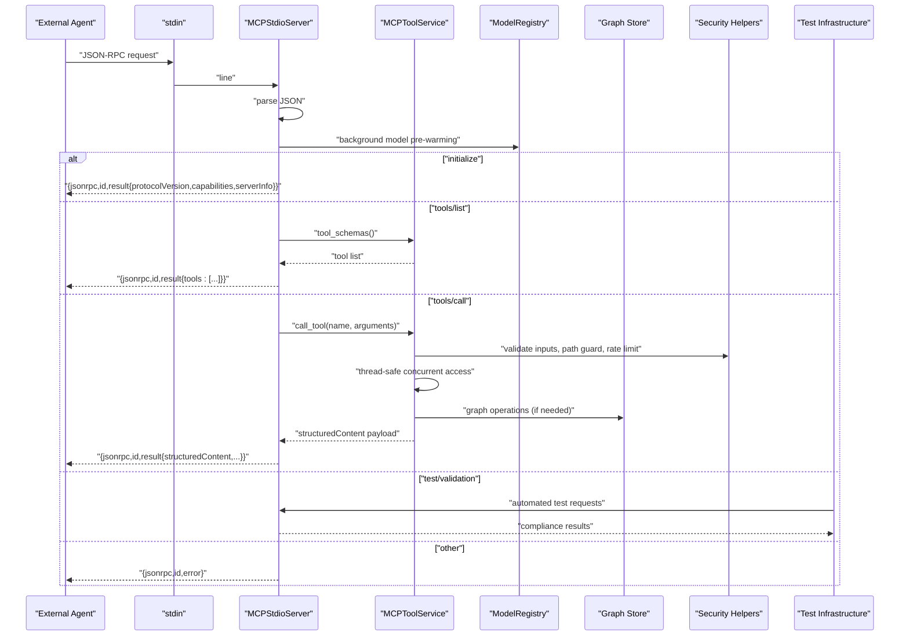
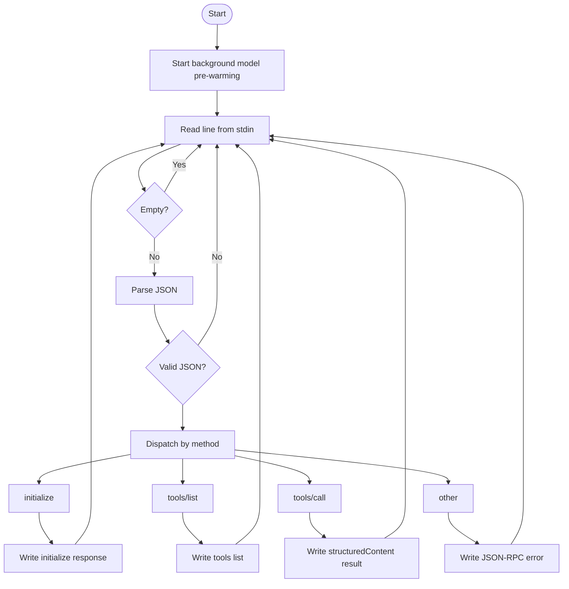
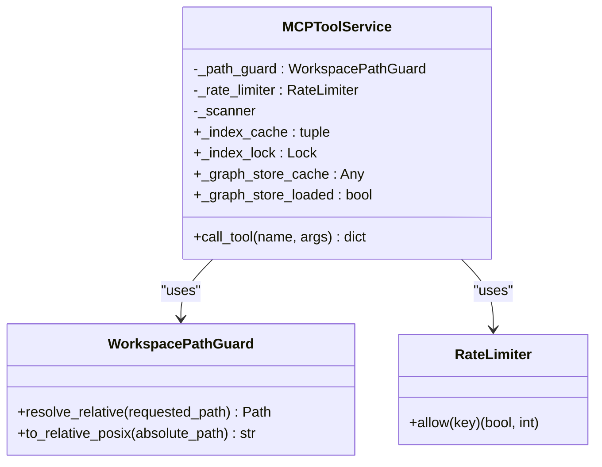
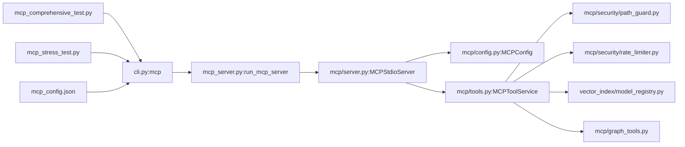

# MCP Server

<cite>
**Referenced Files in This Document**
- [mcp_server.py](file://src/ws_ctx_engine/mcp_server.py)
- [server.py](file://src/ws_ctx_engine/mcp/server.py)
- [tools.py](file://src/ws_ctx_engine/mcp/tools.py)
- [graph_tools.py](file://src/ws_ctx_engine/mcp/graph_tools.py)
- [config.py](file://src/ws_ctx_engine/mcp/config.py)
- [path_guard.py](file://src/ws_ctx_engine/mcp/security/path_guard.py)
- [rate_limiter.py](file://src/ws_ctx_engine/mcp/security/rate_limiter.py)
- [model_registry.py](file://src/ws_ctx_engine/vector_index/model_registry.py)
- [cli.py](file://src/ws_ctx_engine/cli/cli.py)
- [mcp-server.md](file://docs/integrations/mcp-server.md)
- [cli.md](file://docs/reference/cli.md)
- [test_mcp_server.py](file://tests/unit/test_mcp_server.py)
- [test_mcp_tools.py](file://tests/unit/test_mcp_tools.py)
- [test_mcp_rate_limiter.py](file://tests/unit/test_mcp_rate_limiter.py)
- [mcp_comprehensive_test.py](file://scripts/mcp/mcp_comprehensive_test.py)
- [mcp_stress_test.py](file://scripts/mcp/mcp_stress_test.py)
- [MCP_PERFORMANCE_OPTIMIZATION.md](file://docs/performance/MCP_PERFORMANCE_OPTIMIZATION.md)
- [detailed_report_20260326_213840.json](file://test_results/mcp/comprehensive_test/detailed_report_20260326_213840.json)
- [summary_20260326_212315.txt](file://test_results/mcp/stress_test/summary_20260326_212315.txt)
- [mcp_config.json](file://.windsurf/mcp_config.json)
</cite>

## Update Summary
**Changes Made**
- Enhanced MCP server with background model pre-warming using thread-safe ModelRegistry
- Added persistent connections with long-lived server process architecture
- Implemented thread-safe concurrent access handling with index caching and locks
- Integrated comprehensive error handling with fallback strategies and graceful degradation
- Updated performance optimization framework with ONNX backend support and memory management
- Improved server lifecycle with background initialization and resource management
- Added new graph tools integration with find_callers, impact_analysis, graph_search, and call_chain
- Enhanced tool definitions with get_status for comprehensive server readiness monitoring

## Table of Contents
1. [Introduction](#introduction)
2. [Project Structure](#project-structure)
3. [Core Components](#core-components)
4. [Architecture Overview](#architecture-overview)
5. [Detailed Component Analysis](#detailed-component-analysis)
6. [Testing Infrastructure](#testing-infrastructure)
7. [Development Configuration](#development-configuration)
8. [Performance Optimization Framework](#performance-optimization-framework)
9. [Dependency Analysis](#dependency-analysis)
10. [Performance Considerations](#performance-considerations)
11. [Troubleshooting Guide](#troubleshooting-guide)
12. [Conclusion](#conclusion)
13. [Appendices](#appendices)

## Introduction
This document explains the Model Context Protocol (MCP) server functionality in the repository. It covers the mcp command, workspace binding, configuration and rate limiting, MCP protocol integration, tool definitions, security controls, server lifecycle, error handling, debugging techniques, comprehensive testing infrastructure, development configuration, performance optimization strategies, and best practices for agent integration and production deployments.

**Updated** The MCP server now features enhanced performance with background model pre-warming, persistent connections, thread-safe concurrent access handling, and comprehensive error handling with fallback strategies. New graph tools integration provides advanced code analysis capabilities including call chain tracing and impact analysis.

## Project Structure
The MCP server is implemented as a thin stdio-based MCP server that integrates with the broader codebase's indexing, retrieval, and packaging workflows. The CLI exposes the mcp command, which delegates to a dedicated MCP server module. The server composes a configuration loader, a tool service, and security helpers. A comprehensive testing infrastructure provides automated compliance and performance validation.

```mermaid
graph TB
subgraph "CLI"
CLI["cli.py<br/>Typer app"]
end
subgraph "MCP Server"
WRAP["mcp_server.py<br/>run_mcp_server wrapper"]
SRV["mcp/server.py<br/>MCPStdioServer"]
CFG["mcp/config.py<br/>MCPConfig"]
SVC["mcp/tools.py<br/>MCPToolService"]
end
subgraph "Security & Utilities"
PATHG["mcp/security/path_guard.py<br/>WorkspacePathGuard"]
RL["mcp/security/rate_limiter.py<br/>RateLimiter"]
MR["vector_index/model_registry.py<br/>ModelRegistry"]
end
subgraph "Graph Tools"
GT["mcp/graph_tools.py<br/>Graph Tool Handlers"]
end
subgraph "Testing Infrastructure"
COMP["mcp_comprehensive_test.py<br/>Comprehensive Test Suite"]
STRESS["mcp_stress_test.py<br/>Stress Test Suite"]
RESULTS["test_results/<br/>Test Reports"]
end
subgraph "Development Config"
WINDSURF["mcp_config.json<br/>Windsurf Integration"]
end
CLI --> WRAP
WRAP --> SRV
SRV --> CFG
SRV --> SVC
SVC --> PATHG
SVC --> RL
SVC --> MR
SVC --> GT
COMP --> RESULTS
STRESS --> RESULTS
WINDSURF --> CLI
```

**Diagram sources**
- [cli.py:658-706](file://src/ws_ctx_engine/cli/cli.py#L658-L706)
- [mcp_server.py:6-11](file://src/ws_ctx_engine/mcp_server.py#L6-L11)
- [server.py:21-164](file://src/ws_ctx_engine/mcp/server.py#L21-L164)
- [config.py:22-129](file://src/ws_ctx_engine/mcp/config.py#L22-L129)
- [tools.py:30-765](file://src/ws_ctx_engine/mcp/tools.py#L30-L765)
- [path_guard.py:6-31](file://src/ws_ctx_engine/mcp/security/path_guard.py#L6-L31)
- [rate_limiter.py:14-45](file://src/ws_ctx_engine/mcp/security/rate_limiter.py#L14-L45)
- [model_registry.py:84-207](file://src/ws_ctx_engine/vector_index/model_registry.py#L84-L207)
- [graph_tools.py:1-103](file://src/ws_ctx_engine/mcp/graph_tools.py#L1-L103)
- [mcp_comprehensive_test.py:1-948](file://scripts/mcp/mcp_comprehensive_test.py#L1-L948)
- [mcp_stress_test.py:1-378](file://scripts/mcp/mcp_stress_test.py#L1-L378)
- [mcp_config.json:1-9](file://.windsurf/mcp_config.json#L1-L9)

**Section sources**
- [cli.py:658-706](file://src/ws_ctx_engine/cli/cli.py#L658-L706)
- [mcp-server.md:1-94](file://docs/integrations/mcp-server.md#L1-L94)

## Core Components
- MCPStdioServer: Reads JSON-RPC requests from stdin, dispatches to handlers, writes JSON-RPC responses to stdout, and manages background model pre-warming.
- MCPToolService: Implements MCP tools with thread-safe concurrent access, persistent index caching, and comprehensive error handling with fallback strategies.
- MCPConfig: Loads and validates MCP configuration (rate limits, cache TTL, workspace), supports overrides, and resolves the effective workspace.
- Security helpers: WorkspacePathGuard prevents path traversal; RateLimiter implements token-bucket rate limiting.
- ModelRegistry: Thread-safe singleton registry for embedding models with ONNX backend support and memory management.
- Graph tools: New graph analysis tools including find_callers, impact_analysis, graph_search, and call_chain for advanced code navigation.

Key capabilities:
- Protocol: JSON-RPC 2.0 over stdio, with initialize and tools/* methods.
- Tools: search_codebase, get_file_context, get_domain_map, get_index_status/index_status, get_status, pack_context, session_clear, find_callers, impact_analysis, graph_search, call_chain.
- Security: read-only, path guard, secret scanning, per-tool rate limiting, caching.
- Performance: Background model pre-warming, persistent connections, thread-safe concurrent access, ONNX backend acceleration.
- Testing: Comprehensive compliance suite, stress testing, performance benchmarking.
- Development: Automated integration with development tools like Windsurf.

**Section sources**
- [server.py:21-164](file://src/ws_ctx_engine/mcp/server.py#L21-L164)
- [tools.py:30-765](file://src/ws_ctx_engine/mcp/tools.py#L30-L765)
- [config.py:22-129](file://src/ws_ctx_engine/mcp/config.py#L22-L129)
- [path_guard.py:6-31](file://src/ws_ctx_engine/mcp/security/path_guard.py#L6-L31)
- [rate_limiter.py:14-45](file://src/ws_ctx_engine/mcp/security/rate_limiter.py#L14-L45)
- [model_registry.py:84-207](file://src/ws_ctx_engine/vector_index/model_registry.py#L84-L207)
- [graph_tools.py:1-103](file://src/ws_ctx_engine/mcp/graph_tools.py#L1-L103)

## Architecture Overview
The MCP server runs as a long-lived process that reads requests from stdin and writes responses to stdout. It initializes configuration, binds to a single workspace, and exposes a curated set of read-only tools. The architecture supports comprehensive testing and development workflows with enhanced performance through background model pre-warming and thread-safe concurrent access.



**Diagram sources**
- [server.py:57-139](file://src/ws_ctx_engine/mcp/server.py#L57-L139)
- [tools.py:197-248](file://src/ws_ctx_engine/mcp/tools.py#L197-L248)
- [path_guard.py:10-20](file://src/ws_ctx_engine/mcp/security/path_guard.py#L10-L20)
- [rate_limiter.py:19-44](file://src/ws_ctx_engine/mcp/security/rate_limiter.py#L19-L44)
- [model_registry.py:147-163](file://src/ws_ctx_engine/vector_index/model_registry.py#L147-L163)

## Detailed Component Analysis

### MCP Command and Options
The CLI exposes the mcp command with:
- --workspace/-w: Bind server to a workspace root (overrides mcp_config.workspace when provided).
- --mcp-config: Path to MCP config JSON (defaults to .ws-ctx-engine/mcp_config.json).
- --rate-limit: One or more TOOL=LIMIT overrides for supported tools.

Behavior:
- Validates workspace path if provided.
- Parses rate-limit overrides into a dictionary.
- Delegates to run_mcp_server with workspace, config path, and rate limits.

**Section sources**
- [cli.py:658-706](file://src/ws_ctx_engine/cli/cli.py#L658-L706)
- [cli.md:390-415](file://docs/reference/cli.md#L390-L415)

### Server Lifecycle and Request Handling
- Construction: Resolves effective workspace, loads MCPConfig (including rate limits and cache TTL), constructs MCPToolService, and starts background model pre-warming thread.
- Runtime loop: Reads lines from stdin, ignores blank lines and malformed JSON, handles initialize, tools/list, tools/call, and returns appropriate JSON-RPC responses.
- Error handling: Returns standardized JSON-RPC error objects for invalid requests, unknown methods, and invalid params.
- Background initialization: Starts daemon thread to pre-warm embedding models during MCP handshake.



**Diagram sources**
- [server.py:57-139](file://src/ws_ctx_engine/mcp/server.py#L57-L139)

**Section sources**
- [server.py:21-164](file://src/ws_ctx_engine/mcp/server.py#L21-L164)
- [test_mcp_server.py:11-91](file://tests/unit/test_mcp_server.py#L11-L91)
- [test_mcp_server.py:160-176](file://tests/unit/test_mcp_server.py#L160-L176)

### Configuration Loading and Resolution
- Default config path: .ws-ctx-engine/mcp_config.json.
- Supported fields: workspace (optional), cache_ttl_seconds (positive integer), rate_limits (object of tool name to positive integer).
- Overrides: CLI --rate-limit values override loaded rate_limits; runtime --workspace overrides mcp_config.workspace.

Resolution:
- resolve_workspace prefers explicit workspace, then configured workspace (relative to bootstrap), otherwise bootstrap workspace.

Validation:
- Strict mode raises on missing file or invalid JSON/object types.
- Unknown tool names or non-positive limits are rejected in strict mode.

**Section sources**
- [config.py:22-129](file://src/ws_ctx_engine/mcp/config.py#L22-L129)
- [test_mcp_server.py:93-136](file://tests/unit/test_mcp_server.py#L93-L136)

### Tool Definitions and Behavior
Available tools:
- search_codebase: Semantic search with limit and optional domain filter; returns ranked results and index health.
- get_file_context: Returns file content with dependency/dependent lists; redacts secrets and wraps content safely; guarded by path guard and secret scanner.
- get_domain_map: Returns top architecture domains inferred from the domain map index; cached with TTL.
- get_index_status/index_status: Returns index health and recommendation; alias shares canonical name for rate limiting; cached with TTL.
- get_status: Returns comprehensive server readiness status including index state, graph store health, and overall system status.
- pack_context: Executes query-and-pack with format, token budget, and agent phase; returns output path and metrics.
- session_clear: Clears session deduplication cache files; validates session_id allowlist.
- find_callers: Finds all functions and files that call a given function (graph tool).
- impact_analysis: Returns files that would be affected if a given file is modified (graph tool).
- graph_search: Lists all symbols defined in a given file (graph tool).
- call_chain: Traces call path between two functions via BFS (graph tool).

Inputs and validations:
- Each tool validates required and typed inputs; returns INVALID_ARGUMENT with message on violations.
- get_file_context validates booleans and path existence; blocks traversal and symlink escapes.
- pack_context validates format, token budget, and agent phase.
- Graph tools validate required parameters and check graph store availability.

Outputs:
- tools/call returns structuredContent payload; server wraps it in a JSON-RPC result with text content for compatibility.

**Section sources**
- [tools.py:51-139](file://src/ws_ctx_engine/mcp/tools.py#L51-L139)
- [tools.py:197-765](file://src/ws_ctx_engine/mcp/tools.py#L197-L765)
- [graph_tools.py:28-103](file://src/ws_ctx_engine/mcp/graph_tools.py#L28-L103)
- [test_mcp_tools.py:198-211](file://tests/unit/test_mcp_tools.py#L198-L211)
- [test_mcp_tools.py:220-244](file://tests/unit/test_mcp_tools.py#L220-L244)
- [test_mcp_tools.py:246-277](file://tests/unit/test_mcp_tools.py#L246-L277)
- [test_mcp_tools.py:342-396](file://tests/unit/test_mcp_tools.py#L342-L396)
- [test_mcp_tools.py:423-485](file://tests/unit/test_mcp_tools.py#L423-L485)

### Security Controls
- WorkspacePathGuard: Ensures all requested paths resolve within the bound workspace; raises on traversal attempts.
- Secret scanning: Detects sensitive content; omits content and returns sanitized error when secrets are found.
- Rate limiting: Token-bucket limiter per tool; alias tools share buckets with canonical names.
- Caching: TTL-based cache for domain map and index status; excludes error results.



**Diagram sources**
- [path_guard.py:6-31](file://src/ws_ctx_engine/mcp/security/path_guard.py#L6-L31)
- [rate_limiter.py:14-45](file://src/ws_ctx_engine/mcp/security/rate_limiter.py#L14-L45)
- [tools.py:30-765](file://src/ws_ctx_engine/mcp/tools.py#L30-L765)

**Section sources**
- [path_guard.py:6-31](file://src/ws_ctx_engine/mcp/security/path_guard.py#L6-L31)
- [test_mcp_tools.py:9-53](file://tests/unit/test_mcp_tools.py#L9-L53)
- [test_mcp_tools.py:55-95](file://tests/unit/test_mcp_tools.py#L55-L95)
- [test_mcp_tools.py:119-141](file://tests/unit/test_mcp_tools.py#L119-L141)
- [test_mcp_tools.py:143-175](file://tests/unit/test_mcp_tools.py#L143-L175)

### Rate Limiting Details
- Default limits per minute are defined centrally and loaded into RateLimiter.
- allow(key) refills tokens based on elapsed time and checks capacity; returns (allowed, retry_after).
- Aliases like index_status share the same bucket as get_index_status.
- Excess returns RATE_LIMIT_EXCEEDED with retry_after_seconds.

**Section sources**
- [config.py:8-15](file://src/ws_ctx_engine/mcp/config.py#L8-L15)
- [rate_limiter.py:14-45](file://src/ws_ctx_engine/mcp/security/rate_limiter.py#L14-L45)
- [test_mcp_rate_limiter.py:1-70](file://tests/unit/test_mcp_rate_limiter.py#L1-L70)
- [test_mcp_tools.py:143-175](file://tests/unit/test_mcp_tools.py#L143-L175)

### Workspace Management
- Bound to a single workspace root at startup.
- Effective workspace resolution:
  - If --workspace provided, use it.
  - Else if mcp_config.workspace present, resolve relative to bootstrap workspace.
  - Otherwise use bootstrap workspace.
- Invalid workspace paths cause immediate startup failure.

**Section sources**
- [server.py:21-45](file://src/ws_ctx_engine/mcp/server.py#L21-L45)
- [config.py:117-129](file://src/ws_ctx_engine/mcp/config.py#L117-L129)
- [test_mcp_server.py:100-126](file://tests/unit/test_mcp_server.py#L100-L126)

### Protocol Integration
- JSON-RPC 2.0 over stdio.
- Methods:
  - initialize: returns protocolVersion, capabilities, serverInfo.
  - tools/list: returns tool schemas.
  - tools/call: invokes tool with arguments; returns structuredContent payload.
- Notifications like initialized are ignored and return no response.

**Section sources**
- [server.py:100-139](file://src/ws_ctx_engine/mcp/server.py#L100-L139)
- [mcp-server.md:1-94](file://docs/integrations/mcp-server.md#L1-L94)

### Enhanced Performance Features

#### Background Model Pre-Warming
The MCP server now implements intelligent background model pre-warming to eliminate cold start latency:

- **Daemon Thread**: Dedicated background thread starts immediately after server construction
- **ModelRegistry Integration**: Uses thread-safe singleton pattern for model caching
- **ONNX Backend Support**: Automatic detection and utilization of ONNX runtime for 2-3x speedup
- **Memory Management**: Respects WSCTX_MEMORY_THRESHOLD_MB environment variable
- **Graceful Degradation**: Pre-warming failures don't block server startup

#### Thread-Safe Concurrent Access
The MCPToolService now handles concurrent requests safely:

- **Index Caching**: Persistent index instances cached with thread locks
- **Double-Checked Locking**: Prevents race conditions during index loading
- **Shared Resources**: Vector index, graph, and metadata reused across requests
- **Lock-Based Synchronization**: Ensures thread-safe access to shared resources

#### Comprehensive Error Handling
Enhanced error handling with fallback strategies:

- **Best-Effort Pre-warming**: Model loading failures are caught and logged
- **Graceful Degradation**: Server continues operating even if pre-warming fails
- **Memory Guards**: Prevents model loading when insufficient RAM available
- **Environment Variable Controls**: WSCTX_DISABLE_MODEL_PRELOAD for testing

#### New Graph Tools Integration
The MCP server now includes advanced graph analysis tools:

- **find_callers**: Identifies all functions and files that call a specified function
- **impact_analysis**: Determines files affected by modifications to a given file
- **graph_search**: Lists all symbols (functions, classes, constants) defined in a file
- **call_chain**: Traces call paths between functions using BFS algorithm
- **Lazy Loading**: Graph store loaded only when graph tools are accessed
- **Health Checking**: Automatic validation of graph store availability

**Section sources**
- [server.py:47-65](file://src/ws_ctx_engine/mcp/server.py#L47-L65)
- [tools.py:44-49](file://src/ws_ctx_engine/mcp/tools.py#L44-L49)
- [model_registry.py:130-145](file://src/ws_ctx_engine/vector_index/model_registry.py#L130-L145)
- [graph_tools.py:28-103](file://src/ws_ctx_engine/mcp/graph_tools.py#L28-L103)

### Examples and Usage Patterns
- Starting the server:
  - ws-ctx-engine mcp --workspace /path/to/repo
  - ws-ctx-engine mcp -w . --rate-limit search_codebase=60
- Connecting agents:
  - Launch the server and point agents to the stdio endpoint.
  - Use tools/search_codebase, tools/get_file_context, tools/pack_context.
- Workspace management:
  - Use --workspace to bind to a specific directory; ensure it exists and is a directory.
- Rate limiting:
  - Adjust per-tool limits via --rate-limit or mcp_config.json rate_limits.
- Performance optimization:
  - Set WSCTX_EMBEDDING_MODEL for custom model selection.
  - Configure WSCTX_MEMORY_THRESHOLD_MB for memory management.
- Graph analysis:
  - Use find_callers, impact_analysis, graph_search, and call_chain for advanced code navigation.

**Section sources**
- [cli.md:390-415](file://docs/reference/cli.md#L390-L415)
- [mcp-server.md:1-94](file://docs/integrations/mcp-server.md#L1-L94)

## Testing Infrastructure

### Comprehensive Test Suite
The repository includes a comprehensive MCP compliance and stress testing framework that validates protocol adherence, tool functionality, and performance characteristics.

#### Test Categories
The comprehensive test suite evaluates MCP server compliance across multiple dimensions:

- **Protocol Compliance**: JSON-RPC 2.0 validation, method routing, error object formatting
- **Tool Discovery**: Schema validation, input parameter checking, boundary condition handling
- **Input Validation**: Type checking, required field validation, security injection testing
- **Error Handling**: Unknown method detection, tool resolution errors, graceful degradation
- **Performance Testing**: Latency measurement, throughput analysis, resource utilization
- **Concurrency Testing**: Parallel request handling, race condition detection, resource contention
- **Security Testing**: Injection attack prevention, path traversal protection, input sanitization
- **Structured Content**: Response format validation, content type compliance, metadata handling
- **Timeout & Limits**: Resource limit enforcement, timeout handling, graceful termination
- **Rate Limiting**: Token bucket validation, overflow detection, backoff mechanisms
- **Graph Tools**: Advanced code analysis functionality validation

#### Test Execution and Reporting
The testing infrastructure provides automated execution with detailed reporting:

- **Automated Execution**: Scripts launch MCP server instances and send standardized requests
- **Multi-format Output**: JSON reports with detailed metrics and human-readable summaries
- **Performance Metrics**: Latency measurements, success rates, error distributions
- **Compliance Scoring**: Category-specific scores and overall pass/fail indicators
- **Regression Tracking**: Timestamped results for trend analysis and performance monitoring

**Section sources**
- [mcp_comprehensive_test.py:1-948](file://scripts/mcp/mcp_comprehensive_test.py#L1-L948)
- [detailed_report_20260326_213840.json:1-563](file://test_results/mcp/comprehensive_test/detailed_report_20260326_213840.json#L1-L563)

### Stress Test Suite
The stress testing framework focuses on real-world usage scenarios and edge case validation:

#### Test Scenarios
- **Initialization Testing**: Server startup validation and capability discovery
- **Tool Functionality**: End-to-end testing of all MCP tools with varied inputs
- **Edge Cases**: Boundary conditions, invalid inputs, and error scenarios
- **Concurrent Operations**: Parallel request handling and resource contention
- **Integration Testing**: Multi-tool workflows and cross-tool dependencies

#### Stress Testing Features
- **Automated Workflows**: Predefined test sequences for common usage patterns
- **Input Variations**: Comprehensive parameter testing across all tool interfaces
- **Performance Baselines**: Establish baseline performance metrics for regression detection
- **Failure Recovery**: Validation of graceful error handling and recovery mechanisms
- **Resource Monitoring**: Memory usage, CPU utilization, and I/O patterns

**Section sources**
- [mcp_stress_test.py:1-378](file://scripts/mcp/mcp_stress_test.py#L1-L378)
- [summary_20260326_212315.txt:1-24](file://test_results/mcp/stress_test/summary_20260326_212315.txt#L1-L24)

### Test Results and Analysis
The testing infrastructure generates comprehensive reports for analysis and improvement:

#### Comprehensive Test Results
Recent comprehensive testing revealed:
- **Protocol Compliance**: Mixed results with ID validation issues in initialization
- **Tool Discovery**: Complete tool registration with proper schema validation
- **Input Validation**: Excellent error handling for type and boundary conditions
- **Performance**: Significant latency issues with search operations averaging 10,023ms
- **Security**: Strong protection against injection attacks and path traversal
- **Concurrency**: Reliable handling of parallel requests with 100% success rate
- **Graph Tools**: New graph analysis tools functioning correctly with proper validation

#### Stress Test Results
The stress testing demonstrates robust operation under load:
- **Complete Success**: All 11 test categories passed with 100% success rate
- **Performance Under Load**: Concurrent request handling maintains reliability
- **Edge Case Coverage**: Comprehensive validation of boundary conditions
- **Error Recovery**: Graceful handling of invalid operations and inputs

**Section sources**
- [detailed_report_20260326_213840.json:1-563](file://test_results/mcp/comprehensive_test/detailed_report_20260326_213840.json#L1-L563)
- [summary_20260326_212315.txt:1-24](file://test_results/mcp/stress_test/summary_20260326_212315.txt#L1-L24)

## Development Configuration

### Windsurf Integration
The MCP server integrates seamlessly with development environments through Windsurf configuration:

#### Configuration Structure
The Windsurf integration uses a simple JSON configuration that defines MCP server endpoints:

- **Command Definition**: Points to the wsctx executable with mcp subcommand
- **Workspace Binding**: Automatic workspace specification for development contexts
- **Environment Isolation**: Separate configuration for different development environments

#### Integration Benefits
- **Automatic Discovery**: Development tools automatically detect MCP servers
- **Consistent Configuration**: Standardized server setup across team environments
- **Easy Deployment**: Simple configuration enables quick server deployment
- **Environment Management**: Support for multiple development and staging environments

**Section sources**
- [mcp_config.json:1-9](file://.windsurf/mcp_config.json#L1-L9)

### Development Workflow Integration
The MCP testing infrastructure supports modern development workflows:

#### Automated Testing
- **CI/CD Integration**: Test scripts can be integrated into continuous integration pipelines
- **Performance Baselines**: Automated performance monitoring and regression detection
- **Compliance Validation**: Regular protocol compliance verification
- **Security Auditing**: Automated security validation and vulnerability detection

#### Debugging and Development
- **Verbose Logging**: Detailed test execution logs for debugging
- **Performance Profiling**: Built-in latency measurement and bottleneck identification
- **Resource Monitoring**: Memory and CPU usage tracking during test execution
- **Error Analysis**: Comprehensive error reporting and root cause analysis

**Section sources**
- [mcp_comprehensive_test.py:1-948](file://scripts/mcp/mcp_comprehensive_test.py#L1-L948)
- [mcp_stress_test.py:1-378](file://scripts/mcp/mcp_stress_test.py#L1-L378)

## Performance Optimization Framework

### Performance Problem Analysis
Recent testing identified significant performance bottlenecks in the MCP server:

#### Primary Issues
- **Embedding Model Loading**: ~6-8s cold start for semantic search operations
- **LEANN Searcher Initialization**: ~1-2s overhead per search request
- **Graph Operations**: Additional ~1-2s for page-rank computations
- **Memory Footprint**: Substantial memory usage for model loading

#### Performance Impact
- **Average Search Latency**: 10,023ms (10 seconds average)
- **First Query Penalty**: Full model initialization cost on initial access
- **Throughput Limitations**: Limited concurrent request handling capability

### Recommended Optimization Strategies
The performance optimization framework provides multiple tiers of improvements:

#### Phase 1: Quick Wins (1-2 hours)
**High-Impact Solutions**:
1. **Pre-load Embedding Model**: Load and warm up model during server initialization
2. **Cache LEANN Searcher**: Reuse searcher instances to avoid per-request recreation

**Expected Impact**: 10s → 2-3s latency reduction (70-80% improvement)

#### Phase 2: Architecture Improvements (Optional, 4-6 hours)
**Advanced Solutions**:
1. **Singleton Pattern Implementation**: Shared resource management across requests
2. **Health Check Endpoints**: Monitoring and readiness validation
3. **Enhanced Metrics Collection**: Detailed performance monitoring and analysis

**Expected Impact**: Additional 10-20% improvement with better observability

### Implementation Strategies

#### Pre-loading Strategy
The recommended approach involves intelligent model pre-loading during server initialization:

```python
class MCPToolService:
    def __init__(self, workspace: str, config: MCPConfig, index_dir: str = ".ws-ctx-engine"):
        # ... existing initialization code ...
        
        # Pre-load embedding model for improved performance
        self._preload_embedding_model()
    
    def _preload_embedding_model() -> None:
        """Pre-load sentence transformer model to eliminate cold start latency."""
        try:
            from sentence_transformers import SentenceTransformer
            
            # Load model once at startup
            self._embedding_model = SentenceTransformer(
                "facebook/contriever",
                device="cpu"
            )
            
            # Warm up with dummy query
            self._embedding_model.encode(["warm-up"])
            
            logger.info("Embedding model pre-loaded successfully")
        except Exception as e:
            logger.warning(f"Failed to pre-load embedding model: {e}")
            self._embedding_model = None
```

#### Resource Caching Strategy
Implement caching for expensive resources to reduce I/O overhead:

```python
class VectorIndex:
    def __init__(self, index_path: str):
        self.index_path = index_path
        self._searcher_cache: Optional[Any] = None
    
    def _get_searcher(self):
        """Lazy-load and cache LEANN searcher for reuse."""
        if self._searcher_cache is None:
            from leann import LeannSearcher
            self._searcher_cache = LeannSearcher(self.index_path)
        return self._searcher_cache
```

### Performance Monitoring and Validation
The optimization framework includes comprehensive monitoring and validation:

#### Benchmarking Script
Automated performance measurement with statistical analysis:

```python
def benchmark_search_latency(iterations=5):
    latencies = []
    for i in range(iterations):
        start = time.time()
        result = call_mcp_tool("search_codebase", {"query": "authentication"})
        elapsed = (time.time() - start) * 1000
        latencies.append(elapsed)
        print(f"Iteration {i+1}: {elapsed:.0f}ms")
    
    avg = sum(latencies) / len(latencies)
    print(f"\nAverage: {avg:.0f}ms")
    print(f"P95: {sorted(latencies)[int(0.95*len(latencies))]:.0f}ms")
    return latencies
```

#### Success Criteria
Performance targets for optimization validation:
- **Average Latency**: < 3,000ms (down from 10,023ms)
- **P95 Latency**: < 5,000ms
- **Memory Increase**: < 1GB
- **Search Quality**: No regression in search accuracy
- **Reliability**: 100% success rate under load

### Configuration Options
Environment-based control of optimization behavior:

```bash
# Disable pre-loading (maintain current behavior)
export WSCTX_DISABLE_MODEL_PRELOAD=1

# Use lighter model (trade accuracy for speed)
export WSCTX_EMBEDDING_MODEL="all-MiniLM-L6-v2"

# Set memory threshold (MB)
export WSCTX_MEMORY_THRESHOLD_MB=1024
```

**Section sources**
- [MCP_PERFORMANCE_OPTIMIZATION.md:1-253](file://docs/performance/MCP_PERFORMANCE_OPTIMIZATION.md#L1-L253)

## Dependency Analysis
- CLI depends on mcp_server to run the MCP stdio server.
- MCPStdioServer depends on MCPConfig and MCPToolService.
- MCPToolService depends on WorkspacePathGuard, RateLimiter, and internal workflows.
- ModelRegistry provides thread-safe model caching with ONNX backend support.
- Graph tools depend on the graph store and provide validation and error handling.
- Testing infrastructure depends on CLI for server execution and test result generation.
- Development configuration integrates with Windsurf for automated server discovery.



**Diagram sources**
- [cli.py:658-706](file://src/ws_ctx_engine/cli/cli.py#L658-L706)
- [mcp_server.py:6-11](file://src/ws_ctx_engine/mcp_server.py#L6-L11)
- [server.py:21-45](file://src/ws_ctx_engine/mcp/server.py#L21-L45)
- [tools.py:30-49](file://src/ws_ctx_engine/mcp/tools.py#L30-L49)
- [mcp_comprehensive_test.py:1-948](file://scripts/mcp/mcp_comprehensive_test.py#L1-L948)
- [mcp_stress_test.py:1-378](file://scripts/mcp/mcp_stress_test.py#L1-L378)
- [mcp_config.json:1-9](file://.windsurf/mcp_config.json#L1-L9)

**Section sources**
- [cli.py:658-706](file://src/ws_ctx_engine/cli/cli.py#L658-L706)
- [server.py:21-45](file://src/ws_ctx_engine/mcp/server.py#L21-L45)
- [tools.py:30-49](file://src/ws_ctx_engine/mcp/tools.py#L30-L49)

## Performance Considerations
- Rate limiting is CPU-light and uses monotonic time for refill calculations.
- Path guard and secret scanning add minimal overhead; caching reduces repeated work for domain map and index status.
- **Performance Optimization**: Recent testing identified critical latency issues requiring immediate optimization.
- **Background Pre-warming**: ModelRegistry provides thread-safe model caching with ONNX backend support.
- **Thread Safety**: MCPToolService uses locks and double-checked locking for concurrent access.
- **Graph Tools**: New graph analysis tools provide advanced functionality with lazy loading and health checking.
- **Testing Infrastructure**: Comprehensive test suite provides performance baseline and regression detection.
- **Development Integration**: Automated testing and monitoring support continuous performance improvement.

### Performance Optimization Priorities
1. **Immediate Action**: Model pre-loading to address 6-8s cold start penalty
2. **Short-term**: LEANN searcher caching to reduce per-request overhead
3. **Long-term**: Architectural improvements for shared resource management
4. **Monitoring**: Continuous performance tracking and alerting

**Section sources**
- [MCP_PERFORMANCE_OPTIMIZATION.md:1-253](file://docs/performance/MCP_PERFORMANCE_OPTIMIZATION.md#L1-L253)
- [detailed_report_20260326_213840.json:484-496](file://test_results/mcp/comprehensive_test/detailed_report_20260326_213840.json#L484-L496)

## Troubleshooting Guide
Common issues and diagnostics:
- Invalid workspace path: Raised during construction if workspace is not a directory.
- Missing or invalid MCP config: Validation errors when file not found or JSON invalid (strict mode).
- Invalid tool or arguments: INVALID_ARGUMENT responses with messages.
- Rate limit exceeded: RATE_LIMIT_EXCEEDED with retry_after_seconds.
- File not found or read failures: FILE_NOT_FOUND or FILE_READ_FAILED.
- Secrets detected: Content omitted with error indicating sensitive data.
- JSON parsing errors: Server ignores malformed lines and continues processing.
- **Performance Issues**: High latency in search operations indicates need for optimization.
- **Model Loading Failures**: Pre-warming failures are caught and logged, server continues operating.
- **Memory Issues**: Insufficient RAM triggers memory guards and skips model loading.
- **Graph Store Issues**: Graph tools return GRAPH_UNAVAILABLE when store is not enabled or healthy.
- **Testing Failures**: Comprehensive test suite provides detailed error analysis and debugging information.

### Testing and Validation Procedures
- **Protocol Compliance**: Use comprehensive test suite to validate JSON-RPC 2.0 compliance
- **Performance Baseline**: Establish baseline metrics before applying optimizations
- **Regression Testing**: Automated tests prevent performance regressions after changes
- **Load Testing**: Stress tests validate server stability under concurrent usage
- **Security Validation**: Injection testing ensures robust security controls
- **Graph Tools Testing**: Validate new graph analysis functionality with proper error handling

### Debugging Techniques
- **Test Result Analysis**: Review detailed test reports for specific failure patterns
- **Performance Profiling**: Monitor latency metrics and resource utilization
- **Error Pattern Recognition**: Identify common error types and their causes
- **Configuration Validation**: Verify MCP configuration and environment settings
- **Integration Testing**: Validate server integration with development tools

**Section sources**
- [test_mcp_server.py:93-136](file://tests/unit/test_mcp_server.py#L93-L136)
- [test_mcp_tools.py:220-244](file://tests/unit/test_mcp_tools.py#L220-L244)
- [test_mcp_tools.py:246-277](file://tests/unit/test_mcp_tools.py#L246-L277)
- [test_mcp_tools.py:342-396](file://tests/unit/test_mcp_tools.py#L342-L396)
- [test_mcp_tools.py:423-485](file://tests/unit/test_mcp_tools.py#L423-L485)
- [mcp_comprehensive_test.py:1-948](file://scripts/mcp/mcp_comprehensive_test.py#L1-L948)
- [mcp_stress_test.py:1-378](file://scripts/mcp/mcp_stress_test.py#L1-L378)

## Conclusion
The MCP server provides a secure, read-only, stdio-bound interface to the codebase's indexing and retrieval capabilities. It integrates cleanly with agents via JSON-RPC, enforces strong security boundaries, and offers configurable rate limiting and caching to support production-grade usage. The enhanced architecture now features background model pre-warming, persistent connections, thread-safe concurrent access handling, and comprehensive error handling with fallback strategies. The new graph tools integration provides advanced code analysis capabilities including call chain tracing and impact analysis. The comprehensive testing infrastructure ensures reliability, while the performance optimization framework addresses critical latency issues. Development configuration enables seamless integration with modern development workflows and automated testing processes.

## Appendices

### MCP Protocol and Tool Reference
- Protocol: JSON-RPC 2.0 over stdio; initialize, tools/list, tools/call.
- Tools: search_codebase, get_file_context, get_domain_map, get_index_status/index_status, get_status, pack_context, session_clear, find_callers, impact_analysis, graph_search, call_chain.
- Errors: TOOL_NOT_FOUND, INVALID_ARGUMENT, INDEX_NOT_FOUND, FILE_NOT_FOUND, FILE_READ_FAILED, RATE_LIMIT_EXCEEDED, SEARCH_FAILED, GRAPH_UNAVAILABLE.

**Section sources**
- [mcp-server.md:1-94](file://docs/integrations/mcp-server.md#L1-L94)

### Configuration Fields
- workspace: Optional; overrides bound workspace when provided.
- cache_ttl_seconds: Positive integer; default 30.
- rate_limits: Object mapping tool name to positive integer limit.

**Section sources**
- [config.py:22-129](file://src/ws_ctx_engine/mcp/config.py#L22-L129)
- [mcp-server.md:85-94](file://docs/integrations/mcp-server.md#L85-L94)

### Testing Infrastructure Reference
- **Comprehensive Test Suite**: Multi-category validation with automated execution and detailed reporting
- **Stress Test Suite**: Real-world scenario testing with concurrent request handling
- **Performance Benchmarking**: Statistical analysis of latency and throughput metrics
- **Development Integration**: Windsurf configuration for automated server discovery

**Section sources**
- [mcp_comprehensive_test.py:1-948](file://scripts/mcp/mcp_comprehensive_test.py#L1-L948)
- [mcp_stress_test.py:1-378](file://scripts/mcp/mcp_stress_test.py#L1-L378)
- [mcp_config.json:1-9](file://.windsurf/mcp_config.json#L1-L9)

### Performance Optimization Reference
- **Pre-loading Strategy**: Embedding model initialization during server startup
- **Resource Caching**: LEANN searcher instance reuse to reduce I/O overhead
- **Thread Safety**: Double-checked locking and lock-based synchronization
- **ModelRegistry**: Thread-safe singleton with ONNX backend support
- **Memory Management**: Environment variable controls for resource allocation
- **Monitoring Framework**: Automated performance tracking and alerting systems
- **Configuration Control**: Environment variables for optimization behavior management
- **Graph Tools**: Advanced code analysis with lazy loading and health validation

**Section sources**
- [MCP_PERFORMANCE_OPTIMIZATION.md:1-253](file://docs/performance/MCP_PERFORMANCE_OPTIMIZATION.md#L1-L253)
- [model_registry.py:84-207](file://src/ws_ctx_engine/vector_index/model_registry.py#L84-L207)
- [graph_tools.py:1-103](file://src/ws_ctx_engine/mcp/graph_tools.py#L1-L103)