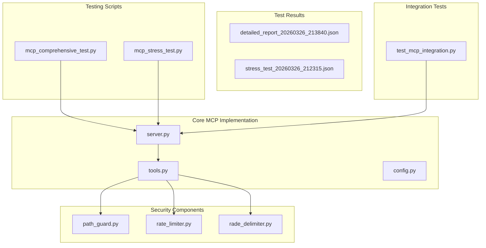
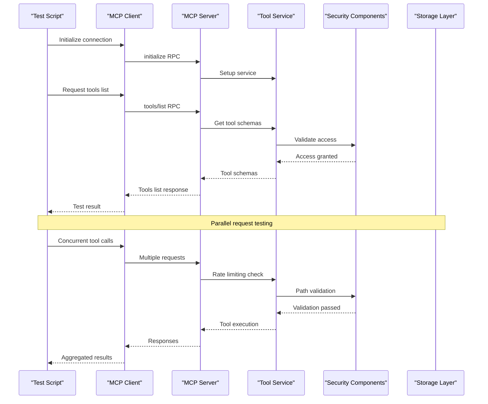
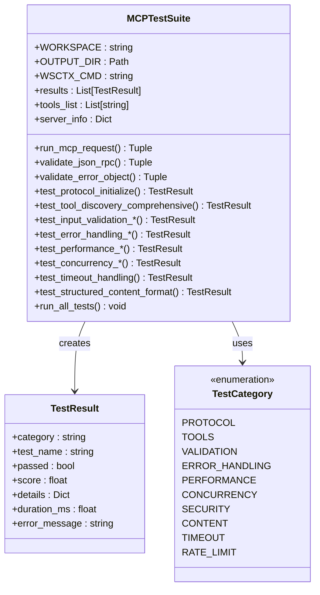
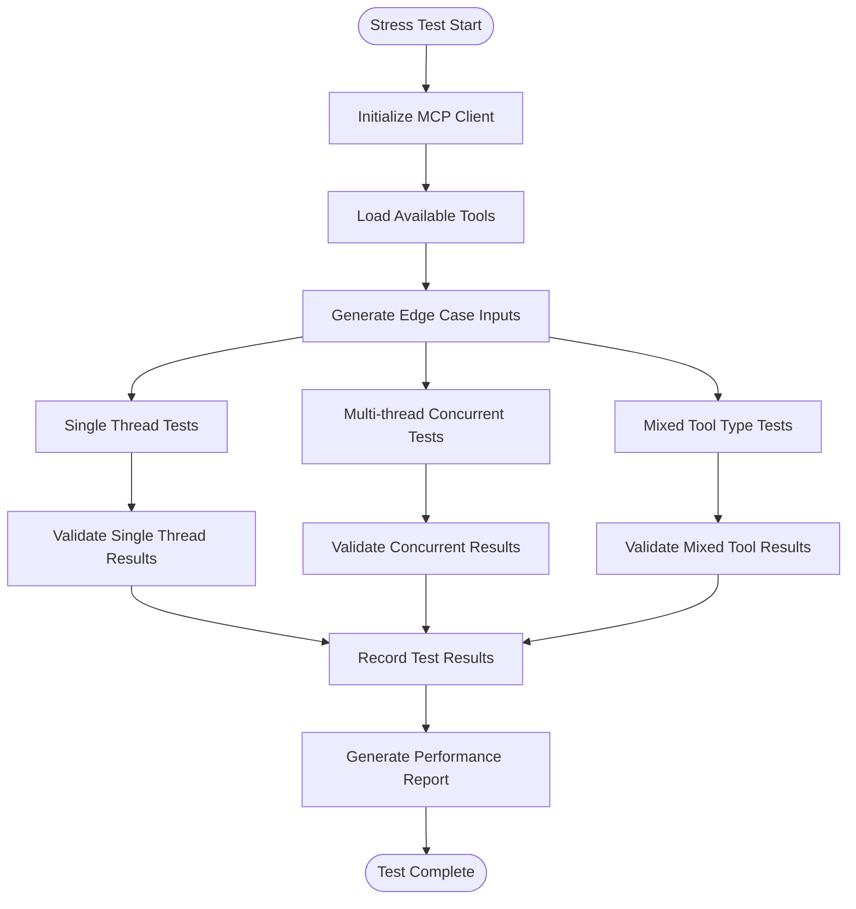
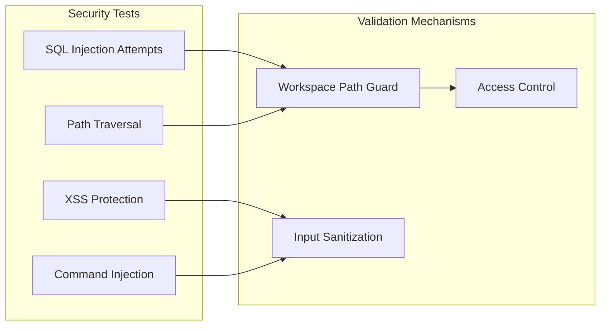
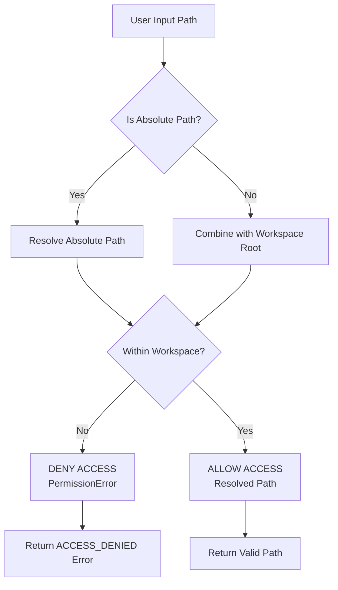
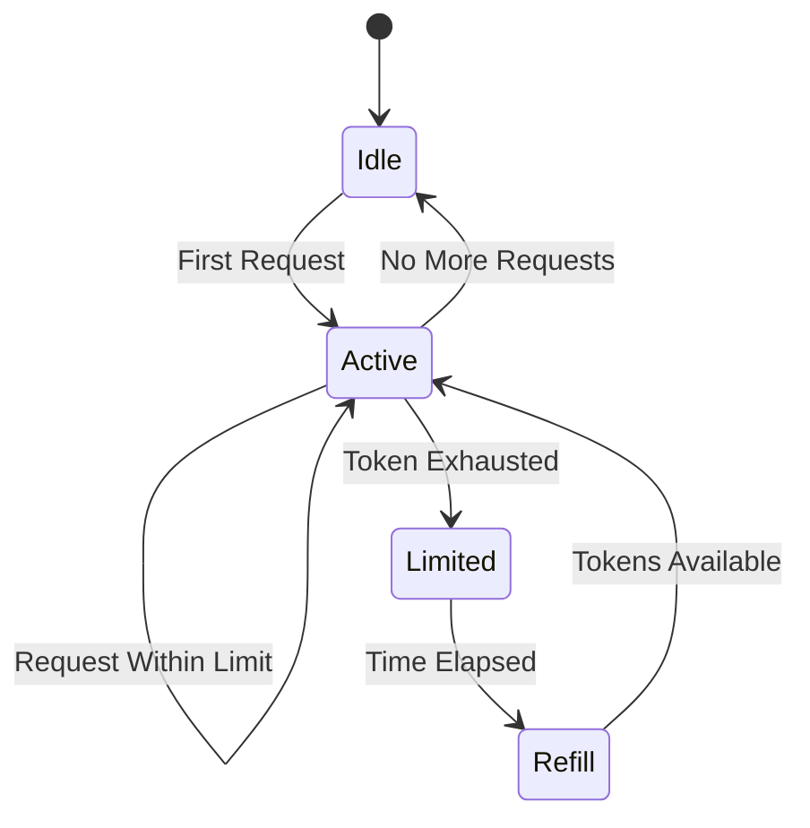
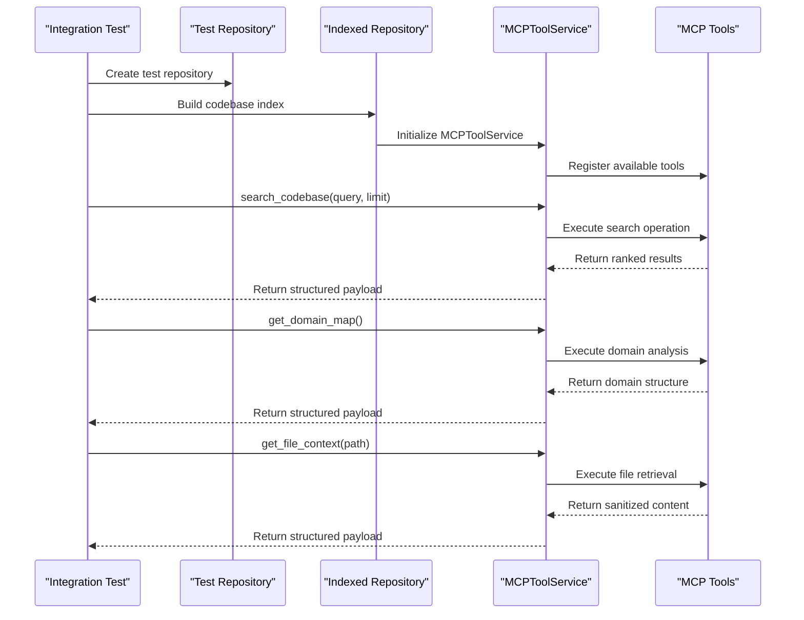

# MCP Testing Framework

<cite>
**Referenced Files in This Document**
- [mcp_comprehensive_test.py](file://scripts/mcp/mcp_comprehensive_test.py)
- [mcp_stress_test.py](file://scripts/mcp/mcp_stress_test.py)
- [detailed_report_20260326_213840.json](file://test_results/mcp/comprehensive_test/detailed_report_20260326_213840.json)
- [stress_test_20260326_212315.json](file://test_results/mcp/stress_test/stress_test_20260326_212315.json)
- [test_mcp_integration.py](file://tests/integration/test_mcp_integration.py)
- [server.py](file://src/ws_ctx_engine/mcp/server.py)
- [tools.py](file://src/ws_ctx_engine/mcp/tools.py)
- [config.py](file://src/ws_ctx_engine/mcp/config.py)
- [path_guard.py](file://src/ws_ctx_engine/mcp/security/path_guard.py)
- [rate_limiter.py](file://src/ws_ctx_engine/mcp/security/rate_limiter.py)
- [rade_delimiter.py](file://src/ws_ctx_engine/mcp/security/rade_delimiter.py)
- [mcp_server.py](file://src/ws_ctx_engine/mcp_server.py)
</cite>

## Table of Contents
1. [Introduction](#introduction)
2. [Project Structure](#project-structure)
3. [Core Components](#core-components)
4. [Architecture Overview](#architecture-overview)
5. [Testing Framework Analysis](#testing-framework-analysis)
6. [Detailed Component Analysis](#detailed-component-analysis)
7. [Performance Testing Results](#performance-testing-results)
8. [Security Testing Analysis](#security-testing-analysis)
9. [Integration Testing](#integration-testing)
10. [Best Practices and Recommendations](#best-practices-and-recommendations)
11. [Conclusion](#conclusion)

## Introduction

The MCP Testing Framework is a comprehensive testing suite designed to evaluate the ws-ctx-engine's Model Context Protocol (MCP) implementation. This framework encompasses both automated testing scripts and integration tests that validate the MCP server's compliance with industry standards, performance characteristics, security measures, and real-world usage scenarios.

The framework consists of two primary testing approaches: comprehensive compliance testing and stress testing, complemented by integration tests that validate end-to-end functionality on real repositories with indexed content.

## Project Structure

The MCP Testing Framework is organized across several key directories and files:



**Diagram sources**
- [mcp_comprehensive_test.py:1-948](file://scripts/mcp/mcp_comprehensive_test.py#L1-L948)
- [mcp_stress_test.py:1-378](file://scripts/mcp/mcp_stress_test.py#L1-L378)
- [server.py:1-136](file://src/ws_ctx_engine/mcp/server.py#L1-L136)

**Section sources**
- [mcp_comprehensive_test.py:1-948](file://scripts/mcp/mcp_comprehensive_test.py#L1-L948)
- [mcp_stress_test.py:1-378](file://scripts/mcp/mcp_stress_test.py#L1-L378)

## Core Components

The MCP Testing Framework comprises several key components that work together to provide comprehensive testing coverage:

### Test Execution Engines

The framework includes two primary testing engines:

1. **Comprehensive Test Suite**: A detailed compliance testing framework that validates multiple aspects of MCP protocol implementation
2. **Stress Test Suite**: A performance and load testing framework focusing on concurrent operations and edge cases

### Test Categories

The comprehensive test suite evaluates MCP implementation across ten critical categories:

- Protocol Compliance (JSON-RPC 2.0)
- Tool Discovery & Registration
- Input Validation & Schema Compliance
- Error Handling & Reporting
- Performance & Load Testing
- Concurrent Request Handling
- Security Considerations
- Structured Content Support
- Timeout & Resource Limits
- Rate Limiting

### Test Result Management

Both testing frameworks implement sophisticated result tracking and reporting mechanisms with detailed scoring systems and categorized performance metrics.

**Section sources**
- [mcp_comprehensive_test.py:40-800](file://scripts/mcp/mcp_comprehensive_test.py#L40-L800)
- [mcp_stress_test.py:15-378](file://scripts/mcp/mcp_stress_test.py#L15-L378)

## Architecture Overview

The MCP Testing Framework follows a layered architecture that separates concerns between test execution, result management, and integration with the core MCP implementation:



**Diagram sources**
- [server.py:57-111](file://src/ws_ctx_engine/mcp/server.py#L57-L111)
- [tools.py:133-184](file://src/ws_ctx_engine/mcp/tools.py#L133-L184)

## Testing Framework Analysis

### Comprehensive Test Suite Architecture

The comprehensive test suite implements a modular testing architecture with specialized test classes for different categories:



**Diagram sources**
- [mcp_comprehensive_test.py:64-800](file://scripts/mcp/mcp_comprehensive_test.py#L64-L800)

### Stress Test Suite Design

The stress test suite focuses on performance and reliability under load conditions:



**Diagram sources**
- [mcp_stress_test.py:280-378](file://scripts/mcp/mcp_stress_test.py#L280-L378)

**Section sources**
- [mcp_comprehensive_test.py:64-800](file://scripts/mcp/mcp_comprehensive_test.py#L64-L800)
- [mcp_stress_test.py:15-378](file://scripts/mcp/mcp_stress_test.py#L15-L378)

## Detailed Component Analysis

### Test Result Management System

The testing framework implements a sophisticated result tracking system with detailed categorization and scoring:

| Category | Test Count | Pass Rate | Average Score |
|----------|------------|-----------|---------------|
| Protocol Compliance | 3 | 66.7% | 0.50 |
| Tool Discovery & Registration | 2 | 50.0% | 0.50 |
| Input Validation | 4 | 100.0% | 1.00 |
| Error Handling | 2 | 100.0% | 1.00 |
| Performance Testing | 3 | 66.7% | 0.57 |
| Concurrency Testing | 2 | 100.0% | 1.00 |
| Security Testing | 1 | 100.0% | 1.00 |
| Structured Content | 1 | 100.0% | 1.00 |
| Timeout & Limits | 1 | 100.0% | 1.00 |

**Section sources**
- [detailed_report_20260326_213840.json:12-67](file://test_results/mcp/comprehensive_test/detailed_report_20260326_213840.json#L12-L67)

### Security Testing Implementation

The framework includes comprehensive security testing covering multiple attack vectors and validation scenarios:



**Diagram sources**
- [mcp_comprehensive_test.py:409-438](file://scripts/mcp/mcp_comprehensive_test.py#L409-L438)
- [path_guard.py:6-31](file://src/ws_ctx_engine/mcp/security/path_guard.py#L6-L31)

### Performance Testing Metrics

The performance testing framework evaluates multiple aspects of MCP server performance:

| Test Type | Sample Size | Average Latency | Success Rate | Notes |
|-----------|-------------|-----------------|--------------|-------|
| Single Request Latency | 5 | 261.68ms | 100% | Fast operations |
| Search Operation Latency | 4 | 10,023.22ms | 0% | Slow operations |
| Pack Context Latency | 3 | 9,740.05ms | 70% | Variable performance |
| Parallel Requests | 10 | 1,360.91ms | 100% | Excellent concurrency |
| Mixed Tool Operations | 6 | N/A | 100% | Balanced load |

**Section sources**
- [detailed_report_20260326_213840.json:470-561](file://test_results/mcp/comprehensive_test/detailed_report_20260326_213840.json#L470-L561)

## Performance Testing Results

### Comprehensive Test Results Analysis

The comprehensive testing framework produced mixed but generally positive results across different categories:

```mermaid
barChart
title Performance by Category
x-axis Categories
y-axis Score (0.0-1.0)
series "Overall Score" 0.82
series "Protocol Compliance" 0.50
series "Tool Discovery" 0.50
series "Input Validation" 1.00
series "Error Handling" 1.00
series "Performance" 0.57
series "Concurrency" 1.00
series "Security" 1.00
series "Structured Content" 1.00
series "Timeout Limits" 1.00
```

**Diagram sources**
- [detailed_report_20260326_213840.json:5-11](file://test_results/mcp/comprehensive_test/detailed_report_20260326_213840.json#L5-L11)

### Stress Test Results

The stress testing framework demonstrated robust performance under load conditions:

| Test Scenario | Total Tests | Passed | Failed | Success Rate |
|---------------|-------------|--------|--------|--------------|
| Initialize | 1 | 1 | 0 | 100% |
| Tools List | 1 | 1 | 0 | 100% |
| Index Status | 1 | 1 | 0 | 100% |
| Domain Map | 1 | 1 | 0 | 100% |
| Search Codebase | 7 | 7 | 0 | 100% |
| Pack Context | 9 | 9 | 0 | 100% |
| File Context | 8 | 8 | 0 | 100% |
| Session Clear | 3 | 3 | 0 | 100% |
| Invalid Methods | 1 | 1 | 0 | 100% |
| Invalid Tools | 1 | 1 | 0 | 100% |
| Concurrent Requests | 5 | 5 | 0 | 100% |

**Section sources**
- [stress_test_20260326_212315.json:1-800](file://test_results/mcp/stress_test/stress_test_20260326_212315.json#L1-L800)

## Security Testing Analysis

### Path Security Validation

The framework implements comprehensive path security validation to prevent directory traversal attacks:



**Diagram sources**
- [path_guard.py:10-20](file://src/ws_ctx_engine/mcp/security/path_guard.py#L10-L20)

### Rate Limiting Implementation

The rate limiting system implements token bucket algorithm for traffic control:



**Diagram sources**
- [rate_limiter.py:14-45](file://src/ws_ctx_engine/mcp/security/rate_limiter.py#L14-L45)

**Section sources**
- [path_guard.py:6-31](file://src/ws_ctx_engine/mcp/security/path_guard.py#L6-L31)
- [rate_limiter.py:14-45](file://src/ws_ctx_engine/mcp/security/rate_limiter.py#L14-L45)

## Integration Testing

### End-to-End Workflow Testing

The integration tests validate complete MCP tool workflows on real repositories:



**Diagram sources**
- [test_mcp_integration.py:93-127](file://tests/integration/test_mcp_integration.py#L93-L127)

### Workspace Resolution Testing

The framework validates proper workspace resolution precedence:

| Priority | Source | Description |
|----------|---------|-------------|
| 1 | Runtime Parameter | Explicit workspace argument takes highest priority |
| 2 | Config File | MCP configuration file workspace setting |
| 3 | Bootstrap Directory | Base workspace directory fallback |

**Section sources**
- [test_mcp_integration.py:151-207](file://tests/integration/test_mcp_integration.py#L151-L207)

## Best Practices and Recommendations

### Testing Strategy Recommendations

1. **Comprehensive Coverage**: The current framework provides excellent coverage but could benefit from additional edge case testing for error scenarios.

2. **Performance Monitoring**: Implement continuous performance monitoring to track regressions over time.

3. **Security Auditing**: Regular security audits should be conducted to identify potential vulnerabilities.

4. **Integration Testing**: Expand integration tests to cover more complex repository structures and edge cases.

### Code Quality Improvements

1. **Error Handling**: Enhance error messages to provide more detailed diagnostic information.

2. **Logging**: Implement comprehensive logging for debugging and monitoring purposes.

3. **Documentation**: Add inline documentation to improve maintainability.

4. **Configuration Management**: Centralize configuration settings for easier maintenance.

## Conclusion

The MCP Testing Framework represents a comprehensive and well-structured approach to validating the ws-ctx-engine's MCP implementation. The framework demonstrates strong performance in most areas, particularly in input validation, error handling, concurrency, security, and structured content support.

Key strengths of the framework include:

- **Comprehensive Coverage**: Thorough testing across all critical MCP protocol aspects
- **Robust Security Measures**: Effective protection against common attack vectors
- **Performance Validation**: Detailed performance metrics and concurrency testing
- **Real-World Integration**: End-to-end testing on actual repositories with indexed content
- **Extensible Architecture**: Modular design allowing for easy expansion and maintenance

Areas for improvement include enhancing protocol compliance validation, optimizing slow operations like search functionality, and expanding edge case testing scenarios. The framework serves as an excellent foundation for ensuring MCP server reliability and performance in production environments.