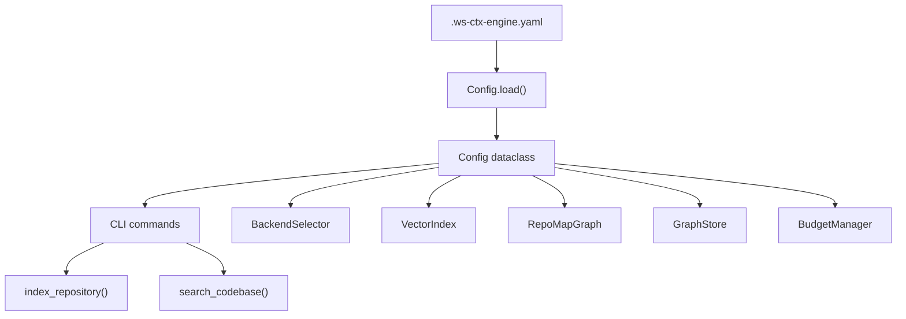
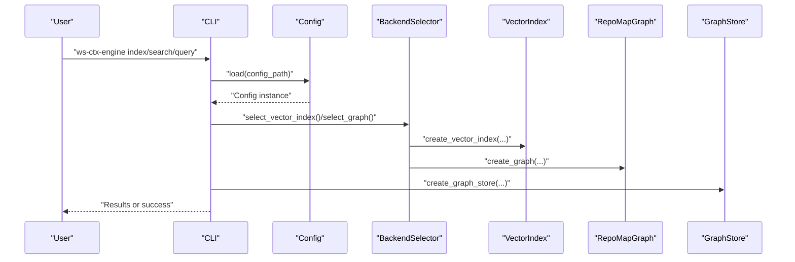
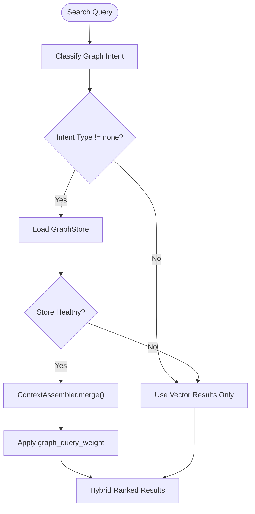
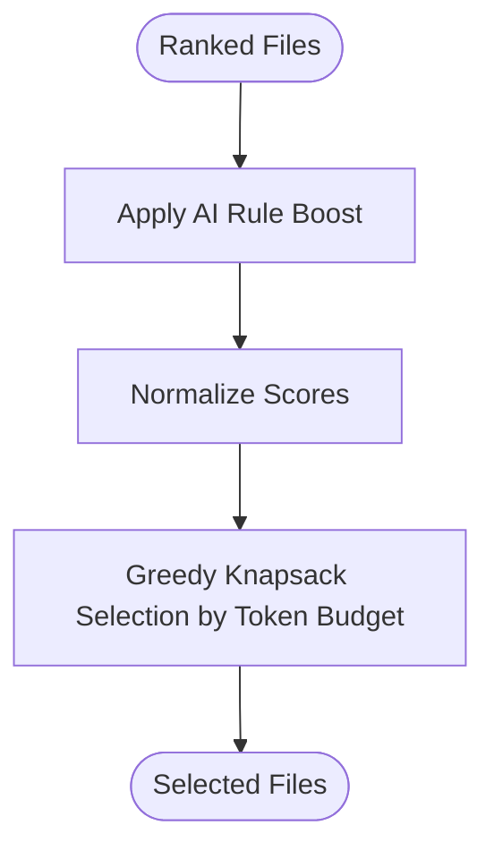
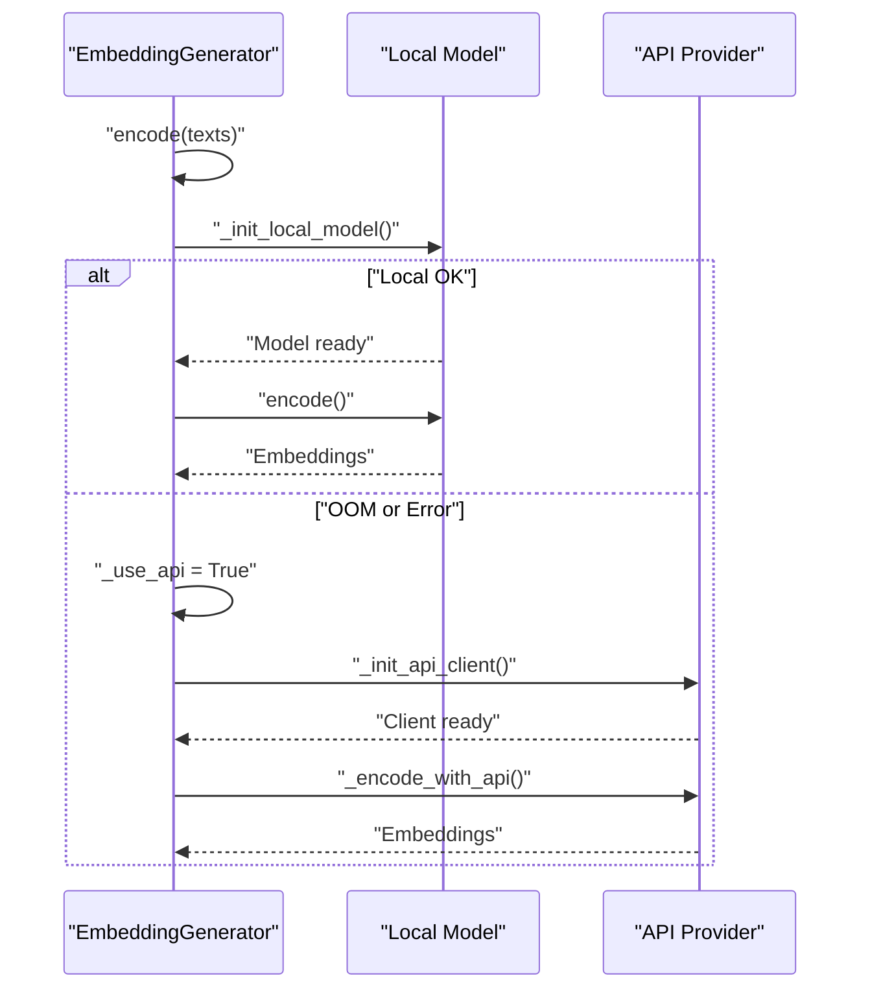
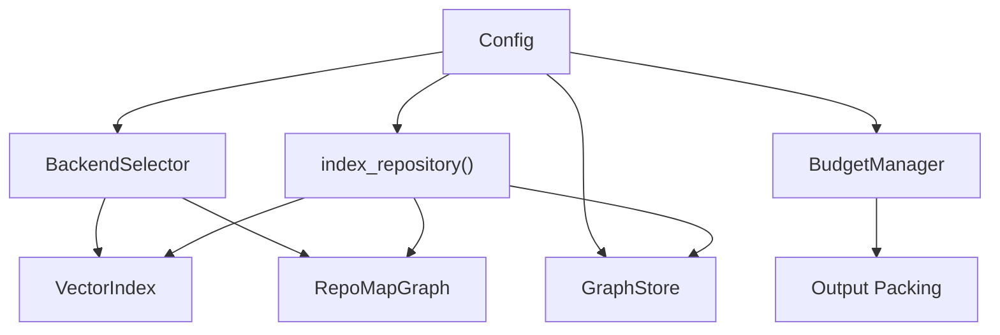

# Configuration Management

<cite>
**Referenced Files in This Document**
- [config.py](file://src/ws_ctx_engine/config/config.py)
- [.ws-ctx-engine.yaml.example](file://.ws-ctx-engine.yaml.example)
- [backend_selector.py](file://src/ws_ctx_engine/backend_selector/backend_selector.py)
- [graph.py](file://src/ws_ctx_engine/graph/graph.py)
- [cozo_store.py](file://src/ws_ctx_engine/graph/cozo_store.py)
- [context_assembler.py](file://src/ws_ctx_engine/graph/context_assembler.py)
- [vector_index.py](file://src/ws_ctx_engine/vector_index/vector_index.py)
- [ranker.py](file://src/ws_ctx_engine/ranking/ranker.py)
- [cli.py](file://src/ws_ctx_engine/cli/cli.py)
- [indexer.py](file://src/ws_ctx_engine/workflow/indexer.py)
- [query.py](file://src/ws_ctx_engine/workflow/query.py)
- [budget.py](file://src/ws_ctx_engine/budget/budget.py)
- [models.py](file://src/ws_ctx_engine/models/models.py)
- [errors.py](file://src/ws_ctx_engine/errors/errors.py)
- [mcp_server.py](file://src/ws_ctx_engine/mcp/server.py)
- [mcp_tools.py](file://src/ws_ctx_engine/mcp/tools.py)
- [mcp_config.py](file://src/ws_ctx_engine/mcp/config.py)
- [test_config.py](file://tests/unit/test_config.py)
- [test_config_integration.py](file://tests/integration/test_config_integration.py)
- [test_config_graph_store.py](file://tests/unit/test_config_graph_store.py)
- [MCP_PERFORMANCE_OPTIMIZATION.md](file://docs/performance/MCP_PERFORMANCE_OPTIMIZATION.md)
</cite>

## Update Summary
**Changes Made**
- Added comprehensive documentation for new graph store configuration settings
- Updated configuration reference to include graph store storage types and path configuration
- Added documentation for graph query weighting parameters and context assembler settings
- Enhanced MCP server performance optimization coverage
- Updated practical examples to include graph store configuration scenarios

## Table of Contents
1. [Introduction](#introduction)
2. [Project Structure](#project-structure)
3. [Core Components](#core-components)
4. [Architecture Overview](#architecture-overview)
5. [Detailed Component Analysis](#detailed-component-analysis)
6. [Dependency Analysis](#dependency-analysis)
7. [Performance Considerations](#performance-considerations)
8. [Troubleshooting Guide](#troubleshooting-guide)
9. [Conclusion](#conclusion)
10. [Appendices](#appendices)

## Introduction
This document provides comprehensive configuration documentation for ws-ctx-engine. It explains the YAML configuration structure, validation rules, defaults, and how configuration impacts system behavior across output formatting, hybrid ranking, file filtering, backend selection, graph store integration, and performance tuning. It also covers environment variable integration for embeddings, configuration precedence, and practical examples for common use cases such as code review, bug fixing, documentation work, and graph-enhanced search workflows.

## Project Structure
Configuration is centralized in a dataclass that loads from a YAML file with robust validation and sensible defaults. The CLI integrates configuration with runtime behavior, and the indexing/querying workflows consume configuration to drive backend selection, embedding generation, graph store management, and output formatting.

**Diagram sources**
- [config.py:112-215](file://src/ws_ctx_engine/config/config.py#L112-L215)
- [cli.py:406-778](file://src/ws_ctx_engine/cli/cli.py#L406-L778)
- [indexer.py:72-371](file://src/ws_ctx_engine/workflow/indexer.py#L72-L371)
- [backend_selector.py:13-191](file://src/ws_ctx_engine/backend_selector/backend_selector.py#L13-L191)

**Section sources**
- [config.py:16-111](file://src/ws_ctx_engine/config/config.py#L16-L111)
- [cli.py:406-778](file://src/ws_ctx_engine/cli/cli.py#L406-L778)

## Core Components
- Config: Central configuration dataclass with fields for output, scoring weights, file filtering, backend selection, embeddings, graph store settings, and performance tuning. Includes validation and defaults.
- BackendSelector: Orchestrates backend selection with graceful fallback chains for vector index, graph, and embeddings.
- VectorIndex and EmbeddingGenerator: Implementations for semantic search and embedding generation with local and API fallback.
- RepoMapGraph: Implements PageRank-based structural ranking with igraph and NetworkX backends.
- GraphStore: CozoDB-backed graph storage with multiple storage backends (memory, RocksDB, SQLite).
- ContextAssembler: Merges vector retrieval results with graph query results using configurable weighting.
- BudgetManager: Token-aware file selection using a greedy knapsack algorithm.
- CLI: Loads configuration, applies runtime overrides, validates dependencies, and executes workflows.

**Section sources**
- [config.py:16-111](file://src/ws_ctx_engine/config/config.py#L16-L111)
- [backend_selector.py:13-191](file://src/ws_ctx_engine/backend_selector/backend_selector.py#L13-L191)
- [vector_index.py:21-83](file://src/ws_ctx_engine/vector_index/vector_index.py#L21-L83)
- [graph.py:19-95](file://src/ws_ctx_engine/graph/graph.py#L19-L95)
- [cozo_store.py:59-91](file://src/ws_ctx_engine/graph/cozo_store.py#L59-L91)
- [context_assembler.py:29-44](file://src/ws_ctx_engine/graph/context_assembler.py#L29-L44)
- [budget.py:8-50](file://src/ws_ctx_engine/budget/budget.py#L8-L50)
- [cli.py:406-778](file://src/ws_ctx_engine/cli/cli.py#L406-L778)

## Architecture Overview
The configuration system follows a predictable flow: YAML file is loaded, validated, merged with defaults, and consumed by downstream components. BackendSelector resolves backends according to configuration and availability. Indexing and querying workflows use configuration to control behavior such as incremental indexing, embedding caching, graph store integration, and output format.

**Diagram sources**
- [cli.py:406-778](file://src/ws_ctx_engine/cli/cli.py#L406-L778)
- [config.py:112-215](file://src/ws_ctx_engine/config/config.py#L112-L215)
- [backend_selector.py:36-118](file://src/ws_ctx_engine/backend_selector/backend_selector.py#L36-L118)

## Detailed Component Analysis

### Configuration File Structure and Validation
- Output settings
  - format: Output format for context packs. Valid values include xml, zip, json, yaml, md, and toon (experimental). Defaults to zip.
  - token_budget: Maximum tokens allocated for LLM context window. Defaults to 100000. Must be positive.
  - output_path: Directory for generated context packs. Defaults to ./output.
- Scoring weights
  - semantic_weight: Weight for semantic similarity (0.0–1.0). Defaults to 0.6.
  - pagerank_weight: Weight for PageRank structural importance (0.0–1.0). Defaults to 0.4.
  - Validation ensures weights sum to approximately 1.0; warnings are issued otherwise.
- File filtering
  - include_tests: Whether to include test files. Defaults to False.
  - respect_gitignore: Whether to respect .gitignore patterns. Defaults to True.
  - include_patterns: List of glob patterns for inclusion. Defaults include many common languages.
  - exclude_patterns: List of glob patterns for exclusion. Defaults exclude typical build caches and artifacts.
- Backend selection
  - backends.vector_index: auto | native-leann | leann | faiss. Defaults to auto.
  - backends.graph: auto | igraph | networkx. Defaults to auto.
  - backends.embeddings: auto | local | api. Defaults to auto.
- Embeddings configuration
  - model: Sentence-transformers model name. Defaults to all-MiniLM-L6-v2.
  - device: cpu | cuda | mps. Defaults to cpu.
  - batch_size: Positive integer for batching. Defaults to 32.
  - api_provider: Provider for API fallback (openai). Defaults to openai.
  - api_key_env: Environment variable name for API key. Defaults to OPENAI_API_KEY.
- Graph store settings (Sub-phase 2c)
  - graph_store_enabled: Enable/disable graph store integration. Defaults to True.
  - graph_store_storage: Storage backend selection. Values: mem | rocksdb | sqlite. Defaults to rocksdb.
  - graph_store_path: Database file path. Defaults to .ws-ctx-engine/graph.db.
- Phase 3 — ContextAssembler + Query Routing
  - context_assembler_enabled: Enable/disable graph augmentation. Defaults to True.
  - graph_query_weight: Weight for graph query results in hybrid search (0.0–1.0). Defaults to 0.3.
- Performance tuning
  - max_workers: Reserved for future parallel processing. Defaults to 4.
  - cache_embeddings: Persist embeddings to disk to avoid recomputation. Defaults to True.
  - incremental_index: Enable incremental indexing via --incremental flag. Defaults to True.
- AI rule persistence
  - auto_detect: Auto-detect and always include AI rule files. Defaults to True.
  - extra_files: Additional AI rule file names/paths to include. Defaults to [].
  - boost: Score boost for AI rule files. Defaults to 10.0.

Validation behavior:
- Invalid types or values are logged and replaced with defaults/fallbacks.
- Empty or missing files use defaults.
- Unknown fields are ignored.
- Weight sums outside [0.99, 1.01] produce a warning.
- graph_query_weight must be in [0.0, 1.0]; invalid values use default 0.3.

Environment variables:
- OPENAI_API_KEY is used by default for embeddings API fallback.
- Other providers can be configured via api_provider and api_key_env.

Configuration precedence:
- CLI flags override configuration for specific options (e.g., format, budget).
- Runtime dependency checks can adjust backend selections when auto is used.

Practical examples:
- Code review: Emphasize structural importance (higher pagerank_weight) and use zip format.
- Bug fixing: Emphasize semantic similarity (higher semantic_weight) and smaller token budget.
- Documentation: Narrow include_patterns to API/public interfaces and adjust weights accordingly.
- Graph-enhanced search: Enable graph_store_enabled and adjust graph_query_weight for hybrid results.

**Section sources**
- [config.py:16-111](file://src/ws_ctx_engine/config/config.py#L16-L111)
- [config.py:115-131](file://src/ws_ctx_engine/config/config.py#L115-L131)
- [config.py:133-138](file://src/ws_ctx_engine/config/config.py#L133-L138)
- [config.py:140-181](file://src/ws_ctx_engine/config/config.py#L140-L181)
- [config.py:183-277](file://src/ws_ctx_engine/config/config.py#L183-L277)
- [.ws-ctx-engine.yaml.example:1-269](file://.ws-ctx-engine.yaml.example#L1-L269)
- [cli.py:789-800](file://src/ws_ctx_engine/cli/cli.py#L789-L800)
- [cli.py:120-136](file://src/ws_ctx_engine/cli/cli.py#L120-L136)

### Graph Store Configuration and Integration
The graph store provides persistent graph storage with multiple backend options and seamless integration with the search pipeline.

**Graph Store Storage Types:**
- mem: In-memory storage for testing and ephemeral usage
- rocksdb: Persistent RocksDB storage for production environments
- sqlite: Persistent SQLite storage for lightweight deployments

**Configuration Parameters:**
- graph_store_enabled: Controls whether graph store is used (default: True)
- graph_store_storage: Storage backend selection (default: rocksdb)
- graph_store_path: Database file path (default: .ws-ctx-engine/graph.db)

**Integration Flow:**
The graph store integrates with the search pipeline through ContextAssembler, which merges vector search results with graph query results using configurable weighting.

**Diagram sources**
- [query.py:46-76](file://src/ws_ctx_engine/workflow/query.py#L46-L76)
- [context_assembler.py:29-44](file://src/ws_ctx_engine/graph/context_assembler.py#L29-L44)
- [cozo_store.py:59-91](file://src/ws_ctx_engine/graph/cozo_store.py#L59-L91)

**Section sources**
- [config.py:115-118](file://src/ws_ctx_engine/config/config.py#L115-L118)
- [config.py:238-267](file://src/ws_ctx_engine/config/config.py#L238-L267)
- [cozo_store.py:41-56](file://src/ws_ctx_engine/graph/cozo_store.py#L41-L56)
- [query.py:28-44](file://src/ws_ctx_engine/workflow/query.py#L28-L44)
- [query.py:46-76](file://src/ws_ctx_engine/workflow/query.py#L46-L76)
- [context_assembler.py:29-44](file://src/ws_ctx_engine/graph/context_assembler.py#L29-L44)

### Backend Selection Strategies
BackendSelector chooses backends based on configuration and runtime availability:
- Vector index: native-leann (primary), leann (fallback), faiss (fallback).
- Graph: igraph (primary), networkx (fallback).
- Embeddings: local (primary), api (fallback).

Fallback levels:
- Level 1: igraph + native-leann + local embeddings (optimal).
- Level 2: networkx + native-leann + local embeddings.
- Level 3: networkx + leann + local embeddings.
- Level 4: networkx + faiss + local embeddings.
- Level 5: networkx + faiss + api embeddings.
- Level 6: file size ranking only (no graph).

Runtime dependency preflight adjusts auto-selected backends and reports missing dependencies.

**Section sources**
- [backend_selector.py:13-191](file://src/ws_ctx_engine/backend_selector/backend_selector.py#L13-L191)
- [graph.py:572-621](file://src/ws_ctx_engine/graph/graph.py#L572-L621)
- [vector_index.py:280-501](file://src/ws_ctx_engine/vector_index/vector_index.py#L280-L501)
- [cli.py:256-327](file://src/ws_ctx_engine/cli/cli.py#L256-L327)

### Hybrid Ranking and AI Rule Boost
Hybrid ranking combines semantic similarity and PageRank scores with weights from configuration. AI rule persistence ensures canonical rule files (e.g., AGENTS.md, .cursorrules) are always included with a large score boost.

**Diagram sources**
- [ranker.py:28-86](file://src/ws_ctx_engine/ranking/ranker.py#L28-L86)
- [budget.py:50-105](file://src/ws_ctx_engine/budget/budget.py#L50-L105)

**Section sources**
- [ranker.py:12-26](file://src/ws_ctx_engine/ranking/ranker.py#L12-L26)
- [ranker.py:28-86](file://src/ws_ctx_engine/ranking/ranker.py#L28-L86)
- [budget.py:8-50](file://src/ws_ctx_engine/budget/budget.py#L8-L50)

### Embedding Model Configurations and Fallback
EmbeddingGenerator attempts local sentence-transformers first and falls back to API (OpenAI) when memory constraints or errors occur. Configuration controls model, device, batch size, provider, and API key environment variable.

**Diagram sources**
- [vector_index.py:94-278](file://src/ws_ctx_engine/vector_index/vector_index.py#L94-L278)

**Section sources**
- [vector_index.py:94-278](file://src/ws_ctx_engine/vector_index/vector_index.py#L94-L278)
- [config.py:83-92](file://src/ws_ctx_engine/config/config.py#L83-L92)

### Performance Tuning Settings
- cache_embeddings: Persist embeddings to disk to skip recomputation on subsequent runs.
- incremental_index: Enable incremental indexing via --incremental flag; respects configuration disabling.
- max_workers: Reserved for future parallelization.

MCP Server Performance Optimizations:
- Pre-warm model loading to reduce first-query latency
- Thread-safe singleton pattern for embedding model caching
- Rate limiting and caching for tool responses
- Lazy loading of graph store for on-demand access

Indexing workflow:
- Parses codebase, builds vector index and graph, saves indexes and metadata, and optionally updates incrementally.

**Section sources**
- [config.py:94-101](file://src/ws_ctx_engine/config/config.py#L94-L101)
- [indexer.py:72-371](file://src/ws_ctx_engine/workflow/indexer.py#L72-L371)
- [mcp_server.py:57-66](file://src/ws_ctx_engine/mcp/server.py#L57-L66)
- [mcp_tools.py:31-55](file://src/ws_ctx_engine/mcp/tools.py#L31-L55)
- [MCP_PERFORMANCE_OPTIMIZATION.md:750-800](file://docs/performance/MCP_PERFORMANCE_OPTIMIZATION.md#L750-L800)

### Practical Configuration Examples
- Code review workflow: Increase pagerank_weight, use zip format, and include project-specific patterns.
- Bug investigation: Increase semantic_weight, reduce token_budget, and switch to xml for paste-friendly output.
- Documentation generation: Narrow include_patterns to API/public interfaces and balance weights.
- Graph-enhanced search: Enable graph_store_enabled, set graph_store_storage to rocksdb for production, and adjust graph_query_weight (0.2-0.5 recommended).
- MCP server deployment: Configure rate limits, cache TTL, and workspace paths for production environments.

Examples are provided in the example configuration file with comments and guidance.

**Section sources**
- [.ws-ctx-engine.yaml.example:210-269](file://.ws-ctx-engine.yaml.example#L210-L269)

## Dependency Analysis
Configuration drives backend selection and runtime behavior. The CLI orchestrates dependency checks and applies configuration to workflows.

**Diagram sources**
- [config.py:112-215](file://src/ws_ctx_engine/config/config.py#L112-L215)
- [backend_selector.py:13-191](file://src/ws_ctx_engine/backend_selector/backend_selector.py#L13-L191)
- [indexer.py:72-371](file://src/ws_ctx_engine/workflow/indexer.py#L72-L371)
- [budget.py:8-50](file://src/ws_ctx_engine/budget/budget.py#L8-L50)

**Section sources**
- [cli.py:256-327](file://src/ws_ctx_engine/cli/cli.py#L256-L327)
- [indexer.py:72-371](file://src/ws_ctx_engine/workflow/indexer.py#L72-L371)

## Performance Considerations
- Choose backends based on environment: native-leann + igraph for optimal speed; fallback to leann/faiss/networkx when dependencies are missing.
- Tune batch_size for embeddings to balance throughput and memory usage.
- Enable cache_embeddings to avoid recomputation across runs.
- Use incremental_index to minimize rebuild costs when only a subset of files changed.
- Adjust token_budget per model capacity and reserve ~20% for metadata.
- For graph store: Use rocksdb for production, mem for testing, and sqlite for lightweight deployments.
- Configure graph_query_weight (0.2-0.5) for balanced hybrid search results.
- MCP server benefits from pre-warmed models and proper rate limiting configuration.

## Troubleshooting Guide
Common configuration issues and resolutions:
- Invalid format: Ensure format is one of xml, zip, json, yaml, md, toon.
- Invalid token_budget: Must be a positive integer.
- Weights out of range or not summing to 1.0: Adjust semantic_weight and pagerank_weight to [0.0, 1.0] and ensure their sum is close to 1.0.
- Invalid backend values: Use allowed values for backends.vector_index, backends.graph, backends.embeddings.
- Missing embeddings API key: Set api_key_env to a valid environment variable containing the key.
- Empty or unreadable YAML: The system falls back to defaults; ensure the file is valid YAML.
- Dependency errors: Use the doctor command to diagnose missing optional dependencies.
- Graph store issues: Check pycozo installation, database path permissions, and schema compatibility.
- Invalid graph_store_storage: Must be mem, rocksdb, or sqlite; defaults to rocksdb on invalid values.
- Invalid graph_query_weight: Must be in [0.0, 1.0]; defaults to 0.3 on invalid values.

Validation and error reporting:
- ConfigurationError provides actionable suggestions for invalid values and missing files.
- Runtime dependency preflight raises detailed errors when required packages are missing.
- Graph store health is checked and degraded gracefully on failures.

**Section sources**
- [config.py:217-399](file://src/ws_ctx_engine/config/config.py#L217-L399)
- [errors.py:89-177](file://src/ws_ctx_engine/errors/errors.py#L89-L177)
- [cli.py:329-364](file://src/ws_ctx_engine/cli/cli.py#L329-L364)
- [test_config.py:148-494](file://tests/unit/test_config.py#L148-L494)
- [test_config_integration.py:16-133](file://tests/integration/test_config_integration.py#L16-L133)
- [test_config_graph_store.py:17-71](file://tests/unit/test_config_graph_store.py#L17-L71)

## Conclusion
ws-ctx-engine's configuration system offers a robust, validated, and flexible way to tailor behavior across output formatting, ranking, filtering, backend selection, graph store integration, and performance. By leveraging defaults, validation, runtime dependency checks, and MCP server optimizations, users can quickly adapt the system to diverse workflows while maintaining reliability and performance.

## Appendices

### Configuration Reference Summary
- Output settings: format, token_budget, output_path
- Scoring weights: semantic_weight, pagerank_weight
- File filtering: include_tests, respect_gitignore, include_patterns, exclude_patterns
- Backend selection: backends.vector_index, backends.graph, backends.embeddings
- Embeddings: model, device, batch_size, api_provider, api_key_env
- Graph store: graph_store_enabled, graph_store_storage, graph_store_path
- Phase 3: context_assembler_enabled, graph_query_weight
- Performance: max_workers, cache_embeddings, incremental_index
- AI rule persistence: ai_rules.auto_detect, ai_rules.extra_files, ai_rules.boost

**Section sources**
- [config.py:16-111](file://src/ws_ctx_engine/config/config.py#L16-L111)
- [config.py:115-131](file://src/ws_ctx_engine/config/config.py#L115-L131)
- [config.py:133-138](file://src/ws_ctx_engine/config/config.py#L133-L138)
- [.ws-ctx-engine.yaml.example:1-269](file://.ws-ctx-engine.yaml.example#L1-L269)